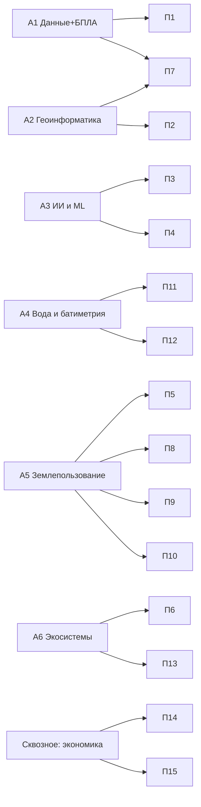

# Архитектура учебных модулей: 6 академических (А1–А6) + 15 профессиональных (П1–П15)

> Этап 1 · Роль-владелец: методолог, GIS/AI эксперты · Источник: `word-s/Раздел 2_Методология.docx` (авторитетный) + сквозной ИИ-слой по требованию заказчика (2026-07-02).
> Статус: **проект для согласования с ПРООН** (критерий эффективности Этапа 1).

## 1. Методологический принцип

**«От инструмента к применению»**: сначала цифровые и аналитические компетенции (данные → ГИС → ИИ), затем предметное применение (землепользование, агроэкология, вода, экосистемы). Дополнение 2026: **«ИИ ускоряет — человек верифицирует»** — в каждом модуле слушатель работает с ИИ-инструментами как с производственным средством и обучается проверять их результаты.

Сквозные принципы всех 21 модулей (из методологии):
- реальные открытые данные (Sentinel, Landsat, ASTER, GEE, Microsoft Planetary Computer, CDSE);
- интеграция ДЗЗ и БПЛА; открытый программный стек (Python, QGIS, Jupyter, scikit-learn, PyTorch);
- региональные кейсы (Северо-Казахстанская, Костанайская, Акмолинская области);
- каждый модуль завершается прикладным продуктом (карта, план, модель, заявка);
- уникальный датасет исполнителя — сырые батиметрические данные водоёмов Костанайской области (Zenodo, DOI);
- вертикальная интеграция А↔П.

## 2. Академические модули (А1–А6)

| Код | Название | Связь с П | Компонент FOLUR | Прикладной продукт |
|---|---|---|---|---|
| А1 | Жизненный цикл данных в агросфере (+ БПЛА и IoT) | П1, П7 | 1, 2 | Полётное задание БПЛА + обоснование выбора БПЛА/спутник |
| А2 | Геоинформатика и пространственный анализ | П2, П7 | 1, 2 | Карта землепользования района СКО (QGIS + ортофото БПЛА) |
| А3 | ИИ и машинное обучение в агроэкологическом мониторинге | П3, П4 | 1, 2, 3 | Классификация землепользования Sentinel-2 тремя подходами (RF / MiniRocket / CNN) |
| А4 | Водные ресурсы, гидрологический мониторинг, батиметрия | П11, П12 | 2, 3 | Карта глубин по сырому датасету исполнителя + NDWI-динамика |
| А5 | Устойчивое землепользование и агроэкология Северного Казахстана | П5, П8–П10 | 1, 2 | План устойчивого землепользования модельного хозяйства |
| А6 | Экосистемные услуги, биоразнообразие, восстановление земель | П6, П13 | 3 | Проект плана восстановления деградированного участка |

Полное содержание каждого модуля (фокус, тематические блоки, практикум, выходные компетенции) зафиксировано в методологии (`.work/source/razdel2-metodologiya.txt`) и переносится в шаблоны модулей платформы на Этапе 2 без сокращений.

## 3. Профессиональные модули (П1–П15), 16–40 ак. часов

| Блок | Код | Название | Связь с А | Аудитория | Результат слушателя |
|---|---|---|---|---|---|
| Данные | П1 | Управление данными в агрохозяйстве | А1 | практики | Шаблон системы учёта хозяйства |
| Данные | П2 | Введение в ГИС и открытые геоданные | А2 | практики | Карта своего хозяйства с космоснимком |
| Данные | П3 | ИИ-инструменты без программирования | А3 | фермеры, агрономы, МСБ | Настроенный NDVI-мониторинг своих полей |
| Данные | П4 | Python и Jupyter для специалистов | А3, А4 | специалисты | Рабочий Python-скрипт под свой датасет |
| Земля | П5 | Ландшафтное планирование для МСБ | А5 | руководители | Ландшафтный план хозяйства (горизонт 5 лет) |
| Земля | П6 | Оценка экосистемных услуг хозяйства | А6 | агрономы | Отчёт об экосистемных услугах территории |
| Земля | П7 | ДЗЗ и БПЛА для мониторинга земель | А1, А2 | специалисты, фермеры | Ряд NDVI + результаты облёта проблемной зоны |
| Агро | П8 | Почвосберегающее земледелие, no-till | А5 | фермеры | План перехода хозяйства на no-till |
| Агро | П9 | Севообороты и кормовая база | А5 | агрономы, МСБ | 3–5-польный севооборот хозяйства |
| Агро | П10 | «Зелёное» производство и органика | А5 | МСБ | Дорожная карта перехода на органику |
| Вода | П11 | Батиметрия и мониторинг водных объектов | А4 | МСБ, специалисты | Навык обработки собственных промеров |
| Вода | П12 | Водосбережение и ирригация | А4 | МСБ | Проект системы водосбережения участка |
| Вода | П13 | Биоразнообразие и прилегающие экосистемы | А6 | МСБ | План сохранения биоразнообразия хозяйства |
| Экономика | П14 | Субсидии, гранты, финансовые инструменты | сквозное | МСБ | Сформированная заявка на поддержку |
| Экономика | П15 | Устойчивые цепочки и маркетинг | сквозное | МСБ | Маркетинговый план «зелёной» продукции |

## 4. Матрица вертикальной интеграции А↔П



Студент бакалавриата и фермер изучают одну проблему на разной глубине по единой логике; профессиональный модуль переиспользует датасеты и кейсы своего академического «родителя» (спиральная прогрессия, практика #4 бенчмарка).

## 5. Сквозной ИИ-слой (новое требование заказчика, 2026-07-02)

Каждый модуль содержит секцию **«ИИ-ассистент в работе»** — ИИ-инструменты как часть производственного процесса, три уровня по аудитории:

| Уровень | Аудитория | Инструменты | Учебная задача |
|---|---|---|---|
| No-code | фермер, МСБ (П1–П3, П5, П6, П8–П15) | чат-ассистенты (Claude и аналоги), готовые GeoAI-сервисы, GIS Copilot в QGIS | интерпретация NDVI/карт, черновики планов и заявок, вопросы «что означает эта зона» |
| Low-code | агроном, специалист (П4, П7, П11) | Colab + LLM-ассистент, промпт-паттерны для геозадач | генерация/правка ячеек ноутбука, отладка с помощью ИИ |
| Pro-code | студент, инженер (А1–А6) | **Claude Code / OpenCode** (терминальные кодинг-агенты), агентные GeoAI-фреймворки (GIS Copilot, LLM-Find — обзорно) | постановка задачи агенту → ревью сгенерированного геопайплайна → верификация результата |

Раскладка по модулям (примеры конкретных ИИ-заданий):

- **А1**: ИИ-агент готовит план полётной миссии по параметрам (GSD, перекрытие) → студент проверяет против правовых ограничений РК.
- **А2**: GIS Copilot в QGIS строит цепочку геообработки из текстового описания; Claude Code пишет GeoPandas-скрипт зональной статистики → сверка с ручным результатом.
- **А3**: агент собирает ML-пайплайн (split → train → validate); студент ищет утечку данных и ошибки метрик в сгенерированном коде.
- **А4**: LLM-ассистент в Colab для пакетной фильтрации эхолотных промеров → контроль по опорным глубинам.
- **А5–А6**: ИИ-черновик плана землепользования/восстановления по данным хозяйства → экспертная доработка и обоснование отличий.
- **П3**: полностью no-code: настройка ИИ-мониторинга полей и критическое сравнение платных/бесплатных сервисов.
- **П4**: «первый скрипт с ИИ-напарником»: слушатель формулирует задачу, агент пишет код, слушатель исполняет и проверяет.
- **П14**: ИИ-ассистент структурирует заявку на субсидию → слушатель верифицирует нормативные ссылки (цифры субсидий — только из официальных источников, ИИ-выдумки отбраковываются как упражнение).

Инвариант слоя: **каждое ИИ-задание завершается шагом независимой верификации** (контрольные точки, визуальная сверка, метрики). Вендор-независимость: каждый инструмент заменяем открытым аналогом.

## 6. Канонический шаблон модуля (по бенчмарку 14 аналогов)

```
modules/<код>/
  index.md          # программа: цели (Bloom), таблица уроков с ⏱, ожидаемые результаты, библиография
  lectures/NN-*.md  # уроки-результаты («Считаем NDVI по полю», не «Введение в NDVI»), ⏱ метка,
                    # Mermaid-схема, региональный кейс, блок «Закрепление и применение»
                    # (Попробуйте в Colab / Границы применимости / Что это даёт хозяйству / Кейс)
  practicum/*.md    # guided-проект на региональных данных + рамка «Проект на ВАШЕЙ земле»
  ai-assistant.md   # секция «ИИ-ассистент в работе» (уровень no/low/pro-code по аудитории)
  assessment/*.md   # квизы после микро-уроков + сценарный кейс-вопрос
```

Нормативы: урок ~20–50 мин, модуль 2–2,5 ч контента на неделю; каждый модуль завершается прикладным продуктом; Colab-ссылки — плейсхолдер до создания репозитория ноутбуков.

## 7. Что выносится на согласование с ПРООН

1. Состав и названия 21 модуля (разделы 2–3) — без изменений против поданной методологии.
2. **Дополнение**: сквозной ИИ-слой (раздел 5) — расширение против ТЗ, нулевая стоимость, соответствует Компоненту 4 FOLUR (развитие потенциала).
3. Шаблон модуля и нормативы трудозатрат (раздел 6).
