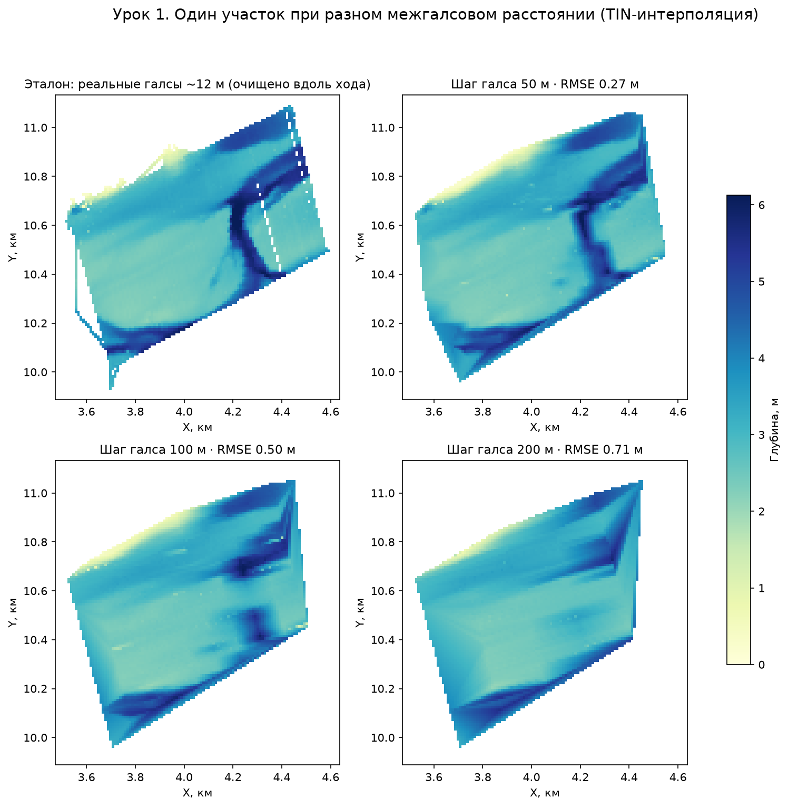

# Урок 1. Шаг галса и качество карты глубин

> Черновик для рецензии · кандидат в модуль П11 (лекция/практикум) и А4
> Все числа вычислены из реальных данных съёмки; координаты на рисунках — относительные (локальная СК уровня A).
> Визуализация v2: карты сглажены (гаусс, σ=1,5 ячейки — только показ; RMSE всегда по несглаженной поверхности); вертикальная шкала — **отметка дна, отрицательная** (0 = урез воды), см. `data-dictionary.md` о знаке глубины.

## Цель

Понять, как **межгалсовое расстояние** (шаг между линиями промеров) и **шум хода** определяют качество интерполированной карты глубин, и научиться выбирать шаг съёмки под задачу.

## Термины

- **Галс** — прямолинейный проход судна с эхолотом; съёмка ведётся серией параллельных галсов («газонокосилка», lawnmower).
- **Межгалсовое расстояние (d)** — расстояние между соседними галсами. Вдоль галса точки записываются каждые 0,3–1 м, поперёк — только на следующем галсе через d метров: **разрешение съёмки анизотропно**.
- **Ход** — непрерывный отрезок записи (выезд/включение логгера). Качество ходов различается: у нас RMS шума глубины по ходам — от 0,11 до 0,49 м (в 4 раза!).

## Данные урока

Крупнейший участок реальной съёмки: ~1×1 км, **461 900 промеров**, 20 ходов, фактический шаг галсовых линий 10 м (97 линий, `leg_id`) ([raw_figB_tracks.png](figs/raw_figB_tracks.png)).

Фактические шаги галсов на разных участках нашей съёмки (измерено по данным):

| Участок | Точек | Медианная глубина | Шаг галса |
|---|---|---|---|
| Главный (у слияния ветвей) | 469 110 | 2,9 м | **10 м** |
| Восточный глубокий | 8 770 | 12,9 м | 50 м |
| Центральный | 9 664 | 5,3 м | 50 м |
| Южная ветвь | 21 414 | 6,4 м | **75 м** |
| Северо-восточный | 10 127 | 8,2 м | 75 м |
| Старая съёмка (весь водоём) | 79 257 | — | ~300–600 м, зигзаг |

## Эксперимент (канонический): прореживаем по реальным галсовым линиям

Данные: `data/lesson-bathymetry-tracks.csv`, `patch_id == 1` — 97 галсовых линий с фактическим шагом **10 м** (колонка `leg_id`). Эталон — все линии (сетка 10 м, вдоль-трековая чистка). Прореживание: каждая k-я линия → шаг ≈ 20/40/60/80/160 м; TIN (`scipy.interpolate.griddata`, linear). Все числа воспроизводятся из учебного файла (контрольные значения — `data/README-data.md`).

| Прореживание | Линий | Точек | RMSE карты | у галса | середина пролёта |
|---|---|---|---|---|---|
| каждая 2-я (~20 м) | 49 | 190 827 | 0,15 м | — | — (при 20 м зоны сливаются) |
| каждая 4-я (~40 м) | 25 | 91 652 | 0,21 м | 0,20 м | 0,26 м |
| каждая 6-я (~60 м) | 17 | 57 307 | 0,27 м | 0,23 м | 0,31 м |
| каждая 8-я (~80 м) | 13 | 46 522 | 0,34 м | 0,29 м | 0,41 м |
| каждая 16-я (~160 м) | 7 | 26 948 | 0,50 м | 0,40 м | 0,61 м |

## Что видно

1. До ~40–60 м ошибка растёт медленно (формы рельефа крупнее пролёта), дальше — быстро: узкое затопленное русло на карте 80 м рвётся, на 160 м остаётся размытое пятно.
2. Ошибка **в середине пролёта** всегда больше, чем у галса, и растёт быстрее — карта «знает» дно только там, где прошло судно.
3. Шум хода задаёт **нижний предел** качества: даже при шаге 20 м RMSE не падает ниже ~0,15 м без фильтрации — это шум эхолота, а не интерполяции (урок 2: MAD опускает предел до ~0,11 м).

## Практическое правило

Шаг галса выбирают по масштабу форм рельефа и требуемой точности: для карты русловых форм шириной ~50 м нужен шаг ≤ 20–40 м; для общей морфометрии чаши достаточно 80 м. Прореживание в 8 раз (экономия времени съёмки) стоит роста ошибки в ~2,3 раза (0,15 → 0,34 м).

## Контрольные вопросы

1. Почему разрешение съёмки эхолотом анизотропно, и что это значит для ориентации галсов относительно русла?
2. Съёмка участка 1×1 км с шагом 12 м заняла день. Оцените время при шаге 50 м. Какие детали рельефа будут потеряны?
3. По кривой RMSE: какой шаг галса вы выберете для оценки объёма водоёма с ошибкой ≤ 10%? А для проектирования дноуглубления?
