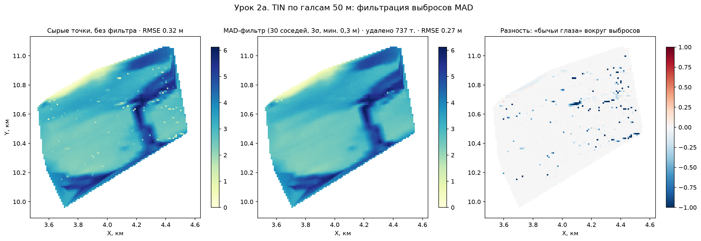
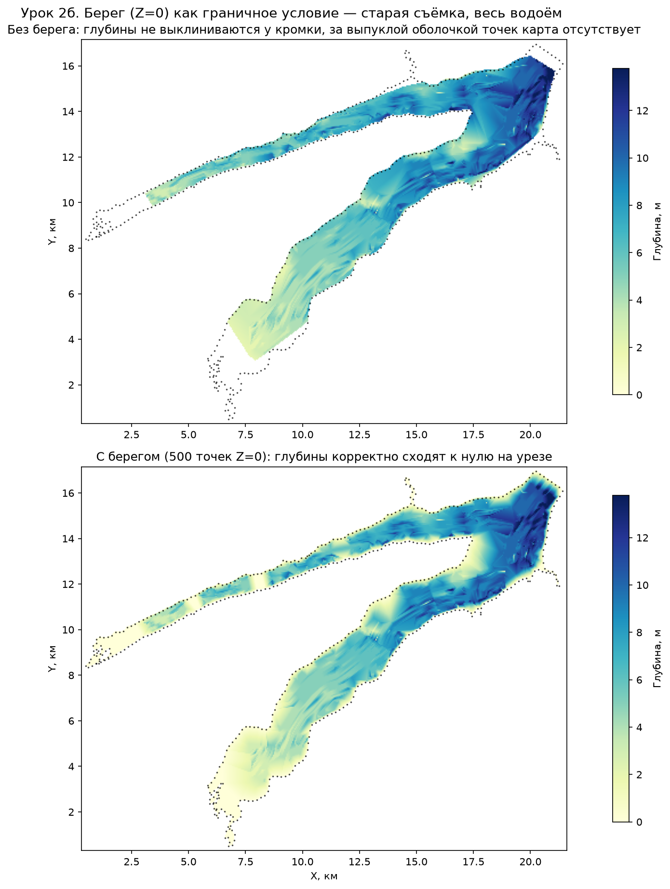

# Урок 2. Сборка карты водоёма: фильтрация выбросов и берег как граничное условие

> Черновик для рецензии · кандидат в модуль П11 (практикум) и А4
> Все числа вычислены из реальных данных; координаты на рисунках — относительные.

## Цель

Собрать карту глубин из «грязных» реальных промеров: понять, откуда берутся выбросы, как их снимает MAD-фильтр, и почему без береговой линии (Z=0) карта водоёма физически некорректна.

## Данные урока

- Новая эхолотная съёмка: 539 955 промеров участками (см. [raw_figA_sources.png](figs/raw_figA_sources.png));
- Старая съёмка: 79 257 точек зигзаг-галсами по **всей** акватории (координаты и глубины огрублены до метра);
- Берег: 500 точек Z=0 по контуру из shapefile.

Реальный «мусор» в сырых данных (найден при аудите):

| Дефект | Сколько | Причина |
|---|---|---|
| Нулевые глубины внутри акватории | 7 210 т. (1,4%) | выход на мелководье/сбой эхолота; 27 нулей — посреди воды рядом с глубинами > 1 м |
| Одиночные спайки (11 м среди 2-метровых соседей) | ~1% точек | ложное эхо (рыба, взвесь, двойное отражение) |
| «Нулевой ход» в 37 км от водоёма | 20 758 т. | лог включён в дороге/на другом объекте; половина записей — нули |
| GPS-глюк | 5 т. в 56 км | потеря фикса |
| Систематика между съёмками | −0,85 м (std 0,57) | разный уровень воды/датум эхолота — старую съёмку нельзя клеить с новой без поправки |

## Часть А. MAD-фильтр выбросов

Для каждой точки берём 30 ближайших соседей, считаем медиану и MAD (median absolute deviation) глубины; точка — выброс, если |z − медиана| > 3·1,4826·MAD (минимальный порог 0,3 м). Это устойчивый к выбросам аналог «правила 3σ».

На галсах 50 м: удалено **737 точек из 57 637 (1,3%)**, RMSE карты к эталону улучшился с **0,32 до 0,27 м**, а главное — исчезли «бычьи глаза» (bullseyes): ложные ямы и бугры вокруг одиночных выбросов, которые TIN честно вписывает в поверхность.

## Часть Б. Берег (Z=0) как граничное условие

TIN-интерполяция определена только внутри выпуклой оболочки точек и ничего не знает о том, что глубина на урезе воды равна нулю.

Без берега: у кромки глубины «повисают» на последнем промере, заливы и края без промеров вообще не покрыты. С 500 точками берега (Z=0): глубины выклиниваются к нулю на урезе, покрытие — весь водоём. Берег — это **дармовые данные** (оцифровка по спутниковому снимку), дающие максимальный прирост качества у кромки.

## Полный конвейер сборки (итог урока)

1. Убрать технический мусор: нулевые ходы вне водоёма, GPS-глюки, нули с перепадом > 1 м от соседа;
2. Вдоль-трековая чистка (скользящая медиана по ходу) и/или MAD по соседям;
3. Привести источники к одному датуму (у нас: старая съёмка глубже новой на 0,85 м — поправка обязательна);
4. Добавить берег Z=0 из shapefile;
5. Интерполяция (TIN/кригинг) → сетка → изолинии; сравнить среднюю глубину по точкам и по сетке (у согласованной сборки они близки).

## Контрольные вопросы

1. Почему для чистки выбросов используют медиану и MAD, а не среднее и σ?
2. Что произойдёт с объёмом водоёма, если склеить две съёмки без датум-поправки −0,85 м? Оцените знак и порядок ошибки.
3. Почему точки берега нельзя добавлять ДО фильтрации MAD? (Подсказка: чем Z=0 у берега отличается от Z=0 посреди акватории?)
4. В каких местах карта останется ненадёжной даже после всех шагов? (Подсказка: сравните покрытие двух съёмок.)
