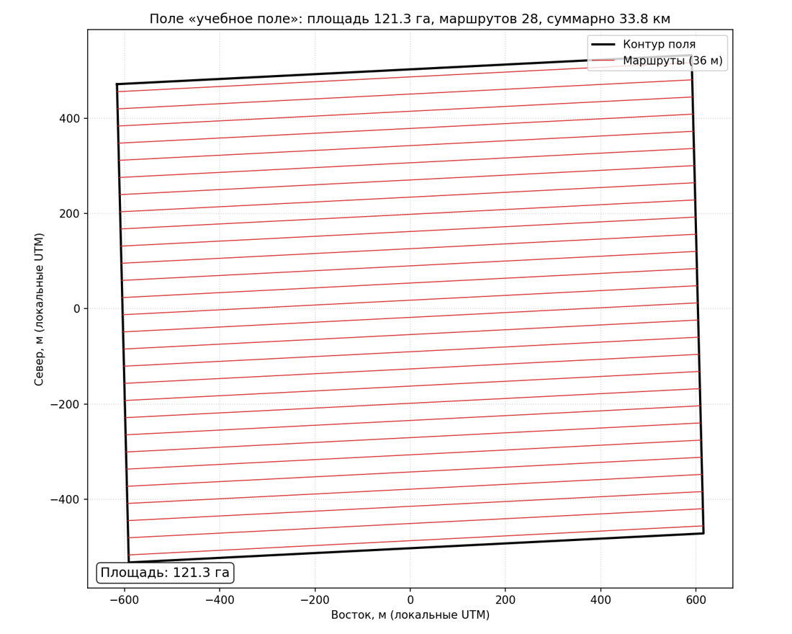

# ИИ-ассистент в работе: агент проектирует полётную миссию — вы верифицируете

> Модуль **А1: Жизненный цикл агроданных и почвенно-агрохимический мониторинг (+ БПЛА и IoT)** · Уровень ИИ-слоя: **Pro-code** (студент, инженер)
> Инструменты: **Claude Code** или **OpenCode** (терминальные кодинг-агенты; взаимозаменяемы — вендор-независимость платформы), Python 3.
> ⏱ ~45 мин. Общая рамка ИИ-слоя платформы — [ИИ-инструменты в обучении](../../ai-tools.md).

<!-- folur-software:start -->

!!! tip "Что понадобится в этом уроке и где это взять"
    Нажмите на название программы и увидите, **где её взять, что нажать и как она выглядит в работе** (нужная кнопка на снимке обведена фиолетовым). Встроенный редактор Python установки не требует. Полная справка — [«Программы и сервисы»](../../software.md).

??? example "QGIS — скачать и установить"
    { .folur-shot loading=lazy }

    1. Откройте <https://qgis.org/download/>. Сайт сначала предложит пожертвование — оно необязательно: нажмите **«Skip it and go to download»**.
    2. Нажмите зелёную кнопку **«Download LTR»** (на снимке обведена). LTR — версия долгосрочной поддержки, она стабильнее. Скачается установщик размером около 1 ГБ.
    3. Запустите скачанный файл и нажимайте «Next», ничего не меняя. После установки откройте в меню «Пуск» ярлык **QGIS Desktop**.

    **Как это выглядит в работе.** QGIS в работе (русский интерфейс): слева панели «Браузер» и «Слои», в окне карты — спутниковая подложка, на которой видны поля.

    { .folur-shot loading=lazy }

    [QGIS по шагам в картинках: подложка, спутник, новый слой, система координат, площадь →](../../software.md#qgis-steps)

    [Первые шаги в QGIS и русский интерфейс →](../../software.md#qgis)

??? example "OpenCode — скачать ИИ-агента (по желанию)"
    { .folur-shot loading=lazy }

    1. ИИ-задание выполнимо и без агента. Если хотите попробовать, откройте <https://opencode.ai/download>.
    2. В разделе **«OpenCode Desktop»** в строке **«Windows (x64)»** нажмите **«Download»** (на снимке обведена) и установите скачанный файл.
    3. Работайте в отдельной пустой папке с учебными файлами и начинайте с режима **Plan**.

    **Как это выглядит в работе.** Пример: по контуру поля нейросеть посчитала площадь и сама построила карту маршрутов съёмки; числа сверены с QGIS.

    { .folur-shot loading=lazy }

    [Разбор примера: запрос, результат и проверка чисел →](../../software.md#opencode-example)

    [Рекомендации по работе с OpenCode и снимки его окна →](../../software.md#opencode)

<!-- folur-software:end -->

!!! warning "Главное правило: ИИ ускоряет — человек верифицирует"
    Результат ИИ без независимой верификации — не результат. Это задание оценивается не по тому, что сгенерировал агент, а по качеству **вашей** проверки.

## Цель

**[Bloom: применять/анализировать]** Поставить кодинг-агенту задачу генерации плана полётной миссии БПЛА по заданным параметрам (GSD, перекрытия, контур участка), провести ревью сгенерированного кода, найти и исправить ошибки и **верифицировать результат независимым расчётом и правовым чек-листом**. Это производственный навык: автономные ГИС-агенты уже генерируют геопайплайны, но ответственность за результат остаётся на инженере.

Задание предполагает выполненный [практикум](practicum/01-poljotnoe-zadanie-bpla.md): его ручной расчёт — ваша опорная «истина» (тот же паттерн независимой контрольной точки, что и GCP в [Уроке 1](lectures/01-zhiznennyy-tsikl-agrodannykh.md)).

## Пошаговое задание

### Шаг 1: постановка задачи агенту (10 мин)

Установите Claude Code или OpenCode (оба — терминальные агенты; подойдёт любой). В пустом рабочем каталоге дайте агенту постановку — сформулируйте её сами по образцу (не копируйте слепо, подставьте ваши значения из практикума):

```text
Напиши Python-скрипт mission_planner.py (только стандартная библиотека + shapely),
который по параметрам камеры (pixel_size_m, focal_m, width_px, height_px),
целевому GSD (м), перекрытиям (forward, side) и контуру участка
(GeoJSON-полигон в метрической СК, EPSG:32641 или 32642) вычисляет:
высоту полёта, захват кадра, междурядье маршрутов, интервал съёмки,
число и геометрию маршрутных линий (GeoJSON LineString),
суммарную длину и время миссии при заданной скорости.
Вход — mission_config.json, выход — mission_lines.geojson и mission_report.json.
Добавь проверки входных значений и юнит-тесты.
```

Сохраните диалог (постановку и ответы) — он войдёт в отчёт.

### Шаг 2: ревью сгенерированного кода (10 мин)

Прочитайте код **до запуска**. Чек-лист ревью (минимум, на что смотреть):

- **Формула GSD:** <code>H = GSD × f / p</code> — не перепутаны ли числитель/знаменатель, метры/микрометры ([Урок 2, раздел 5.1](lectures/02-bpla-kompleks-i-polyotnyy-plan.md));
- **Перекрытия:** междурядье должно считаться от **поперечного** захвата и **поперечного** перекрытия (<code>W × (1 − side)</code>), интервал съёмки — от продольного; перепутанные оси — классическая ошибка генерации;
- **Единицы и СК:** скрипт обязан требовать метрическую СК, а не считать «в градусах» (последствия — [Урок 4, раздел 1](lectures/04-standarty-formaty-fair.md));
- **Краевые случаи:** пустой полигон, GSD ≤ 0, перекрытие ≥ 1 — есть ли проверки;
- **Тесты:** проверяют ли они числа против независимо посчитанных значений или просто «код не падает».

Найденные проблемы верните агенту на исправление (итерируйте). Зафиксируйте в отчёте: что нашли, как агент исправил.

### Шаг 3: запуск на данных практикума (10 мин)

Экспортируйте контур вашего участка из <code>plot.gpkg</code> в GeoJSON (QGIS: ПКМ по слою → Экспорт; СК — зона UTM участка). Заполните <code>mission_config.json</code> значениями практикума (условный сенсор, ваш GSD, перекрытия 80/70, скорость 8 м/с). Запустите скрипт, загрузите <code>mission_lines.geojson</code> в QGIS поверх вашего ручного слоя <code>mission.gpkg</code>.

### Шаг 4: ВЕРИФИКАЦИЯ результата (обязательный шаг, 15 мин)

Три независимые проверки — все обязательны:

1. **Контрольный расчёт.** Сравните <code>mission_report.json</code> с вашей ручной таблицей из практикума (шаг 3): высота, междурядье, число линий, время. Расхождение свыше ~5% (кроме округления числа линий) — дефект: найдите, чей расчёт неверен, разберите и задокументируйте.
2. **Геометрическая сверка.** В QGIS: линии агента лежат внутри участка (+буфер)? параллельны? фактическое междурядье (измерьте инструментом линейки) равно расчётному? покрывают весь полигон без «лысин» у краёв?
3. **Правовой чек-лист.** Пройдите план по чек-листу миссии ([Урок 2, раздел 5.5](lectures/02-bpla-kompleks-i-polyotnyy-plan.md)): высота и зона полёта — против актуальных требований к полётам БПЛА в РК по официальным источникам (агент их **не знает достоверно**: любые «нормы РК» в его выводе считаются непроверенными, пока вы не подтвердили их официальным источником — это упражнение на отбраковку правдоподобных галлюцинаций).

Если все три проверки пройдены — результат агента принят. Если нет — цикл «ревью → исправление → верификация» повторяется. В отчёт: таблица «проверка → метод → результат → действие».

## Критерии зачёта

| № | Критерий | Проверка |
|---|---|---|
| 1 | Постановка задачи агенту полна (параметры, форматы, СК, тесты) | Текст постановки в отчёте |
| 2 | Ревью кода выполнено: найдено и разобрано ≥1 реальное замечание (или мотивированно показано, что дефектов нет) | Раздел ревью в отчёте |
| 3 | Контрольный расчёт: расхождения с ручной таблицей ≤5% или объяснены | Таблица сверки |
| 4 | Геометрическая сверка в QGIS выполнена (скриншот наложения слоёв) | Скриншот + измеренное междурядье |
| 5 | Правовой чек: «нормы» из вывода ИИ помечены как непроверенные / заменены ссылкой на официальный источник | Чек-лист в отчёте |
| 6 | Отчёт <code>ai-report.md</code> собран (диалог, ревью, верификация, вывод) | Файл в каталоге практикума |

**Зачёт** — при выполнении всех шести. Задание полностью выполнимо и без ИИ (ручной путь = практикум); ИИ-слой ускоряет, но не является условием прохождения.

!!! tip "Что тренирует это задание"
    Не «умение пользоваться нейросетью», а инженерную приёмку чужой работы: те же навыки, которыми вы принимаете ортофотоплан подрядчика ([Урок 1, раздел 4.1](lectures/01-zhiznennyy-tsikl-agrodannykh.md)) или датасет коллеги ([Урок 4, раздел 5](lectures/04-standarty-formaty-fair.md)). Агент здесь — быстрый, дешёвый и самоуверенный подрядчик.
