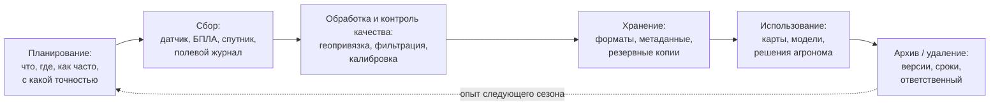
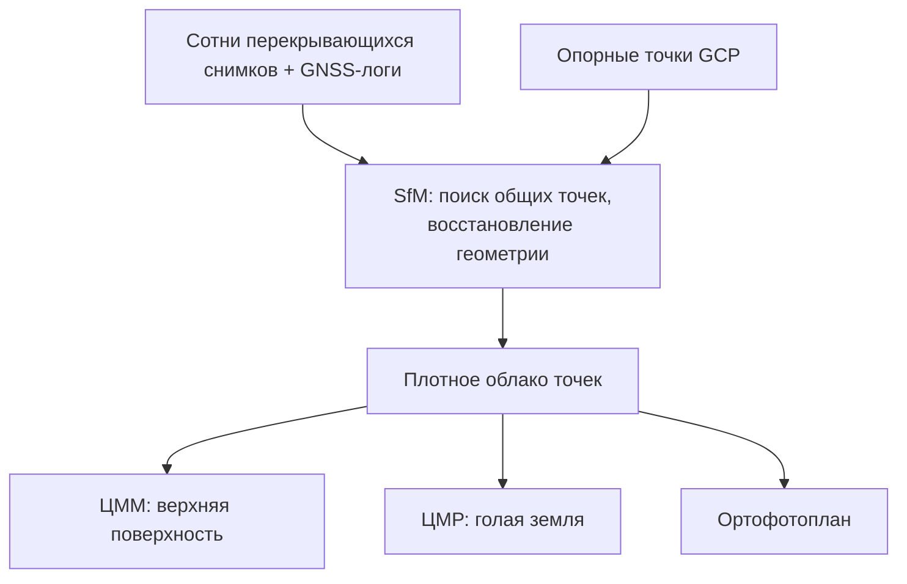

# Выстраиваем жизненный цикл данных хозяйства: от датчика в поле до аналитического слоя

> ⏱ **Трудозатраты:** ~24 мин чтения + ~20 мин практики
> Модуль **А1: Жизненный цикл данных в агросфере (+ БПЛА и IoT)**, урок 1 из 4.
> Академический уровень. Проект UNDP-KAZ FOLUR. Компоненты FOLUR: **1**, **2**.

## Цели лекции и место в модуле

Эта лекция — фундамент всего модуля и, по сути, всей академической линейки платформы. Прежде чем считать NDVI (А2), обучать модели (А3) или строить карты глубин (А4), нужно ответить на вопросы: откуда берутся данные, кто и как их собирает, где они лежат, кто им доверяет и почему. Здесь мы строим целостную картину: источники агроданных, стадии их жизненного цикла, точность геопривязки полевых измерений и первый взгляд на фотограмметрический конвейер БПЛА.

После изучения лекции слушатель сможет:

1. **[Bloom: знать]** перечислять основные источники данных агросферы и стадии жизненного цикла данных.
2. **[Bloom: понимать]** объяснять, чем различаются точности автономного GNSS, RTK и PPK и зачем нужны наземные опорные точки (GCP).
3. **[Bloom: применять]** составлять схему движения данных для конкретного хозяйства Северного Казахстана — от точки сбора до аналитического продукта.
4. **[Bloom: анализировать]** находить «узкие места» в существующей практике сбора данных хозяйства и предлагать, какую стадию цикла нужно укрепить в первую очередь.

> **Границы лекции.** Внутри: карта источников данных, модель жизненного цикла, геопривязка полевых измерений (RTK/PPK, GCP), обзор фотограмметрических продуктов (ортофотоплан, ЦМР, ЦММ) и открытого конвейера OpenDroneMap. За рамками: устройство самого БПЛА и расчёт полётных параметров — подробнее в [Уроке 2](02-bpla-kompleks-i-polyotnyy-plan.md); сравнение БПЛА и спутников — в [Уроке 3](03-bpla-ili-sputnik.md); системы координат, форматы файлов и принципы FAIR — в [Уроке 4](04-standarty-formaty-fair.md); собственно ГИС-анализ собранных данных — в модуле [А2](../../a2/index.md).

---

## 1. Почему «жизненный цикл», а не просто «сбор данных»

Типичная история казахстанского хозяйства среднего размера выглядит так. Агроном ведёт журнал обработок в тетради. Результаты агрохимического обследования лежат в PDF-отчёте подрядчика. Комбайн пишет треки и урожайность на флешку в собственном формате производителя техники. Кто-то однажды заказывал съёмку с дрона — архив остался на диске у подрядчика. Спутниковые снимки «где-то в интернете». Когда через три года хозяйство решает внедрить дифференцированное внесение удобрений, выясняется: данных формально много, но соединить их невозможно — нет общих координат, дат, форматов и ответственных.

Проблема здесь не в отсутствии данных и не в жадности подрядчиков. Проблема в том, что данные собирались **без модели жизненного цикла** — никто не проектировал их путь дальше момента сбора. Жизненный цикл данных — это явное описание всех стадий, которые проходит каждое наблюдение: планирование, сбор, обработка, контроль качества, хранение, использование, архивирование или удаление. Ценность данных возникает только тогда, когда все стадии согласованы: измерение без геопривязки, файл без метаданных, архив без ответственного — это потерянные деньги хозяйства.

Международные рамки говорят о том же на языке политик. Рамка FAO «10 элементов агроэкологии» прямо включает элемент совместного создания и обмена знаниями (co-creation and sharing of knowledge) — а обмениваться можно только данными, которые переживают своего автора и его тетрадь. База WOCAT документирует технологии устойчивого землепользования по единому стандарту именно потому, что несопоставимые описания невозможно сравнивать. Индикатор ЦУР 15.3.1 (доля деградированных земель) рассчитывается из многолетних спутниковых рядов — то есть из данных, чей жизненный цикл спроектирован на десятилетия вперёд.



*Рис. 1. Жизненный цикл агроданных: шесть стадий, замкнутых в кольцо. Alt: блок-схема из шести стадий — планирование, сбор, обработка и контроль качества, хранение, использование, архивирование — соединённых стрелками слева направо; пунктирная стрелка от архива обратно к планированию показывает, что опыт сезона улучшает план следующего.*

Ключевое следствие модели: **качество данных закладывается на стадии планирования, а не исправляется на стадии обработки**. Если координата замера не записана в поле, никакой алгоритм не восстановит её потом. Если у снимка нет даты и высоты съёмки, его нельзя сопоставить с погодным рядом. Поэтому в этом модуле мы движемся по циклу слева направо: сначала источники и сбор (уроки 1–3), затем стандарты и контроль качества (урок 4).

### 1.1 Роли и ответственность

У каждой стадии цикла должен быть владелец. В крупном агрохолдинге это отдельные специалисты (полевой оператор, инженер данных, аналитик); в фермерском хозяйстве все роли может совмещать один человек — но роли от этого не исчезают. Практический минимум: для каждого потока данных (журнал обработок, треки техники, снимки) письменно зафиксировать, кто собирает, кто проверяет, где лежит мастер-копия и кто имеет право её изменять. Как организовать это без программиста — на уровне шаблонов и бесплатных инструментов — разбирает профессиональный модуль [П1 «Управление данными в агрохозяйстве»](../../p1/index.md): подробнее — в нём.

---

## 2. Карта источников агроданных

Источники данных агросферы удобно делить по способу получения. Таблица ниже — рабочая карта, к которой мы будем возвращаться весь модуль.

| Класс источника | Примеры | Что даёт | Типичная частота | Ключевой риск качества |
|---|---|---|---|---|
| Дистанционное зондирование (спутники) | Sentinel-1/2, Landsat, MODIS, ASTER | Индексы вегетации, влажность, температура поверхности, снимки в динамике | 3–16 дней (зависит от миссии) | Облачность; разрешение 10 м и грубее у открытых миссий |
| БПЛА | Мультиротор/самолётного типа с RGB- или мультиспектральной камерой | Ортофотоплан 2–10 см, ЦМР/ЦММ, детальные карты состояния посевов | По запросу | Требует планирования полёта и обработки; правовые ограничения |
| IoT-датчики | Метеостанции, датчики влажности почвы, уровня воды | Непрерывные ряды точечных измерений | Минуты–часы | Дрейф калибровки, разрывы связи, точечность |
| GPS-треки техники | Бортовые терминалы тракторов и комбайнов | Фактические траектории работ, карты урожайности | Каждая операция | Закрытые форматы производителей; пропуски сигнала |
| Полевые обследования | Агрохимическое обследование, учёт всходов, фенология | Точные наземные значения — «истина» для калибровки ДЗЗ | Раз в сезон — раз в 5 лет | Ручной ввод, ошибки координат, малая плотность точек |
| Открытые реестры и архивы | data.gov.kz, метеоархивы, кадастровые слои, OpenStreetMap | Контекст: границы, дороги, гидрография, климатические нормы | Обновления нерегулярны | Актуальность и полнота требуют проверки |
| Ряды хозяйства | Урожайность по полям, севообороты, журналы обработок | Целевая переменная для любой аналитики | Сезон | Часто без геопривязки и в несовместимых форматах |

Три наблюдения по таблице. Во-первых, ни один источник не самодостаточен: спутник даёт покрытие, но грубое разрешение; БПЛА — детальность, но малую площадь; датчик — непрерывность, но одну точку. Аналитическая ценность возникает при **совмещении** источников, а совмещение требует общей геопривязки и совместимых форматов — тема урока 4. Во-вторых, самые дорогие по трудозатратам данные — полевые обследования — одновременно самые ценные: именно они служат опорной «истиной» при калибровке дистанционных данных и обучении моделей (это станет критичным в модуле [А3](../../a3/index.md)). В-третьих, ряды самого хозяйства (урожайность, обработки) — недооценённый актив: без них невозможно связать «что видно со спутника» с «что получили на току».

Разберём три источника из таблицы подробнее — те, что чаще всего недооцениваются при проектировании.

**IoT-датчики.** Полевые метеостанции, датчики влажности почвы на разных горизонтах, датчики уровня воды в прудах-накопителях образуют «нервную систему» хозяйства: они дают непрерывные ряды там, где спутник даёт снимок раз в несколько дней, а человек — измерение раз в сезон. Но у непрерывности есть цена. Во-первых, дрейф калибровки: датчик влажности, не поверявшийся два сезона, продолжает слать правдоподобные числа, которые постепенно расходятся с реальностью — это самый коварный тип ошибки, потому что визуально ряд выглядит нормальным. Во-вторых, разрывы связи: в степной зоне LoRa- или GSM-канал теряется, и в ряду появляются пропуски, которые нужно уметь честно помечать, а не заполнять молча (методы работы с пропусками — в [Уроке 4](04-standarty-formaty-fair.md)). В-третьих, точечность: датчик описывает кубический дециметр почвы, а решение принимается о поле в сотни гектаров — экстраполяция требует понимания пестроты почвенного покрова.

**GPS-треки техники.** Бортовые терминалы тракторов и комбайнов пишут не только траекторию, но и ширину захвата, скорость, расход, а комбайны — поток зерна, из которого строятся карты урожайности. Это единственный источник, который документирует *фактически выполненные* операции, а не запланированные. Главная ловушка — проприетарные форматы: каждый производитель техники хранит данные по-своему, и хозяйство с разномарочным парком получает три несовместимых архива. Правило жизненного цикла здесь: сразу после сезона выгружать треки в открытый формат (GeoPackage, GeoJSON) и класть в общее хранилище — пока терминал не перезаписал память и пока сотрудник, знающий пароль от фирменного кабинета, не уволился.

**Погодные ряды.** Осадки и температура — главные объясняющие переменные почти любой агроаналитики Северного Казахстана, где влагообеспеченность лимитирует урожай. Источники трёх уровней: собственная метеостанция (точно, но коротко — ряд начинается с момента покупки), ближайшая государственная станция (длинный ряд, но станция может быть в десятках километров), глобальные реанализы и спутниковые продукты (полное покрытие, но ячейка в километры и своя погрешность). Грамотная система использует все три уровня и документирует, какой откуда взят.

### 2.1 Открытые данные как скелет системы

Для Северного Казахстана скелет любой системы агроданных можно собрать целиком из открытых источников: снимки Sentinel-2 (Copernicus Data Space Ecosystem, Google Earth Engine, Microsoft Planetary Computer), границы и гидрография из OpenStreetMap, открытые реестры data.gov.kz. Это принципиально для устойчивости: система, построенная на открытых данных и открытом ПО, не умирает вместе с подпиской на коммерческий сервис. Платные источники (коммерческие спутники сверхвысокого разрешения, закрытые агроплатформы) мы рассматриваем в уроке 3 — но только в сравнительном ключе.

---

## 3. Геопривязка полевых измерений: GNSS, RTK/PPK и опорные точки

Любое наблюдение без координат — просто число. Чтобы измерение стало *пространственными данными*, ему нужна геопривязка, и её точность должна соответствовать задаче. Здесь важно развести три уровня точности спутниковой навигации (GNSS — обобщающее название систем GPS, ГЛОНАСС, Galileo, BeiDou).

**Автономный GNSS-приёмник** (смартфон, бытовой навигатор, обычный приёмник дрона) определяет позицию по сигналам спутников без внешних поправок. Типичная точность — единицы метров. Для привязки точки агрохимического отбора на поле в 300 га этого достаточно; для сшивки снимков в ортофотоплан сантиметрового разрешения — нет.

**RTK (Real-Time Kinematic)** — кинематика реального времени: приёмник получает поправки от базовой станции (собственной или сетевой) прямо в полёте/в поле и достигает точности порядка сантиметров. Требует радио- или интернет-канала до базы и покрытия поправочного сервиса.

**PPK (Post-Processed Kinematic)** — та же идея, но поправки применяются после съёмки, при офисной обработке сырых GNSS-логов приёмника и базы. Не требует устойчивой связи в поле — важное преимущество в степной зоне, где сотовое покрытие неравномерно.

**GCP (Ground Control Points, наземные опорные точки)** — контрастные марки, разложенные на участке и измеренные точным приёмником. Фотограмметрический софт находит марки на снимках и «пришивает» модель к их координатам. Часть измеренных точек намеренно *не* передают в обработку, а оставляют как контрольные (check points): по расхождению модели с ними оценивается фактическая, а не заявленная точность продукта. GCP — независимый контроль: даже при RTK-дроне несколько опорных и контрольных точек позволяют *проверить*, а не предположить точность итогового ортофотоплана. Запомните этот паттерн — «независимая контрольная точка» — он же станет главным приёмом верификации результатов ИИ в [ИИ-задании модуля](../ai-assistant.md).

Практические требования к GCP просты: марки должны быть контрастными и достаточно крупными, чтобы уверенно опознаваться на снимках при выбранном GSD; распределяться по всему участку, включая углы и центр, а не выстраиваться в линию; измеряться приёмником, точность которого лучше целевой точности продукта. Для учебных задач модуля роль марок могут играть устойчивые опознаваемые объекты — углы капитальных сооружений, пересечения дорог.

Практическое правило выбора: точность геопривязки должна быть на порядок лучше размера объектов, которые вы хотите различать. Считаете ряды пропашной культуры с междурядьем 70 см — метровая точность автономного GNSS не годится. Оцениваете состояние поля по зонам в десятки метров — избыточно платить за RTK.

### 3.1 Бюджет точности: считаем ошибку по всей цепочке

Точность итогового продукта складывается из ошибок всех звеньев цепочки, и думать о ней нужно как о бюджете: каждое звено «тратит» часть допустимой ошибки. Для ортофотоплана это, как минимум: погрешность позиционирования камеры (GNSS-уровень: метры автономно, сантиметры с RTK/PPK), погрешность измерения опорных точек, качество калибровки камеры, устойчивость самой фотограмметрической сшивки (зависит от перекрытий и текстуры поверхности — однородное созревшее поле сшивается хуже, чем поле с видимой структурой). Для полевого журнала — погрешность приёмника плюс человеческий фактор: оператор записал координату, стоя у машины, а не у точки отбора, и вот уже «сантиметровый RTK» дал ошибку в пятнадцать метров.

Два практических следствия. Первое: усиливать нужно самое слабое звено, а не самое дорогое. Бессмысленно ставить RTK-модуль на дрон, если опорные точки меряются смартфоном. Второе: бюджет точности задаётся *от задачи*, а не от возможностей техники. Формулировка «нам нужна максимальная точность» — признак незавершённого шага 2 методики из раздела 5; правильная формулировка звучит как «зоны внесения имеют размер 30–50 м, значит суммарная ошибка позиционирования до 3–5 м приемлема». Такая формулировка сразу говорит, что для данной задачи достаточно автономного GNSS, и освобождает бюджет на более дефицитные звенья — например, на свежее агрохимическое обследование.

Обратите внимание, как бюджет точности связывает стадии цикла: требование формулируется на стадии планирования, обеспечивается на стадии сбора, проверяется на стадии контроля качества (независимыми контрольными точками) и документируется в метаданных на стадии хранения — иначе следующий пользователь данных не узнает, чему можно доверять.

> **Подробнее** — устройство GNSS/RTK-модулей и автопилотов БПЛА разбирается в [Уроке 2](02-bpla-kompleks-i-polyotnyy-plan.md); преобразования между системами координат — в [Уроке 4](04-standarty-formaty-fair.md).

---

## 4. Фотограмметрия: как из сотен снимков получаются три продукта

БПЛА за один вылет делает сотни перекрывающихся снимков. Сами по себе они малополезны: искажены перспективой, не привязаны к карте, дублируют друг друга. Фотограмметрическая обработка (в современном виде — технология Structure from Motion, SfM) восстанавливает по перекрытиям геометрию сцены и положение камеры в момент каждого кадра и выдаёт три стандартных продукта:

- **Ортофотоплан** — единое бесшовное изображение участка, геометрически исправленное так, что по нему можно измерять расстояния и площади, как по карте.
- **ЦМР (цифровая модель рельефа)** — высоты «голой» земли, без растительности и построек; нужна для анализа стока, микрорельефа, планирования мелиорации.
- **ЦММ (цифровая модель местности)** — высоты верхней поверхности всего, что есть на участке, включая посевы и лесополосы; разность ЦММ и ЦМР даёт, например, высоту растительного покрова.



*Рис. 2. Фотограмметрический конвейер: от снимков и GNSS-логов через плотное облако точек к трём продуктам. Alt: схема, где снимки с логами и опорные точки входят в блок SfM-обработки, из него получается плотное облако точек, а из облака — три выхода: цифровая модель местности, цифровая модель рельефа и ортофотоплан.*

Инструменты. Базовый для платформы — **OpenDroneMap (ODM/WebODM)**: полностью открытый конвейер, который выполняет весь путь с рис. 2 и работает локально или в контейнере. Коммерческие аналоги — **Agisoft Metashape** и **Pix4D** — упоминаем в сравнительном ключе: они предлагают отточенный интерфейс, поддержку и ряд специализированных модулей, но требуют лицензий; все учебные задания платформы выполнимы в ODM. Важно понимать: различия между пакетами — в удобстве и деталях реализации, а физика метода (перекрытия, опорные точки, качество GNSS) одна и та же, и ошибки планирования съёмки не исправит ни один из них.

Насколько детальным будет результат, определяет **GSD (Ground Sample Distance)** — размер пикселя на местности. Он задаётся ещё до взлёта высотой полёта и характеристиками камеры; расчёту GSD и перекрытий посвящён раздел 4 [Урока 2](02-bpla-kompleks-i-polyotnyy-plan.md).

### 4.1 Как проверить фотограмметрический продукт, не будучи фотограмметристом

Даже если обработку выполняет подрядчик или открытый конвейер «в один клик», заказчик обязан уметь оценить результат — это стадия контроля качества цикла. Минимальный чек-лист приёмки ортофотоплана состоит из четырёх проверок. Геометрия: измерьте на ортофотоплане 2–3 расстояния между объектами, которые можно промерить на местности или на независимом источнике (например, ширину дороги, длину склада), и сравните. Сшивка: пролистайте план на полном увеличении вдоль линейных объектов — дорог, лесополос, рядов посева; разрывы и «ступеньки» на них выдают проблемы совмещения снимков. Полнота: проверьте края участка и зоны с однородной текстурой — там чаще всего «дыры» и артефакты. Метаданные: дата и время съёмки, высота, тип камеры, система координат, использованные GCP — всё это должно приехать вместе с файлом; продукт без метаданных не подлежит приёмке, потому что его невозможно корректно совместить с другими слоями.

Тот же чек-лист, почти дословно, работает для приёмки *любого* производного продукта данных — включая карты, построенные ИИ-агентом: независимые промеры, визуальный контроль вдоль структур, проверка краёв, обязательные метаданные. В [ИИ-задании модуля](../ai-assistant.md) вы примените его к плану полётной миссии, сгенерированному кодинг-агентом.

---

## 5. Проектируем систему данных хозяйства: методика из пяти шагов

Соберём материал лекции в рабочую методику. Она пригодится в практикуме и в итоговой аттестации, а в профессиональном модуле П1 существует в упрощённой форме для фермера.

**Шаг 1. Инвентаризация решений.** Выпишите 3–5 решений, которые хозяйство принимает регулярно и дорого: чем и когда сеять, где и сколько вносить удобрений, какие поля осматривать в первую очередь, когда убирать. Данные нужны не «вообще», а под решения.

**Шаг 2. Обратная трассировка к данным.** Для каждого решения определите: какие данные его улучшили бы, с какой точностью, как часто и в какой момент сезона они нужны. Здесь появляется требование к геопривязке (раздел 3) и к источнику (раздел 2).

**Шаг 3. Выбор источников.** По карте источников подберите минимальную комбинацию: как правило, открытый спутниковый ряд как основа + точечные полевые данные как опора + БПЛА для проблемных участков. Критерии выбора платформы — [Урок 3](03-bpla-ili-sputnik.md).

**Шаг 4. Проектирование хранения.** Для каждого потока: формат (открытый!), место мастер-копии, схема резервного копирования, минимальный набор метаданных (кто, когда, где, чем, в какой системе координат). Детали — [Урок 4](04-standarty-formaty-fair.md).

**Шаг 5. Контур качества.** Заранее определите, как будете проверять данные: контрольные точки для съёмок, дубли измерений для датчиков, визуальная сверка треков с границами полей. Правило то же, что и с GCP: у каждого автоматического результата должна быть независимая проверка.

Пять шагов намеренно не привязаны ни к какому программному продукту: это дисциплина мышления, а не софт. Инструментальную реализацию (QGIS-проект, структура каталогов, ноутбуки) вы соберёте в практикуме и в модуле А2.

Завершим методику тремя антипаттернами, которые встречаются в проектах систем агроданных чаще всего. **«Сначала техника, потом задача»**: покупка дрона, датчиков или подписки до выполнения шагов 1–2; техника простаивает или собирает данные, которые никто не использует. **«Данные у подрядчика»**: съёмки, обследования и обработка заказываются без пункта договора о передаче исходных данных в открытых форматах вместе с метаданными; хозяйство получает красивый PDF, а актив остаётся у исполнителя. **«Единственный носитель»**: мастер-копия живёт на одном ноутбуке или одной флешке; вопрос не в том, потеряются ли данные, а в том, когда. Все три антипаттерна — нарушения конкретных стадий цикла (планирования, хранения, архивирования), и все три дешевле предотвратить одним абзацем в плане или договоре, чем исправлять после.

Отдельно подчеркнём: данные хозяйства — это актив с накопительной ценностью. Один сезон наблюдений почти ничего не говорит о зонах продуктивности — слишком велик вклад погоды конкретного года; пять сопоставимых сезонов выявляют устойчивые закономерности, на которых уже можно строить дифференцированное внесение и планирование севооборота. Отсюда следствие, важное для мотивации: дисциплина жизненного цикла окупается не в первый сезон, а начиная со второго-третьего, и главная ошибка — бросить систему через год, «потому что пока ничего не дала».

---

## Региональный кейс

**Ситуация:** зерновое хозяйство в Костанайской области (основная культура — пшеница, ключевая для странового проекта FOLUR) планирует перейти к дифференцированному внесению удобрений по зонам продуктивности. У хозяйства есть: журналы обработок в бумажном виде, агрохимическое обследование трёхлетней давности (PDF-отчёт с картами-схемами без координатных файлов), комбайны с бортовыми терминалами и желание «купить дрон, чтобы всё видеть». Руководитель просит вас, как приглашённого специалиста по данным, оценить готовность хозяйства.

**Данные:** Sentinel-2 L2A за вегетационные сезоны последних лет по территории района — открыто через Copernicus Data Space Ecosystem или Google Earth Engine; границы полей — оцифровка по снимку в QGIS; открытые реестры — data.gov.kz.

**Задача:**

1. Разложите имеющиеся активы хозяйства по стадиям жизненного цикла (рис. 1): какие стадии обеспечены, какие отсутствуют полностью?
2. Для решения «дифференцированное внесение» выполните шаги 1–3 методики: какие данные, с какой геопривязкой и из каких источников реально нужны?
3. Оцените идею «сначала купить дрон»: какую стадию цикла она закрывает, а какие оставляет пустыми?

**Разбор:** инвентаризация показывает типовой перекос: у хозяйства есть фрагменты стадии «сбор» (журналы, терминалы комбайнов, старое обследование), но полностью отсутствуют стадии «обработка/контроль качества» и «хранение» — PDF без координат нельзя совместить со снимками, а треки комбайнов никогда не выгружались. Для дифференцированного внесения базовый контур собирается из открытых данных: многолетний ряд Sentinel-2 даёт устойчивые зоны продуктивности, свежее агрохимическое обследование с геопривязкой каждой точки отбора (достаточно автономного GNSS) — опорные значения. Покупка дрона закрывает только часть стадии «сбор», причём наименее дефицитную: без выстроенного хранения и контроля качества ортофотопланы повторят судьбу PDF-отчёта. Правильная последовательность: сначала спроектировать цикл (шаги 1–5), затем покупать источники данных под него. Этот кейс продолжается в [практикуме](../practicum/01-poljotnoe-zadanie-bpla.md), где вы спроектируете съёмку модельного участка, и в модуле П1, где та же логика упакована для самостоятельной работы фермера.

---

## Закрепление и применение

!!! example "Попробуйте в Colab"
    Откройте ноутбук урока: `<URL будет назначен при создании репозитория ноутбуков>`. В нём — шаблон «паспорта потока данных» (источник → геопривязка → формат → хранение → контроль) и мини-упражнение: по описанию трёх потоков данных условного хозяйства найти, у какого из них отсутствующая стадия цикла сделает данные бесполезными через год.

!!! warning "Границы применимости"
    Модель жизненного цикла — рамка планирования, а не гарантия качества: она показывает, *какие* стадии должны существовать, но не подменяет предметные методики (агрохимический отбор, калибровку датчиков, фотограмметрические допуски). Точности GNSS в разделе 3 — типичные порядки величин, а не паспортные характеристики конкретных приёмников: для реального проекта сверяйтесь с документацией оборудования и требованиями заказчика.

!!! tip "Что это даёт вашему хозяйству"
    Один час, потраченный на шаги 1–5 методики до покупки техники и подписок, обычно экономит сезон работы по пересбору несовместимых данных. Минимальный жизнеспособный вариант: общая папка с датированными подпапками, таблица-журнал с обязательными колонками координат и даты, бесплатный ряд Sentinel-2 как основа мониторинга.

!!! question "Кейс для размышления"
    Хозяйство пять лет собирало карты урожайности с комбайнов, но координаты писались автономным GNSS, а границы полей ежегодно перецифровывались заново разными людьми. Теперь зоны продуктивности «плавают» между сезонами на 5–15 метров. Какие стадии цикла были нарушены? Можно ли спасти архив задним числом и что для этого понадобится? (Подсказка: подумайте про единый эталонный слой границ и про то, какая точность реально нужна для зон в десятки метров.)

---

### Проверь себя

```quiz
[
  {
    "q": "Хозяйство обнаружило, что в полевом журнале не записаны координаты точек отбора почвы. На какой стадии жизненного цикла была допущена ошибка, которую теперь нельзя исправить обработкой?",
    "options": ["На стадии планирования сбора данных", "На стадии хранения", "На стадии архивирования", "На стадии использования"],
    "answer": 0,
    "explain": "§1: качество данных закладывается при планировании; отсутствующую в поле координату невозможно восстановить алгоритмически на последующих стадиях."
  },
  {
    "q": "Чем PPK принципиально отличается от RTK?",
    "options": ["Поправки применяются после съёмки при офисной обработке, связь с базой в поле не нужна", "PPK точнее RTK на порядок", "PPK не требует базовой станции вообще", "PPK работает только с GPS, а RTK — со всеми GNSS"],
    "answer": 0,
    "explain": "§3: RTK получает поправки в реальном времени и требует канала связи; PPK обрабатывает сырые логи постфактум, что удобно при неравномерном сотовом покрытии степной зоны."
  },
  {
    "q": "Зачем нужны GCP при наличии RTK-приёмника на борту БПЛА?",
    "options": ["Как независимый контроль фактической точности итоговых продуктов", "Чтобы увеличить перекрытие снимков", "Чтобы заменить калибровку камеры", "GCP при RTK не нужны никогда"],
    "answer": 0,
    "explain": "§3: контрольные точки позволяют проверить, а не предположить точность ортофотоплана — паттерн независимой верификации, сквозной для модуля."
  },
  {
    "q": "Какой из продуктов фотограмметрии описывает высоты «голой» земли без растительности?",
    "options": ["ЦМР", "ЦММ", "Ортофотоплан", "Плотное облако точек"],
    "answer": 0,
    "explain": "§4: ЦМР — рельеф без объектов; ЦММ включает растительность и постройки; их разность даёт высоту покрова."
  },
  {
    "q": "Почему полевые обследования называют «опорной истиной», хотя они самые трудозатратные?",
    "options": ["Они дают точные наземные значения для калибровки дистанционных данных и обучения моделей", "Они покрывают наибольшую площадь", "Они не требуют геопривязки", "Они всегда дешевле спутниковых данных"],
    "answer": 0,
    "explain": "§2: наземные измерения — эталон, к которому привязываются спутниковые и БПЛА-данные; без них дистанционные ряды не с чем сверять."
  }
]
```

### Контрольные вопросы

1. Перечислите шесть стадий жизненного цикла данных и по одному типичному провалу на каждой. *(Bloom: знать)*
2. Объясните, почему совмещение источников из таблицы раздела 2 требует общей геопривязки и открытых форматов. *(Bloom: понимать)*
3. Составьте паспорт потока данных «GPS-треки комбайнов» для хозяйства Акмолинской области по шаблону раздела 5. *(Bloom: применять)*

## Что дальше?

В [Уроке 2 «Собираем БПЛА-комплекс под агрозадачу»](02-bpla-kompleks-i-polyotnyy-plan.md) мы раскроем самый технологичный источник из карты раздела 2: типы носителей, сенсоры от RGB до LiDAR и эхолота, электронику GNSS/RTK и автопилоты, и научимся рассчитывать полётные параметры. Затем [Урок 3](03-bpla-ili-sputnik.md) поставит БПЛА рядом со спутниками и научит выбирать между ними, а [Урок 4](04-standarty-formaty-fair.md) замкнёт цикл стандартами хранения и контролем качества. Параллельно можно заглянуть в [П1](../../p1/index.md) — как эта лекция выглядит в версии для практика без программирования, — и в [П7](../../p7/index.md), где мониторинг земель по ДЗЗ и БПЛА разобран как готовый рабочий процесс специалиста.
