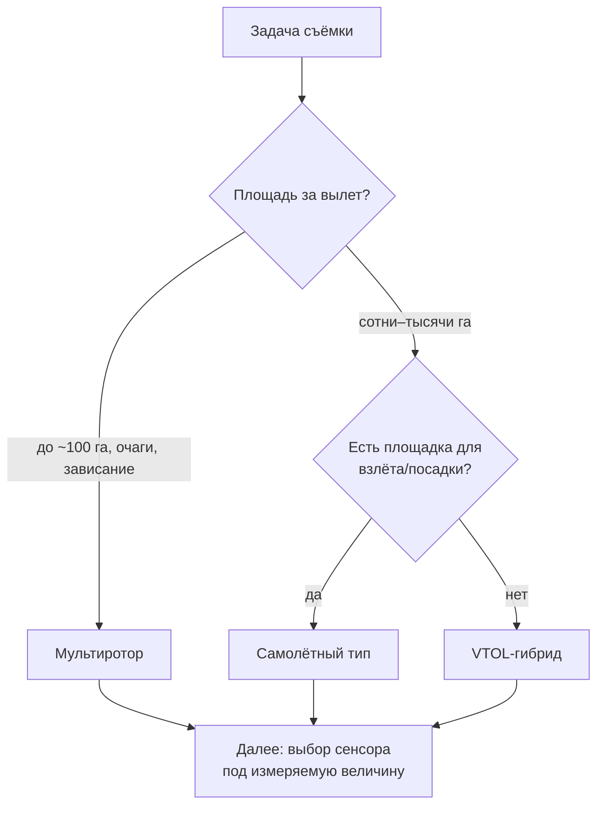
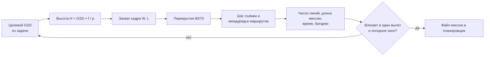

# Собираем БПЛА-комплекс под агрозадачу: носитель, сенсор, электроника и полётный план

> ⏱ **Трудозатраты:** ~25 мин чтения + ~25 мин практики
> Модуль **А1: Жизненный цикл данных в агросфере (+ БПЛА и IoT)**, урок 2 из 4.
> Академический уровень. Проект UNDP-KAZ FOLUR. Компоненты FOLUR: **1**, **2**.

## Цели лекции и место в модуле

В [Уроке 1](01-zhiznennyy-tsikl-agrodannykh.md) БПЛА был одной строкой в карте источников данных. Теперь мы раскрываем эту строку до инженерного уровня: из чего состоит беспилотный комплекс, какие бывают носители и сенсоры, какая электроника обеспечивает геопривязку и автономный полёт, и — главное — как перевести агрономическую задачу в конкретные полётные параметры: GSD, высоту, перекрытия, схему маршрутов. Это ядро прикладного продукта модуля: в [практикуме](../practicum/01-poljotnoe-zadanie-bpla.md) вы спроектируете полётное задание по методике этой лекции, а в [ИИ-задании](../ai-assistant.md) поручите те же расчёты кодинг-агенту и проверите его.

После изучения лекции слушатель сможет:

1. **[Bloom: знать]** перечислять типы носителей БПЛА, классы сенсорной нагрузки и ключевые компоненты бортовой электроники.
2. **[Bloom: понимать]** объяснять, как высота полёта, характеристики камеры и перекрытия определяют GSD, ширину захвата и качество фотограмметрической сшивки.
3. **[Bloom: применять]** рассчитывать полётные параметры под заданный GSD для участка в Северном Казахстане и составлять схему маршрутов.
4. **[Bloom: анализировать]** сопоставлять комбинации «носитель + сенсор» с классами агрозадач и выявлять несоответствия между задачей и предлагаемой конфигурацией комплекса.

> **Границы лекции.** Внутри: устройство БПЛА-комплекса (носители, сенсоры, электроника) и методика полётного планирования. За рамками: сравнение БПЛА со спутниками и правовые рамки полётов в РК — этому целиком посвящён [Урок 3](03-bpla-ili-sputnik.md); фотограмметрическая обработка после полёта — обзорно в [Уроке 1, раздел 4](01-zhiznennyy-tsikl-agrodannykh.md), практически — в модуле [П7](../../p7/index.md); форматы хранения облаков точек и растров — в [Уроке 4](04-standarty-formaty-fair.md). Пилотирование как навык здесь не преподаётся: все задания платформы выполнимы на готовых наборах снимков — «дрон не обязателен».

---

## 1. БПЛА — это летающая измерительная система

Первая смена оптики, которую требует профессиональная работа: дрон — не «летающая камера для красивых кадров», а измерительная система, каждый элемент которой влияет на пригодность данных для анализа. Комплекс состоит из четырёх подсистем: **носитель** (планер с двигателями — определяет площадь, время и условия работы), **сенсорная нагрузка** (что именно измеряем), **навигация и управление** (GNSS/RTK, IMU, автопилот — определяют геопривязку и повторяемость), **наземный сегмент** (станция управления, планировщик миссий, канал телеметрии). Ошибка в любой подсистеме обесценивает остальные: идеальный мультиспектральный сенсор на носителе без RTK даст красивую, но плохо привязанную карту; идеальная навигация с неоткалиброванной камерой — точно привязанные, но искажённые измерения.

Отсюда правило выбора комплекса, зеркальное методике Урока 1: сначала задача (что измеряем, с каким GSD, на какой площади, как часто), затем сенсор (он определяется измеряемой величиной), затем носитель (он определяется сенсором и площадью), и лишь затем — бюджет и конкретные модели. Продавцы техники предлагают обратный порядок; результат обратного порядка мы видели в кейсе Урока 1.

Второе следствие «измерительной» оптики — дисциплина воспроизводимости. Научная и производственная ценность съёмки в том, что её можно повторить в тех же параметрах через месяц и честно сравнить результаты. Это значит, что полётное задание — не разовая настройка в приложении, а документ: файл миссии, версия прошивки, параметры камеры, условия съёмки сохраняются вместе с данными. Хозяйство, которое так делает, через три сезона имеет сравнимый архив; хозяйство, которое летает «как в прошлый раз, вроде бы», — набор несопоставимых картинок.

---

## 2. Носители: мультиротор, самолётный тип, VTOL

| Характеристика | Мультиротор | Самолётный тип (fixed-wing) | VTOL (гибрид) |
|---|---|---|---|
| Взлёт/посадка | Вертикально, с любой площадки | Разбег/катапульта, посадка на полосу или парашют | Вертикально, полёт «по-самолётному» |
| Типичное время полёта | Десятки минут | Часы (у крупных платформ) | Между ними, ближе к самолётному |
| Площадь за вылет | Десятки–первые сотни га | Сотни–тысячи га | Сотни–тысячи га |
| Скорость и манёвренность | Может зависать, летать низко и медленно | Не может зависать; минимальная скорость ограничена | Может зависать в вертолётном режиме |
| Чувствительность к ветру | Умеренная | Выше устойчивость на маршруте | Зависит от режима |
| Сложность эксплуатации | Низкая | Средняя (нужны площадки, навык запуска) | Выше (два режима, сложнее механика) |
| Типовая агрозадача | Детальный осмотр полей и очагов, съёмка небольших участков, зависание над точкой | Картирование больших массивов пашни | Большие площади при отсутствии посадочных полос |

**Мультиротор** — рабочая лошадка малых и средних задач: прост во взлёте с края поля, может снизиться к очагу поражения, зависнуть над точкой для детального кадра. Расплата — аэродинамическая неэффективность: подъёмная сила создаётся только винтами, энергия батареи расходуется быстро, поэтому большие площади требуют многих вылетов и смен батарей.

**Самолётный тип** летит на крыле, поэтому энергетически эффективен: часы в воздухе, тысячи гектаров за смену. Именно такие платформы имеют смысл для сплошного картирования зерновых массивов Северного Казахстана, где поля измеряются сотнями гектаров, а хозяйства — десятками тысяч. Ограничения: нужна площадка для взлёта и посадки, нельзя зависнуть, минимальная высота и скорость ограничены аэродинамикой — детальный осмотр отдельного очага не его жанр.

**VTOL-гибрид** взлетает вертикально, как коптер, и летит горизонтально, как самолёт, совмещая независимость от площадок с эффективностью крыла. Цена совмещения — механическая и программная сложность: больше узлов, которые могут отказать, выше требования к обслуживанию и квалификации оператора.

### 2.1 Энергетика и логистика вылетов

Практическое планирование упирается не в паспортное «время полёта», а в **полезное время съёмки**: от паспортной цифры отнимите взлёт и набор высоты, перелёт к участку и обратно, развороты между линиями и обязательный резерв на отказные сценарии. У мультиротора при холодной погоде ёмкость батарей дополнительно проседает — существенный фактор для ранневесенних и осенних съёмок в Северном Казахстане. Отсюда логистика: сколько батарей брать в поле, где и от чего заряжать, сколько смен батарей выдержит световой день. Крупная съёмка — это график вылетов на несколько дней, и погодное окно (раздел 5.3) должно закладываться в него с самого начала.

Второй логистический вопрос — транспортировка и развёртывание. Мультиротор разворачивается за минуты с любой обочины; самолётному типу нужна оценка площадки, направление ветра при запуске и посадке, свободные подходы. Третий — данные: за смену комплекс порождает десятки гигабайт снимков и логов, и в плане выезда должен быть ответ, на что они копируются в поле и как доезжают до хранилища хозяйства без потери (двойное копирование на независимые носители — минимальная дисциплина стадии сбора из Урока 1).



*Рис. 1. Дерево выбора носителя: площадь и условия базирования решают почти всё. Alt: блок-схема выбора: от задачи съёмки вопрос о площади за вылет ведёт либо к мультиротору (малые площади, очаги), либо к вопросу о наличии взлётной площадки, который разводит самолётный тип и VTOL; все три ветви сходятся к следующему шагу — выбору сенсора.*

---

## 3. Сенсорная нагрузка: что именно мы измеряем

Сенсор — это и есть измерительный прибор; носитель лишь доставляет его в нужные точки. Классы нагрузки:

**RGB-камера** — снимает в видимом диапазоне. Базовые продукты: ортофотоплан, ЦМР/ЦММ через фотограмметрию, визуальная диагностика (полегание, вымочки, огрехи сева, повреждения техникой). Самый доступный и универсальный сенсор; для многих задач хозяйства его достаточно.

**Мультиспектральная камера** (индустриальные линейки типа MicaSense, Sentera) — несколько узких спектральных каналов, включая ближний инфракрасный (NIR) и red edge, невидимые глазу, но критичные для оценки состояния растительности: здоровая биомасса сильно отражает NIR. Из каналов считаются вегетационные индексы (NDVI и семейство), по которым строятся карты неоднородности посевов. Требует радиометрической калибровки (эталонная панель, датчик освещённости), иначе значения индексов несравнимы между вылетами — а без сравнимости нет мониторинга динамики.

**Гиперспектральная камера** — сотни узких каналов, спектральная подпись каждого пикселя. Позволяет различать то, что мультиспектру недоступно (виды растительности, тонкие физиологические состояния), но дорога, капризна в калибровке и порождает большие объёмы данных; в агропрактике региона — инструмент исследовательских проектов, не рутины.

**Тепловизор** — измеряет температуру поверхности. Агроприменения: водный стресс растений (транспирация охлаждает листья — стрессующие участки теплее), поиск переувлажнённых и пересушенных зон, контроль работы полива. Тонкость: температурный контраст зависит от времени суток и погоды, съёмка требует продуманного временного окна.

**LiDAR** — активный лазерный сканер, строит облако точек напрямую, без фотограмметрии. Ключевое преимущество перед SfM: часть импульсов пробивает растительный полог до земли, что даёт настоящую ЦМР под растительностью и структуру полога (высоту, плотность). Для задач модуля А6 (лесополосы, экосистемы) это незаменимо; для ровной пашни без покрова обычная фотограмметрия дешевле и достаточна.

**Эхолот на БПЛА** — гидроакустический промер глубин с низколетящего носителя или буксируемого поплавка, управляемого дроном. Расширяет батиметрию на малые и труднодоступные водоёмы, где спуск лодки нерационален. Полный конвейер обработки таких промеров — фильтрация, интерполяция, карта глубин — разбирается в модуле [А4](../../a4/index.md) на учебном датасете платформы (обезличенные промеры водохранилища степной зоны Казахстана): подробнее — в нём.

Правило соответствия сенсора задаче формулируется через измеряемую величину: «увидеть» (RGB), «оценить состояние растительности» (мультиспектр), «оценить водный стресс» (тепловизор), «измерить рельеф и структуру полога» (LiDAR), «измерить глубины» (эхолот). Если подрядчик предлагает гиперспектр для задачи «найти огрехи сева» — это несоответствие класса задачи и класса сенсора, оплачивать которое будет заказчик.

### 3.1 Матрица «агрозадача → сенсор»

| Агрозадача | Первый выбор | Когда добавлять второй сенсор |
|---|---|---|
| Огрехи сева, полегание, колеи, инвентаризация | RGB | — |
| Неоднородность состояния посевов, зоны для обследования | Мультиспектр | RGB для интерпретации причин |
| Водный стресс, контроль полива | Тепловизор | Мультиспектр для разделения причин стресса |
| Подсчёт всходов, детекция сорняков (для ML в А3) | RGB с малым GSD | Мультиспектр при спектрально близких видах |
| Рельеф под мелиорацию, сток, микропонижения | RGB-фотограмметрия (голая почва) | LiDAR при наличии растительного покрова |
| Состояние лесополос, структура полога | LiDAR | RGB/мультиспектр для состояния листвы |
| Малые водоёмы: глубины, заиление | Эхолот (БПЛА или лодка) | Фотограмметрия береговой линии |

Матрица читается в обе стороны. Прямое чтение — выбор сенсора под задачу. Обратное — аудит предложения подрядчика: если конфигурация комплекса не находит своей строки, требуйте обоснования. Отметим также экономику совмещения: один вылет с двумя сенсорами (например, RGB + мультиспектр) обычно дешевле двух вылетов, но тяжелее по массе и энергетике — ещё одна связь между разделами 2 и 3.

---

## 4. Электроника: навигация, ориентация, автопилот

**GNSS-модуль** даёт координаты носителя. Как мы разобрали в [Уроке 1, раздел 3](01-zhiznennyy-tsikl-agrodannykh.md), автономный приёмник — это метры ошибки, RTK/PPK — сантиметры. Для фотограмметрии картографического качества RTK/PPK-борт либо наземные опорные точки обязательны; для обзорного осмотра достаточно автономного режима.

**IMU (инерциальный измерительный блок)** — гироскопы и акселерометры, измеряющие ориентацию: крен, тангаж, курс. В момент срабатывания затвора автопилот записывает не только координату, но и углы камеры — без них фотограмметрия сходится хуже, а прямая геопривязка невозможна. IMU также держит носитель стабильным между обновлениями GNSS.

**Автопилот** — бортовой компьютер, исполняющий полётное задание: держит высоту и маршрут, управляет затвором камеры, отрабатывает отказные сценарии (потеря связи → возврат домой; низкий заряд → посадка). Открытые экосистемы **PX4** и **ArduPilot** — фактический стандарт: открытый код, поддержка десятков типов носителей, совместимость с открытыми наземными станциями (QGroundControl, Mission Planner) по открытому протоколу телеметрии MAVLink. Для платформы это принципиально: планирование миссий изучается на открытом стеке, без привязки к экосистеме одного производителя.

**Телеметрия** — радиоканал между бортом и наземной станцией: положение, заряд, статус задания в реальном времени, возможность скорректировать или прервать миссию. Дальность и надёжность канала — практический ограничитель площади одной миссии наравне с батареей.

Связка подсистем в терминах жизненного цикла: автопилот и планировщик реализуют стадию *планирования съёмки* в железе и софте; GNSS/RTK и IMU обеспечивают *качество геопривязки*; логи автопилота и GNSS — это *метаданные* полёта, которые обязаны сохраняться вместе со снимками (стадия хранения). Выбрасывая логи, вы выбрасываете возможность PPK-обработки и разбора любых аномалий съёмки.

### 4.1 Прямая геопривязка или опорные точки: три рабочих схемы

Комбинация «борт + земля» даёт три схемы обеспечения точности, между которыми выбирают по задаче и доступному оборудованию.

**Схема 1: автономный GNSS + густая сеть GCP.** Дешёвый борт, вся точность — от наземных опорных точек, измеренных точным приёмником. Трудозатратна в поле (раскладка и измерение марок на каждый вылет), зато не требует RTK-оборудования на борту. Рациональна для разовых съёмок небольших участков.

**Схема 2: RTK/PPK-борт + контрольные точки.** Точность даёт бортовая геопривязка центров фотографирования; несколько наземных точек оставляются только как независимый контроль (check points). Основная схема регулярного производственного мониторинга: минимум полевой работы при подтверждаемой точности.

**Схема 3: автономный GNSS без опорных точек.** Быстро и без наземных работ, но продукт привязан с метровыми ошибками и, что важнее, ошибка ничем не подтверждена. Допустимо для визуального осмотра и относительных сравнений внутри одного вылета; недопустимо для измерений площадей, объёмов и совмещения с другими слоями.

Заметьте: ни в одной схеме нет варианта «RTK-борт, и поэтому проверять нечего». Независимый контроль — обязательный элемент производственной съёмки, как контрольные точки в фотограмметрии Урока 1 и как шаг верификации в [ИИ-задании модуля](../ai-assistant.md).

---

## 5. Полётное планирование: от задачи к параметрам миссии

Теперь ядро лекции — перевод задачи в числа. Планировщик миссий (QGroundControl, Mission Planner и аналоги) попросит у вас: контур участка, высоту, перекрытия, скорость. Откуда их взять?

### 5.1 GSD — главный параметр

**GSD (Ground Sample Distance)** — размер пикселя снимка на местности. Он определяет, что в принципе различимо на данных: объект уверенно распознаётся, когда занимает хотя бы несколько пикселей. Формула:

```
GSD = H × p / f
```

где `H` — высота полёта над поверхностью, `p` — физический размер пикселя матрицы, `f` — фокусное расстояние объектива.

Работаем с **условным учебным сенсором** (все числа — иллюстративные, для реального проекта берите паспорт вашей камеры): размер пикселя `p = 3 мкм`, фокусное расстояние `f = 8 мм`, матрица `4000 × 3000` пикселей. На высоте `H = 120 м`:

```
GSD = 120 м × 0,000003 м / 0,008 м = 0,045 м = 4,5 см
```

Обратная задача встречается чаще: задан целевой GSD, найти высоту. Нужно 3 см на пиксель? `H = GSD × f / p = 0,03 × 0,008 / 0,000003 = 80 м`. Отсюда рабочее следствие: GSD линеен по высоте — снизились вдвое, получили вдвое детальнее, но и вдвое уже полоса захвата, а значит, почти вчетверо больше времени на ту же площадь.

Ширина захвата одного снимка: `W = 4000 пикс × 0,045 м = 180 м` поперёк маршрута (на H = 120 м для условного сенсора); вдоль маршрута кадр покрывает `L = 3000 × 0,045 = 135 м`.

### 5.2 Перекрытия и схема маршрутов

Фотограмметрии нужны перекрывающиеся снимки: каждая точка местности должна быть видна с нескольких ракурсов. Общепринятые отправные значения для равнинной местности — порядка **75–80% продольного** (вдоль маршрута) и **60–70% поперечного** (между соседними маршрутами) перекрытия; для однородных поверхностей с бедной текстурой (созревшая пшеница, водная гладь, снег) перекрытия увеличивают — сшивке нужно больше общих точек.

Из перекрытий следуют шаг съёмки и междурядье маршрутов. Для нашего условного сенсора на 120 м при продольном перекрытии 80%: интервал между снимками `= L × (1 − 0,8) = 135 × 0,2 = 27 м`. При поперечном перекрытии 70%: расстояние между линиями маршрута `= W × (1 − 0,7) = 180 × 0,3 = 54 м`. Участок шириной 1 км потребует ~19 параллельных линий. Прибавьте развороты за границей участка — и получите оценку длины миссии, которую планировщик сверит с ёмкостью батареи.



*Рис. 2. Расчётная цепочка полётного планирования: от целевого GSD к файлу миссии; если миссия не помещается в вылет — пересматриваем GSD или делим участок. Alt: последовательность блоков: целевой GSD задаёт высоту, высота — захват кадра, захват с перекрытиями — шаг съёмки и междурядье, из них — длина и время миссии; ромб проверки «влезает ли в вылет» возвращает к пересмотру GSD либо ведёт к загрузке миссии в планировщик.*

### 5.3 Скорость, свет, погодное окно

Скорость полёта ограничена сверху смазом изображения (за время выдержки носитель не должен смещаться больше, чем на долю GSD) и минимальным интервалом срабатывания камеры. Свет: оптимальны часы вокруг полудня со стабильной освещённостью; рваная переменная облачность — худший режим для мультиспектра (освещённость скачет между кадрами). Ветер: у каждого носителя — паспортный предел, но для качества данных фактический предел ниже паспортного, особенно у лёгких коптеров. Планирование в степной зоне Северного Казахстана означает планирование *вокруг ветра*: закладывайте резервные дни на миссию.

У специализированных сенсоров — свои временные окна. Тепловизионная съёмка водного стресса информативна тогда, когда контраст между транспирирующими и стрессующими растениями максимален — в жаркие послеполуденные часы ясного дня; та же съёмка ранним утром покажет выровненное поле и ничего не диагностирует. Мультиспектральная съёмка для *мониторинга динамики* должна выполняться в близких условиях от даты к дате: сопоставимое время суток, сопоставимая фенофаза, обязательная калибровка по эталонной панели в каждом вылете. Это прямое продолжение принципа Урока 1: сравнимость данных проектируется до сбора, а не восстанавливается после.

### 5.4 Типичные ошибки планирования

Разбор чужих ошибок дешевле собственных, поэтому зафиксируем самые частые. **Высота «на глаз»**: миссия планируется на привычной высоте, а не от целевого GSD; итог — либо неразличимые объекты, либо лишние часы съёмки. **Перекрытия по умолчанию на однородной поверхности**: сшивка разваливается посреди созревшего поля, пересъёмка — новый выезд за сотни километров. **Игнорирование рельефа**: высота задана от точки взлёта, а участок имеет перепад; фактический GSD и перекрытия «плывут» по кадру — на пересечённых участках включайте режим следования рельефу (terrain following), который поддерживают открытые планировщики. **Съёмка «когда приехали», а не в световое и погодное окно**: длинные тени утром и вечером рушат радиометрию, порывистый ветер — геометрию. **Отсутствие плана на данные**: снимки остаются на карте памяти до следующего вылета и перезаписываются — потеря, которую не компенсирует никакая точность борта.

Общий корень этих ошибок один: планирование ведётся от техники («как удобно летать»), а не от задачи («что должно быть различимо и измеримо»). Расчётная цепочка рис. 2 — противоядие: она принуждает начинать с целевого GSD и заканчивать проверкой выполнимости.

### 5.5 Чек-лист миссии

Перед вылетом (и перед сдачей практикума) проверьте: (1) контур участка корректен и покрыт маршрутами с запасом на краях; (2) высота соответствует целевому GSD по формуле; (3) перекрытия не ниже отправных значений, увеличены для однородных поверхностей; (4) время миссии с разворотами укладывается в батарею с резервом; (5) заданы отказные сценарии; (6) правовые условия полёта выполнены — учёт/регистрация носителя и отсутствие запретных зон проверены по актуальным официальным источникам (систему ограничений разбираем в [Уроке 3](03-bpla-ili-sputnik.md)); (7) определено, куда и с какими метаданными лягут снимки и логи после посадки (стандарты — [Урок 4](04-standarty-formaty-fair.md)).

---

## Региональный кейс

**Ситуация:** агроном хозяйства в Акмолинской области по спутниковому NDVI-мониторингу (навык модуля П7) обнаружил на пшеничном поле зону угнетения площадью в несколько десятков гектаров. Снимок Sentinel-2 с пикселем 10 м показывает, *что* зона есть, но не показывает, *почему*: на 10-метровом пикселе неразличимы огрехи сева, очаги сорняков, повреждения техникой и вымочки. Принято решение обследовать зону дроном. Вам поручено спроектировать миссию: мультиротор с RGB-камерой (условный сенсор из раздела 5.1), задача — различать объекты от 10 см (междурядья, колеи, пятна сорняков).

**Данные:** контур проблемной зоны — оцифровка по свежему снимку Sentinel-2 (Copernicus Data Space Ecosystem, открытый доступ); подложка — OpenStreetMap. Для отработки обработки без дрона — открытые демонстрационные наборы аэрофотоснимков проекта OpenDroneMap.

**Задача:**

1. Объект 10 см должен занимать не меньше ~3 пикселей; какой целевой GSD отсюда следует и какая высота полёта нужна условному сенсору (`p = 3 мкм`, `f = 8 мм`)?
2. Рассчитайте междурядье маршрутов при поперечном перекрытии 70% и оцените число линий для зоны шириной 600 м.
3. Какие два пункта чек-листа 5.5 наиболее критичны для этого вылета и почему?

**Разбор:** из условия «3 пикселя на 10 см» целевой GSD ≈ 3,3 см; высота `H = 0,033 × 0,008 / 0,000003 ≈ 88 м`. Захват кадра поперёк маршрута на этой высоте `W = 4000 × 0,033 ≈ 132 м`; при перекрытии 70% междурядье ≈ 40 м, зона шириной 600 м потребует ~16 линий. Критичные пункты: (3) перекрытия — созревающая пшеница текстурно однородна, и экономия на перекрытиях сорвёт сшивку; (6) правовой чек — рядом могут проходить зоны с ограничениями полётов, что проверяется до выезда, а не в поле. Заметьте, что расчёт выявил и запас оптимизации: если агроному достаточно различать не междурядья, а только пятна сорняков от полуметра, целевой GSD смягчается до ~15 см, высота растёт, а число линий и время миссии падают в разы — переспросить заказчика о минимальном различимом объекте дешевле, чем летать с избыточной детальностью. Обратите внимание и на архитектуру решения в целом: спутник дёшево нашёл *где* проблема, дрон дорого, но точно ответит *почему* — это и есть комбинированная стратегия, которую формализует [Урок 3](03-bpla-ili-sputnik.md). Кейс продолжается в [практикуме](../practicum/01-poljotnoe-zadanie-bpla.md), где вы выполните полный расчёт и оформите миссию.

---

## Закрепление и применение

!!! example "Попробуйте в Colab"
    Ноутбук урока: `<URL будет назначен при создании репозитория ноутбуков>`. В нём — калькулятор полётного плана: функции `gsd(H, p, f)`, `footprint(...)`, `line_spacing(...)` и упражнение: постройте график зависимости времени миссии от целевого GSD для участка 200 га и найдите GSD, при котором миссия перестаёт помещаться в один вылет условного коптера.

!!! warning "Границы применимости"
    Все численные примеры лекции построены на **условном сенсоре** — перед реальным проектом подставьте паспортные характеристики вашей камеры и носителя. Отправные перекрытия 80/70 — эвристика для равнины; рельеф, высокая растительность и бедная текстура требуют их увеличения. Формула GSD предполагает надирную съёмку и плоский участок: на склонах фактический GSD меняется по кадру. Правовые требования к полётам БПЛА в РК меняются — проверяйте актуальную редакцию НПА перед каждым проектом, а не конспект курса.

!!! tip "Что это даёт вашему хозяйству"
    Умение прочитать полётное задание — это умение принимать работу подрядчика: заказчик, который спрашивает «какой GSD, какие перекрытия, где логи GNSS и калибровка камеры», получает данные, пригодные для анализа, а не только красивую картинку. А расчёт раздела 5 позволяет заранее оценить, сколько вылетов стоит сплошная съёмка вашей площади — и не переплачивать за детальность, которая задаче не нужна.

!!! question "Кейс для размышления"
    Хозяйство заказало мультиспектральную съёмку двух соседних полей у двух разных подрядчиков в разные дни. Карты NDVI получились несравнимыми: одинаковые по состоянию посевы дали разные значения индекса. Какие элементы комплекса и методики из разделов 3 и 5.3 могли к этому привести? (Подсказка: радиометрическая калибровка, эталонная панель, освещённость, время суток.)

---

### Проверь себя

```quiz
[
  {
    "q": "Для сплошного картирования массива пашни в несколько тысяч гектаров при наличии площадок для взлёта и посадки рационален прежде всего:",
    "options": ["Носитель самолётного типа", "Мультиротор", "Любой носитель с тепловизором", "VTOL — всегда лучший выбор"],
    "answer": 0,
    "explain": "§2: полёт на крыле энергетически эффективен — часы в воздухе и тысячи гектаров за смену; мультиротор потребует многих вылетов, VTOL оправдан при отсутствии площадок."
  },
  {
    "q": "Условный сенсор: пиксель 3 мкм, фокусное 8 мм. Какая высота даёт GSD = 3 см?",
    "options": ["80 м", "120 м", "45 м", "8 м"],
    "answer": 0,
    "explain": "§5.1: H = GSD × f / p = 0,03 × 0,008 / 0,000003 = 80 м."
  },
  {
    "q": "Зачем мультиспектральной съёмке радиометрическая калибровка по эталонной панели?",
    "options": ["Чтобы значения индексов были сравнимы между вылетами и датами", "Чтобы увеличить ширину захвата", "Чтобы снизить требования к перекрытиям", "Чтобы заменить GNSS-геопривязку"],
    "answer": 0,
    "explain": "§3: без калибровки значения NDVI зависят от освещённости конкретного вылета — мониторинг динамики становится невозможен."
  },
  {
    "q": "Почему для съёмки созревшего однородного пшеничного поля перекрытия следует увеличивать относительно отправных 80/70?",
    "options": ["Однородная текстура даёт мало общих точек для фотограмметрической сшивки", "Зрелая пшеница сильнее отражает NIR", "На больших перекрытиях выше скорость полёта", "Перекрытия компенсируют отсутствие RTK"],
    "answer": 0,
    "explain": "§5.2: сшивка опирается на поиск общих точек между кадрами; бедная текстура — меньше точек — нужен больший запас перекрытия."
  },
  {
    "q": "Какой компонент записывает углы ориентации камеры (крен, тангаж, курс) в момент снимка?",
    "options": ["IMU", "Телеметрийный радиоканал", "Эталонная калибровочная панель", "Наземная станция"],
    "answer": 0,
    "explain": "§4: инерциальный блок измеряет ориентацию; вместе с координатами GNSS эти углы входят в метаданные кадра и нужны фотограмметрии."
  }
]
```

### Контрольные вопросы

1. Назовите четыре подсистемы БПЛА-комплекса и по одному последствию отказа каждой для качества данных. *(Bloom: знать)*
2. Объясните цепочку рис. 2: почему уменьшение целевого GSD вдвое увеличивает время съёмки почти вчетверо? *(Bloom: понимать)*
3. Рассчитайте параметры миссии для участка 400 × 800 м под GSD 2 см на условном сенсоре и решите, помещается ли она в один вылет коптера с 25 минутами полезного времени при скорости 8 м/с. *(Bloom: применять/анализировать)*

## Что дальше?

Вы умеете проектировать съёмку с дрона — но всегда ли дрон нужен? [Урок 3 «Выбираем платформу наблюдения: БПЛА, спутник или их комбинация»](03-bpla-ili-sputnik.md) поставит БПЛА в один ряд с Sentinel-2 и коммерческими спутниками, добавит погодные и правовые ограничения РК и даст решётку выбора платформы. Практическая обработка снимков в открытом конвейере — в модуле [П7](../../p7/index.md); применение LiDAR и эхолота — в модулях [А6](../../a6/index.md) и [А4](../../a4/index.md).
