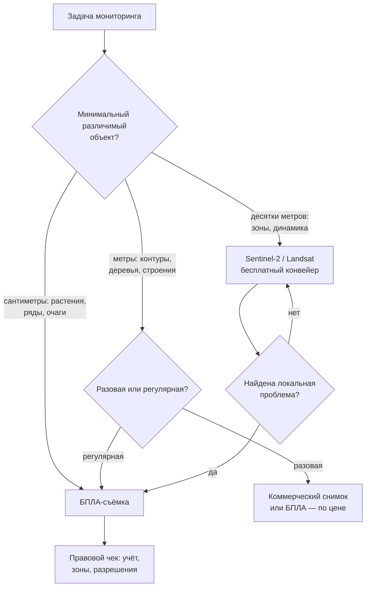

# Выбираем платформу наблюдения: БПЛА, спутник или их комбинация

> ⏱ **Трудозатраты:** ~23 мин чтения + ~20 мин практики
> Модуль **А1: Жизненный цикл данных в агросфере (+ БПЛА и IoT)**, урок 3 из 4.
> Академический уровень. Проект UNDP-KAZ FOLUR. Компоненты FOLUR: **1**, **2**.

## Цели лекции и место в модуле

[Урок 1](01-zhiznennyy-tsikl-agrodannykh.md) дал карту источников данных, [Урок 2](02-bpla-kompleks-i-polyotnyy-plan.md) — инженерию самого гибкого из них. Теперь главный управленческий вопрос модуля: **когда БПЛА действительно нужен, а когда задача решается спутником — бесплатно и без выезда в поле?** Ответ никогда не сводится к «что лучше»: платформы наблюдения различаются по трём осям — разрешение, периодичность, покрытие — и по двум классам ограничений: погодным и правовым. Эта лекция даёт решётку выбора, которая ляжет в основу обоснования — второй половины прикладного продукта модуля.

После изучения лекции слушатель сможет:

1. **[Bloom: знать]** называть характерные разрешения (2–10 см у БПЛА, 10 м у Sentinel-2, 0,3–3 м у коммерческих спутников), периодичности и масштабы покрытия платформ наблюдения.
2. **[Bloom: понимать]** объяснять, почему облачность, ширина полосы обзора и правовой режим меняют «паспортные» характеристики платформ на практические.
3. **[Bloom: применять]** подбирать платформу или комбинацию платформ под конкретную задачу мониторинга хозяйства Северного Казахстана.
4. **[Bloom: анализировать]** строить и защищать письменное обоснование выбора платформы с учётом задачи, бюджета, погоды и правовых рамок РК.

> **Границы лекции.** Внутри: сравнительная решётка «БПЛА — открытые спутники — коммерческие спутники», погодные и правовые ограничения, комбинированные стратегии. За рамками: устройство БПЛА-комплекса и расчёт миссий — в [Уроке 2](02-bpla-kompleks-i-polyotnyy-plan.md); работа с каталогами спутниковых данных (GEE, CDSE, Planetary Computer) как навык — в модуле [А3](../../a3/index.md); обработка и анализ выбранных данных — в модулях [А2](../../a2/index.md) и [П7](../../p7/index.md).

---

## 1. Три платформы — три экономики наблюдения

Сравнивать платформы нужно не как приборы, а как *экономики*: у каждой свой способ распределять затраты. Этот угол зрения сразу снимает бесплодный спор «что лучше»: лучшей платформы не существует, существует платформа с подходящей структурой затрат под вашу структуру задач. Управленец, который понимает три экономики ниже, перестаёт быть заложником аргументов продавца — и техники, и снимков, и «инновационных сервисов».

**Открытые спутниковые миссии** (Sentinel-1/2 программы Copernicus, Landsat, MODIS/ASTER) финансируются космическими агентствами; для пользователя данные бесплатны и доступны через открытые каталоги — Copernicus Data Space Ecosystem, Google Earth Engine, Microsoft Planetary Computer. Экономика: нулевая цена снимка, но фиксированные орбитой параметры — вы не управляете ни разрешением, ни датой съёмки. Sentinel-2 даёт мультиспектральные снимки с пикселем **10 м** (в основных каналах видимого и ближнего ИК диапазона) с регулярностью в несколько суток; Landsat — многолетний архив с 30-метровым пикселем, незаменимый для ретроспектив; радарный Sentinel-1 видит сквозь облака, что делает его основой мониторинга паводков (подробнее — в [А4](../../a4/index.md)).

**Коммерческие спутники сверхвысокого разрешения** продают снимки с пикселем порядка **0,3–3 м**, в том числе съёмку по заказу на выбранную дату. Экономика: платите за площадь и оперативность; для регулярного мониторинга больших массивов это заметный бюджет, поэтому в открытом учебном стеке платформы они присутствуют только в сравнительных обзорах — как эта лекция.

**БПЛА** даёт **2–10 см** на пиксель и полную власть над датой и временем съёмки — но каждый гектар оплачивается временем оператора, батареями и обработкой. Экономика: высокая стоимость единицы площади, зато нулевая зависимость от чужих орбит и (в отличие от спутников) продукты рельефа — ЦМР/ЦММ из [Урока 1](01-zhiznennyy-tsikl-agrodannykh.md). Устройство и планирование этой платформы вы уже знаете из [Урока 2](02-bpla-kompleks-i-polyotnyy-plan.md) — здесь она участвует как один из трёх кандидатов на задачу.

Таблица-решётка, вокруг которой построен весь урок:

| Ось | БПЛА | Открытые спутники (Sentinel-2) | Коммерческие спутники |
|---|---|---|---|
| Разрешение | 2–10 см | 10 м | 0,3–3 м |
| Периодичность | По запросу (в погодное окно) | Регулярно, интервалы от нескольких суток до ~2 недель у разных миссий (3–16 дней) | По заказу / регулярные программы |
| Покрытие за съёмку | Десятки — сотни га | Полоса обзора в сотни км: тысячи км² | Сцены от десятков км² |
| Цена данных | Время, техника, обработка | Бесплатно | Платно, за км² |
| Прямые продукты рельефа | Да (ЦМР/ЦММ, облако точек) | Нет | Ограниченно (стерео-заказ) |
| Погодная зависимость | Ветер, осадки | Облачность (кроме радара) | Облачность |
| Правовая нагрузка на пользователя | Регистрация/учёт, зоны, разрешения | Нет (открытая лицензия) | Лицензия поставщика |

---

### 1.1 Где физически брать открытые данные

Три главных входа в открытые спутниковые архивы, различающиеся не данными, а способом работы. **Copernicus Data Space Ecosystem (CDSE)** — официальный портал программы Copernicus: браузерный просмотр, поиск по каталогу, скачивание исходных сцен; лучший вход для разовых задач и знакомства с данными. **Google Earth Engine (GEE)** — облачная платформа анализа: архивы Sentinel/Landsat/MODIS уже лежат рядом с вычислителем, вы пишете код (JavaScript/Python), и обработка континентальных объёмов происходит на стороне сервиса; бесплатен для некоммерческого использования в пределах квот. **Microsoft Planetary Computer (MPC)** — аналогичная облачная модель вокруг открытого стандарта каталогов STAC и Python-стека. Практическое правило: смотреть и скачивать — CDSE; считать по площадям и рядам — GEE или MPC. Систематическая работа с этими каталогами — отдельный навык, который ставится в модуле [А3](../../a3/index.md); в практикуме этого модуля вам хватит браузерного CDSE.

Обратите внимание на архитектурный сдвиг, который несут GEE и MPC: не «скачай данные к себе», а «принеси код к данным». Для хозяйства это означает, что многолетний анализ всего района не требует ни терабайтных дисков, ни мощного компьютера — достаточно ноутбука с браузером. Это ещё один аргумент открытого стека: порог входа в спутниковую аналитику сегодня определяется не бюджетом, а квалификацией — которую и даёт эта программа.

## 2. Ось разрешения: что различимо на каком пикселе

Разрешение — не абстрактное «качество», а прямой ответ на вопрос, какие объекты платформа способна различить. Ориентир из Урока 2: объект уверенно распознаётся, занимая хотя бы несколько пикселей.

На **10-метровом пикселе Sentinel-2** поле в сотни гектаров — это тысячи пикселей: прекрасно видны зоны неоднородности посева, динамика вегетации, границы полей, крупные вымочки и солонцовые пятна. Неразличимы: отдельные растения, междурядья, колеи, локальные огрехи сева, состояние лесополосы по деревьям. Индексная аналитика (NDVI и производные) на этом разрешении — рабочий стандарт мониторинга зерновых массивов региона: для полей Северного Казахстана, где типичное поле измеряется сотнями гектаров, 10-метровый пиксель даёт достаточную статистику по каждому полю при полном покрытии массива.

На **пикселе 0,3–3 м** коммерческих спутников появляются отдельные деревья лесополос, строения, техника, мелкие контуры; для задач инвентаризации земель и точного контурирования это качественный скачок. Но подсчёт всходов и детекция сорняков по-прежнему за пределами возможного: даже лучший коммерческий пиксель в десятки раз крупнее всхода пшеницы.

На **пикселе 2–10 см** БПЛА различимы отдельные растения, ряды, сорные пятна, повреждения; открываются задачи уровня «подсчитать и измерить каждый объект» — включая обучение ML-моделей детекции, к которым вы придёте в [А3](../../a3/index.md).

Важная тонкость грубого пикселя: значение 10-метровой ячейки Sentinel-2 — это *смесь* всего, что в неё попало. Пиксель на границе поля смешивает посев с дорогой и лесополосой; пиксель с редкими сорными куртинами усредняет их с культурой. Поэтому по одному «подозрительному» пикселю решения не принимаются: аналитика на грубом разрешении работает со статистикой по зонам и полям (зональная статистика — инструмент модуля [А2](../../a2/index.md)), а краевые пиксели полей принято исключать буфером. Понимание смешанных пикселей защищает от двух симметричных ошибок: паники из-за единичного тёмного пикселя и слепой веры, что «раз NDVI средний — всё равномерно хорошо».

Правило выбора по оси разрешения формулируется как в Уроке 2, от минимального различимого объекта: зоны продуктивности → десятки метров → Sentinel-2 бесплатно закрывает задачу; контуры и объекты метрового класса → коммерческий снимок или БПЛА; объекты сантиметрового класса → только БПЛА. Платить за разрешение, которое задача не требует, — самая частая ошибка бюджета мониторинга.

### 2.1 Не только пространство: спектральное измерение

Ось разрешения имеет второе, менее очевидное измерение — спектральное. Sentinel-2 несёт мультиспектральный инструмент с каналами от видимого до коротковолнового инфракрасного диапазона: помимо NDVI это открывает индексы влажности, снега, гарей и почв — то, чего базовая RGB-камера дрона не измеряет вовсе. То есть по спектральному богатству открытый спутник *превосходит* типовой БПЛА-комплекс с RGB-камерой: дрон выигрывает пространство, но проигрывает спектр, пока на него не установлен мультиспектральный сенсор из [Урока 2, раздел 3](02-bpla-kompleks-i-polyotnyy-plan.md).

Отсюда практическое предостережение о сравнимости: «NDVI со спутника» и «NDVI с дрона» — родственные, но не тождественные величины. Различаются ширина и положение спектральных каналов, геометрия наблюдения, атмосферная коррекция (продукты уровня L2A уже скорректированы, данные дрона — как откалибруете). Сопоставлять их можно — после приведения к общей сетке и при понимании различий; слепо смешивать в один ряд — нельзя. Методы совместного анализа двух источников разбираются в [А2](../../a2/index.md) и [П7](../../p7/index.md): подробнее — в них.

## 3. Ось периодичности: паспортная и фактическая

**Паспортная периодичность** открытых миссий — интервал между пролётами над одной точкой: у актуальных открытых оптических и радарных миссий он лежит в диапазоне от нескольких суток до ~двух недель (3–16 дней в зависимости от миссии и широты). **Фактическая периодичность** оптической съёмки ниже: облачный пролёт — потерянный кадр. Для Северного Казахстана это означает, что в отдельные периоды сезона полезный оптический снимок может отсутствовать несколько недель подряд — план мониторинга обязан это закладывать (резерв: радарный Sentinel-1, которому облака безразличны, — но это другой тип сигнала и другие методы, см. [А4](../../a4/index.md)).

**Периодичность БПЛА** — «по запросу», но честный запрос упирается в погодные окна ([Урок 2, раздел 5.3](02-bpla-kompleks-i-polyotnyy-plan.md)) и логистику: съёмка в 300 км от базы «завтра» — это выезд, оператор, батареи. Практическое следствие: БПЛА выигрывает ось периодичности только для *локальных* и *срочных* задач; для регулярного слежения за большим массивом стабильный спутниковый конвейер надёжнее любых обещаний «прилетим, когда скажете».

Отдельная ценность спутников, которой у БПЛА нет в принципе, — **архив**: по Landsat и Sentinel можно восстановить историю поля за десятилетия до того, как вы задались вопросом. Ни одно решение о покупке дрона не создаст архив прошлых лет.

### 3.1 Периодичность в календаре сезона

Требования к частоте наблюдений неравномерны по сезону, и это надо закладывать в план. В короткие критические окна — оценка перезимовки и влагозапасов, контроль всходов, решения по подкормкам и защите растений в фазы активной вегетации, предуборочная оценка — цена пропущенной недели максимальна, и именно на эти окна планируются резервы: радарные данные на случай затяжной облачности, готовность заказать облёт. В длинные «спокойные» отрезки достаточно редких контрольных наблюдений. Продуманный план мониторинга — это не «снимок раз в N дней», а календарь: какие решения агронома в какие даты требуют каких данных. Такой календарь — прямое продолжение шага 2 методики [Урока 1, раздел 5](01-zhiznennyy-tsikl-agrodannykh.md): данные под решения, а не наоборот.

Из календарной логики следует и практический приём работы с облачностью: если критическое окно длится две недели, а фактическая частота полезных сцен в этот месяц — одна-две, то решение должно приниматься по *первой доступной* сцене, а не по «лучшей»; конвейер обработки обязан быть готов к появлению сцены в каталоге, а не запускаться вручную через неделю после пролёта. Автоматизацию такого конвейера вы построите в модулях А2–А3.

## 4. Ось покрытия и экономика площади

Одна сцена Sentinel-2 покрывает территорию, сопоставимую с целым районом области, — тысячи квадратных километров; мониторинг **всех** полей хозяйства (и всех хозяйств района) стоит одинаково: ноль тенге за данные плюс вычисления. БПЛА за вылет покрывает десятки, реже сотни гектаров ([Урок 2, раздел 2](02-bpla-kompleks-i-polyotnyy-plan.md)); сплошная съёмка хозяйства в десятки тысяч гектаров — это недели полётов и терабайты обработки, что осмысленно только под задачи, которым действительно нужны сантиметры.

Отсюда асимметрия, которую стоит запомнить как формулу: **спутник масштабируется по площади, БПЛА — по детальности**. Экономически оптимальная система мониторинга почти всегда двухуровневая: сплошной дешёвый скрининг сверху, точечная дорогая детализация снизу. Конкретные цены на коммерческие снимки и услуги операторов БПЛА в лекции сознательно не приводятся: они быстро меняются и зависят от объёма и региона — запрашивайте актуальные коммерческие предложения и сравнивайте их по решётке раздела 1.

### 4.1 Свой дрон или подрядчик: структура полной стоимости

Для БПЛА-ветви решётки остаётся выбор «купить или заказывать», и он тоже решается структурой затрат, а не суммой на ценнике. Полная стоимость владения комплексом складывается из самого носителя и сенсора, запасных батарей и винтов, страховки и учёта, обучения и времени оператора, программного обеспечения обработки (в открытом стеке — бесплатного, но требующего вычислительных мощностей), амортизации и неизбежных ремонтов. Стоимость подрядной модели — цена за съёмку плюс организационные издержки: согласование сроков (конфликтующее с погодными окнами), контроль качества приёмки (чек-лист [Урока 1, раздел 4.1](01-zhiznennyy-tsikl-agrodannykh.md)) и договорной пункт о передаче исходников с метаданными — без него вы покупаете картинку, а не данные.

Качественное правило: подрядная модель выигрывает при редких (единицы раз за сезон) и стандартных съёмках; собственный комплекс — при регулярных, срочных или нестандартных задачах, когда стоимость каждого «вызова» подрядчика и потери от ожидания превышают расходы владения. Промежуточная форма, растущая в регионе, — кооперация: один комплекс и один обученный оператор на несколько соседних хозяйств. Какую бы модель вы ни выбрали, требования к данным (GSD, перекрытия, геопривязка, метаданные) формулируете вы — этому и учат Уроки 1–2.

## 5. Погодные и правовые ограничения

**Погодные.** Оптический спутник слеп под облаками; радар — нет. БПЛА не летает в дождь и сильный ветер, но летает под сплошной высокой облачностью, когда оптический спутник бесполезен, — платформы частично закрывают погодные слабости друг друга. Стоит помнить и о сезонной специфике региона: устойчивый снежный покров делает оптический мониторинг пашни зимой малоинформативным (но открывает задачи оценки снегозапасов), весенняя распутица ограничивает доезд БПЛА-команды до удалённых участков, а летние конвективные явления — грозы, шквалы — требуют от оператора готовности прервать миссию. Погодная матрица «платформа × сезон × задача» для конкретного хозяйства составляется один раз и сильно упрощает планирование.

**Правовые.** Для пользователя открытых спутниковых данных правовая нагрузка минимальна: лицензии открытых миссий разрешают свободное использование. С БПЛА иначе: эксплуатация беспилотников в РК регулируется — существуют требования по постановке на учёт/регистрации аппаратов, ограничения по зонам (приграничные территории, окрестности аэродромов, охраняемые объекты) и процедуры получения разрешений на использование воздушного пространства для ряда категорий полётов. Конкретные пороги (по массе аппарата, высоте, категориям зон) и процедуры в этой лекции сознательно не воспроизводятся: нормативная база обновляется, и единственная профессиональная практика — проверять действующую редакцию НПА РК и официальные карты зон ограничений перед каждым проектом `[UNVERIFIED: конкретные действующие пороги и процедуры — сверяйте с официальными источниками уполномоченного органа гражданской авиации РК]`. Для учебного проектирования миссий в этом модуле достаточно самой дисциплины: пункт «правовой чек» стоит в чек-листе миссии Урока 2 до пункта «взлёт», и его невыполнение — блокер, а не формальность.

Смежный правовой сюжет — режим самих *данных*: аэрофотосъёмка может затрагивать частную жизнь (люди, подворья) и режимные объекты, а распространение пространственных данных в РК имеет собственное регулирование. Этому посвящён раздел 5 [Урока 4](04-standarty-formaty-fair.md) — здесь лишь зафиксируем, что правовой вопрос не заканчивается посадкой дрона.

Практическая организация правового чека в хозяйстве выглядит так: назначен ответственный за актуальность информации (тот же владелец стадии планирования из Урока 1); перед сезоном — сверка статуса учёта аппаратов и квалификации оператора; перед каждым проектом — проверка зон ограничений по официальным картам и, при необходимости, подача заявки на использование воздушного пространства с запасом по срокам; в полевой папке миссии — документы, подтверждающие право на полёт. Звучит бюрократично, но сравните с альтернативой: сорванная в последний момент съёмка в критическое фенологическое окно (раздел 3.1) — это потерянные данные, которые не восстановит никакая техника. Правовая готовность — такой же ресурс планирования, как заряженные батареи.

## 6. Решётка выбора и комбинированные стратегии

Сведём оси в алгоритм:



*Рис. 1. Решётка выбора платформы: вход — минимальный различимый объект; спутниковый скрининг эскалирует локальные проблемы на БПЛА; любой полёт проходит правовой чек. Alt: блок-схема: от задачи вопрос о минимальном различимом объекте ведёт к трём ветвям — открытые спутники (десятки метров), выбор между коммерческим снимком и БПЛА (метры, с учётом регулярности), БПЛА (сантиметры); ветвь спутников содержит цикл «найдена локальная проблема — эскалация на БПЛА»; перед БПЛА стоит блок правового чека.*

Типовые комбинированные стратегии для хозяйств региона:

1. **«Скрининг + эскалация»** (основная): бесплатный ряд Sentinel-2 по всем полям еженедельно → аномальные зоны — на облёт БПЛА. Кейс Урока 2 — ровно этот паттерн.
2. **«Календарные окна»**: спутниковый ряд весь сезон + плановые БПЛА-съёмки в 2–3 решающих фенофазы на ключевых полях (всходы, кущение/выход в трубку, предуборочная).
3. **«Опорные полигоны»**: детальные БПЛА-данные на нескольких репрезентативных участках используются для калибровки и валидации спутниковой аналитики по всему массиву — мост к обучающим выборкам модуля [А3](../../a3/index.md).

Стратегии не исключают, а дополняют друг друга: зрелая система мониторинга обычно начинается с первой (минимум вложений, быстрый эффект), через сезон добавляет вторую (когда календарь решений хозяйства формализован), а к третьей приходит вместе с собственной аналитикой и ML-задачами. Такая постепенность — осознанная рекомендация платформы: каждая ступень окупает предыдущую и порождает данные для следующей.

Все три стратегии реализуют один принцип из Урока 1: совмещение источников вместо поиска «идеального» одного. И все три требуют, чтобы данные обеих платформ были совместимы — по системам координат, форматам и метаданным. Как это обеспечить — следующий урок.

### 6.1 Как оформить обоснование выбора

Прикладной продукт модуля включает письменное обоснование на одну страницу — документ, который защищается перед руководством хозяйства или заказчиком. Его каноническая структура:

1. **Задача** — в терминах минимального различимого объекта, требуемой частоты наблюдений и площади (не «мониторить поля», а «еженедельно выявлять зоны угнетения от 0,5 га на массиве N тыс. га»).
2. **Кандидаты** — рассмотренные платформы и комбинации; таблица по осям раздела 1, заполненная данными вашего случая.
3. **Проверка фактов** — не паспортные, а проверенные значения: фактическая частота малооблачных сцен по каталогу за прошлый сезон, реальная досягаемость участков для БПЛА, действующие правовые условия по официальным источникам.
4. **Решение и его цена** — выбранная стратегия, что она даёт и чего не даёт (ограничения — явно!), какие затраты и организационные шаги требует.
5. **Точки пересмотра** — при каких изменениях (новая задача сантиметрового класса, изменение нормативной базы, появление новых открытых миссий) решение должно быть пересмотрено.

Пункт 3 — то, что отличает инженерное обоснование от рекламной презентации: каждое ключевое число в нём проверяемо, а непроверяемое честно помечено. Этот же стандарт платформа предъявляет к результатам ИИ-ассистентов — см. [ИИ-задание модуля](../ai-assistant.md).

---

## Региональный кейс

**Ситуация:** хозяйство в Северо-Казахстанской области с большим массивом пашни под яровой пшеницей (масштаб — тысячи гектаров, десятки полей) впервые выстраивает систему мониторинга. Правление рассматривает три предложения: (а) подписка на коммерческие снимки сверхвысокого разрешения на весь массив, (б) покупка БПЛА-комплекса и сплошные облёты, (в) бесплатный конвейер Sentinel-2 + разовые заказные облёты проблемных зон. Вам поручено подготовить обоснование выбора для правления.

**Данные:** Sentinel-2 L2A по территории области — открыто через Copernicus Data Space Ecosystem или Google Earth Engine (многолетний архив); границы полей — оцифровка в QGIS по снимку; для оценки облачности — метаданные сцен Sentinel-2 за прошлые сезоны (поле «cloud cover» в каталоге).

**Задача:**

1. По решётке рис. 1 определите минимальный различимый объект для базовой задачи «еженедельные зоны состояния посевов» и платформу для неё.
2. Проверьте по каталогу CDSE фактическую частоту малооблачных сцен Sentinel-2 над выбранным районом в июне–июле любого прошлого сезона: подтверждает ли она пригодность паспортной периодичности?
3. Сформулируйте три аргумента против варианта (б) — сплошных облётов — используя оси покрытия, периодичности и правовой нагрузки.

**Разбор:** базовая задача оперирует зонами в десятки метров — это ось Sentinel-2, и вариант (в) закрывает её при нулевой цене данных; коммерческая подписка (а) оплачивает разрешение, которое для зон избыточно. Сплошные облёты (б) проигрывают по всем трём осям: покрытие (недели полётов на массив, который спутник видит целиком за пролёт), периодичность (погодные окна и логистика против регулярной орбиты), правовая нагрузка (учёт, зоны, разрешения — на каждый вылет). При этом БПЛА в системе остаётся — как инструмент эскалации по стратегии «скрининг + эскалация», с плановым бюджетом на несколько заказных облётов за сезон. Проверка облачности по каталогу — обязательный шаг обоснования: именно она превращает «паспортные 3–16 дней» в честную оценку числа полезных сцен за сезон для конкретного района. Хорошее обоснование также назовёт точки пересмотра (структура раздела 6.1): например, если хозяйство запустит опыты с точным севом, появится задача сантиметрового класса — и БПЛА-ветвь усилится; если критические окна сезона систематически закрываются облачностью — в конвейер добавится радарный резерв. Итоговое обоснование в формате одной страницы вы отработаете в [практикуме](../practicum/01-poljotnoe-zadanie-bpla.md).

---

## Закрепление и применение

!!! example "Попробуйте в Colab"
    Ноутбук урока: `<URL будет назначен при создании репозитория ноутбуков>`. Через открытый STAC-каталог вы запросите список сцен Sentinel-2 над точкой в СКО за вегетационный сезон, отфильтруете по облачности и постройте график «число полезных сцен по месяцам» — фактическую периодичность для вашего района, аргумент №1 любого обоснования.

!!! warning "Границы применимости"
    Решётка раздела 6 оптимизирует *регулярный мониторинг агромассивов*; задачи с иной геометрией (линейные объекты, водоёмы, точечные обследования) требуют отдельного анализа. Числа осей — характерные порядки для классов платформ, а не паспорт конкретного продукта: перед проектом сверяйте параметры выбранной миссии и модели БПЛА. Правовые условия полётов приведены качественно и без порогов — действующую редакцию НПА РК проверяйте на момент проекта.

!!! tip "Что это даёт вашему хозяйству"
    Прежде чем платить за снимки или дрон, откройте бесплатный ряд Sentinel-2 по своим полям за прошлый сезон: если зоны неоднородности видны на 10-метровом пикселе (а для большинства зерновых задач это так), ваш стартовый мониторинг стоит ноль тенге за данные. Дрон покупайте под конкретные задачи сантиметрового класса, которые этот ряд выявит.

!!! question "Кейс для размышления"
    Сосед-фермер говорит: «Спутник — ерунда, у него пиксель 10 метров, я на дроне вижу каждый колосок». В чём он прав, а в чём его логика приведёт к переплате? Постройте ответ по трём осям решётки и вспомните про архив прошлых лет, который есть только у спутников. Затем усложните: а если у соседа овощеводство на орошении с полями по 20–40 га и капризными культурами — меняется ли баланс осей в его пользу? Сформулируйте, при какой структуре хозяйства «дрон прежде всего» действительно рационален.

---

### Проверь себя

```quiz
[
  {
    "q": "Задача: еженедельно отслеживать зоны неоднородности посевов на массиве в несколько тысяч гектаров. Какая платформа закрывает её с минимальной стоимостью данных?",
    "options": ["Открытые спутники (Sentinel-2)", "БПЛА со сплошными облётами", "Коммерческие спутники сверхвысокого разрешения", "Только наземные обследования"],
    "answer": 0,
    "explain": "§2, §4: зоны — объекты в десятки метров, различимые на 10-метровом пикселе; спутник масштабируется по площади при нулевой цене данных."
  },
  {
    "q": "Почему фактическая периодичность оптического спутника ниже паспортной?",
    "options": ["Облачные пролёты не дают полезных снимков", "Спутник снижает разрешение зимой", "Каталоги публикуют сцены с задержкой в месяцы", "Орбита меняется каждый сезон"],
    "answer": 0,
    "explain": "§3: паспортный интервал — между пролётами, но облачная сцена потеряна для оптики; фактическую частоту полезных сцен проверяют по метаданным каталога."
  },
  {
    "q": "Какой продукт принципиально недоступен со спутников открытых миссий, но штатен для БПЛА-фотограмметрии?",
    "options": ["Детальная ЦМР/ЦММ участка", "Вегетационный индекс NDVI", "Многолетний архив наблюдений", "Радарное изображение под облаками"],
    "answer": 0,
    "explain": "§1: БПЛА-фотограмметрия даёт модели рельефа и местности сантиметрового класса; NDVI есть у спутников, архив — их сильная сторона, радар — Sentinel-1."
  },
  {
    "q": "Стратегия «скрининг + эскалация» означает:",
    "options": ["Регулярный бесплатный спутниковый мониторинг всех полей и облёт БПЛА только выявленных проблемных зон", "Сплошные облёты всех полей дроном раз в неделю", "Покупку коммерческих снимков на весь массив и отказ от БПЛА", "Замену спутниковых данных наземными обследованиями"],
    "answer": 0,
    "explain": "§6: спутник дёшево отвечает «где проблема», БПЛА дорого, но точно — «почему»; комбинация использует сильную ось каждой платформы."
  },
  {
    "q": "Что из перечисленного — обязательный элемент подготовки любого полёта БПЛА в РК?",
    "options": ["Проверка актуальных требований по учёту аппарата и зонам ограничений по официальным источникам", "Радиометрическая калибровка Sentinel-2", "Согласование с поставщиком коммерческих снимков", "Публикация плана полёта в открытом доступе"],
    "answer": 0,
    "explain": "§5: правовой чек по действующей редакции НПА — блокер перед вылетом; конкретные пороги в курсе не воспроизводятся, потому что нормативная база обновляется."
  }
]
```

### Контрольные вопросы

1. Воспроизведите решётку раздела 1: три платформы × оси «разрешение, периодичность, покрытие, цена». *(Bloom: знать)*
2. Объясните формулу «спутник масштабируется по площади, БПЛА — по детальности» через экономику каждой платформы. *(Bloom: понимать)*
3. Хозяйство Акмолинской области просит совет: «нужно найти и посчитать очаги овсюга на трёх полях». Проведите задачу по решётке рис. 1 и обоснуйте выбор. *(Bloom: применять/анализировать)*
4. Составьте структуру одностраничного обоснования (раздел 6.1) для перехода хозяйства от разовых заказных облётов к стратегии «календарные окна». *(Bloom: анализировать)*

## Что дальше?

Вы выбрали платформы — теперь данные с них должны «подружиться» между собой и пережить годы. [Урок 4 «Приводим данные к стандарту»](04-standarty-formaty-fair.md) закрывает цикл: системы координат (WGS84, UTM, казахстанские СК), открытые форматы, принципы FAIR, работа с пропусками и выбросами, правовые и этические аспекты данных. После него — [практикум](../practicum/01-poljotnoe-zadanie-bpla.md), собирающий уроки 1–4 в прикладной продукт модуля, и [ИИ-задание](../ai-assistant.md), где решётку выбора платформы будет применять кодинг-агент — под вашим контролем. Профессиональная версия этой темы для специалистов — модуль [П7](../../p7/index.md).
