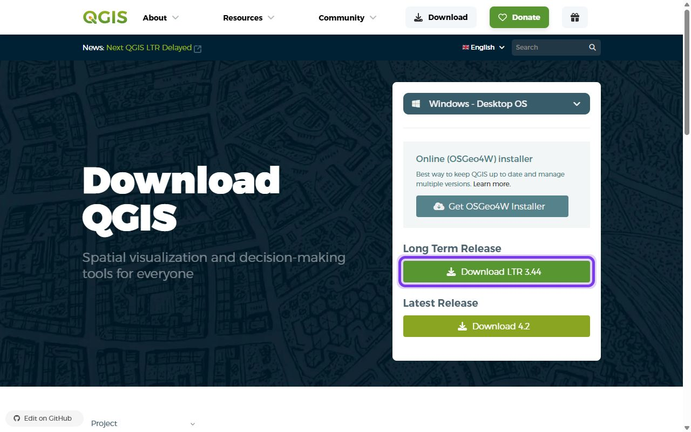
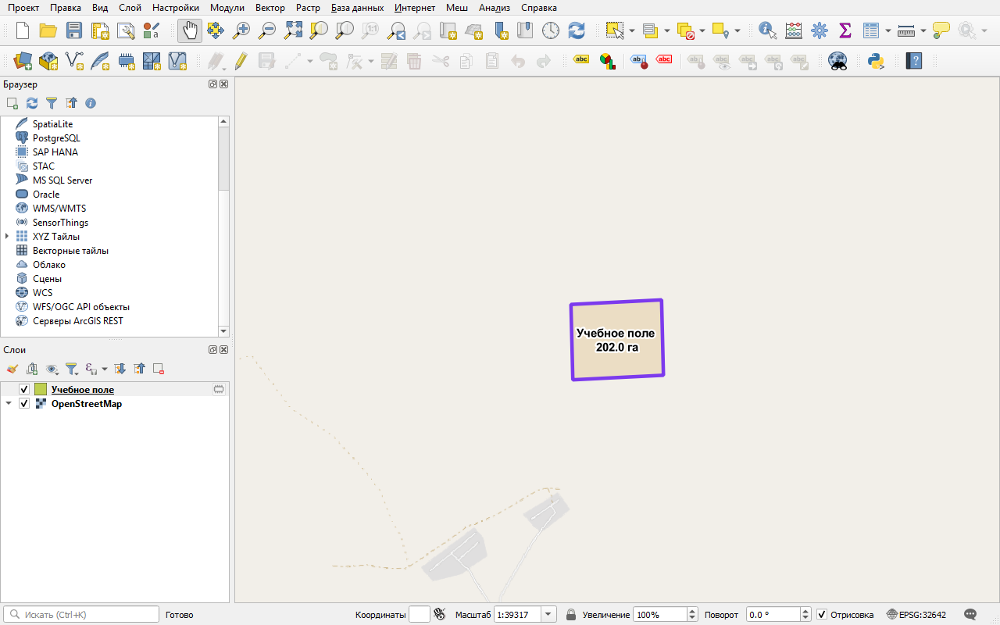

# ИИ-ассистент в работе: геопайплайн от агента и его верификация

> ⏱ **Трудозатраты:** ~45 мин. Рамка: [ИИ-инструменты в обучении](../../ai-tools.md).

<!-- folur-software:start -->

!!! tip "Что понадобится в этом уроке и где это взять"
    Нажмите на название программы и увидите, **где её взять, что нажать и как она выглядит в работе** (нужная кнопка на снимке обведена фиолетовым). Встроенный редактор Python установки не требует. Полная справка — [«Программы и сервисы»](../../software.md).

??? example "QGIS — скачать и установить"
    { .folur-shot loading=lazy }

    1. Откройте <https://qgis.org/download/>. Сайт сначала предложит пожертвование — оно необязательно: нажмите **«Skip it and go to download»**.
    2. Нажмите зелёную кнопку **«Download LTR»** (на снимке обведена). LTR — версия долгосрочной поддержки, она стабильнее. Скачается установщик размером около 1 ГБ.
    3. Запустите скачанный файл и нажимайте «Next», ничего не меняя. После установки откройте в меню «Пуск» ярлык **QGIS Desktop**.

    **Как это выглядит в работе.** QGIS в работе (русский интерфейс): слева панели «Браузер» и «Слои», в центре — учебное поле на подложке OpenStreetMap с подписью площади, внизу справа — система координат проекта.

    { .folur-shot loading=lazy }

    [Первые шаги в QGIS и русский интерфейс →](../../software.md#qgis)

<!-- folur-software:end -->

<p>GIS Copilot строит цепочку геообработки из текстового описания; Claude Code пишет GeoPandas-скрипт зональной статистики — результат сверяется с ручным расчётом в QGIS. Правило: ИИ ускоряет — человек верифицирует. Все задания модуля выполнимы и без ИИ.</p>

<p><em>Задание.</em> Поручите агенту повторить шаг зональной статистики практикума кодом (GeoPandas + rasterstats) на ваших данных. Примените к его коду чек-лист из пяти вопросов темы 2 (СК, валидность, NoData, единицы, контроль) и сверьте таблицу агента со своей таблицей шага 4 построчно. Расхождение — это баг: либо ваш, либо агента; найдите его по протоколу самопроверки темы 3 (баланс площадей, count, диапазон NDVI). Сдайте пару «таблица-агент + протокол сверки» с выводом о пригодности кода.</p>

## Код для выполнения задания

```text
Напиши Python-скрипт zonal_landuse.py (GeoPandas + rasterio/rasterstats):
1. Данные: граница района — слой boundary_raion из landuse.gpkg;
   растр классов — worldcover_raion.tif (категориальный, байт).
2. Операции: проверь и приведи СК обоих источников к EPSG:32642;
   валидируй геометрию границы; посчитай гистограмму классов растра
   внутри полигона (число пикселей каждого класса).
3. Контроль (обязательно напечатать): СК обоих слоёв после приведения;
   значение NoData растра; сумма площадей классов и площадь полигона
   границы — и их расхождение в процентах.
4. Выход: таблица agent_stats.csv: class_code, pixels, area_ha (пиксель
   10x10 м = 0.01 га), share_pct. Только открытые библиотеки.
```

---

[Программа модуля](index.md) · [Данные и условия использования](../../datasets.md)
