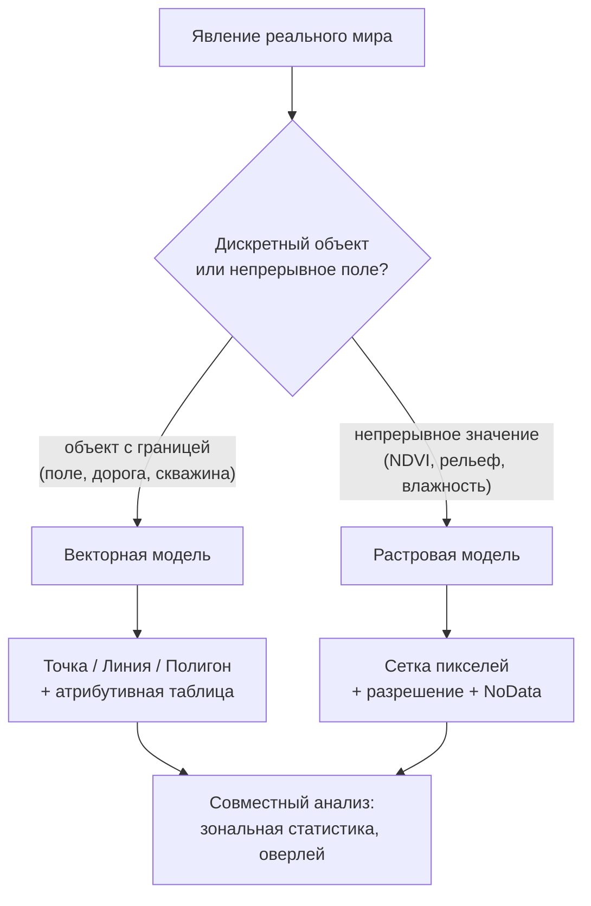

# Собираем корректный ГИС-проект: вектор, растр, проекции и топология

> ⏱ **Трудозатраты:** ~20 мин чтения + ~20 мин практики
>
> Модуль **[А2: Геоинформатика и пространственный анализ](../index.md)**, урок 1.
> Академический уровень. Проект UNDP-KAZ-00683, FOLUR. Компоненты FOLUR: **1**, **2**.

## Цели урока и место в модуле

Это фундамент всего модуля: прежде чем анализировать пространство, нужно уметь корректно его *представить* в машине. Ошибки этого уровня — неверная проекция, «дырявая» топология, перепутанные модели данных — незаметно искажают все последующие расчёты: площадь поля «плывёт» на проценты, буферная зона строится эллипсом вместо окружности, зональная статистика захватывает чужие пиксели. В этом уроке мы собираем ГИС-проект, в котором таких ошибок нет.

После изучения урока вы сможете:

1. **[Bloom: знать]** перечислять модели пространственных данных, их основные форматы и типовые системы координат для Северного Казахстана.
2. **[Bloom: понимать]** объяснять, почему географические и проекционные координаты нельзя смешивать при измерениях, и как выбор проекции влияет на площадь и расстояние.
3. **[Bloom: применять]** настраивать систему координат проекта QGIS под территорию СКО и перепроецировать слои без потери точности.
4. **[Bloom: анализировать]** находить и классифицировать топологические ошибки в векторном слое (перекрытия, разрывы, щели) и выбирать способ их исправления.

> **Границы лекции.** Внутри: модели данных (вектор/растр), форматы, системы координат и проекции, топология и её валидация. Снаружи: откуда берутся сами данные (съёмка БПЛА, спутники, датчики) — это [модуль А1](../../a1/index.md); инструментальная работа в QGIS и Python-стеке — [урок 2](02-qgis-python-stack.md); аналитические операции над корректно собранным проектом — [урок 3](03-spatial-analysis.md). Подробности фотограмметрической геопривязки (RTK/PPK, GCP) — в А1; здесь мы принимаем ортофотоплан как готовый слой.

---

## 1. Две модели пространственных данных: вектор и растр

Любой объект реального агроландшафта — поле, лесополоса, скважина, дорога, озеро — попадает в ГИС в одной из двух моделей.

**Векторная модель** описывает объекты геометрическими примитивами:

- **точка** — скважина, метеостанция, точка агрохимического отбора проб;
- **линия** — полевая дорога, канал, лесополоса (если её ширина не важна для задачи);
- **полигон** — поле, контур водоёма, граница района, залежь.

К каждому объекту привязана строка **атрибутивной таблицы**: у поля это может быть культура, год, площадь; у скважины — глубина и дебит. Именно связка «геометрия + атрибуты» делает вектор пригодным для запросов вида «все поля под пшеницей площадью больше 200 га в границах района».

**Растровая модель** — это регулярная сетка ячеек (пикселей), каждая из которых хранит число: отражение в спектральном канале, высоту рельефа, температуру, индекс NDVI. Растр не «знает» об объектах — он знает о непрерывном поле значений. Ключевая характеристика растра — **пространственное разрешение**: размер пикселя на местности. У Sentinel-2 основные каналы имеют разрешение 10 м, у ортофотоплана БПЛА — сантиметры (типично 2–10 см, в зависимости от высоты полёта — подробно в А1).

Выбор модели — не вопрос вкуса, а вопрос природы явления и задачи:

| Критерий | Вектор | Растр |
|---|---|---|
| Природа явления | дискретные объекты с границами | непрерывные поля значений |
| Типовые данные агросферы | поля, границы, дороги, точки проб | снимки, NDVI, рельеф, осадки |
| Точность границ | точная (по вершинам) | ограничена размером пикселя |
| Атрибуты | богатая таблица на объект | одно/несколько значений на пиксель |
| Типовые операции | буфер, оверлей, запросы | алгебра карт, классификация, зональная статистика |

На практике агроаналитик почти всегда работает с *обеими* моделями сразу: векторные границы полей накладываются на растровый NDVI — это и есть зональная статистика, которой посвящён [урок 3](03-spatial-analysis.md).

Границу между моделями иногда приходится пересекать в обе стороны. **Векторизация** превращает растр в вектор: например, из классифицированного снимка выделяются контуры полей — но границы наследуют «ступенчатость» пикселей и требуют генерализации. **Растеризация** — обратный переход: векторные поля «выжигаются» в сетку, чтобы участвовать в алгебре карт. Оба перехода необратимо теряют информацию (точность границ — при растеризации, атрибутивное богатство — при векторизации без переноса атрибутов), поэтому правило простое: конвертируйте как можно позже и храните первоисточник.

Несколько слов об **атрибутивной таблице**, потому что половина «геоданных» — вовсе не геометрия. Каждое поле таблицы имеет тип: целое, вещественное, строка, дата. Ошибки типов — источник тихих багов: площадь, записанная строкой «215,4» с запятой-разделителем, не просуммируется; дата сева «03.05.2025» в строковом поле не отсортируется по времени. Отдельная историческая боль — кодировки: Shapefile из старых источников нередко приходит в кодировке Windows-1251, и кириллические названия хозяйств превращаются в абракадабру, пока кодировка не указана явно при загрузке слоя. GeoPackage хранит текст в UTF-8 — ещё один довод в его пользу.



*Рис. 1. Выбор модели пространственных данных: от природы явления к совместному вектор-растровому анализу. Alt: блок-схема — явление реального мира разветвляется на векторную модель (точка/линия/полигон с атрибутами) и растровую (сетка пикселей с разрешением); обе сходятся в совместном анализе.*

Есть и третий, часто забываемый компонент модели данных — **представление времени**. Агроданные почти всегда историчны: границы полей меняются при пересевах и объединениях, NDVI имеет смысл только вместе с датой снимка, агрохимия — с датой отбора. Минимальная дисциплина: каждая геометрия и каждый растр несут атрибут даты (съёмки, оцифровки, актуальности), а сравнение «было/стало» выполняется только между слоями с явно совместимыми датами. Полноценные временные ряды — предмет [А3](../../a3/index.md), но привычка датировать слои закладывается здесь.

### 1.1 Форматы: что выбирать в 2026 году

Форматов десятки; для работы в модуле достаточно понимать пять.

**GeoPackage (`.gpkg`)** — современный открытый стандарт OGC: один файл — целая база данных, где живут и векторные слои, и растры, и стили. Не имеет ограничений устаревшего Shapefile (длина имён полей, один слой на набор файлов, отсутствие явной топологии). **В этом модуле GeoPackage — формат по умолчанию** для векторных данных и итогового проекта.

**Shapefile (`.shp` + обязательные `.shx`, `.dbf`, `.prj`)** — исторический стандарт 1990-х, который вы всё ещё будете встречать повсеместно (многие порталы открытых данных отдают именно его). Уметь читать — обязательно; создавать новые данные в нём — не рекомендуется: имена полей режутся до 10 символов, размер файла ограничен 2 ГБ, кодировки исторически проблемны.

**GeoJSON (`.geojson`)** — текстовый формат для веба и обмена: человекочитаемый, идеально дружит с JavaScript-картами и API. По спецификации RFC 7946 хранит координаты только в WGS84 — это и удобство, и ловушка (см. §3).

**GeoTIFF (`.tif` + геопривязка)** — стандарт растров: снимки, ЦМР, ортофотопланы. Его облачно-оптимизированный вариант **COG (Cloud Optimized GeoTIFF)** позволяет читать фрагменты больших файлов по сети, не скачивая их целиком — так работают современные каталоги спутниковых данных.

**Parquet/GeoParquet, NetCDF, LAS/LAZ** — колоночный аналитический формат для больших векторных таблиц, формат многомерных научных массивов (временные ряды климата — с ним работает `xarray`) и форматы лидарных облаков точек соответственно. В А2 они упоминаются как мост: NetCDF подробнее встретится в задачах временных рядов ([А3](../../a3/index.md)), LAS/LAZ — в лидарном блоке А1.

### 1.2 Внутри растра: тип данных, NoData, пирамиды

Растровый файл — это не просто «картинка», и три его внутренних свойства регулярно становятся источником ошибок анализа.

**Тип данных пикселя.** Байт (0–255) достаточен для классов землепользования и RGB-ортофото; 16-битное целое — стандарт уровней отражения Sentinel-2; вещественный тип (float) нужен индексам вроде NDVI, живущим в диапазоне −1…+1. Попытка записать NDVI в байтовый растр молча обнулит все значения — типовая ошибка первого скрипта.

**NoData.** У любого растра есть «дырки»: за пределами снимка, под маской облаков, вне зоны интерполяции. Специальное значение NoData помечает такие пиксели, и корректный инструмент исключает их из статистики. Если NoData не задан, «дырки» со значением 0 или −9999 войдут в среднее и испортят результат: средний NDVI поля, наполовину закрытого облачной маской, окажется бессмысленным. Проверка значения NoData — обязательный пункт инвентаризации слоя.

**Сжатие и пирамиды.** GeoTIFF поддерживает внутреннее сжатие (без потерь — например, DEFLATE/LZW; с потерями — JPEG, допустим только для визуальных подложек, но не для данных анализа) и **обзорные пирамиды (overviews)** — заранее рассчитанные уменьшенные копии, благодаря которым гигабайтный ортофотоплан листается в QGIS без задержек. COG (см. выше) — это, по сути, GeoTIFF с обязательными пирамидами и tiling-структурой, упорядоченной для потокового чтения.

> **Подробнее** о происхождении этих данных (сенсоры, стандарты съёмки, FAIR-принципы) — в [модуле А1](../../a1/index.md).

---

## 2. Системы координат: где на самом деле находится ваше поле

Земля — не плоскость, а экран и бумага — плоские. Всё картографирование — это управляемое искажение, и задача аналитика — выбрать искажение, безопасное для его задачи.

### 2.1 Географические и проекционные координаты

**Географическая система координат (ГСК)** задаёт положение широтой и долготой на эллипсоиде. Всемирный стандарт — **WGS84 (EPSG:4326)**: в нём работают GPS-приёмники, GeoJSON, большинство веб-API. Единица измерения — *градус*, и это принципиально: градус долготы на широте Петропавловска «короче» градуса на экваторе, потому что меридианы сходятся к полюсу. Считать расстояния и площади в градусах — классическая ошибка новичка: результат будет в «квадратных градусах», физический смысл которых на разных широтах различен.

**Проекционная система координат (ПСК)** разворачивает участок эллипсоида на плоскость; координаты — в метрах. Для измерений (площадь поля, длина лесополосы, ширина буферной зоны) нужна именно ПСК.

### 2.2 UTM для Северного Казахстана

Практический стандарт для региональных задач — **UTM (Universal Transverse Mercator)**: Земля нарезана на 60 меридианных зон по 6°, внутри каждой зоны искажения малы. Северный Казахстан покрывается несколькими зонами:

- **зона 41N (EPSG:32641)** — меридианы 60–66° в.д.: Костанайская область (Костанай ≈ 63,6° в.д.);
- **зона 42N (EPSG:32642)** — меридианы 66–72° в.д.: Северо-Казахстанская область (Петропавловск ≈ 69,2° в.д.) и большая часть Акмолинской области.

Правило модуля: **для локальных задач (район, хозяйство) работаем в UTM-зоне своей территории; для обмена и веб-публикации храним копию в WGS84.** Если территория «сидит» на границе двух зон (запад Костанайской области), допустимо работать в одной зоне с пониманием, что искажения на краю растут — либо использовать равноплощадную проекцию для расчёта площадей.

### 2.3 Казахстанские системы координат

Национальная картография РК исторически опирается на системы советской геодезической школы — **СК-42 (Пулково-1942)** с проекцией Гаусса–Крюгера и её производные, включая местные системы координат для кадастровых работ. Для учебных и аналитических задач модуля мы используем открытые глобальные системы (WGS84/UTM); знать о существовании национальных СК нужно, потому что данные из государственных источников (кадастр, старые топокарты) могут приходить именно в них, и их потребуется корректно перепроецировать, указав правильные параметры преобразования датумов. Правовой режим точных геодезических данных в РК регулируется законодательством о геодезии и картографии — практические следствия для датасетов платформы описаны в [политике данных](../../../datasets.md).

### 2.4 Перепроецирование: on-the-fly и «по-настоящему»

QGIS умеет **перепроецировать «на лету»**: слои в разных СК отображаются согласованно, потому что проект имеет собственную СК, в которую всё пересчитывается при отрисовке. Это удобно и опасно одновременно: карта *выглядит* правильно, но геометрия слоёв на диске остаётся в исходных СК, и некоторые операции (особенно в сторонних инструментах и скриптах) могут молча считать в «сырых» координатах.

Дисциплина корректного проекта:

1. Устанавливаем СК проекта = UTM-зона территории (для СКО — EPSG:32642).
2. Каждый рабочий слой физически перепроецируем в СК проекта (`Экспорт → Сохранить объекты как…` с указанием СК, либо инструмент «Перепроецировать слой»).
3. Проверяем `.prj`/метаданные каждого входного файла; слой «без СК» — это слой с *неизвестной* СК, и назначать её наугад нельзя: назначение (assign) говорит «эти числа и есть координаты в такой-то системе», а перепроецирование (reproject) пересчитывает числа. Перепутать эти операции — значит сдвинуть данные на сотни километров.

Отдельная ловушка — **вертикальная и датумная трансформация** между WGS84 и СК-42: между датумами существует сдвиг, и при высоких требованиях к точности нужно явно выбирать метод трансформации, который предложит QGIS. Для задач уровня «карта землепользования района» достаточно преобразований по умолчанию; для кадастровой точности — нет, и это уже инженерная геодезия за границами модуля.

### 2.5 Что именно искажает проекция

Ни одна проекция не сохраняет одновременно углы, площади и расстояния — можно сохранить что-то одно (или ничего, но «понемногу»). Отсюда классификация: **равноугольные** проекции (сохраняют форму и углы — к ним относится поперечная Меркатора, лежащая в основе UTM и Гаусса–Крюгера), **равноплощадные** (сохраняют площади — выбор для статистики землепользования по большим территориям), **равнопромежуточные** (сохраняют расстояния вдоль определённых линий). UTM равноугольна, но внутри узкой 6-градусной зоны её искажения площади малы — именно поэтому она пригодна для районных задач и непригодна для карты «весь Казахстан», растянутого на несколько зон.

Практический тест, который стоит проделать один раз руками (и мы делаем его в кейсе ниже): измерьте площадь одного и того же района в EPSG:4326 «по эллипсоиду», в родной зоне UTM и в соседней зоне — и сравните. Расхождение между корректными вариантами будет малым, а вот число «в квадратных градусах» окажется вовсе не площадью. Такое упражнение прививает рефлекс: *прежде чем верить числу из ГИС, спроси, в какой СК оно посчитано.*

---

## 3. Топология: почему «красивая» карта может быть неправильной

**Топология** — это правила взаимного расположения объектов, не зависящие от координат: полигоны полей не должны перекрываться; между смежными полями не должно быть щелей; граница района должна быть замкнутой; дорожная сеть — связной. Векторный слой может выглядеть безупречно на экране и при этом содержать ошибки, которые проявятся только в анализе.

### 3.1 Типовые топологические ошибки

- **Перекрытия (overlaps).** Два полигона полей делят общую полосу. Следствие: суммарная площадь полей превышает площадь массива; зональная статистика посчитает пиксели полосы дважды.
- **Щели и разрывы (gaps).** Между смежными полигонами — микрозазор в доли метра, оставшийся от неточной оцифровки. Следствие: «ничейные» полосы в балансе площадей, артефакты при объединении (dissolve).
- **Осколочные полигоны (slivers).** Длинные узкие полигоны-паразиты, рождающиеся при оверлее слоёв с почти совпадающими, но не идентичными границами. Классика: пересечение границы района из двух разных источников.
- **Незамкнутые и самопересекающиеся геометрии.** Полигон с самопересечением формально невалиден; многие алгоритмы (пересечение, буфер) на нём падают или дают непредсказуемый результат.
- **Дубликаты вершин и объектов.** Незаметны глазу, ломают статистику и увеличивают вес файла.

### 3.2 Как проверять и чинить

В QGIS есть три уровня контроля:

1. **`Проверка валидности геометрии`** (Vector → Geometry Tools → Check Validity) — быстрый отчёт: валидные, невалидные, с ошибками.
2. **Модуль «Проверка топологии» (Topology Checker)** — задаёте правила («полигоны слоя не должны перекрываться», «не должно быть щелей») и получаете карту нарушений.
3. **Исправление:** инструмент `Исправить геометрии` (Fix Geometries) для самопересечений; **прилипание (snapping)** при оцифровке — чтобы ошибки не рождались; инструменты `v.clean` из набора GRASS — для системной чистки (удаление осколков по пороговой площади, замыкание разрывов по допуску).

Правило модуля: **валидация топологии — обязательный шаг перед любым оверлеем и зональной статистикой.** В практикуме этот шаг встроен в пайплайн явно.

> **Подробнее** — операции, которые ломаются на плохой топологии (пересечение, объединение, буферы), разбираем в [уроке 3](03-spatial-analysis.md); автоматизацию проверки скриптом — в [уроке 2](02-qgis-python-stack.md).

### 3.3 Растровая «топология»: выравнивание сеток

У растров свой аналог топологической дисциплины — **согласование сеток**: два растра сравнимы попиксельно, только если совпадают СК, разрешение, начало координат сетки и охват. NDVI 10 м от Sentinel-2 и ортофото 5 см от БПЛА нельзя «просто вычесть» — потребуется передискретизация (resampling) с осознанным выбором метода: ближайший сосед для категориальных данных (классы землепользования!), билинейная или кубическая интерполяция — для непрерывных. Передискретизация категориального растра билинейным методом — типовая ошибка, порождающая бессмысленные «полуклассы». Практическую сторону совмещения разномасштабных растров разберём в [уроке 4](04-ai-uav-integration.md).

---

### 3.4 Масштаб и генерализация

С топологией тесно связано понятие **масштаба источника**. Векторные данные всегда оцифрованы с какой-то детальностью: граница района, снятая для обзорной карты страны, — это десятки вершин; та же граница для землеустройства — тысячи. Наложение слоёв разной детальности порождает те самые осколки из §3.1 и ложные «несовпадения». **Генерализация** (упрощение геометрии по допуску, сглаживание) — легальный инструмент приведения слоёв к общему уровню детальности, но с двумя оговорками: упрощение смежных полигонов поодиночке разрывает их общие границы (нужны топологически-осведомлённые инструменты вроде `v.generalize` из GRASS), а упрощённая геометрия меняет площадь — фиксируйте допуск в метаданных. Обратная ошибка — «псевдоточность»: отображать границу, оцифрованную с обзорной карты, поверх ортофото 5 см и делать выводы о «захвате» трёх метров соседнего поля. Детальность вывода не может превышать детальность худшего из использованных источников.

---

## 4. Собираем проект: контрольный список

Синтез урока — дисциплина сборки ГИС-проекта, которую мы будем воспроизводить во всех практикумах модуля:

1. **Инвентаризация данных.** Для каждого слоя фиксируем: модель (вектор/растр), формат, СК, разрешение (для растра), источник и лицензию.
2. **Единая СК проекта.** UTM-зона территории; все рабочие слои физически перепроецированы.
3. **Валидация.** Геометрии валидны; топологические правила проверены; растровые сетки согласованы (или согласование отложено до конкретной операции — осознанно).
4. **Именование и хранение.** Один GeoPackage проекта; слои названы по схеме `тема_территория_год` (например, `fields_esil_2025`); исходники — отдельно от производных.
5. **Метаданные.** Краткое описание слоя: откуда, когда, какой обработке подвергался. Это дешёвая страховка воспроизводимости — принцип FAIR из А1.

Этот список выглядит бюрократией ровно до первого проекта, в котором его не было: типичный «испорченный» ГИС-проект хозяйства — это смесь слоёв в трёх СК, граница полей с перекрытиями, NDVI с незаданным NoData и файл `новый_финальный2.shp`, происхождение которого никто не помнит. Стоимость дисциплины — минуты; стоимость её отсутствия — дни разбирательств и решения, принятые по искажённым числам. В [уроке 2](02-qgis-python-stack.md) мы увидим, что почти весь контрольный список автоматизируется скриптом — и тогда дисциплина перестаёт зависеть от самоконтроля.

---

## 5. Быстрая диагностика: симптом → причина

Опыт показывает, что почти все проблемы уровня данных проявляются одним из шести узнаваемых симптомов. Эта таблица — диагностический словарь, к которому стоит возвращаться при любой странности в проекте.

| Симптом | Вероятная причина | Первое действие |
|---|---|---|
| Слой «улетел» на другой конец света или в океан у нулевых координат | СК назначена вместо перепроецирования, либо назначена неверная СК | проверить исходную СК у поставщика данных; переназначить правильную, затем перепроецировать |
| Слои видны вместе, но измерения дают бессмыслицу | проект в градусной СК; расчёты в единицах СК | сменить СК проекта на UTM-зону территории, физически перепроецировать рабочие слои |
| Два слоя одной территории смещены на десятки–сотни метров | разные датумы или разная детальность оцифровки | проверить датумную трансформацию; сравнить масштаб источников |
| Площадь массива меньше суммы площадей полей | перекрытия полигонов | проверка валидности + Topology Checker, правило «no overlaps» |
| После объединения полей внутри — тонкие «дырки» | щели между смежными полигонами | правило «no gaps», чистка v.clean по допуску |
| Статистика растра выглядит заниженной или дикой | NoData не задан или неверен; смешение категориального и непрерывного | проверить NoData и тип данных в свойствах слоя |

Колонка «первое действие» намеренно скромна: диагностика уровня данных почти никогда не требует героических мер — она требует знать, *куда посмотреть*. Существенно и обратное правило: если симптом не находится в таблице, не спешите «чинить» данные первым попавшимся инструментом — сначала воспроизведите проблему на маленьком фрагменте слоя и убедитесь, что понимаете её механизм. Слепое применение «Исправить геометрии» ко всему проекту иногда маскирует проблему вместо решения: инструмент честно сделает геометрии валидными, но не вернёт смысл данным, у которых, например, перепутана СК.

И последнее: диагностика — командный навык. Записанный в метаданных проекта случай («слой границ от подрядчика X приходил со сдвигом датума, исправлено трансформацией Y») экономит коллегам часы на следующей итерации тех же данных. Файл `README` в папке проекта с тремя такими заметками — самый дешёвый инструмент качества из всех существующих.

---

## Региональный кейс

**Ситуация.** Аналитик районного управления сельского хозяйства в Есильском районе СКО собирает базовый ГИС-проект района: граница района, дорожная сеть, населённые пункты, гидрография — как основу будущей карты землепользования. Данные приходят из разных источников и в разных системах координат: граница — из OpenStreetMap (WGS84), снимок Sentinel-2 — в UTM 42N, старая схема землеустройства — скан без геопривязки.

**Данные.** OpenStreetMap (границы, дороги, гидрография — выгрузка через QuickOSM, лицензия ODbL); Sentinel-2 L2A через [Copernicus Data Space](https://dataspace.copernicus.eu/) (тайлы на территорию СКО, UTM 42N).

**Задача.**

1. Какую СК назначить проекту QGIS и почему? Что произойдёт с измерением площади землепользования, если оставить проект в EPSG:4326?
2. Слой границы района из OSM пришёл в WGS84. Что нужно сделать — назначить ему EPSG:32642 или перепроецировать в EPSG:32642? В чём разница?
3. Граница района из OSM и граница, оцифрованная со старой схемы, не совпадают на десятки метров, а их пересечение порождает осколочные полигоны. Какие шаги валидации и очистки вы примените и какой источник границы выберете как эталонный?

**Разбор.** (1) СК проекта — EPSG:32642 (UTM 42N): Есильский район лежит в зоне 42; в EPSG:4326 инструменты, считающие в единицах СК, вернут площадь в квадратных градусах, а «эллипсоидальные» настройки измерений спасают не все операции — дисциплина «метрическая СК для метрических задач» надёжнее. (2) Только перепроецировать: координаты слоя реально существуют в WGS84, и их надо *пересчитать*; назначение EPSG:32642 без пересчёта сдвинет район на тысячи километров, потому что числа градусов будут прочитаны как метры. (3) Проверка валидности → Topology Checker (перекрытия/щели) → чистка осколков по пороговой площади (`v.clean`); эталоном разумно взять источник с известным происхождением и датой актуализации, зафиксировав выбор в метаданных; расхождение источников — само по себе результат, который следует показать заказчику, а не скрыть.

Обратите внимание на общий рисунок всех трёх ответов: ни один не требует новых инструментов — только дисциплины из этого урока, применённой в правильном порядке. Именно так выглядит зрелость в геоинформатике: не знание сотни кнопок, а короткий набор правил, который не нарушается даже под давлением сроков.

> Кейс продолжается в [практикуме](../practicum/01-landuse-map-sko.md): там вы соберёте такой проект целиком и доведёте его до карты землепользования.

---

## Закрепление и применение

!!! example "Попробуйте в Colab"
    Ноутбук урока: загрузка границы района из OSM, сравнение площади в EPSG:4326 и EPSG:32642, поиск невалидных геометрий средствами GeoPandas (`gdf.is_valid`, `gdf.to_crs`). Ссылка: `<URL будет назначен при создании репозитория ноутбуков>`. Всё то же самое можно выполнить в QGIS без кода — по шагам §2.4 и §3.2.

!!! warning "Границы применимости"
    UTM корректна внутри своей зоны; для территорий, пересекающих границы зон, и для расчёта площадей на уровне области/страны используйте равноплощадные проекции. Преобразования между WGS84 и национальными СК на кадастровом уровне точности требуют официальных параметров трансформации — это задача лицензированной геодезии, а не учебного проекта.

!!! tip "Что это даёт вашему хозяйству"
    Корректная СК и чистая топология — это правильные площади полей в гектарах, а значит — правильные нормы высева, внесения и расчёты затрат. Ошибка проекции в пару процентов площади на хозяйстве в тысячи гектаров — это уже ощутимые деньги, потерянные в «квадратных градусах».

!!! question "Кейс для размышления"
    Вы получили от подрядчика ортофотоплан «без файла привязки», и он «примерно встал» на подложку после назначения СК вручную. Карту каких решений можно строить на таком слое, а каких — категорически нельзя? Что вы запросите у подрядчика? (Подсказка: вспомните разницу assign/reproject и материал А1 о GCP.)

---

### Проверь себя

```quiz
[
  {
    "q": "Слой границ полей пришёл без указания системы координат, но известно, что координаты — широта/долгота WGS84. Проект работает в EPSG:32642. Правильная последовательность действий:",
    "options": [
      "Назначить слою EPSG:4326, затем перепроецировать в EPSG:32642",
      "Сразу назначить слою EPSG:32642, чтобы он совпал с проектом",
      "Перепроецировать слой в EPSG:4326, затем назначить EPSG:32642",
      "Ничего не делать: QGIS перепроецирует на лету, этого достаточно для всех расчётов"
    ],
    "answer": 0,
    "explain": "§2.4: назначение фиксирует, в какой системе реально существуют числа координат (здесь — WGS84), а перепроецирование пересчитывает их в целевую СК. Назначить метрическую СК градусным числам — значит сдвинуть данные; on-the-fly помогает отрисовке, но не заменяет физическое перепроецирование рабочих слоёв."
  },
  {
    "q": "Для расчёта площадей полей Есильского района СКО лучше всего подходит:",
    "options": [
      "EPSG:32642 (UTM 42N) — метрическая проекция зоны, в которой лежит район",
      "EPSG:4326 (WGS84) — глобальный стандарт GPS",
      "EPSG:32641 (UTM 41N) — соседняя зона, разницы нет",
      "Любая СК: площадь — свойство объекта и от проекции не зависит"
    ],
    "answer": 0,
    "explain": "§2.2: Петропавловск и Есильский район лежат в зоне 42N (66–72° в.д.). В градусной EPSG:4326 площади считаются в квадратных градусах; в чужой зоне UTM искажения растут. Вычисленная на плоскости площадь всегда зависит от проекции."
  },
  {
    "q": "После пересечения (intersect) двух слоёв границ района из разных источников появились длинные узкие полигоны-«паразиты». Это:",
    "options": [
      "Осколочные полигоны (slivers) — следствие почти совпадающих, но не идентичных границ",
      "Перекрытия (overlaps) — исходные слои были невалидны",
      "Ошибка проекции — слои были в разных СК",
      "Нормальный результат: так выглядит зона неопределённости границы"
    ],
    "answer": 0,
    "explain": "§3.1: осколки (slivers) — классический артефакт оверлея слоёв с близкими границами; лечатся чисткой по пороговой площади (v.clean) и выбором эталонного источника границы."
  },
  {
    "q": "Карту классов землепользования (категориальный растр) нужно привести к сетке другого растра. Какой метод передискретизации корректен?",
    "options": [
      "Ближайший сосед — он не порождает новых значений между классами",
      "Билинейная интерполяция — она даёт более гладкий результат",
      "Кубическая свёртка — она точнее билинейной",
      "Любой: методы передискретизации отличаются только скоростью"
    ],
    "answer": 0,
    "explain": "§3.3: билинейный и кубический методы усредняют значения соседних пикселей и для категориальных данных порождают бессмысленные «полуклассы»; для классов допустим только ближайший сосед."
  },
  {
    "q": "GeoPackage выбран форматом по умолчанию в модуле, потому что:",
    "options": [
      "Это открытый стандарт OGC: один файл хранит несколько векторных слоёв и растров без ограничений Shapefile",
      "Он единственный поддерживается QGIS",
      "Он хранит координаты только в WGS84, что исключает ошибки проекций",
      "Он предназначен специально для спутниковых снимков"
    ],
    "answer": 0,
    "explain": "§1.1: GeoPackage — единый файл-база (векторы, растры, стили) без ограничений Shapefile (10 символов на имя поля, 2 ГБ, один слой). Только-WGS84 — свойство GeoJSON; QGIS читает десятки форматов."
  }
]
```

---

## Что дальше?

Вы умеете собирать корректный проект — фундамент, на который ляжет всё остальное содержание модуля: инструменты, анализ, интеграция и ИИ-слой. Каждый следующий урок будет ссылаться на дисциплину этого урока как на предусловие своих операций.

- Следующий урок — **[Автоматизируем геообработку: QGIS, Python-стек и открытые геоданные](02-qgis-python-stack.md)**: превращаем ручную дисциплину этого урока в воспроизводимые инструменты и скрипты.
- Происхождение данных, форматы съёмки, FAIR-принципы — **[модуль А1](../../a1/index.md)**.
- Упрощённая, no-code версия этой темы для практиков — **[П2. Введение в ГИС и открытые геоданные](../../p2/index.md)**.
