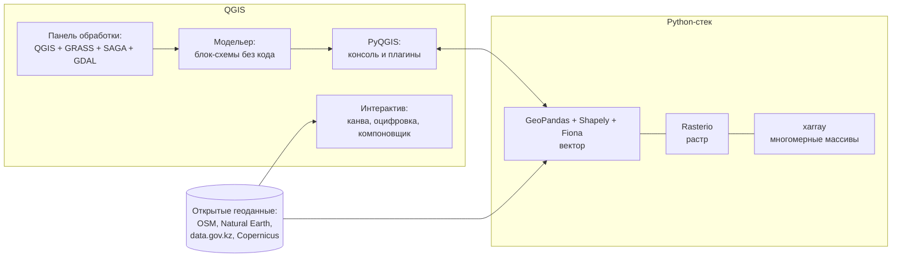

# Автоматизируем геообработку: QGIS, Python-стек и открытые геоданные

> ⏱ **Трудозатраты:** ~20 мин чтения + ~25 мин практики
>
> Модуль **[А2: Геоинформатика и пространственный анализ](../index.md)**, урок 2.
> Академический уровень. Проект UNDP-KAZ-00683, FOLUR. Компоненты FOLUR: **1**, **2**.

## Цели урока и место в модуле

В [уроке 1](01-vector-raster-projections.md) мы научились собирать корректный ГИС-проект руками. Ручная работа хороша для разового результата и плоха для всего остального: её нельзя воспроизвести, проверить, поставить на поток по 200 полям или передать коллеге. Этот урок — про инструментальный слой модуля: QGIS как рабочая среда, Python-стек как средство автоматизации и открытые геоданные как сырьё. Именно на этом слое в [уроке про ИИ-ассистента](../ai-assistant.md) будет работать кодинг-агент — и вы сможете проверять его код, потому что понимаете, из каких библиотек и зачем он собран.

После изучения урока вы сможете:

1. **[Bloom: знать]** перечислять компоненты открытого геостека — QGIS (панель обработки, модельер, PyQGIS) и Python-библиотеки (GeoPandas, Shapely, Rasterio, Fiona, xarray) — и их зоны ответственности.
2. **[Bloom: понимать]** объяснять, когда задача решается в QGIS без кода, когда — графической моделью, а когда — скриптом, и как связаны GeoPandas с pandas и Shapely.
3. **[Bloom: применять]** загружать открытые геоданные (OpenStreetMap, Natural Earth, data.gov.kz, Copernicus) в проект и выполнять базовую цепочку геообработки скриптом GeoPandas на данных Северного Казахстана.
4. **[Bloom: анализировать]** сравнивать результат скрипта с результатом ручной обработки в QGIS и локализовать причину расхождений (СК, топология, параметры операций).

> **Границы лекции.** Внутри: инструменты (QGIS + Python-стек), источники открытых геоданных и дисциплина воспроизводимости. Снаружи: сами аналитические методы (буферы, оверлей, интерполяция, зональная статистика) — [урок 3](03-spatial-analysis.md); ИИ-генерация геокода и её верификация — [урок 4](04-ai-uav-integration.md) и [задание ИИ-ассистента](../ai-assistant.md); Google Earth Engine как облачная платформа анализа временных рядов — [модуль А3](../../a3/index.md).

---

## 1. QGIS: не «программа с кнопками», а среда геообработки

**QGIS** — свободная (GPL) настольная ГИС и основной инструмент модуля: бесплатная для любого использования, кроссплатформенная, с русской локализацией и огромным сообществом. Важно с самого начала увидеть в ней не картинку с кнопками, а *три уровня работы*, различающиеся степенью автоматизации.

### 1.1 Интерактивный уровень

Канва карты, панель слоёв, свойства слоя (символика, подписи), инструменты оцифровки с прилипанием, измерения, компоновщик печатных карт (Layout) — всё, что нужно для разовой задачи и финального оформления карты. Здесь же живут инструменты контроля качества из урока 1: проверка валидности, Topology Checker.

Ключевая привычка интерактивного уровня — **панель обработки (Processing Toolbox)**: единый каталог из сотен алгоритмов самого QGIS и интегрированных провайдеров (GRASS GIS, SAGA, GDAL). Прежде чем искать плагин или писать код, стоит поискать готовый алгоритм в панели — обычно он там есть.

### 1.2 Графические модели: автоматизация без кода

**Модельер (Graphical Modeler)** позволяет соединить алгоритмы панели обработки в блок-схему: «перепроецировать → исправить геометрии → буфер → пересечение → сохранить». Модель сохраняется в проекте или файле, запускается на новых данных одним кликом и — что важно для команды — *читается* коллегами без знания Python. Модельер — это первый шаг от «я сделал карту» к «у нас есть процедура построения карты», и для многих специалистов районного уровня он закрывает 80% потребностей автоматизации.

У каждого алгоритма панели обработки есть ещё одно полезное свойство: кнопка **истории обработки** и журнал показывают эквивалентный Python-вызов (`processing.run("native:buffer", {...})`). Это готовый мост к следующему уровню.

Второй усилитель без кода — **пакетный запуск (Batch Processing)**: любой алгоритм панели обработки можно применить сразу к списку слоёв или файлов. Перепроецировать тридцать shapefile-ов из старого архива землеустройства — одна настройка таблицы пакетного запуска вместо тридцати повторов.

### 1.3 PyQGIS и консоль Python

Внутри QGIS встроена консоль Python с доступом к **PyQGIS** — программному интерфейсу всей системы: слои, проекты, алгоритмы, отрисовка. PyQGIS незаменим, когда автоматизировать нужно саму *среду* QGIS: пакетно оформить 20 карт, обновить слои проекта, написать собственный плагин. Для чистой обработки данных вне интерфейса удобнее внешний Python-стек — о нём далее.

### 1.4 Экосистема плагинов

Сила QGIS — в репозитории плагинов, расширяющих систему в один клик. Для задач модуля значимы:

- **QuickOSM** — выгрузка данных OpenStreetMap по тегам прямо в слои проекта (используем в §3.1 и кейсе);
- **QuickMapServices** — подключение веб-подложек (OSM и другие) для визуального контекста;
- **Profile tool / DEM-инструменты** — профили рельефа по ЦМР из А1;
- **Deepness** — инференс нейросетевых моделей на растрах прямо в QGIS (встретится в [уроке 4](04-ai-uav-integration.md)).

Дисциплина с плагинами такая же, как с данными: фиксируйте название и версию использованного плагина в метаданных проекта — плагины обновляются, поведение алгоритмов может меняться, а воспроизводимость (§4) должна пережить обновление.



*Рис. 1. Уровни автоматизации открытого геостека: от интерактивной работы в QGIS через модельер к Python-стеку; открытые данные питают оба контура. Alt: схема с двумя блоками — QGIS (интерактив, панель обработки, модельер, PyQGIS) и Python-стек (GeoPandas/Shapely/Fiona, Rasterio, xarray); источники открытых данных соединены стрелками с обоими блоками.*

---

### 1.5 Типовой рабочий цикл

Соберём уровни в целостную картину рабочего дня. Разовая задача начинается и заканчивается на интерактивном уровне: загрузили слои, проверили СК и геометрию, выполнили пару алгоритмов панели обработки, оформили карту в компоновщике. Если по ходу выяснилось, что цепочка из трёх и более алгоритмов будет повторяться, — пятнадцать минут на то, чтобы собрать её в модель, и процедура зафиксирована. Если задача упирается в объём (сотни файлов, годовые серии снимков) или в интеграцию с другими системами — история обработки подсказывает Python-эквиваленты шагов, и цепочка переезжает в ноутбук. QGIS при этом не исчезает из процесса: он остаётся средой визуальной проверки промежуточных результатов скрипта и финального оформления. Считать «настольную ГИС» и «скрипты» конкурирующими подходами — ошибка; в зрелой практике это две руки одного специалиста.

## 2. Python-стек: пять библиотек, одна логика

Экосистема геоинформатики в Python выглядит пугающе большой, но опирается на пять библиотек с чётким разделением труда. Понимание этого разделения — половина умения читать чужой (в том числе сгенерированный ИИ) геокод.

### 2.1 Shapely: геометрия как объект

**Shapely** реализует геометрические примитивы (Point, LineString, Polygon) и операции над ними: буфер, пересечение, объединение, проверку валидности. Shapely ничего не знает о файлах и системах координат — это чистая вычислительная геометрия на плоскости. Когда вы вызываете «буфер» в GeoPandas, реальную работу выполняет Shapely. Следствие, которое надо помнить: раз геометрия плоская, буфер в 500 «единиц» осмыслен только в метрической СК — прямое продолжение дисциплины урока 1.

Второе следствие плоской геометрии: Shapely честно реализует и **предикаты пространственных отношений** — `intersects` (пересекаются ли), `contains` (содержит ли), `within` (лежит ли внутри), `touches` (касаются ли границами). Эти предикаты — словарь, на котором формулируются пространственные запросы и соединения; их знание позволяет читать условия в чужом коде так же уверенно, как SQL-фильтры.

### 2.2 Fiona и pyproj: ввод-вывод и координаты

**Fiona** читает и пишет векторные форматы (через библиотеку GDAL/OGR — фактический «двигатель» всей открытой геоинформатики), **pyproj** выполняет преобразования систем координат (обёртка над PROJ). В повседневной работе вы редко вызываете их напрямую — они работают под капотом GeoPandas, но их имена нужно узнавать в сообщениях об ошибках и в списках зависимостей.

Про **GDAL/OGR** стоит сказать отдельно: это библиотека-фундамент, на которой стоят и QGIS, и Rasterio, и Fiona. Её консольные утилиты (`gdalwarp` — перепроецирование растров, `gdal_translate` — конвертация форматов, `ogr2ogr` — конвертация векторов) — швейцарский нож пакетной обработки: одна команда `ogr2ogr -t_srs EPSG:32642 out.gpkg in.shp` конвертирует и перепроецирует слой без открытия каких-либо программ. Когда три инструмента (QGIS, скрипт, консольная утилита) дают одинаковый результат — это не совпадение: под капотом у них один и тот же GDAL.

### 2.3 GeoPandas: таблица, у которой есть геометрия

**GeoPandas** — рабочая лошадка векторного анализа: `GeoDataFrame` — это таблица pandas, к которой добавлена колонка геометрии и знание о СК. Всё, что вы умеете в pandas (фильтры, группировки, join), работает и здесь, плюс пространственные операции:

```python
import geopandas as gpd

fields = gpd.read_file("project.gpkg", layer="fields_esil_2025")   # Fiona под капотом
fields = fields.to_crs(epsg=32642)                                  # pyproj под капотом
fields["area_ha"] = fields.geometry.area / 10_000                   # Shapely под капотом
big = fields[fields["area_ha"] > 200]                               # обычный pandas-фильтр
buffered = big.buffer(500)                                           # буфер 500 м — СК метрическая!
```

Пять строк заменяют цепочку ручных операций — и, в отличие от неё, запускаются повторно на обновлённых данных за секунды. Пространственные соединения (`gpd.sjoin`), оверлей (`gpd.overlay`), агрегация (`dissolve`) — всё это встретится в [уроке 3](03-spatial-analysis.md) как программные двойники алгоритмов QGIS. Знание pandas переносится в GeoPandas почти без остатка, поэтому специалисту, уже обрабатывавшему таблицы урожайности, порог входа в векторный геоанализ значительно ниже, чем кажется.

### 2.4 Rasterio: растры без боли

**Rasterio** — питоническая обёртка GDAL для растров: открыть GeoTIFF, прочитать канал в массив NumPy, узнать СК/разрешение/NoData, записать результат. Типовой паттерн — «прочитал массив → посчитал в NumPy → записал с тем же профилем»:

```python
import rasterio
import numpy as np

with rasterio.open("ndvi_2025.tif") as src:
    ndvi = src.read(1, masked=True)      # masked=True уважает NoData (§1.2 урока 1)
    profile = src.profile

print(float(ndvi.mean()))                 # среднее без NoData-пикселей
```

Аргумент `masked=True` — маленькая деталь с большими последствиями: без него NoData-значения войдут в статистику (вспомните §1.2 урока 1 про облачные маски).

Второй постоянный паттерн Rasterio — **обрезка растра по векторной границе** (`rasterio.mask.mask`): из сцены Sentinel-2 размером в целый тайл вырезается только территория района, и все дальнейшие операции ускоряются на порядок. Обратите внимание на связку моделей данных: вектор здесь управляет растром — это та же логика, что и в зональной статистике [урока 3](03-spatial-analysis.md).

### 2.5 xarray: когда измерений больше двух

**xarray** добавляет к массивам именованные измерения и координаты: куб «широта × долгота × время» для многолетнего ряда NDVI или климатических данных в NetCDF. Вместо «третьего индекса массива, который, кажется, время» появляется явное `da.sel(time="2025-06")` — код становится самодокументируемым. В А2 достаточно знать его назначение; полноценная работа с временными рядами — в [А3](../../a3/index.md).

### 2.6 Где всё это запускать

Учебный стандарт модуля — **Google Colab**: бесплатная среда Jupyter-ноутбуков в браузере, где `geopandas` и `rasterio` устанавливаются одной ячейкой `pip install`. Ноутбук объединяет код, результат и пояснение — идеальная форма и для обучения, и для передачи анализа коллеге. Локальная альтернатива — дистрибутив Python с менеджером окружений (conda/mamba), который решает главную боль локальной геоинформатики: бинарные зависимости GDAL/PROJ, у которых версии должны быть согласованы. Принципиально одно: **весь стек модуля свободен и бесплатен**, привязки к платным лицензиям нет. Ноутбуки уроков: `<URL будет назначен при создании репозитория ноутбуков>`.

### 2.7 Как читать чужой геокод: чек-лист из пяти вопросов

Умение *читать* геокод понадобится раньше, чем умение его писать: код будет приходить от коллег, со Stack Overflow и — всё чаще — от ИИ-агента. Пять вопросов, которые нужно задать любому чужому скрипту до запуска на своих данных:

1. **СК:** есть ли явный `to_crs` в метрическую систему перед измерениями и буферами? Скрипт, молча считающий в исходной СК, — подозреваемый номер один.
2. **Валидность:** проверяются ли геометрии (`is_valid`, `make_valid`) перед оверлеем? На реальных данных землеустройства невалидные полигоны — норма, а не исключение.
3. **NoData:** читаются ли растры с учётом маски (`masked=True` или явная обработка `nodata`)?
4. **Единицы:** в чём результат — метры или километры, м² или гектары? Ошибка на порядок из-за забытого деления на 10 000 — классика.
5. **Контроль:** есть ли в скрипте хоть одна проверка правдоподобия результата (число объектов, диапазон значений)? Хороший код проверяет себя сам.

Этот чек-лист — ядро задания [ИИ-ассистента модуля](../ai-assistant.md), где вы примените его к коду, написанному кодинг-агентом. Заметьте: ни один из пяти вопросов не требует глубокого знания Python — все они про *геоинформатическую* корректность, то есть про материал урока 1 и здравый смысл. Именно поэтому специалист с крепкой ГИС-базой ревьюирует геокод увереннее «чистого» программиста: он знает, что должно быть в коде по смыслу задачи, а не только по синтаксису.

---

## 3. Открытые геоданные: где брать сырьё

Открытый инструмент бесполезен без открытых данных. Для Северного Казахстана рабочий набор источников таков.

### 3.1 OpenStreetMap

**OpenStreetMap (OSM)** — краудсорсинговая карта мира под лицензией ODbL: административные границы, дороги, населённые пункты, гидрография, местами — контуры сельхозугодий. Практические способы выгрузки:

- плагин **QuickOSM** в QGIS: запрос по тегам (`boundary=administrative`, `highway=*`, `landuse=farmland`) на область интереса — результат сразу слоями;
- **Overpass API** — тот же механизм запросов из кода или браузера (Overpass Turbo);
- региональные выгрузки (extract) целых областей в PBF с сайтов-зеркал — когда нужно много и сразу.

Два свойства OSM, которые нужно учитывать в анализе: полнота и актуальность неравномерны (город размечен лучше степи; границы полей могут отсутствовать или устареть), а лицензия ODbL требует указания атрибуции и распространения производных баз данных на тех же условиях.

Модель данных OSM отличается от привычной послойной: это единая база объектов с **тегами** — парами «ключ=значение» (`highway=track`, `landuse=farmland`, `admin_level=6`). Один и тот же запрос по тегам может вернуть и линии, и полигоны; QuickOSM раскладывает их по геометрии автоматически, но при работе через Overpass это придётся делать самому. Административные границы в OSM устроены иерархией уровней `admin_level` — при выгрузке границы района важно взять правильный уровень, иначе вместо района приедет область или сельский округ; правильность проверяется визуально и по атрибуту названия.

### 3.2 Natural Earth и глобальные подложки

**Natural Earth** — аккуратные обзорные векторные данные мира (страны, регионы, реки, озёра) в масштабах 1:10 млн — 1:110 млн, общественное достояние. Это правильный источник для обзорной врезки «где находится район» — и неправильный для любых измерений на районном уровне (вспомните §3.4 урока 1 о детальности источника). Различие ролей стоит проговорить явно, потому что нарушается оно постоянно: подложка отвечает на вопрос «где мы?», аналитический слой — на вопрос «сколько и что здесь?». Граница области с обзорной карты мира, использованная для обрезки полей, даст ошибку в приграничной полосе шириной в километры — и формально это будет «ошибка данных», а по сути — ошибка выбора источника под задачу.

К краудсорсинговым источникам примыкает и встречный навык — **возвращать данные сообществу**: оцифрованная вами полевая дорога или уточнённая граница, загруженные в OSM, делают источник лучше для всех, включая ваш собственный следующий проект. Для образовательной экосистемы FOLUR это не абстрактная этика: чем полнее открытые данные по Северному Казахстану, тем дешевле каждый следующий региональный анализ.

### 3.3 Государственные открытые данные РК

Портал **data.gov.kz** публикует открытые наборы государственных органов РК; их геоинформационная ценность различна — часть данных представлена таблицами с привязкой к административным единицам, которые джойнятся к границам через атрибут (типовой приём: таблица показателей + слой границ = тематическая карта). Существуют и ведомственные геопорталы с картографическими сервисами. Дисциплина здесь та же, что везде: фиксировать источник, дату и лицензию каждого набора; в спорных случаях о правовом режиме пространственных данных РК — см. [политику данных платформы](../../../datasets.md).

### 3.4 Copernicus и производные продукты

Спутниковые данные **Sentinel-1/2** доступны через [Copernicus Data Space Ecosystem](https://dataspace.copernicus.eu/) бесплатно; производный продукт **ESA WorldCover** даёт готовую глобальную карту земного покрова с разрешением 10 м — именно она станет основой [практикума](../practicum/01-landuse-map-sko.md). Каталоги вроде Google Earth Engine и Microsoft Planetary Computer предоставляют те же данные без скачивания — этот путь разворачивается в А3.

Для настольной работы в А2 важен практический маршрут: в браузере каталога Copernicus выбирается territория и период, фильтруется облачность, скачивается сцена L2A (атмосферно скорректированный продукт), из которой в QGIS или Rasterio берутся нужные каналы. Сцена Sentinel-2 покрывает тайл 110×110 км — на район хватает одной-двух; для карты области уже понадобится мозаика, и это ещё один довод в пользу скриптовой обработки.

> **Подробнее** — систематика источников данных (включая БПЛА и IoT) и оценка качества датасета — в [модуле А1](../../a1/index.md).

---

### 3.5 Паспорт источника: минимальная гигиена

Сведём требования к учёту источников в короткую таблицу — она же чек-лист инвентаризации из урока 1, дополненный правовой колонкой:

| Источник | Что берём | Лицензия / режим | Главная оговорка |
|---|---|---|---|
| OpenStreetMap | границы, дороги, гидрография | ODbL (атрибуция, share-alike для баз) | неравномерная полнота и актуальность |
| Natural Earth | обзорные слои мира | общественное достояние | только обзорный масштаб |
| data.gov.kz | таблицы и наборы госорганов | открытые данные (по условиям набора) | геопривязка часто через админ-единицы |
| Copernicus (Sentinel-1/2) | снимки, L2A-продукты | свободный доступ и использование | облачность, размер сцен |
| ESA WorldCover | классы земного покрова 10 м | открытая (CC BY) | глобальная модель — локальные ошибки классов |

Правило: **паспорт источника (что, откуда, когда, лицензия, дата выгрузки) записывается в момент получения данных**, а не восстанавливается по памяти перед сдачей отчёта.

---

## 4. Воспроизводимость: проект → модель → скрипт

Сквозная идея урока: результат геообработки должен быть **воспроизводим** — тем же аналитиком через год, коллегой на своих данных, проверяющим по запросу. Лестница воспроизводимости выглядит так:

1. **Ручной проект QGIS** — воспроизводим только через инструкцию-скриншоты; хрупко.
2. **Графическая модель** — воспроизводима одним кликом, параметризуется, читается без кода.
3. **Скрипт/ноутбук** — воспроизводим полностью, версионируется (git), масштабируется на сотни объектов, тестируем.

Правило выбора уровня — по частоте и масштабу: разовая карта — уровень 1; повторяющаяся районная процедура — уровень 2; поток данных, интеграция, большие объёмы — уровень 3. Важно: это лестница, а не пропасть — история обработки QGIS показывает Python-эквивалент каждого шага, модельер экспортирует модель в скрипт, и переход между уровнями постепенен.

Чтобы скрипт уровня 3 был воспроизводим не только «у меня на машине», к нему прилагаются: список зависимостей с версиями (`requirements.txt` или первая ячейка `pip install` ноутбука), паспорт входных данных (§3.5) и ожидаемый результат для контрольного запуска («на приложенном тестовом наборе скрипт должен вернуть N объектов и суммарную площадь X»). Последний пункт — это, по сути, встроенный тест: если после обновления библиотек контрольный запуск разошёлся с эталоном, вы узнаете об этом раньше, чем испорченное число попадёт в отчёт.

Проверим лестницу на конкретной задаче модуля — «средний NDVI по каждому полю района»:

- *уровень 1*: зональная статистика в панели обработки, результат — слой в проекте; быстро, но через год никто не вспомнит параметры;
- *уровень 2*: модель «загрузить поля → проверить валидность → зональная статистика → экспорт таблицы»; запускается на новом снимке одним кликом;
- *уровень 3*: ноутбук, который проходит по списку снимков за сезон и строит таблицу «поле × дата» — то, что вручную не сделать вовсе.

Видно, что уровни не заменяют, а *расширяют* друг друга: модель — это протокол процедуры, скрипт — её масштабирование во времени и объёме.

С этой лестницей связано и главное правило работы с ИИ-агентами, к которому мы придём в [уроке 4](04-ai-uav-integration.md): агент пишет код уровня 3 быстро, но ответственность за результат несёт человек — а проверить код можно, только понимая, какие библиотеки что делают. Этот урок дал вам ровно эту карту.

---

### 4.1 Антипаттерны воспроизводимости

Отрицательный опыт формализуется не хуже положительного. Пять антипаттернов, которые встречаются в реальных ГИС-проектах чаще всего:

1. **«Финальный_2_испр_НОВЫЙ.shp».** Версионирование именами файлов вместо структуры «исходники / производные» и заметок о происхождении. Через месяц никто (включая автора) не знает, какой файл действующий. Лекарство — один GeoPackage проекта и паспорт слоёв (§3.5).
2. **Ручная правка производных.** Аналитик вручную подправил результат оверлея — и с этого момента результат невоспроизводим из исходников: следующий запуск процедуры молча перезапишет правки. Ручные корректировки живут в отдельном слое поправок, который применяется последним шагом процедуры.
3. **Скрипт без данных, данные без скрипта.** Передан только код (пути ведут в чужую файловую систему) или только результат (без способа его повторить). Единица передачи — пара «код + тестовые данные + ожидаемый результат контрольного запуска».
4. **Скрытые зависимости от интерфейса.** Модель или скрипт, который работает только при «правильно» открытом проекте с нужным активным слоем. Все входы передаются параметрами явно.
5. **Вечный черновик.** «Потом причешу» — состояние, в котором проект живёт годами. Практическое правило: процедура документируется в момент, когда запускается *во второй раз*, — второй запуск и есть сигнал, что она станет постоянной.

Список выглядит очевидным ровно до момента дедлайна — антипаттерны рождаются не из незнания, а из спешки. Поэтому лестница §4 и строится так, чтобы дисциплина требовала минимума воли: модель или скрипт, однажды созданные, делают «правильный путь» самым коротким.

---

## Региональный кейс

**Ситуация.** Специалист акимата в Костанайской области готовит справку о транспортной доступности элеваторов: сколько полевых дорог и дорог с твёрдым покрытием приходится на территорию Костанайского района, и какие сельские округа удалены от дорожной сети. Бюджета на закупку данных нет — работаем полностью на открытых источниках.

**Данные.** OpenStreetMap через QuickOSM (теги `highway=*`, `boundary=administrative` по территории Костанайского района; лицензия ODbL, атрибуция обязательна); для обзорной врезки — Natural Earth.

**Задача.**

1. Соберите цепочку: выгрузка дорог OSM → перепроецирование в EPSG:32641 (Костанай — зона 41N) → обрезка по границе района → суммарная длина дорог по классам тега `highway`. На каком уровне лестницы воспроизводимости (§4) стоит её реализовать, если справка запрашивается ежеквартально?
2. Напишите (или соберите в модельере) эквивалент: какие операции выполняют `to_crs`, `clip`/пересечение, `dissolve` с агрегацией длины?
3. Сумма длин «полевых дорог» по OSM оказалась подозрительно малой в степной части района. Ошибка это или свойство данных? Как проверить и как честно отразить в справке?

**Разбор.** (1) Ежеквартальный повтор — минимум уровень 2 (модель), лучше уровень 3 (скрипт GeoPandas: `read_file → to_crs(32641) → clip → длина по группам`), потому что выгрузка OSM обновляется, и скрипт сравнит кварталы автоматически. (2) `to_crs` — физическое перепроецирование (урок 1, §2.4); обрезка — пространственное ограничение анализа границей района; группировка по значению тега с суммой `geometry.length` — атрибутивная агрегация; длины осмысленны только после перевода в метрическую СК. (3) Скорее свойство данных: полнота OSM в степной зоне неравномерна — полевые дороги часто не оцифрованы. Проверка — визуальное сравнение с актуальным снимком Sentinel-2 на выборочных квадратах; в справке — явная оговорка о полноте источника и дате выгрузки. Число без такой оговорки создаёт ложную точность — это уже вопрос научной честности, сквозной для платформы.

> Продолжение — в [практикуме](../practicum/01-landuse-map-sko.md): та же дисциплина, но с растровым слоем землепользования и итоговой картой.

---

## Закрепление и применение

!!! example "Попробуйте в Colab"
    Ноутбук урока повторяет кейс: QuickOSM-выгрузка (подготовленный GeoPackage приложен — интернет-запрос не обязателен), `to_crs`, обрезка, длины дорог по классам, сравнение с ручным результатом QGIS. Ссылка: `<URL будет назначен при создании репозитория ноутбуков>`.

!!! warning "Границы применимости"
    OSM и другие краудсорсинговые данные не имеют гарантий полноты: отсутствие объекта в данных не означает его отсутствия на местности. Для официальных и кадастровых задач открытые данные — вспомогательный, а не юридически значимый источник. Лицензия ODbL накладывает обязательства на производные базы данных — проверяйте перед публикацией продуктов.

!!! tip "Что это даёт вашему хозяйству"
    Скрипт, один раз написанный для одного поля, бесплатно масштабируется на все поля хозяйства: расчёт площадей, длин лесополос, отчёт по каждому полю в Excel — из одного ноутбука. Это часы ручной работы в QGIS, сведённые к минутам, без единого тенге на лицензии.

!!! question "Кейс для размышления"
    Коллега передал вам «финальную карту» в виде картинки PNG и проект QGIS без исходных данных. Через год нужно обновить карту по свежим данным. Что из лестницы воспроизводимости (§4) должно было быть передано вместе с картой, чтобы обновление заняло час, а не неделю?

---

### Проверь себя

```quiz
[
  {
    "q": "В скрипте GeoPandas вызвано buffered = fields.buffer(500), слой в EPSG:4326. Что произойдёт?",
    "options": [
      "Буфер построится в градусах: 500 «единиц» — это сотни километров бессмысленного охвата",
      "GeoPandas автоматически поймёт, что 500 — это метры, и пересчитает",
      "Shapely выдаст ошибку несовместимости системы координат",
      "Буфер построится корректно: buffer всегда работает в метрах"
    ],
    "answer": 0,
    "explain": "§2.1: Shapely — плоская геометрия без знания о СК; буфер строится в единицах координат слоя. В градусной СК «500» означает 500 градусов. Сначала to_crs в метрическую СК (§2.3)."
  },
  {
    "q": "Какая пара «библиотека — зона ответственности» указана НЕверно?",
    "options": [
      "Rasterio — операции над векторной геометрией (буфер, пересечение)",
      "Fiona — чтение и запись векторных файловых форматов",
      "GeoPandas — таблицы с геометрией на основе pandas",
      "xarray — многомерные массивы с именованными измерениями (NetCDF)"
    ],
    "answer": 0,
    "explain": "§2.1–2.5: буфер и пересечение — зона Shapely; Rasterio отвечает за растровый ввод-вывод (GeoTIFF, NoData, профили)."
  },
  {
    "q": "Районная процедура (обрезка дорог OSM по границе + отчёт) повторяется ежеквартально силами специалиста без навыков программирования. Оптимальный уровень автоматизации:",
    "options": [
      "Графическая модель в модельере QGIS — воспроизводимо и не требует кода",
      "Ручное повторение по инструкции со скриншотами",
      "Обязательно скрипт на PyQGIS — всё остальное непрофессионально",
      "Автоматизация не нужна: ежеквартально — это редко"
    ],
    "answer": 0,
    "explain": "§4: лестница воспроизводимости выбирается по частоте задачи и навыкам исполнителя; модельер даёт запуск одним кликом и читаемость без Python. Скрипт — оправданное усиление, но не единственный корректный ответ для не-программиста."
  },
  {
    "q": "При чтении NDVI-растра в Rasterio указано src.read(1, masked=True). Зачем?",
    "options": [
      "Чтобы NoData-пиксели (например, под маской облаков) не вошли в статистику",
      "Чтобы прочитать только первый канал многоканального растра",
      "Чтобы применить пространственную маску по границе поля",
      "Чтобы ускорить чтение больших файлов"
    ],
    "answer": 0,
    "explain": "§2.4: masked=True возвращает маскированный массив, уважающий NoData; без него «дырки» растра попадут в среднее. Выбор канала задаёт аргумент 1, а не masked."
  },
  {
    "q": "Суммарная длина полевых дорог по данным OSM в степном районе оказалась малой. Корректная интерпретация:",
    "options": [
      "Возможна неполнота OSM: отсутствие объекта в данных не доказывает его отсутствия на местности — нужна выборочная сверка со снимком",
      "OSM — официальный источник, значит дорог действительно почти нет",
      "Ошибка проекции: длины в UTM всегда занижены",
      "Ошибка лицензии ODbL: без атрибуции данные выгружаются не полностью"
    ],
    "answer": 0,
    "explain": "§3.1 и кейс: полнота OSM неравномерна, особенно вне городов; вывод о местности требует независимой проверки (Sentinel-2) и честной оговорки в отчёте. ODbL — про условия использования, а не про полноту выгрузки."
  }
]
```

---

## Что дальше?

Инструментальная карта модуля собрана: вы знаете, где живёт каждый уровень автоматизации, откуда берутся открытые данные и по каким пяти вопросам читается чужой геокод. Дальше эта карта наполняется аналитическим содержанием.

- Следующий урок — **[Проводим пространственный анализ: буферы, оверлей, интерполяция и зональная статистика](03-spatial-analysis.md)**: применяем собранный инструментарий к аналитическим задачам.
- Работа с временными рядами и облачными каталогами (GEE, Planetary Computer) — **[модуль А3](../../a3/index.md)**.
- «Первый скрипт с ИИ-напарником» для специалистов без опыта программирования — **[П4. Python и Jupyter для специалистов](../../p4/index.md)**.
