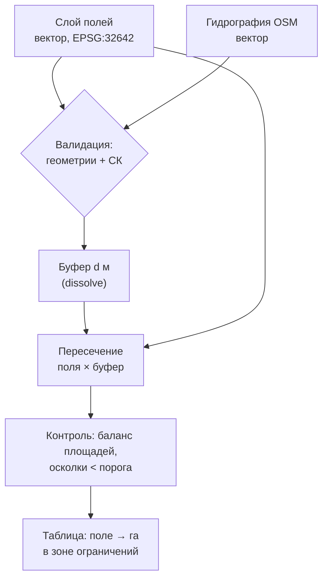

# Проводим пространственный анализ: буферы, оверлей, интерполяция и зональная статистика

> ⏱ **Трудозатраты:** ~20 мин чтения + ~25 мин практики
>
> Модуль **[А2: Геоинформатика и пространственный анализ](../index.md)**, урок 3.
> Академический уровень. Проект UNDP-KAZ-00683, FOLUR. Компоненты FOLUR: **1**, **2**.

## Цели урока и место в модуле

Это аналитическое ядро модуля. Уроки 1–2 дали корректные данные и инструменты; теперь мы отвечаем на содержательные вопросы: *какая часть полей попадает в водоохранную зону? как распределён фосфор по полю между точками отбора проб? каков средний NDVI каждого поля района?* Четыре операции — буферизация, оверлей, интерполяция и зональная статистика — покрывают подавляющее большинство прикладных задач агроаналитики и станут строительными блоками [практикума](../practicum/01-landuse-map-sko.md) и [задания ИИ-ассистента](../ai-assistant.md).

После изучения урока вы сможете:

1. **[Bloom: знать]** перечислять базовые операции пространственного анализа, их входы, выходы и главные параметры.
2. **[Bloom: понимать]** объяснять, чем IDW отличается от кригинга, чем пересечение от обрезки, и почему у каждой операции есть предусловия корректности.
3. **[Bloom: применять]** выполнять буферизацию, оверлей, интерполяцию и зональную статистику в QGIS и GeoPandas/Rasterio на данных Северного Казахстана.
4. **[Bloom: анализировать]** оценивать правдоподобие результата анализа (сходимость методов, контрольные точки, баланс площадей) и находить источник расхождений.

> **Границы лекции.** Внутри: четыре операции анализа с предусловиями и типовыми ошибками. Снаружи: модели данных и топология (предусловия описаны в [уроке 1](01-vector-raster-projections.md)), инструментальный стек ([урок 2](02-qgis-python-stack.md)), автоклассификация и ИИ-инструменты ([урок 4](04-ai-uav-integration.md)), гидрологические применения интерполяции (карта глубин — [модуль А4](../../a4/index.md)), статистическое обучение моделей ([модуль А3](../../a3/index.md)).

---

## 1. Буферизация: зоны влияния

**Буфер** — полигон всех точек в пределах заданного расстояния от объекта. Операция геометрически элементарна, но именно поэтому на ней удобно поставить общий стиль урока: даже у простейшей операции есть параметры, меняющие результат в разы, и дешёвый способ проверить себя. Прикладной вес буфера в агрозадачах велик:

- буфер вокруг гидрографии — прообраз водоохранной зоны (конкретные нормативные ширины — предмет законодательства РК и здесь не воспроизводятся: в учебных задачах ширина буфера задаётся как параметр сценария);
- буфер вокруг лесополос — зона их агрономического влияния на снегозадержание и ветровой режим;
- буфер вокруг населённого пункта или фермы — зона ограничений на применение средств защиты растений по сценарию задачи;
- отрицательный буфер (внутрь полигона) — «ядро» поля без краевой полосы, полезное при анализе NDVI, чтобы исключить смешанные краевые пиксели.

Параметры, которые решают всё: **расстояние** (в единицах СК слоя — метрический рефлекс из урока 1 обязателен), **число сегментов** аппроксимации дуг (влияет на гладкость и площадь), **растворение** (dissolve) перекрывающихся буферов — иначе зоны соседних объектов посчитаются дважды при оценке суммарной площади.

Контроль правдоподобия буфера тривиален и потому обязателен: площадь буфера линии длиной L и шириной d должна быть близка к `2·d·L` (плюс торцы); грубое расхождение — сигнал о градусной СК или незамеченном dissolve.

В коде вся операция с контролем занимает несколько строк:

```python
rivers = gpd.read_file("project.gpkg", layer="rivers").to_crs(epsg=32642)
zone = rivers.buffer(200).union_all()          # буфер 200 м + dissolve одним объектом
zone_ha = zone.area / 10_000
approx = 2 * 200 * rivers.length.sum() / 10_000
print(f"зона: {zone_ha:.0f} га; грубая оценка: {approx:.0f} га")  # числа одного порядка?
```

Если «зона» на порядок больше «грубой оценки» — ищите двойной счёт перекрытий или градусную СК; если на порядок меньше — потерю объектов при чтении слоя. Привычка печатать такую пару чисел после каждой операции — дешёвая страховка, которую мы дальше будем требовать и от кода, сгенерированного ИИ.

Родственник буфера по смыслу — вопрос «что рядом?» наоборот: **расстояние до ближайшего объекта**. Колонка «дистанция до ближайшей дороги/элеватора» для каждого поля строится через `sjoin_nearest` в GeoPandas и часто оказывается информативнее бинарного «попал/не попал в буфер»: она сохраняет непрерывную меру доступности, из которой любые пороги выводятся потом, без пересчёта геометрии.

---

## 2. Оверлей: алгебра полигонов

**Оверлейные операции** совмещают два векторных слоя и порождают новый — с геометрией от совмещения и атрибутами обоих родителей:

| Операция | Результат | Типовая задача |
|---|---|---|
| Пересечение (intersection) | общие части объектов | поля × водоохранная зона: какие площади под ограничением |
| Объединение (union) | вся геометрия обоих слоёв, разрезанная взаимно | сводный слой «поля + угодья» с полными атрибутами |
| Разность (difference) | части первого слоя вне второго | поле за вычетом буферной зоны |
| Симметричная разность | всё, кроме общих частей | зоны рассогласования двух версий границ |
| Обрезка (clip) | геометрия первого в пределах второго, атрибуты только первого | дороги в границах района (кейс урока 2) |

Разницу «пересечение против обрезки» стоит запомнить телесно: *пересечение* — аналитическая операция, склеивающая атрибуты обоих слоёв (после неё можно спросить «сколько гектаров пшеницы в зоне ограничений»); *обрезка* — сервисная операция ограничения охвата, атрибуты второго слоя ей не нужны. Перепутать их — значит либо потерять атрибуты, нужные для ответа, либо получить дубли объектов там, где полигоны второго слоя перекрываются.

**Предусловия корректности** оверлея — прямо из урока 1: единая СК обоих слоёв, валидные геометрии, осознанная работа с осколками (slivers) на выходе. Практический приём: после каждого оверлея проверять **баланс площадей** — сумма площадей результата пересечения не может превышать площадь ни одного из родителей; сумма «пересечение + разность» должна давать площадь исходного слоя с точностью до вычислительной погрешности. Эти проверки занимают одну строку кода и отлавливают бóльшую часть грубых ошибок.

В GeoPandas всё это — `gpd.overlay(a, b, how="intersection"|"union"|"difference"|"symmetric_difference")` и `gpd.clip(a, mask)`; в QGIS — одноимённые алгоритмы панели обработки. Родственная операция — **пространственное соединение** (`gpd.sjoin`, «Join attributes by location»): она не режет геометрию, а переносит атрибуты по пространственному предикату (`within`, `intersects` — словарь из §2.1 урока 2), например приписывает каждой точке отбора проб название поля, в котором она лежит.

### 2.1 Агрегация: dissolve

Завершает семейство векторных операций **растворение (dissolve)** — объединение объектов по общему значению атрибута: поля одного севооборота сливаются в массивы, сельские округа — в район. Dissolve — это пространственный аналог `groupby` из pandas, и GeoPandas честно так его и реализует: `fields.dissolve(by="crop", aggfunc={"area_ha": "sum"})` вернёт по одному полигону на культуру с суммарной площадью. Два предостережения: во-первых, dissolve смежных полигонов с щелями (§3.1 урока 1) оставит внутри «дырки»-артефакты — ещё один довод валидировать топологию заранее; во-вторых, агрегатные функции надо задавать явно — среднее из средних без весов площади даст смещённый результат (та же ловушка, что в вопросе 3 регионального кейса ниже).



*Рис. 1. Типовой аналитический пайплайн: валидация → буфер → оверлей → контроль → результат. Alt: блок-схема — слои полей и гидрографии проходят валидацию, гидрография буферизуется с растворением, буфер пересекается с полями, результат проходит контроль баланса площадей и превращается в таблицу площадей ограничений по полям.*

---

## 3. Интерполяция: из точек — в поверхность

Измерения почти всегда точечны: агрохимический анализ — по сетке проб, глубины водоёма — по галсам промеров, осадки — по метеостанциям. **Интерполяция** восстанавливает непрерывную поверхность (растр) из точечных значений — и это первая операция урока, где результат *существенно зависит от выбора метода и его параметров*. Здесь заканчивается детерминированная геометрия и начинается оценивание: два добросовестных аналитика с одними и теми же точками получат разные карты, и вопрос «какая правильнее» имеет только эмпирический ответ — через проверку на отложенных точках (§3.3). Скрытое предположение любой интерполяции — **пространственная автокорреляция**: близкие точки похожи сильнее далёких. Если это предположение нарушено (значения скачут независимо от расстояния), интерполировать нечего — любой метод нарисует красивую, но бессодержательную поверхность.

### 3.1 IDW: обратные взвешенные расстояния

**IDW (Inverse Distance Weighting)** оценивает значение в ячейке как средневзвешенное ближайших точек с весами, убывающими с расстоянием (обычно как 1/dᵖ). Интуитивен, быстр, без настройки статистической модели. Свойства, которые надо знать:

- поверхность проходит точно через точки измерений (интерполятор точный);
- степень p управляет «локальностью»: большая p — резкие пятна вокруг точек («бычьи глаза» — характерный артефакт IDW), малая — заглаженная поверхность;
- экстраполировать за пределы облака точек IDW не умеет осмысленно — значения там определяются ближайшим краем данных и малодостоверны;
- никакой оценки неопределённости IDW не даёт.

### 3.2 Кригинг: геостатистика

**Кригинг** — статистический интерполятор: сначала по данным строится **вариограмма** — модель того, как растёт различие значений с расстоянием между точками; затем веса подбираются оптимально относительно этой модели. За дополнительную сложность кригинг платит двумя преимуществами: учитывает *структуру* пространственной изменчивости (в том числе анизотропию — когда изменчивость вдоль направления обработки поля отличается от поперечной) и выдаёт **карту ошибки предсказания** — где интерполяции можно верить, а где точек мало.

Практическое правило выбора: **IDW — для быстрой разведки и плотных равномерных сетей точек; кригинг — когда важна обоснованность, сеть неравномерна или нужна карта неопределённости.** И всегда — сравнение: если IDW и кригинг на одних данных дают радикально разные поверхности, это сигнал о недостаточной плотности точек, а не повод выбрать «понравившуюся» картинку.

Кроме IDW и кригинга существуют и другие интерполяторы, которые вы встретите в инструментах: **TIN** (триангуляция — быстрая линейная поверхность по треугольникам между точками, хороша для рельефа с изломами), **сплайны** (гладкие поверхности с риском «перелётов» за диапазон данных), **естественные соседи** (компромисс гладкости и локальности). Для задач модуля достаточно уверенно владеть парой IDW/кригинг и понимать, что выбор метода — проверяемое решение, а не вопрос вкуса.

### 3.2.1 Параметры, которые забывают: размер ячейки и радиус поиска

У любого интерполятора есть два параметра, влияющих на результат сильнее, чем выбор метода.

**Размер ячейки выходного растра.** Он должен соответствовать плотности точек: сетка проб через 100 м не содержит информации для ячейки 1 м — мелкая ячейка лишь создаст иллюзию детальности (псевдоточность из §3.4 урока 1). Практический ориентир — ячейка порядка от четверти до половины среднего расстояния между точками; меньшее оправдано только эстетикой финальной карты.

**Радиус поиска / число соседей.** Сколько окружающих точек участвуют в оценке каждой ячейки. Слишком маленький радиус в разреженной зоне оставит «дыры» NoData; слишком большой — заглаживает локальную структуру и тянет влияние далёких, нерелевантных точек. При неравномерной сети предпочтителен поиск «N ближайших» вместо фиксированного радиуса.

Оба параметра обязаны попадать в паспорт результата (§3.5 урока 2): карта интерполяции без указания метода, ячейки и радиуса — невоспроизводима.

### 3.3 Проверка интерполяции: контрольные точки

Единственный честный способ оценить качество интерполяции — **валидация на отложенных точках**: часть измерений (например, каждая десятая точка) не участвует в построении поверхности, а затем сравнивается с предсказанием в своих координатах. Метрика — среднеквадратичная или средняя абсолютная ошибка. Этот приём — микроверсия валидации моделей машинного обучения из [А3](../../a3/index.md) и обязательный шаг верификации в [задании ИИ-ассистента](../ai-assistant.md).

Три практических правила валидации. Во-первых, отложенные точки выбираются *случайно*, а не «с краю»: край облака и так худшее место интерполяции, оценка будет пессимистичной и нерепрезентативной. Во-вторых, на неравномерной сети полезна **пространственная кросс-валидация** — откладываются не отдельные точки, а компактные группы: она честнее отражает способность метода предсказывать в «пустых» зонах (для эхолотных промеров по галсам — откладывается целый галс: соседние точки одного галса почти дублируют друг друга, и обычная валидация даёт ложно-оптимистичную ошибку). В-третьих, ошибка валидации сообщается вместе с картой — «карта гумуса, средняя абсолютная ошибка по 10% отложенных точек — столько-то» — и становится частью паспорта результата.

Сведём выбор интерполятора в таблицу-шпаргалку:

| Критерий | IDW | Кригинг |
|---|---|---|
| Настройка | минимальная (степень p, соседи) | вариограмма + параметры модели |
| Скорость | высокая | ниже, растёт с числом точек |
| Неравномерная сеть | чувствителен | устойчивее, честно покажет неопределённость |
| Оценка ошибки | нет | карта дисперсии предсказания |
| Анизотропия | не учитывает | учитывается вариограммой |
| Типовая роль | разведка, плотные сети | обоснованные карты, отчётные продукты |

Учебный полигон для интерполяции в платформе — **открытый батиметрический датасет уровня A**: `datasets/bathymetry-training-80k.csv`, сырые эхолотные промеры пресноводного водохранилища степной зоны Казахстана в обезличенной локальной системе координат (`x_m, y_m, depth_m` — метры, без геопривязки; название и расположение объекта не раскрываются в соответствии с [политикой данных](../../../datasets.md)). Для задач интерполяции локальная СК — не ограничение, а удобство: координаты уже метрические. Полный георектифицированный набор (уровень C) — дополнительный материал, доступный после юридического подтверждения; возможно исключение. Полноценная работа с этим датасетом — фильтрация выбросов, карта глубин, объём — разворачивается в [модуле А4](../../a4/index.md); здесь мы используем его фрагмент как реалистичное облако точек для сравнения IDW/кригинга.

> **Подробнее** — о выбросах эхолотных данных и их фильтрации до интерполяции — в [А4](../../a4/index.md): интерполяция «грязных» точек даёт гладкую, убедительную и неверную поверхность.

---

## 4. Зональная статистика: вектор спрашивает — растр отвечает

**Зональная статистика** агрегирует значения растра по зонам векторного слоя: для каждого полигона (поля) считаются среднее, минимум, максимум, медиана, стандартное отклонение пикселей, попавших внутрь. Это самая используемая операция агроаналитики: средний NDVI по полям, средняя высота по водосборам, доля классов землепользования по районам (вариант для категориального растра — **гистограмма классов** в зоне). Стандартное отклонение при этом недооценивают зря: два поля с одинаковым средним NDVI, но разным разбросом — это разные агрономические ситуации (ровное среднее поле против поля с отличными и провальными зонами), и именно разброс подсказывает, где нужна карта, а не одна цифра.

Предусловия и подводные камни:

- **согласование СК** растра и вектора (иначе зоны «промахнутся»);
- **NoData** должен быть корректно задан — облачная маска не должна тянуть среднее вниз (§1.2 урока 1);
- **краевые пиксели**: пиксель 10 м на границе поля наполовину чужой; для малых полигонов доля таких пикселей велика, и статистика шумит. Приёмы: отрицательный буфер границы (§1), либо взвешивание по доле пикселя в зоне (доступно в `rasterstats`/`exactextract`);
- **малые зоны**: полигон, в который попало 3 пикселя, даёт статистику из трёх чисел — интерпретировать её среднее как «состояние поля» нельзя; выводите вместе со статистикой число пикселей `count` и фильтруйте по нему. `count` вообще полезнейший из «служебных» выводов: его неожиданные значения (ноль у поля, которое точно на снимке; в десять раз меньше ожидаемого) сигнализируют о промахе СК или маске облаков раньше любых других проверок;
- для **категориальных растров** осмыслены только доли классов и мода — среднее «номеров классов» бессмысленно (снова §3.3 урока 1): «средний класс 35» между водой (код 80) и пашней (код 40) не означает ничего.

Инструменты: в QGIS — алгоритм «Зональная статистика»; в Python — библиотека `rasterstats` (`zonal_stats(fields, "ndvi.tif", stats=["mean","count"])`) или более быстрый `exactextract`. Ручной и программный результат на одних данных обязаны совпадать — на этом совпадении построена верификация в [задании ИИ-ассистента](../ai-assistant.md).

Минимальный рабочий пример целиком:

```python
from rasterstats import zonal_stats
import geopandas as gpd

fields = gpd.read_file("project.gpkg", layer="fields_esil_2025").to_crs(epsg=32642)
stats = zonal_stats(fields, "ndvi_20250615.tif", stats=["mean", "count"], nodata=-9999)
fields["ndvi_mean"] = [s["mean"] for s in stats]
fields["px_count"] = [s["count"] for s in stats]
reliable = fields[fields["px_count"] >= 10]     # фильтр малых зон (§4)
```

Обратите внимание на два «скучных» аргумента, в которых прячутся ошибки: `to_crs` (согласование СК с растром) и `nodata` (если растр не хранит NoData в заголовке, его надо задать руками — иначе −9999 войдёт в среднее и NDVI полей «уедет» в минус).

### 4.1 Алгебра карт: растр спрашивает растр

Прежде чем вектор спросит растр, сам растр часто нужно вычислить. **Алгебра карт** — попиксельные операции над растрами: NDVI из каналов красного и ближнего инфракрасного (`(NIR − RED) / (NIR + RED)`), разность NDVI двух дат (карта изменений за сезон), маскирование по условию («показать только пиксели с NDVI < 0,3»). В QGIS это «Калькулятор растров», в Python — обычные операции NumPy над массивами из Rasterio. Предусловие — согласованные сетки (§3.3 урока 1): каналы одной сцены Sentinel-2 согласованы by design (но имеют разное разрешение — 10 и 20 м, потребуется передискретизация), а вот растры разных дат или источников надо явно приводить к общей сетке. И арифметическая гигиена: целочисленные каналы перед делением приводятся к float, деление на ноль (NIR + RED = 0 на воде и тени) маскируется, диапазон результата проверяется — NDVI обязан лежать в [−1, 1], и выход за диапазон означает ошибку формулы или типов, а не «особенность территории».

### 4.2 Собираем операции в пайплайн

Реальная задача почти никогда не сводится к одной операции. Типовой районный анализ «состояние полей с учётом ограничений» звучит так: *валидировать слой полей → построить буфер гидрографии → вычесть буфер из полей (difference) → по остатку посчитать зональную статистику NDVI → отфильтровать поля с малым count → выгрузить таблицу*. Каждый шаг — из этого урока; корректность каждого — из урока 1; воспроизводимость цепочки — из урока 2.

К пайплайну прилагается **протокол самопроверки** — короткий список инвариантов, проверяемых после запуска:

- число полей на выходе ≤ числа на входе (difference не размножает объекты);
- баланс площадей: «в зоне» + «вне зоны» = исходная площадь (± вычислительная погрешность);
- диапазон NDVI в [−1, 1]; доля NoData-зон в разумных пределах для данной облачности;
- у каждого поля с результатом `px_count` выше порога; поля ниже порога перечислены отдельно, а не выброшены молча.

Такой протокол — это ровно то, что отличает анализ от «нажатия кнопок»: результат сопровождается свидетельствами своей корректности. Именно такие пайплайны генерирует ИИ-агент в [уроке 4](04-ai-uav-integration.md) — и теперь у вас есть всё, чтобы проверять каждый его шаг: протокол самопроверки не зависит от того, кто написал код, человек или агент.

---

## 5. Четыре операции — одна логика контроля

Полезно увидеть, что за четырьмя разными операциями стоит один и тот же каркас рассуждения, и он переносится на любую операцию геообработки, которую вы встретите после модуля.

**Предусловия.** У каждой операции есть условия корректности входа: метрическая СК и валидная геометрия (буфер, оверлей), пространственная автокорреляция и достаточная плотность точек (интерполяция), согласованные сетки и корректный NoData (зональная статистика, алгебра карт). Предусловия не проверяются инструментом за вас — QGIS и GeoPandas честно посчитают бессмыслицу, если её подать на вход. Первый вопрос к любой новой операции: *что она молча предполагает о моих данных?*

**Параметры.** У каждой операции есть параметры, меняющие результат: расстояние и dissolve у буфера, тип оверлея, метод/ячейка/радиус у интерполяции, набор статистик и обработка краёв у зональной статистики. Параметры «по умолчанию» — это чьё-то решение, принятое не про вашу задачу. Второй вопрос: *какие параметры я принял не глядя?*

**Инварианты результата.** У каждой операции есть дешёвые проверки правдоподобия: геометрическая оценка площади буфера, баланс площадей оверлея, ошибка на отложенных точках у интерполяции, count и диапазон значений у зональной статистики. Третий вопрос: *какое простое число докажет, что результат не абсурден?*

Эта тройка — «предусловия, параметры, инварианты» — и есть профессиональная привычка, которую модуль стремится поставить. Она же объясняет, почему опытный аналитик спокойно принимает код от ИИ-агента: не потому, что доверяет агенту, а потому, что его система контроля не зависит от источника кода. И наоборот: аналитик без этой привычки опасен даже с идеальным инструментом — он примет любой правдоподобно выглядящий результат, свой или чужой.

Замыкая урок: каждая операция здесь описана в связке с типовой ошибкой не для запугивания, а потому что ошибки — это учебный материал более высокого качества, чем успехи. Список «как это ломается» короче и полезнее списка «как это работает»; выучив первый, второй вы восстановите сами.

---

## Региональный кейс

**Ситуация.** Агроном хозяйства в Буландынском районе Акмолинской области получил результаты агрохимического обследования: точки отбора проб по сетке с показателем гумуса. Нужно превратить точки в карту для дифференцированного внесения удобрений и оценить, насколько карте можно доверять между точками. Параллельно стоит вторая задача: по свежему снимку Sentinel-2 сравнить состояние посевов между полями и внутри полей. Обе задачи — типовые для зернового пояса Северного Казахстана, где точечные полевые измерения дороги, а спутниковый фон бесплатен, и вопрос «как далеко можно доверять интерполяции и агрегации» становится вопросом реальных денег.

**Данные.** Точки агрохимического обследования — собственные данные хозяйства (в учебной версии — синтетическая сетка точек из практикума, помеченная как учебная); Sentinel-2 L2A через [Copernicus Data Space](https://dataspace.copernicus.eu/) на территорию Акмолинской области; границы полей — оцифровка по снимку (урок 1).

**Задача.**

1. Выберите метод интерполяции гумуса и обоснуйте: сетка проб регулярная, но в западной части поля точек вдвое меньше. Как оценить ошибку карты?
2. NDVI по снимку рассчитан; поля мелкоконтурные, часть меньше гектара. Какие два приёма зональной статистики обязательны, чтобы средний NDVI малых полей не был шумом?
3. Руководитель просит «одну цифру NDVI на хозяйство». Почему простое среднее всех пикселей хозяйства и среднее по полям с весом площади — разные числа, и какое корректнее для отчёта?

Прежде чем читать разбор, попробуйте ответить самостоятельно, опираясь на тройку «предусловия — параметры — инварианты» из §5: для каждой из трёх задач кейса назовите хотя бы один пункт каждого типа.

**Разбор.** (1) Неравномерность сети — довод в пользу кригинга: он даст карту ошибки, которая честно покажет ненадёжную западную часть; контроль — отложенные точки (§3.3). IDW пригоден как разведка и для сравнения: расхождение методов локализует зоны недоверия. (2) Отрицательный буфер границ (исключить смешанные краевые пиксели 10 м) и вывод `count` с фильтром малых зон; для полей меньше гектара (≤100 пикселей Sentinel-2, из них заметная доля краевых) честнее сообщить «оценка ненадёжна», чем число. (3) Среднее всех пикселей взвешивает поля по площади автоматически, но захватывает и непосевные территории (дороги, колки, залежи); корректнее — зональная статистика по слою полей и агрегирование со взвешиванием по площади поля: явный контроль того, *что именно* усредняется. Урок кейса: «одна цифра» всегда скрывает выбор методики, и аналитик обязан его зафиксировать.

Общий вывод кейса шире агрохимии: три задачи потребовали трёх разных инструментов, но одного и того же рассуждения — явный выбор метода с обоснованием, контроль через отложенные данные или count, и честная формулировка ограничений в отчёте. Слушатель, который освоил это рассуждение, самостоятельно разберётся и с методами, не вошедшими в модуль.

> Кейс продолжается в [практикуме](../practicum/01-landuse-map-sko.md) (зональная статистика классов землепользования по району) и в [А4](../../a4/index.md) (интерполяция глубин).

---

## Закрепление и применение

!!! example "Попробуйте в Colab"
    Ноутбук урока: сравнение IDW и кригинга на фрагменте открытого батиметрического датасета уровня A (`x_m, y_m, depth_m`, локальная СК) с валидацией на отложенных точках; зональная статистика NDVI по учебному слою полей через `rasterstats`. Ссылка: `<URL будет назначен при создании репозитория ноутбуков>`.

!!! warning "Границы применимости"
    Интерполяция достоверна только внутри облака точек и только для плавно меняющихся величин; резкие границы (смена почвенной разности, бровка карьера) она замажет. Зональная статистика по полигонам меньше ~10 пикселей — шум, а не измерение. Нормативные ширины охранных зон — предмет законодательства РК: в учебных задачах они параметры сценария, в реальных проектах — предмет проверки по действующим НПА.

!!! tip "Что это даёт вашему хозяйству"
    Карта гумуса из точек проб — это дифференцированное внесение вместо равномерного: удобрение попадает туда, где его не хватает. Таблица «средний NDVI по каждому полю за дату» — объективный рейтинг полей для выезда агронома. Обе задачи решаются бесплатным стеком за вечер — и повторяются каждый сезон одним запуском.

!!! question "Кейс для размышления"
    Два специалиста посчитали «площадь полей в водоохранной зоне» одного района и получили числа, различающиеся на треть. Составьте список из пяти вопросов (по материалам уроков 1–3), которые вы зададите обоим, чтобы найти источник расхождения, не глядя в их проекты. (Начните с СК и параметра dissolve у буфера.)

---

### Проверь себя

```quiz
[
  {
    "q": "Нужно узнать, сколько гектаров каждого поля попадает в буферную зону гидрографии, сохранив атрибуты полей И признак зоны. Какая операция корректна?",
    "options": [
      "Пересечение (intersection) полей с буфером",
      "Обрезка (clip) полей по буферу",
      "Симметричная разность полей и буфера",
      "Пространственное соединение (sjoin) без изменения геометрии"
    ],
    "answer": 0,
    "explain": "§2: пересечение возвращает общие части с атрибутами обоих слоёв — по нему считаются площади ограничений. Clip не переносит атрибуты второго слоя, sjoin не даёт геометрию пересечения, симметричная разность — наоборот, всё вне общих частей."
  },
  {
    "q": "На карте интерполяции агрохимии вокруг точек проб видны концентрические «пятна-мишени». Это характерный признак:",
    "options": [
      "IDW с высокой степенью p («бычьи глаза»)",
      "Кригинга с анизотропной вариограммой",
      "Ошибки системы координат точек",
      "Неверно заданного NoData растра"
    ],
    "answer": 0,
    "explain": "§3.1: «бычьи глаза» — типовой артефакт IDW: веса резко падают с расстоянием, и поверхность образует пятна вокруг измерений. Кригинг с корректной вариограммой такой структуры не навязывает."
  },
  {
    "q": "Главное преимущество кригинга перед IDW при неравномерной сети точек:",
    "options": [
      "Он моделирует пространственную структуру (вариограмма) и выдаёт карту ошибки предсказания",
      "Он всегда точнее на любом наборе данных",
      "Он не требует настройки параметров",
      "Он работает быстрее на больших наборах"
    ],
    "answer": 0,
    "explain": "§3.2: кригинг строит вариограмму и оценивает неопределённость — критично при неравномерной сети. «Всегда точнее» неверно (проверяется только на отложенных точках, §3.3); настройки у него больше, скорость — ниже."
  },
  {
    "q": "Средний NDVI поля площадью 0,5 га по Sentinel-2 (10 м) вызывает сомнения. Обоснованная причина:",
    "options": [
      "В зону попадает ~50 пикселей, значительная часть — краевые смешанные; статистика ненадёжна",
      "NDVI не считается для полей меньше 1 га",
      "Sentinel-2 не покрывает малые объекты",
      "Зональная статистика работает только с категориальными растрами"
    ],
    "answer": 0,
    "explain": "§4: 0,5 га = 5000 м² ≈ 50 пикселей по 100 м²; на мелкоконтурном поле велика доля краевых пикселей, захватывающих соседние объекты. Приёмы — отрицательный буфер, фильтр по count, взвешивание по доле пикселя."
  },
  {
    "q": "После пересечения полей с буферной зоной сумма площадей результата оказалась БОЛЬШЕ суммарной площади самих полей. О чём это говорит?",
    "options": [
      "В данных ошибка (перекрытия полигонов или неявный повтор объектов): баланс площадей нарушен — результат пересечения не может превышать родителя",
      "Это нормально: буфер добавляет площадь",
      "Это нормально для равноугольных проекций",
      "Пересечение всегда увеличивает площадь за счёт осколков"
    ],
    "answer": 0,
    "explain": "§2: контроль баланса площадей — результат intersection есть подмножество каждого из родительских слоёв; превышение означает перекрытия/дубликаты (§3.1 урока 1) или двойной счёт из-за неслитых буферов (без dissolve)."
  }
]
```

---

## Что дальше?

Аналитическое ядро модуля освоено: буфер, оверлей, интерполяция и зональная статистика с их предусловиями, параметрами и инвариантами. Остался последний шаг — собрать всё в производственную картину с разномасштабными данными и ИИ-инструментами.

- Следующий урок — **[Совмещаем спутник, БПЛА и ИИ-инструменты в одном ГИС-проекте](04-ai-uav-integration.md)**: разномасштабные растры, автоклассификация и ревью ИИ-пайплайнов.
- Интерполяция всерьёз — карта глубин по 80 000 реальных эхолотных промеров открытого датасета уровня A — **[модуль А4](../../a4/index.md)**: там методы этого урока встретятся с полевыми данными во всей их «грязи».
- Зональная статистика руками кодинг-агента и её верификация против вашего ручного расчёта — **[ИИ-ассистент модуля](../ai-assistant.md)**; выполняется после практикума.
