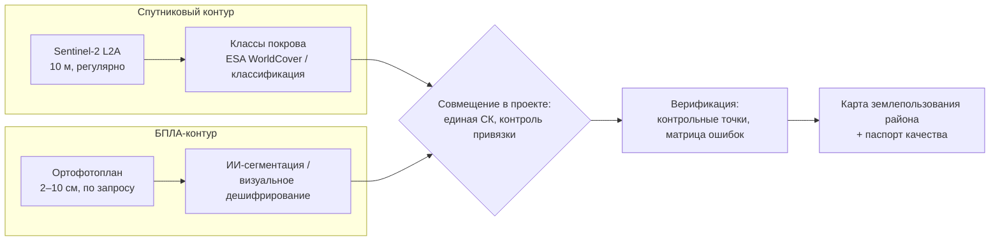

# Совмещаем спутник, БПЛА и ИИ-инструменты в одном ГИС-проекте

> ⏱ **Трудозатраты:** ~20 мин чтения + ~20 мин практики
>
> Модуль **[А2: Геоинформатика и пространственный анализ](../index.md)**, урок 4.
> Академический уровень. Проект UNDP-KAZ-00683, FOLUR. Компоненты FOLUR: **1**, **2**.

## Цели урока и место в модуле

Финальный урок модуля соединяет всё в производственную картину 2026 года: в одном проекте живут спутниковые слои (обзор, регулярность) и ортофотопланы БПЛА (детальность), а рутинные операции — классификацию, сегментацию, векторизацию и даже сборку целых пайплайнов — берут на себя ИИ-инструменты. Роль специалиста при этом не уменьшается, а смещается: от исполнения операций — к постановке задач и **верификации результатов**. Этот урок готовит вас к [заданию ИИ-ассистента](../ai-assistant.md) и к финальной сборке [прикладного продукта модуля](../practicum/01-landuse-map-sko.md) — карты землепользования района СКО.

После изучения урока вы сможете:

1. **[Bloom: знать]** перечислять отличия спутниковых и БПЛА-данных (разрешение, охват, периодичность) и классы ИИ-инструментов в ГИС (автоклассификация, сегментация, векторизация, агенты).
2. **[Bloom: понимать]** объяснять, зачем в одном проекте нужны оба масштаба данных и почему результат любого ИИ-инструмента требует независимой проверки.
3. **[Bloom: применять]** совмещать ортофотоплан БПЛА со спутниковыми слоями в QGIS (СК, передискретизация, пирамиды, прозрачность) и применять готовые ИИ-инструменты сегментации/классификации.
4. **[Bloom: анализировать]** проводить ревью ИИ-результата: строить матрицу ошибок по контрольным точкам, находить систематические ошибки классов, оценивать пригодность результата для карты.

> **Границы лекции.** Внутри: интеграция разномасштабных растров, обзор ИИ-инструментов в ГИС и дисциплина их верификации, оформление финальной карты. Снаружи: съёмка и фотограмметрическая обработка БПЛА-данных ([модуль А1](../../a1/index.md)); обучение собственных ML-моделей, метрики F1/IoU и разметка данных ([модуль А3](../../a3/index.md)); полное pro-code задание с кодинг-агентом — [ИИ-ассистент модуля](../ai-assistant.md).

---

## 1. Спутник и БПЛА: не конкуренты, а два масштаба одной системы

Из [А1](../../a1/index.md) вы знаете технику: спутник даёт регулярный охват (Sentinel-2 — 10 м, каждые несколько суток, бесплатно), БПЛА — детальность по запросу (ортофото 2–10 см на десятки–сотни гектаров). Выбор «или-или» здесь ложный: экономика мониторинга строится на комбинации — спутниковый фон бесплатно закрывает всю площадь и весь сезон, а дорогой облёт назначается точечно, туда, где спутник показал проблему или где нужна детальность, недостижимая с орбиты. Геоинформатическая задача этого урока — заставить оба масштаба работать в *одном* проекте, и у неё три технических слагаемых.

**Единая СК.** Ортофотоплан приходит из фотограмметрического пакета в той СК, которую выбрал оператор; сцена Sentinel-2 — в UTM своей зоны; векторные слои проекта — в третьей системе, если дисциплина хромала. Всё физически приводится к СК проекта (дисциплина [урока 1](01-vector-raster-projections.md)); контроль — совпадение общих объектов (перекрёстки дорог, углы лесополос) при поочерёдном включении слоёв. Перепроецирование непрерывного ортофото выполняется билинейным или кубическим методом; если же в проект приходит категориальный растр — только ближайшим соседом (§3.3 урока 1).

**Контроль взаимной привязки.** Даже в единой СК слои могут расходиться: точность привязки ортофото зависит от опорных точек (GCP) и режима GNSS (RTK/PPK — см. А1), у Sentinel-2 своя геометрическая точность. Практический тест: измерьте смещение одних и тех же опознаваемых объектов в нескольких углах ортофото. Систематический сдвиг в одну сторону лечится аффинной коррекцией привязки; расползающиеся в разные стороны смещения — признак проблем фотограмметрии, и такой ортофотоплан для измерений непригоден.

**Работа с разрешением.** Разница масштабов между источниками огромна и несимметрична по смыслу: пиксель Sentinel-2 (10 м) накрывает 200×200 и более пикселей ортофото (5 см). Сравнивать их напрямую нельзя — сначала выбирается **рабочее разрешение конкретной операции**: визуальное дешифрирование ведётся на ортофото; NDVI-статистика — на сетке Sentinel-2; если нужно сопоставить попиксельно, детальный растр агрегируется (усредняется) к грубой сетке, а не наоборот — «растянуть» 10-метровый пиксель до 5 см можно, но новых данных в нём не появится, только иллюзия детальности (псевдоточность, §3.4 урока 1).

Рабочее разделение труда в проекте карты землепользования выглядит так: Sentinel-2 и производные (WorldCover) дают *системный слой* — классы покрова на весь район; ортофото БПЛА даёт *верификационный и детализирующий слой* — по нему проверяются сомнительные контуры, уточняются границы и дешифрируются объекты мельче спутникового пикселя (отдельные постройки, узкие лесополосы, микрозалежи).



*Рис. 1. Два контура данных сходятся в одном проекте: спутник даёт системный слой классов, БПЛА — детализацию и верификацию; продукт выходит только через шаг проверки. Alt: схема — Sentinel-2 ведёт к классам покрова, ортофотоплан БПЛА — к сегментации; оба потока совмещаются в проекте с единой СК, проходят верификацию по контрольным точкам и превращаются в карту землепользования с паспортом качества.*

Инженерные мелочи, экономящие часы: у гигабайтных ортофото обязательно постройте **пирамиды** (§1.2 урока 1) — иначе навигация по карте мучительна; для передачи и веб-публикации используйте **COG**; для визуального сравнения слоёв в QGIS удобны прозрачность слоя и инструмент «шторка» (Map Swipe).

Сведём входной контроль ортофотоплана в десятиминутный протокол, который стоит выполнять при приёмке любых данных подрядчика:

1. открыть метаданные (`gdalinfo` или свойства слоя): СК, разрешение, NoData, наличие пирамид;
2. проверить совпадение СК с проектом; при необходимости — физически перепроецировать;
3. сверить привязку по 3–4 опознаваемым объектам в разных углах сцены против независимого слоя;
4. осмотреть швы мозаики и зоны у края облёта — там фотограмметрия слабее всего: артефакты «плывущих» объектов, размытие;
5. записать паспорт слоя (§3.5 урока 2): дата съёмки, исполнитель, режим привязки (RTK/GCP — из акта работ), выявленные ограничения.

Пять пунктов отделяют «нам прислали красивую картинку» от «у нас есть измерительный слой с известной точностью» — и дают формальные основания вернуть работу подрядчику, если слой измерительным не является.

---

## 2. ИИ-инструменты в ГИС: что уже работает

«ИИ в ГИС» в 2026 году — это не одна технология, а спектр инструментов разной зрелости: от классификаторов, работающих в отрасли десятилетиями, до агентных систем, вышедших из лабораторий буквально вчера. Урок делит их на три класса по тому, *что именно* они автоматизируют, — и для каждого класса называет способ проверки, потому что без него класс не имеет производственной ценности.

### 2.1 Автоклассификация растров

Классификация покрова по спутниковым снимкам — старейшее применение машинного обучения в ДЗЗ: алгоритм относит каждый пиксель (или сегмент) к классу — вода, лес, пашня, застройка. Доступные без программирования варианты: полуавтоматическая классификация в QGIS (плагин Semi-Automatic Classification), готовые глобальные продукты (**ESA WorldCover**, 10 м) — уже готовая автоклассификация, выполненная за вас на глобальном уровне. Из устройства таких продуктов следуют их честные ограничения: глобальная модель не настраивалась на специфику конкретного района, и локальные ошибки неизбежны — солончаки и залежи, например, являются известно трудными классами для любых глобальных карт покрова. Отсюда рабочее правило: **глобальный продукт — черновик локальной карты, а не её замена**; его локальная точность оценивается по контрольным точкам (§3), а исправляется — ручной доработкой или локальной классификацией ([А3](../../a3/index.md)).

Слово «автоклассификация» в заголовке не должно вводить в заблуждение: автоматичен только перебор пикселей, а решения о наборе классов, обучающих данных и приёмке результата остаются за человеком — в этом смысле она устроена так же, как весь ИИ-слой урока. Полезно различать два подхода к классификации, потому что они по-разному ошибаются. **Попиксельная** классификация решает задачу для каждого пикселя независимо — она проста, но даёт «солёно-перечный» шум одиночных пикселей чужого класса внутри однородных полей. **Объектно-ориентированная (OBIA)** сначала сегментирует снимок на однородные области и классифицирует их целиком — контуры чище, но ошибка сегментации (слипшиеся поля) наследуется всеми последующими шагами. Глобальные продукты и локальные модели используют оба подхода и их гибриды; для пользователя карты важно одно: тип артефактов подсказывает, каким инструментом карту дорабатывать — фильтрацией мелких пятен или пересегментацией.

### 2.2 Сегментация и векторизация

**Сегментация** делит изображение на однородные области; современные фундаментальные модели (класс Segment Anything Model, SAM) выделяют объекты на снимке без обучения под задачу — по клику или автоматически. В QGIS этот класс моделей доступен через плагины нейросетевого инференса (например, **Deepness**), в Python — через открытые библиотеки (samgeo). Практический смысл для агрозадач: быстрое выделение контуров полей, водоёмов, построек на ортофото — то, что вручную оцифровывается днями.

За сегментацией следует **векторизация** — превращение выделенных областей в полигоны с чисткой: сглаживание пиксельной «лесенки», удаление микрополигонов, топологическая валидация (снова [урок 1](01-vector-raster-projections.md)). ИИ-контуры наследуют все болезни автоматической оцифровки: слипшиеся соседние поля, разорванные объекты, фантомные сегменты на тенях и облаках. Поэтому пайплайн всегда трёхзвенный: *модель → чистка → ручная проверка*. Экономика при этом остаётся в пользу ИИ: проверить и поправить триста контуров быстрее, чем оцифровать их с нуля, — но только если этап проверки честно заложен в план работ, а не выброшен ради «полной автоматизации».

### 2.3 GeoAI-агенты: ГИС, которая пишет себе инструкции

Фронтир 2025–2026 годов — **автономные ГИС-агенты**: LLM-системы, которые по текстовой постановке («посчитай долю пашни в 2 км от рек по району N») сами строят и исполняют цепочку геообработки. В экосистеме QGIS это ассистенты класса GIS Copilot; в исследовательской среде — фреймворки автономного геоанализа (LLM-Find и родственные — обзорно); в терминале — универсальные кодинг-агенты (**Claude Code, OpenCode**), которые пишут скрипты на знакомом вам стеке GeoPandas/Rasterio. Исследования этого направления показывают, что агенты уверенно решают значительную долю типовых геозадач, но **требуют человеческого контроля** — они ошибаются в выборе СК, параметрах операций и интерпретации постановки, причём ошибаются *уверенно*, без предупреждений.

Анатомия грамотной постановки задачи агенту повторяет паспорт пайплайна из уроков 2–3, и это не совпадение:

- **данные**: пути, форматы, СК, что считать NoData;
- **операции**: словами из этого модуля — «перепроецируй в EPSG:32642, валидируй геометрии, зональная статистика mean и count»;
- **контроль**: какие инварианты код обязан проверить сам (диапазон NDVI, баланс площадей, минимальный count);
- **выход**: формат таблицы/слоя и что напечатать для ручной сверки.

Чем точнее постановка, тем меньше пространство для «уверенной ошибки»; а требование напечатать контрольные числа превращает вывод агента в материал для верификации, а не в чёрный ящик.

Отсюда центральный тезис всего ИИ-слоя платформы: **ИИ ускоряет — человек верифицирует**. Агент пишет за минуты то, что вы писали бы час; но подписываетесь под результатом вы. Чек-лист чтения чужого геокода (§2.7 урока 2) и протокол самопроверки пайплайна (§4.2 урока 3) — это и есть инструменты такой верификации, и они не зависят от того, кто автор кода. Все ИИ-инструменты урока заменяемы открытыми аналогами, а каждое задание модуля выполнимо и полностью без ИИ.

### 2.4 Выбор инструмента под задачу

Три класса удобно сопоставить по вопросу «что автоматизируем и что проверяем»:

| Класс | Что делает | Типовая задача А2 | Что верифицирует человек |
|---|---|---|---|
| Автоклассификация / готовые продукты | классы покрова по снимку | системный слой карты района | матрица ошибок на контрольных точках |
| Сегментация + векторизация | контуры объектов на детальном растре | поля и лесополосы по ортофото | чистка, топология, ручная приёмка |
| GeoAI-агенты / кодинг-агенты | целые цепочки геообработки | зональная статистика, отчётные таблицы | ревью кода + сверка с независимым расчётом |

Общий признак зрелого применения — во всех трёх строках колонка справа непуста. Если для какого-то ИИ-результата вы не можете назвать способ его независимой проверки, этот результат не готов к использованию — независимо от того, насколько убедительно он выглядит. И обратная сторона: как только способ проверки назван, ИИ-инструменты перестают быть «магией» и становятся обычным звеном пайплайна с известной ценой контроля — как подрядчик-фотограмметрист из §1, чью работу вы тоже принимаете по протоколу.

---

## 3. Верификация ИИ-результата: матрица ошибок на контрольных точках

Как *количественно* проверить карту классов, полученную от ИИ (глобального продукта, сегментации, агента)? Визуальное «выглядит похоже» проверкой не является: глаз охотно подтверждает ожидания и пропускает систематические ошибки в незнакомых частях территории. Стандартная процедура тематической картографии заменяет впечатление измерением:

1. **Набор контрольных точек.** По территории размещаются точки (случайно или стратифицированно по классам), для каждой определяется *истинный* класс — по ортофото БПЛА (вот и вторая роль детального контура из §1), полевому знанию или визуальному дешифрированию детального снимка. Контрольные точки не должны участвовать ни в каком обучении/настройке — это отложенная выборка, тот же принцип, что в §3.3 урока 3. Случайное размещение защищает от соблазна «проверять там, где карта наверняка права»; стратификация по классам гарантирует, что редкие классы (вода, застройка) вообще попадут в проверку, а не растворятся в доминирующей пашне.
2. **Матрица ошибок (confusion matrix).** Таблица «истинный класс × класс карты»: диагональ — верные ответы, вне диагонали — ошибки. Из неё считаются общая точность (доля верных точек) и поклассовые показатели: *точность производителя* (какая доля реальной пашни попала в класс «пашня») и *точность пользователя* (какая доля класса «пашня» на карте — действительно пашня). Двойная перспектива не случайна: первая отвечает картографу («что я потерял»), вторая — потребителю карты («чему из показанного верить»), и для решения на основе карты важнее вторая.
3. **Анализ систематики.** Важнее общей цифры — *структура* ошибок: если залежь систематически уходит в «пастбище», это не шум, а свойство модели, о котором обязан знать пользователь карты; такие пары классов либо объединяются, либо дорабатываются вручную по детальному контуру. Полезно также нанести ошибочные точки на карту: пространственная кучность ошибок (все — в пойме, все — на границе сцен) указывает на причину точнее любой таблицы.

Разберём механику на **условном учебном примере** (числа иллюстративные, не измерения). Пусть по 30 контрольным точкам трёх классов получена матрица:

| Истина \ Карта | Пашня | Пастбище | Вода | Всего |
|---|---|---|---|---|
| Пашня | 11 | 1 | 0 | 12 |
| Пастбище | 3 | 9 | 0 | 12 |
| Вода | 0 | 0 | 6 | 6 |

Общая точность — (11+9+6)/30 ≈ 87%. Но структура информативнее: четверть реального пастбища ушла в «пашню» (точность производителя для пастбища — 9/12 = 75%), при этом класс «вода» безошибочен. Пользователь карты должен узнать именно это: оценкам площади пастбищ доверять с оговоркой, воде — можно. Одна общая цифра «87%» эту разницу скрывает.

Результат верификации — **паспорт качества карты**: число контрольных точек, способ их получения, матрица ошибок, оговорки по классам. Карта без паспорта — иллюстрация; карта с паспортом — документ. Более строгая статистическая рамка (каппа Коэна, доверительные интервалы, дизайн выборки) — в [А3](../../a3/index.md); для продукта А2 достаточно честной матрицы ошибок на разумном числе точек.

> **Подробнее** — обучение собственной локальной модели классификации, которая исправляет ошибки глобального продукта, — в [А3](../../a3/index.md); там же — метрики сегментации (IoU) для оценки ИИ-контуров.

---

## 4. Сборка продукта: от проекта к карте

Модуль завершается не анализом, а **картой** — коммуникационным продуктом, который будет читать человек, не открывавший QGIS. Это смена жанра, которую недооценивают: в проекте аналитик волен держать двадцать слоёв и три подписи, потому что контекст у него в голове; карта же обязана быть самодостаточной — читатель восстановит смысл только из того, что напечатано на листе. Отсюда и жёсткость требований ниже: каждая позиция списка отвечает на вопрос, который читатель иначе не сможет задать автору. Компоновщик QGIS (Layout) собирает финальный лист, и у хорошей тематической карты есть обязательный минимум:

- **картографическая основа**: классы землепользования с осмысленной цветовой схемой (устоявшиеся конвенции: вода — синяя, лес — тёмно-зелёный, пашня — жёлто-коричневая гамма) и подложкой;
- **легенда** — полная и только по делу: каждый цвет карты присутствует в легенде, каждый пункт легенды — на карте;
- **масштабная линейка и стрелка севера**; указание СК проекта;
- **врезка локализации** — где район находится в области/стране (вот где пригодится Natural Earth из урока 2);
- **атрибуция данных и дата**: источники (Copernicus/ESA WorldCover, OSM с обязательной ODbL-атрибуцией, ортофото), даты съёмки и выгрузки;
- **паспорт качества** (§3) — хотя бы в виде аннотации: «карта построена на основе X, верифицирована по N контрольным точкам, известные ограничения — …». Аннотация о качестве на самом листе — редкость в бытовой картографии и признак профессиональной: читатель получает не только утверждение, но и степень его надёжности.

Типографика и цвет — не украшательство: карта, где залежь и пастбище неразличимы для дальтоника, не выполняет свою функцию (палитры с проверкой на цветовую слепоту — например, семейства ColorBrewer — встроены в QGIS). Экспорт — PDF для печати, PNG для презентаций, а GeoPackage проекта остаётся воспроизводимым исходником (§4 урока 2).

### 4.1 Интерактивная альтернатива: веб-карта

Выходная компетенция модуля допускает две формы продукта: статичную карту **или интерактивную визуализацию**. Открытый стек закрывает и второй путь: плагин **qgis2web** экспортирует проект QGIS в самодостаточную веб-страницу (Leaflet/OpenLayers), а из Python-ноутбука интерактивная карта строится библиотекой **folium** или методом `explore()` прямо у GeoDataFrame — слой полей с всплывающей зональной статистикой по клику получается тремя строками. Интерактивная форма выигрывает, когда пользователю нужно *исследовать* данные (посмотреть каждое поле), статичная — когда нужно *зафиксировать* результат (отчёт, печать, согласование). Требования паспорта качества и атрибуции источников одинаковы для обеих форм: интерактивность не отменяет ни ODbL-строку, ни оговорки по классам.

Это и есть [прикладной продукт модуля](../practicum/01-landuse-map-sko.md): карта землепользования района СКО — WorldCover как системный слой, OSM как справочный, ортофото как верификационный, зональная статистика классов по району, паспорт качества в аннотации. Обратите внимание, как в одном листе сходятся все четыре урока: корректные СК и топология (урок 1), воспроизводимый пайплайн и паспорта источников (урок 2), зональная статистика с протоколом самопроверки (урок 3), совмещение масштабов и верифицированный ИИ-слой (урок 4).

---

## 5. Роль специалиста: что автоматизация не забирает

Урок завершает модуль, и уместно прямо ответить на вопрос, который висит над всей темой: *если классифицирует модель, сегментирует модель и код пишет агент — что остаётся человеку?* Ответ структурный, а не утешительный.

**Постановка задачи.** Ни один инструмент урока не решает, что считать «землепользованием» для целей конкретного заказчика, какие классы различать, какая точность достаточна и что делать с неопределённостью. Это решения предметного уровня, и они предшествуют любой автоматизации. Плохо поставленная задача, решённая идеальным инструментом, остаётся плохо решённой задачей.

**Выбор и приёмка данных.** Протокол входного контроля ортофото (§1), паспорта источников (урок 2), оценка пригодности глобального продукта (§2.1) — всюду решение «этим данным можно верить для этой задачи» принимает человек, потому что только он знает задачу.

**Верификация.** Контрольные точки, матрица ошибок, сверка с эталоном — весь §3 и всё [задание ИИ-ассистента](../ai-assistant.md). Верификация принципиально не делегируется тому, кого верифицируют: проверка результата агента вторым агентом переносит вопрос доверия на уровень выше, но не снимает его.

**Ответственность за интерпретацию.** Карта попадёт в решение: план землеустройства, заявку, отчёт акимату. Перевод «класс 40 покрывает столько-то процентов территории» в «структура землепользования округа такова, и вот что из этого следует» — акт профессионального суждения с подписью конкретного специалиста.

Список объясняет, почему модуль учил вас не «кнопкам», а предусловиям, инвариантам и протоколам: кнопки автоматизируются первыми, суждение — последним. Специалист, чья ценность была в знании кнопок, конкурирует с агентом; специалист, чья ценность в постановке, приёмке и верификации, агентом *усиливается*. Выбор между этими позициями — это и есть практический смысл формулы «ИИ ускоряет — человек верифицирует».

---

## Региональный кейс

**Ситуация.** Хозяйство в Кызылжарском районе СКО заказало облёт двух рабочих участков; фотограмметрист сдал ортофотопланы. Агроном хочет использовать их вместе с бесплатным спутниковым мониторингом: проверить, насколько глобальная карта покрова (ESA WorldCover) верна на территории хозяйства, и уточнить контуры узких лесополос, которые на 10-метровом спутниковом слое сливаются с полями. Лесополосы для лесостепной зоны СКО — не декорация, а элемент агротехнологии (снегозадержание, ветровой режим), поэтому их корректный слой нужен и для планирования, и для будущих заявок на поддержку агролесомелиоративных мероприятий.

**Данные.** ESA WorldCover 10 м (открытая лицензия CC BY); Sentinel-2 L2A через [Copernicus Data Space](https://dataspace.copernicus.eu/); учебные ортофотопланы из набора платформы (готовые снимки — дрон не обязателен); границы и дороги — OpenStreetMap (ODbL). Открытые архивы ортофото для самостоятельной практики — OpenAerialMap.

**Задача.**

1. Ортофото и WorldCover загружены в проект EPSG:32642. Составьте порядок проверки взаимной привязки и решите, каким слоям верить при расхождении контуров на 5–10 м.
2. Разместите 30 контрольных точек по территории облёта, определите истинные классы по ортофото и постройте матрицу ошибок WorldCover. Какие пары классов вы ожидаете увидеть перепутанными в лесостепной зоне СКО и почему это ожидание само нуждается в проверке?
3. Лесополосы шириной 10–20 м: почему их плохо видит 10-метровый продукт, и как получить их корректные контуры с помощью ИИ-сегментации ортофото? Какая чистка понадобится после модели?

Прежде чем читать разбор, полезно заметить: кейс сознательно собран из всех четырёх компетенций урока — привязка и разрешение (задача 1), верификация глобального продукта (задача 2), ИИ-сегментация с чисткой (задача 3). Если какая-то из задач вызывает затруднение, вернитесь к соответствующему разделу до чтения разбора.

**Разбор.** (1) Контроль по опознаваемым объектам в нескольких частях сцены (перекрёстки, углы построек); при систематическом расхождении эталоном служит слой с документированной точностью привязки — ортофото с RTK/GCP (см. А1) обычно точнее геометрии глобального растрового продукта; вывод фиксируется в паспорте проекта. (2) Матрица ошибок по §3; типовые кандидаты на путаницу в лесостепи — травянистые классы между собой (пастбище/залежь/луг) и узкие древесные объекты, теряющиеся в смешанных пикселях; но ожидание — это гипотеза: до подсчёта матрицы оно не факт, и в отчёт идут только посчитанные ошибки. (3) Объект шириной 1–2 пикселя даёт почти сплошь смешанные пиксели — класс «деревья» фрагментируется; выход — сегментация ортофото (SAM-класс моделей через Deepness/samgeo), затем векторизация с чисткой: слияние разрывов, удаление фантомных сегментов на тенях, топологическая валидация и ручная приёмка. Итоговый слой лесополос становится локальной поправкой к системному слою — ровно та архитектура «спутник + БПЛА + ИИ + человек», ради которой построен этот урок.

> Кейс напрямую готовит [практикум](../practicum/01-landuse-map-sko.md): там вы соберёте карту целиком, а в [ИИ-ассистенте](../ai-assistant.md) — отдадите зональную статистику агенту и проверите его.

---

## Закрепление и применение

!!! example "Попробуйте в Colab"
    Ноутбук урока: загрузка фрагмента WorldCover, расчёт долей классов по границе района (гистограмма классов — §4 урока 3), сравнение с долями по 30 контрольным точкам, автоматическая сборка матрицы ошибок. Ссылка: `<URL будет назначен при создании репозитория ноутбуков>`.

!!! warning "Границы применимости"
    Глобальные карты покрова не заменяют локальную верификацию: их точность на конкретном районе неизвестна, пока вы её не измерили. ИИ-сегментация выделяет *видимые границы*, а не юридические: контур поля по ортофото не является кадастровой границей и не может использоваться в правовых спорах. Выводы агентных систем без независимой проверки не являются результатом анализа.

!!! tip "Что это даёт вашему хозяйству"
    Один облёт проблемного участка + бесплатный спутниковый фон + ИИ-сегментация — это актуальная схема полей и лесополос без недельной ручной оцифровки. Матрица ошибок на 30 точках занимает час, но превращает «красивую карту из интернета» в документ, которому можно доверять при планировании.

!!! question "Кейс для размышления"
    Агент построил по вашему запросу карту «деградированных пастбищ» района и уверенно раскрасил 15% территории. Прежде чем показывать её руководству: какие три вопроса вы зададите к *определению* класса «деградированное», какие — к *данным*, и как проверите карту по методике §3? Что из этого можно было потребовать от агента прямо в постановке задачи?

---

### Проверь себя

```quiz
[
  {
    "q": "Нужно попиксельно сравнить NDVI по Sentinel-2 (10 м) с индексом по ортофото БПЛА (5 см). Корректный путь:",
    "options": [
      "Агрегировать (усреднить) детальный растр к сетке 10 м и сравнивать на ней",
      "Передискретизировать Sentinel-2 к 5 см кубической интерполяцией — станет детальнее",
      "Сравнивать как есть: ГИС сопоставит пиксели автоматически",
      "Векторизовать оба растра и сравнить полигоны"
    ],
    "answer": 0,
    "explain": "§1: информацию можно честно агрегировать вниз по детальности, но нельзя создать «растягиванием» грубого пикселя — это псевдоточность. Сравнение ведётся на общей грубой сетке."
  },
  {
    "q": "Роль ортофотоплана БПЛА при верификации глобальной карты покрова (WorldCover) на территории хозяйства:",
    "options": [
      "Источник истинных классов для контрольных точек и матрицы ошибок",
      "Замена спутникового слоя: раз есть ортофото, WorldCover не нужен",
      "Только красивая подложка для презентации",
      "Источник обучающих данных, без которого WorldCover не открывается"
    ],
    "answer": 0,
    "explain": "§1, §3: детальный контур служит верификационным слоем — по нему определяется истина в контрольных точках. Спутниковый слой при этом сохраняет свою роль системного покрытия всего района."
  },
  {
    "q": "Из матрицы ошибок видно: 40% контрольных точек залежи карта отнесла к «пастбищу». Правильный вывод:",
    "options": [
      "Систематическая путаница классов — пользователь карты должен быть предупреждён, классы объединить или доработать по детальному слою",
      "Общая точность важнее — если она выше 75%, структуру ошибок можно игнорировать",
      "Контрольные точки ошибочны: глобальный продукт надёжнее ручного дешифрирования",
      "Нужно удалить класс «залежь» из легенды, чтобы ошибка исчезла"
    ],
    "answer": 0,
    "explain": "§3: структура ошибок важнее общей цифры; систематическая путаница пары классов — свойство модели, которое либо честно оговаривается, либо исправляется локальной доработкой. «Спрятать» класс — подмена результата."
  },
  {
    "q": "Главное правило работы с GeoAI-агентами, принятое на платформе:",
    "options": [
      "ИИ ускоряет — человек верифицирует: каждый результат агента проходит независимую проверку",
      "Агенту можно доверять, если он не выдал сообщений об ошибках",
      "Агенты применимы только к растровым данным",
      "Результат агента верифицируется другим агентом — этого достаточно"
    ],
    "answer": 0,
    "explain": "§2.3: агенты решают значительную долю типовых геозадач, но ошибаются уверенно и без предупреждений; отсутствие ошибок исполнения не означает корректности анализа. Верификация — контрольные точки, баланс площадей, сверка с ручным результатом — обязанность человека."
  },
  {
    "q": "После ИИ-сегментации лесополос по ортофото получены полигоны. Что обязательно ДО их использования в анализе?",
    "options": [
      "Чистка и валидация: слияние разрывов, удаление фантомных сегментов, топологическая проверка, ручная приёмка",
      "Ничего: современные модели дают готовые к анализу контуры",
      "Перевод полигонов в растр — вектор после ИИ использовать нельзя",
      "Только переименование слоя по схеме проекта"
    ],
    "answer": 0,
    "explain": "§2.2: пайплайн всегда трёхзвенный — модель → чистка → ручная проверка; ИИ-контуры наследуют артефакты автоматической оцифровки (разрывы, фантомы на тенях, слипшиеся объекты), и топологическая валидация из урока 1 обязательна."
  }
]
```

---

## Что дальше?

Теоретическая часть модуля завершена. Дальше — только практика: прикладной продукт, работа с агентом и аттестация. Рекомендуемый порядок — практикум (он создаёт эталон), затем ИИ-задание (оно этот эталон использует для верификации), затем аттестация.

- **[Практикум: карта землепользования района СКО](../practicum/01-landuse-map-sko.md)** — собираем прикладной продукт модуля.
- **[ИИ-ассистент модуля](../ai-assistant.md)** — pro-code задание: геопайплайн от Claude Code / OpenCode и его верификация.
- **[Итоговая аттестация](../assessment/final.md)** — квиз-банк и сценарный кейс (порог 75%).
- Обучение собственных моделей, метрики и разметка — **[модуль А3](../../a3/index.md)**; съёмка и фотограмметрия БПЛА — **[модуль А1](../../a1/index.md)**.
