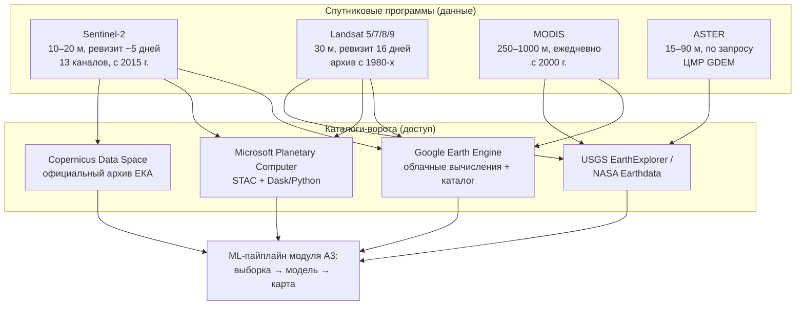

# Находим и выгружаем обучающие данные: открытые каталоги ДЗЗ для ML-мониторинга агроландшафтов

> ⏱ **Трудозатраты:** ~22 мин чтения + ~20 мин практики
> Модуль **[А3: ИИ и машинное обучение в агроэкологическом мониторинге](../index.md)**, урок 1 из 4.
> Академический уровень. Проект UNDP-KAZ FOLUR. Компоненты FOLUR: **1**, **2**, **3**.

## Цели лекции и место в модуле

Любая модель машинного обучения начинается не с кода, а с данных. В агроэкологическом мониторинге главный источник данных — открытые архивы дистанционного зондирования Земли (ДЗЗ), накопившие десятилетия наблюдений за каждым полем Северного Казахстана. Эта лекция учит ориентироваться в четырёх главных «воротах» к этим архивам и осознанно выбирать снимки под задачу машинного обучения: без правильно подобранных сцен не получится ни обучающая выборка (урок 2), ни модели (уроки 3–4).

После изучения лекции слушатель сможет:

1. **[Bloom: знать]** перечислять открытые каталоги ДЗЗ — Google Earth Engine (GEE), Microsoft Planetary Computer (MPC), Copernicus Data Space Ecosystem (CDSE), архивы USGS/NASA (Landsat, MODIS, ASTER) — и их ключевые характеристики.
2. **[Bloom: понимать]** объяснять различия уровней обработки (L1C/L2A), роль облачных масок и стандарта STAC в программном доступе к данным.
3. **[Bloom: применять]** составлять запрос к каталогу для отбора безоблачных сцен Sentinel-2 по территории и вегетационному сезону Северного Казахстана.
4. **[Bloom: анализировать]** сравнивать источники данных по разрешению, периодичности и условиям доступа и обосновывать выбор под конкретную ML-задачу.

> **Границы лекции.** Внутри: открытые каталоги ДЗЗ, их сравнение, программный доступ, отбор сцен под ML-задачу. За рамками: физика съёмки, БПЛА и наземные сенсоры — это [модуль А1](../../a1/index.md); работа с растрами в QGIS и проекции — [модуль А2](../../a2/index.md); превращение выбранных сцен в обучающую выборку — [урок 2](02-dataset-preparation.md); водные индексы и мониторинг водоёмов — [модуль А4](../../a4/index.md).

---

## 1. Зачем ML-мониторингу открытые данные

Задачи агроэкологического мониторинга, которые решает проект FOLUR в Северном Казахстане, по своей природе пространственно-временные: где расположены посевы и залежи, как меняется состояние пастбищ, где появляются очаги деградации. Отвечать на такие вопросы вручную, объезжая поля, невозможно в масштабе области — типичный район Костанайской или Северо-Казахстанской области измеряется тысячами квадратных километров. Спутниковая съёмка решает проблему масштаба: каждые несколько дней сенсоры фиксируют состояние всей территории, а машинное обучение превращает поток снимков в карты и показатели.

Ключевое слово здесь — «открытые». Программы Copernicus (Европейский союз) и Landsat (США) публикуют данные бесплатно и без ограничений на использование, включая коммерческое. Это не техническая деталь, а фундамент всей архитектуры платформы FOLUR: обучение, практикумы и будущая работа хозяйств строятся на данных, за которые никто не платит и доступ к которым не может быть внезапно отозван поставщиком. Для учебного процесса и для малого агробизнеса это принципиально: тот же самый пайплайн, который студент собирает в бесплатном Colab, фермерское хозяйство может использовать без затрат на данные. Платные сверхвысокодетальные снимки (доли метра на пиксель) существуют и полезны, но в этом модуле они появляются только в сравнительных обзорах — весь практикум построен на открытом стеке.

Связь с программой FOLUR здесь прямая. Компонент 1 (интегрированное управление ландшафтами) требует актуальных карт землепользования — их производит классификация снимков. Компонент 2 (устойчивые практики) требует мониторинга состояния посевов и пастбищ — это временные ряды вегетационных индексов. Компонент 3 (восстановление) требует выявления деградированных участков и контроля динамики восстановления — это анализ многолетних архивов. Все три задачи начинаются с одного и того же шага, которому посвящена эта лекция: найти и корректно выгрузить открытые данные по своей территории.

Для машинного обучения открытость данных означает ещё одно: воспроизводимость. Обучающая выборка, собранная из открытого архива по опубликованному скрипту, может быть в точности пересобрана любым проверяющим. Это учебная дисциплина, которая позже станет производственной: заказчик (акимат, донор, аудитор) всегда вправе спросить, откуда взялись данные, на которых обучена модель.

### 1.1 Три роли снимка в ML-задаче

Прежде чем перечислять каталоги, зафиксируем, чем именно снимок служит в ML-пайплайне. Во-первых, снимок — источник **признаков** (features): значения спектральных каналов и вычисленных индексов (NDVI, EVI) становятся входом модели. Во-вторых, снимок — основа **визуального дешифрирования** при разметке: эксперт смотрит на изображение и присваивает участку класс. В-третьих, серия снимков образует **временной ряд** — главный вход для моделей фенологической классификации культур, которыми мы займёмся в [уроке 3](03-classic-models-timeseries.md).

Эти три роли предъявляют разные требования. Для признаков важна радиометрическая корректность (атмосферная коррекция), для дешифрирования — наглядность и детальность, для временных рядов — регулярность и длина архива. Ни один источник не является лучшим сразу по всем трём осям, поэтому специалист держит в голове карту источников — её мы и строим дальше.

> **Подробнее** о физических основах съёмки, спектральных каналах и сравнении спутников с БПЛА — в [модуле А1](../../a1/index.md).

## 2. Карта открытых источников: спутники и их архивы

Начнём с самих данных, затем перейдём к каталогам-«воротам», через которые эти данные достаются.



*Рис. 1. Карта открытых источников ДЗЗ: спутниковые программы (вверху) доступны через четыре каталога-«ворот» (в середине), из которых данные попадают в ML-пайплайн модуля. Alt: блок-схема, показывающая, что Sentinel-2, Landsat, MODIS и ASTER доступны через каталоги GEE, MPC, CDSE и USGS, а из каталогов данные идут в пайплайн машинного обучения.*

### 2.1 Sentinel-2 — рабочая лошадка агромониторинга

Пара спутников Sentinel-2A/2B (программа Copernicus) снимает сушу в 13 спектральных каналах с разрешением 10 м (видимые и ближний ИК), 20 м (красный край, SWIR) и 60 м (атмосферные каналы). Совместный ревизит пары — порядка пяти дней, что в вегетационный сезон даёт достаточно шансов поймать безоблачную сцену. Архив ведётся с 2015 года. Для задач модуля Sentinel-2 — основной источник: разрешение 10 м позволяет различать поля Северного Казахстана (они, как правило, крупные — сотни гектаров), а каналы красного края полезны для оценки состояния посевов.

Важная деталь — **уровни обработки**. L1C — отражение на верхней границе атмосферы (Top-of-Atmosphere), L2A — отражение у поверхности после атмосферной коррекции (Bottom-of-Atmosphere) плюс карта классификации сцены SCL, в которой размечены облака, тени и снег. Для машинного обучения выбирайте L2A: атмосферная коррекция уменьшает разброс значений между датами, а слой SCL — готовый инструмент маскирования облаков. Обучать модель на L1C можно, но тогда атмосферные искажения станут «шумовым признаком», который модель будет вынуждена выучивать.

### 2.2 Landsat — длина архива

Программа Landsat (USGS/NASA) — самый длинный непрерывный архив съёмки Земли: миссии с 1970–80-х годов по сегодняшний день, современные аппараты Landsat 8/9 дают 30 м в мультиспектре при ревизите 16 дней (8 дней для пары). Когда задача требует ретроспективы — «что было на этом участке двадцать лет назад, была ли это пашня или залежь» — Landsat незаменим: Sentinel-2 просто не существовал до 2015 года. Для анализа многолетней динамики землепользования, восстановления залежей и деградации пастбищ в лекциях [модуля А5](../../a5/index.md) используется именно ретроспектива Landsat.

### 2.3 MODIS — ежедневная частота

Сенсор MODIS (спутники Terra и Aqua, NASA, с 2000 года) даёт грубое разрешение — 250 м для красного и ближнего ИК каналов, до 1000 м для остальных, — зато снимает всю территорию ежедневно. Готовые композитные продукты (например, 16-дневные композиты вегетационных индексов) — классический источник длинных, плотных и уже очищенных временных рядов NDVI/EVI. Когда в уроке 3 мы будем говорить о фенологических кривых культур, помните: для отдельного поля площадью в сотни гектаров пиксель MODIS 250 м часто целиком лежит внутри поля, и ряд получается чистым. Для мелких контуров MODIS уже слишком груб.

### 2.4 ASTER — рельеф и тематические задачи

Сенсор ASTER (на спутнике Terra) снимал по запросу с разрешением 15–90 м; для наших задач главное его наследие — глобальная цифровая модель рельефа ASTER GDEM, распространяемая свободно. Рельеф — полезный вспомогательный признак в классификации землепользования (уклоны влияют на распашку и эрозию) и ключевой вход гидрологических задач [модуля А4](../../a4/index.md).

### 2.5 Вегетационные индексы: NDVI и EVI как производный слой

Прежде чем двигаться к каталогам, введём производный продукт, который будет сопровождать нас весь модуль. **NDVI** (Normalized Difference Vegetation Index) — нормализованная разность отражения в ближнем инфракрасном и красном каналах: NDVI = (NIR − Red) / (NIR + Red). Здоровая зелёная растительность сильно отражает ближний ИК и поглощает красный, поэтому её NDVI высок; открытая почва и вода дают низкие или отрицательные значения. Индекс безразмерен и лежит в диапазоне от −1 до 1, что делает его удобным признаком для моделей: он частично снимает различия освещённости между датами.

**EVI** (Enhanced Vegetation Index) — усовершенствованный вариант с поправками на влияние почвы и атмосферы; он меньше «насыщается» на густой растительности, чем NDVI, и предпочтителен для плотных посевов в пик вегетации. Оба индекса вычисляются из каналов Sentinel-2 и Landsat одной строкой кода, а для MODIS распространяются как готовые композитные продукты.

Для машинного обучения индексы играют двойную роль. Во-первых, это компактные информативные признаки: вместо тринадцати каналов модель может получить два-три индекса, и для простых задач этого достаточно. Во-вторых, **сезонный ход индекса — фенологическая кривая** — является главным носителем информации о типе культуры: у яровой пшеницы, пара и залежи кривые NDVI за сезон различаются формой, даже когда отдельные снимки неразличимы. На этом свойстве целиком построен метод MiniRocket из [урока 3](03-classic-models-timeseries.md).

## 3. Четыре каталога-«ворот»: как достать данные

Данные едины, но путей к ним несколько, и выбор пути определяет архитектуру вашего пайплайна.

### 3.1 Google Earth Engine: вычисления рядом с данными

GEE — облачная платформа, в которой петабайтный каталог снимков совмещён с вычислительным кластером. Принципиальная идея: вы не скачиваете снимки, а отправляете код (JavaScript или Python API) туда, где данные лежат. Композит из сотен сцен Sentinel-2 за сезон по целой области считается на стороне Google за минуты — на ноутбуке такой расчёт потребовал бы скачать сотни гигабайт. Для некоммерческого использования и исследований доступ бесплатен (регистрация аккаунта обязательна); квоты на вычисления и экспорт существуют, и практикумы платформы спроектированы так, чтобы укладываться в бесплатные лимиты слушателя.

Для ML-задач GEE удобен на этапе подготовки данных: фильтрация коллекции по территории, датам и облачности, маскирование по SCL, расчёт индексов, медианные композиты, экспорт фрагментов. Обучение больших нейросетей внутри самой GEE не выполняется — обычный маршрут: подготовить массивы в GEE, выгрузить и обучать модель в Colab. Именно так устроен [практикум модуля](../practicum/01-lulc-three-approaches.md).

Рабочая связка «GEE + Colab» заслуживает отдельного абзаца, потому что она станет вашей основной средой на весь модуль. Google Colab — бесплатная облачная среда Jupyter-ноутбуков: Python уже установлен, библиотеки ставятся одной командой, время от времени доступен GPU. Библиотека `geemap` соединяет две системы: авторизация в GEE прямо из ноутбука, интерактивная карта для просмотра композитов, функции выгрузки фрагментов в массивы NumPy. Слушатель работает под собственным аккаунтом и в рамках собственных квот — платформа не требует никакой серверной инфраструктуры, и это осознанное архитектурное решение: собранный вами пайплайн останется работоспособным и после окончания курса.

### 3.2 Microsoft Planetary Computer: STAC и открытый Python-стек

MPC — каталог открытых геоданных Microsoft со STAC-интерфейсом (см. § 3.5) и бесплатным доступом к данным. В отличие от GEE, MPC не навязывает собственный вычислительный API: вы работаете стандартным открытым Python-стеком — `pystac-client` для поиска, `stackstac`/`rioxarray` для загрузки, `xarray` и `dask` для ленивых вычислений. Это делает код переносимым: тот же скрипт с минимальными правками работает с любым STAC-каталогом, не только с MPC. Для слушателя это страховка от привязки к вендору — одному из рисков, о которых честно говорит [рамка ИИ-инструментов платформы](../../../ai-tools.md).

### 3.3 Copernicus Data Space Ecosystem: официальный источник

CDSE — официальная точка распространения данных Copernicus (Sentinel-1/2/3/5P): браузерный поиск, OData/STAC API, процессинговые сервисы. Когда нужен гарантированно полный и свежий архив Sentinel-2 «из первых рук» — идти сюда. Регистрация бесплатна, месячные квоты на скачивание для обычного аккаунта достаточны для учебных задач. CDSE также даёт доступ к продуктам Sentinel-1 (радар) — они понадобятся в [модуле А4](../../a4/index.md) для мониторинга паводков.

### 3.4 USGS EarthExplorer и NASA Earthdata: американские архивы

EarthExplorer — портал Геологической службы США: Landsat всех поколений, декадные архивы аэрофотосъёмки, ASTER. NASA Earthdata открывает продукты MODIS и множество производных научных наборов. Оба требуют бесплатной регистрации. Программный доступ возможен (API M2M у USGS, `earthaccess` у NASA), но для наших задач Landsat и MODIS удобнее забирать через GEE или MPC, где они уже лежат в аналитически готовом виде.

### 3.5 STAC: общий язык каталогов

SpatioTemporal Asset Catalog (STAC) — открытый стандарт описания пространственно-временных данных: каждая сцена описывается JSON-документом с геометрией, датой, облачностью и ссылками на файлы-активы. Единый стандарт означает единый код поиска: научившись формировать STAC-запрос («территория — такой-то полигон, даты — май–сентябрь, облачность < 20%»), вы одинаково работаете с MPC, CDSE и десятками других каталогов. Для инженера ML-систем STAC — такой же базовый навык, как SQL для аналитика данных.

### 3.6 Вспомогательные векторные данные: OSM и data.gov.kz

ML-пайплайну нужны не только растры. Границы административных единиц, контуры полей, дороги и населённые пункты — векторные данные, которые задают область интереса, помогают в разметке и служат маской для исключения нерелевантных территорий. Два открытых источника закрывают большинство потребностей. **OpenStreetMap** — глобальная краудсорсинговая база: административные границы, гидрография, дороги; выгружается через Overpass API или готовые региональные выгрузки. **data.gov.kz** — портал открытых данных Республики Казахстан: справочники административно-территориального деления и тематические наборы государственных органов; состав и актуальность наборов различаются, поэтому перед использованием проверяйте дату обновления и полноту конкретного набора.

Практическое правило: векторные границы из любого источника перед использованием визуально сверяются с актуальным снимком. Границы района, оцифрованные несколько лет назад, могли устареть; контур поля из OSM мог быть нарисован неточно. Навыки работы с векторными данными и их приведения к общей проекции с растрами дал [модуль А2](../../a2/index.md) — здесь мы ими пользуемся как готовым инструментом.

### 3.7 Сравнительная таблица

| Критерий | GEE | MPC | CDSE | USGS/NASA |
|---|---|---|---|---|
| Модель работы | код к данным (свой API) | STAC + открытый Python-стек | официальный архив, OData/STAC | порталы + API |
| Sentinel-2 | да | да | да (первоисточник) | нет |
| Landsat / MODIS / ASTER | да / да / частично | да / да / нет | нет | да (первоисточник) |
| Вычисления на стороне сервера | да | частично (кластеры) | сервисы обработки | нет |
| Стоимость для учёбы | бесплатно (регистрация) | бесплатно | бесплатно (квоты) | бесплатно |
| Риск привязки к вендору | выше (свой API) | ниже (открытый стек) | низкий | низкий |

Практический вывод: **в этом модуле — GEE для быстрой подготовки данных, MPC/STAC как переносимая альтернатива, CDSE как первоисточник, USGS/NASA для ретроспективы**. Умение работать минимум с двумя воротами — требование к выпускнику.

## 4. Отбор сцен под ML-задачу: облачность, сезон, уровень обработки

Каталог найден — теперь надо правильно спросить. Три фильтра определяют качество будущей выборки.

**Территория и проекция.** Область интереса (AOI) задаётся полигоном — границей района, хозяйства или тестового участка. Источники границ — OpenStreetMap и открытые данные data.gov.kz; о проекциях и подготовке полигонов подробно рассказывал [модуль А2](../../a2/index.md). Помните, что Sentinel-2 распространяется тайлами по 110 км: район на стыке тайлов потребует мозаики.

**Время и фенология.** Для Северного Казахстана вегетационный сезон яровых культур укладывается примерно в май–сентябрь: сев поздней весной, пик вегетации в середине лета, уборка к осени. Классификация культур по единственному снимку ненадёжна — в отдельные даты пшеница, ячмень и залежь выглядят почти одинаково; различия проявляются в **динамике** отражения за сезон. Поэтому под задачу классификации культур отбирают серию сцен за сезон, а под задачу «пашня/не пашня» бывает достаточно двух-трёх удачных дат.

**Облачность.** Метаданные каждой сцены содержат оценку облачного покрытия; фильтр «облачность < 20–30%» — типовая отправная точка. Но общая облачность сцены не гарантирует чистоту вашего участка: облако могло встать ровно над ним. Поэтому после грубого фильтра применяют попиксельное маскирование по слою SCL (для L2A) и собирают **композит** — например, медиану по времени из всех чистых пикселей за период. Медианный композит устойчив к остаточным облакам и теням и является стандартной заготовкой для классификации землепользования.

Типовой запрос в GEE Python API выглядит так:

```python
import ee
ee.Initialize()

aoi = ee.Geometry.Polygon(coords_of_district)  # граница района из OSM/data.gov.kz

s2 = (ee.ImageCollection('COPERNICUS/S2_SR_HARMONIZED')  # L2A
      .filterBounds(aoi)
      .filterDate('2023-05-01', '2023-09-30')
      .filter(ee.Filter.lt('CLOUDY_PIXEL_PERCENTAGE', 30)))

def mask_scl(img):
    scl = img.select('SCL')
    good = scl.remap([4, 5, 6, 7], [1, 1, 1, 1], 0)  # вегетация, почва, вода, unclassified
    return img.updateMask(good)

composite = s2.map(mask_scl).median().clip(aoi)
```

Каждая строка соответствует шагу из этого раздела: границы AOI, окно дат под фенологию, грубый фильтр облачности, попиксельная маска SCL, медианный композит. В [практикуме](../practicum/01-lulc-three-approaches.md) вы выполните этот код на реальном районе СКО.

### 4.1 Планирование объёма данных и квот

Прежде чем нажимать «выполнить», полезно прикинуть объём. Один тайл Sentinel-2 L2A — порядка гигабайта; сезон из двадцати дат по району, накрываемому двумя тайлами, — уже десятки гигабайт исходных данных. Отсюда три практических следствия. Первое: **фильтруйте и обрезайте как можно раньше** — сначала пространственный и временной фильтр, затем выбор только нужных каналов, и лишь потом вычисления. Второе: **выгружайте производные, а не исходники** — медианный композит из шести каналов по району на порядки меньше полного архива сцен; для обучения моделей в Colab обычно достаточно выгрузить массивы признаков и меток, а не снимки целиком. Третье: **уважайте квоты** — бесплатные лимиты GEE и CDSE рассчитаны на разумную исследовательскую нагрузку; пайплайн, повторно скачивающий одни и те же данные в цикле, — признак плохой архитектуры, а не недостатка квот. Кэшируйте промежуточные результаты (в Colab — на подключённый Google Drive слушателя).

Эти привычки — часть инженерной культуры работы с данными, которую [модуль А1](../../a1/index.md) описывал принципами FAIR: находимость, доступность, интероперабельность, переиспользуемость. Каталоги обеспечивают первые две буквы; за последние две отвечает ваш пайплайн.

> **Подробнее** о том, как из композита и рядов NDVI собрать обучающую выборку, — в [уроке 2](02-dataset-preparation.md).

## 5. Что каталоги не решают: ответственность аналитика

Открытые каталоги сняли проблему доступа, но не сняли ответственность за смысл. Во-первых, **пространственное разрешение задаёт предел различимости**: на пикселе 10 м не видно отдельных растений и узких лесополос — для них нужен БПЛА ([модуль А1](../../a1/index.md)). Во-вторых, **автоматические маски облаков ошибаются**: SCL иногда путает яркую почву со облаком и пропускает полупрозрачную дымку — выборочная визуальная проверка сцен обязательна. В-третьих, **архивы неоднородны**: сенсоры Landsat разных поколений отличаются, и «сшивая» ряд из разных миссий, нужно учитывать различия калибровки. Наконец, любые готовые продукты (композиты, карты покрытия) созданы под чужие задачи и требуют валидации на вашей территории — эта мысль станет центральной в уроке 2 при разговоре о разметке.

Здесь впервые встречается главный инвариант платформы: **ИИ и автоматика ускоряют, человек верифицирует**. Автоматический фильтр отбирает сцены за секунды, но подтверждает их пригодность аналитик — глазами, по контрольным участкам.

Соберём ответственность аналитика в контрольный список, который стоит проходить перед каждой выгрузкой данных под ML-задачу:

- **Задача → разрешение.** Минимальный различимый объект задачи (поле? лесополоса? отдельное растение?) сопоставлен с размером пикселя выбранного источника.
- **Задача → архив.** Требуемая глубина ретроспективы сопоставлена с началом архива (Sentinel-2 — 2015, MODIS — 2000, Landsat — 1980-е).
- **Уровень обработки.** Для признаков модели выбран атмосферно скорректированный уровень (L2A и аналоги).
- **Маскирование.** Применена попиксельная маска облаков; выборочно проверены глазами 3–5 сцен из разных месяцев.
- **Композит или ряд.** Продукт (одиночный композит / помесячная серия / плотный ряд индексов) соответствует тому, что реально различает классы задачи.
- **Воспроизводимость.** Запрос сохранён как код с зафиксированными датами, фильтрами и версией коллекции — коллега может пересобрать те же данные.

Список короткий, но каждая его строка — это реальный класс ошибок, с которыми сталкиваются производственные проекты мониторинга. В [уроке 2](02-dataset-preparation.md) к нему добавится вторая половина — контроль качества меток и разбиения выборки.

---

## Региональный кейс

**Ситуация:** Агроконсультационная служба готовит для акимата одного из районов Северо-Казахстанской области основу под карту землепользования сезона 2023 года. Нужен безоблачный композит Sentinel-2 за вегетационный сезон и оценка того, сколько пригодных сцен вообще было над районом — от этого зависит, удастся ли строить классификацию по временному ряду или придётся ограничиться одним композитом.

**Данные:** коллекция `COPERNICUS/S2_SR_HARMONIZED` (Sentinel-2 L2A) в Google Earth Engine; граница района — из OpenStreetMap (`geoBoundaries`/OSM administrative boundaries); период 1 мая — 30 сентября 2023 г.

**Задача:**

1. Составьте (на бумаге или в Colab) цепочку фильтров GEE: территория → даты → облачность < 30%. Сколько сцен возвращает фильтр? (`collection.size()`)
2. Постройте помесячную статистику: в каком месяце чистых сцен меньше всего? Что это означает для классификации культур по фенологии?
3. Сравните два варианта продукта для акимата: медианный композит за весь сезон и серия помесячных композитов. Какой из них годится для карты «пашня/пастбище/залежь», а какой — для различения культур?

**Разбор:** Ключевой ход — отделить *количество сцен* от *количества чистых наблюдений на пиксель*: даже при десятках сцен конкретное поле может иметь мало безоблачных дат, поэтому правильная метрика — попиксельный счётчик чистых наблюдений (`count()` после маски SCL). Для карты укрупнённых классов достаточно одного сезонного медианного композита; для различения культур нужны помесячные композиты или ряд NDVI, потому что классы различаются динамикой, а не единственным значением.

Второй важный вывод касается коммуникации с заказчиком: отчёт для акимата должен явно фиксировать, из каких дат собран композит и какова была доступность чистых наблюдений по месяцам, — иначе карта, построенная на «дырявом» июне, будет воспринята как равнонадёжная на всей территории. Честная карта покрытия наблюдениями — такой же продукт анализа, как и сама карта землепользования. Конкретные числа сцен слушатель получает сам при выполнении — лекция намеренно не приводит «готовых ответов», их не существует до запроса.

> Этот кейс продолжается в [практикуме](../practicum/01-lulc-three-approaches.md): там композит и ряды NDVI строятся полностью и становятся входом трёх моделей.

---

## Закрепление и применение

!!! example "Попробуйте в Colab"
    Откройте ноутбук урока (`<URL будет назначен при создании репозитория ноутбуков>`), авторизуйтесь в GEE и выполните запрос из § 4 для своего района: посчитайте число сцен за сезон и постройте медианный композит. Затем повторите тот же поиск через STAC-запрос к Microsoft Planetary Computer и сравните списки сцен — они должны совпадать с точностью до задержек публикации.

!!! warning "Границы применимости"
    Открытые данные 10–30 м не решают задач уровня отдельных растений (сорняки, всходы) — это зона БПЛА из модуля А1. Оценка облачности в метаданных — грубая; без попиксельной маски и визуальной проверки композит может содержать артефакты. Бесплатные квоты GEE/CDSE рассчитаны на исследование и учёбу; промышленный конвейер потребует планирования нагрузки.

!!! tip "Что это даёт вашему хозяйству"
    Умение самостоятельно достать безоблачный композит по своим полям — это отказ от «слепой» зависимости от готовых сервисов: вы видите те же данные, что и любая платная платформа NDVI-мониторинга, и можете проверять её выводы. Профессиональная версия этого навыка без программирования — [модуль П3](../../p3/index.md).

!!! question "Кейс для размышления"
    Хозяйству нужно понять, когда сосед распахал прилегающую залежь — событие произошло между 2016 и 2020 годом. Какой источник данных вы выберете и почему: Sentinel-2 (с 2015, 10 м), Landsat (с 1980-х, 30 м) или MODIS (с 2000, 250 м)? Что если событие произошло между 2005 и 2010 годом?

### Проверь себя

```quiz
[
  {
    "q": "Почему для обучающей выборки ML рекомендуется уровень обработки Sentinel-2 L2A, а не L1C?",
    "options": [
      "L2A прошёл атмосферную коррекцию и содержит слой SCL для маскирования облаков",
      "L2A имеет более высокое пространственное разрешение, чем L1C",
      "L1C распространяется платно, а L2A — бесплатно",
      "L2A обновляется чаще, чем L1C"
    ],
    "answer": 0,
    "explain": "§ 2.1: L2A — отражение у поверхности после атмосферной коррекции плюс карта классификации сцены SCL; разрешение и условия распространения у уровней одинаковые."
  },
  {
    "q": "Чем принципиально отличается модель работы Google Earth Engine от классического скачивания снимков?",
    "options": [
      "Код отправляется к данным: вычисления выполняются в облаке рядом с архивом, скачивается только результат",
      "GEE даёт снимки более высокого разрешения, чем официальные архивы",
      "GEE — единственный каталог, где есть Sentinel-2",
      "GEE автоматически обучает модели классификации без участия пользователя"
    ],
    "answer": 0,
    "explain": "§ 3.1: идея GEE — «код к данным»; каталог совмещён с вычислительным кластером, композит по области считается без скачивания сотен гигабайт. Sentinel-2 доступен и в MPC, и в CDSE (§ 3.6)."
  },
  {
    "q": "Для ретроспективного вопроса «была ли эта земля пашней в 1995 году» подходит только один источник. Какой и почему?",
    "options": [
      "Landsat — его непрерывный архив тянется с 1970–80-х годов",
      "Sentinel-2 — у него лучшее разрешение (10 м)",
      "MODIS — он снимает ежедневно",
      "ASTER GDEM — он покрывает весь мир"
    ],
    "answer": 0,
    "explain": "§ 2.2: Sentinel-2 существует лишь с 2015 г., MODIS — с 2000 г., ASTER GDEM — модель рельефа, а не архив состояния полей. Ретроспектива 1990-х — только Landsat."
  },
  {
    "q": "Фильтр «облачность сцены < 30%» пропустил сцену, где облако стоит ровно над вашим полем. Какой шаг пайплайна страхует от этого?",
    "options": [
      "Попиксельное маскирование по слою SCL и медианный композит по времени",
      "Ужесточение фильтра до «облачность < 5%»",
      "Переход с L2A на L1C",
      "Уменьшение области интереса до границ одного поля"
    ],
    "answer": 0,
    "explain": "§ 4: облачность в метаданных — характеристика всей сцены; чистоту конкретного пикселя обеспечивают маска SCL и композит из всех чистых наблюдений. Ужесточение фильтра лишь сокращает выборку, не гарантируя чистоты участка."
  },
  {
    "q": "Зачем инженеру ML-систем стандарт STAC, если есть удобный API Google Earth Engine?",
    "options": [
      "STAC — открытый стандарт, единый для многих каталогов: код поиска переносим и не привязан к одному вендору",
      "STAC работает быстрее любого проприетарного API",
      "Через STAC данные доступны без регистрации",
      "STAC автоматически исправляет ошибки облачных масок"
    ],
    "answer": 0,
    "explain": "§ 3.5 и § 3.6: STAC-запрос одинаково работает с MPC, CDSE и другими каталогами — это страховка от привязки к вендору; скорость и качество масок стандарт не регулирует."
  }
]
```

### Контрольные вопросы

1. Перечислите четыре каталога-«ворот» к открытым данным ДЗЗ и по одной сильной стороне каждого. *(Bloom: знать)*
2. Объясните, почему медианный композит устойчив к остаточной облачности. *(Bloom: понимать)*
3. Составьте план отбора сцен для классификации культур в вашем районе Акмолинской области: источник, период, фильтры, продукт. *(Bloom: применять)*

## Что дальше?

В [уроке 2 «Готовим датасет без утечек»](02-dataset-preparation.md) отобранные сцены превратятся в обучающую выборку: вы узнаете, откуда берутся метки классов, зачем нужна аугментация и почему случайное перемешивание пикселей перед разбиением train/test — самая дорогая ошибка геопространственного ML. Связанные материалы: [политика датасетов платформы](../../../datasets.md), [модуль А2 — растры и проекции](../../a2/index.md), [модуль П3 — те же данные без кода](../../p3/index.md).
