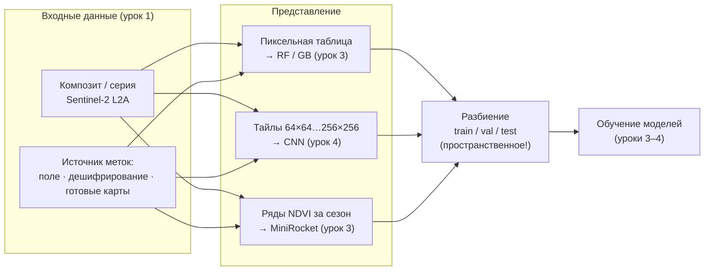

# Готовим датасет без утечек: от снимка Sentinel-2 к обучающей выборке

> ⏱ **Трудозатраты:** ~23 мин чтения + ~25 мин практики
> Модуль **[А3: ИИ и машинное обучение в агроэкологическом мониторинге](../index.md)**, урок 2 из 4.
> Академический уровень. Проект UNDP-KAZ FOLUR. Компоненты FOLUR: **1**, **2**, **3**.

## Цели лекции и место в модуле

Качество модели машинного обучения ограничено сверху качеством обучающей выборки — этот принцип не имеет исключений. В [уроке 1](01-open-data-catalogs.md) мы научились доставать снимки из открытых каталогов; теперь предстоит превратить их в датасет: выбрать представление данных, добыть метки классов, нарезать тайлы, при необходимости расширить выборку аугментацией и — самое ответственное — правильно разбить её на обучающую, валидационную и тестовую части. Именно на последнем шаге совершается самая дорогая ошибка геопространственного ML — пространственная утечка данных, из-за которой модель выглядит блестяще на бумаге и проваливается на реальной территории.

После изучения лекции слушатель сможет:

1. **[Bloom: знать]** перечислять три представления ДЗЗ-данных для ML (пиксельная таблица, тайлы, временные ряды), источники меток и основные фреймворки открытого стека (scikit-learn, PyTorch, TensorFlow, Hugging Face).
2. **[Bloom: понимать]** объяснять механизм пространственной утечки данных и её влияние на оценку качества модели.
3. **[Bloom: применять]** собирать обучающую выборку по композиту Sentinel-2 с метками из открытых карт покрытия и корректным пространственным разбиением.
4. **[Bloom: анализировать]** оценивать качество меток и схему разбиения чужого (в том числе сгенерированного ИИ) пайплайна и находить в них дефекты.

> **Границы лекции.** Внутри: представления данных, разметка, аугментация, разбиение, обзор фреймворков. За рамками: сами алгоритмы — Random Forest и MiniRocket в [уроке 3](03-classic-models-timeseries.md), CNN в [уроке 4](04-cnn-and-architecture-choice.md); поиск и выгрузка снимков — [урок 1](01-open-data-catalogs.md); полевые методы сбора наземных данных — [модуль А1](../../a1/index.md).

---

## 1. Анатомия обучающей выборки: три представления данных

Формально обучающая выборка — это множество пар «объект → метка»: модель учится предсказывать метку по признакам объекта. В дистанционном зондировании «объектом» могут быть три принципиально разные сущности, и выбор между ними — первое проектное решение любой задачи.

**Пиксельная таблица.** Объект — отдельный пиксель; признаки — значения спектральных каналов и индексов в этом пикселе (возможно, за несколько дат); метка — класс землепользования. Получается обычная таблица «строки × столбцы», с которой работают классические алгоритмы вроде Random Forest. Достоинства: простота, скромные требования к объёму данных, интерпретируемость признаков. Ограничение: модель не видит пространственный контекст — пиксель посреди поля и пиксель у кромки лесополосы для неё различаются только спектром.

**Тайлы (патчи).** Объект — квадратный фрагмент снимка, например 64×64 или 256×256 пикселей; метка — либо класс всего фрагмента (классификация, архитектуры типа ResNet), либо попиксельная маска классов (сегментация, архитектуры типа U-Net). Тайлы сохраняют пространственный контекст — текстуру, форму границ, соседства объектов — и являются родным форматом свёрточных нейросетей. Плата: нужен большой размеченный набор и вычислительные ресурсы.

**Временные ряды.** Объект — последовательность значений (чаще всего NDVI/EVI) для одной точки или одного поля за сезон или несколько лет; метка — культура или тип использования. Это представление напрямую кодирует фенологию — то самое свойство, которое различает яровую пшеницу, пар и залежь, неотличимые на единственном снимке. С рядами работают специализированные методы, в нашем модуле — MiniRocket.



*Рис. 1. Путь от снимка к обучающей выборке: композит и метки соединяются в одном из трёх представлений (таблица, тайлы, ряды), после чего выборка проходит пространственное разбиение. Alt: блок-схема подготовки датасета — входные снимки и метки преобразуются в пиксельные таблицы, тайлы или временные ряды, затем разбиваются на train/val/test и передаются моделям.*

Обратите внимание: все три представления собираются из **одних и тех же** исходных сцен. В [практикуме](../practicum/01-lulc-three-approaches.md) вы построите все три из одного композита и одной серии NDVI — это и позволит честно сравнить три подхода на общем материале.

### 1.1 Сколько данных нужно?

Универсального числа не существует, но есть устойчивые ориентиры, связанные с ёмкостью моделей. Классическим алгоритмам на пиксельной таблице (Random Forest) для укрупнённых классов часто достаточно сотен–тысяч примеров на класс — при условии, что примеры репрезентативны, то есть охватывают разнообразие класса по почвам, влажности и стадиям вегетации. Методам временных рядов нужны сотни размеченных рядов на класс. Свёрточные сети прожорливее всех: обучение с нуля осмысленно от тысяч тайлов, и именно поэтому в глубоких подходах так ценятся аугментация (§ 3.2) и дообучение предобученных моделей (§ 5).

Важнее абсолютного размера — покрытие изменчивости. Тысяча пикселей из одного поля несёт меньше информации, чем сто пикселей из ста разных полей: первые почти дубликаты. Планируя разметку, распределяйте усилия по территории и по градиентам условий (север–юг района, разные почвенные разности, разные хозяйства), а не концентрируйте их там, где размечать удобно. Этот принцип называют репрезентативностью выборки, и его нарушение не лечится алгоритмами.

> **Подробнее** о том, какой алгоритм соответствует какому представлению, — в [уроке 3](03-classic-models-timeseries.md) и [уроке 4](04-cnn-and-architecture-choice.md).

## 2. Откуда берутся метки: три источника и их честность

Метки — самая дорогая часть датасета: снимки бесплатны и бесконечны, а знание «что на самом деле растёт на этом поле» стоит времени и экспертизы. Три источника меток образуют лестницу «дороже и точнее ↔ дешевле и шумнее».

### 2.1 Полевые данные — золотой стандарт

Наземные обследования — GPS-точки с зафиксированным классом, журналы севооборотов хозяйств, акты обследования угодий — дают самые надёжные метки. Требования к полевому сбору данных (координаты, время, условия — обязательные атрибуты каждого замера) подробно разобраны в [модуле А1](../../a1/index.md) и профессиональном [модуле П1](../../p1/index.md). Ограничение очевидно: полевые данные покрывают точки, а не территории, их сбор медленный и дорогой. В учебном практикуме мы полевых данных не имеем — и честно это фиксируем.

Отдельно подчеркнём ценность данных самих хозяйств: журнал севооборота — это готовые метки культур на уровне целых полей за много лет, то есть именно то, чего не даёт ни одна глобальная карта. Партнёрство «хозяйство даёт историю полей — аналитик даёт модель» — типовая схема региональных проектов агромониторинга, и слушатели профессиональных модулей часто приходят именно с такими данными. Юридическая и этическая сторона передачи таких данных (кому принадлежат, как обезличивать) обсуждалась в [модуле А1](../../a1/index.md).

### 2.2 Визуальное дешифрирование — экспертная разметка по снимку

Эксперт смотрит на снимок (и вспомогательные слои — многолетние композиты, рельеф) и вручную обводит эталонные участки классов. Это стандартная практика создания обучающих полигонов: аналитик с региональным опытом уверенно отличает пашню от пастбища и водоёма по текстуре, цвету и контексту. Качество зависит от квалификации и дисциплины: эталоны должны быть *чистыми* (внутри полигона — только один класс), *репрезентативными* (охватывать разнообразие класса — разные почвы, стадии вегетации) и *задокументированными* (кто, когда, по какому снимку размечал). Разметка по снимку одной даты рискованна для «динамических» классов: залежь в июне легко спутать с пастбищем — эксперт обязан смотреть сезонную серию.

### 2.3 Готовые карты покрытия — быстро, но с оговорками

Глобальные карты землепользования — **ESA WorldCover** (10 м, классы «пашня», «травянистая растительность», «вода» и др.) и аналогичные открытые продукты — позволяют получить тысячи меток за минуты: пересекаем карту с нашим композитом и читаем класс каждого пикселя. Это легальный и распространённый приём бутстрапа выборки, но у него три подводных камня, каждый из которых обязан быть проговорён в отчёте.

Во-первых, **чужие ошибки становятся вашими**: глобальная карта сама построена моделью и содержит ошибки классификации, которые ваша модель выучит как «истину». Во-вторых, **несовпадение года**: карта фиксированного года не отражает последующие изменения — распаханную залежь или заброшенное поле. В-третьих, **несовпадение легенды**: классы глобальной карты («cropland») не совпадают с нужными вам («яровая пшеница» / «пар» / «залежь») — глобальная карта в принципе не может дать метки культур. Отсюда рабочее правило модуля: готовые карты — источник **черновых** меток укрупнённых классов, которые обязательно проходят выборочную визуальную верификацию, а для тонких классов (культуры) метки добываются дешифрированием сезонной динамики или полевыми данными.

Минимальный протокол документирования разметки, принятый в модуле, укладывается в короткую таблицу, сопровождающую каждый набор эталонов:

| Поле протокола | Что фиксируем |
|---|---|
| Источник метки | поле / дешифрирование / готовая карта (какая, какого года) |
| Опорные материалы | композит (даты), серия NDVI, рельеф |
| Автор и дата | кто размечал, когда |
| Правила класса | письменное определение каждого класса легенды |
| Верификация | доля проверенных меток, процент расхождений |

Пять строк дисциплины превращают «набор полигонов на диске» в научный артефакт: коллега (или вы через полгода) сможет понять, чему верить. Требование задокументированной легенды — самое недооценённое: половина споров «модель ошиблась» на поверку оказывается спором о том, что считать залежью.

### 2.4 Шум в метках и что с ним делать

Даже аккуратная разметка содержит шум: смешанные пиксели на границах полей, устаревшие контуры, человеческие ошибки. Практические приёмы снижения вреда: буферный отступ от границ полигонов (не брать краевые пиксели), контроль согласованности (пиксели одного полигона со «странным» спектром — кандидаты на исключение), перекрёстная разметка спорных участков двумя экспертами. И главное — **оценка качества модели должна выполняться на самых чистых метках, какие есть**: допустимо обучаться на шумных метках из готовой карты, но тестовый набор стоит верифицировать вручную, иначе вы измеряете согласие двух моделей, а не качество вашей.

Полезно понимать и асимметрию последствий: умеренный случайный шум в обучающих метках модели переносят сравнительно стойко — ансамбли деревьев и нейросети усредняют случайные ошибки. Опасен шум *систематический*: если все залежи в выборке помечены как пастбища, никакой алгоритм не восстановит несуществующий класс, а метрики даже не просигналят о проблеме, потому что тест унаследовал ту же ошибку. Отсюда порядок приоритетов при ограниченном времени: сначала — чистота легенды и теста, затем — объём обучающей выборки, и лишь потом — тонкая настройка моделей.

## 3. Извлечение тайлов и аугментация

### 3.1 Нарезка тайлов

Для CNN снимок нарезается на тайлы фиксированного размера. Технически это скользящее окно по растру: шаг равен размеру тайла (без перекрытия) или меньше его (с перекрытием — больше примеров, но соседние тайлы сильно коррелированы, что важно учесть при разбиении, см. § 4). Каждому тайлу сопоставляется метка: класс центрального пикселя, преобладающий класс, или полная маска для сегментации. Практические мелочи, экономящие часы отладки: тайлы с большой долей замаскированных (облачных) пикселей отбрасываются; значения каналов приводятся к плавающему типу и разумному диапазону; геопривязка каждого тайла сохраняется в метаданных — без неё вы не сможете ни собрать карту из предсказаний, ни выполнить пространственное разбиение.

Выбор размера тайла — компромисс между контекстом и статистикой. Крупный тайл (256×256 при 10 м — это 2,56 км стороны) даёт сети богатый контекст: видны целые поля с границами и соседствами, но таких тайлов из района получится немного, а метка «один класс на тайл» становится сомнительной — внутри почти наверняка несколько классов. Мелкий тайл (32×32, 320 м) даёт тысячи примеров с чистыми метками, но лишает сеть дальнего контекста. Для сегментации (U-Net) проблема мягче — метка попиксельная, и размер тайла выбирается из соображений памяти GPU; для классификации целых тайлов (ResNet) чистота метки критична, и размер подбирают под характерный размер объектов ландшафта. В зерновом поясе Северного Казахстана с его крупными массивами разумно начинать с 64×64 и корректировать по результатам анализа ошибок ([урок 4](04-cnn-and-architecture-choice.md)).

### 3.2 Аугментация: расширяем выборку без новых данных

Аугментация — порождение новых обучающих примеров преобразованием существующих. Для снимков естественны геометрические преобразования: повороты на 90°/180°/270°, отражения — спутниковый снимок не имеет «верха», поэтому повёрнутое поле остаётся полем. Осторожнее с радиометрией: лёгкое варьирование яркости имитирует различия освещённости, но агрессивные цветовые искажения могут разрушить спектральную информацию, на которой держится различение классов — в отличие от обычных фотографий, в ДЗЗ точные значения каналов несут физический смысл.

Два правила без исключений. Первое: **аугментация применяется только к обучающей части** — валидационные и тестовые данные остаются нетронутыми, иначе оценка качества искажается. Второе: аугментация не лечит систематические пробелы выборки — если в ней нет ни одного примера солончака, никакие повороты его не породят; лечится это только сбором данных. Для временных рядов и пиксельных таблиц аугментация используется реже; типовой приём для рядов — небольшие сдвиги по времени, имитирующие межгодовые сдвиги фенологии.

### 3.3 Дисбаланс классов

В реальных агроландшафтах Северного Казахстана классы радикально не равны по площади: пашня занимает огромные массивы, а, скажем, водные объекты или лесополосы — проценты территории. Модель, обученная на несбалансированной выборке «как есть», научится игнорировать редкие классы — и при этом покажет высокую *общую* точность (об этой ловушке метрик — [урок 4](04-cnn-and-architecture-choice.md)). Стандартные меры: стратифицированный отбор (фиксированное число примеров каждого класса), взвешивание классов в функции потерь, передискретизация редких классов. Что выбрать — зависит от алгоритма и задачи; важно одно: решение о балансировке принимается осознанно и документируется.

## 4. Разбиение выборки: где живёт утечка данных

### 4.1 Зачем три части

Стандартная схема: **train** — на этих данных модель учится; **validation** — на них подбираются гиперпараметры и принимаются решения «какая архитектура лучше»; **test** — неприкосновенный набор, к которому обращаются один раз, для финальной оценки. Смешение ролей обесценивает оценку: если тест участвовал в выборе модели, он уже не независим, и настоящее качество на новых данных окажется ниже измеренного.

Когда данных мало, вместо фиксированного валидационного набора применяют **кросс-валидацию**: выборка делится на K блоков, модель обучается K раз, каждый раз откладывая один блок на проверку, а оценкой служит среднее по K прогонам. Кросс-валидация использует данные экономнее и даёт представление о разбросе оценки, но правило пространственности распространяется и на неё: блоки должны формироваться из территориальных групп, а не из случайных пикселей — иначе K честных на вид прогонов дадут K одинаково завышенных оценок. Тестовый набор при этом всё равно остаётся отдельным и неприкосновенным: кросс-валидация — инструмент выбора модели, а не финального вердикта.

### 4.2 Пространственная автокорреляция — почему случайное разбиение лжёт

Первый закон географии Тоблера: близкие объекты похожи сильнее далёких. Соседние пиксели одного поля почти идентичны — тот же сорт, та же почва, та же дата съёмки. Теперь проследите, что делает **случайное** разбиение пиксельной таблицы: соседние, практически одинаковые пиксели одного поля разлетаются — один в train, другой в test. Модель «узнаёт» на тесте примеры, неотличимые от обучающих, и оценка качества взлетает. Это и есть **пространственная утечка данных** (spatial leakage): информация из теста просочилась в обучение через пространственную корреляцию. Модель при этом не стала лучше — лучше стала только цифра в отчёте. На новом районе, где нет «близнецов» из обучающей выборки, качество упадёт — иногда драматически. Величину падения вы измерите сами в [практикуме](../practicum/01-lulc-three-approaches.md) и в [ИИ-задании](../ai-assistant.md); лекция сознательно не называет числа — оно зависит от данных.

Лекарство — **пространственное разбиение**: делим не пиксели, а *территории*. Варианты: разбиение по полигонам разметки (все пиксели одного полигона — целиком в одной части), по полям, по квадратам регулярной сетки, по географическим блокам («запад района — обучение, восток — тест»). В scikit-learn для этого есть групповые схемы (`GroupKFold`, `GroupShuffleSplit`), где группа — идентификатор поля/полигона/ячейки сетки. Для тайлов с перекрытием группировка обязательна вдвойне: перекрывающиеся тайлы — почти дубликаты.

### 4.3 Другие маршруты утечки

Пространство — не единственный канал. **Утечка через предобработку**: параметры нормализации (среднее, дисперсия), вычисленные по *всей* выборке до разбиения, несут информацию о тесте; правильно — вычислять статистики только по train и применять к остальным частям (в scikit-learn это автоматизирует `Pipeline`). **Временная утечка**: если задача — прогноз, обучение на данных «из будущего» относительно теста обессмысливает оценку. **Утечка через метку**: признак, производный от целевой переменной (например, класс из той же готовой карты, из которой взяты метки, поданный как входной признак), даёт модели ответ в условии задачи. **Утечка через дубликаты**: одна и та же территория, попавшая в выборку дважды через разные сцены.

Эти маршруты — не экзотика, а типовые дефекты реальных пайплайнов, в том числе сгенерированных ИИ-агентами: код с `train_test_split(X, y, random_state=42)` на пиксельной таблице выглядит образцово и при этом протекает. Поиск таких дефектов в сгенерированном коде — ваше [ИИ-задание модуля](../ai-assistant.md).

### 4.4 Как проверить чужой пайплайн на утечки

Умение находить утечки в чужом коде — отдельный профессиональный навык, и он тренируется системно, а не интуицией. Порядок досмотра, который мы будем применять в [ИИ-задании](../ai-assistant.md):

1. **Найдите строку разбиения.** Какая функция делит данные? Есть ли в ней параметр групп (`groups=`)? Если это простой `train_test_split` на пиксельных данных — почти наверняка утечка.
2. **Проследите происхождение каждого признака.** Не участвует ли в признаках источник, из которого взяты метки? Нет ли признаков «из будущего»?
3. **Найдите предобработку.** Где вычисляются статистики нормализации — до или после разбиения? Обёрнуто ли всё в `Pipeline`?
4. **Проверьте аугментацию.** Применяется ли она к val/test?
5. **Проверьте использование теста.** Сколько раз код обращается к тестовому набору? Больше одного финального раза — красный флаг.
6. **Сверьте единицы.** Совпадает ли единица разбиения (пиксель? тайл? поле?) с единицей пространственной корреляции данных?

Полезный эмпирический тест, дополняющий чтение кода: обучите модель дважды — со случайным и с пространственным разбиением. Большой разрыв метрик между ними — количественная подпись утечки; сам по себе он не говорит, какая схема «правильная», но показывает, насколько оптимистична случайная оценка.

### 4.5 Чек-лист честного разбиения

- Единица разбиения — территория (полигон/поле/ячейка), не пиксель и не тайл.
- Статистики предобработки вычислены только по train (Pipeline).
- Аугментация — только в train.
- Тест заморожен до финальной оценки; решения принимаются по validation.
- Дубликаты и перекрывающиеся тайлы не пересекают границу частей.
- Разбиение зафиксировано (сохранены индексы/сиды) — результат воспроизводим.

## 5. Инструменты: открытый стек фреймворков

Собранный датасет попадает в один из фреймворков. Все инструменты модуля бесплатны и с открытым кодом.

**scikit-learn** — стандарт классического ML в Python: Random Forest, градиентный бустинг, метрики, кросс-валидация, `Pipeline` и групповые разбиения. Для пиксельных таблиц — инструмент первого выбора; работает на CPU, то есть в любом бесплатном Colab.

**PyTorch** — основной фреймворк глубокого обучения в исследовательском сообществе; на нём мы соберём CNN в [уроке 4](04-cnn-and-architecture-choice.md). Гибкий, с огромной экосистемой; обучение свёрточных сетей комфортно при доступе к GPU (бесплатный уровень Colab периодически его предоставляет).

**TensorFlow/Keras** — второй большой фреймворк глубокого обучения, исторически сильный в промышленном развёртывании; в модуле упоминается для полноты — задания выполнимы на PyTorch, но конспекты Keras легко переносимы.

**Hugging Face** — экосистема обмена предобученными моделями и датасетами. Для ДЗЗ ценна возможность взять предобученную модель (в том числе геопространственные foundation-модели, публикуемые открыто) и дообучить на своей задаче — это снижает потребность в размеченных данных. В модуле — обзорно; практикум обходится компактными моделями, обучаемыми с нуля.

**sktime / специализированные библиотеки временных рядов** — реализация MiniRocket и других методов классификации рядов; понадобится в [уроке 3](03-classic-models-timeseries.md).

Выбор фреймворка определяется представлением данных: таблица → scikit-learn, ряды → sktime, тайлы → PyTorch. Это соответствие — не догма, а разумное значение по умолчанию, экономящее время.

### 5.1 Воспроизводимость как инженерное требование

Датасет и эксперимент должны быть воспроизводимы — это не академическая роскошь, а условие доверия к результату (вспомните урок 1: заказчик вправе спросить, откуда данные; теперь добавьте — и как получена оценка качества). Минимальный набор мер: фиксируйте случайные сиды всех генераторов (NumPy, фреймворка, разбиения); сохраняйте версии библиотек (`pip freeze` в артефакты эксперимента); храните индексы разбиения, а не только его параметры; версионируйте сам датасет — хотя бы датой сборки и хешем скрипта. В ноутбуках практикума эти привычки встроены в шаблон: первая ячейка фиксирует окружение, последняя — сохраняет манифест эксперимента. Когда в [уроке 4](04-cnn-and-architecture-choice.md) вы будете сравнивать три подхода, именно эта дисциплина позволит утверждать, что сравнение честное: одни данные, одно разбиение, одни метрики.

---

## Региональный кейс

**Ситуация:** Группа студентов готовит обучающую выборку для классификации землепользования одного из районов Костанайской области — региона зернового пояса, где преобладают крупные массивы пашни, перемежающиеся пастбищами, залежами и лесополосами. Полевых данных нет; решено бутстрапировать метки укрупнённых классов из открытой карты ESA WorldCover и верифицировать их по композиту Sentinel-2.

**Данные:** ESA WorldCover 10 м (открытый продукт, доступен в GEE и на сайте ESA); медианный композит Sentinel-2 L2A за май–сентябрь по району (построен по методике [урока 1](01-open-data-catalogs.md)); сетка квадратов 5×5 км для пространственного разбиения.

**Задача:**

1. Составьте протокол выборочной верификации меток: сколько случайных точек каждого класса проверить визуально по композиту, как фиксировать расхождения.
2. Класс WorldCover «cropland» объединяет действующую пашню и часть молодых залежей. Предложите способ отделить залежь, используя сезонную динамику NDVI (материал § 2.2–2.3).
3. Спроектируйте разбиение train/val/test по сетке 5×5 км. Почему ячейка сетки, а не пиксель, — правильная единица разбиения в этом ландшафте?

**Разбор:** Протокол верификации должен быть стратифицированным (фиксированное число точек на класс, а не пропорционально площади — иначе редкие классы останутся непроверенными) и слепым (проверяющий не видит метку до вынесения своего суждения). Отделение залежи от пашни строится на фенологии: у обрабатываемой пашни сезонный ход NDVI имеет характерный цикл «сев → пик → уборка» с резкими перепадами, у залежи кривая более плавная и близка к пастбищной; следовательно, в выборку нужно добавить признаки сезонной динамики, а не только композит одной даты. Пространственная единица разбиения нужна потому, что поля в зерновом поясе огромны: пиксели одного массива почти идентичны, и случайное разбиение по пикселям создаст утечку (§ 4.2). Ячейка 5×5 км гарантирует, что целые массивы с окружением уходят в одну часть выборки. Числовых «правильных ответов» здесь нет — результат верификации студенты получают и документируют сами.

> Этот кейс — прямая заготовка [практикума](../practicum/01-lulc-three-approaches.md), где выборка собирается кодом, и [ИИ-задания](../ai-assistant.md), где аналогичный пайплайн генерирует кодинг-агент, а вы его проверяете.

---

## Закрепление и применение

!!! example "Попробуйте в Colab"
    В ноутбуке урока (`<URL будет назначен при создании репозитория ноутбуков>`) соберите мини-выборку: 500 пикселей из композита Sentinel-2 с метками WorldCover, разбейте её дважды — случайно и по сетке 5×5 км — и обучите один и тот же Random Forest. Сравните точность на двух тестах. Разница, которую вы увидите, — цена пространственной утечки, измеренная вашими руками.

!!! warning "Границы применимости"
    Метки из глобальных карт пригодны только для укрупнённых классов и только после выборочной верификации; классы культур они не дают в принципе. Аугментация не компенсирует отсутствующие в выборке классы и ландшафты. Пространственное разбиение по сетке — стандартное, но не единственное решение: при сильных градиентах ландшафта (север–юг области) осмысленно блочное разбиение вдоль градиента.

!!! tip "Что это даёт вашему хозяйству"
    Понимание «откуда метки и как разбита выборка» — главный вопрос, который стоит задать любому поставщику ИИ-сервиса агромониторинга. Сервис, обученный и проверенный на «соседних пикселях», покажет красивые проценты в презентации и ошибётся на ваших полях. Умение задать этот вопрос — уже защита от некачественного продукта; версия для практиков — в [модуле П3](../../p3/index.md).

!!! question "Кейс для размышления"
    Коллега предлагает: «Добавим в признаки классификации культур слой WorldCover — он же коррелирует с ответом!» Метки вашей выборки взяты из того же WorldCover. Найдите все дефекты этого предложения, пользуясь § 2.3 и § 4.3.

### Проверь себя

```quiz
[
  {
    "q": "Пиксельная таблица, тайлы и временные ряды — три представления ДЗЗ-данных. Какое из них напрямую кодирует фенологию культуры?",
    "options": [
      "Временные ряды NDVI/EVI за сезон",
      "Пиксельная таблица по композиту одной даты",
      "Тайлы 256×256 с одного снимка",
      "Все три представления кодируют фенологию одинаково"
    ],
    "answer": 0,
    "explain": "§ 1: ряд значений индекса за сезон описывает динамику развития растительности — фенологическую кривую; композит и одиночные тайлы фиксируют лишь момент или медиану сезона."
  },
  {
    "q": "Почему метки из глобальной карты ESA WorldCover нельзя использовать для обучения классификатора культур (пшеница/ячмень/пар)?",
    "options": [
      "Легенда WorldCover не содержит классов культур — «cropland» един для всех культур",
      "WorldCover распространяется платно",
      "Разрешение WorldCover слишком грубое для полей Северного Казахстана",
      "Метки из готовых карт запрещено использовать в любых задачах"
    ],
    "answer": 0,
    "explain": "§ 2.3: несовпадение легенды — глобальная карта в принципе не различает культуры; для укрупнённых классов её использовать можно (с верификацией). Разрешение WorldCover — 10 м, продукт открытый."
  },
  {
    "q": "В чём механизм пространственной утечки данных при случайном разбиении пиксельной выборки?",
    "options": [
      "Соседние почти одинаковые пиксели одного поля попадают и в train, и в test — тест перестаёт быть независимым",
      "Случайное разбиение делает классы несбалансированными",
      "Случайное разбиение уменьшает размер обучающей выборки",
      "Пиксели теряют геопривязку при перемешивании"
    ],
    "answer": 0,
    "explain": "§ 4.2: близкие объекты сильно коррелированы (закон Тоблера); «близнецы» обучающих пикселей в тесте завышают оценку качества, не улучшая модель."
  },
  {
    "q": "Какая последовательность действий с нормализацией признаков корректна?",
    "options": [
      "Разбить выборку → вычислить среднее и дисперсию по train → применить их к val и test",
      "Вычислить среднее и дисперсию по всей выборке → разбить → нормализовать каждую часть",
      "Нормализовать каждую часть её собственными статистиками",
      "Нормализация не влияет на честность оценки, порядок не важен"
    ],
    "answer": 0,
    "explain": "§ 4.3: статистики, вычисленные по всей выборке до разбиения, переносят информацию о тесте в обучение — это утечка через предобработку; корректный порядок автоматизирует Pipeline scikit-learn."
  },
  {
    "q": "Аугментацию (повороты, отражения тайлов) применяют:",
    "options": [
      "Только к обучающей части выборки",
      "Ко всей выборке до разбиения — так больше данных",
      "Только к тестовой части — для стресс-теста модели",
      "К валидационной и тестовой частям в равной мере"
    ],
    "answer": 0,
    "explain": "§ 3.2: аугментированные копии в val/test искажают оценку качества; расширяется только train."
  }
]
```

### Контрольные вопросы

1. Назовите три источника меток и по одному ограничению каждого. *(Bloom: знать)*
2. Объясните коллеге-агроному без математики, почему «модель проверили на соседних пикселях» — это не проверка. *(Bloom: понимать)*
3. Спроектируйте схему разбиения выборки для классификации землепользования вашего района СКО: единица группировки, доли частей, что фиксируете для воспроизводимости. *(Bloom: применять)*

## Что дальше?

Датасет собран и честно разбит — пора обучать модели. [Урок 3 «Обучаем интерпретируемые модели»](03-classic-models-timeseries.md) начинает с Random Forest и градиентного бустинга на пиксельной таблице и продолжает MiniRocket на рядах NDVI. Затем [урок 4](04-cnn-and-architecture-choice.md) добавит CNN и сведёт все три подхода в честное сравнение. Связанные материалы: [политика датасетов платформы](../../../datasets.md), [модуль П4 — Python и Jupyter для специалистов](../../p4/index.md).
