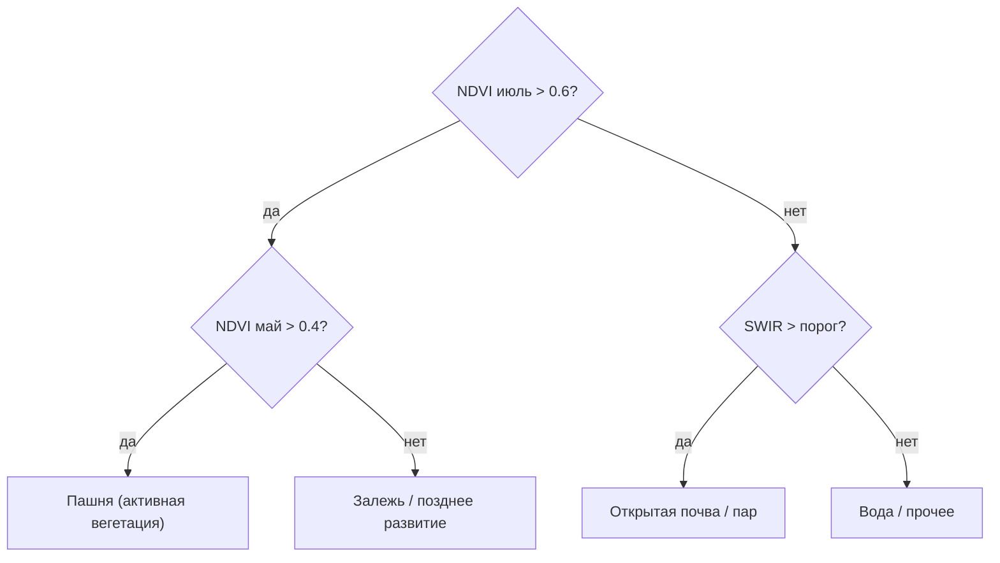

# Обучаем интерпретируемые модели: Random Forest, Gradient Boosting и MiniRocket на рядах NDVI

> ⏱ **Трудозатраты:** ~23 мин чтения + ~25 мин практики
> Модуль **[А3: ИИ и машинное обучение в агроэкологическом мониторинге](../index.md)**, урок 3 из 4.
> Академический уровень. Проект UNDP-KAZ FOLUR. Компоненты FOLUR: **1**, **2**, **3**.

## Цели лекции и место в модуле

Датасет собран и честно разбит ([урок 2](02-dataset-preparation.md)) — начинаем обучать модели. Первыми идут не нейросети, а классические методы, и это осознанный порядок: в реальных проектах агромониторинга Random Forest и градиентный бустинг решают львиную долю задач классификации землепользования — при малых данных, без GPU, с интерпретируемым результатом. Начинать с них — не уступка простоте, а профессиональная стратегия: простая работающая модель одновременно даёт результат и служит честной планкой, ниже которой сложные методы не имеют оправдания. Отдельная линия этой лекции — классификация культур по фенологии через MiniRocket: метод, специально созданный для быстрой и точной работы с временными рядами. К концу урока у вас будут два из трёх подходов, которые [урок 4](04-cnn-and-architecture-choice.md) сведёт в общее сравнение.

После изучения лекции слушатель сможет:

1. **[Bloom: знать]** описывать устройство решающего дерева, случайного леса (Random Forest), градиентного бустинга и преобразования MiniRocket для временных рядов.
2. **[Bloom: понимать]** объяснять, почему ансамбли деревьев устойчивы к переобучению и как читать важность признаков.
3. **[Bloom: применять]** обучать Random Forest и градиентный бустинг на пиксельной таблице Sentinel-2 и MiniRocket на рядах NDVI по данным Северного Казахстана.
4. **[Bloom: анализировать]** сравнивать классические модели по качеству и стоимости и обосновывать, когда какой метод предпочтителен.

> **Границы лекции.** Внутри: решающие деревья, Random Forest, градиентный бустинг, MiniRocket, важность признаков, интерпретируемость. За рамками: свёрточные сети и сегментация — [урок 4](04-cnn-and-architecture-choice.md); детальный разбор метрик и итоговое сравнение трёх подходов — [урок 4](04-cnn-and-architecture-choice.md); подготовка выборки — [урок 2](02-dataset-preparation.md).

---

## 1. Решающее дерево — атом интерпретируемости

Прежде чем говорить о лесах, поймём одно дерево. Решающее дерево классифицирует объект серией вопросов «да/нет» к его признакам: «NDVI в июле > 0,6? — да → влево; отражение в SWIR > порога? — нет → вправо» и так до листа, где выносится класс. Эта логика знакома каждому агроному, который в поле рассуждает похоже: «всходы дружные? почва не засолена? тогда это озимые» — дерево лишь автоматизирует и масштабирует такое рассуждение на миллионы пикселей. Обучение дерева — это подбор вопросов (признак и порог), максимально «очищающих» подвыборку в каждом узле: после хорошего вопроса потомки однороднее по классам, чем родитель (мера однородности — индекс Джини или энтропия). Алгоритм жадно перебирает возможные разбиения и выбирает то, что сильнее всего снижает «беспорядок», и так рекурсивно, пока узлы не станут достаточно чистыми или не сработает ограничение глубины.

Достоинство дерева — прозрачность: путь от корня к листу читается как понятное правило, и агроному можно показать, *почему* пиксель отнесён к пашне. Беда одного дерева — неустойчивость: глубокое дерево идеально запоминает обучающую выборку (включая её шум) и плохо обобщается — классическое переобучение. Мелкое дерево устойчивее, но слишком грубо. Из этого противоречия и рождается идея ансамбля.

Полезно заранее развести два понятия, которые часто путают. **Переобучение** — модель выучила случайности конкретной выборки и потому хороша на обучении, но слаба на новых данных (высокая дисперсия). **Недообучение** — модель слишком проста, чтобы уловить закономерность, и слаба везде (высокое смещение). Глубокое дерево склонно к первому, мелкое — ко второму. Ансамбли деревьев — способ получить низкое смещение (деревья гибкие) при управляемой дисперсии (усреднение гасит случайные ошибки). Эта пара «смещение–дисперсия» — сквозная линза всего машинного обучения, и мы вернёмся к ней, обсуждая нейросети в [уроке 4](04-cnn-and-architecture-choice.md).



*Рис. 1. Упрощённое решающее дерево классификации землепользования: серия вопросов к спектральным признакам и NDVI ведёт от корня к классу-листу. Пороги условны и иллюстрируют логику, а не готовое правило. Alt: древовидная схема, где узлы задают вопросы о NDVI и спектральных каналах, а листья присваивают классы землепользования.*

> **Подробнее** о том, откуда берутся признаки NDVI и спектральных каналов, — в [уроке 1](01-open-data-catalogs.md) и [уроке 2](02-dataset-preparation.md).

## 2. Random Forest — мудрость несогласного леса

### 2.1 Идея ансамбля

Random Forest («случайный лес») строит не одно дерево, а сотни, и усредняет их голоса. Два источника разнообразия делают деревья по-разному ошибающимися. Первый — **бэггинг**: каждое дерево обучается на случайной подвыборке данных (с возвращением). Второй — **случайные признаки**: в каждом узле дерево выбирает лучший вопрос не из всех признаков, а из случайного их подмножества. В результате отдельные деревья остаются «слабыми» и переобученными по-своему, но их *ошибки некоррелированы* и при усреднении гасятся — лес обобщает заметно лучше любого своего дерева. Это и есть «мудрость толпы»: много независимо ошибающихся экспертов вместе точнее одного. В терминах § 1: усреднение снижает дисперсию ансамбля, почти не увеличивая смещение, — потому и переобучение отступает.

### 2.2 Почему RF — рабочая лошадка ДЗЗ

Random Forest доминирует в задачах классификации землепользования по нескольким практическим причинам. Он устойчив к переобучению «из коробки» — добавление деревьев не ухудшает обобщение. Он почти не требует настройки — работает разумно на значениях по умолчанию. Ему безразличен масштаб признаков — не нужна нормализация. Он справляется с малыми выборками (сотни примеров на класс) и не требует GPU. Наконец, он даёт **важность признаков** — оценку вклада каждого канала/индекса в решения, что бесценно для интерпретации и для отбрасывания бесполезных признаков.

Ещё одно недооценённое достоинство — RF выдаёт не только класс, но и **оценку уверенности**: долю деревьев, проголосовавших за победивший класс. Пиксели, где голоса разделились почти поровну, — это зоны неуверенности модели, и карта уверенности не менее полезна заказчику, чем карта классов: она показывает, где результату можно доверять, а где нужна полевая проверка. Это прямое продолжение инварианта «человек верифицирует»: модель сама подсказывает, куда направить верификацию. Профессиональная привычка — сдавать вместе с картой классификации карту уверенности, честно очерчивающую границы надёжности продукта.

Минимальный код на scikit-learn лаконичен:

```python
from sklearn.ensemble import RandomForestClassifier
from sklearn.model_selection import GroupKFold  # пространственные группы! (урок 2)

clf = RandomForestClassifier(n_estimators=300, oob_score=True, random_state=42)
clf.fit(X_train, y_train)
importances = clf.feature_importances_   # вклад признаков
```

Обратите внимание на `oob_score`: «out-of-bag» оценка — бесплатный побочный продукт бэггинга. Каждое дерево не видело часть данных (те, что не попали в его подвыборку), и на них можно оценить лес без отдельного валидационного набора. Это удобная быстрая оценка — но помните урок 2: при пространственной автокорреляции OOB, как и случайное разбиение, оптимистичен; финальную оценку даёт пространственно отделённый тест.

Гиперпараметров у Random Forest немного, и почти все имеют разумные значения по умолчанию. `n_estimators` (число деревьев) — больше почти всегда не вредит качеству, лишь замедляет; типично несколько сотен. `max_features` (сколько признаков рассматривать в узле) управляет разнообразием деревьев — уменьшение усиливает декорреляцию. `max_depth` и `min_samples_leaf` ограничивают глубину и тем самым переобучение отдельных деревьев. На практике настройка RF редко даёт большой выигрыш — в этом его прелесть: он работает «из коробки», освобождая время на то, что важнее, — качество данных и честность разбиения. Если хочется настроить, делайте это через групповую (пространственную) кросс-валидацию из [урока 2](02-dataset-preparation.md), иначе подбор параметров сам станет каналом утечки.

### 2.3 Чтение важности признаков — с осторожностью

Важность признаков отвечает на вопрос «на какие каналы лес опирается сильнее». Если верх списка занимают июльский NDVI и красный край — это согласуется с агрономическим смыслом (пик вегетации разделяет культуры), и доверие к модели растёт. Но у стандартной (basedна примесях) важности есть известные ловушки: она завышает вклад признаков с большим числом уникальных значений и «размазывает» важность между коррелированными признаками (а спектральные каналы сильно коррелированы). Поэтому для ответственных выводов применяют пермутационную важность (насколько падает качество при перемешивании признака) — она честнее и вычисляется на отложенных данных. Интерпретация важности — не украшение отчёта, а инструмент верификации: признак, «важный» вопреки всякому физическому смыслу, часто оказывается каналом утечки данных из [урока 2](02-dataset-preparation.md).

### 2.4 Где Random Forest пасует

Честная карта метода включает и его слабости. RF плохо экстраполирует: он предсказывает классы, комбинируя *виденные* значения, и на данных из принципиально новых условий (другой сенсор, другой год с аномальной погодой, другой регион) его надёжность падает — это общая беда моделей, обученных на ограниченной выборке, и лекарство одно: репрезентативность данных ([урок 2](02-dataset-preparation.md)). Он не видит пространственный контекст, поэтому «солит» карту — соседние пиксели могут получить разные классы там, где человек видит единое поле (частично лечится постобработкой: сглаживанием, объединением по контурам полей). И он, при всей интерпретируемости отдельного дерева, как ансамбль из сотен деревьев уже не читается «одним правилом» — приходится опираться на важность признаков и карты уверенности. Знать эти границы важно не меньше, чем достоинства: именно на них строится обоснованный переход к другим методам.

## 3. Градиентный бустинг — точность ценой аккуратности

### 3.1 Другая идея ансамбля

Если Random Forest строит деревья *независимо и параллельно*, то градиентный бустинг строит их *последовательно*: каждое следующее дерево учится исправлять ошибки уже построенного ансамбля. Формально каждое дерево аппроксимирует градиент функции потерь — отсюда название. Образно: RF — это комитет независимых экспертов, голосующих одновременно, а бустинг — цепочка учеников, где каждый следующий специализируется на том, что не осилил предыдущий. Результат — обычно более точная модель, чем RF, при меньшем числе деревьев. Современные реализации (`HistGradientBoosting` в scikit-learn, а также библиотеки XGBoost, LightGBM, CatBoost — все открытые) быстры и хорошо масштабируются.

### 3.2 Цена точности

За точность бустинг берёт плату вниманием. Он *чувствителен к переобучению*: слишком много деревьев или слишком большая скорость обучения — и модель запоминает шум. Поэтому у него больше гиперпараметров, требующих настройки (скорость обучения, глубина деревьев, число итераций, регуляризация), и почти обязателен механизм ранней остановки по валидации. Практическое правило модуля: **начните с Random Forest как надёжной базовой линии**; переходите к бустингу, когда нужно выжать последние проценты качества и есть время на аккуратную настройку с честной (пространственной) валидацией. Для многих задач картирования землепользования разница между аккуратно настроенным бустингом и RF по умолчанию невелика — а риск незаметно переобучить бустинг реален.

Полезно знать и различия популярных реализаций бустинга, все они открытые и бесплатные. **XGBoost** — исторически задавший стандарт, надёжный и хорошо документированный. **LightGBM** — оптимизирован под скорость и большие таблицы (гистограммный рост деревьев по листьям). **CatBoost** — силён при наличии категориальных признаков и меньше требует ручной настройки. `HistGradientBoosting` в самом scikit-learn покрывает большинство учебных задач без установки внешних библиотек. Для задач модуля различия между ними второстепенны: выбирайте то, что уже установлено, и тратьте усилия на данные и валидацию, а не на «гонку фреймворков». Единый принцип для всех — обязательная ранняя остановка по честной валидации и сдержанность в числе итераций.

### 3.3 Общая сила деревьев и общий предел

И RF, и бустинг работают с объектом как с *таблицей чисел* — им безразличен пространственный и временной порядок. Это одновременно сила (простота, любые признаки в одной таблице) и предел: подав в таблицу значения NDVI за разные даты как отдельные столбцы, дерево не «знает», что столбцы упорядочены во времени, и не использует форму кривой напрямую. Для укрупнённых классов землепользования этого предела часто не замечаешь. Но для тонкой классификации культур, где вся информация — в *форме* сезонной кривой, нужен метод, который эту форму видит. Так мы приходим к MiniRocket.

### 3.4 Инженерия признаков — там, где деревья особенно сильны

Поскольку деревьям всё равно, что стоит в столбцах таблицы, они дают простор для **инженерии признаков** — осмысленного конструирования входов из сырых данных. Вместо того чтобы подавать «сырые» значения каналов за каждую дату, аналитик может добавить производные, кодирующие агрономический смысл: амплитуду сезонного хода NDVI (разность пика и минимума), дату достижения пика, площадь под кривой NDVI за сезон (интегральная продуктивность), спектральные индексы влажности и почвы, статистики рельефа (уклон, экспозиция из ASTER GDEM, [урок 1](01-open-data-catalogs.md)). Такие признаки часто поднимают качество классических моделей заметнее, чем смена алгоритма.

В этом — важное методологическое отличие классического ML от глубокого обучения. Деревьям аналитик *приносит* готовые осмысленные признаки; свёрточные сети [урока 4](04-cnn-and-architecture-choice.md) учатся извлекать признаки *сами* из сырых снимков. Оба пути легитимны; выбор между «человек конструирует признаки» и «сеть их выучивает» — одно из ключевых архитектурных решений, к которому мы вернёмся в финальном сравнении. Пока запомним практический вывод: при работе с деревьями время, вложенное в продуманные признаки, окупается лучше времени, вложенного в тонкую настройку гиперпараметров.

## 4. MiniRocket — фенология как признак

### 4.1 Задача классификации временных рядов

Вспомним [урок 1](01-open-data-catalogs.md): яровая пшеница, ячмень, пар и залежь на отдельном снимке почти неразличимы, но их сезонные кривые NDVI различаются формой — сроками сева, датой и высотой пика, скоростью созревания. Задача «по кривой NDVI за сезон определить культуру» — это классификация временных рядов, отдельная область ML со своими методами.

Почему нельзя просто скормить те же даты в Random Forest как столбцы? Формально можно, и иногда это даже работает — но дерево видит столбцы как независимые признаки и не использует главное: что «NDVI 10 июня» и «NDVI 20 июня» — соседние точки одного процесса, а не два разных измерения. Если поле снято в чуть иные даты или сезон сдвинулся из-за поздней весны, «столбцовая» модель теряется, потому что для неё сдвиг фенологии на неделю — это совсем другие значения в тех же столбцах. Методы временных рядов, напротив, работают с *формой* сигнала и устойчивее к таким сдвигам. Это и есть содержательная причина выделять фенологию в отдельный инструмент, а не решать её деревьями «в лоб».

### 4.2 Что делает MiniRocket

MiniRocket (Minimally RandOm Convolutional KErnel Transform) преобразует каждый временной ряд в вектор признаков, прогоняя по нему большой набор **фиксированных свёрточных ядер** и вычисляя для каждого простую статистику — долю положительных значений отклика (PPV). Ключевое слово — «фиксированных»: ядра не обучаются (в отличие от CNN), они заданы почти детерминированно, поэтому преобразование исключительно быстрое. Полученные признаки подаются в простой линейный классификатор (логистическая регрессия/линейный SVM), который обучается за секунды.

Интуиция за этим такова: каждое свёрточное ядро — маленький «детектор формы», реагирующий на определённый паттерн в ряду (резкий подъём, плоское плато, спад). Прогнав тысячи разных ядер, мы описываем кривую NDVI набором ответов на вопрос «насколько в ней выражен вот такой паттерн». Доля положительных откликов (PPV) оказывается на удивление информативной сводкой формы. Гениальность MiniRocket в том, что эти детекторы не нужно обучать под задачу — достаточно большого фиксированного набора, и линейный классификатор сам разберётся, какие ответы для каких культур характерны. Так метод обходит главную стоимость нейросетей — долгое обучение сложных весов — сохраняя способность видеть форму сигнала.

Практический профиль метода: **очень быстро**, требует умеренных данных (сотни рядов на класс), не нуждается в GPU, при этом по точности на задачах классификации рядов конкурентоспособен с гораздо более тяжёлыми подходами. Для агромониторинга это почти идеальная ниша: многолетние ряды NDVI/EVI из открытых архивов ([урок 1](01-open-data-catalogs.md)) есть в изобилии, а MiniRocket превращает их в классификатор культур без GPU и долгого обучения. Реализация доступна в открытой библиотеке `sktime` (и родственных).

Стоит отметить, что MiniRocket — представитель целого семейства «rocket»-методов (ROCKET, MiniRocket, MultiRocket), возникшего как быстрая альтернатива глубоким сетям для рядов. Существуют и другие подходы к классификации фенологии: расстояние динамической трансформации времени (DTW) с ближайшими соседями, специализированные рекуррентные и трансформерные сети, а также «ручные» фенологические признаки, поданные в обычный Random Forest (§ 3.4). MiniRocket выбран в модуле как метод с лучшим на сегодня балансом «скорость / точность / скромность к ресурсам» — но, как всегда, простой базовый вариант (фенологические признаки + RF) стоит попробовать первым: если он решает задачу, усложнение не нужно.

```python
from sktime.transformations.panel.rocket import MiniRocket
from sklearn.linear_model import RidgeClassifierCV

mr = MiniRocket()                      # фиксированные ядра
X_feat = mr.fit_transform(X_series_train)   # ряды NDVI → признаки
clf = RidgeClassifierCV().fit(X_feat, y_train)
```

### 4.3 Ограничения и честность

MiniRocket не всесилен. Он требует *выровненных* рядов — одинаковой длины и сопоставимых дат; пропуски (облачные даты!) нужно заполнять или интерполировать заранее, а нерегулярность съёмки — учитывать. Он работает с рядом как с одномерным сигналом: многоканальные ряды обрабатываются, но межканальные зависимости он ловит слабее специализированных методов. И, как любой метод, он даёт *оценку* качества, которая честна лишь при пространственно-корректном разбиении рядов (поле целиком — в одну часть выборки). Все конкретные значения точности вы получите в [практикуме](../practicum/01-lulc-three-approaches.md) на своих данных — лекция принципиально не приводит «эталонных» цифр, потому что они зависят от района, набора культур и качества рядов.

### 4.4 Подготовка рядов NDVI: практические шаги

Прежде чем ряд попадёт в MiniRocket, он проходит подготовку, качество которой определяет результат сильнее выбора самого метода. Первый шаг — **очистка от облаков**: значения NDVI в облачные даты недостоверны и должны быть удалены по маске SCL ([урок 1](01-open-data-catalogs.md)), а не оставлены как есть. Второй — **приведение к регулярной сетке дат**: реальные сцены приходят нерегулярно, поэтому ряд интерполируют на равномерную временную решётку (например, декадную), чтобы все поля имели сопоставимые по датам ряды. Третий — **сглаживание**: лёгкий фильтр (скользящее среднее, Савицкого–Голея) убирает остаточный шум, не разрушая форму кривой. Четвёртый — **выравнивание длины**: все ряды должны покрывать одно временное окно сезона.

Эти шаги — не бюрократия, а содержательные решения. Слишком агрессивная интерполяция может «придумать» вегетацию там, где были только облака; слишком сильное сглаживание сотрёт различия между быстро и медленно созревающими культурами. Здесь снова работает инвариант платформы: автоматический конвейер подготовки рядов ускоряет работу, но аналитик обязан выборочно посмотреть на несколько собранных кривых глазами и убедиться, что они физически правдоподобны — пик приходится на середину лета, а не на апрель. Кривая NDVI с пиком в неправильный сезон — сигнал ошибки в подготовке, а не открытие.

## 5. Когда что: карта выбора классических моделей

Сведём практические ориентиры в таблицу — она пригодится и при выборе метода, и при защите выбора перед заказчиком.

| Метод | Представление | Данные | Ресурсы | Сильная сторона | Когда выбирать |
|---|---|---|---|---|---|
| Random Forest | пиксельная таблица | сотни/класс | CPU, минуты | устойчивость, важность признаков, уверенность | базовая линия для классификации землепользования |
| Градиентный бустинг | пиксельная таблица | сотни/класс | CPU, минуты | максимум точности на таблицах | выжать проценты, есть время на настройку |
| MiniRocket | ряды NDVI/EVI | сотни рядов/класс | CPU, секунды–минуты | видит форму сезонной кривой | классификация культур по фенологии |

Все три — быстры, скромны к ресурсам и не требуют GPU; все три уступают CNN там, где решает пространственный контекст высокого разрешения — но об этом [урок 4](04-cnn-and-architecture-choice.md). Заметьте, что таблица не содержит столбца «точность»: её значение зависит от данных и определяется экспериментом, а не свойствами метода — вписать туда числа заранее было бы научной нечестностью.

Важнее конкретного выбора — принцип: **начинать с простого**. Простая, интерпретируемая, быстро обучаемая модель — это и рабочее решение для многих задач, и честная база сравнения: если сложная нейросеть не превосходит Random Forest, её сложность не оправдана. Этот принцип экономии — профессиональная норма, а не признак неамбициозности.

### 5.1 Стоимость владения, а не только точность

Инженерное решение о выборе модели учитывает не одну точность. Есть **стоимость обучения** (RF и MiniRocket — минуты на CPU; CNN — часы и GPU), **стоимость инференса** (насколько дорого применять модель к новым снимкам — важно, если мониторинг еженедельный), **стоимость сопровождения** (кто и как переобучит модель через год, когда изменится набор культур), **объяснимость** (сможете ли вы обосновать результат перед акиматом или аудитором). Для проекта FOLUR, ориентированного на устойчивость решений после завершения (нулевая инфраструктурная зависимость платформы), эти оси часто перевешивают доли процента точности. Модель, которую хозяйство сможет переобучать само в бесплатном Colab, полезнее чуть более точной модели, требующей GPU-сервера и штатного инженера.

Именно поэтому классические методы этого урока — не «разминка перед настоящими нейросетями», а полноправные производственные инструменты. В следующем уроке мы добавим CNN не чтобы заменить их, а чтобы очертить границу, за которой пространственный контекст высокого разрешения оправдывает дополнительную сложность.

---

## Региональный кейс

**Ситуация:** Агроном хозяйства в Акмолинской области хочет автоматически разделить поля севооборота на «яровая пшеница», «пар» и «многолетние травы» по данным прошедшего сезона, не выезжая на каждое поле. У него есть журнал севооборота за несколько лет (метки по полям) и доступ к открытым архивам Sentinel-2.

**Данные:** ряды NDVI по полям за сезон май–сентябрь (Sentinel-2 L2A, GEE, методика [урока 1](01-open-data-catalogs.md)); метки культур из журнала севооборота хозяйства (метки уровня поля, [урок 2](02-dataset-preparation.md)); границы полей — оцифровка/OSM.

**Задача:**

1. Какое представление данных выбрать — пиксельную таблицу для Random Forest или ряды для MiniRocket — и почему именно для различения культур?
2. Как разбить выборку, чтобы оценка была честной, если объект — поле, а меток по несколько десятков полей на класс?
3. Проверив важность признаков RF (если выбран RF), какой период сезона вы ожидаете увидеть наверху и как это согласуется с фенологией культур?

**Разбор:** Для различения культур предпочтителен ряд + MiniRocket: информация о культуре заключена в *форме* сезонной кривой (сроки и высота пика NDVI, скорость созревания), а не в значениях отдельной даты — именно это MiniRocket и кодирует, тогда как таблица подаёт даты деревьям как несвязанные столбцы (§ 3.3, § 4.1). Разбиение — строго по полям (все пиксели/ряды одного поля в одной части выборки), при малом числе полей — групповая кросс-валидация (`GroupKFold` по полю), чтобы не терять данные; тест — из полей, не участвовавших в обучении. Если применяется RF, наверху важности ожидаемо окажутся признаки середины–конца лета: именно тогда пшеница на пике, а пар остаётся открытой почвой — период максимального контраста классов. Конкретные метрики агроном получает сам; лекция не называет чисел, которых не существует до эксперимента.

> Кейс полностью реализуется в [практикуме](../practicum/01-lulc-three-approaches.md), где RF, MiniRocket и CNN обучаются на одном районе и сравниваются.

---

## Закрепление и применение

!!! example "Попробуйте в Colab"
    В ноутбуке урока (`<URL будет назначен при создании репозитория ноутбуков>`) обучите Random Forest на пиксельной таблице и MiniRocket на рядах NDVI из одного района. Сравните: время обучения, качество на пространственном тесте, и — для RF — топ-5 важности признаков. Совпал ли топ важности с вашими ожиданиями по фенологии?

!!! warning "Границы применимости"
    Классические модели не видят пространственный контекст (текстуру, форму границ) — для задач высокого разрешения (детекция сорняков на ортофото БПЛА) нужна CNN из урока 4. MiniRocket требует выровненных рядов без больших пропусков — облачные даты придётся интерполировать. Стандартная важность признаков RF смещена в пользу коррелированных и «богатых значениями» признаков — для выводов используйте пермутационную важность.

!!! tip "Что это даёт вашему хозяйству"
    Random Forest и MiniRocket — это ML, который реально работает без дорогого «железа»: обучается в бесплатном Colab на CPU за минуты и даёт объяснимый результат, который не стыдно показать агроному. Именно эти методы стоят за многими сервисами NDVI-мониторинга; версия без программирования — [модуль П3](../../p3/index.md), первый Python-скрипт — [модуль П4](../../p4/index.md).

!!! question "Кейс для размышления"
    Коллега обучил градиентный бустинг, получил на тесте качество заметно выше вашего Random Forest и предлагает внедрять его. Какие три вопроса вы зададите, прежде чем согласиться (подсказки: разбиение из урока 2, ранняя остановка из § 3.2, важность признаков из § 2.3)?

### Проверь себя

```quiz
[
  {
    "q": "За счёт чего Random Forest обобщает лучше, чем отдельное глубокое дерево?",
    "options": [
      "Усредняет голоса многих деревьев, чьи ошибки некоррелированы благодаря бэггингу и случайным признакам",
      "Строит одно очень глубокое дерево, точно запоминающее выборку",
      "Использует GPU для ускорения обучения",
      "Нормализует признаки перед обучением"
    ],
    "answer": 0,
    "explain": "§ 2.1: разнообразие деревьев (случайные подвыборки данных и признаков) делает их ошибки независимыми, и при усреднении они гасятся; RF не требует нормализации и GPU (§ 2.2)."
  },
  {
    "q": "Чем градиентный бустинг принципиально отличается от Random Forest по способу построения деревьев?",
    "options": [
      "Строит деревья последовательно: каждое исправляет ошибки предыдущего ансамбля",
      "Строит деревья независимо и параллельно, затем усредняет",
      "Использует только одно дерево, но очень глубокое",
      "Не использует деревья, а строит линейную модель"
    ],
    "answer": 0,
    "explain": "§ 3.1: бустинг последователен — каждое дерево аппроксимирует градиент функции потерь; независимое параллельное построение — это RF (§ 2.1)."
  },
  {
    "q": "Почему для различения яровой пшеницы, пара и залежи предпочтительнее MiniRocket на рядах NDVI, а не Random Forest на таблице дат?",
    "options": [
      "Информация о культуре — в форме сезонной кривой; MiniRocket видит форму ряда, а дерево трактует даты как несвязанные столбцы",
      "MiniRocket точнее на любых задачах, чем деревья",
      "Random Forest не работает с индексом NDVI",
      "MiniRocket требует GPU и потому мощнее"
    ],
    "answer": 0,
    "explain": "§ 3.3 и § 4.1: классы различаются динамикой (формой кривой), а не значением отдельной даты; MiniRocket кодирует форму ряда, тогда как деревья не используют временной порядок. MiniRocket работает на CPU (§ 4.2)."
  },
  {
    "q": "Что такое OOB (out-of-bag) оценка в Random Forest и в чём её ограничение для геоданных?",
    "options": [
      "Оценка на данных, не попавших в подвыборку дерева; при пространственной автокорреляции она оптимистична, как и случайное разбиение",
      "Оценка на отдельном полевом наборе, всегда самая надёжная",
      "Оценка скорости обучения леса",
      "Оценка важности признаков"
    ],
    "answer": 0,
    "explain": "§ 2.2: OOB — бесплатная оценка на «невиданных» деревом данных, но пространственная корреляция (урок 2) делает её завышенной; финальную оценку даёт пространственно отделённый тест."
  },
  {
    "q": "Признак с высокой важностью в RF противоречит агрономическому смыслу. О чём это чаще всего сигнализирует?",
    "options": [
      "О возможной утечке данных — признак несёт информацию о метке нефизическим путём",
      "О том, что модель обучилась особенно хорошо",
      "О необходимости добавить больше деревьев",
      "Это нормально и не требует внимания"
    ],
    "answer": 0,
    "explain": "§ 2.3: важность — инструмент верификации; бессмысленно «важный» признак часто оказывается каналом утечки данных (урок 2), а не признаком качества модели."
  }
]
```

### Контрольные вопросы

1. Опишите, чем бэггинг отличается от бустинга. *(Bloom: знать)*
2. Объясните, почему стандартную важность признаков RF нельзя читать буквально. *(Bloom: понимать)*
3. Для задачи «пашня / не пашня» по вашему району СКО обоснуйте выбор между Random Forest и градиентным бустингом. *(Bloom: применять)*

## Что дальше?

[Урок 4 «Сегментируем снимки и выбираем архитектуру»](04-cnn-and-architecture-choice.md) добавит третий подход — свёрточные нейросети (U-Net, ResNet), разберёт метрики (F1, IoU, каппа Коэна) и матрицу ошибок и, наконец, честно сравнит все три подхода на общем материале, замкнув логику модуля. Связанные материалы: [модуль П4 — Python и Jupyter](../../p4/index.md), [практикум модуля](../practicum/01-lulc-three-approaches.md).
