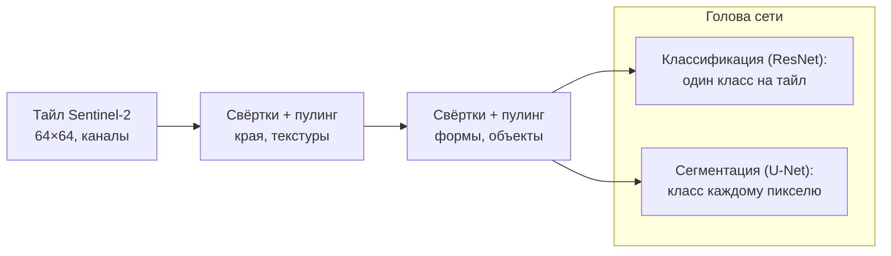
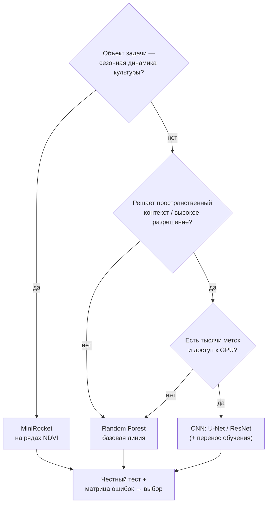

# Сегментируем снимки и выбираем архитектуру: CNN, метрики и честное сравнение трёх подходов

> ⏱ **Трудозатраты:** ~24 мин чтения + ~25 мин практики
> Модуль **[А3: ИИ и машинное обучение в агроэкологическом мониторинге](../index.md)**, урок 4 из 4.
> Академический уровень. Проект UNDP-KAZ FOLUR. Компоненты FOLUR: **1**, **2**, **3**.

## Цели лекции и место в модуле

Два подхода уже в руках: интерпретируемые деревья на таблице и MiniRocket на рядах ([урок 3](03-classic-models-timeseries.md)). Третий — свёрточные нейросети (CNN) — открывает то, чего не видят табличные методы: пространственный контекст, текстуру, форму. Но CNN дороги данными и вычислениями, и подключать их следует осознанно. Эта заключительная лекция модуля разбирает CNN (ResNet для классификации, U-Net для сегментации), учит честно измерять качество (F1, IoU, каппа Коэна, матрица ошибок) и, наконец, сводит все три подхода в обоснованное сравнение — тот самый навык «выбрать архитектуру под задачу», ради которого построен весь модуль. Это кульминация логики «от инструмента к применению»: инструменты собраны, и теперь главным становится инженерное суждение о том, какой из них уместен и как честно доказать, что он работает.

После изучения лекции слушатель сможет:

1. **[Bloom: знать]** описывать устройство свёрточной сети, различие классификации (ResNet) и семантической сегментации (U-Net) и определения метрик F1, IoU, каппа Коэна.
2. **[Bloom: понимать]** объяснять, почему общая точность (accuracy) обманчива при дисбалансе классов и как матрица ошибок раскрывает поведение модели.
3. **[Bloom: применять]** обучать компактную CNN на тайлах Sentinel-2 и вычислять корректный набор метрик по данным Северного Казахстана.
4. **[Bloom: анализировать]** сравнивать RF, MiniRocket и CNN по качеству, стоимости и применимости и аргументированно выбирать архитектуру под конкретную задачу.

> **Границы лекции.** Внутри: свёртки, ResNet, U-Net, перенос обучения, метрики, матрица ошибок, анализ ошибок, итоговое сравнение подходов. За рамками: классические модели — [урок 3](03-classic-models-timeseries.md); подготовка тайлов и разбиение — [урок 2](02-dataset-preparation.md); применение CNN к ортофото БПЛА (детекция сорняков) обзорно — практика в [модуле А1](../../a1/index.md).

---

## 1. Свёрточная сеть: как машина «видит» текстуру

Табличные методы урока 3 видят пиксель как набор чисел вне контекста. Человек же, глядя на снимок, опознаёт поле не по одному пикселю, а по *форме* контура, *текстуре* поверхности, *соседству* объектов. Свёрточная нейросеть (Convolutional Neural Network, CNN) формализует именно это зрение. Разница принципиальна: там, где Random Forest спросит «какое значение NDVI в этом пикселе», CNN спросит «на что похож этот участок изображения целиком» — и это открывает доступ к признакам, которых в отдельном пикселе просто нет.

Базовая операция — **свёртка**: небольшое окно-фильтр (например, 3×3) скользит по изображению и в каждой позиции считает взвешенную сумму пикселей под собой. По сути это тот же принцип, что и «скользящее окно» в обработке изображений, известный из ГИС ([модуль А2](../../a2/index.md)): фокусный анализ растра, где значение пикселя пересчитывается по его соседям. Разница в том, что веса окна CNN не задаёт человек — их подбирает обучение. Разные фильтры реагируют на разные локальные паттерны — границу, пятно, полоску. Один фильтр может «загораться» на резких перепадах яркости (границы полей), другой — на регулярной текстуре (рядки посева), третий — на однородных пятнах (водная гладь). Ключевое отличие от MiniRocket: здесь фильтры **обучаются** — сеть сама подбирает, какие паттерны выделять под задачу, а не берёт их из фиксированного набора. Складывая свёрточные слои в глубину и чередуя их с операциями снижения разрешения (пулинг), сеть строит иерархию признаков: ранние слои ловят края и текстуры, глубокие — сложные объекты (контур поля, структуру лесополосы). Эта выученная иерархия — то, что отличает глубокое обучение от классического: признаки не конструируются человеком (§ 3.4 [урока 3](03-classic-models-timeseries.md)), а извлекаются сетью из сырых снимков.



*Рис. 1. Свёрточная сеть извлекает иерархию признаков из тайла, а «голова» решает задачу: классификация присваивает класс всему тайлу (ResNet), сегментация — каждому пикселю (U-Net). Alt: блок-схема, где входной тайл проходит через свёрточные блоки к двум типам выходов — классификации всего тайла и попиксельной сегментации.*

За выразительность приходится платить. CNN **прожорливы к данным** (тысячи размеченных тайлов, [урок 2](02-dataset-preparation.md)), **требуют GPU** для разумного времени обучения, **склонны к переобучению** при малых выборках и **непрозрачны** — объяснить решение сети труднее, чем путь по дереву. Эти издержки и определяют, когда CNN оправданы.

### 1.1 Как учится сеть: потери, градиент, эпохи

Чтобы осознанно применять CNN и читать чужой код обучения, полезно понимать сам процесс. Сеть учится, минимизируя **функцию потерь** — числовую меру расхождения между её предсказаниями и эталонными метками (для классификации это обычно перекрёстная энтропия). Алгоритм обратного распространения вычисляет, как менять каждый вес, чтобы потери уменьшились (это и есть градиент), а оптимизатор (SGD, Adam) делает маленький шаг в нужную сторону. Один проход по всей обучающей выборке называют **эпохой**; сеть учится многими эпохами, постепенно снижая потери.

Здесь и подстерегает переобучение: если учить слишком долго, потери на обучении продолжают падать, а на валидации — начинают расти, потому что сеть запоминает шум. Отсюда обязательные инструменты: слежение за кривыми потерь train/val, **ранняя остановка** (прекратить, когда валидация перестала улучшаться), регуляризация (dropout, штраф на веса) и аугментация ([урок 2](02-dataset-preparation.md)). Всё это — та же борьба смещения и дисперсии, что и у деревьев ([урок 3](03-classic-models-timeseries.md), § 1), только у сетей рычагов управления больше, а цена ошибки выше. Расхождение кривых потерь train и val — первый график, на который смотрит инженер: он честно показывает, учится модель или заучивает.

> **Подробнее** о нарезке тайлов, аугментации и балансировке классов для CNN — в [уроке 2](02-dataset-preparation.md).

## 2. Две задачи — две архитектуры

### 2.1 ResNet: классификация тайла

Когда нужно присвоить *один класс целому фрагменту* («этот тайл — преимущественно пашня»), применяют классифицирующие CNN. **ResNet** (Residual Network) — базовая архитектура этого класса; её изобретение — «остаточные связи» (skip-соединения), позволяющие обучать очень глубокие сети без деградации градиента. До ResNet попытки строить очень глубокие сети упирались в парадокс: добавление слоёв *ухудшало* результат, потому что градиент, пробираясь через десятки слоёв назад, затухал. Остаточная связь пропускает сигнал «в обход» блока, давая градиенту короткий путь, — и внезапно стало возможным обучать сети из сотен слоёв. Эта идея настолько удачна, что skip-соединения теперь есть почти в каждой современной архитектуре, включая U-Net. Для агромониторинга классификация тайлов уместна, когда интересует состав территории по крупным ячейкам, а не точная граница каждого поля.

### 2.2 U-Net: семантическая сегментация

Чаще в картировании землепользования нужен *класс для каждого пикселя* — тогда результат прямо ложится в карту. Это задача семантической сегментации, и её эталонная архитектура — **U-Net**. Её форма буквы «U» — это сжимающий путь (свёртки + пулинг, извлечение контекста) и расширяющий путь (постепенное восстановление разрешения), соединённые «мостиками» (skip-соединениями), которые возвращают в выход точные границы, теряемые при сжатии. U-Net, придуманная для медицинских изображений, стала рабочим стандартом сегментации ДЗЗ: она аккуратно проводит границы полей и требует умеренных данных по меркам глубокого обучения.

Интуиция за U-образной формой такова. Чтобы понять, *что* изображено (пашня или вода), сети нужен широкий контекст — она сжимает изображение, жертвуя деталями ради «общей картины». Но чтобы провести границу *точно по пикселю*, нужны как раз детали, потерянные при сжатии. Skip-соединения решают эту дилемму, прокидывая детали с ранних слоёв прямо в расширяющий путь: глубина даёт «что», мостики возвращают «где». Именно поэтому U-Net одновременно и понимает содержание, и аккуратно очерчивает границы — сочетание, критичное для карт, где неверно проведённая межа поля искажает площади и, в конечном счёте, расчёты субсидий или деградации земель.

### 2.3 CNN на данных БПЛА высокого разрешения

Настоящая сила CNN раскрывается на снимках высокого разрешения, где решает текстура и форма отдельных объектов. На ортофотопланах БПЛА (сантиметры на пиксель, [модуль А1](../../a1/index.md)) CNN решают задачи, недоступные спутнику 10 м: детекция очагов сорняков, подсчёт всходов, выявление поражённых участков. В нашем модуле практикум работает на Sentinel-2 (доступно каждому, без БПЛА), но помните: чем выше разрешение и важнее форма, тем сильнее перевес CNN над табличными методами.

Обратная сторона того же правила: на грубом разрешении, где объект укладывается в один-два пикселя, пространственный контекст беден, и преимущество CNN тает — табличный метод по спектру работает не хуже, а стоит несравнимо дешевле. Поэтому «CNN» и «высокое разрешение» — почти синонимы в практике агромониторинга: свёрточная сеть окупается там, где есть, что разглядывать. Подавать пиксели Sentinel-2 10 м в тяжёлую сеть ради одной лишь моды — типичная ошибка новичка, которую этот модуль учит не совершать.

## 3. Перенос обучения: как обойти нехватку данных

Главный барьер CNN — потребность в размеченных данных — частично снимается **переносом обучения** (transfer learning). Идея: взять сеть, уже обученную на огромном наборе (ImageNet или, точнее для нас, геопространственные foundation-модели, публикуемые открыто на Hugging Face, [урок 2](02-dataset-preparation.md)), и *дообучить* её на своей небольшой задаче. Ранние слои такой сети уже умеют распознавать края и текстуры — это универсально, — и переучивать приходится в основном верхние слои под свои классы. Перенос обучения радикально снижает требования к объёму размеченных данных и времени обучения; для многих региональных задач это единственный практичный способ применить CNN при скромной выборке. Оговорка честности: модель, предобученная на обычных фотографиях, знает не совсем то, что нужно для мультиспектральных снимков, — поэтому предпочтительны предобучения именно на ДЗЗ, а результат в любом случае проверяется на своём тесте.

На практике перенос обучения имеет две «настройки глубины». Можно **заморозить** предобученные слои и обучать только новую «голову» под свои классы — это быстро и почти не переобучается, годится при совсем малых данных. Можно **разморозить** и дообучить всю сеть с маленькой скоростью обучения (fine-tuning) — это даёт больше качества, но требует больше данных и осторожности. Выбор между ними — тот же компромисс смещения и дисперсии: чем меньше ваша выборка, тем сильнее стоит опираться на замороженные чужие признаки. Для геопространственных foundation-моделей, предобученных на миллионах спутниковых сцен, даже замороженные признаки часто оказываются на удивление сильными — это делает CNN доступнее для региональных проектов с ограниченной разметкой, чем было ещё несколько лет назад. `[UNVERIFIED: конкретный выигрыш зависит от модели, задачи и территории — проверяется экспериментом на своём тесте]`

## 4. Метрики: как не обмануть себя цифрой

Модель обучена — как измерить, хороша ли она? Наивный ответ «доля верных пикселей» (accuracy) — одна из самых опасных ловушек прикладного ML, и умение её обходить отличает грамотную оценку от самообмана.

### 4.1 Почему accuracy лжёт при дисбалансе

Вспомним [урок 2](02-dataset-preparation.md): в агроландшафтах Северного Казахстана пашня занимает подавляющую площадь, а водоёмы или лесополосы — проценты. Модель, которая *всё* объявляет пашней, получит высокую общую точность — просто потому, что пашни много, — и при этом будет полностью бесполезна: она не найдёт ни одного водоёма. Общая точность маскирует провал на редких, но важных классах. Поэтому в задачах с дисбалансом (то есть почти всегда в ДЗЗ) accuracy сопровождают метриками, чувствительными к каждому классу.

### 4.2 Точность, полнота и F1

Для каждого класса вводят два понятия. **Точность** (precision) — из того, что модель назвала классом X, какая доля действительно X (мало ложных срабатываний). **Полнота** (recall) — из всех реальных объектов класса X какую долю модель нашла (мало пропусков). Между ними компромисс: можно быть осторожным (высокая precision, низкий recall) или всеохватным (наоборот). **F1** — гармоническое среднее precision и recall, единая оценка баланса; её считают *по каждому классу отдельно*, а затем усредняют. Важно *как* усредняют: macro-F1 (простое среднее по классам) даёт редким классам тот же вес, что и частым, и потому честнее показывает, справляется ли модель со всем спектром классов, чем взвешенное по частоте среднее.

### 4.3 IoU — метрика границ для сегментации

Для сегментации ключевая метрика — **IoU** (Intersection over Union, индекс Жаккара): отношение площади пересечения предсказанной и истинной областей класса к площади их объединения. Наглядно: наложите предсказанный контур поля на истинный — IoU показывает, какую долю их суммарной площади занимает совпавшая часть; полное совпадение даёт 1, полное несовпадение — 0. IoU строго наказывает и за пропуски, и за «разлив» класса за его границы, поэтому это честная оценка качества именно *очертаний* объектов — то, что критично для карт полей. Средний IoU по классам (mIoU) — стандартная сводная метрика сегментационных моделей.

### 4.4 Каппа Коэна — поправка на случайность

Ещё одна тонкость сегментации: IoU можно считать по-разному усреднённым. Микро-усреднение (по всем пикселям сразу) даёт вес пропорционально площади и потому благоволит крупным классам; макро-усреднение (среднее IoU по классам) уравнивает классы и честнее отражает работу с редкими объектами. Как и с F1, выбор способа усреднения — содержательное решение, которое надо озвучить в отчёте, а не «настройка по умолчанию». Один и тот же результат сегментации может выглядеть отличным по микро-IoU и посредственным по макро-IoU — и оба числа правдивы, просто отвечают на разные вопросы.

**Каппа Коэна** отвечает на вопрос: насколько согласие модели с эталоном лучше случайного угадывания с учётом частот классов? Значение 0 означает «не лучше случая», 1 — идеальное согласие. В дистанционном зондировании каппа традиционно сопровождает матрицу ошибок как мера, устойчивая к дисбалансу: она не даст обмануться высокой accuracy на доминирующем классе. Интерпретировать абсолютное значение каппы следует осторожно и в контексте задачи — но как инструмент сравнения моделей на одних данных она полезна.

### 4.4a Какую метрику брать главной

Метрик много, и соблазн — отчитаться самой красивой. Профессиональный подход обратный: главную метрику выбирают *до* эксперимента, исходя из задачи и цены ошибок. Если одинаково важны все классы, включая редкие, — macro-F1 или mIoU. Если критично не пропустить конкретный класс (скажем, водоохранную зону) — recall этого класса. Если продукт — карта границ полей — mIoU. Общую точность оставляют как вспомогательный, легко читаемый заказчиком показатель, но никогда не как единственный критерий при дисбалансе. И всегда сообщают метрики *по классам*, а не только усреднённые: усреднение — тоже способ спрятать провал. Зафиксировать главную метрику заранее — та же дисциплина, что заморозить тест ([урок 2](02-dataset-preparation.md)): она не даёт задним числом подобрать ту цифру, которая выгоднее выглядит.

### 4.5 Матрица ошибок — источник всех метрик

Все перечисленные числа — свёртки одной таблицы. **Матрица ошибок** (confusion matrix) в строках содержит истинные классы, в столбцах — предсказанные; на диагонали — верные ответы, вне её — кто с кем спутан. Это самый информативный инструмент анализа: он не просто говорит «модель ошибается на 15%», а показывает *как именно* — например, что залежь систематически принимается за пастбище (агрономически осмысленная путаница) или что вода теряется в тени облаков (дефект данных). Читать матрицу ошибок обязан каждый, кто сдаёт карту заказчику: за одной цифрой качества всегда стоит структура ошибок, и именно она определяет пригодность продукта. Конкретные значения всех метрик вы получите в [практикуме](../practicum/01-lulc-three-approaches.md) — лекция не приводит «эталонных» чисел, их не существует до эксперимента.

## 5. Анализ ошибок: от метрики к улучшению

Метрика говорит *сколько*, матрица ошибок — *что*, а анализ ошибок отвечает *почему* и *что делать*. Это, возможно, самый недооценённый навык прикладного ML: начинающие тратят недели на перебор моделей, тогда как один вдумчивый час над ошибочными примерами часто указывает точную причину и дешёвое лекарство. Практический цикл: найдите в матрице самую «дорогую» путаницу; посмотрите глазами на конкретные ошибочные примеры; выдвиньте гипотезу о причине. Частые причины и лекарства: *шум в метках* (класс размечен непоследовательно — вернуться к § 2 [урока 2](02-dataset-preparation.md), почистить эталоны); *нехватка примеров редкого класса* (собрать/дополнить, взвесить классы); *объективная неразличимость* на данном разрешении (нужен другой источник — БПЛА или сезонный ряд); *утечка данных* (подозрительно высокие метрики — перепроверить разбиение). Ключевая мысль: рост качества чаще приходит от работы с *данными и постановкой задачи*, чем от смены или тонкой настройки модели. Это профессиональная зрелость — искать причину в данных прежде, чем менять алгоритм.

## 6. Честное сравнение трёх подходов

Теперь замкнём модуль. Три подхода — RF (таблица), MiniRocket (ряды), CNN (тайлы) — сравнимы честно только на *общем материале*: один район, одно пространственное разбиение, один набор метрик ([урок 2](02-dataset-preparation.md), § 5.1). Именно так устроен [практикум](../practicum/01-lulc-three-approaches.md).

Оговоримся, что «честное сравнение» — это не просто одинаковые данные, но и одинаковая добросовестность настройки. Сравнивать тщательно оптимизированную CNN с Random Forest «по умолчанию» так же нечестно, как и наоборот: у каждого метода должна быть разумная, а не показная конфигурация, и решения о ней принимаются по валидации, а не по тесту. Ещё одна ловушка — сравнение по одной случайной выборке: разбиение вносит свою изменчивость, и разница в доли процента между моделями может быть просто шумом разбиения. Честный вывод часто звучит не «модель А лучше модели Б», а «в пределах изменчивости разбиения модели неразличимы, поэтому выбираем более простую и объяснимую». Такая формулировка — признак зрелости аналитика, а не его неуверенности.

| Ось сравнения | Random Forest | MiniRocket | CNN (U-Net/ResNet) |
|---|---|---|---|
| Что «видит» | спектр пикселя (± соседние даты) | форму сезонной кривой | пространственный контекст, текстуру |
| Данные | сотни/класс | сотни рядов/класс | тысячи тайлов (меньше с переносом) |
| Ресурсы | CPU, минуты | CPU, секунды–минуты | GPU, часы |
| Интерпретируемость | высокая (важность, уверенность) | средняя | низкая |
| Родная задача | классификация по признакам | классификация культур по фенологии | сегментация границ, высокое разрешение |
| Слабость | нет контекста, «солит» карту | нужны выровненные ряды | данные, GPU, непрозрачность |

Столбца «точность» здесь снова нет намеренно: какой подход победит по качеству — эмпирический вопрос конкретных данных, и вписать ответ заранее было бы фабрикацией. Практический алгоритм выбора: начните с Random Forest как базовой линии; если задача — культуры по фенологии, добавьте MiniRocket; переходите к CNN, когда решает пространственный контекст (высокое разрешение, важность формы и границ) и есть данные и GPU. Если сложная CNN не превосходит RF на честном тесте — выбирайте RF: простота, объяснимость и воспроизводимость на бесплатном стеке ценны для устойчивости проекта не меньше долей процента точности ([урок 3](03-classic-models-timeseries.md), § 5.1).

Отдельно стоит сказать про **ансамбли и гибриды**. Подходы не обязаны конкурировать — их можно сочетать: например, признаки MiniRocket (форма кривой) вместе со спектральными и рельефными признаками подать в один Random Forest, объединив временную и спектральную информацию в интерпретируемой модели без GPU. Или использовать CNN для точных границ полей, а внутри каждого поля классифицировать культуру по ряду NDVI. Такие гибриды часто практичнее «чистых» решений, потому что берут сильные стороны каждого метода. Но и усложняют пайплайн — а значит, требуют той же честной оценки и того же вопроса «оправдана ли сложность». Модуль сознательно учит сначала уверенно владеть тремя базовыми подходами по отдельности; их комбинирование — естественное продолжение, к которому вы придёте на практике.

Наконец, помните про **сквозной инвариант платформы**, который в этой лекции обретает полную форму. Любая модель — RF, MiniRocket, CNN — производит *гипотезу* о территории, а не истину. Финальная проверка на пространственном тесте, чтение матрицы ошибок, анализ ошибочных примеров глазами, карта уверенности и, где возможно, полевая сверка — это и есть шаг «человек верифицирует», без которого результат модели не становится продуктом. ИИ и автоматика прошли весь модуль как ускоритель; ответственность за выводы осталась на человеке. Именно этот навык — не обучить модель, а обоснованно доверять или не доверять её результату — отличает инженера ДЗЗ от оператора кнопки «обучить».



*Рис. 2. Дерево выбора архитектуры под задачу агромониторинга. Любая ветвь завершается проверкой на честном пространственном тесте с анализом матрицы ошибок. Alt: блок-схема принятия решения, ведущая от природы задачи к выбору MiniRocket, Random Forest или CNN, с обязательной финальной проверкой на тесте.*

---

## Региональный кейс

**Ситуация:** Управление сельского хозяйства района Северо-Казахстанской области заказало карту землепользования: четыре класса — пашня, пастбище/залежь, водные объекты, лесополосы/древесная растительность. Пашня и пастбище занимают почти всю площадь, водоёмы и лесополосы — единицы процентов. Команда обучила две модели (Random Forest на композите и U-Net на тайлах) и должна выбрать одну для сдачи.

**Данные:** медианный композит и тайлы Sentinel-2 L2A за сезон ([урок 1](01-open-data-catalogs.md)); эталоны — верифицированная разметка ([урок 2](02-dataset-preparation.md)); пространственное разбиение по сетке.

**Задача:**

1. Почему общая точность (accuracy) — плохой единственный критерий выбора в этой задаче, и какие метрики её заменяют?
2. По матрице ошибок обнаружено, что лесополосы систематически теряются (низкий recall), хотя accuracy высока. Что это говорит о модели и что предпринять?
3. U-Net дал на пространственном тесте немного выше mIoU, но требует GPU и непрозрачен; RF чуть слабее, но объясним и работает в бесплатном Colab. Как обосновать выбор перед заказчиком?

**Разбор:** Accuracy маскирует провал на редких классах (§ 4.1): модель, игнорирующая лесополосы, всё равно покажет высокую общую точность из-за доминирования пашни; заменяют её macro-F1, per-class recall, mIoU и каппой Коэна (§ 4.2–4.4). Потеря лесополос при высокой accuracy — классический признак дисбаланса и/или нехватки примеров редкого класса; действия — взвешивание классов, дополнительная разметка лесополос, проверка, различимы ли они вообще на 10 м (§ 5). Выбор модели — не только про метрику: если преимущество U-Net в пределах шума разбиения, а RF даёт объяснимость, карту уверенности и воспроизводимость на бесплатном стеке, для устойчивого проекта FOLUR разумнее RF (§ 6); если же критична точность границ узких объектов и есть ресурсы на сопровождение — U-Net. Конкретные значения метрик команда получает сама; лекция не подставляет несуществующих чисел.

> Кейс полностью реализуется в [практикуме](../practicum/01-lulc-three-approaches.md) и служит основой сценарного вопроса [итоговой оценки](../assessment/final.md).

---

## Закрепление и применение

!!! example "Попробуйте в Colab"
    В ноутбуке урока (`<URL будет назначен при создании репозитория ноутбуков>`) обучите компактную U-Net на тайлах (по возможности — с переносом обучения) и постройте матрицу ошибок и per-class F1. Сравните их с метриками RF из [урока 3](03-classic-models-timeseries.md) на том же районе и разбиении. Какой класс каждый подход теряет чаще?

!!! warning "Границы применимости"
    CNN требуют GPU и тысяч меток; при скромной выборке без переноса обучения они легко переобучаются и уступают Random Forest. Accuracy без per-class метрик и матрицы ошибок вводит в заблуждение при дисбалансе классов. Каппа Коэна и IoU полезны для сравнения на одних данных, но их абсолютные значения нельзя переносить между задачами и территориями как «нормативы качества».

!!! tip "Что это даёт вашему хозяйству"
    Умение выбрать *минимально достаточную* модель экономит хозяйству и деньги, и время: часто задача решается Random Forest в бесплатном Colab, а не дорогой нейросетью на арендованном GPU. А привычка требовать матрицу ошибок и per-class метрики защищает от красивых, но пустых процентов в презентациях подрядчиков. Без-кодовая версия анализа — [модуль П3](../../p3/index.md).

!!! question "Кейс для размышления"
    Подрядчик отчитался: «Точность классификации земель — 96%». Сформулируйте пять вопросов, которые обязан задать заказчик, прежде чем принять работу (подсказки: § 4.1 про дисбаланс, § 4.5 про матрицу ошибок, [урок 2](02-dataset-preparation.md) про разбиение и метки).

### Проверь себя

```quiz
[
  {
    "q": "Чем обучение свёрточных фильтров CNN принципиально отличается от преобразования MiniRocket?",
    "options": [
      "Фильтры CNN обучаются под задачу, а ядра MiniRocket фиксированы и не обучаются",
      "CNN работает только на CPU, а MiniRocket требует GPU",
      "CNN применима лишь к таблицам, а MiniRocket — к снимкам",
      "Между ними нет различий — это одно и то же"
    ],
    "answer": 0,
    "explain": "§ 1: ключевое отличие CNN — фильтры обучаются, сеть сама подбирает извлекаемые паттерны; ядра MiniRocket фиксированы, поэтому он быстр и работает на CPU (урок 3, § 4.2)."
  },
  {
    "q": "Для задачи «присвоить класс каждому пикселю снимка, чтобы получить карту полей» подходит:",
    "options": [
      "U-Net — архитектура семантической сегментации",
      "ResNet — классификация целого тайла одним классом",
      "MiniRocket — классификация временного ряда",
      "Любая из них даёт попиксельную карту одинаково"
    ],
    "answer": 0,
    "explain": "§ 2.1–2.2: попиксельный выход даёт сегментация (U-Net); ResNet присваивает один класс всему тайлу, MiniRocket классифицирует ряд точки/поля."
  },
  {
    "q": "Почему общая точность (accuracy) обманчива при классификации земель Северного Казахстана?",
    "options": [
      "При доминировании пашни модель может игнорировать редкие классы (водоёмы, лесополосы) и всё равно показать высокую accuracy",
      "Accuracy невозможно вычислить для многоклассовых задач",
      "Accuracy всегда занижает качество модели",
      "Accuracy подходит только для регрессии, а не классификации"
    ],
    "answer": 0,
    "explain": "§ 4.1: при дисбалансе высокая общая точность достигается за счёт доминирующего класса и маскирует провал на редких; поэтому её дополняют macro-F1, per-class recall, IoU, каппой."
  },
  {
    "q": "Что показывает матрица ошибок такого, чего не даёт одно число метрики?",
    "options": [
      "Структуру ошибок — какие классы с какими путаются (например, залежь принимается за пастбище)",
      "Только суммарную долю правильных ответов",
      "Скорость обучения модели",
      "Важность признаков модели"
    ],
    "answer": 0,
    "explain": "§ 4.5: строки — истинные классы, столбцы — предсказанные; вне диагонали видно, кто с кем спутан, что направляет анализ ошибок (§ 5)."
  },
  {
    "q": "Аккуратно настроенная CNN не превзошла Random Forest на честном пространственном тесте. Разумное решение для устойчивого проекта FOLUR:",
    "options": [
      "Выбрать Random Forest — простота, объяснимость и воспроизводимость на бесплатном стеке ценнее недостижимого выигрыша в точности",
      "Всё равно внедрить CNN как более современную технологию",
      "Отказаться от обеих моделей",
      "Объединить обе в один сервис на GPU-сервере"
    ],
    "answer": 0,
    "explain": "§ 6 и урок 3 § 5.1: если сложная модель не превосходит простую на честном тесте, её сложность не оправдана; для устойчивости проекта важны объяснимость и нулевая инфраструктурная зависимость."
  }
]
```

### Контрольные вопросы

1. Дайте определения precision, recall, F1, IoU и каппы Коэна. *(Bloom: знать)*
2. Объясните, почему перенос обучения снижает требования к объёму размеченных данных. *(Bloom: понимать)*
3. Для задачи картирования лесополос вашего района Акмолинской области обоснуйте выбор между U-Net и Random Forest. *(Bloom: анализировать)*

## Что дальше?

Модуль пройден: вы умеете найти данные, собрать выборку без утечек, обучить три класса моделей и честно сравнить их. Дальше — практика и проверка себя: [практикум «Классификация землепользования тремя подходами»](../practicum/01-lulc-three-approaches.md) собирает весь модуль в один проект на реальном районе СКО; [ИИ-задание](../ai-assistant.md) учит аудировать ML-пайплайн, собранный кодинг-агентом; [итоговая оценка](../assessment/final.md) закрепляет компетенции. Связанные модули: [А4 — ML для водных объектов](../../a4/index.md), [П3](../../p3/index.md) и [П4](../../p4/index.md) — профессиональные проекции.
