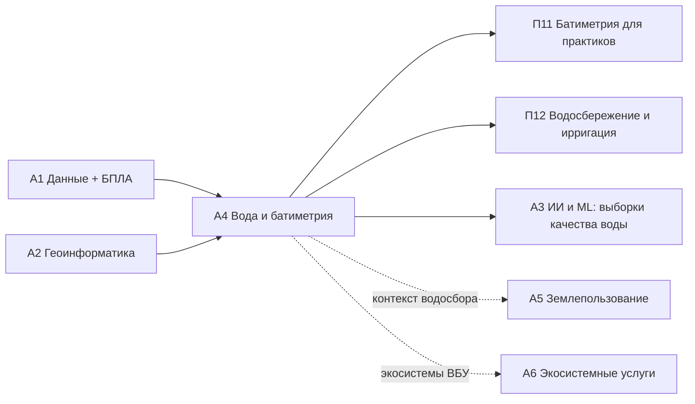

# А4. Водные ресурсы, гидрологический мониторинг, батиметрия

> **Тип:** Академический · **Связь:** [П11](../p11/index.md), [П12](../p12/index.md) · **Компоненты FOLUR:** 2, 3
> **Аудитория:** бакалавриат и магистратура; уровень ИИ-слоя — **Pro-code**.

Модуль формирует полный цикл компетенций по водным ресурсам агроландшафта: от понимания водного баланса степной зоны — через полевую батиметрию на уникальном датасете исполнителя — к спутниковому мониторингу и многолетнему анализу поведения водоёмов. Логика платформы «от инструмента к применению» реализована буквально: каждая лекция завершает слушателя одним работающим инструментом, а практикум собирает их в прикладной продукт.

## Цели модуля

После прохождения модуля слушатель сможет:

1. **[Bloom: знать]** перечислять компоненты водного баланса степного водосбора, методы измерения глубин (эхолот, ADCP, БПЛА-батиметрия), спутниковые источники наблюдения воды (Sentinel-1/2, Landsat, JRC GSW) и наблюдаемые характеристики водоёмов во времени.
2. **[Bloom: понимать]** объяснять формирование стока в условиях Северного Казахстана, происхождение дефектов сырых эхолотных данных, физику водных индексов и радарного контраста, механизмы сезонной динамики и цветения воды.
3. **[Bloom: применять]** обрабатывать сырые батиметрические промеры (фильтрация → интерполяция → карта глубин → объём) и строить маски и ряды NDWI/MNDWI в Google Earth Engine для водоёмов СКО, Костанайской и Акмолинской областей.
4. **[Bloom: анализировать]** сравнивать методы интерполяции по кросс-валидации, отличать тренды от изменчивости и артефактов наблюдения, диагностировать причины изменений водоёма по совокупности открытых данных.
5. **[Bloom: анализировать]** проводить ревью и верификацию геопайплайна, сгенерированного ИИ-агентом, по независимым контрольным данным (опорные глубины).

## Уроки

| # | Урок | Трудозатраты ⏱ | Ключевой навык |
|---|---|---|---|
| 1 | [Сводим водный баланс степного водосбора: от снегозапасов до подземных вод](lectures/01-vodnyj-balans-stepnogo-vodosbora.md) | ~20 мин чтения + ~20 мин практики | качественная оценка баланса по открытым данным |
| 2 | [Превращаем 80 000 сырых промеров в карту глубин водохранилища](lectures/02-karta-glubin-iz-promerov.md) | ~20 мин чтения + ~35 мин практики | конвейер «сырые промеры → карта → объём» |
| 3 | [Находим воду из космоса: строим маски NDWI/MNDWI и читаем радар Sentinel-1](lectures/03-sputnikovyj-monitoring-vody.md) | ~20 мин чтения + ~30 мин практики | маски воды в оптике и радаре, паводковое картирование |
| 4 | [Восстанавливаем годовой цикл водоёма: площадь, уровень, температура, хлорофилл](lectures/04-godovoj-cikl-vodoyoma.md) | ~20 мин чтения + ~30 мин практики | многолетние ряды, «виртуальный гидропост», matchup-выборки |
| П | [Практикум: карта глубин + сезонная динамика NDWI](practicum/01-karta-glubin-i-ndwi.md) | ~90 мин | прикладной продукт модуля |
| ИИ | [ИИ-ассистент в работе: фильтрация промеров под контролем человека](ai-assistant.md) | ~45–60 мин | постановка задачи агенту → ревью → верификация |
| А | [Итоговая аттестация](assessment/final.md) | ~60 мин | банк MCQ + сценарный кейс, порог 75 % |

Нагрузка соответствует нормативу платформы: ~2–2,5 часа контента в неделю; каждый микро-урок закрыт квизом сразу после материала.

## Прикладной продукт модуля

**Карта глубин по сырому батиметрическому датасету исполнителя + сезонная динамика NDWI выбранного водоёма региона.** Продукт собирается в практикуме и включает: очищенный датасет с протоколом фильтрации, карту глубин с изобатами, кривую «уровень–площадь–объём», ряд NDWI-площадей за два сезона с интерпретацией. Всё — на открытом стеке (Python/Colab, GEE), воспроизводимо перезапуском ноутбука.

## Данные модуля

Модуль работает на уникальном учебном ресурсе — **сырых батиметрических данных полевых экспедиций исполнителя** (водохранилище степной зоны Казахстана, 80 000 промеров, глубины 0–16,1 м) — и открытых спутниковых архивах (Sentinel-1/2, Landsat, JRC Global Surface Water, ERA5-Land). Батиметрические данные распространяются по трёхуровневой политике доступа (обезличенный уровень A, обобщённая сетка B, закрытый уровень C) — см. [Датасеты платформы](../../datasets.md). Полный набор: Zenodo, `<DOI будет присвоен при публикации на Zenodo>`.

## ИИ-ассистент в работе · уровень Pro-code

LLM-кодинг-агент (Claude Code / OpenCode) выполняет пакетную фильтрацию эхолотных промеров; слушатель ставит задачу, проводит ревью кода и **верифицирует результат по опорным глубинам**. Подробности — в [ИИ-задании](ai-assistant.md); рамка ИИ-слоя платформы — [здесь](../../ai-tools.md).

*Правило: ИИ ускоряет — человек верифицирует. Задание выполнимо и без ИИ.*

## Место в архитектуре платформы

*Рис. 1. Связи модуля А4. Alt: А4 опирается на навыки модулей А1 и А2, передаёт компетенции профмодулям П11 и П12, поставляет обучающие выборки в А3 и связан контекстом с А5 и А6.*

Пререквизиты: базовые навыки ГИС и Python из [А1](../a1/index.md)/[А2](../a2/index.md) (или параллельное изучение). Продолжение для практиков: [П11](../p11/index.md), [П12](../p12/index.md).

## Оценивание

Тренировочные квизы (3–5 MCQ) — после каждой лекции. Итог: индивидуальный вариант из [банка модуля](assessment/final.md) (порог **75 %**) + сценарный кейс с экспертной проверкой + обязательные артефакты практикума.

## Библиография и рамки

Проверенные международные рамки и первичные источники (DOI не указываются там, где не верифицированы):

1. **FAO.** The 10 Elements of Agroecology: Guiding the transition to sustainable food and agricultural systems. FAO, Rome — рамка агроэкологического подхода, в которой вода рассматривается как элемент устойчивого агроландшафта.
2. **WOCAT** (World Overview of Conservation Approaches and Technologies) — глобальная база практик устойчивого землепользования, включая водосбережение и борьбу с эрозией; источник практик для кейсов водосбора.
3. **ЦУР 15.3 / LDN** (Land Degradation Neutrality, UNCCD) и **индикатор ЦУР 6.6.1** (изменение площади связанных с водой экосистем) — целевые рамки мониторинга, на которые работают методы модуля.
4. **Каталог кейсов FOLUR Impact Program** (Food Systems, Land Use and Restoration, GEF) — контекст интегрированного управления ландшафтами.
5. McFeeters, S. K. (1996). The use of the Normalized Difference Water Index (NDWI) in the delineation of open water features. *International Journal of Remote Sensing*, 17(7).
6. Xu, H. (2006). Modification of normalised difference water index (NDWI) to enhance open water features in remotely sensed imagery. *International Journal of Remote Sensing*, 27(14).
7. Pekel, J.-F., Cottam, A., Gorelick, N., Belward, A. S. (2016). High-resolution mapping of global surface water and its long-term changes. *Nature*, 540 — основа продукта JRC Global Surface Water.
8. Gorelick, N. et al. (2017). Google Earth Engine: Planetary-scale geospatial analysis for everyone. *Remote Sensing of Environment*, 202.
9. Документация Copernicus (Sentinel-1/2), USGS Landsat, ECMWF ERA5-Land — официальные описания используемых данных.
10. SWAT (USDA-ARS / Texas A&M) и HEC-RAS (US Army Corps of Engineers) — официальная документация моделей (обзорный материал лекции 4).

Правовой режим батиметрических данных: [политика датасетов платформы](../../datasets.md); канонический каркас модуля: [шаблон](../../about/module-template.md).
