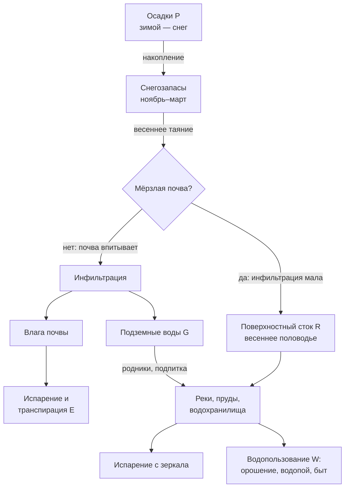

# Сводим водный баланс степного водосбора: от снегозапасов до подземных вод

> ⏱ **Трудозатраты:** ~20 мин чтения + ~20 мин практики
>
> Модуль **А4: Водные ресурсы, гидрологический мониторинг, батиметрия**, лекция 1 из 4.
> Академический уровень. Проект UNDP-KAZ, FOLUR. Компоненты FOLUR: **2**, **3**.

## Цели лекции и место в модуле

Эта лекция — фундамент всего модуля А4. Прежде чем измерять глубины эхолотом (лекция 2) и следить за водоёмами со спутника (лекции 3–4), нужно понимать, откуда вода в степном водоёме берётся, куда уходит и почему её количество так сильно меняется от сезона к сезону и от года к году. Без модели водного баланса любые измерения остаются набором цифр без интерпретации.

После изучения лекции слушатель сможет:

1. **[Bloom: знать]** перечислять компоненты уравнения водного баланса и главные особенности гидрологии степной зоны Северного Казахстана.
2. **[Bloom: понимать]** объяснять, почему до 80–90 % годового стока малых степных рек формируется за короткий период весеннего половодья и как агротехника влияет на этот процесс.
3. **[Bloom: применять]** подбирать открытые источники данных (ERA5-Land, JRC Global Surface Water, данные Казгидромета на data.gov.kz) для качественной оценки компонент баланса конкретного водосбора в СКО, Костанайской или Акмолинской области.
4. **[Bloom: анализировать]** сравнивать вклад поверхностного и подземного питания для разных типов водных объектов региона и выявлять слабые места в доступных данных.

> **Границы лекции.** Внутри: уравнение водного баланса, механизмы формирования стока в степи, роль подземных вод, обзор открытых источников данных. Снаружи: измерение глубин и объёмов водоёма — в [лекции 2](02-karta-glubin-iz-promerov.md); спутниковые индексы воды — в [лекции 3](03-sputnikovyj-monitoring-vody.md); динамика водоёмов во времени — в [лекции 4](04-godovoj-cikl-vodoyoma.md); гидрологические модели SWAT и HEC-RAS упоминаются здесь только по названию, обзор их назначения — в лекции 4. Практическая работа с данными — в [практикуме](../practicum/01-karta-glubin-i-ndwi.md).

---

## 1. Уравнение водного баланса: бухгалтерия воды

### 1.1 Базовое уравнение

Водный баланс — это закон сохранения массы, применённый к воде на выбранной территории за выбранный период. Для любого водосбора (территории, с которой вода стекает в общую точку — реку, озеро, водохранилище) уравнение записывается так:

**P = E + R + G + ΔS**

где P — осадки (precipitation), E — суммарное испарение и транспирация растений (evapotranspiration), R — поверхностный сток (runoff), G — подземный отток (или приток, тогда со знаком минус), ΔS — изменение запасов воды на территории: в снеге, в почве, в озёрах, в подземных горизонтах.

Каждый член уравнения — это не абстракция, а конкретная измеримая величина. Осадки измеряет метеостанция или оценивает реанализ. Испарение оценивается по температуре, ветру и влажности. Сток измеряется гидропостом на реке. Изменение запасов видно по уровню озёр и скважин. Задача гидролога — свести баланс так, чтобы невязка (расхождение между приходом и расходом) была мала и объяснима.

Для водоёма — озера или водохранилища — уравнение переписывается через приток и отток:

**ΔV = (P·A + Q_in + G_in) − (E·A + Q_out + G_out + W)**

где ΔV — изменение объёма воды в водоёме, A — площадь зеркала, Q_in и Q_out — поверхностный приток и сток, G_in и G_out — подземный обмен, W — водозабор на хозяйственные нужды. Обратите внимание: и осадки, и испарение умножаются на площадь зеркала — а площадь степных водоёмов сама сильно меняется в течение года. Это одна из причин, почему в лекциях 3–4 мы будем так внимательно следить за площадью водоёмов по спутниковым снимкам.

### 1.2 Почему степная зона — особый случай

Северный Казахстан относится к зоне недостаточного увлажнения: годовая испаряемость (то количество воды, которое могло бы испариться при неограниченном её наличии) существенно превышает годовую сумму осадков. Это ключевой факт для всей водной тематики региона. Из него следуют три практических вывода.

Во-первых, летние дожди почти не формируют сток. Влага летнего дождя перехватывается сухой почвой и растительностью и быстро испаряется. Реки и пруды летом живут в основном за счёт весенних запасов и подземного питания.

Во-вторых, главный источник воды — снег. Зимние осадки накапливаются в снежном покрове несколько месяцев и затем высвобождаются за короткие недели таяния. Судьба всего гидрологического года решается весной.

В-третьих, значительная часть территории региона — бессточные котловины. Вода, попавшая в такие озёрные понижения, не имеет выхода к речной сети и расходуется только на испарение и фильтрацию. Отсюда обилие в СКО и Акмолинской области солёных и горько-солёных озёр: испарение уносит воду, а соли остаются и накапливаются.



*Рис. 1. Водный баланс степного водосбора Северного Казахстана. Alt: блок-схема: осадки накапливаются в снегозапасах; при таянии по мёрзлой почве вода уходит в поверхностный сток и питает водоёмы, при талой почве — в инфильтрацию, почвенную влагу и подземные воды; водоёмы расходуют воду на испарение и водопользование.*

### 1.3 Испарение: главный расходный член

В зоне недостаточного увлажнения испарение — доминирующая статья расхода, и её стоит понимать чуть глубже. Различают три величины. **Испаряемость** (потенциальное испарение) — сколько воды испарилось бы при её неограниченном наличии; она определяется энергией: температурой, солнечной радиацией, ветром, сухостью воздуха. **Фактическое испарение с суши** ограничено наличием влаги: сухая степь в июле испаряет мало не потому, что не может, а потому что нечего. **Испарение с водной поверхности** близко к испаряемости — вода всегда доступна.

Отсюда важное следствие для водоёмов: каждый гектар водного зеркала в степи летом теряет воду со скоростью, близкой к максимально возможной. Мелкий пруд с большой площадью и малой глубиной — самая «расточительная» форма хранения воды: при том же объёме он подставляет испарению большую поверхность и к тому же быстрее прогревается. Глубокий компактный водоём при равном объёме сохраняет воду заметно дольше. Оценить соотношение «площадь–объём–средняя глубина» конкретного водоёма позволяет батиметрия — это одна из практических мотиваций лекции 2.

Транспирация — испарение через растения — часть того же расходного члена E. Для агронома это «полезное» испарение: вода, прошедшая через посев, конвертирована в урожай. Смысл агрономического управления влагой в степи можно сформулировать на языке баланса так: увеличить долю осадков, уходящую в транспирацию культурных растений, за счёт долей, уходящих в поверхностный сток, физическое испарение с почвы и транспирацию сорняков.

### 1.4 Границы и периоды: как не обмануть себя

Баланс имеет смысл только при явно заданных границах в пространстве и времени. Пространственная граница — водораздел: линия рельефа, разделяющая соседние водосборы. Определяется она по цифровой модели рельефа (ЦМР) стандартными ГИС-инструментами — навык из модуля [А2](../../a2/index.md). Ошибка в границе водосбора — типичный источник грубых ошибок баланса: приток «не с той» территории.

Временной период выбирают по задаче. Гидрологический год в наших условиях удобно начинать осенью (с начала накопления снега), чтобы снегозапасы не разрывались между двумя годами. Для многолетних оценок берут периоды от 10 лет: короткие ряды в степной зоне обманчивы из-за чередования групп влажных и сухих лет. Сравнение «этот год против прошлого» почти никогда не говорит о тренде — только о месте двух лет внутри естественной изменчивости.

### 1.5 Невязка баланса и зачем она нужна

Идеально сведённый баланс в реальной практике встречается редко: у каждого члена уравнения есть погрешность. Осадки на метеостанции могут не совпадать с осадками на водосборе в 40 км от неё; испарение — всегда оценка по формулам; подземный обмен чаще всего вообще не измеряется напрямую. Невязка баланса — честная мера нашего незнания. Если невязка систематически велика, это диагноз: либо есть неучтённый член (например, незарегистрированный водозабор), либо данные по одному из членов плохи. Умение видеть невязку и рассуждать о её причинах — базовый навык анализа, который мы будем применять и к батиметрии (расхождение повторных съёмок в лекции 2), и к спутниковым рядам (расхождение оптики и радара в лекции 3).

> **Подробнее** о работе с погрешностями и пропусками в данных — в модуле [А1](../../a1/index.md) (жизненный цикл данных).

---

## 2. Поверхностный сток: несколько недель, которые решают всё

### 2.1 Механика весеннего половодья

Снег накапливается на полях с ноября по март. К началу таяния на водосборе лежит водный эквивалент нескольких десятков миллиметров осадков — фактически «замороженный резервуар». Дальше всё зависит от трёх факторов: запаса воды в снеге, интенсивности таяния (дружная тёплая весна против затяжной) и состояния почвы под снегом.

Последний фактор — самый интересный для агрария. Если почва ушла в зиму сухой и промёрзла глубоко, талая вода почти не впитывается: лёд в порах запечатывает почву, и вода скатывается по поверхности в ложбины, лога и реки. Получается высокое, резкое половодье. Если же почва ушла в зиму влажной, промёрзла меньше, а весна затяжная — значительная часть талой воды успевает впитаться, пополняя почвенную влагу и подземные горизонты, а половодье получается низким.

Для гидрологии степной зоны это означает высокую межгодовую изменчивость: соседние годы могут отличаться по объёму весеннего стока в разы. Планирование водохранилищ, прудов и систем водоснабжения в регионе обязано учитывать и «пустые» годы, и экстремальные половодья. Весна 2024 года, когда паводки охватили северные области Казахстана, включая СКО, Костанайскую и Акмолинскую области, стала наглядным напоминанием о верхнем крае этой изменчивости; количественный анализ таких событий по радарным снимкам мы разберём в лекции 3.

### 2.2 Агротехника как гидрологический фактор

Поле — это не пассивная поверхность, а управляемый элемент водосбора. Приёмы, которыми хозяйство управляет снегом и почвой, напрямую меняют члены водного баланса:

- **Снегозадержание** (кулисы, стерня, полосное размещение культур) увеличивает снегозапасы на поле — больше влаги весной достаётся почве, меньше уносится ветром в овраги.
- **No-till и стерневые фоны** оставляют на поверхности растительные остатки: снег ложится равномернее, почва промерзает мягче, инфильтрация талых вод растёт. Подробно агрономическая сторона — в модуле [А5](../../a5/index.md) и профмодуле П8.
- **Лесополосы** снижают скорость ветра, задерживают снег и уменьшают испарение с прилегающих полей; их экосистемная роль обсуждается в модуле [А6](../../a6/index.md).
- **Пруды и запруды на логах** перехватывают весенний сток для летнего использования — но одновременно уменьшают приток в нижележащие водоёмы. Любое такое решение перераспределяет воду внутри водосбора, а не создаёт её.

Таким образом, водный баланс — язык, на котором агроном и гидролог могут обсуждать последствия решений: перевод полей на no-till меняет соотношение R и I (сток/инфильтрация), строительство пруда меняет Q_in нижнего водохранилища.

### 2.3 Речная сеть региона

Крупнейшая река рассматриваемых областей — Есиль (Ишим), протекающая через Акмолинскую и Северо-Казахстанскую области; на ней созданы водохранилища сезонного и многолетнего регулирования, снабжающие водой Астану и Петропавловск (в том числе Астанинское и Сергеевское водохранилища). Западнее, в Костанайской области, главная водная артерия — Тобыл (Тобол) с каскадом водохранилищ. Режим всех этих рек — классический степной: резко выраженное весеннее половодье и длительная летне-зимняя межень, когда река питается в основном подземными водами. Малые реки летом нередко пересыхают или распадаются на плёсы.

Точные характеристики стока конкретных рек (объёмы, обеспеченность, даты пика) — предмет официальных данных гидрометслужбы; в учебных задачах мы будем оценивать динамику качественно по открытым спутниковым данным, а там, где нужны числовые ряды наблюдений, — указывать, что они запрашиваются у РГП «Казгидромет» или ищутся на портале открытых данных data.gov.kz.

### 2.4 Сток несёт не только воду: эрозия и заиление

Весенний сток по распаханному водосбору — главный агент водной эрозии. Талая вода смывает с полей мелкозём, органику и остатки удобрений и несёт их вниз — в лога, пруды и водохранилища. Для поля это потеря плодородного слоя (тема модуля А5), для водоёма — заиление: твёрдый сток осаждается в чаше, год за годом сокращая полезный объём. Малые пруды на логах в распаханной степи заиливаются особенно быстро, потому что перехватывают наносы с ближайших полей первыми.

Заиление коварно тем, что снаружи не видно: площадь зеркала может не меняться, уровень — держаться, а объём под зеркалом тает. Единственный способ измерить заиление — сравнить батиметрические съёмки разных лет, то есть построить две карты глубин и вычесть одну из другой. Как это делается технически, мы разберём в лекции 2; здесь зафиксируем гидрологическую суть: **заиление водоёма — это индикатор эрозии на водосборе.** Мутный шлейф весеннего притока, кстати, виден и на спутниковых снимках — оптический мониторинг мутности обзорно затронем в лекции 4.

Вынос биогенов (азота и фосфора с удобрениями) — второй «невидимый груз» стока. В водоёме биогены работают так же, как на поле: подстёгивают рост, но уже водорослей. Летнее цветение воды в степных прудах — во многом продукт весеннего смыва с полей. К этой связи мы вернёмся в лекции 4, говоря о качестве воды и хлорофилле-а.

> **Подробнее** о построении масок воды и наблюдении половодья со спутника — в [лекции 3](03-sputnikovyj-monitoring-vody.md).

---

## 3. Подземные воды: невидимая половина баланса

### 3.1 Что такое водоносный горизонт

Подземные воды — это вода, заполняющая поры и трещины горных пород. Первый от поверхности постоянный водоносный горизонт называется грунтовыми водами: у них есть свободная поверхность (зеркало), они питаются инфильтрацией сверху и потому реагируют на сезоны — поднимаются после снеготаяния, снижаются к концу лета. Глубже залегают напорные (артезианские) горизонты, изолированные водоупорами; их питание происходит на удалённых площадях, и связь с текущей погодой слабая.

Для степной зоны подземные воды — стратегический ресурс: это питание рек в межень, источник сельского водоснабжения (скважины, колодцы) и водопоя. При этом их состояние трудно наблюдать: зеркало грунтовых вод не видно со спутника, а сеть наблюдательных скважин разрежена.

### 3.2 Взаимодействие с поверхностными водами

Озеро или пруд в степи почти всегда связан с грунтовыми водами: либо водоём подпитывает горизонт (фильтрация из водоёма), либо горизонт подпитывает водоём. Направление обмена зависит от соотношения уровней и может меняться по сезонам. Практическое следствие: два внешне похожих озера могут вести себя совершенно по-разному. Озеро с устойчивым подземным питанием переживает засушливые годы; озеро, живущее только весенним стоком, за пару сухих лет может почти исчезнуть — а его площадь на спутниковых снимках будет «дышать» с большой амплитудой. Именно многолетние ряды площадей (лекция 4) — самый доступный косвенный индикатор типа питания водоёма.

С подземными водами связана и проблема засоления. Там, где минерализованные грунтовые воды подходят близко к поверхности (например, при подъёме уровня из-за избыточного орошения), испарение подтягивает влагу вверх, и соли накапливаются в корнеобитаемом слое. Агроэкологические аспекты засоления разбираются в модуле А5; здесь важно понять гидрологический механизм: засоление — это водный баланс, сведённый в неудачном месте.

### 3.3 Что можно узнать без бурения

Прямые данные о подземных водах (уровни в скважинах, минерализация) — ведомственная информация гидрогеологической службы. Но косвенные признаки доступны каждому:

- устойчивость малых водоёмов в засушливые годы (по многолетним спутниковым рядам);
- зимний сток рек — река, текущая подо льдом в феврале, питается подземными водами;
- растительность-индикатор: тростниковые займища и луга в сухой год выдают близкое зеркало грунтовых вод (индексы растительности — модуль А3);
- рельеф: подземный сток разгружается в понижениях, у подножий склонов.

Обзорно упомянем и спутниковую гравиметрию (миссии GRACE/GRACE-FO): она фиксирует изменение общих запасов воды, включая подземные, но с разрешением в сотни километров — это инструмент масштаба крупных бассейнов, не отдельного хозяйства.

### 3.4 Вода как общий ресурс водосбора

Завершим раздел управленческим наблюдением. Все водопользователи одного водосбора связаны уравнением баланса, нравится им это или нет. Запруда в верховье уменьшает приток нижним; интенсивный отбор из скважин снижает уровень грунтовых вод и подземное питание соседних колодцев и озёр; распашка склонов ускоряет заиление общего водохранилища. Ни одно из этих воздействий не «создаёт» и не «уничтожает» воду — оно перераспределяет её между пользователями и между статьями расхода.

Поэтому серьёзные водные решения в РК проходят через процедуры согласования с уполномоченными органами водного хозяйства, а споры водопользователей разрешаются на уровне бассейновых структур. В рамках этого модуля мы не разбираем правовые процедуры — но даём инструментальную базу для них: аргументированная позиция в водном споре опирается на данные, и большая часть этих данных, как мы увидели, доступна бесплатно. Умение показать на спутниковом ряду, когда именно появилась запруда соседа и как после этого повёл себя ваш пруд, — это переговорная позиция совсем другого качества, чем устные воспоминания.

Экономическая сторона водопользования — субсидии, проекты водосбережения — рассматривается в профессиональных модулях [П12](../../p12/index.md) и П14.

---

## 4. Откуда брать данные: открытые источники для оценки баланса

### 4.1 Карта источников

Полноценное измерение всех членов баланса доступно только государственной сети наблюдений. Однако для учебных и предварительных оценок открытых данных достаточно. Сведём их в таблицу:

| Компонент баланса | Открытый источник | Что даёт | Ограничение |
|---|---|---|---|
| Осадки P | Реанализ ERA5-Land (ECMWF, доступен в GEE) | Ряды осадков с ~9-км сеткой с 1950 г. | Сглаживает локальные ливни |
| Осадки P (наземные) | Данные метеонаблюдений, data.gov.kz / Казгидромет | Точечные наблюдения | Разреженная сеть, доступ к рядам по запросу |
| Испарение E | ERA5-Land (потенциальное и фактическое испарение) | Оценка модельная | Погрешность в степной зоне заметна |
| Снегозапасы S | ERA5-Land (водный эквивалент снега); оптические снимки — площадь заснеженности | Динамика накопления/таяния | Водный эквивалент — модельная оценка |
| Площадь водоёмов A | Sentinel-2, Landsat, JRC Global Surface Water | Ряды площадей с 1984 г. (30 м) | Только площадь, не объём |
| Сток R | Гидропосты (ведомственные) | Прямое измерение | В открытом доступе рядов мало |
| Подземные воды G | Косвенные признаки; GRACE (обзорно) | Качественная оценка | Прямых открытых данных нет |

Ключевой вывод из таблицы: **площадь водного зеркала — единственный член водного баланса, который непрерывно и бесплатно наблюдается из космоса с 1980-х годов.** Поэтому спутниковый мониторинг площадей (лекции 3–4) — главный рабочий инструмент модуля. А чтобы превратить площадь в объём — величину, которая и нужна водопользователю, — требуется знать форму чаши водоёма, то есть батиметрию (лекция 2). Так три темы модуля смыкаются в одну технологическую цепочку.

### 4.2 Рецепт качественной оценки баланса за один вечер

Соберём материал лекции в пошаговый рабочий порядок, который применим к любому малому водоёму региона. Именно по этой схеме построен региональный кейс ниже и часть практикума.

**Шаг 1. Определите границы.** Найдите водоём на снимке (Sentinel-2 в GEE или любой открытый вьюер), очертите примерный водосбор по рельефу. Для лога достаточно глазомерной оценки по горизонталям ЦМР; для точной работы — инструменты гидрологического анализа ГИС из модуля А2.

**Шаг 2. Оцените приход.** Постройте по ERA5-Land ряды осадков, отдельно выделив зимние месяцы (ноябрь–март): это потенциал весеннего притока. Отметьте, как текущая зима выглядит на фоне 10–15 предыдущих.

**Шаг 3. Оцените состояние.** Постройте ряд площадей зеркала по Sentinel-2/Landsat (методика — лекция 3). Сопоставьте: следуют ли максимумы площади за снежными зимами? Запаздывание и амплитуда отклика расскажут о типе питания.

**Шаг 4. Найдите контрольную группу.** Выберите 2–3 соседних водоёма со схожим водосбором и повторите шаг 3. Синхронное поведение — климатический сигнал; расхождение — локальные факторы (водозабор, перехват стока, прорыв/ремонт плотины).

**Шаг 5. Сформулируйте вывод с оговорками.** Запишите, какие члены баланса вы оценили, какие остались неизвестными (почти всегда — подземный обмен и фактический водозабор), и какие полевые данные сняли бы неопределённость.

Такой качественный анализ не заменяет инженерного расчёта, но переводит разговор о воде из области впечатлений («раньше воды было больше») в область проверяемых утверждений — а это и есть главная цель модуля.

### 4.3 Глобальный контекст: ЦУР и FOLUR

Умение оценивать состояние водных объектов по открытым данным — не только локальная задача. Индикатор ЦУР 6.6.1 «Изменение площади связанных с водой экосистем» рассчитывается именно по спутниковым рядам площадей воды (на основе набора JRC Global Surface Water); ЦУР 15.3 о нейтральном балансе деградации земель (LDN) включает водную компоненту деградации. Программа FOLUR рассматривает воду как часть интегрированного управления ландшафтом: состояние водоёмов отражает то, что происходит на всём водосборе — эрозию, заиление, вынос удобрений. Оценка водоёма — это всегда оценка землепользования вокруг него.

---

## Региональный кейс

**Ситуация:** Фермерское хозяйство в Акмолинской области использует для водопоя и технических нужд пруд на логу, наполняющийся талыми водами. За последние годы хозяйство заметило, что к концу лета пруд мелеет сильнее обычного. Руководство обсуждает два объяснения: «стало меньше снега» и «выше по логу соседи построили запруду». Прежде чем предъявлять претензии соседям, агроном решает разобраться в водном балансе пруда по открытым данным.

**Данные:** ERA5-Land (ряды осадков и водного эквивалента снега по ячейке, покрывающей водосбор; доступен в каталоге Google Earth Engine), Sentinel-2 и JRC Global Surface Water (ряды площади зеркала пруда и соседних водоёмов), OpenStreetMap (границы, дороги, гидрография для привязки).

**Задача:**

1. По ERA5-Land построить ряд зимних осадков за последние 10–15 лет: есть ли тренд снижения снегозапасов?
2. По спутниковым рядам сравнить динамику площади своего пруда и 2–3 соседних водоёмов на других логах: мелеют ли все водоёмы синхронно или только «наш»?
3. Сформулировать вывод: какой из членов баланса (P, Q_in, E, W) наиболее вероятно изменился?

**Разбор:** Логика разделения причин следующая. Если зимние осадки снизились, это ударит по всем прудам округи одинаково — синхронное снижение площадей укажет на климатический фактор. Если же соседние водоёмы стабильны, а мелеет только пруд хозяйства, значит, изменился локальный член баланса: приток Q_in (перехват стока новой запрудой выше по логу — её появление, кстати, тоже видно на снимках Sentinel-2) либо расход W (вырос собственный водозабор). Точные объёмы по открытым данным не вычислить — но для аргументированного разговора с соседями и акиматом качественного сравнительного анализа достаточно. Этот способ рассуждения — «сравни объект с контрольной группой соседей» — будет постоянно использоваться в лекциях 3–4.

---

## Закрепление и применение

!!! example "Попробуйте в Colab"
    Откройте ноутбук лекции (`<URL будет назначен при создании репозитория ноутбуков>`) и постройте по ERA5-Land график месячных осадков и водного эквивалента снега для любой точки Акмолинской области за последние 10 лет. Найдите на графике «снежные» и «малоснежные» зимы. Задание выполнимо и без ИИ-ассистента; как ускорить его с Claude Code — в [ИИ-задании модуля](../ai-assistant.md).

!!! warning "Границы применимости"
    Реанализ ERA5-Land — модельный продукт с ячейкой ~9 км: он передаёт межгодовую изменчивость и сезонный ход, но не заменяет наземные наблюдения для юридически значимых оценок (споры о водопользовании, проектирование ГТС). Для таких задач нужны официальные данные Казгидромета и уполномоченных органов. Спутниковые ряды площадей — косвенный индикатор: они не измеряют объём и уровень напрямую.

!!! tip "Что это даёт вашему хозяйству"
    Понимание водного баланса позволяет заранее оценить последствия решений: сколько влаги добавит полю снегозадержание, что произойдёт с прудом при строительстве запруды выше по логу, почему мелеет колодец. Диагностика «климат или сосед» по открытым данным — бесплатна и занимает вечер работы.

!!! question "Кейс для размышления"
    Бессточное солёное озеро в СКО за 20 лет заметно сократило площадь. Перечислите все гипотезы в терминах членов водного баланса и подумайте, какие открытые данные позволили бы отбраковать каждую из них. Что здесь принципиально нельзя узнать без полевых работ?

### Проверь себя

```quiz
[
  {
    "q": "Какой источник даёт основную часть годового стока малых рек степной зоны Северного Казахстана?",
    "options": ["Летние ливневые дожди", "Осенние обложные дожди", "Постоянное подземное питание", "Таяние снегозапасов весной"],
    "answer": 3,
    "explain": "§1.2 и §2.1: зимние осадки накапливаются в снежном покрове и высвобождаются за короткий период таяния; летние дожди перехватываются сухой почвой и испаряются, почти не формируя сток."
  },
  {
    "q": "Почему промерзание сухой почвы осенью приводит к более высокому весеннему половодью?",
    "options": ["Лёд в порах запечатывает почву, талая вода не впитывается и стекает по поверхности", "Промерзание увеличивает снегозапасы на поле", "Мёрзлая почва ускоряет таяние снега", "Мёрзлая почва испаряет больше влаги"],
    "answer": 0,
    "explain": "§2.1: глубоко промёрзшая сухая почва почти не пропускает талую воду — инфильтрация мала, и вода уходит в поверхностный сток, формируя резкое половодье."
  },
  {
    "q": "Какой член водного баланса непрерывно наблюдается по открытым спутниковым данным с 1980-х годов?",
    "options": ["Водный эквивалент снега наземной съёмкой", "Подземный отток", "Расход воды на гидропостах", "Площадь водного зеркала водоёмов"],
    "answer": 3,
    "explain": "§4.1: архив Landsat и производный набор JRC Global Surface Water дают ряды площадей воды с 1984 г.; сток и подземные воды в открытом доступе практически не представлены."
  },
  {
    "q": "Пруд хозяйства мелеет, а соседние водоёмы на других логах стабильны. Какое объяснение наиболее вероятно?",
    "options": ["Началось региональное снижение уровня грунтовых вод", "Выросло испарение из-за потепления климата", "Снизились зимние осадки по всему району", "Изменился локальный приток или водозабор именно этого пруда"],
    "answer": 3,
    "explain": "Региональный кейс: климатические факторы (осадки, испарение, грунтовые воды) действовали бы на все водоёмы округи синхронно; избирательное обмеление указывает на локальный член баланса — перехват притока или рост водозабора."
  },
  {
    "q": "Что такое невязка водного баланса?",
    "options": ["Сезонное колебание уровня грунтовых вод", "Расхождение между приходной и расходной частями уравнения из-за погрешностей и неучтённых членов", "Разница между осадками и испарением", "Ошибка калибровки эхолота"],
    "answer": 1,
    "explain": "§1.5: невязка — мера расхождения сведённого баланса; систематически большая невязка указывает на плохие данные или неучтённый член, например незарегистрированный водозабор."
  }
]
```

### Контрольные вопросы

1. Запишите уравнение водного баланса водоёма и назовите каждый член. *(Bloom: знать)*
2. Объясните, почему в бессточных котловинах степной зоны накапливаются соли. *(Bloom: понимать)*
3. Подберите открытые источники данных для оценки водного баланса пруда в Костанайской области и укажите, какие члены баланса останутся неизвестными. *(Bloom: применять/анализировать)*

## Что дальше?

Мы разобрались, откуда в степном водоёме вода. Следующий шаг — узнать, **сколько** её там: в [лекции 2 «Превращаем 80 000 сырых промеров в карту глубин водохранилища»](02-karta-glubin-iz-promerov.md) мы возьмём реальный эхолотный датасет и пройдём путь от сырых промеров до карты глубин и кривой объёма. Связанные материалы: программа модуля — [index](../index.md); политика данных платформы — [Датасеты](../../../datasets.md); агроэкологический контекст водосбора — модуль [А5](../../a5/index.md).
