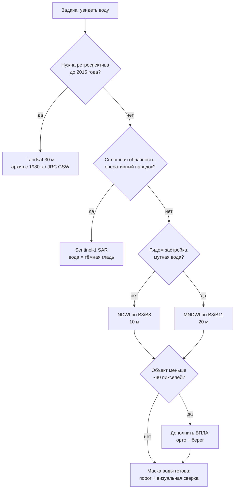

# Находим воду из космоса: строим маски NDWI/MNDWI и читаем радар Sentinel-1

> ⏱ **Трудозатраты:** ~20 мин чтения + ~30 мин практики
>
> Модуль **А4: Водные ресурсы, гидрологический мониторинг, батиметрия**, лекция 3 из 4.
> Академический уровень. Проект UNDP-KAZ, FOLUR. Компоненты FOLUR: **2**, **3**.

## Цели лекции и место в модуле

В лекции 1 мы установили, что площадь водного зеркала — единственный член водного баланса, наблюдаемый бесплатно и непрерывно из космоса. Эта лекция даёт инструменты такого наблюдения: водные индексы по оптическим снимкам Sentinel-2 и Landsat и радарные данные Sentinel-1, которым не мешают облака. На выходе вы умеете строить маску воды на любую дату для любого водоёма региона и понимаете, когда оптика лжёт и почему радар видит паводок сквозь облачность и ночью.

После изучения лекции слушатель сможет:

1. **[Bloom: знать]** перечислять спектральные каналы Sentinel-2, используемые для выделения воды, формулы NDWI и MNDWI и характеристики миссий Sentinel-1/2 и Landsat.
2. **[Bloom: понимать]** объяснять физические основания водных индексов и радарного контраста воды, а также типовые источники ошибок (тени, снег, мутность, ветровая рябь, спекл).
3. **[Bloom: применять]** строить маски воды по NDWI/MNDWI в Google Earth Engine для водоёмов СКО, Костанайской и Акмолинской областей и картировать зону затопления по Sentinel-1.
4. **[Bloom: анализировать]** выбирать сенсор и индекс под задачу (оперативный паводок, многолетний ряд, малый пруд) и оценивать надёжность полученной маски.

> **Границы лекции.** Внутри: физика оптического и радарного наблюдения воды, индексы NDWI/MNDWI, пороги, паводковое картирование, роль БПЛА как дополнения. Снаружи: гидрологический смысл наблюдаемой динамики — в [лекции 1](01-vodnyj-balans-stepnogo-vodosbora.md); перевод площадей в объёмы через батиметрию — в [лекциях 2](02-karta-glubin-iz-promerov.md) и [4](04-godovoj-cikl-vodoyoma.md); построение многолетних рядов и трендов — в [лекции 4](04-godovoj-cikl-vodoyoma.md). Общие основы ДЗЗ (орбиты, разрешение, каналы) даёт модуль [А1](../../a1/index.md), работу с GEE и классификацию — модуль [А3](../../a3/index.md).

---

## 1. Оптика: как вода выглядит в спектре

### 1.1 Спектральный портрет воды

Чистая вода — один из самых «контрастных» объектов дистанционного зондирования. В видимом диапазоне она отражает немного (и тем меньше, чем длиннее волна), а в ближнем инфракрасном (NIR) и коротковолновом инфракрасном (SWIR) поглощает излучение почти полностью. Растительность ведёт себя противоположно: ярко отражает в NIR. Голая почва умеренно отражает везде. На этом контрасте построены все водные индексы: вода — единственный распространённый объект, который в инфракрасных каналах темнее, чем в зелёном.

Рабочие каналы Sentinel-2 для водной тематики: B3 (зелёный, 10 м), B8 (NIR, 10 м), B11 (SWIR, 20 м). Спутники Sentinel-2 работают парой, обеспечивая повторную съёмку каждые ~5 суток — достаточно, чтобы поймать динамику половодья, если повезёт с облачностью. Архив Landsat (серия спутников USGS/NASA, оптические данные с разрешением 30 м, непрерывно с 1980-х годов) — машина времени для ретроспективы: как выглядело озеро до распашки целинных залежей вокруг него, Sentinel не скажет, а Landsat 5 — покажет.

### 1.2 NDWI: первый инструмент

Нормализованный разностный водный индекс NDWI (McFeeters, 1996) использует пару «зелёный–NIR»:

**NDWI = (Green − NIR) / (Green + NIR)** — для Sentinel-2: (B3 − B8) / (B3 + B8).

У воды зелёное отражение больше инфракрасного, и NDWI положителен; у растительности и почвы NIR доминирует, и индекс отрицателен. Классическая стартовая граница «вода/не вода» — NDWI > 0, но универсального порога не существует: он плавает в зависимости от мутности воды, состояния атмосферы и сезона. Правильная практика — подобрать порог по своему снимку, визуально сверяясь с исходным изображением, либо использовать автоматический порог (например, метод Оцу, разделяющий гистограмму на два класса).

Достоинство NDWI — оба канала имеют разрешение 10 м: маска воды получается максимально детальной для бесплатных данных. Это важно для малых степных прудов, где каждый пиксель на счету: объект 50×50 м — это всего 25 пикселей Sentinel-2 и лишь 2–3 пикселя Landsat.

Терминологическое предупреждение: аббревиатурой NDWI обозначают и другой индекс — по паре NIR/SWIR (Гао, 1996), который измеряет влагосодержание растительности, а не открытую воду. Встретив «NDWI» в чужой статье или коде, первым делом проверьте формулу: индексы решают разные задачи, и перепутать их — типичная ошибка начинающих.

### 1.3 MNDWI: когда вокруг постройки и мутная вода

Модифицированный индекс MNDWI (Xu, 2006) заменяет NIR на SWIR:

**MNDWI = (Green − SWIR) / (Green + SWIR)** — для Sentinel-2: (B3 − B11) / (B3 + B11).

Мотивация замены: застроенные территории и некоторые почвы в NIR выглядят «похоже на воду» и загрязняют NDWI-маску, а в SWIR вода поглощает ещё сильнее, и контраст с застройкой и мутной водой лучше. MNDWI обычно чище разделяет воду и населённые пункты, увереннее берёт мутную весеннюю воду. Цена — разрешение: B11 имеет 20 м, и итоговая маска грубее. Практическое правило: для природных ландшафтов и максимальной детальности — NDWI; вблизи посёлков, при мутной воде — MNDWI; в сомнении — посчитать оба и сравнить (в GEE это две строки кода).

### 1.4 Чем оптика обманывает

Каталог типовых ошибок оптических масок воды стоит знать наизусть.

- **Облака и их тени.** Облако скрывает объект; тень от облака темна во всех каналах и легко классифицируется как вода. Обязательный шаг — маскирование облаков (у Sentinel-2 L2A есть слой классификации сцены SCL, у Landsat — флаги QA).
- **Тени рельефа и застройки.** Механизм тот же: тёмный пиксель похож на воду. В равнинном Северном Казахстане рельефные тени — редкость, но лесополосы и строения дают локальные артефакты.
- **Снег и лёд.** Весной по NDWI тающий снег и вскрывающийся лёд дают сигналы, похожие на воду; ряды площадей в период ледостава и таяния нужно интерпретировать с осторожностью — это не «площадь жидкой воды».
- **Зарастание.** Тростниковые займища — визитная карточка степных озёр СКО — со спутника выглядят растительностью, хотя стоят в воде. Оптическая «площадь воды» мелководного заросшего озера систематически меньше фактической площади акватории. Это не ошибка алгоритма, а свойство наблюдения, о котором надо помнить при интерпретации.
- **Ветровая мутность и цветение.** Взвесь и водоросли повышают отражение воды в видимом и NIR; индекс снижается, порог может «потерять» часть акватории.

### 1.5 Малые объекты: субпиксельный предел

Отдельно оговорим предел, о который разбиваются ожидания новичков: **смешанные пиксели**. Пиксель 10×10 м на границе воды и суши содержит и то и другое; его индекс — промежуточный, и куда он попадёт при пороговании, зависит от доли воды в пикселе и от порога. Для крупного озера граничные пиксели — доли процента площади, и ошибка ничтожна. Для пруда 60×80 м граничными являются едва ли не половина пикселей: оценка площади становится грубой, а её колебания от даты к дате — наполовину шумом порогования, а не гидрологией.

Практические следствия. Ряды площадей малых объектов сглаживают и интерпретируют только по выраженным изменениям, а не по каждой флуктуации. Сам порог фиксируют на весь ряд (менять порог между датами — значит измерять разными линейками). Объекты меньше ~10 пикселей — кандидаты на съёмку БПЛА (§3). И наконец, деталь для внимательных: систематическое смещение порога вносит систематическое смещение площади — при сравнении своего ряда с чужим (например, с продуктом JRC) расхождение уровней ещё не означает ничьей ошибки, если тренды согласованы.

### 1.6 Уровни обработки: почему мы берём L2A

Спутниковые данные распространяются в разных уровнях обработки, и для водных индексов выбор не безразличен. Уровень L1C Sentinel-2 — отражение «на верхней границе атмосферы»: в него вмешаны рассеяние и поглощение воздуха, дымка, аэрозоли. Уровень L2A — отражение у поверхности после атмосферной коррекции; вместе с ним поставляется слой классификации сцены SCL, где уже размечены облака, тени, снег и, кстати, вода (грубо). Для количественной работы с индексами стандарт — L2A: атмосферная дымка искажает именно синие-зелёные каналы, на которых стоит NDWI.

Практические следствия. Первое: пороги индексов, подобранные на L1C и L2A, различаются — нельзя переносить порог между уровнями обработки. Второе: сравнивая даты между собой (а весь мониторинг — это сравнение дат), используйте один уровень обработки и одну коллекцию на протяжении всего ряда. Третье: слой SCL — быстрый инструмент маскирования облаков, но его собственные ошибки (пропущенные полупрозрачные облака, ложные тени) никто не отменял: медианные композиции из §4.1 подстраховывают и здесь.

Аналогичная логика у Landsat: коллекции уровня 2 (surface reflectance) с QA-флагами — рабочий выбор для рядов. Смешивать в одном ряду Landsat и Sentinel-2 без взаимной калибровки не стоит: каналы близки, но не идентичны, и на стыке двух сенсоров появится ложный «скачок» площади. Если длинный ряд всё же нужно продлить из эпохи Landsat в эпоху Sentinel, корректный приём — период перекрытия: несколько лет оба сенсора наблюдали одни и те же объекты, и по перекрытию оценивается систематическая поправка между рядами.



*Рис. 1. Выбор инструмента наблюдения воды под задачу. Alt: дерево решений — при необходимости ретроспективы выбирается Landsat/JRC GSW; при облачности и паводке — радар Sentinel-1; вблизи застройки и при мутной воде — MNDWI; иначе NDWI; малые объекты дополняются съёмкой БПЛА; итог — маска воды с подобранным порогом и визуальной проверкой.*

---

## 2. Радар Sentinel-1: вода сквозь облака

### 2.1 Физика радарного контраста

Sentinel-1 — радар с синтезированной апертурой (SAR) C-диапазона. Он сам излучает микроволновый сигнал и измеряет обратное рассеяние — долю энергии, вернувшуюся к антенне. Микроволнам безразличны облака, дым и время суток: радар снимает всегда. Это делает его незаменимым для главного водного события региона — весеннего половодья, которое как раз приходится на сезон плотной облачности.

Спокойная вода для радара — зеркало: наклонно падающий сигнал отражается от глади вперёд, к антенне почти ничего не возвращается, и вода выглядит **чёрной**. Шероховатость здесь понимается относительно длины волны: для C-диапазона (~5,5 см) рябь высотой в сантиметры — уже «шероховатая» поверхность. Пашня, стерня и трава рассеивают сигнал во все стороны и выглядят серыми; постройки и стволы у воды дают яркие «двойные отскоки». Отсюда базовый алгоритм паводкового картирования: тёмные пиксели ниже порога обратного рассеяния = вода. Порог, как и в оптике, подбирается по гистограмме сцены (тот же метод Оцу) или по эталонным участкам заведомой воды.

### 2.2 Чем радар обманывает

У SAR свой каталог ловушек. **Ветровая рябь** делает воду шероховатой — сигнал частично возвращается, и ветреное озеро «светлеет», рвя маску. **Спекл** — зернистый мультипликативный шум, врождённое свойство когерентной радиолокации: одиночный тёмный пиксель ничего не значит, перед порогованием применяют фильтрацию спекла (усреднение, медианные или специализированные фильтры). **Гладкие не-водные поверхности** — мокрый солончак, накатанная грунтовая дорога, ровный лёд — тоже темны и маскируются под воду. **Затопленная растительность** ведёт себя наоборот: вода под тростником из-за двойного отскока «стебель–вода» может выглядеть ярче суши.

Поэтому золотое правило: радарную маску паводка сверяют с контекстом — рельефом (вода не стоит на склонах), гидрографической сетью, любым доступным оптическим снимком ближайшей даты. Комбинация «Sentinel-1 для оперативности + Sentinel-2 для контроля в разрывах облачности» — стандарт паводкового мониторинга.

Полезно понимать и организационный контекст: на этих же принципах работают международные сервисы экстренного картирования (например, служба Copernicus Emergency Management Service, активируемая при крупных бедствиях). Умение построить радарную маску самостоятельно не отменяет их продуктов, но даёт независимость: сервис активируется не для каждого района и не в каждый день, а ваш конвейер — всегда под рукой.

### 2.3 Паводковое картирование: разность «до/во время»

Надёжнее одиночного порога работает **изменение** между датами: берём снимок до половодья (например, февраль) и в пик, вычисляем отношение или разность обратного рассеяния. Пиксели, бывшие серыми и ставшие чёрными, — новая вода, то есть зона затопления. Постоянные водоёмы при этом исключаются автоматически: они темны на обоих снимках. Результат — карта затопления, из которой в ГИС (модуль А2) получаются оценки: площадь залитых сельхозугодий, затронутые дороги и постройки. Весна 2024 года, когда паводки охватили северные области Казахстана, показала практическую ценность именно этого конвейера: оптические спутники неделями не видели землю сквозь облака, тогда как Sentinel-1 продолжал снимать по расписанию.

### 2.4 Что именно скачивать: продукт GRD и поляризации

Для наших задач используется продукт Sentinel-1 **GRD** (Ground Range Detected) — амплитудные изображения, приведённые к земной поверхности; в GEE коллекция `COPERNICUS/S1_GRD` уже прошла базовую калибровку и представлена в децибелах. Каждая сцена несёт одну-две **поляризации** — комбинации ориентации излучённой и принятой волны. Над сушей стандартна пара VV+VH. Для воды информативнее VH: кросс-поляризованный канал слабее реагирует на зеркальное отражение ряби, и контраст «вода–суша» в нём часто устойчивее к ветру; надёжная практика — смотреть оба канала и выбирать по гистограмме конкретной сцены.

Ещё две особенности, о которых надо знать. **Геометрия обзора:** радар смотрит вбок, а не вниз, поэтому один и тот же район снимается с восходящих и нисходящих орбит под разными углами; смешивать орбиты в одном ряду изменений не следует — берите серию с одной геометрией. **Единицы измерения:** значения в децибелах логарифмичны; порог «−18 дБ» и порог «−15 дБ» отличаются вдвое по энергии. Децибелы удобны для порогов, но усреднять сцены математически корректнее в линейных единицах — для наших порогово-разностных задач достаточно помнить сам факт.

> **Подробнее** об автоматической классификации снимков и обучении моделей на спутниковых данных — в модуле [А3](../../a3/index.md).

---

## 3. БПЛА: когда спутника не хватает

### 3.1 Ниша дрона в водной тематике

Спутниковые данные бесплатны и регулярны, но у них есть пределы: 10 м Sentinel-2 — это слишком грубо для пруда 40×60 м, уреза в тростниках, микрорельефа обсохшей отмели. Здесь работает связка с БПЛА (систематически — модуль А1, практика — профмодуль П7):

- **Фотограмметрия береговой линии.** Облёт по периметру даёт ортофотоплан сантиметрового разрешения; урез воды оцифровывается по нему вручную или полуавтоматически. Привязав дату облёта к уровню воды по рейке, получаем точную пару «уровень–контур берега» — калибровочную точку для спутниковых рядов и для батиграфических кривых лекции 2.
- **ЦМР обсохшей чаши.** Когда уровень низок, часть чаши водоёма — суша. Фотограмметрическая цифровая модель рельефа этой зоны дополняет эхолотную батиметрию там, где лодка уже не пройдёт: две съёмки сшиваются в полную модель чаши.
- **Оперативная разведка.** Состояние плотины после половодья, заторы, размывы — дрон даёт картинку за час без ожидания пролёта спутника.

Оптическую батиметрию с БПЛА (восстановление малых глубин по цвету воды) для мутных степных водоёмов мы уже обсуждали в лекции 2: применимость ограниченная, метод упоминаем для полноты картины.

Сравним три источника в одном месте — это резюме стоит держать перед глазами при планировании любого водного мониторинга:

| Критерий | Sentinel-2 (оптика) | Sentinel-1 (радар) | БПЛА |
|---|---|---|---|
| Разрешение | 10–20 м | ~10 м (GRD) | 2–10 см |
| Повторность | ~5 суток (при ясном небе) | по расписанию орбит, независимо от облаков | по запросу |
| Покрытие | сотни км за сцену | сотни км за сцену | десятки–сотни га за вылет |
| Погода | только ясно | любая | ограничения по ветру/осадкам |
| Стоимость данных | бесплатно | бесплатно | аппарат + полевые работы |
| Главный риск | облака, тени, зарастание | ветер, спекл, гладкие сухие поверхности | правовые ограничения, малое покрытие |

Логика выбора очевидна из таблицы: спутники — для регулярного фонового мониторинга и ретроспективы, дрон — для детализации конкретного объекта в конкретный момент. Это спутник и лупа, а не конкуренты.

### 3.2 Калибровочный день: рейка, дрон и спутник в одну дату

Максимум пользы связка «наземные наблюдения + БПЛА + спутник» даёт при синхронизации: выберите дату пролёта Sentinel-2 над вашим районом (расписание известно заранее) и в этот день снимите уровень по рейке и облетите урез дроном. Получится тройная привязка одного момента: точный контур берега (дрон), уровень (рейка) и спутниковая сцена, на которой можно честно проверить, какой порог NDWI воспроизводит истинный контур.

Такой калибровочный день решает сразу три задачи. Во-первых, валидация: вы больше не гадаете, врёт ли маска в тростниках, — вы это знаете и знаете, насколько. Во-вторых, калибровка порога: подобранный по истинному контуру порог фиксируется на весь ряд (§1.5). В-третьих, точка на батиграфической кривой: пара «уровень–площадь», измеренная независимо от батиметрии, проверяет кривые лекции 2. Два-три калибровочных дня в разные фазы уровня (высокая вода, межень) превращают спутниковый ряд из «каких-то индексов» в измерительный инструмент с известной погрешностью. Это ручной, полевой аналог того самого принципа верификации, который проходит через весь модуль.

### 3.3 Правовая рамка полётов

Использование БПЛА в РК регулируется правилами использования воздушного пространства: существуют требования регистрации аппаратов и зоны, где полёты запрещены или требуют согласования. Детали разбираются в модуле А1; здесь зафиксируем принцип: планирование съёмки водного объекта начинается с проверки правового статуса территории, а не с зарядки батарей. Для береговых съёмок гидротехнических сооружений согласование особенно актуально.

---

## 4. Рабочий конвейер в Google Earth Engine

### 4.1 Почему GEE

Google Earth Engine хранит весь архив Sentinel и Landsat и выполняет вычисления на серверах Google: не нужно скачивать гигабайты сцен, не нужен мощный компьютер — только браузер и бесплатная некоммерческая учётная запись. Альтернативы с тем же классом возможностей — Copernicus Data Space Ecosystem (официальный доступ к данным Sentinel) и Microsoft Planetary Computer; их обзор — в модуле А3. Мы используем GEE как основной инструмент модуля из-за зрелости API и объёма готовых коллекций, но все конвейеры лекции переносимы: индексы и пороги везде одни и те же, меняется только синтаксис доступа к данным. Вендор-независимость — принцип платформы, и он касается не только ИИ-инструментов.

Типовой конвейер маски воды выглядит так (полный код — в практикуме):

```javascript
// GEE Code Editor. Полигон интереса нарисуйте инструментом
// геометрии вокруг ВАШЕГО водоёма — координаты не задаются в коде.
var s2 = ee.ImageCollection('COPERNICUS/S2_SR_HARMONIZED')
  .filterBounds(aoi)
  .filterDate('2024-05-01', '2024-09-30')
  .filter(ee.Filter.lt('CLOUDY_PIXEL_PERCENTAGE', 20));

var addNdwi = function (img) {
  var ndwi = img.normalizedDifference(['B3', 'B8']).rename('NDWI');
  return img.addBands(ndwi);
};

var withNdwi = s2.map(addNdwi);
var summer = withNdwi.median();                 // медианная композиция
var water = summer.select('NDWI').gt(0);        // стартовый порог 0
Map.addLayer(summer, {bands: ['B4','B3','B2'], min: 0, max: 3000}, 'RGB');
Map.addLayer(water.selfMask(), {palette: ['blue']}, 'Маска воды');
```

Обратите внимание на три приёма: фильтрация коллекции по облачности, медианная композиция (устойчива к остаточным облакам и теням — у каждого пикселя берётся медиана за сезон) и `selfMask()` для отображения только водных пикселей. Площадь маски считается умножением числа пикселей на площадь пикселя — функцией `ee.Image.pixelArea()`.

### 4.2 Достоверность: правило визуальной сверки

Каким бы автоматическим ни был конвейер, финальный шаг всегда ручной: наложите маску на RGB-снимок и просмотрите границы. Пять минут визуальной проверки ловят большинство грубых ошибок — захваченную тень, потерянный мутный залив, снег в маске. Это та же дисциплина верификации, что и опорные глубины в лекции 2, и она же — ядро [ИИ-задания модуля](../ai-assistant.md): результат без независимой проверки результатом не считается.

Для многолетних обзоров не обязательно строить всё самому: готовый продукт JRC Global Surface Water (Пекель и соавт., 2016) даёт по каждому пикселю планеты частоту присутствия воды с 1984 года по архиву Landsat. Его ограничения — разрешение 30 м и обновление раз в год — для малых прудов существенны, поэтому умение построить собственную маску по Sentinel-2 остаётся базовым навыком.

### 4.3 Экспорт и жизнь маски после GEE

Маска, живущая только в браузере, — полуфабрикат. Завершающие шаги конвейера: экспорт растровой маски или векторизованного контура воды (`Export.image.toDrive` / `Export.table.toDrive`) в GeoTIFF или GeoJSON и передача в настольную ГИС. В QGIS (модуль А2) контур воды превращается в рабочие продукты: пересечение с кадастровыми контурами полей, буферные зоны водоохранного назначения, оформленные карты для отчёта. Требования к оформлению те же, что к карте глубин в лекции 2: дата снимка, сенсор, индекс и порог — обязательные элементы легенды, без них карта не воспроизводима.

Второй типовой экспорт — не карта, а число: временной ряд «дата → площадь воды», выгружаемый таблицей CSV. Именно он станет главным материалом лекции 4, где мы займёмся анализом рядов всерьёз. Здесь отметим только дисциплину именования: в файле ряда должны быть зафиксированы коллекция, индекс, порог и правило маскирования облаков — смена любого из них посреди ряда создаёт артефактный «сдвиг», неотличимый от реального гидрологического события.

---

## Региональный кейс

**Ситуация:** Районный отдел сельского хозяйства в Северо-Казахстанской области после многоводной весны должен оценить, какие сельхозугодья района были затоплены талыми водами и как долго стояла вода: от этого зависят решения о пересеве и обоснование обращений за поддержкой. Наземный объезд всех полей займёт недели; весной небо неделями закрыто облаками, оптические снимки редки. Специалисту поручено подготовить карту затопления по радарным данным.

**Данные:** Sentinel-1 GRD (коллекция `COPERNICUS/S1_GRD` в GEE, поляризация VV/VH), для контрольных дат без облачности — Sentinel-2 L2A с NDWI; границы полей — собственные контуры хозяйств или оцифровка по OSM/снимкам (модуль А2).

**Задача:**

1. Составить пары снимков Sentinel-1 «до половодья / пик половодья» и построить маску новой воды по изменению обратного рассеяния.
2. Проверить маску: исключить постоянные водоёмы, сверить фрагменты с NDWI по ближайшей малооблачной сцене Sentinel-2.
3. Пересечь маску затопления с контурами полей и получить перечень затронутых участков с площадями и длительностью стояния воды (по серии дат Sentinel-1).

**Разбор:** Ключевые ожидаемые наблюдения: маска «пик минус до» автоматически убирает постоянные озёра и пруды; ветреные даты дают рваную маску — лучше взять несколько дат и объединить; тёмные ровные солончаки и дороги требуют ручной отбраковки по контексту. Длительность затопления оценивается по числу последовательных дат, на которых пиксель классифицирован как вода, — интервал между съёмками Sentinel-1 задаёт временное разрешение такой оценки. Итоговые площади слушатель вычисляет сам; критерий качества — согласие радарной и оптической масок на контрольных датах в пределах визуально объяснимых расхождений (тростники, мелководье).

Обратите внимание и на организационный вывод кейса: карта затопления, собранная за один рабочий день на бесплатных данных, меняет саму последовательность действий отдела — сначала целевой выезд на проблемные поля по карте, потом сплошной объезд, если он вообще понадобится. Дистанционные данные не заменяют наземное освидетельствование, но делают его прицельным.

---

## Закрепление и применение

!!! example "Попробуйте в Colab"
    Ноутбук лекции (`<URL будет назначен при создании репозитория ноутбуков>`) повторяет конвейер §4.1 через Python API Earth Engine. Быстрое задание: постройте NDWI- и MNDWI-маски одного и того же озера в вашем районе на одну дату и посчитайте разницу площадей. Объясните её через §1.3–§1.4.

!!! warning "Границы применимости"
    Оптические маски не работают сквозь облака и ненадёжны в период снеготаяния и ледостава; заросшие тростником акватории систематически недооцениваются. Радар «слепнет» при сильном ветре и путает воду с гладкими сухими поверхностями. Пруды меньше ~10 пикселей (около 0,1 га для Sentinel-2) на бесплатных снимках надёжно не картируются — нужен БПЛА. Все площади из космоса — оценки: для юридических целей (акты о затоплении) они подкрепляются наземным освидетельствованием.

!!! tip "Что это даёт вашему хозяйству"
    Мониторинг своих прудов и прилегающих озёр без выездов: маска воды на каждую ясную пятидневку, тревожный сигнал при аномальном обмелении, документированная (снимками) история затопления полей для обращений за поддержкой. Всё — на бесплатных данных и бесплатной платформе.

!!! question "Кейс для размышления"
    Два соседних озера в СКО: у первого NDWI-площадь за десять лет сократилась на треть, у второго — стабильна. Осмотр показывает, что первое озеро интенсивно зарастает тростником по периметру. Можно ли утверждать, что первое озеро теряет воду? Какие дополнительные данные (из этой лекции и лекции 4) разрешат неоднозначность «усыхание против зарастания»?

### Проверь себя

```quiz
[
  {
    "q": "Почему вода уверенно выделяется индексом NDWI = (B3 − B8)/(B3 + B8)?",
    "options": ["Зелёный канал видит дно водоёма", "Вода ярче всех объектов в ближнем ИК", "Индекс измеряет температуру поверхности", "Вода сильно поглощает ближний ИК и отражает зелёный, поэтому индекс положителен только у воды"],
    "answer": 3,
    "explain": "§1.1–1.2: вода — практически единственный распространённый объект, который в NIR темнее, чем в зелёном; у растительности и почвы соотношение обратное, и их NDWI отрицателен."
  },
  {
    "q": "В каких условиях MNDWI предпочтительнее NDWI?",
    "options": ["Только зимой по льду", "Когда нужно разрешение 10 м для малого пруда", "Всегда: MNDWI строго точнее", "Вблизи застройки и при мутной воде, если допустима маска с разрешением 20 м"],
    "answer": 3,
    "explain": "§1.3: SWIR-канал B11 лучше отделяет воду от построек и мутную воду, но имеет разрешение 20 м; для максимальной детальности природных ландшафтов используется NDWI по каналам 10 м."
  },
  {
    "q": "Почему спокойная вода на снимке Sentinel-1 выглядит чёрной?",
    "options": ["Вода холоднее суши", "Гладкая поверхность зеркально отражает сигнал в сторону от антенны, обратное рассеяние минимально", "Радар не снимает водные объекты", "Вода поглощает микроволны полностью"],
    "answer": 1,
    "explain": "§2.1: SAR измеряет обратное рассеяние; зеркальная гладь отражает наклонный луч вперёд, к антенне возвращается мало энергии — пиксель тёмный. Ветровая рябь разрушает этот эффект (§2.2)."
  },
  {
    "q": "Чем метод «разность снимков до/во время половодья» лучше одиночного порога по одному снимку Sentinel-1?",
    "options": ["Он работает при любом ветре", "Он не требует фильтрации спекла", "Он автоматически исключает постоянные водоёмы и устойчивее к неудачному глобальному порогу", "Он повышает пространственное разрешение радара"],
    "answer": 2,
    "explain": "§2.3: постоянные озёра темны на обеих датах и не попадают в маску изменений; выделяется именно новая вода — зона затопления. Спекл-фильтрация и контроль ветровых дат остаются необходимыми."
  },
  {
    "q": "Площадь тростникового озера по NDWI оказалась вдвое меньше его площади на старой карте. Какой вывод корректен?",
    "options": ["Нужна проверка: зарастание маскирует воду под растительность, и оптическая маска занижает акваторию", "NDWI посчитан с ошибкой", "Озеро потеряло половину воды", "Карта заведомо неверна"],
    "answer": 0,
    "explain": "§1.4: затопленный тростник классифицируется как растительность — «оптическая площадь воды» заросшего озера систематически меньше фактической. Различить усыхание и зарастание помогают радар и многолетние ряды (лекция 4)."
  }
]
```

### Контрольные вопросы

1. Назовите каналы Sentinel-2 и формулы NDWI и MNDWI; укажите разрешение каждой маски. *(Bloom: знать)*
2. Объясните, почему тень облака в оптике и мокрый солончак в радаре дают ложную «воду», и как эти ошибки ловятся. *(Bloom: понимать)*
3. Спроектируйте схему мониторинга весеннего половодья для района Костанайской области: сенсоры, частота, шаги проверки. *(Bloom: применять/анализировать)*

## Что дальше?

Одиночная маска воды — это фотография; управление ресурсом требует кино. В [лекции 4 «Восстанавливаем годовой цикл водоёма»](04-godovoj-cikl-vodoyoma.md) мы соберём маски в многолетние ряды, добавим уровень, температуру поверхности и хлорофилл-а, соединим спутниковые площади с батиграфическими кривыми лекции 2 — и получим полный инструментарий мониторинга состояния водоёма. Практическая часть NDWI-конвейера — во второй половине [практикума](../practicum/01-karta-glubin-i-ndwi.md).
