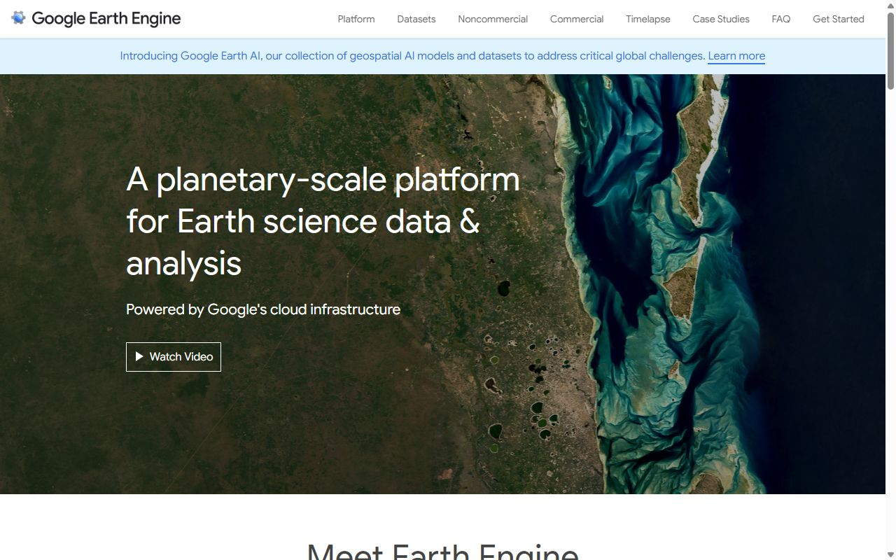
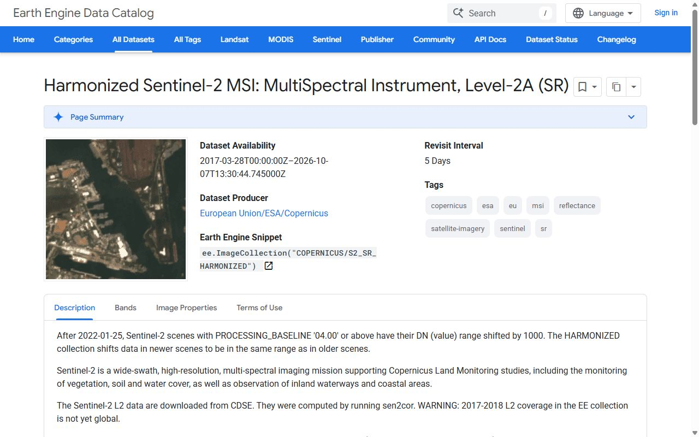

# Практикум: карта глубин по сырым промерам + сезонная динамика NDWI

<!-- folur-software:start -->

!!! tip "Что понадобится в этом уроке и где это взять"
    Нажмите на название программы и увидите, **где её взять, что нажать и как она выглядит в работе** (нужная кнопка на снимке обведена фиолетовым). Встроенный редактор Python установки не требует. Полная справка — [«Программы и сервисы»](../../../software.md).

??? example "Встроенный редактор Python — как запустить и что получится"
    { .folur-shot loading=lazy }

    1. Скачивать и устанавливать ничего не нужно: редактор находится в этом уроке, на шаге **«Практика в Python»**.
    2. Нажмите **«▶ Запустить»** под кодом (на снимке обведена). В первый раз подождите до минуты, пока загрузится Python.
    3. Ниже, в блоке «Результат», появятся таблицы и графики. Измените число в коде и запустите ещё раз.
    4. Вкладка **«Мой участок»** над редактором считает то же по вашим координатам, контуру поля или снимку.

    **Как это выглядит в работе.** Пример результата: таблицы под кодом и кнопки скачивания файлов.

    { .folur-shot loading=lazy }

    **Как это выглядит в работе.** Вкладка «Мой участок»: координаты поля, контур и снимок подставляются здесь.

    { .folur-shot loading=lazy }

    [Подробно о редакторе, своих данных и запросе для нейросети →](../../../software.md#python)

??? example "QGIS — скачать и установить"
    { .folur-shot loading=lazy }

    1. Откройте <https://qgis.org/download/>. Сайт сначала предложит пожертвование — оно необязательно: нажмите **«Skip it and go to download»**.
    2. Нажмите зелёную кнопку **«Download LTR»** (на снимке обведена). LTR — версия долгосрочной поддержки, она стабильнее. Скачается установщик размером около 1 ГБ.
    3. Запустите скачанный файл и нажимайте «Next», ничего не меняя. После установки откройте в меню «Пуск» ярлык **QGIS Desktop**.

    **Как это выглядит в работе.** QGIS в работе (русский интерфейс): слева панели «Браузер» и «Слои», в окне карты — спутниковая подложка, на которой видны поля.

    { .folur-shot loading=lazy }

    [QGIS по шагам в картинках: подложка, спутник, новый слой, система координат, площадь →](../../../software.md#qgis-steps)

    [Первые шаги в QGIS и русский интерфейс →](../../../software.md#qgis)

??? example "Google Colab — открыть в браузере"
    { .folur-shot loading=lazy }

    1. Скачивать ничего не нужно: откройте <https://colab.research.google.com/>.
    2. Нажмите **«Sign in»** справа вверху и войдите под аккаунтом Google.
    3. Нажмите **«New notebook»** — откроется пустой блокнот, в ячейку которого вставляется код из урока.

    **Как это выглядит в работе.** Учебный блокнот «Welcome to Colab» открывается и без входа: текст и ячейки с кодом идут сверху вниз.

    { .folur-shot loading=lazy }

    [Как запускать ячейки и загружать свои файлы →](../../../software.md#colab)

??? example "Google Earth Engine — зарегистрироваться"
    { .folur-shot loading=lazy }

    1. Скачивать ничего не нужно: откройте <https://earthengine.google.com/> и нажмите **«Get Started»** (на снимке обведена).
    2. Войдите под аккаунтом Google и пройдите регистрацию проекта: назначение — некоммерческое (обучение, исследования), оно бесплатно.
    3. Редактор кода открывается по адресу <https://code.earthengine.google.com/>.

    **Как это выглядит в работе.** Страница набора Sentinel-2 в каталоге Earth Engine: строка «Earth Engine Snippet» — имя набора, которое вставляют в код.

    { .folur-shot loading=lazy }

    [Что помнить об Earth Engine →](../../../software.md#gee)

???+ example "QGIS по шагам в картинках — для этого практикума"
    **1. Подложка.** В панели «Браузер» раскройте «XYZ Тайлы» и дважды щёлкните OpenStreetMap.

    { .folur-shot loading=lazy }

    **2. Спутник, чтобы видеть само поле.** «Слой → Источники данных» → раздел XYZ → вставьте адрес спутниковой подложки в поле URL → «Добавить». Адрес — в справке по ссылке ниже.

    { .folur-shot loading=lazy }

    На спутниковой подложке видны поля, колки и дороги — на карте OpenStreetMap в степи их часто нет.

    { .folur-shot loading=lazy }

    **3. Новый слой.** «Слой → Создать слой → Создать слой GeoPackage…»: имя таблицы и тип геометрии.

    { .folur-shot loading=lazy }

    **4. Система координат.** «Проект → Свойства… → Система координат» или кнопка с кодом EPSG справа внизу; в поиске наберите код зоны UTM.

    { .folur-shot loading=lazy }

    **5. Обвести контур.** Карандаш «Режим редактирования», затем «Добавить полигональный объект».

    { .folur-shot loading=lazy }

    **6. Площадь.** Таблица атрибутов → «Калькулятор полей» → выражение `$area / 10000`. Считайте только для слоя в метрической проекции.

    { .folur-shot loading=lazy }

    Подробно, с адресом спутниковой подложки и разбором ошибки с площадью: [QGIS по шагам в картинках](../../../software.md#qgis-steps).

<!-- folur-software:end -->

!!! info "Вычисления в браузере"
    Для этого материала подготовлен [редактор Python](#python-practice). Он выполняет весь скрипт целиком; графики, изображения, таблицы и файлы появляются под кодом. Учебный пример запускается без аккаунта Google. Облачные API и полноценные настольные ГИС используются отдельно, когда этого требует исходное задание.

!!! info "Доступность данных"
    Файлы уровней B и C сняты с публикации. Карты и графики оставлены как учебные иллюстрации. Упоминания контрольной сетки в примерах относятся к локальному входному файлу, который не предоставляется сайтом; соответствующие шаги можно выполнять со своей сеткой. Для открытых упражнений доступен [набор уровня A на Zenodo](https://zenodo.org/records/23014446).


## Цель урока

собрать карту глубин с паспортом и ряд площадей зеркала за два сезона — два ядра итогового продукта.

## Место в модуле

<p>Практикум — экзамен модуля в форме продукта: часть A (промеры → карта → кривая) проверяет уроки 1–2, часть B (ряд площадей) — уроки 3–4, часть C (план) — урок 5. Артефакты практикума — это и есть прикладной продукт модуля из § 9.1, а matchup-требовательность части B — мостик в модуль А3.</p>

## Ход работы

<p>Модуль А4: Водные ресурсы, климатическая адаптация и батиметрия. Время выполнения: ~120 мин (часть A ~60 мин, часть B ~30 мин, часть C ~30 мин). Инструменты: Google Colab (Python: pandas, NumPy, SciPy, Matplotlib, rasterio) и Google Earth Engine — только открытый стек. Данные: учебный батиметрический датасет уровня A (datasets/bathymetry-training-80k.csv в репозитории платформы; водохранилище степной зоны Казахстана, локальная система координат, см. политику данных) и открытый архив Sentinel-2.</p>

<p>Цель практикума</p>

<p>[Bloom: применять] Самостоятельно пройти полный конвейер модуля: очистить реальные сырые эхолотные промеры, построить карту глубин и кривую «уровень–площадь–объём», затем построить сезонный ряд NDWI-площадей водоёма своего региона. [Bloom: анализировать] Обосновать параметры фильтрации и оценить качество интерполяции кросс-валидацией.</p>

<p>Практикум опирается на лекцию 2 (часть A) и лекцию 3 (часть B); интерпретация результатов — по лекциям 1 и 4.</p>

<p>Что нужно подготовить</p>

<p>☐ Google-аккаунт и доступ к Google Colab — для расширенной части на реальных данных (бесплатно; готовый блокнот пока не опубликован). Учебный пример работает без аккаунта: <a href="#python-practice">встроенный редактор Python — шаг «Практика в Python»</a>.</p>

<p>☐ Файл bathymetry-training-80k.csv — скачайте со страницы Датасеты платформы (файл datasets/bathymetry-training-80k.csv репозитория платформы) и загрузите в сессию Colab (значок «Файлы» → «Загрузить»). Полный датасет: Zenodo, полный набор не опубликован; учебная выборка — Zenodo, DOI 10.5281/zenodo.23014446.</p>

<p>☐ Регистрация в Google Earth Engine (бесплатная некоммерческая учётная запись; активация занимает до пары дней — сделайте заранее).</p>

<p>☐ (Для шага A7, по желанию) файл сетки уровня B bathymetry-grid-100m.tif.</p>

<p>Правовой режим данных</p>

<p>Датасет уровня A — в локальной системе координат, без геопривязки; название и расположение водоёма не раскрываются. Не пытайтесь «привязать» его к реальным картам и не добавляйте координаты реальных водоёмов в свои ноутбуки при публикации. Для части B полигон интереса вы рисуете вручную вокруг выбранного ВАМИ водоёма — в код учебных материалов реальные координаты не включаются.</p>

<p>Часть A. От сырых промеров к карте глубин (~60 мин)</p>

<p>Шаг A1. Загрузка и разведочный анализ (EDA)</p>

```python
import pandas as pd
import numpy as np
import matplotlib.pyplot as plt

df = pd.read_csv('bathymetry-training-80k.csv')
print(df.shape)          # ожидается (80000, 4)
print(df.describe())     # диапазоны x_m, y_m, depth_m

fig, ax = plt.subplots(1, 2, figsize=(14, 5))
ax[0].hist(df.depth_m, bins=80)
ax[0].set_xlabel('Глубина, м'); ax[0].set_ylabel('Число точек')
sc = ax[1].scatter(df.x_m, df.y_m, c=df.depth_m, s=1, cmap='Blues')
plt.colorbar(sc, label='Глубина, м')
ax[1].set_aspect('equal'); ax[1].set_xlabel('x, м'); ax[1].set_ylabel('y, м')
plt.show()

share_zero = (df.depth_m == 0).mean()
print(f'Доля нулевых отсчётов: {share_zero:.1%}')
```

<p>Ожидаемый результат: 80 000 строк; глубины в диапазоне 0–16,1 м; правоасимметричная гистограмма; на карте точек видны галсы съёмки. Запишите вычисленную долю нулевых отсчётов — она понадобится в отчёте.</p>

<p>Шаг A2. Фильтр уровня 1–2: физический диапазон и нули</p>

<p>Реализуем правила из лекции 2, §3.1: нули сравниваем с медианой ближайших соседей.</p>

```python
from scipy.spatial import cKDTree

xy = df[['x_m', 'y_m']].to_numpy()
tree = cKDTree(xy)
K = 12  # ближайших соседей (сам узел исключаем срезом [1:])
dist, idx = tree.query(xy, k=K + 1)
neigh_median = np.median(df.depth_m.to_numpy()[idx[:, 1:]], axis=1)

is_zero = df.depth_m.to_numpy() == 0
false_zero = is_zero & (neigh_median > 1.0)   # ноль среди «глубоких» соседей
df['flag_false_zero'] = false_zero
print(f'Нулей всего: {is_zero.sum()}, из них потери дна: {false_zero.sum()}')
```

<p>Ожидаемый результат: часть нулей помечена как потери дна (изолированные нули среди значимых глубин), остальные — правдоподобные прибрежные точки. Постройте карту помеченных точек: потери дна должны быть рассеяны по акватории, прибрежные нули — тянуться вдоль края облака точек.</p>

<p>Шаг A3. Фильтр уровня 3: локальные выбросы</p>

```python
depth = df.depth_m.to_numpy()
abs_dev = np.abs(depth - neigh_median)
mad = np.median(np.abs(depth[~is_zero] - neigh_median[~is_zero]))
TOL = max(1.0, 6 * mad)   # стартовый допуск; обоснуйте свой выбор в отчёте
outlier = (~is_zero) & (abs_dev > TOL)
df['flag_outlier'] = outlier
print(f'Выбросов: {outlier.sum()} ({outlier.mean():.2%}), допуск {TOL:.2f} м')

clean = df[~df.flag_false_zero & ~df.flag_outlier].copy()
clean.to_csv('bathymetry-clean.csv', index=False)   # сырой файл не перезаписываем!
```

<p>Ожидаемый результат: со стартовым допуском чистка помечает порядка одного-двух процентов точек. Обязательная проверка (лекция 2, §3.2): карта удалённых точек — они должны быть рассеяны, а не образовывать связные структуры (затопленное русло!). Если удаляется заметно больше или удалённые точки складываются в структуры — пересмотрите TOL и обоснуйте решение в отчёте.</p>

<p>Шаг A4. Интерполяция IDW на сетку 100 м</p>

```python
step = 100.0
gx = np.arange(clean.x_m.min(), clean.x_m.max() + step, step)
gy = np.arange(clean.y_m.min(), clean.y_m.max() + step, step)
GX, GY = np.meshgrid(gx, gy)

tree_c = cKDTree(clean[['x_m', 'y_m']].to_numpy())
d, i = tree_c.query(np.c_[GX.ravel(), GY.ravel()], k=8)
w = 1.0 / np.maximum(d, 1e-6) ** 2
Z = (w * clean.depth_m.to_numpy()[i]).sum(axis=1) / w.sum(axis=1)
Z = Z.reshape(GX.shape)
Z[d.min(axis=1).reshape(GX.shape) > 300] = np.nan  # не экстраполируем дальше 300 м от данных

plt.figure(figsize=(10, 7))
pc = plt.pcolormesh(GX, GY, Z, cmap='Blues')
plt.colorbar(pc, label='Глубина, м')
cs = plt.contour(GX, GY, Z, levels=range(0, 17, 2), colors='k', linewidths=0.5)
plt.clabel(cs, fmt='%d'); plt.gca().set_aspect('equal')
plt.title('Карта глубин, IDW, сетка 100 м (локальная СК)')
plt.savefig('depth-map.png', dpi=200)
```

<p>Ожидаемый результат: файл depth-map.png — карта глубин с изобатами через 2 м; максимум глубин в одной связной зоне (затопленное русло/приплотинная часть), обширные мелководья по периферии.</p>

<p>Шаг A5. Кросс-валидация</p>

```python
rng = np.random.default_rng(42)
test = rng.random(len(clean)) < 0.15
train, hold = clean[~test], clean[test]

tree_t = cKDTree(train[['x_m', 'y_m']].to_numpy())
d, i = tree_t.query(hold[['x_m', 'y_m']].to_numpy(), k=8)
w = 1.0 / np.maximum(d, 1e-6) ** 2
pred = (w * train.depth_m.to_numpy()[i]).sum(axis=1) / w.sum(axis=1)

rmse = float(np.sqrt(np.mean((pred - hold.depth_m) ** 2)))
mae = float(np.mean(np.abs(pred - hold.depth_m)))
print(f'RMSE = {rmse:.2f} м, MAE = {mae:.2f} м')
```

<p>Ожидаемый результат: численные RMSE/MAE вашей интерполяции (значения зависят от ваших параметров фильтрации и IDW — «эталонного правильного ответа» нет, есть воспроизводимая оценка). Поэкспериментируйте: как меняется RMSE при k=4 и k=16 соседях?</p>

<p>Шаг A6. Объём и кривая «уровень–площадь–объём»</p>

```python
cell = step * step                     # 10 000 м²
V = float(np.nansum(Z) * cell)         # объём при текущем урезе, м³
A = float(np.count_nonzero(~np.isnan(Z)) * cell)
print(f'Площадь ~{A/1e6:.1f} км², объём ~{V/1e6:.1f} млн м³')

levels = np.arange(0, 17, 0.5)         # «сливаем» воду шагами 0,5 м
rows = []
for h in levels:
    Zi = np.clip(Z - h, 0, None)
    rows.append({'снижение_м': h,
                 'площадь_км2': np.count_nonzero(Zi > 0) * cell / 1e6,
                 'объём_млн_м3': np.nansum(Zi) * cell / 1e6})
curve = pd.DataFrame(rows)
curve.to_csv('level-area-volume.csv', index=False)
curve.plot(x='снижение_м', y=['площадь_км2', 'объём_млн_м3'], subplots=True)
plt.savefig('curve.png', dpi=150)
```

<p>Ожидаемый результат: файл level-area-volume.csv и график: монотонно убывающие кривые площади и объёма. Ответьте в отчёте: при снижении уровня на 1 м какая доля объёма теряется? на 2 м?</p>

<p>Шаг A7 (по желанию). Сверка с контрольной сеткой уровня B</p>

```python
import rasterio
with rasterio.open('bathymetry-grid-100m.tif') as src:
    ref = src.read(1).astype(float)
ref_d = ref[np.isfinite(ref) & (ref > 0)]
my_d = Z[np.isfinite(Z) & (Z > 0)]

plt.hist(my_d, bins=60, alpha=0.5, density=True, label='моя сетка')
plt.hist(ref_d, bins=60, alpha=0.5, density=True, label='контрольная сетка B')
plt.xlabel('Глубина, м'); plt.legend(); plt.savefig('hist-compare.png', dpi=150)
```

<p>Системы координат сеток различаются (уровень A — локальная СК), поэтому сравниваем не попиксельно, а распределения глубин и гипсографические кривые. Ожидаемый результат: формы распределений близки; расхождения объясняются вашими параметрами фильтрации/интерполяции — прокомментируйте их.</p>

<figure class="upgraded-figure"></figure>

<p class="upgraded-caption">Рис. 1. Карта глубин: кроп y ≥ 54000 (70 859 промеров) с изобатами через 2 м.</p>

<p>Часть B. Сезонная динамика NDWI в Google Earth Engine (~30 мин)</p>

<p>Шаг B1. Выбор объекта и полигона</p>

<p>Откройте GEE Code Editor. Найдите на карте водоём в вашем районе (СКО, Костанайская или Акмолинская область) — водохранилище, крупный пруд или озеро. Инструментом «Draw a shape» нарисуйте полигон aoi с запасом вокруг максимального разлива.</p>

<p>Шаг B2. Ряд NDWI-площадей за тёплый сезон</p>

```javascript
var s2 = ee.ImageCollection('COPERNICUS/S2_SR_HARMONIZED')
  .filterBounds(aoi)
  .filterDate('2023-04-01', '2023-10-31')
  .filter(ee.Filter.lt('CLOUDY_PIXEL_PERCENTAGE', 20));

var waterArea = function (img) {
  var scl = img.select('SCL');
  var clear = scl.neq(3).and(scl.neq(8)).and(scl.neq(9)).and(scl.neq(10));
  var ndwi = img.normalizedDifference(['B3', 'B8']);
  var water = ndwi.gt(0).and(clear);
  var area = water.multiply(ee.Image.pixelArea()).reduceRegion({
    reducer: ee.Reducer.sum(), geometry: aoi, scale: 10, maxPixels: 1e9});
  return ee.Feature(null, {date: img.date().format('YYYY-MM-dd'),
                           area_ha: ee.Number(area.values().get(0)).divide(1e4)});
};

var series = ee.FeatureCollection(s2.map(waterArea));
print(ui.Chart.feature.byFeature(series, 'date', 'area_ha')
  .setChartType('LineChart')
  .setOptions({title: 'Площадь воды по NDWI, га'}));
```

<p>Ожидаемый результат: график «дата → площадь, га» за сезон: весенний максимум и летний спад (лекция 4, §1.1). Одиночные провалы — остаточная облачность: проверьте подозрительные даты визуально.</p>

<p>Шаг B3. Проверка маски и экспорт</p>

<p>Наложите маску на RGB-снимок одной даты (Map.addLayer) и осмотрите границы: тростники, тени, мелководья (лекция 3, §4.2). Затем экспортируйте ряд: Export.table.toDrive(series) → CSV в Google Drive.</p>

<p>Ожидаемый результат: CSV-файл ряда площадей + 2–3 предложения в отчёте о качестве маски по итогам визуальной сверки.</p>

<p>Шаг B4. Повтор за другой год и сравнение</p>

<p>Повторите B2 для другого года (например, многоводный против маловодного). Сравните два ряда по опорным значениям: максимум, середина лета, конец сезона.</p>

<p>Ожидаемый результат: вывод в 3–4 предложениях в терминах водного баланса (лекция 1): чем объяснимо различие лет?</p>

<figure class="upgraded-figure"></figure>

<p class="upgraded-caption">Рис. 2. NDWI против MNDWI: 39,1 против 50,8 км² (один порог, одна сцена).</p>

<p>Часть C. Климатическая уязвимость и адаптационный план (~30 мин)</p>

<p>Постройте по открытым рядам индекс засушливости для водосбора вашего водоёма за пять последних лет в двух масштабах накопления. Классифицируйте годы по типу шока (засушливый, многоводный, переувлажнённый в период уборки, близкий к норме). Источник данных и параметры индекса зафиксируйте.</p>

<p>Сопоставьте индексный ряд с рядом площади водоёма из части B; чтобы обе линии покрывали один период, повторите шаг B2 по каждому из пяти лет (либо сузьте индекс до лет, покрытых частью B). Отметьте годы, где обе линии согласуются, и годы, где расходятся; для расхождений сформулируйте гипотезу (водозабор, регулирование стока, дефект маски).</p>

<p>По открытому ЦМР рельефа СУШИ водосбора (в GEE — USGS/SRTMGL1_003 либо COPERNICUS/DEM/GLO30; уклон — ee.Terrain.slope; это рельеф суши, а не батиметрия дна из части A) постройте карту подверженности: низины (риск подтопления), склоны выше порога (риск водной эрозии), выположенные водораздельные участки (риск дефицита влаги). Порог уклона обоснуйте и укажите источник. Экспорт слоя uyazvimost — в QGIS или через geopandas.</p>

<p>Присвойте каждой зоне класс уязвимости с указанием ведущего шока; оформите слой uyazvimost.</p>

<p>Составьте адаптационный план по трём горизонтам (оперативный, сезонный, структурный), привязав каждую меру к зоне.</p>

<p>Выполните проверку на противонаправленность: убедитесь, что ни одна противозасушливая мера не увеличивает уязвимость той же зоны к переувлажнению; спорные меры вынесите в переключаемые с указанием критерия переключения.</p>

<p>Оцените заиление водоёма по карте глубин части A (для количественной оценки нужны две съёмки разных лет; при одной карте отметьте это как ограничение и опишите метод): как сокращение объёма влияет на запас воды в засушливый год и на паводковую ёмкость в многоводный.</p>

<p>Ожидаемый результат: индексный ряд с классификацией лет, слой uyazvimost, адаптационный план по трём горизонтам в виде таблицы «зона → шок → мера → горизонт» и вывод о влиянии заиления на устойчивость хозяйства.</p>

<p>Дополнение к продукту задания (редакция 2)</p>

<p>Помимо файлов, перечисленных выше, продукт практикума включает:</p>

<p>☐ Индексный ряд засушливости за пять лет с классификацией типов года и указанием источника и параметров индекса;</p>

<p>☐ Слой uyazvimost (карта климатической уязвимости зон) в GeoPackage;</p>

<p>☐ Таблицу адаптационного плана «зона → шок → мера → горизонт» с выделением переключаемых мер и критериев переключения;</p>

<p>☐ Раздел записки «Заиление и устойчивость водообеспечения» с оценкой по кривой «уровень — объём».</p>

<p>Самопроверка по новой части: (1) вывод о шоке каждого года подтверждён не менее чем двумя независимыми линиями данных; (2) масштаб накопления индекса указан явно; (3) пороговые значения снабжены ссылкой на источник либо помечены как параметр к уточнению; (4) проверка на противонаправленность мер выполнена и задокументирована; (5) в проекте отсутствуют реальные координаты конкретного водоёма.</p>

<p>Продукт задания</p>

<p>По итогам практикума у вас должны быть:</p>

<p>☐ Jupyter-ноутбук части A: EDA → фильтрация с протоколом (сколько и почему удалено) → карта глубин depth-map.png → RMSE/MAE кросс-валидации → level-area-volume.csv;</p>

<p>☐ CSV-ряд NDWI-площадей вашего водоёма за два сезона + график;</p>

<p>☐ Мини-отчёт (могут быть markdown-ячейки ноутбука): параметры фильтров и их обоснование, оценка качества, выводы по динамике.</p>

<p>Самопроверка: (1) сырой CSV не изменён, чистка создала новый файл; (2) доля удалённых статистической чисткой точек — доли процента, и вы видели карту удалённого; (3) карта глубин воспроизводится перезапуском ноутбука «с нуля»; (4) на NDWI-графике опознаны и объяснены аномальные точки; (5) все числа отчёта вычислены кодом, а не «приблизительно от руки».</p>

<p>Применить к своему хозяйству</p>

<p>Проект на ВАШЕЙ земле. Часть B уже выполнена на вашем водоёме — это готовый старт мониторинга. Если доступен эхолот (подойдёт и рыбацкий с GPS-логом): выгрузите трек с промерами, приведите к формату x, y, depth — и часть A станет картой глубин вашего пруда: тот же код, другой файл. Полученная кривая «уровень–площадь–объём» + рейка на берегу = ваш личный виртуальный гидропост (лекция 4, §2.2). Артефакт — shareable: карта глубин и график динамики, которые можно показать партнёрам или акимату.</p>

<p>Дополнительные задания (по желанию)</p>

<p>Реализуйте TIN-интерполяцию (scipy.interpolate.LinearNDInterpolator) и сравните с IDW кросс-валидацией: какой метод победил на этих данных?</p>

<p>Постройте маску MNDWI (B3/B11, scale=20) для вашего объекта части B и сравните площади с NDWI: объясните расхождение (лекция 3, §1.3).</p>

<p>Для крупного водохранилища региона постройте ряд площадей JRC Global Surface Water с 1984 г. и найдите многоводные/маловодные фазы.</p>

<p>Связи</p>

<p>Лекция 2 — теория части A; лекция 3 — теория части B.</p>

<p>ИИ-задание модуля — делегируйте фильтрацию части A кодинг-агенту и верифицируйте его работу.</p>

<p>Итоговая аттестация — сценарный кейс опирается на результаты практикума.</p>

<p>Политика данных — уровни A/B/C батиметрического датасета.</p>


<section class="folur-python-practice" id="python-practice">
<h3>Практика в Python — прямо в уроке</h3>
<ol class="folur-lab-steps"><li>Нажмите <strong>▶ Запустить</strong> под кодом. При первом запуске загружается Python — это занимает до минуты.</li><li>Таблицы, графики и файлы появятся ниже, в блоке «Результат».</li><li>Измените параметры в коде и запустите ещё раз. Кнопка «Восстановить пример» возвращает исходный код.</li></ol>
<p class="folur-lab-note">Устанавливать ничего не нужно: редактор работает прямо в браузере, без аккаунта. <a href="/python-lab/editor.html?exercise=a4-practice" target="_blank" rel="noopener">Открыть редактор в отдельной вкладке</a>.</p>
<iframe class="folur-python-editor" src="/python-lab/editor.html?exercise=a4-practice" title="Python: a4-practice" loading="lazy" style="width:100%;height:1250px;border:1px solid #d4dfd0;border-radius:8px"></iframe>
<p class="folur-lab-data"><strong>О данных.</strong> Пример сразу работает на синтетических (учебных) данных. Чтобы повторить расчёт на реальных 80 000 промерах: 1) скачайте файл <a href="https://zenodo.org/records/23014446/files/bathymetry-training-80k.csv?download=1">bathymetry-training-80k.csv</a> (набор уровня A, <a href="https://zenodo.org/records/23014446">страница набора на Zenodo</a>); 2) в редакторе, в блоке «Свои данные и возможности среды», нажмите «Подставить свой файл» у строки <code>points.csv</code> и выберите скачанный файл (переименовывать не нужно); 3) нажмите «Запустить».</p>
<p class="folur-lab-own"><strong>Свой участок.</strong> Во вкладке «Мой участок» над редактором можно вставить координаты своего поля или загрузить его контур (GeoJSON, KML, GeoPackage, Shapefile в архиве .zip) и снимок (GeoTIFF) — и получить паспорт данных, площадь, систему координат и оценку съёмки. Данные остаются в вашем браузере и сохраняются для следующих уроков.</p>
</section>

---

[Программа модуля](../index.md) · [Данные и условия использования](../../../datasets.md)
