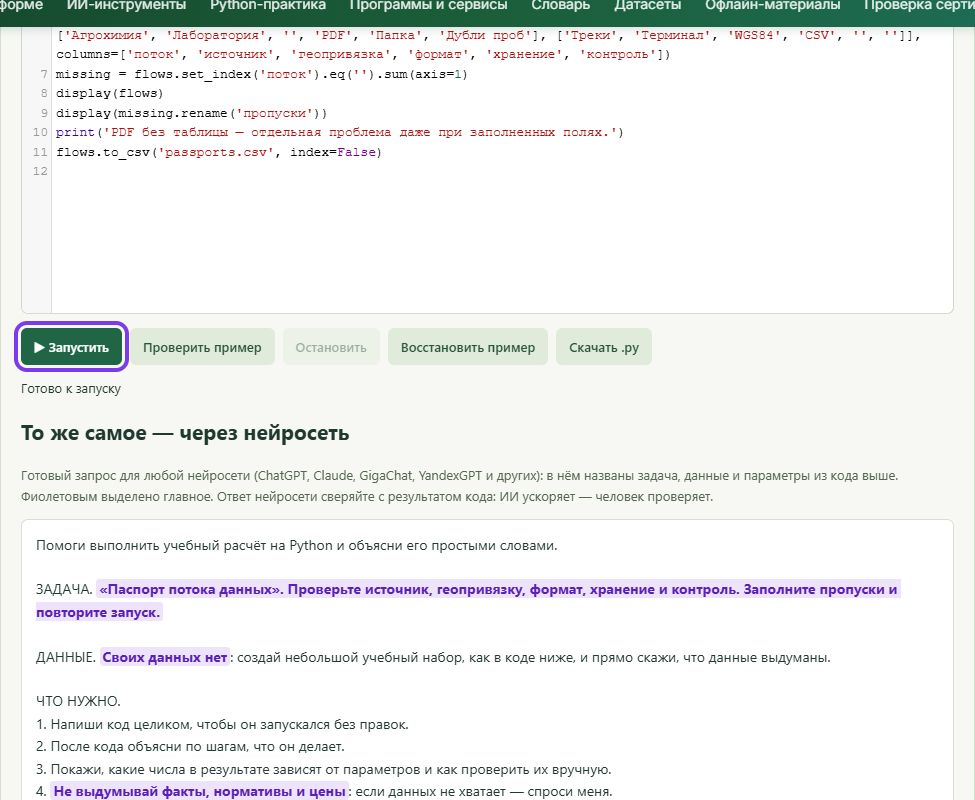
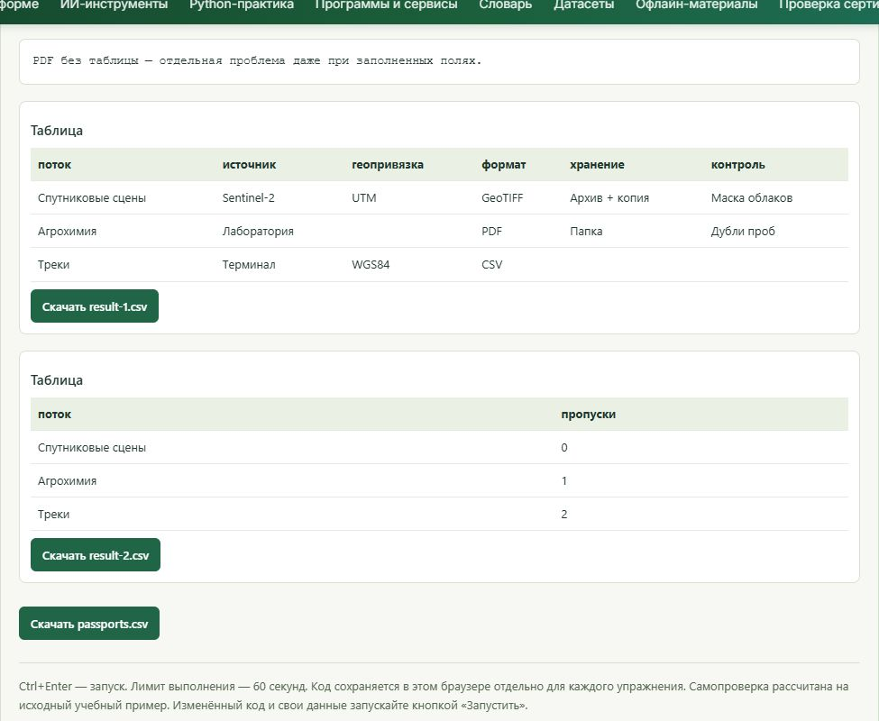
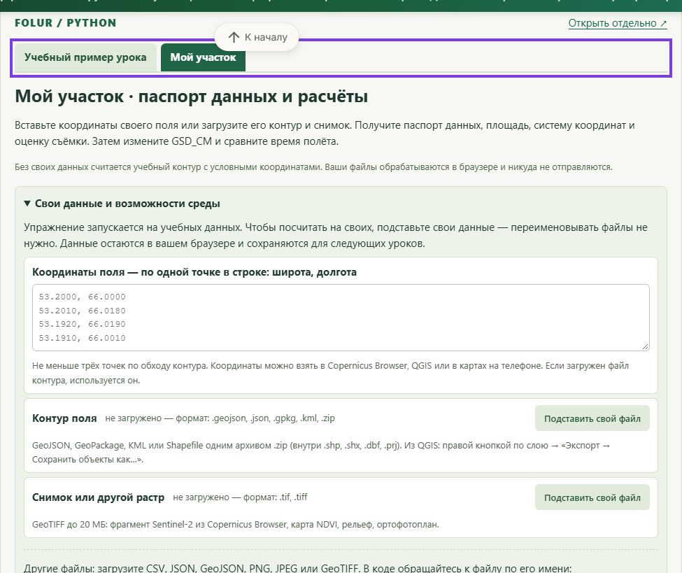
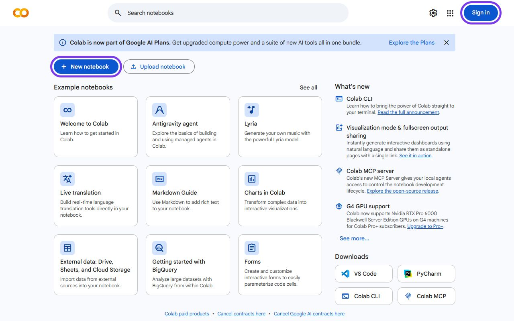
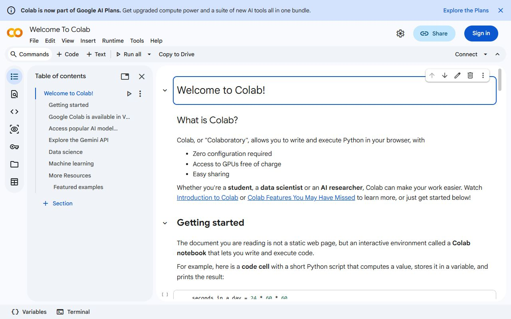

# Делим хозяйство на функциональные зоны: ландшафтный подход

!!! info "Вычисления в браузере"
    Для этого материала подготовлен [редактор Python](#python-practice). Он выполняет весь скрипт целиком; графики, изображения, таблицы и файлы появляются под кодом. Учебный пример запускается без аккаунта Google. Облачные API и полноценные настольные ГИС используются отдельно, когда этого требует исходное задание.

> ⏱ **Трудозатраты:** ~25 мин чтения + ~25 мин практики

<!-- folur-software:start -->

!!! tip "Что понадобится в этом уроке и где это взять"
    Нажмите на название программы и увидите, **где её взять, что нажать и как она выглядит в работе** (нужная кнопка на снимке обведена фиолетовым). Встроенный редактор Python установки не требует. Полная справка — [«Программы и сервисы»](../../../software.md).

??? example "Встроенный редактор Python — как запустить и что получится"
    { .folur-shot loading=lazy }

    1. Скачивать и устанавливать ничего не нужно: редактор находится в этом уроке, на шаге **«Практика в Python»**.
    2. Нажмите **«▶ Запустить»** под кодом (на снимке обведена). В первый раз подождите до минуты, пока загрузится Python.
    3. Ниже, в блоке «Результат», появятся таблицы и графики. Измените число в коде и запустите ещё раз.
    4. Вкладка **«Мой участок»** над редактором считает то же по вашим координатам, контуру поля или снимку.

    **Как это выглядит в работе.** Пример результата: таблицы под кодом и кнопки скачивания файлов.

    { .folur-shot loading=lazy }

    **Как это выглядит в работе.** Вкладка «Мой участок»: координаты поля, контур и снимок подставляются здесь.

    { .folur-shot loading=lazy }

    [Подробно о редакторе, своих данных и запросе для нейросети →](../../../software.md#python)

??? example "QGIS — скачать и установить"
    { .folur-shot loading=lazy }

    1. Откройте <https://qgis.org/download/>. Сайт сначала предложит пожертвование — оно необязательно: нажмите **«Skip it and go to download»**.
    2. Нажмите зелёную кнопку **«Download LTR»** (на снимке обведена). LTR — версия долгосрочной поддержки, она стабильнее. Скачается установщик размером около 1 ГБ.
    3. Запустите скачанный файл и нажимайте «Next», ничего не меняя. После установки откройте в меню «Пуск» ярлык **QGIS Desktop**.

    **Как это выглядит в работе.** QGIS в работе (русский интерфейс): слева панели «Браузер» и «Слои», в центре — учебное поле на подложке OpenStreetMap с подписью площади, внизу справа — система координат проекта.

    { .folur-shot loading=lazy }

    [Первые шаги в QGIS и русский интерфейс →](../../../software.md#qgis)

??? example "Google Colab — открыть в браузере"
    { .folur-shot loading=lazy }

    1. Скачивать ничего не нужно: откройте <https://colab.research.google.com/>.
    2. Нажмите **«Sign in»** справа вверху и войдите под аккаунтом Google.
    3. Нажмите **«New notebook»** — откроется пустой блокнот, в ячейку которого вставляется код из урока.

    **Как это выглядит в работе.** Учебный блокнот «Welcome to Colab» открывается и без входа: текст и ячейки с кодом идут сверху вниз.

    { .folur-shot loading=lazy }

    [Как запускать ячейки и загружать свои файлы →](../../../software.md#colab)

<!-- folur-software:end -->

<p>Цель: научиться делить хозяйство на функциональные зоны по ландшафтному принципу — скелет, на который встанут агротехника, меры и мониторинг.</p>

<p>Место в модуле. Устойчивое землепользование начинается не с выбора трактора и не с покупки семян, а с ответа на вопрос «что и где на этой территории должно происходить». Ландшафтный подход отвечает на него системно: он рассматривает хозяйство не как набор полей, а как единый ландшафт, где пашня, пастбища, водоёмы, лесополосы и склоны связаны потоками воды, ветра, питательных веществ и биоразнообразия. В этом уроке мы учимся видеть эту связность и переводить её в карту функциональных зон — тот самый скелет, на который в следующих уроках нарастут агротехника, противодеградационные меры и мониторинг.</p>

## После изучения слушатель сможет:

<p><strong>[Bloom: знать]</strong> перечислять уровни ландшафтного подхода и типы функциональных зон агроландшафта степной зоны.</p>

<p><strong>[Bloom: понимать]</strong> объяснять, почему баланс производственных и экосистемных функций территории повышает её устойчивость, а не снижает доход.</p>

<p><strong>[Bloom: применять]</strong> выполнять первичное функциональное зонирование модельного хозяйства Северного Казахстана на открытых данных (ESA WorldCover, Sentinel-2, OSM) в QGIS.</p>

<p><strong>[Bloom: анализировать]</strong> сопоставлять варианты зонирования одной территории и обосновывать выбор границ зон физико-географическими и хозяйственными факторами.</p>

<p>Границы: Внутри: понятие агроландшафта, уровни и принципы ландшафтного подхода, типы функциональных зон, логика проведения границ, первичное зонирование на открытых данных. Снаружи: диагностика конкретных деградационных процессов — урок 2; агротехника внутри пашенной зоны (обработка почвы, севообороты) — урок 3; мониторинг и индикаторы устойчивости — урок 4. Инструментальные навыки геообработки (оверлей, буферизация, зональная статистика) считаем усвоенными — подробнее в модуле А2. Водоохранные аспекты и водный баланс водосбора — в модуле А4.</p>

## 1. Что такое агроландшафт и зачем на него смотреть целиком

<p>Поле не существует в вакууме. Вода, стекающая с распаханного склона, уносит верхний слой почвы в лощину, а оттуда — в водоём. Ветер, разогнавшийся над открытой пашней без препятствий, выдувает мелкозём и оголяет корни. Гнездящиеся в лесополосе птицы и хищные насекомые сдерживают вредителей на соседнем поле. Все эти процессы не признают границ земельных участков — они работают на уровне <strong>ландшафта</strong>.</p>

<p>Агроландшафт — это территория, где природные компоненты (рельеф, почвы, гидрография, растительность, климат) и хозяйственная деятельность образуют единую, взаимозависимую систему. Ключевое слово — «взаимозависимую»: изменение в одной части ландшафта отзывается в других, часто не сразу и не там, где ожидаешь.</p>

<p><strong>Ландшафтный подход</strong> (landscape approach) — это управление территорией, которое исходит из этой связности. Вместо того чтобы оптимизировать каждое поле по отдельности (максимум урожая любой ценой), он ищет баланс функций на всей территории сразу: производство продукции, защита почв, регулирование воды, сохранение биоразнообразия, секвестрация углерода. Этот подход лежит в основе интегрированного управления ландшафтами (Integrated Landscape Management, ILM) — прямого содержания Компонента 1 программы FOLUR.</p>

<p>Важно понять, что ландшафтный подход — не про то, чтобы «отдать часть земли природе в ущерб доходу». Экосистемные функции территории работают на производство: лесополоса, задерживающая снег, повышает влагозапас соседнего поля; сохранённая залежь на эродированном склоне предотвращает потерю пашни ниже по склону; водоохранная зона у водоёма фильтрует сток и продлевает жизнь водного объекта, от которого зависит водопой скота. Устойчивость и доходность здесь — не противоречие, а горизонт, на котором они сходятся.</p>

### 1.1 Откуда пришёл ландшафтный подход и при чём здесь FOLUR

<p>Ландшафтный подход вырос из простого наблюдения: попытки решать сельские проблемы поле за полем, участок за участком раз за разом упирались в то, что причина лежала за границей участка. Нельзя остановить овраг, работая только на своём поле, если сток формируется на соседнем склоне. Нельзя сохранить опылителей и естественных врагов вредителей, если вокруг сплошная монотонная пашня без единого убежища. Международные программы восстановления земель постепенно перешли от «проектов на участке» к управлению целыми ландшафтами и водосборами.</p>

<p>Именно это стоит за понятием <strong>интегрированного управления ландшафтами</strong> (ILM). Его суть — согласовывать на одной территории интересы, которые обычно рассматривают порознь: производство продовольствия, сохранение почв и воды, биоразнообразие, климат, средства к существованию людей. ILM не отменяет ни один из этих интересов, а ищет их совместимую конфигурацию в пространстве.</p>

<p>Программа FOLUR (Food Systems, Land Use and Restoration) — прямое воплощение этой логики на глобальном уровне; её казахстанский страновой проект ведёт ПРООН при финансировании GEF в партнёрстве с профильным министерством, с фокусом на ландшафт Северного Казахстана и «зелёную пшеницу». Компонент 1 FOLUR — это ровно ILM-политики и развитие потенциала; Компонент 2 — устойчивые практики на земле. Функциональное зонирование хозяйства, которому посвящён урок, — это ILM, спущенный с уровня программы на уровень конкретного землепользователя. Когда вы делите территорию на зоны с балансом функций, вы делаете на своём масштабе то же, что программа делает на масштабе региона.</p>

<p>Практический вывод для планирования: план землепользования хозяйства не изобретается в вакууме — он встраивается в приоритеты территории. Если район включён в ландшафт FOLUR, устойчивое зонирование хозяйства становится ещё и точкой доступа к программам поддержки и рынку «зелёной» продукции. Это превращает экологический аргумент в экономический.</p>

### 1.2 Три масштаба, на которых работает подход

<p>Ландшафтный подход применяется на трёх вложенных масштабах, и путать их нельзя:</p>

<p><strong>Региональный / бассейновый</strong> — уровень водосбора, административного района, природной зоны. Здесь решаются вопросы, которые одно хозяйство не контролирует: режим водного объекта, коридоры биоразнообразия, крупные ветрозащитные системы. Это уровень политики (ILM) и межхозяйственной координации.</p>

<p><strong>Хозяйственный</strong> — уровень отдельного землепользователя. Именно здесь работает наш модуль: мы делим территорию хозяйства на функциональные зоны и назначаем каждой свой режим использования. Это масштаб прикладного продукта модуля.</p>

<p><strong>Полевой / внутриполевой</strong> — уровень отдельного поля и его частей (менеджмент-зоны точного земледелия). Здесь работают переменные нормы внесения и NDVI-мониторинг — тема урока 4.</p>

<p>Наш фокус — хозяйственный масштаб, но он всегда «зажат» между двумя другими: зонирование хозяйства обязано считаться с бассейновыми ограничениями сверху и раскрываться в полевой менеджмент снизу.</p>

<figure class="upgraded-figure"></figure>

<p class="upgraded-caption">Рис. 1. Три вложенных масштаба ландшафтного подхода.</p>

## 2. Функциональное зонирование: назначаем каждой части территории её роль

<p>Функциональное зонирование — это разбиение территории хозяйства на зоны, каждая из которых выполняет свою основную функцию и получает свой режим использования. Это центральная операция ландшафтного планирования и ядро прикладного продукта модуля.</p>

<p>Логика зонирования проста по формулировке и трудна по исполнению: <strong>каждый участок земли должен использоваться в соответствии со своими природными свойствами и своей ролью в ландшафте, а не по инерции или «как у соседа».</strong> Склон крутизной, при которой распашка гарантирует смыв, — не пашня, каким бы удобным ни казался его контур. Пойма с высоким уровнем грунтовых вод — не место для интенсивной обработки. Полоса вдоль водоёма — водоохранная зона, а не край поля.</p>

### 2.1 Типовые функциональные зоны агроландшафта степной зоны

<p>Для хозяйств Северного Казахстана характерен следующий набор зон (конкретный состав зависит от территории):</p>

<p><strong>Пашенная (производственная) зона</strong> — основные посевные площади. Внутри неё позже назначаются севообороты и система обработки почвы. Обычно наибольшая по площади.</p>

<p><strong>Кормовая зона</strong> — сенокосы и пастбища. Часто размещается там, где распашка нецелесообразна: пологие склоны, менее продуктивные почвы, участки у водопоя.</p>

<p><strong>Буферные и природоохранные зоны</strong> — лесополосы, залежи на эродированных склонах, куртины естественной растительности. Выполняют защитные и экологические функции: ветрозащита, снегозадержание, местообитания полезной фауны.</p>

<p><strong>Водоохранная зона</strong> — полоса вдоль водных объектов с ограниченным режимом. Её ширина и режим задаются водным законодательством; детально гидрологическая сторона — в модуле А4.</p>

<p><strong>Инфраструктурная зона</strong> — дороги, фермы, тока, складские площадки. Учитывается, потому что определяет логистику и точки нагрузки на территорию.</p>

<p><strong>Деградированные и восстанавливаемые участки</strong> — земли, требующие вывода из оборота или мелиорации (сильно эродированные, засолённые). Их диагностике посвящён урок 2, а восстановлению — модуль А6.</p>

<p>Ни одна из этих зон не «лишняя»: даже выведенная из пашни залежь работает на устойчивость соседних производственных полей.</p>

### 2.2 Как проводить границы: факторы зонирования

<p>Границу зоны нельзя проводить произвольно. Её диктуют физико-географические и хозяйственные факторы, которые нужно собрать в ГИС как слои и наложить друг на друга (оверлей — навык из А2):</p>

<div class="upgraded-table"><table>
<tr><th colspan="1" rowspan="1">Фактор</th><th colspan="1" rowspan="1">Что определяет</th><th colspan="1" rowspan="1">Источник данных</th></tr>
<tr><td colspan="1" rowspan="1">Рельеф (уклон, экспозиция)</td><td colspan="1" rowspan="1">эрозионный риск, пригодность к распашке</td><td colspan="1" rowspan="1">ЦМР (SRTM, Copernicus DEM), производные уклона</td></tr>
<tr><td colspan="1" rowspan="1">Почвенный покров</td><td colspan="1" rowspan="1">продуктивность, риск засоления/дефляции</td><td colspan="1" rowspan="1">почвенные карты, косвенно — спектр Sentinel-2</td></tr>
<tr><td colspan="1" rowspan="1">Гидрография</td><td colspan="1" rowspan="1">водоохранные зоны, дренаж</td><td colspan="1" rowspan="1">OSM, NDWI по Sentinel-2 (см. А4)</td></tr>
<tr><td colspan="1" rowspan="1">Текущий земной покров</td><td colspan="1" rowspan="1">что уже есть на территории</td><td colspan="1" rowspan="1">ESA WorldCover, классификация Sentinel-2 (см. А3)</td></tr>
<tr><td colspan="1" rowspan="1">Существующие лесополосы, дороги</td><td colspan="1" rowspan="1">каркас территории</td><td colspan="1" rowspan="1">OSM, ортофото/снимки высокого разрешения</td></tr>
<tr><td colspan="1" rowspan="1">Хозяйственные ограничения</td><td colspan="1" rowspan="1">севообороты, техника, логистика</td><td colspan="1" rowspan="1">данные хозяйства</td></tr>
</table></div>

<p>Вывод: граница зоны диктуется шестью факторами сразу — сначала жёсткие ограничения (вода, склоны), затем производство; каждый фактор имеет свой источник данных.</p>

<p>Порядок работы: сначала наносятся жёсткие ограничения (водоохранная зона по гидрографии, непригодные к распашке склоны по уклону), затем — гибкие производственные решения на оставшейся территории. Так план не «упирается» позже в непреодолимое ограничение.</p>

<figure class="upgraded-figure"></figure>

<p class="upgraded-caption">Рис. 2. Конвейер функционального зонирования: от слоёв-факторов через оверлей к карте зон.</p>

### 2.3 Баланс функций как критерий качества плана

<p>Хороший план зонирования оценивается не по доле пашни, а по <strong>балансу функций</strong>. Территория, полностью распаханная до уреза воды и до бровки оврага, максимизирует посевную площадь на бумаге, но проигрывает вдолгую: эрозия съедает почву, водоём заиливается, урожай нестабилен из-за отсутствия снегозадержания.</p>

<p>Рамкой для оценки баланса служат <strong>10 элементов агроэкологии FAO</strong> (разнообразие, синергия, эффективность, рециркуляция, устойчивость к потрясениям, и другие) и логика <strong>экосистемных услуг</strong> (обеспечивающие, регулирующие, поддерживающие, культурные — подробно в А6). На уровне зонирования это переводится в практические вопросы: сохранён ли каркас лесополос? защищены ли склоны? есть ли буфер у воды? диверсифицирована ли территория или это монотонная пашня?</p>

<p><strong>Подробнее</strong> — оценка экосистемных услуг и природного капитала территории разбирается в модуле А6; индикаторы, которыми баланс измеряется количественно (в том числе ЦУР 15.3), — в уроке 4.</p>

### 2.4 Землепользование и землевладение: зонирование в реальных границах

<p>Карта функциональных зон рисуется не на чистом листе, а поверх существующих границ землепользования, договоров аренды, полей и их истории. Это накладывает ограничения, которые нельзя игнорировать. Функциональная зона может не совпадать с границей юридического участка: эрозоопасный склон, который логично залужить, способен захватывать края нескольких полей, а водоохранная полоса — идти вдоль границы участков разных пользователей.</p>

<p>Поэтому зонирование ведётся в двух слоях сразу: <strong>природно-функциональном</strong> (что диктует ландшафт) и <strong>административно-хозяйственном</strong> (что позволяют границы, севообороты и техника). Хороший план — это компромисс, в котором природная логика реализуется настолько, насколько это выполнимо в реальных границах, а нереализуемое сейчас фиксируется как цель на будущее (например, «восстановить лесополосу по границе полей 3 и 4 при следующем обновлении севооборота»).</p>

<p>Отдельный вопрос — работа с чужими или общими элементами. Водный объект, лесополоса на границе, дорога общего пользования — это элементы, которые хозяйство не контролирует единолично. Здесь зонирование выходит на уровень межхозяйственной координации (региональный масштаб из §1.2), и план должен честно помечать такие элементы как «требующие согласования», а не присваивать их себе на бумаге.</p>

<p>Наконец, зонирование — живой документ. Границы зон уточняются по мере появления новых данных (полевое обследование, свежие снимки, результаты мониторинга из урока 4) и по мере изменения хозяйства. План, нарисованный один раз и убранный в стол, устаревает; план, который пересматривается ежегодно, становится инструментом управления.</p>

### 2.5 Как проверить качество зонирования: типичные ошибки

<p>Начинающие планировщики совершают повторяющиеся ошибки, и знание их заранее экономит время:</p>

<p><strong>«Пашня до упора».</strong> Территория распахана вплоть до уреза воды, до бровки оврага и до подножия склона. План максимизирует площадь на бумаге, но закладывает эрозию и заиление. Признак ошибки — отсутствие или символическая ширина буферных и водоохранных зон.</p>

<p><strong>Границы «по прямой».</strong> Зоны нарезаны прямыми линиями «для удобства техники» без учёта рельефа и гидрографии. Прямая граница поперёк склона или через лощину игнорирует физику стока. Границы защитных зон должны следовать формам рельефа, а не геометрии удобства.</p>

<p><strong>Забытый каркас.</strong> В плане нет лесополос и защитных элементов — их либо не восстановили после вырубки, либо сочли «неудобьями». В степи это прямая потеря снегозадержания и влаги.</p>

<p><strong>Зоны без режима.</strong> Зона нарисована, но не сказано, что в ней можно и нельзя. Функциональная зона без назначенного режима использования — просто цветное пятно, а не управленческое решение.</p>

<p><strong>Пропуски и наложения.</strong> Территория покрыта зонами не полностью или зоны перекрываются. Это выявляется формальной проверкой топологии (навык А2) и обязательно устраняется до утверждения плана.</p>

<p>Проверка по этому списку — быстрый способ отличить рабочий план от красивой, но нежизнеспособной картинки.</p>

## 3. Ландшафтный подход в контексте Северного Казахстана и FOLUR

<p>Северный Казахстан — главный зерновой регион страны; пшеница даёт около половины сельхозпроизводства и является ключевой товарной культурой проекта FOLUR. Это накладывает на ландшафтное планирование региональную специфику.</p>

<p>Во-первых, это <strong>зона рискованного земледелия</strong>: континентальный климат, ограниченное и неустойчивое увлажнение, периодические засухи. Влага — лимитирующий фактор, поэтому снегозадержание и влагосбережение становятся не «экологической опцией», а условием урожая. Лесополосы и стерня работают здесь в первую очередь на воду.</p>

<p>Во-вторых, это регион с <strong>тяжёлым эрозионным наследием</strong>. Массовая распашка целинных и залежных земель в середине XX века на огромных открытых пространствах без защитных элементов привела к масштабной ветровой эрозии и пыльным бурям. Ответом стала почвозащитная система земледелия, разработанная в регионе (научная школа Шортандинского института зернового хозяйства им. А. И. Бараева, Акмолинская область): плоскорезная обработка с сохранением стерни, кулисные пары, полосное размещение культур. Эта история — не музейный экспонат, а живой фундамент современного зонирования: защитный каркас территории в степи первичен.</p>

<p>В-третьих, ландшафтное планирование хозяйства прямо работает на <strong>компоненты FOLUR</strong>: функциональное зонирование с сохранением экологического каркаса — это Компонент 1 (интегрированное управление ландшафтами и потенциал), а закладываемые в зоны устойчивые практики — Компонент 2. Кейсы программы (каталог FOLUR Case Studies) дают примеры того, как «зелёная пшеница» и интегрированные ландшафты совмещаются на практике.</p>

### 3.1 Участие и совместное создание знаний

<p>Один из десяти элементов агроэкологии FAO — совместное создание и обмен знаниями. Для ландшафтного подхода это не абстракция: план землепользования, навязанный сверху без участия тех, кто на земле работает, редко выполняется. Агроном, который десятилетиями наблюдает своё поле, знает про промоину в конкретной лощине и про то, где раньше стояла лесополоса, больше, чем любой снимок. Устойчивое планирование соединяет два источника знания — дистанционные данные и локальный опыт — вместо того чтобы противопоставлять их.</p>

<p>На уровне территории это выходит на межхозяйственную координацию: водоохранная зона, лесополоса на границе, режим водного объекта затрагивают нескольких пользователей, и решение здесь — согласование, а не одностороннее действие. Ландшафтный подход в этом смысле социален так же, как и технологичен: он требует договорённостей между людьми, разделяющими один ландшафт.</p>

<p>Практический вывод для нашего модуля: карта зонирования — это инструмент разговора. Она переводит опыт агронома, требования программы и данные снимка на один язык — язык карты, — на котором фермер, специалист, банк и куратор программы могут договориться. Именно поэтому продукт модуля оформляется как shareable-документ с пояснительной запиской, а не как файл «для себя».</p>

<p>Наконец, ландшафтный подход отвечает на управленческий запрос региона в широком смысле. Северный Казахстан — это не только пшеница, но и животноводство, водные объекты как источник водопоя и рыболовства, сельские сообщества, зависящие от состояния земли. Планирование, которое видит только пашню, упускает эти связи; ландшафтный подход держит их в поле зрения, потому что именно они определяют устойчивость средств к существованию людей — конечную цель программы.</p>

<p>Важно и то, что регион обладает готовой методической базой для такого планирования. Помимо исторической почвозащитной школы, есть открытые данные (спутниковые архивы, национальный портал открытых данных РК), картографические сервисы и, что подчёркивает проект, сквозной ИИ-слой: агент может быстро собрать черновик зонирования, а специалист — верифицировать его по снимку и обосновать. Как это делается на практике — в ИИ-ассистенте модуля; принцип неизменен: «ИИ ускоряет — человек верифицирует».</p>

<p><strong>Подробнее</strong> — конкретные деградационные процессы региона (дефляция, дегумификация, засоление) и их диагностика по данным — в уроке 2.</p>

<figure class="upgraded-figure"></figure>

<p class="upgraded-caption">Рис. 3. База зонирования окна СКО: пашня 16,74 %, естественный покров 83,14 % — скелет функциональных зон (урок 13.1).</p>

## 13.1.4. Региональный кейс

<p><strong>Ситуация:</strong> Модельное хозяйство в Костанайском районе Костанайской области ведёт зерновое производство и распахало почти всю доступную площадь, включая пологие склоны к небольшой степной речке и полосу у водохранилища степной зоны, откуда берёт воду для водопоя скота. Часть старых лесополос вырублена «для удобства техники». Руководитель замечает, что урожай на приречных полях нестабилен, а после сильных ливней в лощинах видны промоины. Ставится задача: пересобрать территорию по ландшафтному принципу, не потеряв необоснованно посевную площадь.</p>

<p><strong>Данные:</strong> ESA WorldCover 10 m (&lt;<a href="https://esa-worldcover.org/&gt">https://esa-worldcover.org/&gt</a>;) — текущий земной покров; Sentinel-2 L2A через Copernicus Data Space (&lt;<a href="https://dataspace.copernicus.eu/&gt">https://dataspace.copernicus.eu/&gt</a>;) — актуальный композит для проверки границ и состояния полей; OpenStreetMap — гидрография, дороги, границы; Copernicus DEM — уклоны. Батиметрия водоёма (для водоохранной зоны) — только учебные уровни A/B (Датасеты платформы), без реальных координат.</p>

## Задача:

<p>По слою уклонов и гидрографии выделите участки, которые не должны быть пашней (склоны с эрозионным риском, приречная и приводоёмная полосы), — это жёсткие ограничения.</p>

<p>На оставшейся территории обозначьте пашенную и кормовую зоны, восстанавливаемый каркас лесополос и водоохранную зону.</p>

<p>Сформулируйте, какие функции территория приобретает после перезонирования и почему это не эквивалентно «потере» пашни.</p>

<p><strong>Разбор:</strong> Приречные и приводоёмные полосы переводятся из пашни в водоохранную и кормовую зоны — это стабилизирует нестабильный ранее урожай (причина нестабильности была в эрозии и недостатке защиты), фильтрует сток в водоём и даёт кормовую базу у водопоя. Склоны с промоинами выводятся под залужение или буферные полосы поперёк склона. Каркас лесополос восстанавливается ради снегозадержания — ключевого фактора влаги в степи. Потерянная под пашней площадь частично компенсируется ростом урожайности на защищённых полях; в масштабе территории баланс функций улучшается без пропорциональной потери дохода. Конкретные цифры площадей и урожайности здесь не приводятся — они вычисляются слушателем на его данных в практикуме, а не постулируются.</p>

<p>Этот кейс продолжается в Практикуме — там вы самостоятельно выполняете зонирование модельного хозяйства на реальных открытых данных.</p>

## Попробуйте в редакторе Python. {#colab}

<p><strong>В редакторе урока</strong> (<a href="#python-practice">шаг «Практика в Python»</a>) — учебный пример на синтетических данных. Измените границы зон. Параметры буферов в примере не являются нормативами.</p>

<p><strong>Расширенное задание — на реальных данных, вне редактора.</strong> Загрузите фрагмент ESA WorldCover 10 m на территорию Костанайского района и посчитайте долю каждого класса земного покрова (пашня, травяные угодья, вода, лес). Это «нулевой срез» территории — от него отталкивается зонирование. Среда: QGIS или Google Colab — как открыть и с чего начать, см. <a href="../../../software.md#qgis">«Программы и сервисы»</a>.</p>

## Границы применимости.

<p>Зонирование на открытых данных 10-метрового разрешения — это стратегический уровень: оно корректно намечает зоны, но не заменяет полевого обследования и точной съёмки границ. Мелкие контуры (узкая лесополоса, отдельная промоина) на 10 м не всегда различимы — их уточняют по снимкам высокого разрешения или в поле. Никогда не выносите юридические границы водоохранной зоны из ГИС без сверки с нормативными требованиями и данными по конкретному водному объекту.</p>

## Что это даёт вашему хозяйству.

<p>Карта функциональных зон — это управленческий документ: она показывает, где терять почву нельзя, где имеет смысл вложиться в лесополосу, а где можно интенсифицировать производство без вреда. Один раз собранная в ГИС, она становится основой для севооборотов (урок 3), мониторинга (урок 4) и разговора с агрономом, банком или программой поддержки на одном языке карты.</p>

## Кейс для размышления.

<p>Сосед распахал свой склон «в лоб» и получает в отдельные годы больше зерна с гектара, чем вы с залуженного склона. Какие функции и риски этот учёт «зерна с гектара» не видит? На каком масштабе и горизонте времени ваш выбор оказывается выгоднее — и как это доказать данными?</p>


<section class="folur-python-practice" id="python-practice">
<h3>Практика в Python — прямо в уроке</h3>
<ol class="folur-lab-steps"><li>Нажмите <strong>▶ Запустить</strong> под кодом. При первом запуске загружается Python — это занимает до минуты.</li><li>Таблицы, графики и файлы появятся ниже, в блоке «Результат».</li><li>Измените параметры в коде и запустите ещё раз. Кнопка «Восстановить пример» возвращает исходный код.</li></ol>
<p class="folur-lab-note">Устанавливать ничего не нужно: редактор работает прямо в браузере, без аккаунта. <a href="/python-lab/editor.html?exercise=a5-l01" target="_blank" rel="noopener">Открыть редактор в отдельной вкладке</a>.</p>
<iframe class="folur-python-editor" src="/python-lab/editor.html?exercise=a5-l01" title="Python: a5-l01" loading="lazy" style="width:100%;height:1250px;border:1px solid #d4dfd0;border-radius:8px"></iframe>
<p class="folur-lab-data"><strong>О данных.</strong> Пример работает на синтетических (учебных) данных — скачивать ничего не нужно. Свои CSV, изображения и растры можно подключить в редакторе: раскройте блок «Свои данные и возможности среды».</p>
<p class="folur-lab-own"><strong>Свой участок.</strong> Во вкладке «Мой участок» над редактором можно вставить координаты своего поля или загрузить его контур (GeoJSON, KML, GeoPackage, Shapefile в архиве .zip) и снимок (GeoTIFF) — и получить паспорт данных, площадь, систему координат и оценку съёмки. Данные остаются в вашем браузере и сохраняются для следующих уроков.</p>
</section>
## Закрепление и применение

## 13.1.5. Контроль

## Проверь себя

```quiz
[
  {
    "q": "Что отличает ландшафтный подход от пофакторной оптимизации отдельных полей?",
    "options": [
      "Он управляет территорией как связной системой, балансируя производство и экосистемы",
      "Он всегда максимизирует урожай с каждого поля по отдельности, без учёта соседних",
      "Он запрещает любое сельхозпроизводство ради охраны природы на всей территории",
      "Он применяется только на уровне отдельного пикселя снимка, а не хозяйства"
    ],
    "answer": 0,
    "explain": "§1: ландшафтный подход исходит из связности территории и ищет баланс функций на всём ландшафте, а не оптимум каждого поля в отдельности."
  },
  {
    "q": "На каком из трёх масштабов ландшафтного подхода работает прикладной продукт модуля А5?",
    "options": [
      "Хозяйственный — функциональное зонирование территории землепользователя",
      "Региональный/бассейновый — политика ILM на уровне целого водосбора реки",
      "Внутриполевой — переменные нормы внесения по менеджмент-зонам каждого поля",
      "Глобальный — климатические сценарии планеты и их региональная детализация"
    ],
    "answer": 0,
    "explain": "§1.1: фокус модуля — хозяйственный масштаб (зонирование территории хозяйства), зажатый между бассейновым сверху и полевым снизу."
  },
  {
    "q": "В каком порядке корректно проводить границы зон при зонировании?",
    "options": [
      "Сначала жёсткие ограничения (водоохранная зона, склоны), затем производственные решения",
      "Сначала максимальная пашня, затем всё оставшееся и неудобное — в охранные зоны",
      "Границы проводятся произвольно, лишь бы контуры были удобны технике при разворотах",
      "Сначала инфраструктура и дороги, а природные факторы при зонировании не учитываются совсем"
    ],
    "answer": 0,
    "explain": "§2.2: жёсткие природоохранные ограничения наносятся первыми, чтобы план не уперся позже в непреодолимый фактор; производственные зоны — на оставшейся территории."
  },
  {
    "q": "Почему в степном Северном Казахстане лесополосы и сохранение стерни — это в первую очередь про урожай, а не только про экологию?",
    "options": [
      "Влага — лимитирующий фактор; снегозадержание и защита от дефляции повышают влагозапас",
      "Лесополосы дают основной товарный доход хозяйства за счёт заготовки древесины",
      "Стерня заменяет минеральные удобрения полностью и снимает затраты на их внесение",
      "Они не влияют на урожай, это чисто эстетическое требование к облику ландшафта"
    ],
    "answer": 0,
    "explain": "§3: в зоне рискованного земледелия влага лимитирует урожай; снегозадержание лесополосами и стерня (почвозащитная система школы Бараева) работают прежде всего на воду и стабильность урожая."
  },
  {
    "q": "Хозяйство распахало полосу вплоть до уреза степной речки. Наиболее устойчивое решение при перезонировании:",
    "options": [
      "Перевести приречную полосу в водоохранную/кормовую зону: она фильтрует сток",
      "Оставить как есть: приречные поля обычно самые продуктивные в хозяйстве",
      "Распахать ещё ближе к воде, чтобы не терять площадь на разворотах техники у берега",
      "Забетонировать берег для защиты поля от подмыва в половодье"
    ],
    "answer": 0,
    "explain": "Региональный кейс: приречная полоса выводится из пашни в водоохранную/кормовую зону — это устраняет причину нестабильности (эрозию), фильтрует сток и даёт кормовую базу без пропорциональной потери дохода."
  }
]
```

## Контрольные вопросы

<p>Перечислите типовые функциональные зоны агроландшафта степной зоны и основную функцию каждой. <em>(Bloom: знать)</em></p>

<p>Объясните, почему баланс функций территории может быть выгоднее максимизации посевной площади на горизонте нескольких лет. <em>(Bloom: понимать)</em></p>

<p>Для модельного хозяйства своего района назовите, какие слои-факторы вы соберёте в ГИС и в каком порядке проведёте границы зон. <em>(Bloom: применять)</em></p>

## Что дальше?

<p>В уроке 2 мы спускаемся внутрь территории и учимся диагностировать конкретные деградационные процессы Северного Казахстана — эрозию, дегумификацию, засоление, опустынивание — по открытым данным и полевым признакам. Именно диагностика наполняет зоны из этого урока содержанием: где нужна защита, а где допустима интенсификация.</p>

<p>Инструментальная основа зонирования (оверлей, буферизация, зональная статистика) — модуль А2.</p>

<p>Классификация земного покрова по Sentinel-2 тремя подходами — модуль А3.</p>

<p>Водоохранные зоны и водный баланс водосбора — модуль А4.</p>

<p>Экосистемные услуги и природный капитал территории — модуль А6.</p>

<p>Профессиональная адаптация для руководителей МСБ — П5: Ландшафтное планирование.</p>

---

[Программа модуля](../index.md) · [Данные и условия использования](../../../datasets.md)
