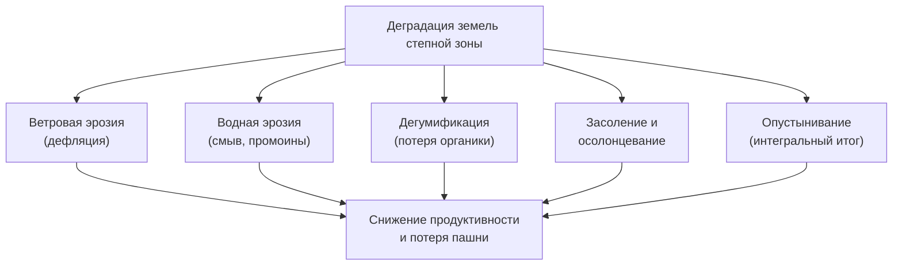
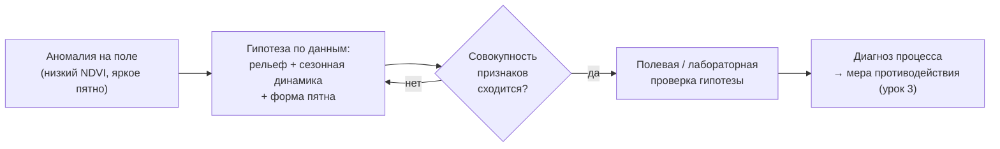

# Диагностируем деградацию земель степной зоны

> ⏱ **Трудозатраты:** ~28 мин чтения + ~25 мин практики
>
> Модуль **[А5: Устойчивое землепользование и агроэкология Северного Казахстана](../index.md)**, урок 2.
> Академический уровень. Проект UNDP-KAZ-00683, FOLUR. Компоненты FOLUR: **1**, **2**.

## Цели урока и место в модуле

Функциональные зоны из [урока 1](01-landshaftnyj-podhod.md) — это скелет территории. Диагностика деградации наполняет его содержанием: она отвечает на вопрос, где земля уже теряет продуктивность, каким процессом и насколько срочно нужно вмешаться. Без диагностики план землепользования превращается в благие пожелания — мы не знаем, что защищать в первую очередь. В этом уроке мы разбираем четыре главных деградационных процесса степной зоны, учимся распознавать их по полевым признакам и по открытым спутниковым данным и связываем диагноз с решением.

После изучения урока вы сможете:

1. **[Bloom: знать]** перечислять основные типы деградации земель Северного Казахстана (ветровая и водная эрозия, дегумификация, засоление и осолонцевание, опустынивание) и их полевые признаки.
2. **[Bloom: понимать]** объяснять причинно-следственные цепочки каждого процесса: какая агротехника и какие природные условия его запускают и усиливают.
3. **[Bloom: применять]** выявлять признаки деградации на территории модельного хозяйства по открытым данным (Sentinel-2, индексы NDVI/BSI, ЦМР) и полевым наблюдениям.
4. **[Bloom: анализировать]** различать процессы со схожими внешними проявлениями (низкий NDVI от засухи, засоления или эрозии) и обосновывать диагноз совокупностью признаков.

> **Границы урока.** Внутри: типология деградации степной зоны, механизмы процессов, полевые и дистанционные признаки, логика дифференциальной диагностики, рамка ЦУР 15.3. Снаружи: агротехнические меры противодействия (no-till, севообороты, покровные культуры) — [урок 3](03-pochvosberegayushchee-zemledelie.md); количественный мониторинг и индикаторы устойчивости во времени — [урок 4](04-tochnoe-zemledelie-i-ustojchivost.md); восстановление уже деградированных участков и рекультивация — [модуль А6](../../a6/index.md); расчёт индексов по снимкам как ML-навык — [модуль А3](../../a3/index.md).

---

## 1. Деградация земель: что это и почему это стратегическая проблема

Деградация земель — это устойчивое снижение биологической и экономической продуктивности земли в результате природных процессов и хозяйственной деятельности. Ключевое слово — «устойчивое»: речь не о плохом урожае в засушливый год (это колебание), а о необратимом, накапливающемся ухудшении, которое подрывает саму способность земли производить.

Для степной зоны это не абстракция. Северный Казахстан — регион с изначально плодородными почвами (чернозёмы и тёмно-каштановые почвы), но с климатом, который делает их уязвимыми: сухость, ветра, резкие перепады. Интенсивная распашка без защитных мер запускает процессы, которые за десятилетия способны превратить продуктивную пашню в малопригодную землю.

Международной рамкой для этой проблемы служит **Цель устойчивого развития 15.3** — «нейтральный баланс деградации земель» (Land Degradation Neutrality, LDN). Её идея: к целевому году площадь и качество деградированных земель не должны расти — потери компенсируются восстановлением. Индикатор 15.3.1 (доля деградированных земель от общей площади) опирается на три субиндикатора: изменение земного покрова, динамику продуктивности земель и запасы органического углерода почвы. Все три — предмет этого модуля, и все три оцениваются в том числе по открытым спутниковым данным.

> **Подробнее** — как из этих субиндикаторов собираются измеримые показатели устойчивости для мониторинга во времени, разбирается в [уроке 4](04-tochnoe-zemledelie-i-ustojchivost.md).

### 1.1 Почему степные почвы одновременно плодородны и уязвимы

Парадокс степной зоны в том, что её лучшее качество — накопленное веками плодородие — одновременно является её слабостью. Чернозёмы и тёмно-каштановые почвы формировались тысячелетиями под покровом многолетней степной растительности: густая корневая система злаков и разнотравья год за годом возвращала в почву органику, создавала прочную комковатую структуру и накапливала гумусовый горизонт. Пока этот покров был непрерывным, почва была защищена от ветра и воды, а потери органики компенсировались её пополнением.

Распашка разрывает этот механизм в двух точках сразу. Во-первых, она снимает защитный растительный покров, оголяя поверхность в наиболее уязвимые периоды (после уборки, на парах, до всходов). Во-вторых, она прекращает естественное пополнение органики корнями многолетников и ускоряет её разложение за счёт аэрации. Почва, которая под целиной находилась в равновесии, после распашки оказывается в режиме постоянных потерь, если агротехника этих потерь не компенсирует.

Добавьте к этому климат: сухость (влага — лимитирующий фактор), сильные степные ветры и резкие перепады температур и увлажнения. Каждый из этих факторов усиливает деградацию: ветер выдувает оголённую почву, редкие, но ливневые осадки смывают её со склонов, а сухость замедляет восстановление растительного покрова. Поэтому в степи деградация развивается быстрее и восстанавливается медленнее, чем в более влажных зонах. Это не повод отказываться от земледелия, а причина строить его как почвосберегающую систему ([урок 3](03-pochvosberegayushchee-zemledelie.md)) с самого начала.



*Рис. 1. Основные процессы деградации земель степной зоны и их общий итог. Alt: древовидная схема — от корневого узла «деградация» расходятся пять процессов (ветровая эрозия, водная эрозия, дегумификация, засоление, опустынивание), все сходятся в общий итог «снижение продуктивности и потеря пашни».*

---

## 2. Четыре главных процесса степной зоны

### 2.1 Ветровая эрозия (дефляция)

Ветровая эрозия — выдувание и перенос ветром частиц верхнего, самого плодородного слоя почвы. Это исторически главный бич степной распашки: именно с ним связаны пыльные бури середины XX века, ставшие ответом целинного земледелия без защитных мер.

**Механизм.** Открытая, распылённая многократной обработкой поверхность без растительного покрова и без стерни беззащитна перед степным ветром. Ветер поднимает мелкозём, унося гумусовые и илистые частицы — именно те, что несут плодородие. Остаётся обеднённый, опесчаненный субстрат.

**Что запускает.** Отвальная вспашка, оборачивающая пласт и разрушающая структуру; измельчение почвы избыточными обработками; уборка с полным удалением пожнивных остатков; чистые (чёрные) пары без защиты; отсутствие лесополос.

**Полевые признаки.** Наносы мелкозёма у лесополос и препятствий; оголённые корни и «выдутые» микропонижения; опесчанивание поверхности; в острой форме — пыльные потоки при ветре.

**Дистанционные признаки.** Повышенная яркость и оголённость поверхности вне вегетации (высокий BSI — индекс оголённой почвы, низкий NDVI на распаханных полях в ветроопасные периоды); пространственная связь оголённых пятен с открытыми, незащищёнными полями.

Коварство дефляции в том, что она избирательна: ветер уносит именно самые ценные, мелкие гумусовые и илистые частицы, оставляя менее плодородный крупнозём. Поэтому даже без видимой потери мощности слоя качество почвы падает — она обедняется избирательно. Это объясняет, почему поле «на глаз целое» может год за годом снижать отдачу: плодороднейшая фракция выдувается первой. Защитный каркас лесополос и сохранение стерни ([урок 3](03-pochvosberegayushchee-zemledelie.md)) — прямой ответ именно на этот механизм: они снижают скорость приземного ветра и удерживают поверхность.

### 2.2 Водная эрозия

Водная эрозия — смыв и размыв почвы стекающей водой: талой весной и ливневой летом. В степи она уступает ветровой по площади, но на склонах бывает разрушительной.

**Механизм.** Вода, стекающая по склону, отрывает и уносит частицы почвы. Начинается с плоскостного смыва (незаметная потеря тонкого слоя по всей поверхности), прогрессирует до струйчатых промоин и оврагов. Распашка вдоль склона превращает борозды в русла-ускорители.

**Что запускает.** Распашка склонов, особенно вдоль уклона; уничтожение задерживающих сток элементов (буферных полос, залежей); переуплотнение почвы, снижающее впитывание; отсутствие снегозадержания, дающего дружный талый сток.

Особенность степи — вклад **талого стока**. Весной снег, накопленный за зиму, сходит дружно, и по мёрзлой, ещё не впитывающей почве вода стекает по склонам, унося оттаявший верхний слой. Поэтому снегозадержание работает двояко: оно и копит влагу, и, при равномерном сходе, снижает эрозионную силу талого потока. Ливневая летняя эрозия добавляется к талой, но именно весенний сток по мёрзлой почве часто формирует основные промоины сезона.

**Полевые признаки.** Промоины и рытвины в лощинах и на склонах; смытый, укороченный профиль на бровках и осветлённая почва там, где обнажился нижний горизонт; наносы у подножий склонов; заиление водоприёмников.

**Дистанционные признаки.** Приуроченность деградационных пятен к склонам (совмещение с ЦМР и уклонами); линейные структуры промоин на снимках высокого разрешения; заиление и рост мутности водоёмов ниже по склону.

### 2.3 Дегумификация

Дегумификация — потеря почвенного органического вещества (гумуса). Это «тихая» деградация: она не видна как овраг, но именно она подрывает плодородие в основе.

**Механизм.** Гумус — накопленный за тысячелетия под степной растительностью резервуар питания, влагоёмкости и структуры почвы. Распашка ускоряет разложение (минерализацию) органики и прекращает её естественное пополнение корнями многолетних трав. Если возврат органики (пожнивные остатки, навоз, сидераты) меньше её потерь, запас гумуса снижается год за годом.

**Что запускает.** Интенсивная обработка, аэрирующая почву и ускоряющая минерализацию; вынос соломы с поля; монокультура зерновых без трав и бобовых в севообороте; чистые пары, где почва «работает вхолостую», теряя органику.

**Полевые признаки.** Осветление пахотного горизонта; ухудшение структуры (глыбистость, распыление, заплывание после дождя, корка); снижение влагоёмкости и отзывчивости на осадки. Точная оценка — только по агрохимическому анализу (содержание органического углерода/гумуса).

**Дистанционные признаки.** Косвенно — по цвету/яркости открытой почвы (тёмная гумусированная почва темнее на снимке), но надёжный диагноз требует лабораторного подтверждения. Дистанционка здесь — инструмент выявления зон для отбора проб, а не замена анализа.

!!! warning "Границы применимости"
    Содержание гумуса нельзя «измерить со спутника» с точностью агрохимического анализа. Спутниковые индексы яркости почвы лишь указывают, где отобрать пробы. Любые конкретные цифры содержания гумуса, темпов его потери или прироста должны браться из лабораторных данных и официальных источников, а не постулироваться. В этом уроке мы намеренно не приводим числовых норм — они [UNVERIFIED] без привязки к конкретной почве и методике.

### 2.4 Засоление и осолонцевание

Засоление — накопление водорастворимых солей в корнеобитаемом слое; осолонцевание — насыщение почвенного поглощающего комплекса натрием, ухудшающее структуру. В степной и сухостепной зоне встречаются пятна солонцов и солончаков, а неграмотное орошение способно засолить и незасолённые почвы.

**Механизм.** Соли поднимаются к поверхности с грунтовой водой при её высоком уровне и сильном испарении, либо накапливаются при поливе минерализованной водой без дренажа. Натрий разрушает структуру, почва становится плотной, бесструктурной, плохо проницаемой.

**Что запускает.** Орошение без дренажа и без контроля минерализации воды; подъём грунтовых вод (в том числе после подтопления); распашка солонцовых комплексов без мелиорации.

**Полевые признаки.** Белёсые солевые выцветы на поверхности; «плешины» с угнетённой или отсутствующей растительностью; плотная, вязкая во влажном состоянии и твёрдая в сухом почва солонцов; специфическая солевыносливая сорная растительность.

**Дистанционные признаки.** Яркие (высокая отражательная способность) пятна на снимках; устойчиво низкий NDVI на засолённых плешинах, не совпадающий с рельефными эрозионными формами; приуроченность к понижениям с близкой грунтовой водой.

---

### 2.5 Опустынивание как интегральный итог

Опустынивание в контексте степной зоны — это не наступление песчаных дюн, а деградация земель засушливых территорий до состояния, близкого к пустынному: устойчивая потеря продуктивности, обеднение растительного и почвенного покрова. Это не отдельный «пятый процесс», а **интегральный итог** совместного действия эрозии, дегумификации и засоления, усиленного сухостью климата. Когда несколько процессов накладываются и не встречают противодействия, земля постепенно теряет способность к самовосстановлению.

Именно опустынивание — та рамка, в которой международное сообщество (Конвенция ООН по борьбе с опустыниванием, UNCCD) ставит цель нейтрального баланса деградации земель (ЦУР 15.3). Для планирования это означает, что диагностику нельзя вести по одному процессу: угнетённое поле в сухостепной зоне часто несёт следы сразу нескольких процессов, и их нужно распутать (§4), чтобы назначить верный комплекс мер.

### 2.6 Цена бездействия: что теряет хозяйство

Деградацию легко откладывать «на потом», потому что в отдельно взятый год её вклад в убыток кажется небольшим на фоне погоды и цен. Но это иллюзия горизонта. Потери от деградации накапливаются и в какой-то момент становятся необратимыми: смытый почвенный горизонт не восстанавливается за сезон, потерянный за десятилетия гумус возвращается годами направленных усилий, засолённая плешина без мелиорации выпадает из оборота надолго.

Экономически деградация бьёт по хозяйству несколькими путями сразу. Снижается урожайность на затронутых участках. Растут затраты — приходится компенсировать потерю плодородия удобрениями, обрабатывать проблемные поля дополнительно, а иногда выводить землю из оборота. Падает устойчивость дохода: деградированная почва хуже держит влагу, поэтому сильнее проваливается в засушливые годы. Наконец, теряется стоимость самого актива — земли: истощённое поле стоит меньше и хуже подходит для программ поддержки и «зелёного» рынка.

Диагностика — это именно то, что переводит расплывчатое «земля портится» в конкретные адреса и приоритеты: вот здесь эрозия, здесь засоление, здесь дегумификация, и вот в таком порядке нужно вмешаться. Без этого перевода любой план обречён распылять ресурсы. Числовые оценки ущерба здесь намеренно не приводятся — они зависят от конкретного хозяйства и считаются на его данных, а не постулируются как «средние потери».

## 3. Инструменты дистанционной диагностики

Прежде чем ставить диагноз, полезно систематизировать спутниковый инструментарий — он общий для всех процессов, различается лишь интерпретация.

- **NDVI** (вегетационный индекс) — «зелёность» и активность растительности. Низкие значения на пашне в вегетацию — сигнал угнетения; но причина не читается по одному NDVI.
- **BSI** (Bare Soil Index, индекс оголённой почвы) — доля открытого грунта. Высокий BSI на полях, которые должны быть покрыты, — признак эрозионной уязвимости и потери покрова.
- **Солевые индексы и высокая яркость** — засолённые поверхности сильно отражают свет; устойчиво яркие пятна в понижениях с низким NDVI — кандидаты в засоление.
- **NDWI/MNDWI** (водные индексы) — граница воды и влажность; помогают выделять понижения с близкой грунтовой водой и приводоёмные полосы (подробно — [модуль А4](../../a4/index.md)).
- **Производные рельефа** (уклон, кривизна, аккумуляция стока по ЦМР) — привязывают процессы к формам рельефа: склоны → водная эрозия, понижения → засоление.
- **Временные ряды** всех индексов — отличают устойчивый признак деградации от сезонного или разового явления (детально — [урок 4](04-tochnoe-zemledelie-i-ustojchivost.md)).

Ни один индекс не работает в одиночку. Диагностическая сила появляется при **совмещении слоёв**: низкий NDVI + высокий BSI + склон = эрозия; низкий NDVI + высокая яркость + понижение = засоление. Это оверлейный анализ (навык [А2](../../a2/index.md)), применённый к диагностике.

## 4. Дифференциальная диагностика: не спутать процессы

Главная методическая трудность в том, что разные процессы дают **похожий внешний сигнал**. Низкий NDVI на поле может означать засуху, засоление, эрозионное обеднение почвы, вымочку, повреждение вредителем или просто фазу развития культуры. Поставить диагноз по одному индексу — грубая ошибка.

Правильный подход — **диагноз по совокупности признаков**, где спутниковый сигнал сопоставляется с рельефом, положением в ландшафте, сезонной динамикой и полевой проверкой:

| Признак / процесс | Ветровая эрозия | Водная эрозия | Засоление | Дегумификация |
|---|---|---|---|---|
| Приуроченность к рельефу | открытые ровные поля, наветренные края | склоны, лощины | понижения, близкая грунт. вода | равномерно по полю |
| Форма пятен | пятна у препятствий, наносы | линейные промоины | «плешины», выцветы | площадная, диффузная |
| Яркость открытой почвы | повышенная (опесчанивание) | повышенная на смытых бровках | высокая (соли) | повышенная (осветление) |
| Сезонная динамика NDVI | провал в ветроопасные периоды | связь с ливнями/таянием | устойчиво низкий круглый год | постепенное общее снижение по годам |
| Ключевая полевая проверка | наносы, оголённые корни | промоины, смытый профиль | солевые выцветы, солевынос | агрохимия (органика) |

Правило диагностики: **сначала гипотеза по дистанционным данным и рельефу, затем обязательная полевая или лабораторная проверка.** Спутник указывает «где смотреть» и «на что похоже»; окончательный диагноз ставит человек, соединяя источники. Это тот же принцип «ИИ/данные ускоряют — человек верифицирует», что и в ИИ-слое модуля.



*Рис. 2. Логика дифференциальной диагностики деградации: от аномалии через гипотезу к проверенному диагнозу. Alt: горизонтальная схема — аномалия на поле ведёт к гипотезе по данным, затем развилка проверки совокупности признаков; при несходимости цикл возврата к гипотезе, при сходимости — полевая проверка и итоговый диагноз с переходом к мерам.*

### 4.1 От диагноза к приоритету и зоне

Диагноз — не конечная точка, а вход в планирование. Выявленные проблемные участки нужно, во-первых, приоритизировать, во-вторых, привязать к функциональным зонам ([урок 1](01-landshaftnyj-podhod.md)).

Приоритизация отвечает на вопрос «за что браться первым». Она учитывает несколько факторов: срочность (активный овраг растёт быстрее, чем медленная дегумификация), обратимость (засолённую плешину проще предотвратить, чем вернуть), площадь и ценность затронутой земли, а также стоимость и выполнимость меры. Ресурсы хозяйства ограничены, поэтому карта диагнозов без приоритетов ведёт к распылению сил; карта с приоритетами превращается в план действий.

Привязка к зонам замыкает круг модуля. Сильно эродированный склон переходит из пашенной зоны в буферную или кормовую; засолённая плешина — в восстанавливаемый участок или под мелиорацию; поле с ранними признаками дегумификации остаётся в пашне, но получает изменённую агротехнику ([урок 3](03-pochvosberegayushchee-zemledelie.md)). Так диагностика напрямую перекраивает функциональное зонирование, а не остаётся отдельным упражнением.

Важно, что диагноз задаёт и точку отсчёта для мониторинга. Зафиксировав сегодняшнее состояние проблемного участка (индексы, снимки, пробы), вы получаете базу, относительно которой позже измеряется, работают ли принятые меры ([урок 4](04-tochnoe-zemledelie-i-ustojchivost.md)). Диагностика без такой фиксации теряет половину ценности: нельзя доказать улучшение, если не зафиксировано исходное состояние.

> **Подробнее** — техника расчёта NDVI, BSI и других индексов по временным рядам Sentinel-2, включая маскирование облаков, — в [модуле А3](../../a3/index.md); построение мониторинговых рядов во времени — в [уроке 4](04-tochnoe-zemledelie-i-ustojchivost.md).

---

## Региональный кейс

**Ситуация:** Агроном модельного хозяйства в Есильском районе Северо-Казахстанской области видит на нескольких полях устойчиво угнетённые участки: растения там слабые, местами голая почва. По одному снимку он готов списать всё на засуху и увеличить норму удобрений. Прежде чем тратить деньги, ставится задача разобраться, один ли это процесс или разные, — потому что от диагноза зависит мера.

**Данные:** Sentinel-2 L2A через Copernicus Data Space (<https://dataspace.copernicus.eu/>) или Google Earth Engine (<https://earthengine.google.com/>) — сезонные композиты NDVI и BSI за несколько дат; Copernicus DEM — уклоны и понижения; OpenStreetMap — гидрография; полевые фото и агрохимические пробы (собираются хозяйством).

**Задача:**
1. Постройте по датам сезонную динамику NDVI на проблемных участках и сопоставьте их положение с рельефом (склоны/понижения) и гидрографией.
2. Разделите участки на гипотетические процессы: где картина указывает на эрозию склона, где — на засоление в понижении, где — на общий фон дегумификации.
3. Назначьте для каждого типа участка обязательную полевую или лабораторную проверку, подтверждающую гипотезу.

**Разбор:** Единый диагноз «засуха» почти наверняка ошибочен: участки на склонах с линейными промоинами — водная эрозия; яркие плешины с устойчиво низким круглогодичным NDVI в понижениях — засоление; диффузное общее снижение отзывчивости по годам — дегумификация. Прибавка удобрений на засолённой плешине денег не вернёт — там нужна мелиорация или вывод под другой режим, а на эродированном склоне — залужение и буферные полосы (урок 3). Конкретные площади, содержание солей и гумуса в разборе не приводятся — они устанавливаются пробами и лабораторией хозяйства, а не выдумываются.

> Этот кейс продолжается в [Практикуме](../practicum/01-plan-zemlepolzovaniya.md) — там диагностированные проблемные зоны становятся входом для плана землепользования.

---

## Закрепление и применение

!!! example "Попробуйте в Colab"
    Возьмите одно поле модельного хозяйства и постройте по Sentinel-2 два индекса за одну дату вне вегетации: NDVI и BSI (Bare Soil Index). Наложите на них слой уклонов из ЦМР. Найдите участки, где низкий NDVI совпадает с высоким BSI и склоном, — это кандидаты в эрозионные зоны для полевой проверки. Ноутбук: `<URL будет назначен при создании репозитория ноутбуков>`.

!!! warning "Границы применимости"
    Ни один спутниковый индекс не ставит диагноз сам по себе. Низкий NDVI — это симптом, а не причина. Дегумификацию и засоление подтверждает только полевая и лабораторная проверка; со спутника вы получаете гипотезу и адрес для отбора проб. Не переносите вывод об одном процессе на всё поле и не приписывайте деградации то, что окажется фазой развития культуры или разовой вымочкой.

!!! tip "Что это даёт вашему хозяйству"
    Правильный диагноз экономит деньги напрямую: удобрять засолённую плешину бесполезно, а бороться с «засухой» на эрозионном склоне — значит лечить симптом. Карта диагностированных зон показывает, куда вкладываться (мелиорация, залужение, лесополоса), а где земля здорова и её можно интенсифицировать. Это основа и для плана землепользования, и для обоснованной заявки на поддержку.

!!! question "Кейс для размышления"
    Два соседних поля показывают одинаково низкий NDVI в июле. На одном причина — засоление, на другом — недобор влаги в засушливый год. Какие дополнительные данные (по датам, по рельефу, по истории поля) позволят вам различить эти случаи, не выходя в поле, — и где проходит граница, за которой без выезда не обойтись?

---

### Проверь себя

```quiz
[
  {
    "q": "Что отличает деградацию земель от обычного колебания урожая?",
    "options": [
      "Устойчивое, накапливающееся снижение продуктивности, подрывающее саму способность земли производить",
      "Любое снижение урожая в отдельно взятый засушливый год",
      "Временное пожелтение посевов в фазу созревания",
      "Разовое повреждение поля градом"
    ],
    "answer": 0,
    "explain": "§1: деградация — это устойчивое, накапливающееся ухудшение, а не разовое колебание урожая от погоды или повреждения."
  },
  {
    "q": "Исторически главный деградационный процесс степной распашки Северного Казахстана, породивший пыльные бури целинного периода:",
    "options": [
      "Ветровая эрозия (дефляция) открытой распылённой поверхности без стерни и лесополос",
      "Засоление от избыточного орошения",
      "Водная эрозия на крутых горных склонах",
      "Подтопление грунтовыми водами"
    ],
    "answer": 0,
    "explain": "§2.1: пыльные бури целины связаны с ветровой эрозией открытой, лишённой стерни и лесополос поверхности; ответом стала почвозащитная система."
  },
  {
    "q": "Почему дегумификацию называют «тихой» деградацией?",
    "options": [
      "Она не видна как овраг, идёт постепенно и надёжно подтверждается только агрохимическим анализом",
      "Она происходит только ночью",
      "Она мгновенно уничтожает урожай в один сезон",
      "Её видно со спутника точнее, чем в поле"
    ],
    "answer": 0,
    "explain": "§2.3: потеря гумуса не имеет яркого внешнего проявления, накапливается постепенно; точный диагноз даёт лаборатория, а не глаз или спутник."
  },
  {
    "q": "Поле показывает устойчиво низкий NDVI круглый год на ярких «плешинах» в понижении рельефа. Наиболее вероятная гипотеза:",
    "options": [
      "Засоление/осолонцевание в понижении с близкой грунтовой водой",
      "Ветровая эрозия наветренного края поля",
      "Нормальная фаза созревания пшеницы",
      "Град в прошлом сезоне"
    ],
    "answer": 0,
    "explain": "§2.4 и §4: яркие пятна с устойчиво низким круглогодичным NDVI в понижениях — характерный признак засоления, в отличие от сезонных или склоновых процессов."
  },
  {
    "q": "Каков корректный порядок постановки диагноза деградации по данным?",
    "options": [
      "Гипотеза по дистанционным данным и рельефу → обязательная полевая/лабораторная проверка → диагноз",
      "Диагноз ставится сразу по одному значению NDVI без проверки",
      "Сначала мера противодействия, потом диагноз",
      "Достаточно мнения соседа о причине угнетения посевов"
    ],
    "answer": 0,
    "explain": "§4: спутник даёт гипотезу и адрес для проверки; окончательный диагноз ставит человек, соединяя данные с полевой/лабораторной проверкой — принцип «данные ускоряют, человек верифицирует»."
  }
]
```

### Контрольные вопросы

1. Назовите четыре главных деградационных процесса степной зоны и по одному полевому признаку каждого. *(Bloom: знать)*
2. Объясните, почему увеличение нормы удобрений не решает проблему засолённой плешины. *(Bloom: понимать)*
3. Для проблемного поля своего хозяйства опишите, какие данные вы сопоставите, чтобы отличить эрозию от засоления, и какую полевую проверку назначите. *(Bloom: применять/анализировать)*

---

## Что дальше?

Диагноз без лечения бесполезен. В [уроке 3](03-pochvosberegayushchee-zemledelie.md) мы переходим от «что не так» к «что делать»: почвосберегающая система земледелия (no-till, mini-till, покровные культуры, севообороты) как ответ на диагностированные процессы. Каждая мера там прямо привязана к процессу, который она останавливает.

- Расчёт спектральных индексов и временных рядов по Sentinel-2 — [модуль А3](../../a3/index.md).
- Мониторинг устойчивости во времени и индикаторы ЦУР 15.3 — [урок 4](04-tochnoe-zemledelie-i-ustojchivost.md).
- Восстановление уже деградированных участков — [модуль А6](../../a6/index.md).
- Профессиональная адаптация практик сбережения почвы — [П8: Почвосберегающее земледелие](../../p8/index.md).
