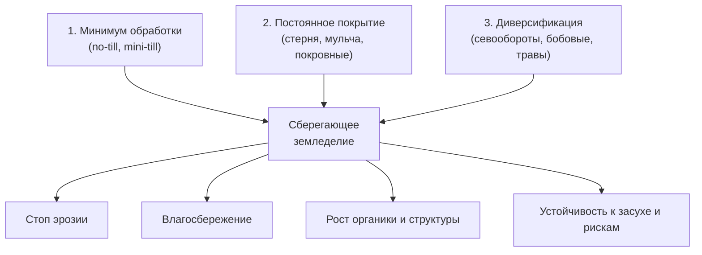
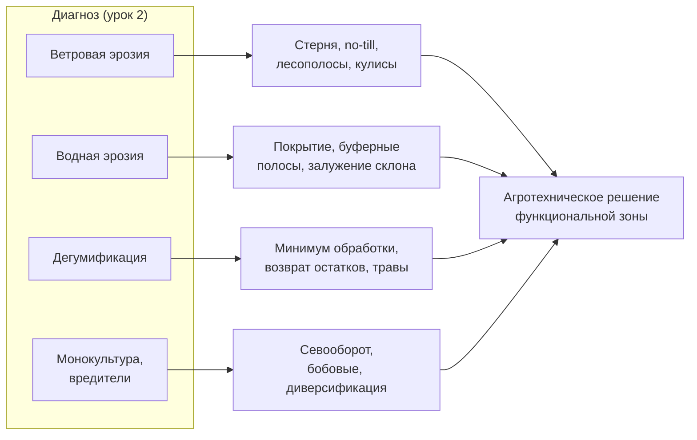

# Проектируем почвосберегающую систему земледелия

> ⏱ **Трудозатраты:** ~28 мин чтения + ~25 мин практики
>
> Модуль **[А5: Устойчивое землепользование и агроэкология Северного Казахстана](../index.md)**, урок 3.
> Академический уровень. Проект UNDP-KAZ-00683, FOLUR. Компоненты FOLUR: **1**, **2**.

## Цели урока и место в модуле

[Урок 2](02-degradaciya-zemel.md) научил диагностировать деградацию. Теперь — лечение. Почвосберегающее (сберегающее, консервационное) земледелие — это система агротехники, которая останавливает диагностированные процессы и восстанавливает почву, продолжая производить продукцию. В степной зоне это не мода, а выстраданный десятилетиями ответ на эрозию. В этом уроке мы разбираем систему по элементам — обработка почвы, покрытие поверхности, диверсификация культур и севообороты — и учимся собирать из них целостное агротехническое решение для функциональных зон, размеченных в [уроке 1](01-landshaftnyj-podhod.md).

После изучения урока вы сможете:

1. **[Bloom: знать]** перечислять три принципа сберегающего земледелия FAO, системы обработки почвы (отвальная, mini-till, no-till) и элементы севооборота степной зоны.
2. **[Bloom: понимать]** объяснять, как каждый элемент системы противодействует конкретному деградационному процессу и как элементы работают в синергии.
3. **[Bloom: применять]** подбирать систему обработки, покровные культуры и схему севооборота под условия и диагноз конкретного модельного хозяйства.
4. **[Bloom: анализировать]** сопоставлять альтернативные системы земледелия и севообороты по влиянию на почву, влагу и устойчивость и обосновывать выбор.

> **Границы урока.** Внутри: три принципа сберегающего земледелия, системы обработки почвы, покровные культуры и мульча, севообороты и диверсификация, синергия элементов, переход на no-till. Снаружи: диагностика процессов, которые эти меры лечат, — [урок 2](02-degradaciya-zemel.md); точное земледелие, переменные нормы и NDVI-мониторинг эффекта мер — [урок 4](04-tochnoe-zemledelie-i-ustojchivost.md); экономика перехода и субсидии — [П8](../../p8/index.md)/[П14](../../p14/index.md); детальные севообороты и кормовая база — [П9](../../p9/index.md). Числовых норм высева, доз и цен здесь нет намеренно — они зависят от хозяйства и берутся из проверенных агрономических источников.

---

## 1. Три принципа сберегающего земледелия

Сберегающее (консервационное) земледелие FAO стоит на трёх взаимосвязанных принципах. Ни один не работает в одиночку — сила в их сочетании.

1. **Минимальное механическое воздействие на почву.** Отказ от оборота пласта и сокращение числа обработок вплоть до прямого посева (no-till). Цель — сохранить структуру почвы, её поры, каналы корней и червей, не разрушать и не распылять верхний слой.
2. **Постоянное покрытие поверхности почвы.** Пожнивные остатки (стерня, солома), мульча, покровные культуры укрывают почву круглый год. Покрытие гасит удар дождевых капель, снижает испарение, задерживает снег, кормит почвенную биоту и защищает от ветра и смыва.
3. **Диверсификация культур во времени и пространстве.** Севообороты с чередованием культур разных семейств, включение бобовых и трав. Разнообразие разрывает циклы вредителей и болезней, балансирует питание, поддерживает органику и снижает риск.

Эти три принципа — прямое воплощение элементов агроэкологии FAO (разнообразие, синергия, рециркуляция, устойчивость к потрясениям) на уровне поля. И они прямо отвечают на диагнозы урока 2: покрытие почвы гасит и ветровую, и водную эрозию; минимум обработки и возврат остатков тормозят дегумификацию; диверсификация повышает устойчивость всей системы. Обратите внимание: ни один принцип не «лечит» только одну проблему — каждый работает сразу на несколько целей, и именно это делает систему экономной. Один агроприём, дающий эффект по нескольким фронтам, выгоднее набора узких мер.



*Рис. 1. Три принципа сберегающего земледелия и их совокупный эффект. Alt: схема — три принципа (минимум обработки, постоянное покрытие, диверсификация) сходятся в узел «сберегающее земледелие», из которого расходятся четыре эффекта: остановка эрозии, влагосбережение, рост органики, устойчивость к засухе.*

---

## 2. Система обработки почвы: от отвала к прямому посеву

Обработка почвы — самый заметный и самый спорный элемент системы. Выбор здесь определяет судьбу структуры и остатков.

### 2.1 Лестница интенсивности обработки

- **Отвальная (традиционная) вспашка.** Плуг оборачивает пласт, заделывая остатки вглубь и оставляя поверхность открытой. Даёт чистое поле и быструю минерализацию, но разрушает структуру, ускоряет потерю органики и оставляет почву беззащитной перед ветром и водой. В степи — исторический источник дефляции.
- **Минимальная обработка (mini-till).** Сокращённое рыхление без оборота пласта, часто с сохранением части стерни на поверхности. Компромисс: меньше разрушения структуры и лучше защита, чем при отвале, но обработка ещё присутствует.
- **Плоскорезная (безотвальная) обработка.** Рыхление с подрезанием сорняков, но с сохранением стерни на поверхности. Историческое ядро почвозащитной системы Северного Казахстана (научная школа Шортандинского института им. А. И. Бараева): стерня держит снег и защищает от ветра. Мост между mini-till и прямым посевом.
- **Прямой посев (no-till).** Полный отказ от обработки: семя укладывается в необработанную почву специальной сеялкой сквозь слой пожнивных остатков. Максимально сохраняет структуру, влагу и остатки; требует иной техники, продуманной защиты растений и терпения на переходный период.

Правило степной зоны: **чем суше и ветроопаснее территория, тем сильнее аргумент в пользу сохранения стерни и минимизации обработки.** Влага и защита от ветра здесь важнее «чистоты» поля. Этот принцип объясняет, почему исторический переход региона от отвальной вспашки к безотвальной обработке был не агрономической модой, а вопросом выживания земледелия после пыльных бурь: оборот пласта в открытой степи буквально подставлял почву под ветер.

### 2.2 No-till: не «ничего не делать», а другая система

Частое заблуждение — что no-till это «просто перестать пахать». На деле это переход на другую систему целиком: иная сеялка (прямого высева), другая стратегия защиты растений (без механической прополки роль сорнякового контроля меняется), управление пожнивными остатками (равномерное распределение при уборке), другая логика питания.

Переход на no-till — процесс с переходным периодом, в течение которого почва перестраивает структуру и биоту, а хозяйство — технику и навыки. В первые годы возможны сложности (уплотнение, накопление остатков, изменение фитосанитарной обстановки), которые проходят по мере становления системы. Поэтому переход планируют, а не совершают одномоментно на всей площади.

> **Подробнее** — пошаговый план перехода хозяйства на no-till с экономикой и техникой — в профессиональном [модуле П8](../../p8/index.md). Числовые параметры (нормы высева, дозы, стоимость техники) там берутся из проверенных источников и данных хозяйства, а не постулируются.

### 2.3 Экономика и риски перехода: почему поэтапно

Переход на сберегающую систему — это инвестиция с отложенной отдачей, и это нужно понимать заранее, чтобы не разочароваться. В первые годы хозяйство несёт затраты (новая сеялка прямого посева, перестройка защиты растений, обучение персонала) и одновременно проходит период, когда почва ещё не перестроила структуру и биоту. Выгоды — экономия на топливе и обработках, рост влагозапаса, восстановление почвы как актива — накапливаются постепенно и раскрываются на горизонте нескольких лет.

Отсюда правило поэтапности. Переводить всё хозяйство на no-till за один сезон рискованно: любая ошибка (неотработанная защита растений, неравномерное распределение остатков, неверный подбор культур) множится на всю площадь. Разумный путь — пилот на части полей, где отрабатываются техника, севооборот и фитосанитарная стратегия, с последующим расширением по мере накопления опыта и уверенности. Пилот также даёт хозяйству собственные, а не заимствованные данные об эффекте — их затем измеряют мониторингом ([урок 4](04-tochnoe-zemledelie-i-ustojchivost.md)).

Отдельный экономический аргумент степной зоны — устойчивость дохода, а не только его среднее значение. Сберегающая система сглаживает провалы в засушливые годы (за счёт влагосбережения), снижая амплитуду колебаний урожая. Для хозяйства с ограниченным запасом прочности стабильность важнее рекордов: она снижает риск разорения в неблагоприятный год. Конкретные цифры окупаемости зависят от хозяйства и берутся из проверенных расчётов ([П8](../../p8/index.md), [П14](../../p14/index.md)), а не обещаются заранее.

!!! warning "Границы применимости"
    No-till — мощная, но не универсальная система. Её эффект и скорость зависят от почвы, увлажнения, культур и качества исполнения. Слепое копирование чужой схемы без учёта своей территории и без диагностики (урок 2) может не дать эффекта или навредить в переходный период. Никакие «гарантированные прибавки урожая в X%» не приводятся — конкретный результат проверяется на своей земле мониторингом (урок 4).

---

## 3. Покрытие почвы: стерня, мульча, покровные культуры

Второй принцип — постоянное покрытие — в степи решает главную задачу: удержать влагу и остановить эрозию.

**Пожнивные остатки (стерня, солома).** Оставленные на поле и равномерно распределённые остатки — первая линия защиты. Стерня задерживает снег (ключевой источник влаги в степи), гасит удар капель и ветер, постепенно возвращает органику. Вынос соломы с поля ради продажи или подстилки — прямой вклад в дегумификацию и эрозию; это решение должно быть осознанным.

**Покровные (промежуточные) культуры.** Растения, высеваемые не ради товарного урожая, а ради почвы: они укрывают поверхность в межсезонье, корнями структурируют почву, кормят биоту, а бобовые покровные ещё и фиксируют азот. В засушливой степи выбор покровных ограничен влагой — они не должны иссушать почву в ущерб основной культуре, поэтому их подбор особенно осторожен. Это важная оговорка: в более влажных регионах покровные культуры — почти безусловное благо, но в сухой степи между «укрыть почву» и «не отнять влагу у основной культуры» есть реальный компромисс, который решается под конкретную влагообеспеченность и год, а не по универсальному рецепту.

**Кулисные пары.** Историческая степная практика: полосы высокостебельных растений (кулисы) на паровом поле задерживают снег и защищают от ветра. Пример того, как защита поверхности встроена в саму организацию поля.

Отдельно стоит сказать о **почвенной биоте**, которую покрытие кормит. Здоровая почва — живая система: черви, микроорганизмы и грибы создают структуру, каналы для воды и корней, перерабатывают органику в доступное растениям питание. Пожнивные остатки и покровные культуры — это пища для этой системы; постоянная обработка и оголение почвы, наоборот, разрушают её местообитание. Поэтому покрытие поверхности работает не только механически (гасит ветер и удар капель), но и биологически — поддерживает почвенную жизнь, которая и есть основа долгосрочного плодородия. Этот биологический аргумент объясняет, почему эффект сберегающей системы накапливается годами: восстановление биоты и структуры — процесс небыстрый.

**Чистый (чёрный) пар — под вопросом.** Пар без покрытия «отдыхает» и накапливает влагу и нитраты, но открытая распылённая поверхность беззащитна перед дефляцией и теряет органику. Сберегающая логика подталкивает к замене чистого пара занятым или химическим паром с сохранением покрытия — где это позволяет влагообеспеченность.

---

## 4. Севообороты и диверсификация

Третий принцип — разнообразие во времени. Севооборот — научно обоснованное чередование культур на поле по годам. Это не бухгалтерия, а инструмент управления почвой, влагой, питанием и фитосанитарией.

**Зачем чередовать:**

- **Разрыв циклов вредителей и болезней.** Монокультура зерновых накапливает специфические патогены и вредителей; чередование с культурами других семейств разрывает эти циклы без химии.
- **Баланс питания.** Разные культуры выносят и возвращают разные элементы; бобовые фиксируют азот и оставляют его последующей культуре.
- **Поддержание органики и структуры.** Многолетние травы в севообороте накапливают органику и структурируют почву, работая против дегумификации.
- **Управление влагой.** Культуры различаются по водопотреблению и глубине корней; грамотное чередование сглаживает влагопотребление и снижает риск в засушливые годы.
- **Снижение риска.** Диверсифицированное хозяйство менее уязвимо к провалу одной культуры или одного рынка.

В зерновом Северном Казахстане севооборот традиционно строится вокруг пшеницы, но устойчивая логика — разбавлять зерновую монокультуру бобовыми, масличными и многолетними травами, а также пересматривать роль чистого пара. Конкретная схема (число полей, набор и чередование культур) зависит от увлажнения, специализации и рынка хозяйства и проектируется индивидуально.

Особая роль в степном севообороте у **бобовых культур**. Они фиксируют атмосферный азот в симбиозе с клубеньковыми бактериями и оставляют часть его последующей культуре, снижая потребность в азотных удобрениях. Кроме того, бобовые — хороший предшественник и элемент диверсификации, разрывающий циклы болезней зерновых. Программа FOLUR в Казахстане прямо поддерживает агроэкологические финансовые инструменты вокруг бобовых и многолетних трав, что делает их включение в севооборот ещё и экономически привлекательным. Конкретные культуры и их доля подбираются под влагообеспеченность: в засушливой степи выбор ограничен, и он делается по районированным, проверенным данным, а не по обещаниям.

Управление сорняками, вредителями и болезнями в сберегающей системе перестраивается. При отказе от механической прополки (no-till) роль севооборота и покрытия в фитосанитарии возрастает: разнообразие культур и мульча сдерживают сорняки и патогены, снижая зависимость от химии. Это интегрированный подход — сочетание агротехнических, биологических и, при необходимости, химических методов, где химия не первый, а последний рубеж. Такой подход дешевле в долгую и мягче для агроландшафта, чем ставка на один инструмент.

> **Подробнее** — проектирование конкретных 3–5-польных севооборотов и кормовой базы под хозяйство — в [модуле П9](../../p9/index.md); переход на органическое производство — в [П10](../../p10/index.md).



*Рис. 2. От диагноза к мере: каждый деградационный процесс получает свой ответ в системе земледелия. Alt: схема связывает четыре диагноза из урока 2 (ветровая и водная эрозия, дегумификация, монокультура) с соответствующими мерами (стерня и no-till, покрытие и залужение, минимум обработки и травы, севооборот), которые сходятся в агротехническое решение функциональной зоны.*

---

### 4.1 Роль паров и место чистого пара

Пар — поле, оставленное на сезон без товарной культуры, — традиционный элемент степного земледелия, придуманный ради накопления влаги и борьбы с сорняками в условиях дефицита осадков. Но пар пару рознь. **Чистый (чёрный) пар** держит поле открытым и многократно обрабатываемым весь сезон: он копит влагу и нитраты, но платит за это оголённой, распылённой поверхностью — идеальной мишенью для дефляции и ускоренной минерализации органики.

Сберегающая логика не отменяет пар там, где он оправдан влагообеспеченностью, но меняет его форму. **Занятый пар** (с промежуточной или сидеральной культурой) и **химический пар** (борьба с сорняками без интенсивной механической обработки) сохраняют покрытие поверхности и защищают почву, частично жертвуя накоплением влаги. Выбор между вариантами — это баланс «влага против защиты почвы», решаемый под конкретную территорию и год. **Кулисный пар** — компромисс, встроенный в саму организацию поля: полосы высокостебельных растений на паровом поле держат снег и гасят ветер.

Ключевой сдвиг мышления: пар — не «отдых земли», а активное агротехническое решение с последствиями для эрозии и органики. Доля и тип пара в севообороте — предмет осознанного проектирования, а не привычки.

### 4.2 Принципы проектирования севооборота

Севооборот не собирается «на глаз». Его проектирование подчиняется нескольким принципам, которые работают вместе:

- **Чередование по семействам и типам.** Соседние по годам культуры должны различаться по семейству и биологии, чтобы разрывать циклы вредителей и болезней и по-разному нагружать почву.
- **Роль предшественника.** Каждая культура оставляет после себя определённое состояние поля (влага, азот, сорняки, остатки). Бобовые — хороший предшественник по азоту; пропашные оставляют чистое от сорняков поле; зерновые по зерновым — худший вариант по фитосанитарии.
- **Влагопотребление и глубина корней.** Чередование культур с разным водопотреблением сглаживает нагрузку на влагу — критично для степи. Глубококорневые культуры структурируют почву и достают влагу из нижних горизонтов.
- **Место многолетних трав.** Ввод многолетних трав (в том числе бобово-злаковых травосмесей) в севооборот — мощный инструмент против дегумификации: они накапливают органику и восстанавливают структуру, а также дают кормовую базу.
- **Экономика и рынок.** Севооборот должен быть не только агрономически, но и экономически жизнеспособным: набор культур увязывается со специализацией, техникой и сбытом хозяйства.

Итог проектирования — не универсальная «правильная» схема, а севооборот под конкретное хозяйство. Число полей, набор и порядок культур выбираются под увлажнение, специализацию и рынок; детальное проектирование — в [модуле П9](../../p9/index.md).

## 5. Синергия: собираем систему, а не набор приёмов

Главная ошибка — внедрять элементы поодиночке. No-till без покрытия и без севооборота часто разочаровывает; севооборот на отвальной вспашке теряет часть эффекта; покровные культуры без продуманной обработки не раскрываются. Сила — в **синергии**: три принципа усиливают друг друга, и только вместе они дают устойчивую систему.

Проектирование агротехники для хозяйства идёт от функциональных зон (урок 1) и диагнозов (урок 2): для каждой производственной зоны назначается связка «обработка + покрытие + севооборот», отвечающая её условиям и проблемам. Эродоопасный склон получит максимум покрытия и залужение; ровное влагодефицитное поле — no-till со стернёй и снегозадержанием; поле с накопленными болезнями — диверсифицированный севооборот. Итог — не список модных приёмов, а согласованная система, встроенная в план землепользования.

Историческая иллюстрация синергии — сама почвозащитная система Северного Казахстана. Она возникла не как один приём, а как ответ на катастрофу: массовая распашка целины на открытых пространствах без защиты обернулась ветровой эрозией и пыльными бурями. Разработанная в регионе система (научная школа Шортандинского института зернового хозяйства им. А. И. Бараева, Акмолинская область) связала воедино несколько элементов: безотвальную плоскорезную обработку с сохранением стерни, кулисные пары, полосное размещение культур и защитные лесополосы. Ни один из этих элементов по отдельности не остановил бы эрозию — сработало именно их сочетание. Современное сберегающее земледелие наследует этой логике, добавляя no-till, покровные культуры и диверсифицированные севообороты, но принцип тот же: устойчивость даёт система, а не отдельный приём.

Практический алгоритм сборки системы для хозяйства выглядит так. Сначала — карта зон (урок 1) и диагнозы по каждой производственной зоне (урок 2). Затем для каждой зоны подбирается связка трёх принципов под её условия: сухое ветроопасное поле — приоритет покрытию и минимуму обработки; склон — покрытию и выводу из интенсивной пашни; поле с фитосанитарными проблемами — диверсификации севооборота. Далее решения проверяются на совместимость (одна техника, реалистичный севооборот, экономика) и сводятся в единый план. Наконец, закладываются индикаторы, по которым эффект системы будет отслеживаться во времени ([урок 4](04-tochnoe-zemledelie-i-ustojchivost.md)). Так набор приёмов превращается в управляемую систему земледелия хозяйства.

---

## Региональный кейс

**Ситуация:** Модельное хозяйство в Буландынском районе Акмолинской области много лет вело пшеничную монокультуру с отвальной вспашкой и чистыми парами. По диагностике (урок 2) выявлены: ветровая эрозия на открытых полях, падение отзывчивости почвы (признаки дегумификации) и накопление зерновых болезней. Ставится задача: спроектировать переход к сберегающей системе, не обваливая производство в первый же год.

**Данные:** результаты диагностики полей (Sentinel-2 NDVI/BSI, ЦМР) из урока 2; карта функциональных зон (урок 1); агрономические данные хозяйства (набор культур, техника, увлажнение). Рамка практик — FAO Conservation Agriculture (<https://www.fao.org/conservation-agriculture/en/>) и WOCAT (<https://www.wocat.net/>).

**Задача:**
1. Свяжите каждый диагноз с элементом системы (какой принцип его лечит).
2. Предложите поэтапный, а не одномоментный переход: с каких полей и элементов начать, чтобы снизить риск переходного периода.
3. Наметьте севооборот, разбавляющий пшеничную монокультуру, и объясните, какие проблемы он снимает.

**Разбор:** Ветровую эрозию лечит сохранение стерни и минимизация обработки (плоскорезная/no-till) плюс восстановление лесополос из плана зонирования; дегумификацию — отказ от отвала, возврат остатков и ввод многолетних трав; накопление болезней — диверсифицированный севооборот с небобовыми и бобовыми культурами и пересмотр чистого пара. Переход планируется поэтапно: пилот на части полей, отработка техники и защиты растений, затем расширение — чтобы переходный период не ударил по всему хозяйству сразу. Конкретные культуры, нормы и сроки не постулируются — они проектируются в [П8](../../p8/index.md)/[П9](../../p9/index.md) на данных хозяйства и из проверенных источников.

> Этот кейс продолжается в [Практикуме](../practicum/01-plan-zemlepolzovaniya.md) — агротехнические решения становятся частью плана землепользования, а их эффект отслеживается методами [урока 4](04-tochnoe-zemledelie-i-ustojchivost.md).

---

## Закрепление и применение

!!! example "Попробуйте в Colab"
    Для одного поля хозяйства сопоставьте два зимних снимка Sentinel-2 (или Sentinel-1 SAR) — на поле со стернёй и на вспаханном поле — и оцените различие в удержании снега по площади и динамике схода. Это наглядно показывает вклад покрытия в влагозапас. Ноутбук: `<URL будет назначен при создании репозитория ноутбуков>`.

!!! warning "Границы применимости"
    Сберегающее земледелие — система, а не набор изолированных приёмов; внедрение одного элемента в отрыве от других часто разочаровывает. Эффект и переходный период зависят от почвы, увлажнения и качества исполнения. Не переносите чужую схему на своё поле без диагностики и без учёта влагообеспеченности. Конкретных прибавок урожая гарантировать нельзя — их проверяют мониторингом на своей земле.

!!! tip "Что это даёт вашему хозяйству"
    Согласованная система обработки, покрытия и севооборота напрямую работает на влагу — главный лимитирующий фактор степи — и на стабильность урожая в засушливые годы. Она снижает затраты на обработку и защиту в долгую, восстанавливает почву как актив хозяйства и делает территорию пригодной для «зелёной пшеницы» и программ поддержки FOLUR.

!!! question "Кейс для размышления"
    Сосед перешёл на no-till, но оставил отвальную логику севооборота (та же пшеничная монокультура) и продал всю солому. Через несколько лет он разочарован результатом. Какие из трёх принципов он нарушил и как это объясняет его неудачу — не отменяя ценности самого no-till?

---

### Проверь себя

```quiz
[
  {
    "q": "Три принципа сберегающего земледелия FAO — это:",
    "options": [
      "Минимум обработки почвы, постоянное покрытие поверхности, диверсификация культур",
      "Глубокая вспашка, чистый пар, монокультура пшеницы",
      "Максимум удобрений, максимум обработок, минимум остатков",
      "Орошение, дренаж и известкование"
    ],
    "answer": 0,
    "explain": "§1: три принципа — минимальное механическое воздействие, постоянное покрытие почвы и диверсификация культур; они работают только в сочетании."
  },
  {
    "q": "Почему в степной зоне сохранение стерни особенно ценно?",
    "options": [
      "Стерня задерживает снег и защищает от ветра — работает на влагу, лимитирующую урожай, и против дефляции",
      "Стерня заменяет севооборот полностью",
      "Стерня повышает температуру почвы летом до нужного уровня",
      "Стерня не влияет на влагу, важен только внешний вид поля"
    ],
    "answer": 0,
    "explain": "§2.1 и §3: в засушливой ветроопасной степи стерня держит снег (главный источник влаги) и защищает поверхность от ветровой эрозии — ядро почвозащитной системы."
  },
  {
    "q": "Утверждение «no-till — это просто перестать пахать» неверно, потому что:",
    "options": [
      "Это переход на другую систему целиком: сеялка прямого посева, иная защита растений, управление остатками, переходный период",
      "No-till требует более глубокой вспашки, чем отвал",
      "No-till означает полный отказ от любых культур",
      "No-till применяется только при орошении"
    ],
    "answer": 0,
    "explain": "§2.2: no-till — смена всей системы (техника, защита растений, управление остатками) с переходным периодом, а не одно отменённое действие."
  },
  {
    "q": "Какой принцип системы прямее всего лечит накопление зерновых болезней при пшеничной монокультуре?",
    "options": [
      "Диверсификация — севооборот с культурами других семейств разрывает циклы патогенов",
      "Минимум обработки сам по себе",
      "Вынос соломы с поля",
      "Углубление отвальной вспашки"
    ],
    "answer": 0,
    "explain": "§4: чередование культур разных семейств (диверсификация) разрывает циклы вредителей и болезней монокультуры без химии."
  },
  {
    "q": "Хозяйство внедрило no-till, но сохранило пшеничную монокультуру и вывозит всю солому. Почему эффект слабый?",
    "options": [
      "Нарушены принципы покрытия (солома вывезена) и диверсификации (монокультура) — работает лишь один из трёх, синергии нет",
      "No-till несовместим со степной зоной в принципе",
      "Нужно было добавить отвальную вспашку раз в год",
      "Проблема только в сорте пшеницы"
    ],
    "answer": 0,
    "explain": "§5: сила системы — в синергии трёх принципов; при вывезенной соломе и монокультуре работает только минимум обработки, поэтому результат разочаровывает."
  }
]
```

### Контрольные вопросы

1. Назовите системы обработки почвы от отвала к прямому посеву и по одному ключевому отличию каждой. *(Bloom: знать)*
2. Объясните, почему элементы сберегающего земледелия нужно внедрять как систему, а не поодиночке. *(Bloom: понимать)*
3. Для своего модельного хозяйства свяжите два диагноза из урока 2 с конкретными элементами системы и обоснуйте выбор. *(Bloom: применять/анализировать)*

---

## Что дальше?

Спроектированную систему нужно уметь настраивать точечно и проверять во времени. В [уроке 4](04-tochnoe-zemledelie-i-ustojchivost.md) — точное земледелие (переменные нормы внесения по менеджмент-зонам), NDVI-мониторинг эффекта мер, климатическая адаптация и индикаторы устойчивости (ЦУР 15.3, FOLUR), которые превращают качественные «стало лучше» в измеримую динамику.

- Пошаговый переход хозяйства на no-till с экономикой — [П8](../../p8/index.md).
- Проектирование севооборотов и кормовой базы — [П9](../../p9/index.md).
- Переход на органическое производство — [П10](../../p10/index.md).
- Финансовые инструменты и субсидии на устойчивые практики — [П14](../../p14/index.md).
