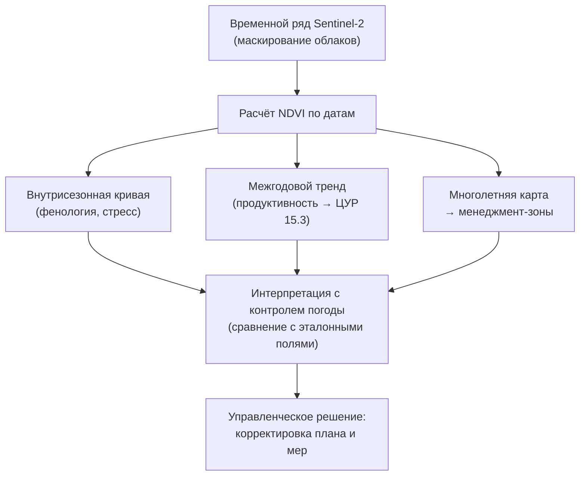
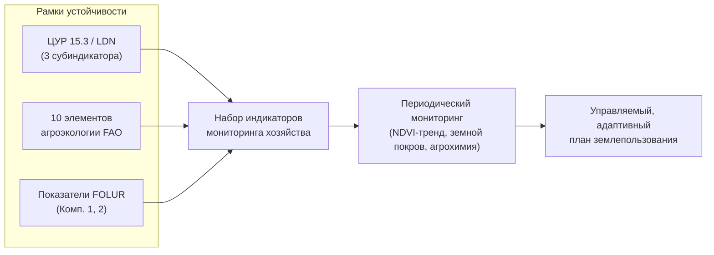

# Настраиваем мониторинг устойчивости и климатическую адаптацию

> ⏱ **Трудозатраты:** ~28 мин чтения + ~30 мин практики
>
> Модуль **[А5: Устойчивое землепользование и агроэкология Северного Казахстана](../index.md)**, урок 4.
> Академический уровень. Проект UNDP-KAZ-00683, FOLUR. Компоненты FOLUR: **1**, **2**.

## Цели урока и место в модуле

План землепользования не заканчивается на карте зон и списке мер — он живёт, только если его выполнение и эффект отслеживаются. Этот урок замыкает модуль: мы спускаемся на внутриполевой масштаб (точное земледелие), учимся мониторить состояние полей по NDVI во времени, встраиваем в план климатическую адаптацию и переводим качественную «устойчивость» в измеримые индикаторы — ЦУР 15.3, показатели FOLUR. Именно мониторинг делает план управляемым: он показывает, работают ли меры из [урока 3](03-pochvosberegayushchee-zemledelie.md) и не растёт ли деградация из [урока 2](02-degradaciya-zemel.md).

После изучения урока вы сможете:

1. **[Bloom: знать]** перечислять принципы точного земледелия, назначение NDVI-мониторинга, направления климатической адаптации и субиндикаторы ЦУР 15.3.
2. **[Bloom: понимать]** объяснять, как переменные нормы внесения и внутриполевые менеджмент-зоны связаны с неоднородностью поля, и что именно измеряют индикаторы устойчивости.
3. **[Bloom: применять]** строить временной ряд NDVI по полю на Sentinel-2 и подбирать набор индикаторов устойчивости для мониторинга модельного хозяйства.
4. **[Bloom: анализировать]** интерпретировать динамику NDVI и индикаторов, отличая эффект мер от климатических колебаний, и критически оценивать надёжность дистанционных показателей.

> **Границы урока.** Внутри: точное земледелие и переменные нормы, внутриполевые менеджмент-зоны, NDVI-мониторинг во времени, климатическая адаптация, индикаторы устойчивости (ЦУР 15.3, FOLUR, национальный контекст). Снаружи: техника расчёта индексов и ML по временным рядам — [модуль А3](../../a3/index.md); сам план землепользования собирается в [практикуме](../practicum/01-plan-zemlepolzovaniya.md); ИИ-верификация плана — в [ИИ-ассистенте](../ai-assistant.md); экономические инструменты устойчивости — [П14](../../p14/index.md)/[П15](../../p15/index.md). Числовые пороги индикаторов и национальные нормы РК здесь не постулируются — они берутся из официальных методик, иначе помечены как непроверяемые.

---

## 1. Точное земледелие: поле неоднородно

Классическая агротехника относится к полю как к однородному объекту: одна норма высева, одна доза удобрений на весь контур. Но поле неоднородно — почва, рельеф, влага и продуктивность меняются от края к краю. Точное (координатное) земледелие исходит из этой неоднородности и управляет полем дифференцированно.

**Внутриполевые менеджмент-зоны** — участки поля со схожими свойствами (продуктивностью, почвой, рельефом), выделяемые по данным: многолетним картам NDVI, урожайности, рельефу, электропроводности почвы. Внутри зоны условия однородны, между зонами — различаются, поэтому и агроприёмы различаются.

**Переменные нормы внесения** (variable rate application) — дифференцированное внесение семян, удобрений, средств защиты по менеджмент-зонам. Логика: не «в среднем по полю», а «столько, сколько нужно здесь». Это одновременно экономия ресурсов и снижение экологической нагрузки — меньше избыточного внесения, меньше выноса в воду.

Связь с устойчивостью прямая: точное земледелие — это эффективность и рециркуляция (элементы агроэкологии FAO) на уровне поля. Оно не заменяет систему из урока 3, а настраивает её точечно: где почва бедна — поддержать, где избыточна — не переудобрять.

Важно понимать, что точное земледелие — это не обязательно дорогая техника. На базовом уровне оно начинается с данных и решений: многолетняя карта NDVI и деление поля на зоны уже позволяют осмысленно дифференцировать подход, даже если внесение остаётся равномерным по зонам, а не плавно переменным. Технологическая надстройка (навигация, контроллеры переменных норм) наращивается по мере готовности хозяйства. Поэтому логика точного земледелия доступна и небольшому хозяйству — она про то, чтобы перестать относиться к неоднородному полю как к однородному, а не про обязательную покупку дорогого оборудования.

### 1.1 Как выделяют менеджмент-зоны

Менеджмент-зоны не назначают произвольно — их выделяют из данных, отражающих устойчивую неоднородность поля. Основные источники:

- **Многолетние карты NDVI.** Усреднённый за несколько лет NDVI показывает, какие части поля стабильно продуктивнее, а какие стабильно слабее. «Стабильно» здесь ключевое: разовый провал — это событие, а повторяющийся из года в год — свойство зоны.
- **Карты урожайности** (если есть данные с комбайна) — прямое свидетельство продуктивности участков.
- **Рельеф** (ЦМР): понижения накапливают влагу и вещества, вершины и склоны теряют их; экспозиция влияет на прогрев и увлажнение.
- **Свойства почвы** — по агрохимическим пробам и, косвенно, по электропроводности и спектру открытой почвы.

Ключевой принцип — **устойчивость границ зон во времени**. Если разбить поле на зоны по одному снимку, вы поймаете случайную картину конкретного дня. Надёжные зоны выделяются по многолетним данным, где случайные колебания усредняются, а остаётся структурная неоднородность. Число зон держат небольшим (обычно 2–4): дробить поле мельче, чем позволяет техника внесения, бессмысленно.

Выделив зоны, для каждой назначают дифференцированную стратегию: слабую зону — поддержать (или разобраться, почему она слабая: если причина в деградации, сначала лечить её, а не удобрять); сильную — не переудобрять сверх выноса. Так карта менеджмент-зон становится основой переменных норм.

!!! warning "Границы применимости"
    Точное земледелие — надстройка над здоровой системой, а не замена ей. Дифференцированно вносить удобрения на эродированном или засолённом поле, не устранив причину (урок 2), — значит тратить точнее, но по-прежнему впустую. Сначала диагностика и система (уроки 2–3), потом тонкая настройка. Экономический эффект переменных норм зависит от неоднородности поля и стоимости технологии — его не гарантируют «в процентах», а проверяют на своих данных.

---

## 2. NDVI-мониторинг: смотрим на поле во времени

NDVI (нормализованный разностный вегетационный индекс) — базовый спутниковый показатель «зелёности» и фотосинтетической активности растительности. Один снимок NDVI — фотография состояния; ценность для устойчивости даёт **временной ряд** NDVI: как поле ведёт себя от даты к дате внутри сезона и от года к году.

### 2.1 Что даёт временной ряд NDVI

- **Внутрисезонная кривая** (фенология): нарастание, пик и спад NDVI отражают развитие культуры. Аномалии кривой (провал, сдвиг пика) сигнализируют о стрессе — засухе, болезни, повреждении.
- **Межгодовая динамика**: сравнение сезонов показывает тренд продуктивности поля — растёт, стабилен, падает. Это прямой вход в субиндикатор «динамика продуктивности земель» ЦУР 15.3.
- **Внутриполевая изменчивость**: усреднённые за годы карты NDVI выявляют устойчиво слабые и сильные части поля — основа для менеджмент-зон (§1).
- **Оценка эффекта мер**: сравнивая динамику до и после внедрения сберегающих практик (урок 3), можно судить об их влиянии — с оговорками ниже.

### 2.2 Чего NDVI не делает

NDVI не измеряет урожай напрямую, не различает причину стресса и чувствителен к облакам, тени, фазе съёмки и типу культуры. Низкий NDVI — симптом (см. дифференциальную диагностику, [урок 2](02-degradaciya-zemel.md), §3), а не диагноз. Приписать рост NDVI исключительно своим мерам нельзя, пока не отделён вклад погоды: во влажный год «зеленеет» всё, независимо от агротехники.

**Корректная интерпретация — относительная и с контролем погоды.** Сравнивайте своё поле не только с самим собой во времени, но и с соседними/эталонными полями в тот же сезон: если ваше поле улучшилось относительно фона в засушливый год — это довод в пользу мер; если весь район «позеленел» одинаково — это погода. Это тот же принцип «данные ускоряют — человек верифицирует».



*Рис. 1. От временного ряда Sentinel-2 к управленческому решению через NDVI-мониторинг. Alt: схема — временной ряд Sentinel-2 после маскирования облаков даёт NDVI по датам, из которого выводятся внутрисезонная кривая, межгодовой тренд и многолетняя карта зон; все три проходят интерпретацию с контролем погоды и ведут к управленческому решению.*

### 2.3 Воспроизводимый рабочий процесс мониторинга

Мониторинг устойчивости имеет ценность только если он воспроизводим: тот же расчёт, повторённый через год другим человеком, должен дать сопоставимый результат. Это накладывает требования на рабочий процесс, а не только на данные.

Ключевые правила воспроизводимого NDVI-мониторинга:

- **Фиксируйте источник и параметры.** Какой спутник, какие даты, какой порог облачности, какой метод композита — всё это записывается, а не держится в голове. Смена параметров между годами делает сравнение недействительным.
- **Согласуйте фенологические окна.** Сравнивать нужно сопоставимые фазы: NDVI в одну и ту же декаду вегетации разных лет, а не «лучший снимок года», выбранный по-разному.
- **Маскируйте облака одинаково.** Необработанные облака и тени искажают NDVI сильнее любого реального тренда (техника — [модуль А3](../../a3/index.md)).
- **Храните и код, и результат.** Ноутбук или скрипт, порождающий индикатор, — часть отчёта: он позволяет проверить и повторить расчёт. Это прямой мост к pro-code ИИ-слою модуля: агент может собрать такой пайплайн, но воспроизводимость и корректность проверяет человек.

Воспроизводимость — не бюрократия, а то, что отличает индикатор от впечатления. Именно она превращает мониторинг в доказательство перед программой поддержки или покупателем.

> **Подробнее** — техника построения безоблачных композитов, маскирование, ML по временным рядам NDVI (MiniRocket) и классификация — в [модуле А3](../../a3/index.md).

---

## 3. Климатическая адаптация в план землепользования

Северный Казахстан — зона рискованного земледелия с неустойчивым увлажнением и периодическими засухами; климатическая изменчивость усиливает эти риски. Устойчивый план землепользования обязан быть адаптивным — закладывать устойчивость к засухе и погодным крайностям, а не рассчитывать на «средний» год.

Направления адаптации, встраиваемые в план:

- **Влагосбережение как приоритет.** Снегозадержание (лесополосы, стерня, кулисы — уроки 1, 3), минимум обработки, покрытие почвы — всё это в первую очередь про удержание влаги, то есть про адаптацию к засухе.
- **Диверсификация культур и сроков.** Разнообразие культур с разным водопотреблением и разными критическими фазами снижает риск: засуха в один период не бьёт по всему хозяйству сразу. Пересмотр сроков полевых работ под сдвиги сезона.
- **Устойчивые (засухоустойчивые) сорта.** Подбор сортов, толерантных к дефициту влаги, — агрономическое решение, принимаемое по проверенным районированным данным, а не по обещаниям. Конкретные сорта здесь не называются — это компетенция сортоиспытания и районирования.
- **Раннее предупреждение и мониторинг засух.** Спутниковые и метеорологические индексы засухи, NDVI-аномалии позволяют раньше увидеть развитие засухи и скорректировать решения (сроки, нормы, страховка).
- **Буферизация рисков на уровне ландшафта.** Сохранённые кормовые угодья, водоохранные зоны и природный каркас (урок 1) — это резерв устойчивости хозяйства в неблагоприятный год.

Климатическая адаптация — не отдельный раздел плана, а сквозное свойство: те же меры, что борются с деградацией, повышают и климатическую устойчивость. В этом синергия устойчивого землепользования.

### 3.1 Мониторинг засух: увидеть раньше, чем ударит

Засуха — главный климатический риск степной зоны, и её раннее обнаружение напрямую влияет на решения сезона (сроки работ, нормы, страхование, перераспределение ресурсов между полями). Дистанционный мониторинг даёт для этого несколько инструментов, работающих в связке:

- **Аномалии NDVI** — отклонение текущего NDVI от многолетней нормы для этой даты. Отрицательная аномалия на широкой площади в критическую фазу развития культуры — сигнал развивающейся засухи, а не локальной проблемы поля.
- **Показатели влажности** (например, индексы на основе SWIR-каналов, данные о влажности почвы) — дополняют «зелёность» информацией о доступной влаге.
- **Метеорологические ряды** (осадки, температура, дефицит осадков относительно нормы) — первичный драйвер, который NDVI отражает с запаздыванием.
- **Фенологические сдвиги** — смещение сроков нарастания и созревания по NDVI-кривой относительно обычного года.

Ценность мониторинга засух — не в предсказании (это компетенция метеослужб), а в **раннем и пространственно детальном обнаружении**: где на территории хозяйства стресс проявился первым и сильнее всего, чтобы направить ограниченные ресурсы туда, где они дадут максимум. Это тот же принцип менеджмент-зон, применённый к реакции на засуху.

Важная оговорка честности: отрицательная аномалия NDVI указывает на стресс, но не называет его причину автоматически (засуха, вредитель, болезнь). Диагноз требует того же сопоставления признаков и полевой проверки, что и в [уроке 2](02-degradaciya-zemel.md). Данные ускоряют реакцию — решение принимает и проверяет человек.

---

## 4. Индикаторы устойчивости: измеряем, а не декларируем

«Устойчивое землепользование» останется лозунгом, пока не переведено в измеримые индикаторы, которые можно отслеживать во времени. Модуль опирается на три согласованных рамки.

### 4.1 ЦУР 15.3 и нейтральный баланс деградации (LDN)

Индикатор 15.3.1 (доля деградированных земель) стоит на трёх субиндикаторах — и все три доступны для мониторинга хозяйства:

1. **Изменение земного покрова** — переходы между классами (пашня, травы, вода, оголённая почва) по картам WorldCover/Sentinel-2. Неблагоприятные переходы (в оголённую почву) — сигнал деградации.
2. **Динамика продуктивности земель** — многолетний тренд NDVI/продуктивности (§2).
3. **Запасы органического углерода почвы** — по агрохимическим данным (дистанционно — лишь косвенно, см. [урок 2](02-degradaciya-zemel.md), §2.3).

Логика LDN на уровне хозяйства: планировать так, чтобы потери в одних частях территории компенсировались улучшением в других, и баланс деградации не рос.

Методика ЦУР 15.3 использует принцип «одно плохо — всё плохо» (one-out, all-out): участок считается деградирующим, если хотя бы один из трёх субиндикаторов показывает устойчивое ухудшение. Это консервативный подход — он не позволяет «замаскировать» деградацию по одному показателю ростом по другому. Для хозяйства это означает, что мониторинг должен вести все три линии сразу: нельзя отчитаться о росте продуктивности, если параллельно земной покров деградирует или углерод почвы падает.

Практический смысл LDN для планирования — думать о балансе на уровне всей территории, а не отдельного поля. Если под интенсификацию отводится одна зона, устойчивость требует компенсирующего улучшения в другой (восстановление залежи, залужение склона, лесополоса). Так план землепользования из [практикума](../practicum/01-plan-zemlepolzovaniya.md) становится ещё и инструментом достижения нейтрального баланса деградации на территории хозяйства.

### 4.2 10 элементов агроэкологии FAO

Качественная рамка самооценки системы: разнообразие, синергия, эффективность, рециркуляция, устойчивость к потрясениям, совместное создание знаний и другие. Она проверяет план на целостность: не сведён ли он к одному приёму, работают ли элементы в синергии (уроки 1, 3).

### 4.3 Показатели FOLUR и национальный контекст

Программа FOLUR оценивает интегрированное управление ландшафтами (Компонент 1) и площадь под устойчивыми практиками (Компонент 2); «зелёная пшеница» — сквозной кейс. На уровне хозяйства это переводится в показатели вроде площади под сберегающими практиками, доли защищённой (покрытой, залужённой) поверхности, сохранности природного каркаса.

«Зелёная пшеница» здесь — не маркетинговый ярлык, а связка агрономии и рынка. Пшеница даёт около половины сельхозпроизводства страны и является ключевой товарной культурой проекта; FOLUR поддерживает кооперацию с экспортёрами и ритейлом вокруг устойчиво произведённого зерна. Для хозяйства это означает, что измеримые индикаторы устойчивости — не отчётность ради отчётности, а пропуск на премиальный рынок и к финансовым инструментам поддержки ([П14](../../p14/index.md), [П15](../../p15/index.md)). Индикатор, который вы умеете посчитать и подтвердить источником, конвертируется в доступ к рынку и деньгам.

Отсюда требование к любому индикатору устойчивости — **воспроизводимость и прослеживаемость**. Каждый показатель должен иметь ответ на три вопроса: из каких данных он посчитан, каким методом, и как проверить расчёт независимо. Индикатор «площадь под сберегающими практиками» без карты и метода — декларация; тот же индикатор с картой зонирования и явной методикой — доказательство. Это прямое приложение принципа модуля «ИИ/данные ускоряют — человек верифицирует» к отчётности об устойчивости.

## 5. Адаптивное управление: план как цикл, а не документ

Все четыре урока модуля сходятся в одной идее: устойчивое землепользование — это не разовый план, а **цикл управления**. План составляется (зонирование, диагностика, меры), внедряется, отслеживается по индикаторам и пересматривается по результатам мониторинга. Этот цикл — «планируй → делай → измеряй → корректируй» — и есть адаптивное управление.

Почему цикл, а не документ? Потому что и природа, и хозяйство меняются. Климат приносит засушливые и влажные годы, меры дают эффект не сразу, рынок и специализация сдвигаются, появляются новые данные. План, зафиксированный однажды, устаревает; план, который ежегодно сверяется с мониторингом, остаётся живым инструментом. Мониторинг здесь — не отчётность в конце, а обратная связь, замыкающая цикл: он показывает, работают ли меры, и подсказывает, что скорректировать.

Практически это означает встроить в план землепользования раздел мониторинга с конкретными индикаторами и периодичностью их пересчёта. Раз в сезон или раз в год те же индикаторы (тренд NDVI относительно эталонов, динамика земного покрова, агрохимия по пробам) пересчитываются одним и тем же воспроизводимым способом (§2.3), результат сравнивается с базой из диагностики ([урок 2](02-degradaciya-zemel.md)), и план корректируется: где мера сработала — закрепить и распространить, где нет — разобраться в причине и изменить подход.

Этот цикл — то, что отличает устойчивое землепользование от разовой кампании. Именно его вы закладываете в прикладной продукт модуля: не красивую карту на один раз, а управляемую, самокорректирующуюся систему.

!!! warning "Границы применимости"
    Числовые пороги индикаторов, официальные национальные показатели РК и методики их расчёта берутся только из официальных источников (методики ЦУР, национальная статистика, документы FOLUR). В этом уроке конкретные пороговые значения не приводятся — без привязки к утверждённой методике они были бы `[UNVERIFIED]`. Индикатор должен быть воспроизводим: если вы не можете показать, из каких данных и как он посчитан, это не индикатор, а декларация.



*Рис. 2. Три рамки устойчивости сходятся в набор индикаторов мониторинга хозяйства. Alt: схема — три рамки (ЦУР 15.3, элементы агроэкологии FAO, показатели FOLUR) сходятся в набор индикаторов, который через периодический мониторинг питает управляемый адаптивный план землепользования.*

---

## Региональный кейс

**Ситуация:** Модельное хозяйство в Костанайском районе три года назад начало переход на сберегающую систему (урок 3) на части полей. Руководитель хочет понять, работает ли переход, и подготовить обоснование для программы поддержки FOLUR. Проблема: два из трёх лет были засушливыми, и просто «урожай вырос/упал» ничего не доказывает. Ставится задача: выстроить измеримый мониторинг устойчивости, отделяющий эффект мер от погоды.

**Данные:** Sentinel-2 L2A (NDVI-ряды по полям) через Copernicus Data Space (<https://dataspace.copernicus.eu/>) / Google Earth Engine (<https://earthengine.google.com/>); ESA WorldCover (<https://esa-worldcover.org/>) — динамика земного покрова; агрохимические пробы хозяйства — органический углерод; эталонные (соседние традиционные) поля для контроля погоды.

**Задача:**
1. Постройте межгодовой тренд NDVI отдельно для полей с новой системой и для эталонных традиционных полей за одни и те же сезоны.
2. Сравните их относительно друг друга, а не только с прошлым годом, чтобы вычесть общий климатический фон.
3. Соберите набор индикаторов по трём субиндикаторам ЦУР 15.3 и объясните, что каждый показывает и откуда берётся его значение.

**Разбор:** Абсолютный NDVI в засушливые годы упадёт на всех полях — это погода, а не провал реформы. Диагностический признак эффекта мер — **относительное** поведение: если поля с новой системой в засуху проседают меньше эталонных или восстанавливаются быстрее, это довод в пользу влагосберегающего эффекта. Динамика земного покрова должна показывать отсутствие роста оголённых участков; органический углерод — по агрохимии, дистанционно не выдумывается. Обоснование для FOLUR строится на воспроизводимых индикаторах с указанием источника, а не на одной цифре урожая. Конкретные значения NDVI и углерода в разборе не приводятся — их вычисляет слушатель на своих данных.

> Этот кейс — прямой вход в [Практикум](../practicum/01-plan-zemlepolzovaniya.md): набор индикаторов становится разделом мониторинга в плане землепользования.

---

## Закрепление и применение

!!! example "Попробуйте в Colab"
    Постройте межгодовой ряд среднего NDVI по одному полю за 3–5 сезонов (безоблачные летние композиты Sentinel-2) и рядом — такой же ряд по соседнему эталонному полю. Сравните их динамику: движутся ли поля синхронно (погода) или расходятся (эффект различий в агротехнике). Ноутбук: `<URL будет назначен при создании репозитория ноутбуков>`.

!!! warning "Границы применимости"
    NDVI не равен урожаю и не называет причину стресса; он чувствителен к облакам, фазе и типу культуры. Рост NDVI нельзя приписать своим мерам, не вычтя вклад погоды через сравнение с эталонными полями. Индикатор без указания источника данных и метода расчёта — декларация, а не измерение. Национальные пороги и нормы РК — только из официальных методик.

!!! tip "Что это даёт вашему хозяйству"
    Измеримый мониторинг превращает «мы стали работать устойчиво» в доказуемый факт — это язык, на котором говорят программы поддержки, банки и покупатели «зелёной» продукции. Менеджмент-зоны экономят удобрения и топливо, ранняя диагностика засухи спасает решения сезона, а тренд продуктивности показывает, окупается ли переход на сберегающую систему.

!!! question "Кейс для размышления"
    Ваш NDVI-тренд за три года растёт, и вы готовы отчитаться об успехе реформы. Но все три года были влажнее среднего. Как отличить реальный эффект ваших мер от простого везения с погодой — и какие данные вы обязаны показать, чтобы утверждение об устойчивости не было выдачей желаемого за действительное?

---

### Проверь себя

```quiz
[
  {
    "q": "Что такое внутриполевые менеджмент-зоны в точном земледелии?",
    "options": [
      "Участки поля со схожими свойствами (продуктивность, почва, рельеф), внутри которых агроприёмы одинаковы, а между — различаются",
      "Административные границы полей в кадастре",
      "Зоны, где запрещено любое внесение удобрений",
      "Полосы отчуждения вдоль дорог"
    ],
    "answer": 0,
    "explain": "§1: менеджмент-зоны — однородные по свойствам части поля, основа переменных норм внесения; выделяются по многолетним NDVI, урожайности, рельефу."
  },
  {
    "q": "Почему для устойчивости важен именно временной ряд NDVI, а не один снимок?",
    "options": [
      "Ряд показывает фенологию, межгодовой тренд продуктивности и внутриполевую изменчивость — вход в ЦУР 15.3 и менеджмент-зоны",
      "Один снимок точнее измеряет урожай в т/га",
      "Ряд нужен только для красивой визуализации",
      "Временной ряд устраняет влияние облаков автоматически"
    ],
    "answer": 0,
    "explain": "§2.1: ценность даёт динамика — внутрисезонная кривая, межгодовой тренд (субиндикатор продуктивности ЦУР 15.3) и многолетняя карта для менеджмент-зон."
  },
  {
    "q": "NDVI на ваших реформированных полях вырос, но во всём районе год был влажным. Корректный вывод:",
    "options": [
      "Нужно сравнить с эталонными полями: эффект мер виден только в относительной динамике, вычтя климатический фон",
      "Рост NDVI однозначно доказывает эффект ваших мер",
      "NDVI вырос — значит урожай точно вырос пропорционально",
      "Погоду учитывать не нужно, важен абсолютный NDVI"
    ],
    "answer": 0,
    "explain": "§2.2: во влажный год зеленеет всё; эффект мер доказывается относительным поведением поля против эталонных полей, а не абсолютным ростом NDVI."
  },
  {
    "q": "На каких трёх субиндикаторах стоит индикатор ЦУР 15.3.1?",
    "options": [
      "Изменение земного покрова, динамика продуктивности земель, запасы органического углерода почвы",
      "Цена пшеницы, курс валюты, объём субсидий",
      "Число тракторов, площадь ферм, поголовье скота",
      "Осадки, температура, скорость ветра"
    ],
    "answer": 0,
    "explain": "§4.1: три субиндикатора ЦУР 15.3.1 — земной покров, продуктивность земель и запасы почвенного органического углерода; все три отслеживаются на уровне хозяйства."
  },
  {
    "q": "Почему в уроке не приводятся конкретные пороговые значения индикаторов и национальные нормы РК?",
    "options": [
      "Без привязки к утверждённой официальной методике такие числа были бы непроверяемыми — индикатор обязан быть воспроизводимым",
      "Потому что эти значения одинаковы во всех странах",
      "Потому что индикаторы не имеют числового выражения в принципе",
      "Потому что их запрещено использовать в обучении"
    ],
    "answer": 0,
    "explain": "§4.3: пороги и нормы берутся только из официальных методик; выдуманные значения нарушают научную честность, а индикатор должен быть воспроизводим по источнику и методу."
  }
]
```

### Контрольные вопросы

1. Перечислите три субиндикатора ЦУР 15.3.1 и укажите, какие данные нужны для каждого. *(Bloom: знать)*
2. Объясните, почему точное земледелие — надстройка над здоровой системой, а не её замена. *(Bloom: понимать)*
3. Для своего хозяйства опишите, как вы отделите эффект сберегающих мер от климатических колебаний в NDVI-мониторинге. *(Bloom: применять/анализировать)*

---

## Что дальше?

Все четыре урока сходятся в [Практикуме](../practicum/01-plan-zemlepolzovaniya.md): вы собираете полноценный план устойчивого землепользования модельного хозяйства — зонирование (урок 1), диагностику (урок 2), агротехнические решения (урок 3) и раздел мониторинга с индикаторами (урок 4). Затем в [ИИ-ассистенте](../ai-assistant.md) вы сравните свой план с ИИ-черновиком и обоснуете каждое отличие, а [итоговая аттестация](../assessment/final.md) проверит связки между темами модуля.

- Расчёт индексов и ML по временным рядам NDVI — [модуль А3](../../a3/index.md).
- Экономика устойчивости: субсидии, гранты, «зелёный» маркетинг — [П14](../../p14/index.md), [П15](../../p15/index.md).
- Экосистемные услуги и природный капитал территории — [модуль А6](../../a6/index.md).
