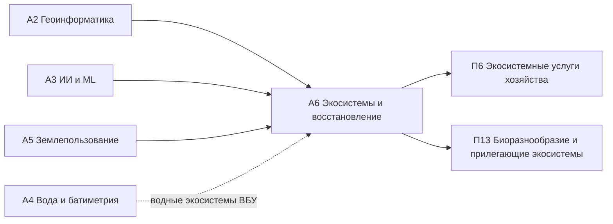

# А6. Экосистемные услуги, биоразнообразие, восстановление земель

> **Тип:** Академический · **Связь:** [П6](../p6/index.md), [П13](../p13/index.md) · **Компонент FOLUR:** 3
> **Аудитория:** бакалавриат и магистратура; уровень ИИ-слоя — **Pro-code**.

Модуль замыкает академическую линию платформы: от данных (А1), геоинформатики (А2), ИИ (А3), воды (А4) и землепользования (А5) — к взгляду на агроландшафт как на природный капитал, который производит поток услуг, теряет их при деградации и восстанавливается управляемыми практиками. Логика «от инструмента к применению» доводится здесь до синтеза: слушатель учится читать ландшафт в терминах экосистемных услуг, измерять их состояние по открытым спутниковым данным и превращать диагноз в проект восстановления деградированного участка — прикладной продукт модуля и прямой вклад в Компонент 3 программы FOLUR (восстановление).

## Цели модуля

После прохождения модуля слушатель сможет:

1. **[Bloom: знать]** перечислять четыре категории экосистемных услуг (обеспечивающие, регулирующие, культурные, поддерживающие), элементы природного капитала агроландшафта (лесополосы, буферные зоны, водно-болотные угодья, залежи, пастбища), инструменты оценки (TEEB, InVEST) и три субиндикатора деградации земель ЦУР 15.3.1.
2. **[Bloom: понимать]** объяснять, как структура агроландшафта производит регулирующие услуги (ветрозащита, опыление, регулирование стока, удержание углерода), почему между услугами возникают компромиссы (trade-offs) и как деградация проявляется в спутниковых индикаторах.
3. **[Bloom: применять]** строить в Google Earth Engine многолетние тренды продуктивности (NDVI/NPP) и картировать зелёную инфраструктуру агроландшафта СКО, Костанайской и Акмолинской областей по открытым данным (Sentinel-2, Landsat, MODIS, OSM).
4. **[Bloom: анализировать]** диагностировать тип деградации участка по совокупности индикаторов, подбирать под диагноз практики восстановления (фитомелиорация, залужение, восстановление пастбищеоборота, лесомелиорация, рекультивация) и обосновывать план в терминах восстанавливаемых услуг и нейтрального баланса деградации (LDN).
5. **[Bloom: анализировать]** проводить ревью и верификацию геопайплайна оценки деградации, сгенерированного ИИ-агентом, по независимым контрольным участкам и артефактам данных.

## Уроки

| # | Урок | Трудозатраты ⏱ | Ключевой навык |
|---|---|---|---|
| 1 | [Читаем ландшафт как поток экосистемных услуг: четыре категории и природный капитал](lectures/01-ekosistemnye-uslugi-i-prirodnyj-kapital.md) | ~24 мин чтения + ~20 мин практики | язык услуг и капитала, компромиссы |
| 2 | [Собираем каркас биоразнообразия агроландшафта: лесополосы, буферы, ВБУ, соседство с ООПТ](lectures/02-bioraznoobrazie-agrolandshafta.md) | ~24 мин чтения + ~20 мин практики | зелёная инфраструктура и связность |
| 3 | [Ставим диагноз деградации по спутнику: тренды продуктивности и субиндикаторы ЦУР 15.3.1](lectures/03-monitoring-degradacii-dzz-ml.md) | ~24 мин чтения + ~30 мин практики | тренд продуктивности, LDN-индикаторы |
| 4 | [Проектируем восстановление участка: от диагноза к плану практик](lectures/04-proektirovanie-vosstanovleniya.md) | ~26 мин чтения + ~30 мин практики | подбор практик под тип деградации |
| П | [Практикум: проект плана восстановления деградированного участка](practicum/01-plan-vosstanovleniya-uchastka.md) | ~90 мин | прикладной продукт модуля |
| ИИ | [ИИ-ассистент в работе: оценка деградации агентом под контролем человека](ai-assistant.md) | ~45–60 мин | постановка задачи → ревью → верификация |
| А | [Итоговая аттестация](assessment/final.md) | ~60 мин | банк MCQ + сценарный кейс, порог 75 % |

Нагрузка соответствует нормативу платформы: ~2–2,5 часа контента в неделю; каждый микро-урок закрыт квизом сразу после материала.

## Прикладной продукт модуля

**Проект плана восстановления деградированного участка.** Продукт собирается в практикуме и включает: делимитацию участка и его водосбора, диагноз деградации по многолетнему тренду продуктивности и вспомогательным индикаторам, карту существующей и планируемой зелёной инфраструктуры, таблицу подобранных практик восстановления с привязкой к типу деградации и восстанавливаемым услугам, а также контрольные индикаторы мониторинга. Всё — на открытом стеке (Python/Colab, GEE, QGIS, OSM), воспроизводимо и оформлено как shareable-документ для акимата, партнёра или заявки.

## Данные модуля

Модуль работает на открытых спутниковых архивах (Sentinel-2, Landsat, MODIS/VIIRS для продуктивности) и открытых картографических слоях (OpenStreetMap, глобальные наборы земного покрова, продукт JRC Global Surface Water для водных экосистем). Батиметрический контекст водных экосистем (ВБУ) опирается на трёхуровневую политику доступа платформы — обезличенный уровень A, обобщённую сетку B, закрытый уровень C — см. [Датасеты платформы](../../datasets.md). Реальные координаты водных объектов в учебных материалах не приводятся; водоём степной зоны обезличен.

## ИИ-ассистент в работе · уровень Pro-code

LLM-кодинг-агент (Claude Code / OpenCode) собирает геопайплайн оценки деградации участка — многолетний тренд продуктивности и его статистическую значимость; слушатель ставит задачу, проводит ревью кода и **верифицирует результат по независимым контрольным участкам** (заведомо стабильные и заведомо нарушенные земли). Подробности — в [ИИ-задании](ai-assistant.md); рамка ИИ-слоя платформы — [здесь](../../ai-tools.md).

*Правило: ИИ ускоряет — человек верифицирует. Задание выполнимо и без ИИ.*

## Место в архитектуре платформы

*Рис. 1. Связи модуля А6. Alt: А6 опирается на геоинформатику А2, ИИ-методы А3 и землепользование А5, получает водный контекст из А4 и передаёт компетенции профмодулям П6 и П13.*

Пререквизиты: навыки ГИС и Python из [А2](../a2/index.md), спутниковых временных рядов и ML из [А3](../a3/index.md), ландшафтного планирования из [А5](../a5/index.md) (или параллельное изучение). Продолжение для практиков: [П6](../p6/index.md) (оценка услуг хозяйства, no-code), [П13](../p13/index.md) (биоразнообразие хозяйства, no-code).

## Оценивание

Тренировочные квизы (3–5 MCQ) — после каждой лекции. Итог: индивидуальный вариант из [банка модуля](assessment/final.md) (порог **75 %**) + сценарный кейс с экспертной проверкой + обязательный артефакт практикума (проект плана восстановления).

## Библиография и рамки

Проверенные международные рамки и первичные источники (DOI не указываются там, где не верифицированы):

1. **Millennium Ecosystem Assessment (MA, 2005).** *Ecosystems and Human Well-being: Synthesis.* Island Press, Washington — первичная рамка четырёх категорий экосистемных услуг.
2. **TEEB** (The Economics of Ecosystems and Biodiversity, инициатива под эгидой UNEP) — методология экономической оценки экосистем и природного капитала.
3. **Natural Capital Project — InVEST** (Integrated Valuation of Ecosystem Services and Tradeoffs), Стэнфордский университет — открытый набор моделей картирования и оценки услуг.
4. **FAO.** The 10 Elements of Agroecology: Guiding the transition to sustainable food and agricultural systems. FAO, Rome — рамка агроэкологического подхода (элементы «разнообразие», «синергии», «регулирование»).
5. **WOCAT** (World Overview of Conservation Approaches and Technologies) — глобальная база практик устойчивого землепользования и восстановления; источник практик для кейсов.
6. **ЦУР 15.3 / LDN** (Land Degradation Neutrality, UNCCD) и индикатор **ЦУР 15.3.1** «Доля деградированных земель» с тремя субиндикаторами (земной покров, продуктивность земель, запасы органического углерода почв) — целевая рамка мониторинга модуля.
7. **Trends.Earth** (Conservation International) — открытый инструмент расчёта субиндикаторов LDN / ЦУР 15.3.1 из спутниковых данных.
8. **Рамсарская конвенция о водно-болотных угодьях** (Ramsar Convention on Wetlands) — рамка охраны ВБУ, релевантная для степных озёр региона.
9. **Каталог кейсов FOLUR Impact Program** (Food Systems, Land Use and Restoration, GEF) — контекст интегрированного управления ландшафтами и восстановления (Компонент 3).
10. Costanza, R. et al. (1997). The value of the world's ecosystem services and natural capital. *Nature*, 387 — классическая работа о ценности услуг (обзорный материал лекции 1).
11. Документация Copernicus (Sentinel-2), USGS Landsat, NASA MODIS/VIIRS, OpenStreetMap — официальные описания используемых данных.

Правовой режим данных водных экосистем: [политика датасетов платформы](../../datasets.md); канонический каркас модуля: [шаблон](../../about/module-template.md); рамка ИИ-слоя: [ИИ-инструменты в обучении](../../ai-tools.md).
