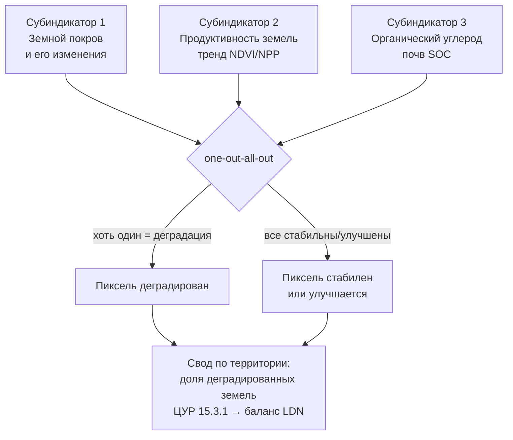
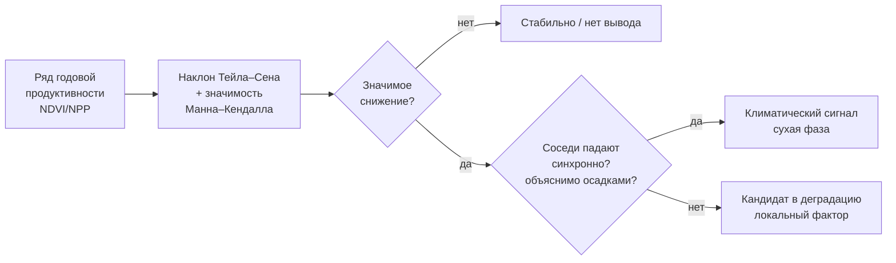

# Ставим диагноз деградации по спутнику: тренды продуктивности и субиндикаторы ЦУР 15.3.1

> ⏱ **Трудозатраты:** ~24 мин чтения + ~30 мин практики
>
> Модуль **А6: Экосистемные услуги, биоразнообразие, восстановление земель**, лекция 3 из 4.
> Академический уровень. Проект UNDP-KAZ, FOLUR. Компонент FOLUR: **3**.

## Цели лекции и место в модуле

В лекциях 1–2 мы научились видеть услуги, капитал и каркас качественно. Теперь превратим взгляд в измерение. Чтобы обоснованно проектировать восстановление (лекция 4), нужен строгий диагноз: деградирует ли участок, где именно, какого типа деградация и насколько уверенно мы это утверждаем. Международно согласованный способ поставить такой диагноз — индикатор **ЦУР 15.3.1 «Доля деградированных земель»** с тремя субиндикаторами. Эта лекция учит считать главный из них — тренд продуктивности растительности — по открытым спутниковым данным, отличать реальный сигнал от артефактов и применять ML там, где он уместен. Это методическое ядро модуля, как лекция о карте глубин была ядром [А4](../../a4/index.md).

После изучения лекции слушатель сможет:

1. **[Bloom: знать]** называть три субиндикатора ЦУР 15.3.1 (земной покров, продуктивность земель, запас органического углерода почв), правило «one-out-all-out» и открытые источники продуктивности (Sentinel-2, Landsat, MODIS/VIIRS).
2. **[Bloom: понимать]** объяснять, почему для диагноза деградации нужен многолетний тренд, а не один снимок, и как из тренда возникают ложные сигналы (облачность, смена сенсора, климатическая изменчивость).
3. **[Bloom: применять]** строить в Google Earth Engine многолетний ряд продуктивности и оценивать его тренд (наклон Тейла–Сена, значимость по Манну–Кендаллу) для участка СКО, Костанайской или Акмолинской области.
4. **[Bloom: анализировать]** различать деградацию, климатическую изменчивость и артефакты наблюдения, оценивать роль ML в картировании деградации и формулировать диагноз с указанием неопределённости.

> **Границы лекции.** Внутри: индикатор ЦУР 15.3.1 и его субиндикаторы, метод тренда продуктивности, отделение сигнала от шума и климата, роль ML и инструмента Trends.Earth. Снаружи: категории услуг и капитал — [лекция 1](01-ekosistemnye-uslugi-i-prirodnyj-kapital.md); каркас биоразнообразия — [лекция 2](02-bioraznoobrazie-agrolandshafta.md); подбор практик восстановления под диагноз — [лекция 4](04-proektirovanie-vosstanovleniya.md). Устройство моделей (Random Forest, CNN, ряды NDVI) даётся здесь в объёме применения — полная теория в модуле [А3](../../a3/index.md); водные индексы — в [А4](../../a4/index.md).

---

## 1. Что такое деградация земель и как её измеряют

### 1.1 Определение и рамка LDN

Деградация земель — устойчивое снижение способности земли производить экосистемные услуги, в первую очередь биологическую продуктивность (лекция 1: убыль природного капитала). Ключевые слова в определении — «устойчивое» и «способность»: разовое падение урожая из-за засухи это не деградация (способность земли сохранена, изменилась погода), а вот многолетнее снижение отдачи при той же погоде — деградация. Различить эти два случая и есть главная методическая задача диагностики, к которой мы придём в §2.3. Деградация в степной зоне принимает несколько форм: ветровая эрозия (дефляция) распаханных земель, водная эрозия склонов, дегумификация (потеря органического вещества почвы), вторичное засоление у бессточных понижений и при неправильном орошении, пастбищная деградация от перевыпаса. Каждая форма по-своему проявляется в спутниковых индикаторах — это мы используем в §3 для их картирования. Международная рамка борьбы с ней — **нейтральный баланс деградации земель (Land Degradation Neutrality, LDN)** в рамках Конвенции ООН по борьбе с опустыниванием (UNCCD) и задачи **ЦУР 15.3**. Смысл LDN: на уровне территории новые потери деградированных земель должны компенсироваться восстановлением не меньшего объёма — «баланс сводится в ноль или в плюс». Это ровно тот баланс капитала, о котором шла речь в лекции 1, но операционализированный на уровне страны и региона.

### 1.2 Три субиндикатора ЦУР 15.3.1

Официальный индикатор ЦУР 15.3.1 — «Доля площади суши, деградированной за период» — рассчитывается по трём субиндикаторам:

1. **Земной покров (land cover)** и его изменения: переходы между типами покрова (степь → пашня, пашня → залежь, водоём → суша). Считается по глобальным и национальным наборам земного покрова.
2. **Продуктивность земель (land productivity)**: динамика первичной продукции растительности во времени — растёт, стабильна или снижается. Считается по спутниковым рядам NDVI/NPP. Это главный оперативный субиндикатор, и на нём фокусируется лекция.
3. **Запас органического углерода почв (soil organic carbon, SOC)**: изменение почвенного углерода, часто оцениваемое через смену покрова и модельные коэффициенты из-за нехватки прямых измерений.

Итоговый статус пикселя определяется правилом **«one-out-all-out»**: если хоть один субиндикатор показывает деградацию, пиксель считается деградированным. Правило консервативно намеренно — чтобы не пропустить деградацию, замаскированную благополучием по другим субиндикаторам.



*Рис. 1. Структура индикатора ЦУР 15.3.1 из трёх субиндикаторов с правилом one-out-all-out. Alt: три субиндикатора — земной покров, продуктивность и почвенный углерод — сводятся правилом one-out-all-out; если хоть один показывает деградацию, пиксель деградирован; свод по территории даёт долю деградированных земель и баланс LDN.*

Важное свойство рамки LDN — понятие базовой линии (baseline). Деградация оценивается не абстрактно, а относительно исходного состояния на согласованную начальную дату: субиндикаторы сравнивают текущий период с базовым. Это защищает от двух ошибок. Первая — «скользящее эталонное состояние» (shifting baseline), когда каждое поколение принимает уже деградированный ландшафт за норму и не замечает медленной убыли капитала; фиксированная базовая линия делает долговременную деградацию видимой. Вторая — приписывание себе чужих заслуг или чужих потерь: относительно ясной точки отсчёта видно, что именно изменилось за период проекта. Для нашего модуля это означает практическое правило: диагноз и последующий мониторинг восстановления (лекция 4) всегда фиксируют базовое состояние — год начала и его значения индикаторов, — иначе «стало лучше» или «стало хуже» не с чем сравнивать.

### 1.3 Trends.Earth и открытость метода

Считать субиндикаторы вручную не обязательно: инструмент **Trends.Earth** (разработан Conservation International, свободно распространяется как плагин QGIS и облачные вычисления) рассчитывает субиндикаторы ЦУР 15.3.1 из открытых спутниковых наборов по методологии UNCCD. Для нас Trends.Earth ценен и как готовый инструмент, и как эталон метода: он показывает, что диагноз деградации — воспроизводимая процедура на открытых данных, а не экспертное «на глаз». В практикуме мы строим ключевой субиндикатор — тренд продуктивности — сами, чтобы понимать, что именно считает такой инструмент.

### 1.4 Земной покров и почвенный углерод: два других субиндикатора

Хотя лекция фокусируется на продуктивности, коротко разберём два других субиндикатора — без них диагноз неполон. **Земной покров** отслеживает переходы между типами покрова за период: распашка степи (потеря природного капитала), зарастание пашни в залежь (восстановление), высыхание водоёма (потеря ВБУ), наступление песков. Считается он по глобальным и национальным наборам земного покрова и по классификации спутниковых снимков — навык из модулей [А2](../../a2/index.md) и [А3](../../a3/index.md). Ключевой момент: сам по себе переход нейтрален, деградацией или улучшением его делает матрица переходов — согласованная таблица, где, например, «степь → пашня» помечена как деградация, а «пашня → многолетние травы» как улучшение. Такую матрицу задают на уровне страны, исходя из целей LDN.

**Запас органического углерода почв (SOC)** — самый трудный субиндикатор, потому что почвенный углерод не наблюдается со спутника напрямую. На практике его чаще всего оценивают косвенно: через смену земного покрова с применением справочных коэффициентов (сколько углерода теряется при переходе «степь → пашня» и накапливается при обратном переходе). Это модельная оценка с большой неопределённостью, и честный диагноз всегда это оговаривает. Прямое измерение SOC требует полевого отбора проб и лабораторного анализа — то, чего в учебном проекте на открытых данных у нас нет. Поэтому в модуле мы опираемся на продуктивность как главный измеримый субиндикатор, земной покров привлекаем при наличии наборов, а SOC обсуждаем качественно, никогда не подставляя выдуманных значений углерода.

> **Подробнее** о наборах земного покрова и классификации по Sentinel-2 (субиндикатор 1) — в модулях [А2](../../a2/index.md) и [А3](../../a3/index.md).

---

## 2. Тренд продуктивности: главный рабочий инструмент

### 2.1 Почему тренд, а не снимок

Один спутниковый снимок говорит о состоянии в момент съёмки, но не о деградации: низкий NDVI в конкретный день может означать засушливый год, раннюю фазу развития или облако. Деградация — это устойчивое снижение во времени, поэтому её диагностируют по многолетнему тренду. Минимальный горизонт — 10–15 лет и более: в степной зоне, как мы знаем из [А4](../../a4/index.md), годы группируются во влажные и сухие фазы, и на коротком ряду фаза изменчивости легко выдаётся за тренд. Это то же предостережение, что и с водным балансом: «этот год против прошлого» почти никогда не тренд.

Рабочая величина — сезонный интеграл или пик продуктивности за каждый год. Для степи обычно берут максимум или сумму NDVI за вегетационный период (примерно май–август) — это прокси годовой первичной продукции (NPP). Затем по ряду годовых значений оценивают наклон тренда.

Выбор именно годового пика или интеграла, а не среднего по всем снимкам, неслучаен. Среднее за год смешивает зелёный сезон с голой почвой ранней весны и осени и потому сильно зависит от того, в какие даты были безоблачные снимки; пик же (или интеграл за вегетацию) устойчивее отражает продукционную способность растительности. Это тот же принцип «правильно выбранной величины», что и в [А4](../../a4/index.md), где для баланса брали не любой снимок, а показатель, физически связанный с искомой величиной. Дополнительно полезно фиксировать метрики фенологии — дату начала вегетации и длину сезона: их сдвиг сам по себе индикатор изменений (более раннее выгорание, укорочение сезона при деградации или засухе).

Отдельная техническая тонкость — согласование сенсоров в длинном ряду. Архив продуктивности за 20–40 лет собирается из разных спутников (Landsat 5, 7, 8, 9; Sentinel-2; MODIS), у которых различаются спектральные каналы, разрешение и калибровка. Если не привести их к сопоставимому виду (гармонизация, использование готовых согласованных продуктов), на стыке сенсоров возникает ложный скачок NDVI, неотличимый от реального изменения, — ровно та же ловушка, что смена порога NDWI посреди ряда в [А4](../../a4/index.md). Поэтому для длинных рядов берут либо один сенсор на всём протяжении, либо официально гармонизированные наборы, и всегда проверяют ряд на подозрительные ступени в годы смены источника данных.

### 2.2 Устойчивая оценка тренда: Тейл–Сен и Манн–Кендалл

Наклон тренда можно было бы оценить обычной линейной регрессией (метод наименьших квадратов), но у неё есть слабость: единичный аномальный год (экстремальная засуха, ошибочный снимок) сильно тянет наклон. В мониторинге деградации стандарт — устойчивые непараметрические методы:

- **Наклон Тейла–Сена (Theil–Sen)** — медиана наклонов по всем парам лет. Устойчив к выбросам: несколько аномальных лет не переворачивают оценку.
- **Тест Манна–Кендалла (Mann–Kendall)** — проверка значимости монотонного тренда: есть ли статистически значимое направленное изменение или наблюдаемый наклон неотличим от случайных колебаний. Даёт p-значение.

Связка «наклон Тейла–Сена + значимость Манна–Кендалла» — де-факто стандарт трендового анализа продуктивности, и именно её реализует Trends.Earth. Диагноз ставится по двум величинам вместе: **направление и величина** наклона (насколько сильно меняется продуктивность) и его **значимость** (можно ли отличить изменение от шума). Значимое отрицательное — кандидат в деградацию; значимое положительное — восстановление/интенсификация; незначимое — «стабильно или недостаточно данных для вывода».

!!! warning "Никаких выдуманных порогов и метрик"
    Конкретные пороги «сколько процентов падения NDVI = деградация» и метрики модели зависят от данных, региона и методики; мы их не выдумываем. В практикуме слушатель получает **свои** численные значения наклона и p и интерпретирует их с оговорками — «эталонного правильного числа» здесь нет, как не было его для RMSE карты глубин в А4.

### 2.3 Отделение сигнала от климата

Даже значимый отрицательный тренд продуктивности сам по себе ещё не доказывает деградацию земли: продуктивность в степи сильно зависит от осадков, и снижение может отражать серию сухих лет, а не порчу самой земли. Отсюда важнейший приём — **поправка на климат**. Две рабочие техники:

- **Контрольная группа (эталонные участки).** Тот же приём, что в [А4](../../a4/index.md): сравнить участок с соседними землями схожего типа и климата. Если продуктивность падает у всех синхронно — это климат (сухая фаза); если только у нашего участка — это локальная деградация (перевыпас, эрозия, засоление).
- **Анализ «продуктивность против осадков».** Сопоставить годовую продуктивность с годовыми осадками (ERA5-Land, [А4](../../a4/index.md)). Если продуктивность падает быстрее, чем объясняется осадками (то есть отдача продукции на единицу дождя снижается), — это признак деградации земли, а не просто засухи. Этот подход известен в литературе как анализ остаточного тренда (RUE / RESTREND — residual trend). Мы применяем его в упрощённом, качественном виде.



*Рис. 2. Логика диагноза: от ряда продуктивности через оценку тренда к разделению климата и деградации. Alt: ряд продуктивности оценивается наклоном Тейла–Сена и тестом Манна–Кендалла; при значимом снижении проверяется, падают ли соседи синхронно и объяснимо ли падение осадками; синхронное и объяснимое — климат, избирательное и необъяснимое — кандидат в деградацию.*

> **Подробнее** о рядах NDVI и методах их анализа (MiniRocket, классификация) — в модуле [А3](../../a3/index.md); об осадках ERA5-Land — в [А4](../../a4/index.md).

---

## 3. Где здесь машинное обучение

### 3.1 ML для картирования типов и причин деградации

Тренд продуктивности отвечает на вопрос «где падает», но не всегда «почему». Здесь помогает машинное обучение из [А3](../../a3/index.md): по многоканальным спутниковым признакам (спектральные индексы, сезонный ход NDVI, рельеф, влажность) модель классификации (например, Random Forest) может картировать **типы** нарушенных земель — очаги дефляции (открытая почва), засоленные пятна (характерная спектральная и пространственная сигнатура у бессточных понижений), выбитые пастбища, гари, зарастающие залежи. Временные ряды NDVI (подход MiniRocket из А3) хорошо разделяют фенологические типы: пашня, многолетние травы, залежь разного возраста, естественная степь — то есть работают и на субиндикатор земного покрова.

Полезно понимать, какие спектральные признаки стоят за каждым типом. Дефляция и открытая почва проявляются низким NDVI при высоком отражении в красном и коротковолновом инфракрасном — почва «ярче» растительности; для их выделения помогают индексы голой почвы и обнажённости. Засоление у бессточных понижений даёт характерные светлые (высокого альбедо) солевые корки, часто с концентрической пространственной структурой вокруг понижения — сочетание спектральной и геоморфологической (рельеф, замкнутость стока) сигнатуры повышает надёжность распознавания. Выбитые пастбища у водопоя образуют радиальные «ромашки» деградации с центром на стоянке — пространственный паттерн сам по себе диагностичен. Именно поэтому в картировании деградации работают не отдельные пиксели, а сочетание спектра, сезонной динамики, рельефа и пространственного контекста — многопризнаковый подход, для которого и нужны методы [А3](../../a3/index.md).

### 3.2 ML ускоряет, но не заменяет диагноз

Важно удержать баланс. ML — мощный инструмент картирования, но он наследует все ловушки лекции: обученная на коротком ряде модель спутает климатическую фазу с деградацией; классификатор без наземной проверки выдаст правдоподобную, но неверную карту; метрики (F1, IoU) на невалидированной разметке обманчивы. Поэтому в диагностике деградации ML занимает подчинённое место: он районирует и типизирует, а окончательный вывод «деградация или климат» ставит человек по логике §2.3 с контрольными участками и полевой проверкой. Это прямая иллюстрация правила платформы **«ИИ ускоряет — человек верифицирует»**, которое в pro-code-задании модуля ([ИИ-ассистент](../ai-assistant.md)) применяется буквально: агент собирает трендовый пайплайн, а слушатель верифицирует его на эталонных участках.

### 3.3 Полевая привязка: без неё карта — гипотеза

Любая карта деградации — гипотеза, пока не сверена с землёй. Минимальная полевая привязка: несколько контрольных точек заведомо известного состояния (участок стабильной степи, участок явной дефляции, восстанавливающаяся залежь), по которым проверяют, что спутниковый диагноз совпадает с реальностью. Это те же «опорные глубины», что в батиметрии А4, только для продуктивности: заведомо доброкачественный и заведомо нарушенный эталон, на котором проверяется вся процедура.

Полевая привязка решает и вторую задачу — оценку точности классификатора. Метрики из [А3](../../a3/index.md) (F1, IoU, каппа Коэна) имеют смысл только на независимой от обучения проверочной выборке реальных наблюдений; посчитанные на той же разметке, что использована для обучения, они завышены и обманчивы. Практический минимум для учебного проекта — несколько десятков точек наземной истины, собранных независимо (полевой выезд, экспертная дешифровка снимков сверхвысокого разрешения, опрос землепользователя о истории участка). Без такой привязки корректная формулировка — не «участок деградирован», а «спутниковые индикаторы указывают на вероятную деградацию такого-то типа; требуется полевое подтверждение». Разница между этими двумя формулировками — граница между профессиональным диагнозом и опасным самообманом, и именно она отделяет добросовестную работу с данными от фабрикации результата.

---

## 4. От диагноза к типологии: что мы передаём в план восстановления

### 4.1 Диагностическая карта как вход лекции 4

Соберём результат диагностики в форму, которую примет проектирование восстановления. Диагноз участка — это не одно число, а слой:

| Что определяем | Как | Источник |
|---|---|---|
| Есть ли деградация | значимый отрицательный тренд продуктивности | Sentinel-2/Landsat/MODIS, Тейл–Сен + Манн–Кендалл |
| Климат или земля | контрольные участки, продуктивность vs осадки | соседи + ERA5-Land |
| Где именно (карта очагов) | пространственное распределение тренда | попиксельный/позонный тренд |
| Какого типа | классификация нарушенных земель | ML (RF, ряды NDVI), рельеф, индексы |
| Смена покрова | переходы типов покрова за период | наборы земного покрова, Trends.Earth |
| Состояние каркаса | целостность лесополос, буферов, ВБУ | Sentinel-2, OSM (лекция 2) |

Каждая строка этого слоя в лекции 4 отобразится в конкретную практику восстановления: дефляция → лесомелиорация и защита почвы; засоление → фитомелиорация и гидрорежим; выбитое пастбище → пастбищеоборот; деградированная пашня → залужение или консервация в залежь; разрыв каркаса → восстановление коридоров.

### 4.2 Честность о неопределённости

Диагноз обязан нести оговорки, иначе он опасен. Открытые данные не измеряют почвенный углерод напрямую, не отличают все типы деградации без поля, чувствительны к артефактам (облачность, тени, смена сенсора Landsat 7/8/9 и Sentinel — разные калибровки и разрешение внутри одного длинного ряда). Профессиональный диагноз явно перечисляет: что установлено уверенно (значимый тренд с контролем климата), что вероятно (тип по классификатору без поля), что неизвестно (SOC без проб). Именно это отличает диагноз от впечатления — и делает проект восстановления защищаемым перед акиматом, донором или ПРООН.

Полезно оформлять неопределённость в виде явной градации доверия, а не прятать её в оговорках мелким шрифтом. Например: **установлено** — на участке наблюдается статистически значимое (p<0,05) снижение продуктивности за 20 лет, не объясняемое динамикой осадков и не наблюдаемое на контрольных участках; **вероятно** — снижение сосредоточено в очагах, спектрально и морфологически похожих на дефляцию и засоление; **не установлено** — фактические запасы почвенного углерода, точные границы очагов, вклад конкретных причин (перевыпас против эрозии) без полевого обследования. Такая градация не ослабляет диагноз, а усиливает его: она показывает, что автор понимает пределы метода, и указывает, какие именно полевые данные снимут оставшуюся неопределённость. Это прямой аналог «честного отчёта о зонах ненадёжности карты глубин» из [А4](../../a4/index.md): и там, и здесь профессионализм измеряется не отсутствием неопределённости, а честностью о ней.

### 4.3 От диагноза к проекту: мостик в лекцию 4

Собранный диагностический слой — не самоцель, а вход в проектирование восстановления. Каждый его элемент в лекции 4 превратится в конкретное действие: карта очагов задаст, где восстанавливать; типология очагов — чем восстанавливать (какой практикой); контроль климата — гарантию, что мы лечим землю, а не боремся с погодой; карта каркаса (лекция 2) — как связать восстановленные участки в сеть; градация доверия — какие места требуют полевого выезда до начала работ. Тем самым диагностика замыкает первую половину модуля (видеть и измерять) и открывает вторую (проектировать и восстанавливать). Тот же диагностический пайплайн — на этот раз с ожиданием положительной динамики — станет и инструментом мониторинга восстановления (лекция 4, §3.3), так что навык этой лекции работает на всех этапах цикла управления.

---

## Региональный кейс

**Ситуация:** Акимат Костанайской области готовит участок под проект восстановления по линии FOLUR (Компонент 3) и просит обосновать выбор именно этого контура. Хозяйство-землепользователь утверждает, что «земля истощилась и не родит», сосед возражает, что «просто годы сухие пошли». Нужен объективный диагноз по открытым данным: деградирует ли контур на самом деле, или речь о климатической фазе, и если деградирует — где очаги и какого типа.

**Данные:** Landsat (архив с 1980-х) и Sentinel-2 через Google Earth Engine (годовые ряды пиковой продуктивности NDVI), MODIS/VIIRS NPP (продукция), ERA5-Land (годовые осадки — контроль климата, [А4](../../a4/index.md)), наборы земного покрова и Trends.Earth (субиндикаторы 15.3.1), OSM (границы, каркас).

**Задача:**

1. Построить 15+-летний ряд пиковой продуктивности контура и соседних участков схожего типа; оценить наклон (Тейл–Сен) и значимость (Манн–Кендалл).
2. Разделить климат и деградацию: падают ли соседи синхронно? объяснимо ли снижение осадками (продуктивность против осадков)?
3. Если деградация подтверждается — картировать очаги и предположить тип, честно указав неопределённость.

**Разбор:** Логика диагноза. Сначала — тренд: значимый отрицательный наклон Тейла–Сена на контуре — необходимое, но не достаточное условие. Дальше — контроль климата (§2.3): если соседние участки того же типа падают синхронно и снижение объяснимо рядом сухих лет по ERA5-Land, диагноз — климатическая фаза, а не деградация земли, и претензия хозяйства не подтверждается объективно. Если же контур падает избирательно (соседи стабильны) и/или отдача продукции на единицу осадков снижается (RESTREND-логика), это признак деградации самой земли. Тогда картирование очагов по пространственному распределению тренда и классификатору (§3.1) укажет тип: открытая почва и низкий покров на возвышенных распахиваемых участках — дефляция; яркие пятна у бессточных понижений — вероятное засоление; локальные очаги у водопоя и стоянок — перевыпас. Каждый вывод сопровождается оговоркой: тип по классификатору — гипотеза до полевой проверки, SOC не измерен, часть ряда собрана разными сенсорами. Продукт для акимата — карта тренда с контрольными участками и типологией очагов, а не голое утверждение «истощилась/не истощилась». Этот диагноз становится прямым входом в проект восстановления лекции 4.

---

## Закрепление и применение

!!! example "Попробуйте в Colab"
    Откройте ноутбук лекции (`<URL будет назначен при создании репозитория ноутбуков>`) и в Google Earth Engine постройте годовой ряд пиковой продуктивности NDVI (2000-е–2020-е) для участка и 2–3 соседних участков в Костанайской области. Оцените наклон Тейла–Сена и значимость по Манну–Кендаллу; наложите годовые осадки ERA5-Land. Задание выполнимо и без ИИ-ассистента; как ускорить его с Claude Code — в [ИИ-задании модуля](../ai-assistant.md).

!!! warning "Границы применимости"
    Тренд продуктивности — индикатор, а не приговор: значимое снижение может быть климатической фазой (нужен контроль осадками и соседями), а часть длинного ряда собрана разными сенсорами (Landsat 5/7/8/9, Sentinel) с разной калибровкой и разрешением — это источник ложных сдвигов, ровно как смена порога NDWI в А4. Почвенный углерод открытые данные не измеряют напрямую; тип деградации без полевой проверки — гипотеза. Пороги «сколько = деградация» и метрики моделей не выдумываются.

!!! tip "Что это даёт вашему хозяйству"
    Трендовая диагностика переводит спор «истощилась земля или просто сухие годы» из области впечатлений в область проверяемых утверждений — бесплатно и за вечер. Обоснованный диагноз усиливает позицию в заявке на поддержку восстановления и защищает от бессмысленных вложений туда, где проблема на самом деле в климате, а не в земле.

!!! question "Кейс для размышления"
    Два соседних участка показывают одинаковый значимый отрицательный тренд NDVI за 15 лет. На первом осадки за тот же период тоже устойчиво снижались, на втором — нет. Какой участок вы отнесёте к кандидатам в деградацию, а какой — к климатическому сигналу, и какие данные подтвердят вывод? Что общего у этой логики с диагностикой обмеления пруда в модуле А4?

### Проверь себя

```quiz
[
  {
    "q": "Какие три субиндикатора образуют индикатор ЦУР 15.3.1 «Доля деградированных земель»?",
    "options": ["Земной покров, продуктивность земель, запас органического углерода почв", "Осадки, температура, ветер", "NDVI, NDWI, SAR", "Урожайность, поголовье скота, площадь пашни"],
    "answer": 0,
    "explain": "§1.2: официальные субиндикаторы 15.3.1 — земной покров и его изменения, продуктивность земель (тренд NDVI/NPP) и запас органического углерода почв; свод по правилу one-out-all-out."
  },
  {
    "q": "Почему для диагноза деградации нужен многолетний тренд, а не один снимок?",
    "options": ["Деградация — устойчивое снижение во времени; на коротком ряду сухая фаза выдаётся за тренд", "Один снимок дороже", "Тренд не зависит от климата", "Спутник снимает только раз в 15 лет"],
    "answer": 0,
    "explain": "§2.1: в степи годы группируются во влажные и сухие фазы; деградацию отличают только по устойчивому многолетнему снижению, минимум 10–15 лет — как и с водным балансом в А4."
  },
  {
    "q": "Зачем при трендовом анализе продуктивности используют наклон Тейла–Сена вместо обычной регрессии?",
    "options": ["Он устойчив к выбросам: единичные аномальные годы не переворачивают оценку наклона", "Он всегда даёт положительный наклон", "Он не требует данных", "Он измеряет осадки"],
    "answer": 0,
    "explain": "§2.2: наклон Тейла–Сена — медиана попарных наклонов, устойчивая к аномальным годам; в связке с тестом Манна–Кендалла (значимость) это стандарт мониторинга деградации."
  },
  {
    "q": "Значимый отрицательный тренд продуктивности наблюдается и на участке, и на всех соседях того же типа, и объясняется рядом сухих лет по ERA5-Land. Каков корректный вывод?",
    "options": ["Это, вероятно, климатический сигнал (сухая фаза), а не деградация самой земли", "Это однозначно деградация участка", "Данные ошибочны", "Нужно распахать участок"],
    "answer": 0,
    "explain": "§2.3: синхронное падение у соседей и объяснимость осадками указывают на климат; деградацию земли выдаёт избирательное падение или снижение отдачи продукции на единицу осадков (RESTREND)."
  },
  {
    "q": "Какова роль машинного обучения в диагностике деградации согласно лекции?",
    "options": ["Картировать и типизировать очаги, но окончательный вывод «деградация или климат» ставит человек с контролем и полевой проверкой", "Полностью заменить человека и полевые данные", "Считать осадки", "Строить карту глубин"],
    "answer": 0,
    "explain": "§3.2: ML районирует и классифицирует типы нарушенных земель, но наследует ловушки (короткий ряд, невалидированная разметка); вывод верифицирует человек — правило «ИИ ускоряет — человек верифицирует»."
  }
]
```

### Контрольные вопросы

1. Назовите три субиндикатора ЦУР 15.3.1 и правило их сведения. *(Bloom: знать)*
2. Объясните, как отличить климатическое снижение продуктивности от деградации земли по открытым данным. *(Bloom: понимать)*
3. Опишите, как вы построили бы и оценили тренд продуктивности участка в своём районе и какие оговорки о неопределённости включили бы в диагноз. *(Bloom: применять/анализировать)*

## Что дальше?

Мы научились ставить участку строгий диагноз: есть ли деградация, климат это или земля, где очаги и какого типа. Диагноз — вход в главное действие модуля. В [лекции 4 «Проектируем восстановление участка»](04-proektirovanie-vosstanovleniya.md) мы превратим диагностический слой в проект: подберём под каждый тип деградации практику восстановления, приоритизируем вложения и оформим план — прикладной продукт модуля. Связанные материалы: ML и ряды NDVI — модуль [А3](../../a3/index.md); осадки и контроль климата — [А4](../../a4/index.md); каркас биоразнообразия — [лекция 2](02-bioraznoobrazie-agrolandshafta.md).
