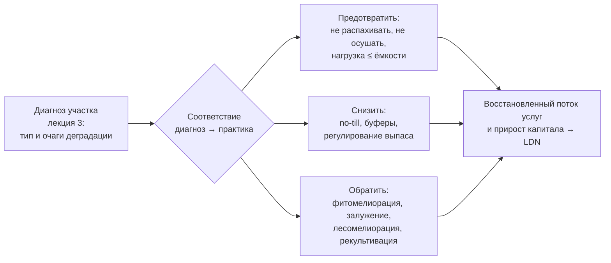
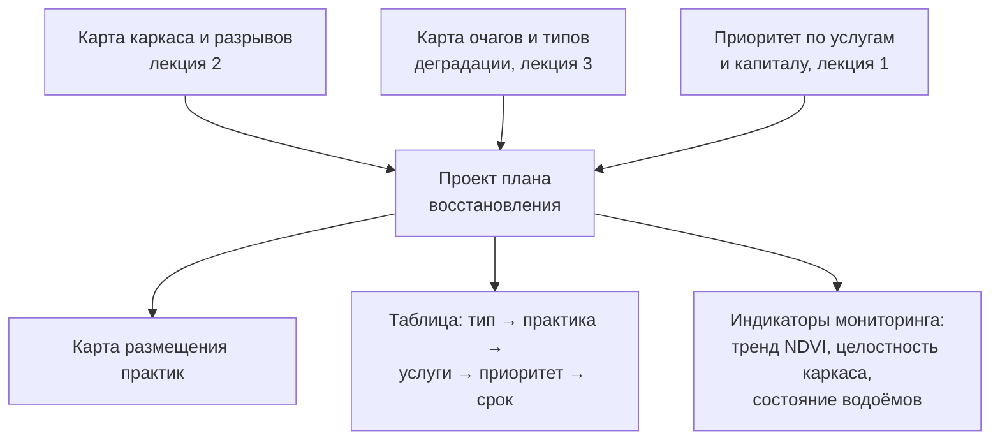

# Проектируем восстановление участка: от диагноза к плану практик

> ⏱ **Трудозатраты:** ~26 мин чтения + ~30 мин практики
>
> Модуль **А6: Экосистемные услуги, биоразнообразие, восстановление земель**, лекция 4 из 4.
> Академический уровень. Проект UNDP-KAZ, FOLUR. Компонент FOLUR: **3**.

## Цели лекции и место в модуле

Это финальная лекция модуля и всей академической линии платформы. Здесь три предыдущих слоя — язык услуг (лекция 1), каркас биоразнообразия (лекция 2) и диагноз деградации (лекция 3) — соединяются в действие: проект плана восстановления деградированного участка, прикладной продукт модуля А6 и прямой вклад в Компонент 3 FOLUR. Мы разберём набор практик восстановления, научимся подбирать их под тип деградации, приоритизировать вложения и оформлять план так, чтобы он был защищаем перед акиматом, донором или ПРООН и реализуем на открытом стеке.

После изучения лекции слушатель сможет:

1. **[Bloom: знать]** перечислять основные практики восстановления деградированных земель степной зоны (фитомелиорация, залужение и управляемая залежь, восстановление пастбищеоборота, лесомелиорация, рекультивация нарушенных земель, восстановление буферов и коридоров) и рамки целеполагания (LDN, FOLUR, WOCAT).
2. **[Bloom: понимать]** объяснять принцип «диагноз → практика», иерархию восстановления (предотвратить → снизить → обратить) и связь каждой практики с восстанавливаемыми услугами и капиталом.
3. **[Bloom: применять]** подбирать практики под конкретный тип деградации участка СКО, Костанайской или Акмолинской области и размещать их по карте с учётом каркаса (лекция 2) и очагов (лекция 3).
4. **[Bloom: анализировать]** приоритизировать элементы плана по затратам, скорости отдачи и восстанавливаемым услугам, задавать контрольные индикаторы мониторинга и честно оценивать пределы восстановления.

> **Границы лекции.** Внутри: практики восстановления, принцип «диагноз → практика», иерархия и приоритизация, структура плана и мониторинг. Снаружи: язык услуг — [лекция 1](01-ekosistemnye-uslugi-i-prirodnyj-kapital.md); элементы каркаса — [лекция 2](02-bioraznoobrazie-agrolandshafta.md); методика диагноза — [лекция 3](03-monitoring-degradacii-dzz-ml.md). Агрономические детали практик (no-till, севообороты, покровные культуры) — в модуле [А5](../../a5/index.md) и профмодулях П8–П10; экономика и заявки на поддержку — в профмодулях П6, П14. Полная реализация плана на данных — в [практикуме](../practicum/01-plan-vosstanovleniya-uchastka.md).

---

## 1. Принцип восстановления: диагноз ведёт практику

### 1.1 Иерархия восстановления

Прежде чем выбирать практику, стоит понять иерархию действий, принятую в управлении деградацией (она же логика LDN из лекции 3). Приоритеты идут сверху вниз:

1. **Предотвратить (avoid)** — не допускать новой деградации: не распахивать целину и уязвимые склоны, не осушать ВБУ, не превышать пастбищную нагрузку. Самое дешёвое и эффективное действие.
2. **Снизить (reduce)** — на уже используемых землях смягчать деградацию: перейти на no-till, ввести буферы, отрегулировать выпас.
3. **Обратить (reverse)** — активно восстанавливать уже деградированное: фитомелиорация засоления, залужение эродированной пашни, лесомелиорация, рекультивация.

Порядок важен: обращать деградацию дороже и медленнее, чем предотвращать. Хороший проект восстановления начинается с предотвращения (закрепить то, что ещё цело) и лишь затем вкладывается в обращение — это и есть смысл нейтрального баланса: не только чинить, но и не ломать.

Эта иерархия прямо вытекает из логики капитала (лекция 1). Предотвращение — это сохранение уже накопленного природного капитала: не тратить то, что степь копила тысячелетиями. Снижение — замедление расхода на землях, которые уже в обороте. Обращение — восстановление капитала с нуля, самая трудоёмкая операция, потому что природе требуются годы и десятилетия, чтобы заново нарастить гумус, сомкнуть травостой, вырастить лесополосу. Экономически иерархия означает, что рубль, вложенный в предотвращение, обычно сохраняет больше услуг, чем рубль, вложенный в обращение уже случившейся потери. Отсюда типичная ошибка неопытного проектировщика — броситься восстанавливать самый заметный, сильно нарушенный очаг, потратив на него весь бюджет, и упустить дешёвую защиту соседних, ещё не потерянных земель, которые за то же время успеют деградировать. Нейтральный баланс LDN требует смотреть на территорию целиком: важно не только сколько восстановили, но и сколько при этом НЕ дали потерять.

### 1.2 Соответствие «диагноз → практика»

Центральный принцип лекции: практика выбирается не по моде, а по диагнозу из лекции 3. Каждому типу деградации соответствует свой набор практик, восстанавливающих именно утраченные услуги.

| Тип деградации (диагноз, лекция 3) | Утраченные услуги | Практики восстановления |
|---|---|---|
| Ветровая эрозия (дефляция) распаханных земель | защита почвы, влага, продуктивность | лесомелиорация (полосы), no-till/стерня, кулисы, залужение самых уязвимых контуров |
| Водная эрозия склонов, заиление водоёмов | защита почвы, чистая вода, объём водоёма | буферные полосы, залужение ложбин стока, противоэрозионная организация полей |
| Засоление (у бессточных понижений, при подъёме грунтовых вод) | продуктивность, качество почвы | фитомелиорация солеустойчивыми травами, регулирование гидрорежима, отказ от избыточного орошения |
| Дегумификация, падение продуктивности пашни | продуктивность, углерод, почвообразование | залужение/консервация в управляемую залежь, no-till, покровные культуры, севообороты |
| Пастбищная деградация (выбивание) | корма, защита почвы, углерод | восстановление пастбищеоборота, регулирование нагрузки, залужение сбоев |
| Нарушенные земли (карьеры, отвалы, стоянки) | почти все услуги | техническая и биологическая рекультивация |
| Разрыв экологического каркаса | опыление, биоконтроль, связность | восстановление лесополос-коридоров, буферов, краевых местообитаний |



*Рис. 1. Принцип «диагноз → практика» в иерархии предотвратить–снизить–обратить. Alt: диагноз участка направляет выбор практик по трём уровням иерархии — предотвращение, снижение, обращение деградации; все они ведут к восстановленному потоку услуг, приросту капитала и нейтральному балансу деградации.*

---

## 2. Практики восстановления степной зоны

Ниже разобраны основные практики восстановления, применимые в степной зоне. Важно держать в голове, что почти все они уже описаны в международной базе [WOCAT](../index.md) и в национальном опыте защитного лесоразведения и почвозащитного земледелия — мы не изобретаем их, а систематизируем под принцип «диагноз → практика». Практики не исключают друг друга: реальный проект восстановления почти всегда комбинирует несколько из них, размещая по карте под разные очаги (§3). Разбор идёт от самых мягких и дешёвых мер к самым капиталоёмким — в порядке той же иерархии «предотвратить → снизить → обратить».

### 2.1 Фитомелиорация

Фитомелиорация — восстановление земель с помощью специально подобранных растений. Классический случай для региона — засоленные и солонцовые земли у бессточных понижений: высев солеустойчивых и солевыносящих трав (галофитов и устойчивых многолетников) закрепляет почву, снижает испарительный подъём солей, постепенно улучшает структуру и возвращает продуктивность и защиту почвы. Фитомелиорация работает и на дефлированных песчаных и супесчаных участках (закрепление подвижной поверхности корневой системой), и на сбитых пастбищах (подсев ценных многолетних трав). Это медленная, но недорогая практика, восстанавливающая сразу несколько услуг — защиту почвы, корма, углерод.

### 2.2 Залужение и управляемая залежь

Залужение — перевод деградированной пашни в многолетние травы; управляемая залежь — сознательная консервация наименее продуктивных или наиболее уязвимых контуров под естественное или направленное зарастание. Как мы видели в лекции 1, залежь в первые десятилетия накапливает почвенный углерод, восстанавливает структуру почвы, даёт местообитание и защиту от эрозии, а также нередко оказывается устойчивее пашни к засухе. Разница между «брошенной» и «управляемой» залежью — в намерении и контроле: управляемая залежь входит в план землепользования как временная или постоянная мера восстановления с заданными сроками и мониторингом, а не как признак упадка. Для сильно деградированной пашни на уязвимых землях залужение часто — оптимальное решение и по капиталу, и по экономике.

### 2.3 Восстановление пастбищеоборота

Пастбищная деградация в степи — результат бессистемного или чрезмерного выпаса, особенно вблизи водопоя и стоянок. Восстановление опирается не столько на дорогие мероприятия, сколько на организацию: пастбищеоборот (чередование участков с периодами отдыха), приведение нагрузки в соответствие с кормовой ёмкостью, распределение водопоев для рассредоточения скота, при необходимости — подсев трав на сбитых участках (§2.1). Это восстанавливает травостой (корма), защиту почвы и углерод одновременно — синергия из лекции 1. Агрономические детали пастбищного управления — в модуле [А5](../../a5/index.md) и профмодулях агроблока.

### 2.4 Лесомелиорация: восстановление и создание лесополос

Лесомелиорация — восстановление старых и создание новых защитных лесонасаждений (лекция 2, §2.1). В проекте восстановления это ключевой инструмент против ветровой эрозии и разрыва каркаса: ремонт изреженных полос, дозакладка звеньев, замыкающих коридоры, создание новых полос поперёк преобладающих ветров на дефлируемых полях. Проектные параметры (ориентация поперёк вредоносных ветров, продуваемая конструкция для равномерного снегораспределения, подбор устойчивых к засухе и засолению пород) выбираются под местные условия; конкретные нормативы размещения — предмет специальной агролесомелиоративной документации, которую мы не воспроизводим по памяти. Лесомелиорация — медленная (эффект нарастает годами), но дающая наибольшее число услуг на элемент.

### 2.5 Рекультивация нарушенных земель

Рекультивация — восстановление земель, нарушенных до потери почвенного профиля: карьеры, отвалы, площадки, сильно эродированные бедленды. Она двухэтапна: техническая (планировка, формирование корнеобитаемого слоя, при необходимости — нанесение снятого плодородного слоя) и биологическая (закрепление растительностью, фитомелиорация). Рекультивация — самая дорогая практика, поэтому применяется точечно, к действительно нарушенным контурам, выявленным в диагнозе как открытая почва без покрова. Именно из-за высокой стоимости рекультивацию почти никогда не назначают всей деградированной площади: её резервируют для очагов, где почвенный профиль утрачен и естественное или содействующее восстановление (§2.7) не запустится само. На остальных землях те же средства дадут больше восстановленных услуг, будучи вложенными в дешёвые предотвращающие и снижающие меры (§3.1).

### 2.6 Восстановление буферов и водных экосистем

Отдельный блок — восстановление регулирующих элементов, связанных с водой (лекции 2, [А4](../../a4/index.md)): закладка буферных полос между пашней и водоёмами (перехват наносов и биогенов, снижение заиления), восстановление прибрежной и водной растительности ВБУ, отказ от осушения западин и восстановление гидрорежима переувлажнённых угодий. Эти меры дёшевы относительно эффекта и снимают конфликты с ООПТ (лекция 2, §4).

### 2.7 Естественное и содействующее восстановление

Важный выбор при проектировании — насколько активно вмешиваться. На одном полюсе — **пассивное (естественное) восстановление**: убрать фактор деградации (снять распашку, прекратить перевыпас) и дать экосистеме восстановиться самой. В степной зоне это часто работает: убранная из оборота пашня зарастает разнотравьем в залежь без посева, сбитое пастбище восстанавливает травостой при снятии нагрузки. Пассивное восстановление почти бесплатно, но медленно и не всегда идёт в желаемую сторону (может закрепиться бурьянистая стадия или сорные виды). На другом полюсе — **активное восстановление**: посев трав, посадка лесополос, техническая рекультивация, регулирование гидрорежима. Оно быстрее и управляемее, но дороже. Между ними — **содействующее восстановление**: минимальное вмешательство, направляющее естественный процесс (подсев ценных видов на залежь, точечная посадка в разрывы, борьба с инвазивными сорняками).

Практическое правило выбора: чем сильнее нарушен участок и чем дальше он от источников естественного заселения (семян, диаспор), тем активнее должно быть вмешательство. Слабо деградированную пашню рядом с целинными участками разумно отдать под естественную залежь; сильно эродированный или засолённый очаг в окружении такой же нарушенной земли — восстанавливать активно. Этот выбор напрямую влияет на бюджет проекта и потому тесно связан с приоритизацией (§3).

### 2.8 WOCAT как каталог проверенных практик

Подбирать практики «из головы» рискованно. Международная база [WOCAT](../index.md) (World Overview of Conservation Approaches and Technologies) — систематизированный каталог технологий устойчивого землепользования и восстановления, задокументированных по единому формату с описанием условий применения, эффектов и ограничений. Для проектировщика это способ не изобретать решение заново, а опереться на задокументированный опыт схожих условий: по типу деградации и агроэкологической зоне подобрать технологию, посмотреть её описанные плюсы и минусы, адаптировать под свой участок. Использование такого каталога — часть научной честности проекта: практика опирается на задокументированный опыт, а не на выдуманные обещания. При этом перенос практики требует критической оценки применимости к местным условиям — тот же принцип «ИИ ускоряет — человек верифицирует», только применённый к переносу чужого опыта.

---

## 3. От практик к плану: приоритизация и размещение

### 3.1 Три критерия приоритизации

Проект восстановления почти всегда ограничен ресурсами: восстановить всё сразу нельзя. Поэтому элементы плана приоритизируют. Три рабочих критерия:

1. **Скорость отдачи.** Одни меры дают эффект за сезон-два (буферная полоса, регулирование выпаса), другие — за годы (лесополосы, залежь). Быстрые меры полезно запускать первыми, чтобы получить ранний результат и мотивацию.
2. **Затраты.** Организационные меры (пастбищеоборот, вынос распашки из буфера) почти бесплатны; фитомелиорация и залужение недороги; лесомелиорация и особенно рекультивация — дороги. При равном эффекте выбирают дешёвое.
3. **Восстанавливаемые услуги и риск.** В первую очередь закрывают меры, предотвращающие необратимые потери и снимающие острые конфликты: буфер у деградирующего ВБУ, защита эродируемого склона, вынос распашки от ООПТ. Здесь язык услуг лекции 1 напрямую задаёт приоритет.

Комбинация критериев обычно даёт естественный порядок: сначала — дешёвые, быстрые и предотвращающие потери меры (иерархия «предотвратить/снизить»), затем — дорогие и медленные меры обращения деградации там, где без них не обойтись.

### 3.2 Размещение по карте

План — это не список, а карта. Размещение опирается на два слоя из предыдущих лекций: карту очагов деградации (лекция 3) и карту каркаса с его разрывами (лекция 2). Правила размещения:

- практики обращения (фитомелиорация, рекультивация, залужение) — на очаги соответствующего типа;
- лесополосы — поперёк вредоносных ветров и в разрывы коридоров, замыкая сеть;
- буферы — вдоль водотоков и по периметру водоёмов и ВБУ;
- предотвращающие меры (щадящий режим) — в буферных зонах ООПТ и на уязвимых землях, ещё не деградированных.

Так план восстановления становится связным каркасом (лекция 2): элементы не разрозненны, а образуют сеть, где лесополосы соединяют местообитания, буферы защищают воду, а залежи и фитомелиорация закрывают очаги.



*Рис. 2. Сборка проекта плана восстановления из трёх слоёв модуля. Alt: карты каркаса (лекция 2) и очагов деградации (лекция 3) вместе с приоритетом по услугам (лекция 1) образуют проект плана, который включает карту размещения практик, таблицу соответствий и индикаторы мониторинга.*

### 3.3-a Разбор приоритизации на условном участке

Чтобы принцип §3.1 стал осязаемым, разберём порядок рассуждения на условном участке (без выдуманных цифр — только логика). Пусть диагноз (лекция 3) дал четыре элемента: (1) очаг водной эрозии в ложбине стока к пруду; (2) очаг засоления у бессточного понижения; (3) дефляция на возвышенной распахиваемой части; (4) разрыв лесополосного коридора между приозёрным местообитанием и дальними полями.

Прогоняем каждый элемент через три критерия. **Буфер и залужение ложбины (1):** дёшево, эффект за 1–2 сезона, предотвращает необратимое (заиление пруда, вынос биогенов). Три критерия за — это первый этап. **Регулирование распашки на возвышенности + стерня (3, снижающая часть):** почти бесплатно, эффект быстрый, предотвращает дальнейшую дефляцию — тоже ранний этап. **Фитомелиорация засоления (2):** недорого, но эффект за годы; засоление медленно, но не катастрофически прогрессирует — средний приоритет. **Ремонт и дозакладка лесополос (3, обращающая часть, и 4):** дорого и медленно (эффект за годы роста), но именно звено, замыкающее коридор (4), даёт наибольший прирост связности сети (лекция 2, §3.3) — поэтому среди лесомелиоративных работ его ставят первым, а сплошной ремонт полос распределяют на последующие этапы.

Итоговый порядок: этап 1 — буфер ложбины и щадящий режим возвышенности (дёшево, быстро, предотвращает потери); этап 2 — фитомелиорация засоления и ключевое звено коридора; этап 3 — остальная лесомелиорация. Обратите внимание: порядок не совпал ни с «сначала самое дорогое», ни с «сначала самый большой очаг» — он вытек из комбинации скорости, затрат и предотвращения необратимого. Именно такой обоснованный порядок отличает проект от списка пожеланий.

### 3.3 Мониторинг: как проверить, что восстановление идёт

План без мониторинга — намерение, а не проект. Мониторинг — это то, что превращает восстановление в проверяемое обязательство: он отвечает на вопрос «работает ли то, что мы сделали», и делает это на тех же открытых данных, что доступны любому внешнему проверяющему, а значит, результат нельзя ни приукрасить, ни оспорить голословно. Восстановление проверяют теми же открытыми инструментами, что и диагноз (лекция 3), только теперь ожидая **положительной** динамики: значимый рост тренда продуктивности на восстанавливаемых очагах (относительно контрольных участков — чтобы отделить эффект восстановления от влажной фазы климата), восстановление целостности каркаса (лесополосы сомкнулись на снимках), стабилизация или рост водоёмов и ВБУ, увеличение площади многолетнего покрова. Контрольные индикаторы задаются в плане заранее, вместе с базовым (нулевым) состоянием и сроками проверки, — это делает проект измеримым и отчётным по логике LDN и FOLUR.

---

## 4. Пределы и честность проекта

### 4.1 Что восстановление может и чего не может

Восстановление — не возврат к «первозданной степи», а управляемое улучшение услуг и капитала в рамках работающего хозяйства (интегрированный подход FOLUR, лекция 2, §4.3). Цель проекта — не музей природы, а продуктивный и устойчивый агроландшафт, в котором восстановленные регулирующие услуги работают на само производство. У него есть пределы. Некоторые потери необратимы или очень медленны: гумус, накопленный степью за тысячелетия, залежью за десятилетия не восстанавливается полностью; сильно засолённые земли возвращаются в оборот годами и не всегда; лесополоса даёт полный эффект через годы роста. Честный проект различает достижимое (закрепить почву, поднять продуктивность уязвимых контуров, восстановить каркас и буферы) и недостижимое в обозримый срок (полное восстановление целинного капитала) и не обещает донору того, чего данные и биология дать не могут.

### 4.2 Научная честность в проекте восстановления

Проект восстановления особенно уязвим к соблазну выдуманных чисел: «прибавка урожая столько-то ц/га», «связано столько-то тонн углерода», «окупаемость за столько-то лет». Таких цифр без локальных полевых данных и валидированных моделей у нас нет, и приводить их — фабрикация (запрет платформы, [шаблон модуля](../../../about/module-template.md)). Профессиональный проект оперирует направлениями и порядками величин, натуральными индикаторами (гектары под покровом, целостность каркаса, тренд продуктивности) и явными оговорками, а количественные обещания даёт только там, где есть подтверждённые данные. Именно такой — честный, измеримый, защищаемый — проект слушатель соберёт в практикуме и представит на сценарной части экзамена.

Это требование не формальность, а условие доверия к проекту. Донор и ПРООН читают десятки заявок и отличают обоснованный проект от красивых обещаний: правдоподобная, но невыводимая из данных цифра прибавки урожая подрывает доверие ко всему документу, тогда как честная формулировка «ожидаем восстановления защиты почвы и роста продуктивности уязвимых контуров; количественная оценка эффекта — после первого цикла мониторинга» усиливает его. Там, где заказчику всё же нужны числа (для сметы, для расчёта углеродного эффекта), их берут из официальных нормативов, справочных коэффициентов с указанием источника или закладывают в проект полевые измерения на этапе базовой оценки — но никогда не подставляют «по аналогии». Экономические цифры (стоимость работ, субсидии, гранты) в проекте берутся только из официальных источников — этому посвящён профмодуль П14, где выдуманные ИИ суммы субсидий разбираются как учебный анти-пример.

### 4.3 Проект восстановления в цикле управления

Наконец, полезно видеть проект восстановления не как разовый документ, а как звено цикла адаптивного управления: **диагноз → план → внедрение → мониторинг → корректировка**. Мониторинг (§3.3) не просто отчитывается об успехе — он даёт обратную связь: если через два-три года тренд продуктивности восстанавливаемого очага не растёт относительно контроля, значит, диагноз или выбор практики были ошибочны, и план корректируется. Такой цикл превращает восстановление из ставки «сделали и надеемся» в управляемый процесс с проверяемыми контрольными точками — ровно та же логика верификации, что пронизывает всю платформу. Именно поэтому индикаторы и базовое состояние закладываются в план с самого начала: без них цикл не замыкается, и проект остаётся непроверяемым намерением.

> **Подробнее** об экономическом обосновании и оформлении заявки на поддержку восстановления — в профмодулях [П6](../../p6/index.md) и П14 (субсидии и гранты, где нормативные цифры берутся только из официальных источников).

---

## Региональный кейс

**Ситуация:** По итогам диагноза (кейс лекции 3) акимат Костанайской области подтвердил, что контур действительно деградирует — не климат: на возвышенной распахиваемой части выявлены очаги дефляции с открытой почвой, у бессточного понижения — вероятное засоление, вдоль лога к пруду — водная эрозия и смыв, лесополосная сеть разорвана. Ресурсы проекта FOLUR ограничены; нужно превратить диагноз в приоритизированный проект восстановления, реализуемый поэтапно, с индикаторами.

**Данные:** карты из лекций 2–3 (каркас и разрывы по Sentinel-2/OSM; очаги и типы деградации по трендам и классификации), рельеф (ложбины стока), ERA5-Land (ветровой и осадковый контекст), JRC Global Surface Water (состояние пруда), база практик [WOCAT](../index.md) как каталог решений.

**Задача:**

1. Сопоставить каждому очагу диагноза практику восстановления (принцип §1.2).
2. Приоритизировать элементы по скорости отдачи, затратам и услугам (§3.1) и разместить по карте (§3.2).
3. Задать 2–3 контрольных индикатора мониторинга и честно указать пределы восстановления (§4).

**Разбор:** Соответствие «диагноз → практика»: дефляция на возвышенной пашне → лесомелиорация (ремонт и дозакладка полос поперёк вредоносных ветров) + no-till/стерня, а самые уязвимые контуры — в залужение; засоление у понижения → фитомелиорация солеустойчивыми травами + отказ от избыточного увлажнения; водная эрозия вдоль лога → буферная полоса и залужение ложбин стока (одновременно снижает заиление пруда — связь с [А4](../../a4/index.md)); разрыв каркаса → восстановление звеньев лесополос, замыкающих коридор. Приоритизация: сначала дешёвые, быстрые, предотвращающие потери меры — буфер у лога (быстро снижает смыв и заиление), регулирование распашки на уязвимых контурах, залужение сбоев; затем недорогая фитомелиорация засоления; лесомелиорация — как более медленная и дорогая, но ключевая для каркаса — этапом позже, начиная со звеньев, замыкающих коридоры. Индикаторы мониторинга: тренд NDVI восстанавливаемых очагов относительно контрольных участков (рост = восстановление, лекция 3), целостность лесополосной сети на снимках, стабилизация площади пруда. Пределы (§4): полное восстановление исходного капитала недостижимо в срок проекта; засоление отступает годами; эффект лесополос нарастает годами — проект обещает закрепление почвы, рост продуктивности уязвимых контуров и восстановление каркаса, но не «возврат целины» и не конкретные ц/га без полевых данных. Продукт — карта размещения практик + таблица «очаг → практика → услуги → приоритет → срок → индикатор» + раздел оговорок. Это и есть шаблон прикладного продукта модуля, который собирается в [практикуме](../practicum/01-plan-vosstanovleniya-uchastka.md).

---

## Закрепление и применение

!!! example "Попробуйте в Colab"
    Откройте ноутбук лекции (`<URL будет назначен при создании репозитория ноутбуков>`) и на карте участка Костанайской области (слои каркаса и очагов из лекций 2–3) разместите практики восстановления по принципу §1.2, затем соберите таблицу «очаг → практика → услуги → приоритет → срок». Задание выполнимо и без ИИ-ассистента; как ускорить сбор диагностического слоя с Claude Code — в [ИИ-задании модуля](../ai-assistant.md).

!!! warning "Границы применимости"
    Проект на открытых данных — это обоснованный черновик, а не проектно-сметная документация: конкретные нормативы размещения лесополос, дозы, породы и сметы определяются специальной документацией и полевым обследованием. Количественные обещания (прибавка урожая, тонны углерода, окупаемость) без локальных данных не приводятся — это запрет платформы. Восстановление имеет биологические пределы и сроки; часть капитала необратима.

!!! tip "Что это даёт вашему хозяйству"
    Приоритизированный проект восстановления превращает разрозненные «надо бы посадить лесополосу» в поэтапный план с ранними дешёвыми победами и измеримыми индикаторами. Такой план — основа заявки на поддержку по линии FOLUR и других программ и одновременно способ восстановить бесплатные регулирующие услуги, от которых зависит устойчивость самого хозяйства.

!!! question "Кейс для размышления"
    Хозяйству выделили ограниченный бюджет на восстановление и предложили потратить его целиком на дорогую рекультивацию одного сильно нарушенного контура. Опираясь на иерархию §1.1 и приоритизацию §3.1, обоснуйте, почему часть средств разумнее направить на дешёвые предотвращающие и снижающие меры на ещё не потерянных землях. Какие индикаторы покажут, что выбор был верным?

### Проверь себя

```quiz
[
  {
    "q": "Каков правильный порядок приоритетов в иерархии восстановления (LDN)?",
    "options": ["Предотвратить новую деградацию → снизить на используемых землях → обратить уже деградированное", "Обратить → снизить → предотвратить", "Сначала рекультивация всего нарушенного", "Порядок не важен"],
    "answer": 0,
    "explain": "§1.1: обращать деградацию дороже и медленнее, чем предотвращать; проект начинают с предотвращения и снижения, а к обращению переходят там, где без него не обойтись."
  },
  {
    "q": "Диагноз выявил засоление у бессточного понижения. Какая практика восстановления профильна для этого типа?",
    "options": ["Фитомелиорация солеустойчивыми травами и регулирование гидрорежима", "Рекультивация с завозом грунта", "Осушение и распашка", "Только лесополоса поперёк ветра"],
    "answer": 0,
    "explain": "§1.2 и §2.1: засоление лечат фитомелиорацией устойчивыми травами, снижением испарительного подъёма солей и отказом от избыточного увлажнения; практика выбирается по типу деградации."
  },
  {
    "q": "Почему буферную полосу у деградирующего пруда обычно ставят в плане первой, а лесомелиорацию — позже?",
    "options": ["Буфер дёшев, быстро снижает смыв и заиление и предотвращает необратимые потери; лесополоса дороже и даёт эффект через годы", "Лесополоса не нужна", "Буфер дороже", "Порядок случаен"],
    "answer": 0,
    "explain": "§3.1: приоритет по скорости отдачи, затратам и предотвращению потерь; дешёвые быстрые предотвращающие меры идут первыми, дорогие и медленные меры обращения — этапом позже."
  },
  {
    "q": "Как в проекте проверяют, что восстановление действительно идёт, а не совпало с влажной фазой климата?",
    "options": ["Смотрят тренд продуктивности восстанавливаемых очагов относительно контрольных участков — как в диагнозе, но ожидая положительной динамики", "Верят отчёту исполнителя", "Считают только осадки", "Ждут 50 лет"],
    "answer": 0,
    "explain": "§3.3: мониторинг использует те же инструменты, что диагноз (лекция 3), с контрольными участками для отделения эффекта восстановления от климата; индикаторы задаются заранее с базовым состоянием."
  },
  {
    "q": "Почему в проекте восстановления нельзя указывать конкретную прибавку урожая в ц/га и тонны связанного углерода без локальных данных?",
    "options": ["Без полевых данных и валидированных моделей это фабрикация; оперируют направлениями, натуральными индикаторами и оговорками", "Потому что углерод не считается", "Потому что урожай не важен", "Потому что цифры всегда занижены"],
    "answer": 0,
    "explain": "§4.2: количественные обещания без подтверждённых данных запрещены платформой; честный проект даёт направления и порядки величин, а точные цифры — только из проверенных источников."
  }
]
```

### Контрольные вопросы

1. Перечислите основные практики восстановления степной зоны и по одному типу деградации, который каждая лечит. *(Bloom: знать)*
2. Объясните, почему проект восстановления начинают с предотвращения, а не с рекультивации. *(Bloom: понимать)*
3. Для деградированного участка в вашем районе предложите приоритизированный набор практик с размещением по карте и 2–3 индикаторами мониторинга; укажите пределы восстановления. *(Bloom: применять/анализировать)*

## Что дальше?

Мы прошли весь путь модуля: услуги и капитал → каркас биоразнообразия → диагноз деградации → проект восстановления. Теперь соберём всё в прикладной продукт. В [практикуме «Проект плана восстановления деградированного участка»](../practicum/01-plan-vosstanovleniya-uchastka.md) вы на реальных открытых данных пройдёте цикл диагноз → план для участка своего региона и оформите shareable-документ. Делегировать сбор диагностического слоя кодинг-агенту и верифицировать его — в [ИИ-задании модуля](../ai-assistant.md). Проверить себя по всему модулю — [итоговая аттестация](../assessment/final.md). Связанные материалы: практики землепользования — модуль [А5](../../a5/index.md); оценка услуг и заявки для практиков — профмодули [П6](../../p6/index.md), [П13](../../p13/index.md).
