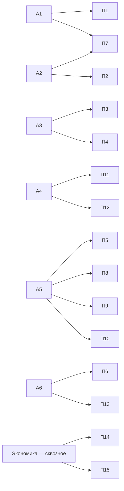

# Каталог модулей

Система двойного уровня: **6 академических (А1–А6)** и **15 профессиональных (П1–П15)** модулей, связанных матрицей компетенций. Студент и фермер изучают одну проблему на разной глубине по единой логике «от инструмента к применению».

## Академические модули { .folur-block-h }
А1–А6 · бакалавриат и магистратура · ИИ-уровень pro-code

-   :material-chart-timeline-variant:{ .lg .middle } А1**Жизненный цикл агроданных и почвенно-агрохимический мониторинг (+ БПЛА и IoT)**

    ---

    4 урока · практикум · ИИ-задание. Продукт: полётное задание БПЛА.

    [:octicons-arrow-right-24: Открыть модуль](a1/index.md)

-   :material-map:{ .lg .middle } А2**Геоинформатика, пространственный анализ и управление пастбищами**

    ---

    4 урока · практикум · ИИ-задание. Продукт: карта землепользования района СКО.

    [:octicons-arrow-right-24: Открыть модуль](a2/index.md)

-   :material-robot:{ .lg .middle } А3**ИИ и машинное обучение в агромониторинге**

    ---

    4 урока · практикум · ИИ-задание. Продукт: классификация тремя подходами.

    [:octicons-arrow-right-24: Открыть модуль](a3/index.md)

-   :material-waves:{ .lg .middle } А4**Водные ресурсы, мониторинг, батиметрия**

    ---

    4 урока · практикум на реальных промерах. Продукт: карта глубин.

    [:octicons-arrow-right-24: Открыть модуль](a4/index.md)

-   :material-sprout:{ .lg .middle } А5**Устойчивое землепользование и агроэкология**

    ---

    4 урока · практикум · ИИ-задание. Продукт: план землепользования хозяйства.

    [:octicons-arrow-right-24: Открыть модуль](a5/index.md)

-   :material-pine-tree:{ .lg .middle } А6**Экосистемные услуги и восстановление земель**

    ---

    4 урока · практикум · ИИ-задание. Продукт: план восстановления участка.

    [:octicons-arrow-right-24: Открыть модуль](a6/index.md)

## Блок «Данные» { .folur-block-h }
П1–П4 · 16–40 ч · цифровая грамотность, ГИС, ИИ

-   :material-table:{ .lg .middle } П1**Управление данными в агрохозяйстве**

    ---

    Продукт: шаблон системы учёта вашего хозяйства.

    [:octicons-arrow-right-24: Открыть модуль](p1/index.md)

-   :material-map-marker:{ .lg .middle } П2**Введение в ГИС и открытые геоданные**

    ---

    Продукт: карта вашего хозяйства с космоснимком.

    [:octicons-arrow-right-24: Открыть модуль](p2/index.md)

-   :material-robot-happy:{ .lg .middle } П3**ИИ-инструменты без программирования**

    ---

    Продукт: настроенный NDVI-мониторинг ваших полей.

    [:octicons-arrow-right-24: Открыть модуль](p3/index.md)

-   :material-language-python:{ .lg .middle } П4**Python и Jupyter для специалистов**

    ---

    Продукт: первый рабочий скрипт под ваш датасет.

    [:octicons-arrow-right-24: Открыть модуль](p4/index.md)

## Блок «Землепользование» { .folur-block-h }
П5–П7 · планирование и мониторинг

-   :material-terrain:{ .lg .middle } П5**Ландшафтное планирование для МСБ**

    ---

    Продукт: ландшафтный план хозяйства на 5 лет.

    [:octicons-arrow-right-24: Открыть модуль](p5/index.md)

-   :material-chart-donut:{ .lg .middle } П6**Оценка экосистемных услуг хозяйства**

    ---

    Продукт: отчёт об экосистемных услугах территории.

    [:octicons-arrow-right-24: Открыть модуль](p6/index.md)

-   :material-quadcopter:{ .lg .middle } П7**ДЗЗ и БПЛА для мониторинга земель**

    ---

    Продукт: ряд NDVI и результаты облёта проблемной зоны.

    [:octicons-arrow-right-24: Открыть модуль](p7/index.md)

## Блок «Агропроизводство» { .folur-block-h }
П8–П10 · устойчивые технологии

-   :material-seed:{ .lg .middle } П8**Почвосберегающее земледелие, no-till**

    ---

    Продукт: план перехода хозяйства на no-till.

    [:octicons-arrow-right-24: Открыть модуль](p8/index.md)

-   :material-barley:{ .lg .middle } П9**Севообороты и кормовая база**

    ---

    Продукт: 3–5-польный севооборот вашего хозяйства.

    [:octicons-arrow-right-24: Открыть модуль](p9/index.md)

-   :material-leaf:{ .lg .middle } П10**«Зелёное» производство и органика**

    ---

    Продукт: дорожная карта перехода на органику.

    [:octicons-arrow-right-24: Открыть модуль](p10/index.md)

## Блок «Вода и экосистемы» { .folur-block-h }
П11–П13 · управление ресурсами

-   :material-waves-arrow-up:{ .lg .middle } П11**Батиметрия и мониторинг водных объектов**

    ---

    Практикум на реальных промерах. Продукт: карта глубин своими руками.

    [:octicons-arrow-right-24: Открыть модуль](p11/index.md)

-   :material-water:{ .lg .middle } П12**Водосбережение и ирригация**

    ---

    Продукт: проект системы водосбережения участка.

    [:octicons-arrow-right-24: Открыть модуль](p12/index.md)

-   :material-bird:{ .lg .middle } П13**Биоразнообразие и прилегающие экосистемы**

    ---

    Продукт: план сохранения биоразнообразия хозяйства.

    [:octicons-arrow-right-24: Открыть модуль](p13/index.md)

## Блок «Экономика» { .folur-block-h }
П14–П15 · финансирование и рынки

-   :material-cash-multiple:{ .lg .middle } П14**Субсидии, гранты, финансовые инструменты**

    ---

    Продукт: сформированная заявка на меру поддержки.

    [:octicons-arrow-right-24: Открыть модуль](p14/index.md)

-   :material-storefront:{ .lg .middle } П15**Устойчивые цепочки и маркетинг**

    ---

    Продукт: маркетинговый план «зелёной» продукции.

    [:octicons-arrow-right-24: Открыть модуль](p15/index.md)

## Матрица вертикальной интеграции А↔П

Каждый профессиональный модуль опирается на академического «родителя» и переиспользует его датасеты и кейсы:

