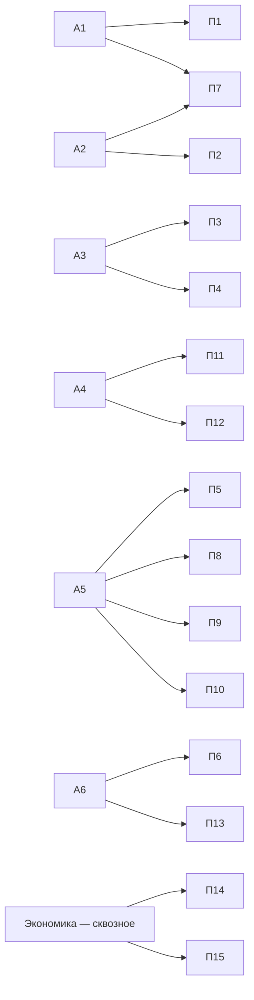

# Каталог модулей

Система двойного уровня: **6 академических (А1–А6)** и **15 профессиональных (П1–П15)** модулей, связанных матрицей компетенций. Студент и фермер изучают одну проблему на разной глубине по единой логике «от инструмента к применению».

## Академические модули

| Код | Модуль | Профессиональные «спутники» |
|---|---|---|
| [А1](a1/index.md) | Жизненный цикл данных в агросфере (+ БПЛА и IoT) | П1, П7 |
| [А2](a2/index.md) | Геоинформатика и пространственный анализ | П2, П7 |
| [А3](a3/index.md) | ИИ и машинное обучение в агромониторинге | П3, П4 |
| [А4](a4/index.md) | Водные ресурсы и батиметрия | П11, П12 |
| [А5](a5/index.md) | Устойчивое землепользование Северного Казахстана | П5, П8–П10 |
| [А6](a6/index.md) | Экосистемные услуги и восстановление земель | П6, П13 |

## Профессиональные модули (по блокам)

| Блок | Модули |
|---|---|
| Данные | [П1](p1/index.md) · [П2](p2/index.md) · [П3](p3/index.md) · [П4](p4/index.md) |
| Землепользование | [П5](p5/index.md) · [П6](p6/index.md) · [П7](p7/index.md) |
| Агропроизводство | [П8](p8/index.md) · [П9](p9/index.md) · [П10](p10/index.md) |
| Вода и экосистемы | [П11](p11/index.md) · [П12](p12/index.md) · [П13](p13/index.md) |
| Экономика | [П14](p14/index.md) · [П15](p15/index.md) |

