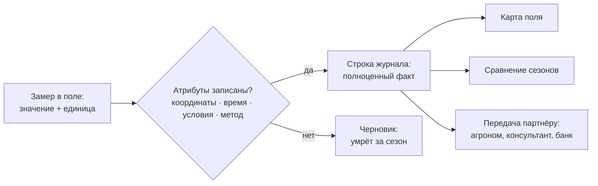

# Фиксируем каждый замер полностью: координаты, время, условия

> ⏱ **Трудозатраты:** ~17 мин чтения + ~20 мин практики
> Модуль **П1: Управление данными в агрохозяйстве**, урок 1 из 3.
> Профессиональный уровень (практики). Проект UNDP-KAZ FOLUR. Компоненты FOLUR: **1**, **2**.

## Цели урока и место в модуле

Этот урок — фундамент всего модуля. Прежде чем выбирать таблицы и приложения (урок 2) и настраивать резервные копии (урок 3), нужно договориться о главном: **что именно считается полноценной записью данных**. Здесь мы разберём, почему в хозяйстве «данных много, а пользы нет», проведём инвентаризацию потоков данных типичного хозяйства Северного Казахстана и выведем минимальный набор обязательных атрибутов любого замера — координаты, время, условия, метод.

После изучения урока слушатель сможет:

1. **[Bloom: понимать]** объяснять, почему запись без координат, даты и условий теряет большую часть ценности и не может быть совмещена с картой или спутниковым снимком.
2. **[Bloom: применять]** записывать любой полевой замер с полным набором обязательных атрибутов: кто, что, где (координаты), когда (дата и время), при каких условиях, каким методом.
3. **[Bloom: анализировать]** проводить инвентаризацию потоков данных своего хозяйства и находить записи, которые не переживут смену сезона, сотрудника или телефона.

> **Границы урока.** Внутри: инвентаризация потоков данных хозяйства, обязательные атрибуты замера и способы их фиксации в поле. За рамками: устройство самих журналов и выбор бесплатных инструментов (Google Sheets, QField, локальная база) — подробнее в [Уроке 2](02-zhurnaly-i-instrumenty.md); резервное копирование и правила передачи данных партнёрам — в [Уроке 3](03-rezervnye-kopii-i-peredacha.md); научная сторона жизненного цикла данных, БПЛА и стандарты FAIR — в академическом модуле [А1](../../a1/index.md); построение карты своего хозяйства — в модуле [П2](../../p2/index.md).

---

## 1. «Данных много, а пользы нет»: как хозяйство теряет собственный опыт

Начнём с истории, которую в разных вариантах рассказывает почти каждое хозяйство. Агроном ведёт журнал обработок в тетради. Результаты агрохимического обследования лежат в PDF-отчёте подрядчика. Комбайн пишет урожайность на флешку в формате производителя техники. Механизатор помнит, где весной была вымочка, — но помнит только он. Когда через два-три года хозяйство хочет понять, почему западная часть поля стабильно даёт меньше, выясняется: соединить эти сведения невозможно.

Причина не в лени и не в нехватке техники. Причина в том, что записи делались **без обязательных атрибутов**: у наблюдения нет координат — его нельзя положить на карту; нет точной даты — его нельзя сопоставить с погодой и спутниковым снимком; нет условий замера — ему нельзя доверять при сравнении с другими годами. Такая запись живёт один сезон и умирает вместе с тетрадью или с уволившимся сотрудником.

Между тем данные хозяйства — это актив с накопительным эффектом. Один сезон наблюдений почти ничего не даёт; пять сопоставимых сезонов позволяют увидеть закономерности: какие участки страдают в засушливые годы, где обработка окупается, а где нет. Международные рамки устойчивого землепользования говорят о том же: база WOCAT собирает практики по единому стандарту описания именно потому, что несопоставимые записи невозможно сравнивать, а рамка FAO «10 элементов агроэкологии» включает совместное создание и обмен знаниями — обмениваться же можно только данными, которые понятны кому-то, кроме автора.

### 1.1 Инвентаризация: какие потоки данных уже есть в хозяйстве

Первый практический шаг — не покупать программу, а честно переписать, какие данные в хозяйстве **уже возникают**. У типичного зернового хозяйства Северного Казахстана потоков больше, чем кажется:

| Поток данных | Где обычно живёт | Что теряется чаще всего |
|---|---|---|
| Журнал полевых работ (посев, обработки, уборка) | Тетрадь агронома, память | Точные даты, привязка к конкретному полю |
| Агрохимическое обследование | PDF подрядчика, бумажный отчёт | Координаты точек отбора проб |
| Наблюдения в поле (всходы, сорняки, вымочки, солонцы) | Память, фото в телефоне | Координаты, дата, автор |
| Карты урожайности и треки техники | Флешка, кабинет производителя техники | Выгрузка в открытый формат |
| Погода | Ближайшая метеостанция, «по ощущениям» | Систематическая запись по своему участку |
| Склад: семена, СЗР, удобрения, ГСМ | Бухгалтерия, накладные | Связь расхода с конкретным полем |
| Документы на землю, границы полей | Папка с документами | Электронный контур поля |

Проведите эту инвентаризацию для своего хозяйства — она займёт полчаса и станет первой страницей вашего прикладного продукта в [практикуме](../practicum/01-shablon-sistemy-uchyota.md). Для каждого потока ответьте на три вопроса: кто записывает, где лежит запись и сможет ли ею воспользоваться другой человек через три года.

---

## 2. Обязательный атрибут — что это и почему без него запись неполна

**Атрибут замера** — это сопровождающее сведение, без которого само измеренное значение нельзя правильно использовать. Число «22» бесполезно; запись «влажность зерна 22%, поле №3, северный край, 14:30 12.09, после дождя, влагомером таким-то, замерил Н.» — рабочий факт, который можно проверить, сравнить и положить на карту.

Минимальный набор обязательных атрибутов любого полевого замера в этом модуле мы фиксируем так:

| Атрибут | Вопрос | Пример записи | Что происходит без него |
|---|---|---|---|
| Объект | Что и где именно? | Поле №3 (ID из справочника полей) | Замер нельзя отнести к участку |
| Координаты | Точка на карте? | 53.1234, 63.4321 (десятичные градусы; условный пример) | Нельзя совместить с картой и снимком |
| Дата и время | Когда? | 2026-09-12 14:30 | Нельзя сопоставить с погодой и динамикой |
| Величина и единица | Сколько и в чём? | 22 % влажности | Число без единицы — источник грубых ошибок |
| Условия | При каких обстоятельствах? | После дождя, стерня | Сравнение замеров разных дней некорректно |
| Метод/прибор | Чем измерено? | Влагомер (модель), экспресс-метод | Непонятна точность и сопоставимость |
| Автор | Кто записал? | Инициалы или код сотрудника | Не у кого уточнить при сомнении |

Порядок в таблице не случаен: первые три атрибута (объект, координаты, время) — **невосстановимые**. Если влажность можно перемерить завтра, то координату и время вчерашнего замера задним числом не восстановит никто. Именно поэтому правило модуля звучит жёстко: *запись без координат и даты считается черновиком, а не данными*.



*Рис. 1. Судьба замера решается в момент записи. Alt: блок-схема — полевой замер проходит проверку «атрибуты записаны?»; при ответе «да» он становится строкой журнала и работает на карту поля, сравнение сезонов и передачу партнёрам; при ответе «нет» превращается в черновик, который теряется за сезон.*

### 2.1 Координаты: как записывать без специальных приборов

Для задач управления хозяйством достаточно обычного смартфона: типичная точность бытового спутникового приёмника — единицы метров, и для привязки точки отбора пробы или очага сорняков на поле в сотни гектаров этого хватает. Специальное оборудование (RTK-приёмники сантиметровой точности) нужно для точного земледелия и съёмки с БПЛА — этот уровень разбирает академический модуль [А1](../../a1/index.md), для журнала хозяйства он избыточен.

Практические правила записи координат:

- **Формат — десятичные градусы** (например, 53.12345, 63.43210), а не «градусы-минуты-секунды»: десятичный формат понимают все программы без преобразований. Пять знаков после запятой соответствуют точности порядка метра — больше не нужно.
- **Порядок — широта, потом долгота.** Для Северного Казахстана широта ~50–55° (первая цифра 5), долгота ~60–75°: если числа «перепутались», это видно сразу — точка «уедет» в другую страну.
- **Как снять:** в большинстве смартфонов координаты показывает штатное приложение карт (долгое нажатие на точку) или компас; удобнее специализированные бесплатные приложения полевого сбора — их разберём в [Уроке 2](02-zhurnaly-i-instrumenty.md). Фотография с включённой геометкой — тоже способ: координаты сохраняются внутри снимка.
- **Стойте у объекта замера**, а не у машины: записанная от автомобиля координата может «промахнуться» на десятки метров — типичная и незаметная ошибка.

!!! example "Попробуйте прямо сейчас (2 минуты)"
    Откройте карты в смартфоне, найдите долгим нажатием координаты вашего двора и запишите их в десятичных градусах. Затем найдите эту же точку на общедоступной карте OpenStreetMap (openstreetmap.org) на компьютере. Совпало? Вы только что выполнили полный цикл «замер → запись → проверка на независимой карте».

### 2.2 Дата и время: один формат на всё хозяйство

Записи «12.09», «сентябрь», «после уборки» не сортируются и не сопоставляются. Стандарт модуля — формат **ГГГГ-ММ-ДД** (2026-09-12) и время в 24-часовой записи. У этого формата два свойства, которые экономят часы работы: он однозначен (не спутать день с месяцем, как в 09.12 против 12.09) и правильно сортируется в любой таблице простым упорядочиванием по алфавиту. Время важно не всегда, но там, где важно (обработки СЗР, замеры влажности), решает: утренний и дневной замер в степной зоне — это разные условия.

### 2.3 Условия и метод: атрибуты доверия

Координаты и время делают запись *находимой*; условия и метод делают её *достоверной*. «Влажность 22%» после дождя и в сухой день — несравнимые числа. Урожайность «по бункерному весу» и «в зачётном весе» — разные величины. Правило простое: фиксируйте те обстоятельства, которые способны изменить значение замера, и прибор или метод, которым замер сделан. В журнале это одна-две короткие колонки со словарём типовых значений («сухо», «после осадков», «роса») — как устроить такие словари, чтобы не писать каждый раз текст руками, покажет [Урок 2](02-zhurnaly-i-instrumenty.md).

### 2.4 Фотография как замер: самый быстрый полноценный способ записи

Отдельного разговора заслуживает фотография со смартфона. Если в настройках камеры включена геометка, снимок автоматически несёт три невосстановимых атрибута сразу: координаты, дату и время. Добавьте к нему короткую подпись или голосовую заметку — и вы получили полноценную запись наблюдения за две секунды, прямо посреди уборки. Именно поэтому правило модуля: **геометка в камере рабочего телефона включена всегда** (Настройки камеры → «Данные о местоположении» или аналогичный пункт).

Три оговорки. Первая: фото — это черновик записи, а не сама запись; в конце дня или недели наблюдение должно быть перенесено в журнал строкой с атрибутами (иначе через год у вас будет тысяча снимков «какого-то поля в какой-то момент» — искать в них ничем не лучше, чем в тетради). Вторая: снимайте так, чтобы был понятен масштаб и контекст — общий план с ориентиром плюс крупный план объекта. Третья: помните, что геометка остаётся в файле при пересылке — отправляя фото за пределы хозяйства, вы отправляете и точные координаты; это уже вопрос правил передачи, которые разберёт [Урок 3](03-rezervnye-kopii-i-peredacha.md).

### 2.5 Частые ошибки записи — и чего они стоят

Соберём типовые ошибки, которые встречаются в журналах хозяйств чаще всего. Каждая кажется мелочью в момент записи — и каждая обходится дорого при использовании:

- **«Поле понятно из контекста».** В тетради записи идут подряд, и «обработали» относится «к тому же полю, что выше». При переносе в таблицу контекст исчезает — половина записей повисает в воздухе.
- **Число без единицы.** «Норма 2» — это литры, килограммы или центнеры? Через сезон не вспомнит и автор. Единица — часть значения, а не украшение.
- **Точка «примерно здесь».** Координата, снятая от машины на краю поля вместо места замера, смещает запись на десятки и сотни метров. Для журнала наблюдений это может быть терпимо, для точки отбора пробы — нет: повторный отбор «в том же месте» окажется в другом месте.
- **Запись задним числом «по памяти».** Через три дня дата уже приблизительна, условия забыты, а уверенность в деталях — ложная. Правило черновика (§4) разрешает отложить *оформление*, но не *фиксацию*: минимум — фото с геометкой в момент события.

Общий знаменатель ошибок один: они незаметны при записи и неисправимы при использовании. Поэтому дисциплина атрибутов — привычка, а не разовое усилие.

---

## 3. Как выглядят «взрослые» данные: разбираем реальный полевой датасет

Полезно один раз увидеть, как те же правила работают в исследовательских данных. На нашей платформе размещён учебный датасет — **539 955 эхолотных промеров глубин пресноводного водохранилища степной зоны Казахстана**, собранных полевыми экспедициями исполнителя (учебный сабсет — `datasets/bathymetry-training-80k.csv`, 80 000 точек). Каждая строка устроена ровно по логике этого урока: идентификатор точки, координаты `x_m, y_m`, значение `depth_m`. Сотни тысяч замеров остаются пригодными к анализу спустя годы именно потому, что у каждого есть позиция и величина в известных единицах.

У этого датасета есть и вторая, не менее поучительная особенность: координаты в нём **намеренно переведены в локальную систему, а название и расположение водоёма не раскрываются**. Точная геопривязка детальных данных о местности в Казахстане имеет правовой режим, поэтому открытая учебная версия публикуется без неё — полная политика описана на странице [Датасеты платформы](../../../datasets.md). Для вас это живой пример темы [Урока 3](03-rezervnye-kopii-i-peredacha.md): у данных есть не только атрибуты, но и правила передачи — не всё и не всем можно отдавать в исходном виде.

> **Подробнее** — как из таких промеров строится карта глубин, разбирают модули [А4](../../a4/index.md) и [П11](../../p11/index.md); нам здесь важен сам образец дисциплины записи.

---

## 4. Методика: пять шагов к дисциплине записи в хозяйстве

Сведём урок в короткую методику, которую вы примените в практикуме:

1. **Инвентаризация.** Перепишите потоки данных хозяйства (таблица §1.1): что возникает, где живёт, кто пишет.
2. **Справочник объектов.** Присвойте каждому полю и объекту постоянный идентификатор (Поле-03, Скважина-1). Все журналы ссылаются на эти ID — это скелет системы учёта.
3. **Карточка замера.** Для каждого типа наблюдений определите обязательные атрибуты по таблице §2 — что записывается всегда, без исключений.
4. **Один формат.** Договоритесь о форматах: десятичные градусы, даты ГГГГ-ММ-ДД, единицы измерения — и запишите договорённость на бумаге, доступной каждому работнику.
5. **Правило черновика.** Запись без координат и даты — черновик: она допустима в моменте («некогда, уборка»), но должна быть дополнена в тот же день, пока обстоятельства не забылись.

Эти пять шагов не требуют ни программ, ни затрат — только решения руководителя. Инструменты, которые сделают выполнение шагов удобным, — тема следующего урока.

---

## Региональный кейс

**Ситуация.** Зерновое хозяйство в Костанайской области (пшеница — ключевая культура региона и всего проекта FOLUR в Северном Казахстане) третий год замечает, что западная часть одного из полей даёт визуально более слабые всходы. Агроном каждый год отмечал проблему — «на западе опять хуже» — в тетради. Хозяйство заказало агрохимическое обследование; подрядчик передал бумажный отчёт со средними значениями по полю, без координат точек отбора. Теперь руководитель хочет сопоставить проблемную зону со спутниковыми данными и решить, есть ли смысл в дифференцированной обработке.

**Данные.** Снимки Sentinel-2 (открытый доступ: браузер Copernicus / Copernicus Data Space Ecosystem, dataspace.copernicus.eu) — на них по индексу вегетации NDVI видна внутриполевая неоднородность; границы и ориентиры — OpenStreetMap; записи агронома — тетрадь без координат.

**Задача.**

1. Какие из накопленных хозяйством сведений можно совместить со снимком Sentinel-2, а какие — нет, и почему?
2. Составьте карточку замера (по таблице §2) для будущих полевых наблюдений «слабые всходы»: какие атрибуты обязательны, чтобы через год наблюдение легло на карту?
3. Что нужно было заранее потребовать от подрядчика агрохимического обследования?

**Разбор.** Совместить со снимком можно только то, у чего есть координаты и дата, — то есть в данном случае почти ничего: заметки «на западе хуже» не имеют границ, отчёт агрохимии — точек отбора. Снимок покажет зону пониженного NDVI, но хозяйство не сможет подтвердить её своими наземными записями — три года наблюдений фактически потеряны. Карточка замера для «слабых всходов» обязана включать: ID поля, координаты точки (или обход границы очага), дату, описание состояния по короткому словарю, фото с геометкой, автора. От подрядчика следовало требовать ведомость точек отбора с координатами в десятичных градусах и электронную таблицу результатов — это стандартное требование, которое ничего не стоит, если заявлено до начала работ. Урок кейса: стоимость атрибута — секунды при записи; стоимость его отсутствия — годы потерянных наблюдений.

---

## Закрепление и применение

!!! tip "Что это даёт вашему хозяйству"
    Дисциплина атрибутов — самая дешёвая инвестиция в данные: смартфон уже есть, справочник полей делается за вечер. Отдача: наблюдения перестают умирать с сезоном, историю поля можно предъявить агроному-консультанту или банку, а при переходе к спутниковому мониторингу ([П3](../../p3/index.md)) наземные записи станут проверочными точками для дистанционных данных.

!!! warning "Границы применимости"
    Смартфонная точность (единицы метров) годится для журнала наблюдений, но не для межевания границ, споров о площади и точного земледелия — там нужны геодезические измерения и другой класс приборов. Также помните: детальные пространственные данные могут иметь правовой режим распространения — прежде чем публиковать или передавать точные координатные массивы, сверьтесь с правилами из [Урока 3](03-rezervnye-kopii-i-peredacha.md).

!!! question "Кейс для размышления"
    Механизатор говорит: «Во время сева мне некогда записывать координаты каждой заправки сеялки». Как перестроить процесс, чтобы данные всё же собирались? Подсказки: правило черновика (§4), фото с геометкой как «запись за одну секунду», автоматические треки техники. Какие атрибуты в этой ситуации действительно обязательны, а какими можно пожертвовать?

---

### Проверь себя

```quiz
[
  {
    "q": "Агроном записал в тетрадь: «12.09 — влажность зерна на третьем поле 22%». Какой невосстановимый атрибут потерян?",
    "options": ["Координаты точки замера — задним числом их не восстановить", "Единица измерения — её можно уточнить позже", "Название прибора — оно есть в паспорте влагомера", "Ничего не потеряно: поле и дата указаны"],
    "answer": 0,
    "explain": "§2: объект, координаты и время — невосстановимые атрибуты. «Третье поле» без точки не ляжет на карту; влажность можно перемерить, координату вчерашнего замера — нет."
  },
  {
    "q": "Почему стандарт модуля требует записывать даты в формате ГГГГ-ММ-ДД (2026-09-12)?",
    "options": ["Формат однозначен и правильно сортируется в любой таблице", "Так требует законодательство РК о документообороте", "Этот формат занимает меньше места в таблице", "Только такой формат понимает GPS-приёмник"],
    "answer": 0,
    "explain": "§2.2: в записи 09.12 легко спутать день и месяц, а ГГГГ-ММ-ДД однозначен и сортируется простым упорядочиванием по алфавиту. Требований закона на этот счёт в модуле не заявлялось."
  },
  {
    "q": "Координата замера в хозяйстве Костанайской области записана как «63.4321, 53.1234». Что должно насторожить?",
    "options": ["Похоже, широта и долгота переставлены местами: для Северного Казахстана широта ~50–55°, долгота ~60–75°", "Слишком много знаков после запятой — так точно смартфон не измеряет", "Ничего: порядок записи координат не имеет значения", "Координаты нельзя записывать десятичными градусами"],
    "answer": 0,
    "explain": "§2.1: порядок — широта, потом долгота; для региона первая цифра широты — 5, долготы — 6–7. Переставленные координаты «уводят» точку в другую страну."
  },
  {
    "q": "Зачем в журнале фиксировать условия замера («после дождя», «роса»)?",
    "options": ["Условия влияют на значение: без них замеры разных дней некорректно сравнивать между собой", "Это требование подрядчиков агрохимического обследования", "Условия нужны только для научных публикаций", "Чтобы журнал выглядел солиднее при проверках"],
    "answer": 0,
    "explain": "§2.3: условия и метод — атрибуты доверия; влажность после дождя и в сухой день — несравнимые числа."
  },
  {
    "q": "Учебный батиметрический датасет платформы опубликован в локальной системе координат без названия водоёма. Что это иллюстрирует?",
    "options": ["У данных есть не только атрибуты, но и правила передачи: точную геопривязку нельзя раскрывать без правового подтверждения", "Координаты в полевых данных необязательны", "Исследовательские данные всегда шифруются", "Эхолот не умеет записывать широту и долготу"],
    "answer": 0,
    "explain": "§3: открытая учебная версия намеренно обезличена из-за правового режима детальных пространственных данных; политика — на странице «Датасеты платформы», подробности передачи — в Уроке 3."
  }
]
```

---

## Что дальше?

Вы определили, **что** записывать. Следующий шаг — **куда и как**: в [Уроке 2 «Собираем журналы учёта в бесплатных инструментах»](02-zhurnaly-i-instrumenty.md) мы спроектируем шаблоны журналов и сравним Google Sheets, полевое приложение QField и локальную базу данных. Тем, кто хочет понять научную основу — полный жизненный цикл данных, БПЛА и стандарты, — прямая дорога в академический модуль [А1](../../a1/index.md). Свой шаблон системы учёта вы соберёте в [практикуме модуля](../practicum/01-shablon-sistemy-uchyota.md).
