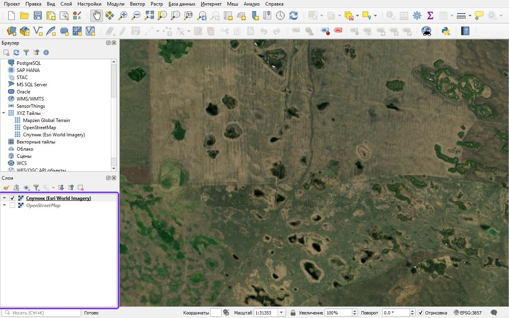
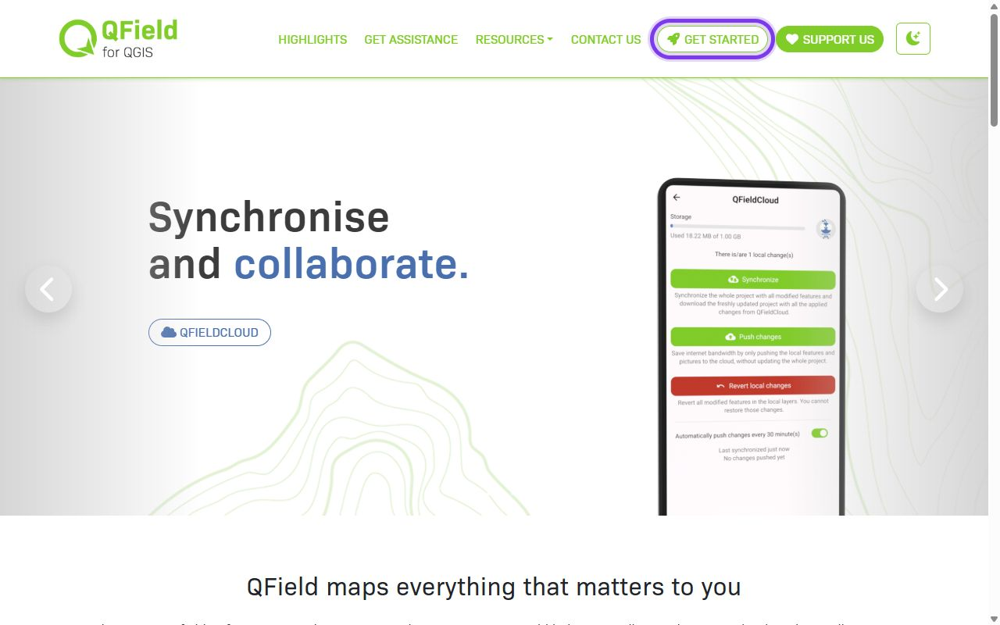
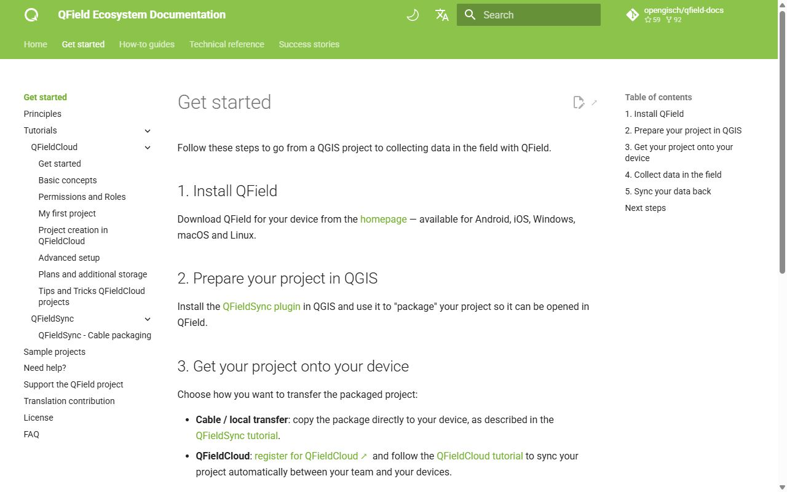
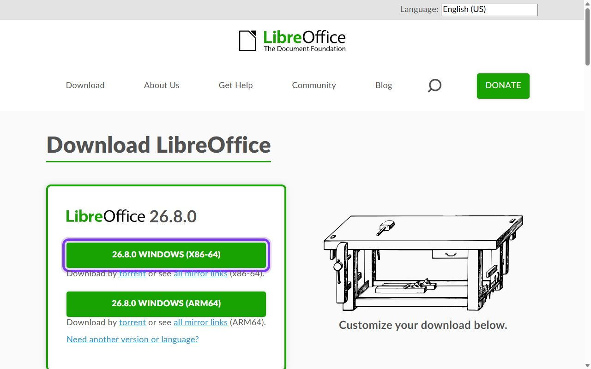

# Собираем журналы учёта в бесплатных инструментах: Google Sheets, QField, локальная база

!!! info "Вычисления в браузере"
    Для этого материала подготовлен [редактор Python](#python-practice). Он выполняет весь скрипт целиком; графики, изображения, таблицы и файлы появляются под кодом. Учебный пример запускается без аккаунта Google. Облачные API и полноценные настольные ГИС используются отдельно, когда этого требует исходное задание.

> ⏱ **Трудозатраты:** ~18 мин чтения + ~25 мин практики

<!-- folur-software:start -->

!!! tip "Что понадобится в этом уроке и где это взять"
    Нажмите на название программы и увидите, **где её взять, что нажать и как она выглядит в работе** (нужная кнопка на снимке обведена фиолетовым). Встроенный редактор Python установки не требует. Полная справка — [«Программы и сервисы»](../../../software.md).

??? example "Встроенный редактор Python — как запустить и что получится"
    { .folur-shot loading=lazy }

    1. Скачивать и устанавливать ничего не нужно: редактор находится в этом уроке, на шаге **«Практика в Python»**.
    2. Нажмите **«▶ Запустить»** под кодом (на снимке обведена). В первый раз подождите до минуты, пока загрузится Python.
    3. Ниже, в блоке «Результат», появятся таблицы и графики. Измените число в коде и запустите ещё раз.
    4. Вкладка **«Мой участок»** над редактором считает то же по вашим координатам, контуру поля или снимку.

    **Как это выглядит в работе.** Пример результата: таблицы под кодом и кнопки скачивания файлов.

    { .folur-shot loading=lazy }

    **Как это выглядит в работе.** Вкладка «Мой участок»: координаты поля, контур и снимок подставляются здесь.

    { .folur-shot loading=lazy }

    [Подробно о редакторе, своих данных и запросе для нейросети →](../../../software.md#python)

??? example "QGIS — скачать и установить"
    { .folur-shot loading=lazy }

    1. Откройте <https://qgis.org/download/>. Сайт сначала предложит пожертвование — оно необязательно: нажмите **«Skip it and go to download»**.
    2. Нажмите зелёную кнопку **«Download LTR»** (на снимке обведена). LTR — версия долгосрочной поддержки, она стабильнее. Скачается установщик размером около 1 ГБ.
    3. Запустите скачанный файл и нажимайте «Next», ничего не меняя. После установки откройте в меню «Пуск» ярлык **QGIS Desktop**.

    **Как это выглядит в работе.** QGIS в работе (русский интерфейс): слева панели «Браузер» и «Слои», в окне карты — спутниковая подложка, на которой видны поля.

    { .folur-shot loading=lazy }

    [QGIS по шагам в картинках: подложка, спутник, новый слой, система координат, площадь →](../../../software.md#qgis-steps)

    [Первые шаги в QGIS и русский интерфейс →](../../../software.md#qgis)

??? example "QField — установить на телефон"
    { .folur-shot loading=lazy }

    1. QField ставится на **телефон**: откройте Google Play или App Store и найдите приложение **QField** (издатель — OPENGIS.ch).
    2. Либо откройте <https://qfield.org/> и нажмите **«Get started»** (на снимке обведена) — там ссылки на магазины приложений.
    3. Проект с картой для QField готовится на компьютере в QGIS.

    **Как это выглядит в работе.** Раздел «Get started» в справке QField: шаги от проекта QGIS до сбора данных в поле.

    { .folur-shot loading=lazy }

    [Как устроена работа с QField →](../../../software.md#qfield)

??? example "Таблицы: LibreOffice — скачать (или Google Таблицы без установки)"
    { .folur-shot loading=lazy }

    1. Если у вас есть Microsoft Excel или аккаунт Google (Google Таблицы работают в браузере) — ставить ничего не нужно.
    2. Иначе откройте <https://www.libreoffice.org/download/download-libreoffice/> и нажмите зелёную кнопку **«Windows (x86-64)»** (на снимке обведена).
    3. Запустите скачанный файл и нажимайте «Далее». Для таблиц открывайте программу **LibreOffice Calc**.

    [Как сохранять таблицу в CSV →](../../../software.md#office)

<!-- folur-software:end -->

<p><em><strong>Цель:</strong></em> научиться проектировать связанные журналы хозяйства по правилам чистой таблицы и выбирать комбинацию бесплатных инструментов под свои условия — включая работу без интернета.</p>

<p><em><strong>Место в модуле.</strong></em> В Уроке 1 мы решили, что записывать: обязательные атрибуты замера. Теперь строим то, куда записывать: структуру журналов и справочников, из которых складывается система учёта хозяйства, — и выбираем бесплатные инструменты, в которых эта структура заработает. Урок напрямую готовит практикум, где вы соберёте собственный шаблон.</p>

## После изучения слушатель сможет:

<p><em>перечислять</em> базовые журналы системы учёта хозяйства (справочник полей, журнал операций, журнал наблюдений, складской журнал) и их ключевые колонки.</p>

<p><em>проектировать</em> журнал по правилам структурированной таблицы: одна строка — одно событие, словари вместо свободного текста, ссылки на справочник полей по ID.</p>

<p><em>сравнивать</em> три класса бесплатных инструментов хранения (онлайн-таблицы, полевые геоприложения, локальная база данных) и выбирать комбинацию под условия своего хозяйства — включая работу без интернета.</p>

<p>Границы: Внутри: структура журналов, правила «чистой таблицы», обзор и выбор бесплатных инструментов (Google Sheets, QField, локальная БД), словари и проверка ввода. За рамками: обязательные атрибуты записи — это Урок 1; резервное копирование и передача данных — Урок 3; полноценная работа с картами и оцифровка границ полей — модуль П2; автоматический спутниковый мониторинг полей — модуль П3.</p>

## Лекционный блок

<p>Продолжая предыдущий материал, переходим к вопросу «1. Система учёта — это не одна таблица, а несколько связанных», который связывает изложенное выше с тем, что рассматривается далее.</p>

<p>Первый порыв — завести «одну большую таблицу про всё». Он же — главная ошибка: в такой таблице смешиваются события разных типов, колонки половине строк не нужны, а через сезон в ней невозможно ничего найти. Работающая система учёта устроена как набор специализированных журналов, связанных через общие справочники.</p>

<p>Минимальный комплект для растениеводческого хозяйства:</p>

<div class="upgraded-table"><table>
<tr><th colspan="1" rowspan="1">Журнал</th><th colspan="1" rowspan="1">Что хранит</th><th colspan="1" rowspan="1">Одна строка — это…</th></tr>
<tr><td colspan="1" rowspan="1">Справочник полей</td><td colspan="1" rowspan="1">Постоянный список объектов: ID, название, площадь, культура сезона</td><td colspan="1" rowspan="1">…одно поле (объект)</td></tr>
<tr><td colspan="1" rowspan="1">Журнал операций</td><td colspan="1" rowspan="1">Посев, обработки, подкормки, уборка</td><td colspan="1" rowspan="1">…одна операция на одном поле</td></tr>
<tr><td colspan="1" rowspan="1">Журнал наблюдений</td><td colspan="1" rowspan="1">Всходы, сорняки, вредители, вымочки, состояние паров</td><td colspan="1" rowspan="1">…одно наблюдение в одной точке</td></tr>
<tr><td colspan="1" rowspan="1">Складской журнал</td><td colspan="1" rowspan="1">Приход/расход семян, СЗР, удобрений, ГСМ</td><td colspan="1" rowspan="1">…одно движение по складу</td></tr>
</table></div>

<p>Вывод: скелет системы — справочник полей с постоянными ID; через него операции, наблюдения и склад сводятся по каждому полю в конце сезона.</p>

<p>Скелет системы — справочник полей. Каждому полю присваивается короткий постоянный идентификатор (P-01, P-02…), и все остальные журналы ссылаются на него, а не на словесные описания. «Поле у лесополосы за третьей бригадой» — это адрес для человека; P-07 — адрес для системы, который не изменится при смене бригадира и однозначно свяжет операцию, наблюдение и расход склада с одним и тем же участком.</p>

<figure class="upgraded-figure"></figure>

<p class="upgraded-caption">Рисунок 1 — Справочник полей — скелет системы учёта: все журналы ссылаются на ID поля, и только поэтому данные сезона можно свести воедино</p>

<p>Обратите внимание на складской журнал: колонка «поле-ID» в строке расхода — то самое звено, которое обычно отсутствует. Бухгалтерия знает, сколько гербицида списано за сезон, но не знает, на какие поля он ушёл. Одна дополнительная колонка — и в конце сезона хозяйство впервые видит затраты в разрезе полей.</p>

<p>Продолжая предыдущий материал, переходим к вопросу «1.1 Правила «чистой таблицы»», который связывает изложенное выше с тем, что рассматривается далее.</p>

<p>Чтобы журнал оставался пригодным для сортировки, фильтров и будущего анализа, достаточно пяти правил:</p>

<p>Одна строка — одно событие. Не «обработали поля 3, 5 и 7» одной строкой, а три строки. Объединённая строка не фильтруется и не суммируется.</p>

<p>Одна колонка — одна величина. Не «22% (после дождя)» в одной ячейке, а колонка значения и колонка условий. Число, склеенное с текстом, перестаёт быть числом.</p>

<p>Шапка — одна строка, без объединённых ячеек. Красивые многоэтажные шапки ломают сортировку и выгрузку; оформление — дело отчёта, а не журнала.</p>

<p>Словари вместо свободного текста. Для повторяющихся значений (вид работы, культура, условия) — фиксированный список: «культивация», а не вперемешку «культ.», «культивир.» и «Культивация» — для фильтра это три разных значения.</p>

<p>Никаких «понятно из контекста». Даты — в каждом ряду (не «12 сентября» один раз на десять строк), единицы — в шапке колонки: «Норма, л/га».</p>

<p>Эти правила переводят тетрадь в форму, которую поймёт и таблица, и картографическая программа, и — позже — сервисы спутникового мониторинга.</p>

<p>Продолжая предыдущий материал, переходим к вопросу «2. Три класса бесплатных инструментов», который связывает изложенное выше с тем, что рассматривается далее.</p>

<p>Инструментов сотни, но для хозяйства без штатного программиста реальный выбор сводится к трём классам. Разберём каждый честно — с сильными сторонами и ограничениями.</p>

<p>Продолжая предыдущий материал, переходим к вопросу «2.1 Онлайн-таблицы: Google Sheets и аналоги», который связывает изложенное выше с тем, что рассматривается далее.</p>

<p>Google Таблицы (sheets.google.com) — бесплатные электронные таблицы в браузере и мобильном приложении. Для системы учёта у них есть четыре решающих свойства:</p>

<p>Совместная работа: агроном, кладовщик и руководитель пишут в один документ одновременно, у каждой правки виден автор и время.</p>

<p>Проверка данных: колонке можно назначить выпадающий список из словаря (Данные → Проверка данных) — правило 4 из §1.1 выполняется автоматически, ошибочный ввод подсвечивается.</p>

<p>История версий: документ хранит прошлые состояния, случайно испорченный журнал можно откатить (это не отменяет резервных копий — почему, объяснит Урок 3).</p>

<p>Формы ввода: к таблице подключается простая форма (Google Forms) — работник в поле заполняет пять полей на телефоне, ответ ложится строкой в журнал.</p>

<p>Ограничения тоже важны. Онлайн-таблице нужен интернет: офлайн-режим у мобильного приложения есть, но его надо заранее включить для конкретого документа, и работает он ограниченно. Координаты вводятся руками — таблица сама не снимет точку с GPS. И главное: аккаунт — единая точка доступа; потеря пароля или блокировка означает потерю всего, если нет внешних копий. Свободная альтернатива того же класса — LibreOffice Calc (libreoffice.org): полностью офлайн и бесплатно, но без совместного онлайн-редактирования.</p>

<p>Продолжая предыдущий материал, переходим к вопросу «2.2 Полевое геоприложение: QField», который связывает изложенное выше с тем, что рассматривается далее.</p>

<p>QField (qfield.org, документация docs.qfield.org) — бесплатное открытое мобильное приложение, полевой напарник настольной ГИС QGIS (П2 посвящён ей целиком). Идея: на компьютере в QGIS готовится проект — границы полей, слой наблюдений с нужными колонками и словарями, — проект переносится в телефон, и в поле работник просто ставит точку: координаты и время записываются автоматически с GPS, остальные атрибуты выбираются из выпадающих списков, фото прикрепляется к точке.</p>

<p>Это закрывает ровно те атрибуты, которые в Уроке 1 названы невосстановимыми: позиция и время фиксируются без участия человека, ошибиться в них нельзя. Работает полностью офлайн — карта-подложка загружается заранее; для степной зоны с неровным покрытием сотовой связи это решающее свойство. Ограничения: нужна разовая настройка проекта в QGIS (навык модуля П2 — либо готовый проект из практикума), и QField — журнал <em>наблюдений и объектов</em>, а не складской учёт: движения по складу в нём вести неудобно.</p>

<p>Того же класса инструменты — Mergin Maps (открытый, с облачной синхронизацией в бесплатном тарифе с ограничениями) и ODK/KoboToolbox (полевые анкеты, сильны в опросах). Все они бесплатны в базовом использовании; принцип выбора один — открытый формат данных на выходе.</p>

<p>Продолжая предыдущий материал, переходим к вопросу «2.3 Локальная база данных: GeoPackage / SQLite», который связывает изложенное выше с тем, что рассматривается далее.</p>

<p>Третий класс — локальная база данных: один файл на компьютере хозяйства, внутри которого живут все таблицы сразу. Практический стандарт — формат GeoPackage (файл <code>.gpkg</code> на основе встраиваемой базы SQLite): его создаёт и редактирует бесплатная QGIS, он хранит и таблицы, и геометрию (границы полей, точки наблюдений), его же читает QField. Никакого сервера и абонентской платы — просто файл, который можно копировать как любой документ.</p>

<p>Сильные стороны: всё в одном месте, работает без интернета, открытый формат переживёт любую программу, связи «журнал → справочник полей» поддерживаются честно. Слабые: нет одновременной работы нескольких людей и нужна минимальная ГИС-грамотность (уровень П2). Для хозяйства, где данные ведёт один человек, это самый надёжный вариант «мастер-копии».</p>

<p>Продолжая предыдущий материал, переходим к вопросу «2.4 Сравнение и выбор», который связывает изложенное выше с тем, что рассматривается далее.</p>

<div class="upgraded-table"><table>
<tr><th colspan="1" rowspan="1">Критерий</th><th colspan="1" rowspan="1">Google Sheets</th><th colspan="1" rowspan="1">QField (+QGIS)</th><th colspan="1" rowspan="1">GeoPackage/SQLite</th></tr>
<tr><td colspan="1" rowspan="1">Цена</td><td colspan="1" rowspan="1">бесплатно</td><td colspan="1" rowspan="1">бесплатно, открытый код</td><td colspan="1" rowspan="1">бесплатно, открытый код</td></tr>
<tr><td colspan="1" rowspan="1">Работа без интернета</td><td colspan="1" rowspan="1">ограниченно</td><td colspan="1" rowspan="1">полноценно</td><td colspan="1" rowspan="1">полноценно</td></tr>
<tr><td colspan="1" rowspan="1">Автозапись координат и времени</td><td colspan="1" rowspan="1">нет</td><td colspan="1" rowspan="1">да, с GPS</td><td colspan="1" rowspan="1">через QGIS/QField</td></tr>
<tr><td colspan="1" rowspan="1">Совместная работа</td><td colspan="1" rowspan="1">да, лучшая</td><td colspan="1" rowspan="1">через синхронизацию</td><td colspan="1" rowspan="1">нет</td></tr>
<tr><td colspan="1" rowspan="1">Складской учёт</td><td colspan="1" rowspan="1">удобно</td><td colspan="1" rowspan="1">неудобно</td><td colspan="1" rowspan="1">возможно</td></tr>
<tr><td colspan="1" rowspan="1">Порог входа</td><td colspan="1" rowspan="1">минимальный</td><td colspan="1" rowspan="1">нужна настройка проекта</td><td colspan="1" rowspan="1">нужны основы ГИС</td></tr>
<tr><td colspan="1" rowspan="1">Риск потери доступа</td><td colspan="1" rowspan="1">аккаунт — единая точка</td><td colspan="1" rowspan="1">файлы у вас</td><td colspan="1" rowspan="1">файлы у вас</td></tr>
</table></div>

<p>Вывод: классы не конкурируют, а дополняют друг друга — связка подбирается под связь, людей и бюджет хозяйства.</p>

<p>Главный вывод: классы не конкурируют, а дополняют друг друга. Рабочая связка для типичного хозяйства Северного Казахстана выглядит так: справочник полей и границы — в GeoPackage (мастер-копия); полевые наблюдения — в QField с автоматическими координатами; журнал операций и склад — в Google Sheets, где удобно работать нескольким людям; раз в неделю всё сводится и копируется по правилам Урока 3. Именно эту связку вы соберёте в практикуме.</p>

<p>А что с платными агроплатформами — «личными кабинетами поля», которые предлагают вести учёт у них? Мы рассматриваем их только в сравнительном ключе (подробный разбор — в модуле П3) и с одним жёстким требованием: платформа обязана уметь выгружать ваши данные в открытом формате (CSV, GeoPackage). Данные хозяйства — актив хозяйства; сервис, из которого их нельзя забрать, превращает ваш актив в свой.</p>

<p>Продолжая предыдущий материал, переходим к вопросу «3. Проектируем журнал: от карточки замера к колонкам», который связывает изложенное выше с тем, что рассматривается далее.</p>

<p>Сборка журнала из карточки замера (Урок 1, §4) — механическая работа: каждый обязательный атрибут становится колонкой, у повторяющихся значений появляется словарь. Пример — журнал полевых наблюдений:</p>

<div class="upgraded-table"><table>
<tr><th colspan="1" rowspan="1">Колонка</th><th colspan="1" rowspan="1">Тип</th><th colspan="1" rowspan="1">Словарь/формат</th><th colspan="1" rowspan="1">Обязательна</th></tr>
<tr><td colspan="1" rowspan="1">Дата</td><td colspan="1" rowspan="1">дата</td><td colspan="1" rowspan="1">ГГГГ-ММ-ДД</td><td colspan="1" rowspan="1">да</td></tr>
<tr><td colspan="1" rowspan="1">Поле</td><td colspan="1" rowspan="1">из справочника</td><td colspan="1" rowspan="1">P-01…P-NN</td><td colspan="1" rowspan="1">да</td></tr>
<tr><td colspan="1" rowspan="1">Широта, Долгота</td><td colspan="1" rowspan="1">число</td><td colspan="1" rowspan="1">десятичные градусы (авто в QField)</td><td colspan="1" rowspan="1">да</td></tr>
<tr><td colspan="1" rowspan="1">Тип наблюдения</td><td colspan="1" rowspan="1">словарь</td><td colspan="1" rowspan="1">всходы / сорняки / вредители / вымочка / солонец / прочее</td><td colspan="1" rowspan="1">да</td></tr>
<tr><td colspan="1" rowspan="1">Оценка</td><td colspan="1" rowspan="1">словарь</td><td colspan="1" rowspan="1">норма / слабо / критично</td><td colspan="1" rowspan="1">да</td></tr>
<tr><td colspan="1" rowspan="1">Условия</td><td colspan="1" rowspan="1">словарь</td><td colspan="1" rowspan="1">сухо / после осадков / роса</td><td colspan="1" rowspan="1">да</td></tr>
<tr><td colspan="1" rowspan="1">Комментарий</td><td colspan="1" rowspan="1">текст</td><td colspan="1" rowspan="1">свободный</td><td colspan="1" rowspan="1">нет</td></tr>
<tr><td colspan="1" rowspan="1">Фото</td><td colspan="1" rowspan="1">файл/ссылка</td><td colspan="1" rowspan="1">геометка включена</td><td colspan="1" rowspan="1">нет</td></tr>
<tr><td colspan="1" rowspan="1">Автор</td><td colspan="1" rowspan="1">словарь</td><td colspan="1" rowspan="1">инициалы сотрудников</td><td colspan="1" rowspan="1">да</td></tr>
</table></div>

<p>Вывод: всё, по чему захочется фильтровать и считать, — словари и числа; свободный текст остаётся только в необязательном комментарии.</p>

<p>Заметьте: свободный текст остался только в необязательном комментарии. Всё, по чему вы захотите фильтровать и считать, — словари и числа. Такой журнал заполняется в поле за 20–30 секунд, а в конце сезона отвечает на вопросы «сколько раз за сезон фиксировали сорняки на P-07» одним фильтром.</p>

<p>По той же схеме строятся журнал операций (дата, поле, вид работы из словаря, материал из склада, норма с единицей, исполнитель) и складской журнал (дата, материал, приход/расход, количество, единица, поле-ID для расхода, документ-основание). Готовые шаблоны всех четырёх журналов — в практикуме; там же чек-лист полноты, по которому вы проверите и собственные, и сгенерированные ИИ структуры (ИИ-задание модуля).</p>

<p>Продолжая предыдущий материал, переходим к вопросу «3.1 Словари: короткие, закрытые, с выходом «прочее»», который связывает изложенное выше с тем, что рассматривается далее.</p>

<p>Три практических правила проектирования словарей. Коротко: словарь из тридцати позиций не работает — в поле никто не будет листать список; 5–9 значений покрывают подавляющее большинство случаев. Закрыто: словарь редактирует один ответственный человек, а не каждый пользователь, — иначе через месяц в нём снова три варианта «культивации». С выходом: последним значением всегда идёт «прочее» с обязательным комментарием — жизнь богаче словаря, и лучше десять честных «прочее», чем наблюдение, втиснутое в неподходящую категорию. Раз в сезон просмотрите записи «прочее»: если какая-то формулировка повторяется, она заслужила место в словаре.</p>

<p>Продолжая предыдущий материал, переходим к вопросу «3.2 Внедрение: пилотный месяц вместо революции», который связывает изложенное выше с тем, что рассматривается далее.</p>

<p>Система учёта проваливается не на проектировании, а на внедрении — когда людям в разгар сезона объявляют «теперь пишем всё и по-новому». Рабочая стратегия противоположна: один журнал, одно поле-пилот, один месяц. Выберите журнал с самой очевидной пользой (обычно — наблюдения или операции), заполните справочник полей, покажите каждому участнику ровно его действия — и месяц собирайте данные, ничего не расширяя.</p>

<p>В конце месяца сделайте то, ради чего всё затевалось: покажите команде результат. Карту точек наблюдений поверх снимка, фильтр «все обработки P-07 за месяц», сумму расхода по полям. Момент, когда механизатор видит <em>свои</em> точки на карте, убеждает лучше любого приказа. После пилота добавляйте журналы по одному; попытка запустить всё сразу почти гарантированно оставит вам четыре полупустые таблицы. И зафиксируйте письменно (одна страница) итог: какие журналы ведём, кто пишет, где мастер-копия — этот документ станет частью вашего прикладного продукта в практикуме.</p>

<figure class="upgraded-figure"></figure>

<p class="upgraded-caption">Рисунок 2 — Проверка выгрузки правилами чистой таблицы: дубли ID — 0, пустые ячейки — 0, дубли координат — 3890, глубины ≤ 0 м — 3613</p>

## Тема П1.2. Региональный кейс

<p>Ситуация. Хозяйство в Есильском районе Северо-Казахстанской области выращивает яровую пшеницу — основную культуру региона и сквозной кейс проекта FOLUR. Учёт устроен так: агроном ведёт тетрадь операций, кладовщик — свою тетрадь склада, механизаторы наблюдения не записывают вовсе («позвоню агроному»). Сотовая связь устойчива на усадьбе и вдоль трассы, на дальних полях — неустойчива. Руководитель готов потратить на систему учёта ноль тенге и один вечер настройки.</p>

<p>Данные. Границы полей хозяйство может оцифровать по открытым данным: подложка OpenStreetMap (openstreetmap.org) и снимки Sentinel-2 (браузер Copernicus, dataspace.copernicus.eu), где границы посевов хорошо читаются; словари операций — из собственной тетради агронома за прошлый сезон.</p>

<p>Задача.</p>

<p>Подберите каждому журналу инструмент из таблицы §2.4 с учётом связи на дальних полях и бюджета «ноль тенге».</p>

<p>Тетрадь агронома содержит записи вида «15 мая — сеяли за балкой и у дороги, норма обычная». Перечислите, какие правила «чистой таблицы» (§1.1) нарушены и как выглядит та же запись в правильном журнале.</p>

<p>Что в этой системе станет мастер-копией и почему это важно решить заранее?</p>

<p>Разбор. Наблюдения на дальних полях — QField: офлайн-работа и автозапись координат снимают и проблему связи, и проблему «позвоню агроному». Журнал операций и склад — Google Sheets: оба ведутся людьми на усадьбе, где связь есть, и выигрывают от совместного доступа. Справочник полей с границами — GeoPackage, созданный за вечер по подложке OSM/Sentinel-2. Запись «сеяли за балкой и у дороги» нарушает минимум три правила: два события в одной строке, объект указан словесным описанием вместо ID, «норма обычная» — не число с единицей. Правильно: две строки, каждая с датой 2026-05-15, полем-ID из справочника, видом работы «посев» из словаря и нормой в кг/га. Мастер-копией разумно назначить GeoPackage со справочником и еженедельные выгрузки остальных журналов — где они хранятся и как копируются, разберёт следующий урок.</p>

## Что это даёт вашему хозяйству.

<p>Связка «GeoPackage + QField + онлайн-таблица» стоит ноль тенге и заменяет заметную часть функций платных агроплатформ: журнал с координатами, историю операций по полям, затраты в разрезе полей. А когда вы дорастёте до спутникового мониторинга (П3), у вас уже будут границы полей и наземные записи — то, с чего платные сервисы обычно и начинают настройку.</p>

<p>Попробуйте в редакторе Python.</p>


<p>Необязательное упражнение для любопытных: во встроенном редакторе (<a href="#python-practice">шаг «Практика в Python»</a>) пример проверяет журнал на нарушения правил «чистой таблицы» — пропуски, повторные идентификаторы, неверные даты. Чтобы проверить свой журнал, сохраните его как CSV и подставьте в редактор в блоке «Свои данные и возможности среды» (строка <code>journal.csv</code>). Установка не нужна; выполнение задания модуля без него полностью возможно.</p>

## Границы применимости.

<p>Бесплатность инструмента не отменяет ответственности за данные: у Google-аккаунта должна быть привязана резервная почта и включено восстановление, а офлайн-инструменты (QField, GeoPackage) защищены ровно настолько, насколько защищён телефон и компьютер, где лежат файлы. Ни один инструмент из урока не является системой бухгалтерского учёта — складской журнал дополняет бухгалтерию, а не заменяет её.</p>

## Кейс для размышления.

<p>В хозяйстве два агронома: один в восторге от идеи и готов осваивать QField, второй говорит «я двадцать лет пишу в тетрадь и не брошу». Навязывать инструмент — потерять человека; оставить как есть — потерять данные. Какие промежуточные решения возможны? Подумайте про бумажный бланк, повторяющий колонки журнала, фото страниц тетради с геометкой и еженедельный перенос в таблицу силами третьего сотрудника — и про то, какие атрибуты при каждом варианте всё-таки теряются.</p>

<section class="folur-python-practice" id="python-practice">
<h3>Практика в Python — прямо в уроке</h3>
<ol class="folur-lab-steps"><li>Нажмите <strong>▶ Запустить</strong> под кодом. При первом запуске загружается Python — это занимает до минуты.</li><li>Таблицы, графики и файлы появятся ниже, в блоке «Результат».</li><li>Измените параметры в коде и запустите ещё раз. Кнопка «Восстановить пример» возвращает исходный код.</li></ol>
<p class="folur-lab-note">Устанавливать ничего не нужно: редактор работает прямо в браузере, без аккаунта. <a href="/python-lab/editor.html?exercise=p1-l02" target="_blank" rel="noopener">Открыть редактор в отдельной вкладке</a>.</p>
<iframe class="folur-python-editor" src="/python-lab/editor.html?exercise=p1-l02" title="Python: p1-l02" loading="lazy" style="width:100%;height:1250px;border:1px solid #d4dfd0;border-radius:8px"></iframe>
<p class="folur-lab-data"><strong>О данных.</strong> Пример работает на синтетических (учебных) данных — скачивать ничего не нужно. Свои CSV, изображения и растры можно подключить в редакторе: раскройте блок «Свои данные и возможности среды».</p>
<p class="folur-lab-own"><strong>Свой участок.</strong> Во вкладке «Мой участок» над редактором можно вставить координаты своего поля или загрузить его контур (GeoJSON, KML, GeoPackage, Shapefile в архиве .zip) и снимок (GeoTIFF) — и получить паспорт данных, площадь, систему координат и оценку съёмки. Данные остаются в вашем браузере и сохраняются для следующих уроков.</p>
</section>

## Закрепление и применение

## Тема П1.2. Контроль

## Урок П1.2. Контрольные вопросы

```quiz
[
  {
    "q": "Почему справочник полей с постоянными ID называют скелетом системы учёта?",
    "options": [
      "Все журналы ссылаются на ID поля, и только через него данные сводятся по участку",
      "Потому что он самый большой по числу строк среди всех таблиц системы учёта",
      "Потому что без него нельзя открыть QGIS и загрузить слой границ хозяйства",
      "Потому что постоянные ID полей требует районная земельная инспекция"
    ],
    "answer": 0,
    "explain": "§1: словесные описания («поле у лесополосы») неоднозначны и меняются; постоянный ID однозначно связывает записи всех журналов с одним объектом."
  },
  {
    "q": "В журнале операций встречаются значения «культ.», «культивир.» и «Культивация». Какое правило нарушено и чем это грозит?",
    "options": [
      "Правило словарей: для фильтра это три разных значения, вместе их не посчитать",
      "Правило одной строки: несколько событий объединены в одной записи журнала",
      "Ничего не нарушено — человеку всё понятно, а значит, понятно и программе",
      "Нарушен формат дат ГГГГ-ММ-ДД в соседней колонке журнала"
    ],
    "answer": 0,
    "explain": "§1.1, правило 4: повторяющиеся значения вводятся из фиксированного словаря (выпадающего списка), иначе сортировка и подсчёт ломаются."
  },
  {
    "q": "Наблюдения нужно вести на дальних полях, где сотовая связь неустойчива, а координаты должны записываться без ручного ввода. Какой инструмент подходит лучше всего?",
    "options": [
      "QField: работает офлайн и пишет координаты и время автоматически с GPS",
      "Google Sheets: у него есть мобильное приложение и совместный доступ для бригады",
      "Google Forms: форма заполняется быстрее таблицы и не требует обучения",
      "Бумажный бланк с последующим набором в таблицу в конторе"
    ],
    "answer": 0,
    "explain": "§2.2 и §2.4: автозапись невосстановимых атрибутов (позиция, время) плюс полноценный офлайн — сочетание, которого нет у онлайн-таблиц; бумага и ручной набор оставляют координаты на совести человека."
  },
  {
    "q": "Какое обязательное требование модуль предъявляет к платной агроплатформе, прежде чем доверять ей учёт?",
    "options": [
      "Возможность выгрузить свои данные в открытом формате (CSV, GeoPackage)",
      "Наличие мобильного приложения с офлайн-режимом для работы в поле без связи с сервером",
      "Русскоязычная техподдержка с ответом в течение рабочего дня",
      "Интеграция с бухгалтерией и складским учётом хозяйства"
    ],
    "answer": 0,
    "explain": "§2.4: данные хозяйства — актив хозяйства; сервис без выгрузки в открытый формат делает ваш актив своим. Остальное — удобства, а не условия."
  },
  {
    "q": "Зачем в строке расхода складского журнала колонка «поле-ID»?",
    "options": [
      "Чтобы в конце сезона видеть затраты материалов по полям, а не только общий расход",
      "Чтобы кладовщик не забывал название поля, на которое отпущен материал",
      "Это требование налогового учёта к первичным складским документам",
      "Колонка не нужна: расход материалов и так виден в бухгалтерской программе"
    ],
    "answer": 0,
    "explain": "§1: бухгалтерия знает общий расход за сезон, но не распределение по полям; одна колонка со ссылкой на справочник полей связывает склад с агрономией."
  }
]
```

<p>Что дальше?</p>

<p>Журналы спроектированы — теперь их нужно защитить от потери и научиться правильно отдавать: Урок 3 «Сохраняем и передаём данные: резервные копии и правила передачи партнёрам» закрывает модуль. Затем — практикум, где вы соберёте шаблон системы учёта на реальных открытых данных, и ИИ-задание, где чат-ассистент поможет адаптировать журналы под ваше хозяйство, а вы проверите его работу по чек-листу. Оцифровку границ полей во всех деталях разбирает модуль П2.</p>

---

[Программа модуля](../index.md) · [Данные и условия использования](../../../datasets.md)
