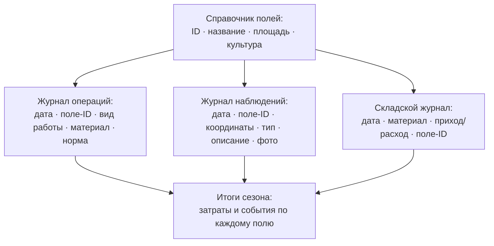

# Собираем журналы учёта в бесплатных инструментах: Google Sheets, QField, локальная база

> ⏱ **Трудозатраты:** ~18 мин чтения + ~25 мин практики
> Модуль **П1: Управление данными в агрохозяйстве**, урок 2 из 3.
> Профессиональный уровень (практики). Проект UNDP-KAZ FOLUR. Компоненты FOLUR: **1**, **2**.

## Цели урока и место в модуле

В [Уроке 1](01-atributy-zamera.md) мы решили, **что** записывать: обязательные атрибуты замера. Теперь строим то, **куда** записывать: структуру журналов и справочников, из которых складывается система учёта хозяйства, — и выбираем бесплатные инструменты, в которых эта структура заработает. Урок напрямую готовит [практикум](../practicum/01-shablon-sistemy-uchyota.md), где вы соберёте собственный шаблон.

После изучения урока слушатель сможет:

1. **[Bloom: знать]** перечислять базовые журналы системы учёта хозяйства (справочник полей, журнал операций, журнал наблюдений, складской журнал) и их ключевые колонки.
2. **[Bloom: применять]** проектировать журнал по правилам структурированной таблицы: одна строка — одно событие, словари вместо свободного текста, ссылки на справочник полей по ID.
3. **[Bloom: анализировать]** сравнивать три класса бесплатных инструментов хранения (онлайн-таблицы, полевые геоприложения, локальная база данных) и выбирать комбинацию под условия своего хозяйства — включая работу без интернета.

> **Границы урока.** Внутри: структура журналов, правила «чистой таблицы», обзор и выбор бесплатных инструментов (Google Sheets, QField, локальная БД), словари и проверка ввода. За рамками: обязательные атрибуты записи — это [Урок 1](01-atributy-zamera.md); резервное копирование и передача данных — [Урок 3](03-rezervnye-kopii-i-peredacha.md); полноценная работа с картами и оцифровка границ полей — модуль [П2](../../p2/index.md); автоматический спутниковый мониторинг полей — модуль [П3](../../p3/index.md).

---

## 1. Система учёта — это не одна таблица, а несколько связанных

Первый порыв — завести «одну большую таблицу про всё». Он же — главная ошибка: в такой таблице смешиваются события разных типов, колонки половине строк не нужны, а через сезон в ней невозможно ничего найти. Работающая система учёта устроена как набор **специализированных журналов**, связанных через общие справочники.

Минимальный комплект для растениеводческого хозяйства:

| Журнал | Что хранит | Одна строка — это… |
|---|---|---|
| **Справочник полей** | Постоянный список объектов: ID, название, площадь, культура сезона | …одно поле (объект) |
| **Журнал операций** | Посев, обработки, подкормки, уборка | …одна операция на одном поле |
| **Журнал наблюдений** | Всходы, сорняки, вредители, вымочки, состояние паров | …одно наблюдение в одной точке |
| **Складской журнал** | Приход/расход семян, СЗР, удобрений, ГСМ | …одно движение по складу |

Скелет системы — **справочник полей**. Каждому полю присваивается короткий постоянный идентификатор (P-01, P-02…), и все остальные журналы ссылаются на него, а не на словесные описания. «Поле у лесополосы за третьей бригадой» — это адрес для человека; P-07 — адрес для системы, который не изменится при смене бригадира и однозначно свяжет операцию, наблюдение и расход склада с одним и тем же участком.



*Рис. 1. Справочник полей — скелет системы учёта: все журналы ссылаются на ID поля, и только поэтому данные сезона можно свести воедино. Alt: схема — блок «Справочник полей» соединён стрелками с тремя журналами (операций, наблюдений, складским), каждый из которых содержит колонку «поле-ID»; все три журнала сходятся в блок «Итоги сезона по каждому полю».*

Обратите внимание на складской журнал: колонка «поле-ID» в строке расхода — то самое звено, которое обычно отсутствует. Бухгалтерия знает, сколько гербицида списано за сезон, но не знает, на какие поля он ушёл. Одна дополнительная колонка — и в конце сезона хозяйство впервые видит затраты в разрезе полей.

### 1.1 Правила «чистой таблицы»

Чтобы журнал оставался пригодным для сортировки, фильтров и будущего анализа, достаточно пяти правил:

1. **Одна строка — одно событие.** Не «обработали поля 3, 5 и 7» одной строкой, а три строки. Объединённая строка не фильтруется и не суммируется.
2. **Одна колонка — одна величина.** Не «22% (после дождя)» в одной ячейке, а колонка значения и колонка условий. Число, склеенное с текстом, перестаёт быть числом.
3. **Шапка — одна строка, без объединённых ячеек.** Красивые многоэтажные шапки ломают сортировку и выгрузку; оформление — дело отчёта, а не журнала.
4. **Словари вместо свободного текста.** Для повторяющихся значений (вид работы, культура, условия) — фиксированный список: «культивация», а не вперемешку «культ.», «культивир.» и «Культивация» — для фильтра это три разных значения.
5. **Никаких «понятно из контекста».** Даты — в каждом ряду (не «12 сентября» один раз на десять строк), единицы — в шапке колонки: «Норма, л/га».

Эти правила переводят тетрадь в форму, которую поймёт и таблица, и картографическая программа, и — позже — сервисы спутникового мониторинга.

---

## 2. Три класса бесплатных инструментов

Инструментов сотни, но для хозяйства без штатного программиста реальный выбор сводится к трём классам. Разберём каждый честно — с сильными сторонами и ограничениями.

### 2.1 Онлайн-таблицы: Google Sheets и аналоги

**Google Таблицы** (sheets.google.com) — бесплатные электронные таблицы в браузере и мобильном приложении. Для системы учёта у них есть четыре решающих свойства:

- **Совместная работа:** агроном, кладовщик и руководитель пишут в один документ одновременно, у каждой правки виден автор и время.
- **Проверка данных:** колонке можно назначить выпадающий список из словаря (Данные → Проверка данных) — правило 4 из §1.1 выполняется автоматически, ошибочный ввод подсвечивается.
- **История версий:** документ хранит прошлые состояния, случайно испорченный журнал можно откатить (это не отменяет резервных копий — почему, объяснит [Урок 3](03-rezervnye-kopii-i-peredacha.md)).
- **Формы ввода:** к таблице подключается простая форма (Google Forms) — работник в поле заполняет пять полей на телефоне, ответ ложится строкой в журнал.

Ограничения тоже важны. Онлайн-таблице нужен интернет: офлайн-режим у мобильного приложения есть, но его надо заранее включить для конкретого документа, и работает он ограниченно. Координаты вводятся руками — таблица сама не снимет точку с GPS. И главное: аккаунт — единая точка доступа; потеря пароля или блокировка означает потерю всего, если нет внешних копий. Свободная альтернатива того же класса — LibreOffice Calc (libreoffice.org): полностью офлайн и бесплатно, но без совместного онлайн-редактирования.

### 2.2 Полевое геоприложение: QField

**QField** (qfield.org, документация docs.qfield.org) — бесплатное открытое мобильное приложение, полевой напарник настольной ГИС QGIS ([П2](../../p2/index.md) посвящён ей целиком). Идея: на компьютере в QGIS готовится проект — границы полей, слой наблюдений с нужными колонками и словарями, — проект переносится в телефон, и в поле работник просто ставит точку: **координаты и время записываются автоматически с GPS**, остальные атрибуты выбираются из выпадающих списков, фото прикрепляется к точке.

Это закрывает ровно те атрибуты, которые в Уроке 1 названы невосстановимыми: позиция и время фиксируются без участия человека, ошибиться в них нельзя. Работает полностью офлайн — карта-подложка загружается заранее; для степной зоны с неровным покрытием сотовой связи это решающее свойство. Ограничения: нужна разовая настройка проекта в QGIS (навык модуля П2 — либо готовый проект из [практикума](../practicum/01-shablon-sistemy-uchyota.md)), и QField — журнал *наблюдений и объектов*, а не складской учёт: движения по складу в нём вести неудобно.

Того же класса инструменты — Mergin Maps (открытый, с облачной синхронизацией в бесплатном тарифе с ограничениями) и ODK/KoboToolbox (полевые анкеты, сильны в опросах). Все они бесплатны в базовом использовании; принцип выбора один — открытый формат данных на выходе.

### 2.3 Локальная база данных: GeoPackage / SQLite

Третий класс — **локальная база данных**: один файл на компьютере хозяйства, внутри которого живут все таблицы сразу. Практический стандарт — формат **GeoPackage** (файл `.gpkg` на основе встраиваемой базы SQLite): его создаёт и редактирует бесплатная QGIS, он хранит и таблицы, и геометрию (границы полей, точки наблюдений), его же читает QField. Никакого сервера и абонентской платы — просто файл, который можно копировать как любой документ.

Сильные стороны: всё в одном месте, работает без интернета, открытый формат переживёт любую программу, связи «журнал → справочник полей» поддерживаются честно. Слабые: нет одновременной работы нескольких людей и нужна минимальная ГИС-грамотность (уровень [П2](../../p2/index.md)). Для хозяйства, где данные ведёт один человек, это самый надёжный вариант «мастер-копии».

### 2.4 Сравнение и выбор

| Критерий | Google Sheets | QField (+QGIS) | GeoPackage/SQLite |
|---|---|---|---|
| Цена | бесплатно | бесплатно, открытый код | бесплатно, открытый код |
| Работа без интернета | ограниченно | полноценно | полноценно |
| Автозапись координат и времени | нет | **да, с GPS** | через QGIS/QField |
| Совместная работа | **да, лучшая** | через синхронизацию | нет |
| Складской учёт | **удобно** | неудобно | возможно |
| Порог входа | минимальный | нужна настройка проекта | нужны основы ГИС |
| Риск потери доступа | аккаунт — единая точка | файлы у вас | файлы у вас |

Главный вывод: классы **не конкурируют, а дополняют друг друга**. Рабочая связка для типичного хозяйства Северного Казахстана выглядит так: справочник полей и границы — в GeoPackage (мастер-копия); полевые наблюдения — в QField с автоматическими координатами; журнал операций и склад — в Google Sheets, где удобно работать нескольким людям; раз в неделю всё сводится и копируется по правилам [Урока 3](03-rezervnye-kopii-i-peredacha.md). Именно эту связку вы соберёте в практикуме.

А что с платными агроплатформами — «личными кабинетами поля», которые предлагают вести учёт у них? Мы рассматриваем их только в сравнительном ключе (подробный разбор — в модуле [П3](../../p3/index.md)) и с одним жёстким требованием: платформа обязана уметь **выгружать ваши данные в открытом формате** (CSV, GeoPackage). Данные хозяйства — актив хозяйства; сервис, из которого их нельзя забрать, превращает ваш актив в свой.

---

## 3. Проектируем журнал: от карточки замера к колонкам

Сборка журнала из карточки замера ([Урок 1, §4](01-atributy-zamera.md)) — механическая работа: каждый обязательный атрибут становится колонкой, у повторяющихся значений появляется словарь. Пример — журнал полевых наблюдений:

| Колонка | Тип | Словарь/формат | Обязательна |
|---|---|---|---|
| Дата | дата | ГГГГ-ММ-ДД | да |
| Поле | из справочника | P-01…P-NN | да |
| Широта, Долгота | число | десятичные градусы (авто в QField) | да |
| Тип наблюдения | словарь | всходы / сорняки / вредители / вымочка / солонец / прочее | да |
| Оценка | словарь | норма / слабо / критично | да |
| Условия | словарь | сухо / после осадков / роса | да |
| Комментарий | текст | свободный | нет |
| Фото | файл/ссылка | геометка включена | нет |
| Автор | словарь | инициалы сотрудников | да |

Заметьте: свободный текст остался только в необязательном комментарии. Всё, по чему вы захотите фильтровать и считать, — словари и числа. Такой журнал заполняется в поле за 20–30 секунд, а в конце сезона отвечает на вопросы «сколько раз за сезон фиксировали сорняки на P-07» одним фильтром.

По той же схеме строятся журнал операций (дата, поле, вид работы из словаря, материал из склада, норма с единицей, исполнитель) и складской журнал (дата, материал, приход/расход, количество, единица, поле-ID для расхода, документ-основание). Готовые шаблоны всех четырёх журналов — в [практикуме](../practicum/01-shablon-sistemy-uchyota.md); там же чек-лист полноты, по которому вы проверите и собственные, и сгенерированные ИИ структуры ([ИИ-задание модуля](../ai-assistant.md)).

### 3.1 Словари: короткие, закрытые, с выходом «прочее»

Три практических правила проектирования словарей. **Коротко:** словарь из тридцати позиций не работает — в поле никто не будет листать список; 5–9 значений покрывают подавляющее большинство случаев. **Закрыто:** словарь редактирует один ответственный человек, а не каждый пользователь, — иначе через месяц в нём снова три варианта «культивации». **С выходом:** последним значением всегда идёт «прочее» с обязательным комментарием — жизнь богаче словаря, и лучше десять честных «прочее», чем наблюдение, втиснутое в неподходящую категорию. Раз в сезон просмотрите записи «прочее»: если какая-то формулировка повторяется, она заслужила место в словаре.

### 3.2 Внедрение: пилотный месяц вместо революции

Система учёта проваливается не на проектировании, а на внедрении — когда людям в разгар сезона объявляют «теперь пишем всё и по-новому». Рабочая стратегия противоположна: **один журнал, одно поле-пилот, один месяц**. Выберите журнал с самой очевидной пользой (обычно — наблюдения или операции), заполните справочник полей, покажите каждому участнику ровно его действия — и месяц собирайте данные, ничего не расширяя.

В конце месяца сделайте то, ради чего всё затевалось: покажите команде результат. Карту точек наблюдений поверх снимка, фильтр «все обработки P-07 за месяц», сумму расхода по полям. Момент, когда механизатор видит *свои* точки на карте, убеждает лучше любого приказа. После пилота добавляйте журналы по одному; попытка запустить всё сразу почти гарантированно оставит вам четыре полупустые таблицы. И зафиксируйте письменно (одна страница) итог: какие журналы ведём, кто пишет, где мастер-копия — этот документ станет частью вашего прикладного продукта в практикуме.

---

## Региональный кейс

**Ситуация.** Хозяйство в Есильском районе Северо-Казахстанской области выращивает яровую пшеницу — основную культуру региона и сквозной кейс проекта FOLUR. Учёт устроен так: агроном ведёт тетрадь операций, кладовщик — свою тетрадь склада, механизаторы наблюдения не записывают вовсе («позвоню агроному»). Сотовая связь устойчива на усадьбе и вдоль трассы, на дальних полях — неустойчива. Руководитель готов потратить на систему учёта ноль тенге и один вечер настройки.

**Данные.** Границы полей хозяйство может оцифровать по открытым данным: подложка OpenStreetMap (openstreetmap.org) и снимки Sentinel-2 (браузер Copernicus, dataspace.copernicus.eu), где границы посевов хорошо читаются; словари операций — из собственной тетради агронома за прошлый сезон.

**Задача.**

1. Подберите каждому журналу инструмент из таблицы §2.4 с учётом связи на дальних полях и бюджета «ноль тенге».
2. Тетрадь агронома содержит записи вида «15 мая — сеяли за балкой и у дороги, норма обычная». Перечислите, какие правила «чистой таблицы» (§1.1) нарушены и как выглядит та же запись в правильном журнале.
3. Что в этой системе станет мастер-копией и почему это важно решить заранее?

**Разбор.** Наблюдения на дальних полях — QField: офлайн-работа и автозапись координат снимают и проблему связи, и проблему «позвоню агроному». Журнал операций и склад — Google Sheets: оба ведутся людьми на усадьбе, где связь есть, и выигрывают от совместного доступа. Справочник полей с границами — GeoPackage, созданный за вечер по подложке OSM/Sentinel-2. Запись «сеяли за балкой и у дороги» нарушает минимум три правила: два события в одной строке, объект указан словесным описанием вместо ID, «норма обычная» — не число с единицей. Правильно: две строки, каждая с датой 2026-05-15, полем-ID из справочника, видом работы «посев» из словаря и нормой в кг/га. Мастер-копией разумно назначить GeoPackage со справочником и еженедельные выгрузки остальных журналов — где они хранятся и как копируются, разберёт следующий урок.

---

## Закрепление и применение

!!! tip "Что это даёт вашему хозяйству"
    Связка «GeoPackage + QField + онлайн-таблица» стоит ноль тенге и заменяет заметную часть функций платных агроплатформ: журнал с координатами, историю операций по полям, затраты в разрезе полей. А когда вы дорастёте до спутникового мониторинга ([П3](../../p3/index.md)), у вас уже будут границы полей и наземные записи — то, с чего платные сервисы обычно и начинают настройку.

!!! example "Попробуйте в Colab"
    Необязательное упражнение для любопытных: ноутбук `<URL будет назначен при создании репозитория ноутбуков>` за пять ячеек проверяет выгрузку вашего журнала (CSV) на нарушения правил «чистой таблицы» — смешанные словари, пустые обязательные колонки, нечисловые значения в числовых полях. Запускается в браузере, установка не нужна; выполнение задания модуля без него полностью возможно.

!!! warning "Границы применимости"
    Бесплатность инструмента не отменяет ответственности за данные: у Google-аккаунта должна быть привязана резервная почта и включено восстановление, а офлайн-инструменты (QField, GeoPackage) защищены ровно настолько, насколько защищён телефон и компьютер, где лежат файлы. Ни один инструмент из урока не является системой бухгалтерского учёта — складской журнал дополняет бухгалтерию, а не заменяет её.

!!! question "Кейс для размышления"
    В хозяйстве два агронома: один в восторге от идеи и готов осваивать QField, второй говорит «я двадцать лет пишу в тетрадь и не брошу». Навязывать инструмент — потерять человека; оставить как есть — потерять данные. Какие промежуточные решения возможны? Подумайте про бумажный бланк, повторяющий колонки журнала, фото страниц тетради с геометкой и еженедельный перенос в таблицу силами третьего сотрудника — и про то, какие атрибуты при каждом варианте всё-таки теряются.

---

### Проверь себя

```quiz
[
  {
    "q": "Почему справочник полей с постоянными ID называют скелетом системы учёта?",
    "options": ["Все журналы ссылаются на ID поля, и только через них данные операций, наблюдений и склада сводятся по одному участку", "Потому что он самый большой по числу строк", "Потому что без него нельзя открыть QGIS", "Потому что ID полей требует земельная инспекция"],
    "answer": 0,
    "explain": "§1: словесные описания («поле у лесополосы») неоднозначны и меняются; постоянный ID однозначно связывает записи всех журналов с одним объектом."
  },
  {
    "q": "В журнале операций встречаются значения «культ.», «культивир.» и «Культивация». Какое правило нарушено и чем это грозит?",
    "options": ["Правило словарей: для фильтра это три разных значения, посчитать все культивации одним действием не выйдет", "Правило одной строки: события объединены", "Ничего не нарушено — человеку всё понятно", "Нарушен формат дат ГГГГ-ММ-ДД"],
    "answer": 0,
    "explain": "§1.1, правило 4: повторяющиеся значения вводятся из фиксированного словаря (выпадающего списка), иначе сортировка и подсчёт ломаются."
  },
  {
    "q": "Наблюдения нужно вести на дальних полях, где сотовая связь неустойчива, а координаты должны записываться без ручного ввода. Какой инструмент подходит лучше всего?",
    "options": ["QField: работает полностью офлайн и пишет координаты и время автоматически с GPS", "Google Sheets: у него есть мобильное приложение", "Google Forms: форма быстрее таблицы", "Бумажный бланк с последующим набором в таблицу"],
    "answer": 0,
    "explain": "§2.2 и §2.4: автозапись невосстановимых атрибутов (позиция, время) плюс полноценный офлайн — сочетание, которого нет у онлайн-таблиц; бумага и ручной набор оставляют координаты на совести человека."
  },
  {
    "q": "Какое обязательное требование модуль предъявляет к платной агроплатформе, прежде чем доверять ей учёт?",
    "options": ["Возможность выгрузить свои данные в открытом формате (CSV, GeoPackage)", "Наличие мобильного приложения", "Русскоязычная техподдержка", "Интеграция с бухгалтерией"],
    "answer": 0,
    "explain": "§2.4: данные хозяйства — актив хозяйства; сервис без выгрузки в открытый формат делает ваш актив своим. Остальное — удобства, а не условия."
  },
  {
    "q": "Зачем в строке расхода складского журнала колонка «поле-ID»?",
    "options": ["Чтобы в конце сезона увидеть затраты материалов в разрезе полей, а не только общий расход", "Чтобы кладовщик не забывал название поля", "Это требование налогового учёта", "Колонка не нужна: расход и так виден в бухгалтерии"],
    "answer": 0,
    "explain": "§1: бухгалтерия знает общий расход за сезон, но не распределение по полям; одна колонка со ссылкой на справочник полей связывает склад с агрономией."
  }
]
```

---

## Что дальше?

Журналы спроектированы — теперь их нужно защитить от потери и научиться правильно отдавать: [Урок 3 «Сохраняем и передаём данные: резервные копии и правила передачи партнёрам»](03-rezervnye-kopii-i-peredacha.md) закрывает модуль. Затем — [практикум](../practicum/01-shablon-sistemy-uchyota.md), где вы соберёте шаблон системы учёта на реальных открытых данных, и [ИИ-задание](../ai-assistant.md), где чат-ассистент поможет адаптировать журналы под ваше хозяйство, а вы проверите его работу по чек-листу. Оцифровку границ полей во всех деталях разбирает модуль [П2](../../p2/index.md).
