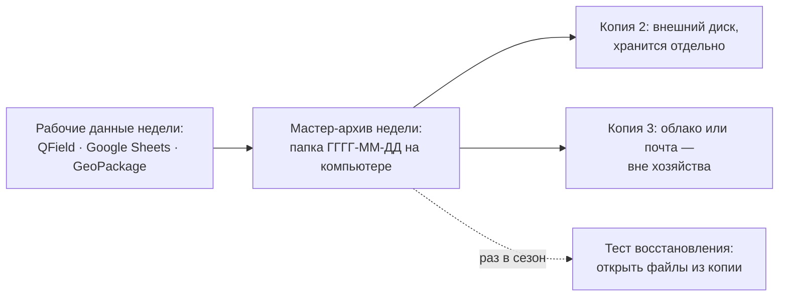

# Сохраняем и передаём данные: резервные копии по правилу 3-2-1 и передача партнёрам

> ⏱ **Трудозатраты:** ~17 мин чтения + ~20 мин практики
> Модуль **П1: Управление данными в агрохозяйстве**, урок 3 из 3.
> Профессиональный уровень (практики). Проект UNDP-KAZ FOLUR. Компоненты FOLUR: **1**, **2**.

## Цели урока и место в модуле

Данные, которые вы начали дисциплинированно собирать ([Урок 1](01-atributy-zamera.md)) и структурированно хранить ([Урок 2](02-zhurnaly-i-instrumenty.md)), теперь нужно защитить от двух противоположных угроз. Первая — **потеря**: сгоревший компьютер, украденный телефон, заблокированный аккаунт. Вторая — **неконтролируемая передача**: данные хозяйства уходят подрядчику, платформе или партнёру без понимания, кто и как ими будет распоряжаться. Этот урок закрывает модуль правилами резервного копирования и передачи.

После изучения урока слушатель сможет:

1. **[Bloom: понимать]** объяснять правило резервного копирования 3-2-1 и почему история версий онлайн-таблицы не заменяет резервную копию.
2. **[Bloom: применять]** настраивать для своего хозяйства простой цикл копирования: что, куда, как часто, кто отвечает, как проверяется восстановимость.
3. **[Bloom: анализировать]** оценивать запрос на передачу данных (подрядчик, кооператив, платформа, госорган) по чек-листу: что передаём, в каком виде, на каких условиях, что фиксируем письменно.

> **Границы урока.** Внутри: риски потери, правило 3-2-1, именование и версии файлов, паспорт данных, чек-лист передачи партнёрам, правовые ориентиры в качественной форме. За рамками: структура самих журналов — [Урок 2](02-zhurnaly-i-instrumenty.md); юридические консультации по конкретным сделкам с данными — вне компетенции модуля (ориентиры даём, заключения — нет); стандарты FAIR и научный обмен данными — модуль [А1](../../a1/index.md).

---

## 1. Как хозяйства теряют данные: три категории риска

Потери данных редко выглядят драматично. Чаще это тихие события, которые замечают через месяцы:

- **Техника.** Телефон с QField утонул при переправе; жёсткий диск конторского компьютера умер в июле; флешка с картами урожайности перестала читаться. Носители смертны — все и всегда.
- **Человек.** Сотрудник, «у которого всё было», уволился; пароль от аккаунта знал один человек; файл перезаписали неудачной правкой и заметили через полгода. Единственный носитель знания — тот же единственный носитель, только живой.
- **Организация.** Аккаунт онлайн-сервиса заблокирован или взломан; платная платформа закрылась или подняла цены, а выгрузку данных никто не сделал заранее; подрядчик, хранивший архив съёмок, прекратил работу.

Общая черта всех сценариев: в момент события копия либо есть, либо её уже никогда не будет. Заметьте также, что вероятность каждого из событий за горизонт в несколько лет отнюдь не мала — вопрос не «случится ли», а «что уцелеет, когда случится». Резервное копирование — единственная мера, работающая против всех трёх категорий сразу. И наоборот, ни один инструмент из Урока 2 сам по себе не защищает: история версий Google Sheets спасает от неудачной правки, но не от блокировки аккаунта; файлы GeoPackage полностью ваши, но живут на одном смертном диске.

Оцените цену вопроса для своего хозяйства простым мысленным упражнением: если сегодня исчезнут все журналы, что вы не сможете восстановить? Историю обработок для ротации СЗР, привязку агрохимических точек, накопленные наблюдения по проблемным зонам — то есть именно то, что делает решения следующего сезона обоснованными. Данные — единственный актив хозяйства, который при потере не возмещается ни страховкой, ни деньгами: прошлый сезон нельзя измерить заново.

---

## 2. Правило 3-2-1 и цикл копирования хозяйства

Мировой стандарт житейской надёжности формулируется одной строкой — **правило 3-2-1**:

> Держите **3** копии данных, на **2** разных типах носителей, из них **1** — вне хозяйства.

Разберём на примере. Мастер-копия системы учёта — GeoPackage и выгрузки журналов на конторском компьютере (копия 1). Раз в неделю архив копируется на внешний диск или флешку, которая хранится не в том же ящике стола (копия 2, другой носитель). Тот же архив загружается в облачное хранилище или отправляется вложением на выделенную почту хозяйства (копия 3, вне хозяйства — переживёт пожар и кражу). Всё — бесплатно, вся процедура занимает десять минут в неделю.



*Рис. 1. Недельный цикл 3-2-1 для хозяйства. Alt: схема — рабочие данные недели сводятся в датированный мастер-архив на компьютере; от него две стрелки к внешнему диску и облаку; пунктирная стрелка ведёт к сезонному тесту восстановления, когда файлы из копии реально открывают и проверяют.*

Четыре уточнения, которые превращают правило в работающий регламент:

1. **Что копируем.** Не «всё подряд», а мастер-набор: справочник полей с границами (GeoPackage), выгрузки всех журналов в CSV, фотоархив наблюдений за период. Выгрузка из онлайн-инструментов обязательна: копия *внутри* сервиса (история версий) не считается — она исчезает вместе с доступом к аккаунту.
2. **Как часто.** В сезон полевых работ — еженедельно; зимой — ежемесячно. Ориентир: сколько дней записей вы готовы потерять безвозвратно — таков и интервал.
3. **Кто отвечает.** Копирование без ответственного не выполняется никем. Одна фамилия, одна строка в обязанностях, отметка о выполнении — в том же журнале.
4. **Тест восстановления.** Копия, которую ни разу не открывали, — это надежда, а не копия. Раз в сезон откройте файлы именно из резервной копии на другом компьютере: читаются ли CSV, открывается ли GeoPackage, на месте ли фото.

Куда класть «копию 3»? Подойдёт любое бесплатное облачное хранилище или даже выделенный почтовый ящик хозяйства, на который еженедельно отправляется архив вложением. Важны три условия. Первое: аккаунт принадлежит **хозяйству**, а не личной почте сотрудника, — иначе копия уходит вместе с ним (см. §2.2). Второе: пароль надёжен, включена двухфакторная защита и привязан резервный способ восстановления — внешняя копия, которую взломали, хуже, чем её отсутствие, потому что это ещё и утечка. Третье: доступ к аккаунту есть минимум у двух людей — руководителя и ответственного за копирование; «один человек — одна точка отказа» действует и здесь.

### 2.1 Имена файлов и версии

Половина «потерь» — на самом деле хаос имён: `журнал_итог_НОВЫЙ_2(правка).xlsx` невозможно отличить от соседних. Договоритесь о шаблоне: `ГГГГ-ММ-ДД_хозяйство_содержимое`, например `2026-09-12_p1-hoz_zhurnal-operaciy.csv`. Дата в начале имени сортирует файлы хронологически сама; слова «новый», «итог», «финал» запрещены — через месяц они лгут. Архивные папки недели называются датой копирования. Это бесплатная замена систем контроля версий, достаточная для хозяйства.

Ещё два правила той же природы. **Латиница и дефисы в именах файлов:** кириллица, пробелы и скобки в именах регулярно ломаются при переносе между системами, в архивах и облачных ссылках; `zhurnal-nablyudeniy` надёжнее, чем «Журнал наблюдений (весна)». **Сырые данные не редактируются:** выгрузка сезона, однажды положенная в архив, никогда не правится — все исправления делаются в рабочей копии. Архив — это показания свидетеля; свидетель, меняющий показания, не стоит ничего.

### 2.2 Смена сотрудника: передача данных внутри хозяйства

Самый недооценённый риск из категории «человек» — увольнение или уход в отпуск того, «у кого всё было». Защита — короткий регламент передачи дел, который стоит написать заранее, а не в последний день:

- **Доступы:** список аккаунтов и файлов, к которым сотрудник имел доступ; пароли меняются, доступ к общим документам переоформляется на преемника — в тот же день;
- **Носители:** рабочий телефон с QField-данными и флешки сдаются с проверкой, что несинхронизированные данные выгружены;
- **Знания:** полчаса с преемником над журналами: где что лежит, какие словари, какие незакрытые хвосты;
- **Проверка:** преемник самостоятельно открывает мастер-копию и последний архив — тот же тест восстановления, только для людей.

Если система построена по правилам модуля — журналы структурированы, мастер-копия известна, паспорта данных написаны, — передача дел занимает час. Если нет, хозяйство теряет не сотрудника, а сезоны данных.

---

## 3. Передача данных партнёрам: отдавать так, чтобы не жалеть

Данные хозяйства регулярно запрашивают: агроном-консультант, подрядчик обследования, кооператив, банк при рассмотрении кредита, агроплатформа при подключении, государственные органы. Передача — нормальная часть работы: без обмена данными нет ни консультаций, ни «зелёных» цепочек поставок, которые развивает FOLUR. Проблемы начинаются, когда передают *не то, не так и без следа*. Урок даёт три инструмента: паспорт данных, открытые форматы, чек-лист условий.

### 3.1 Паспорт данных: README на одну страницу

К любому передаваемому набору прикладывается короткий сопроводительный файл — **паспорт данных** (традиционное имя — README). Одна страница, пять разделов:

- **Что это:** «Журнал полевых наблюдений хозяйства N, сезон 2026, 214 записей»;
- **Структура:** список колонок с единицами («Норма, л/га»), словари значений;
- **Как собрано:** чем и как записывались координаты (смартфон, QField), период, авторы;
- **Известные ограничения:** пропуски за период уборки, точность бытового GPS;
- **Условия использования:** для чего передано, можно ли передавать третьим лицам.

Паспорт защищает обе стороны: получатель не гадает о смысле колонок, а вы фиксируете границы использования. Он же дисциплинирует: набор, к которому трудно написать паспорт, скорее всего, не готов к передаче. Образец паспорта вы заполните в [практикуме](../practicum/01-shablon-sistemy-uchyota.md); тот же принцип в научном мире называется метаданными — подробнее в модуле [А1](../../a1/index.md).

### 3.2 Форматы передачи: только открытые

Формат передачи решает, останутся ли данные данными. Открытый формат читается любой программой сегодня и через десять лет; закрытый или «печатный» — только конкретной программой конкретной версии, а иногда уже никем. Передавайте (и требуйте в ответ) открытые форматы: **CSV** для таблиц, **GeoPackage/GeoJSON** для границ и точек, PDF — только как *дополнение* для чтения человеком, а не как единственный вид данных. Таблица, отданная «в теле письма» или картинкой, для получателя мертва; отчёт подрядчика, принятый только в PDF без таблицы точек, — потерянные атрибуты (вспомните кейс [Урока 1](01-atributy-zamera.md)). Формулировка для договора с любым подрядчиком: «результаты передаются в машиночитаемом открытом формате с ведомостью координат».

### 3.3 Чек-лист передачи и правовые ориентиры

Перед любой передачей пройдите шесть вопросов:

1. **Что именно уходит?** Минимально необходимый набор, а не «вся папка». Консультанту по защите растений нужен журнал наблюдений и границы полей — но не складской журнал с затратами.
2. **Есть ли в наборе персональные данные?** Фамилии работников, телефоны, ИИН в колонках журналов — это персональные данные, их обработка регулируется Законом РК «О персональных данных и их защите» (№ 94-V от 21.05.2013). Практическое правило: перед передачей наружу заменяйте фамилии кодами — для агрономических задач личность автора записи не нужна.
3. **Есть ли чувствительная география?** Детальные пространственные данные имеют в РК правовой режим (Закон «О геодезии, картографии и пространственных данных» № 166-VII от 21.12.2022): открыто распространяется продукция открытого пользования. Для обычного журнала наблюдений хозяйства это не барьер, но массивы точных координат — особенно чужих территорий и объектов инфраструктуры — не публикуйте и не передавайте без проверки статуса. Наглядная модель — [политика датасетов нашей платформы](../../../datasets.md): открытая учебная версия батиметрии опубликована в локальной системе координат без привязки, обобщённые карты — открыто, а полный георектифицированный набор не публикуется до официального юридического подтверждения (и возможно его исключение из публикации вовсе).
4. **Коммерческая чувствительность?** Затраты, урожайность по полям, условия контрактов — сведения, дающие преимущество контрагенту на переговорах. Передавайте их только тогда, когда это цель передачи (банк, страховая), и фиксируйте условия.
5. **Что получатель вправе делать?** Одна строка в письме или договоре: «данные передаются для подготовки рекомендаций по сезону 2026, передача третьим лицам — по письменному согласию». Отсутствие условий — это условие «можно всё».
6. **Остался ли след?** Паспорт данных, дата, состав переданного, канал — строка в журнале передач. Через два года вы не вспомните, что и кому отдавали; журнал вспомнит.

Журнал передач из пункта 6 — это ещё одна простая таблица по правилам [Урока 2](02-zhurnaly-i-instrumenty.md): дата, получатель, состав переданного, формат, цель, условия, кто передал. Пять колонок, одна строка на передачу — и через два года у хозяйства есть ответ на вопрос «откуда у них наши данные», который без журнала не имеет ответа вовсе.

Особый случай — **агроплатформы и онлайн-сервисы**: подключаясь, вы передаёте данные непрерывно. Прочитайте условия: кому принадлежат загруженные данные, использует ли сервис их для своих продуктов, есть ли выгрузка в открытом формате при уходе. Требование выгрузки из [Урока 2](02-zhurnaly-i-instrumenty.md) — частный случай общего принципа: любая передача обратима лишь настолько, насколько вы сохранили собственную копию и право её использовать.

И обратная сторона той же медали — **данные, которые получаете вы**: отчёты подрядчиков, прогнозы сервисов, справочные слои. Применяйте зеркальный чек-лист: в каком формате пришло (PDF без таблицы — возвращайте на доработку), есть ли паспорт или хотя бы описание колонок, какова точность и дата актуальности, что вам разрешено с этим делать. Данные без происхождения не смешивайте с собственными журналами — храните отдельно с пометкой источника, иначе через сезон чужие непроверенные значения станут неотличимы от ваших замеров.

!!! warning "Это ориентиры, а не юридическое заключение"
    Урок даёт практические правила осторожности и называет действующие рамочные законы РК. Конкретные сделки с данными (эксклюзивные контракты, передача больших координатных массивов, споры) требуют консультации юриста — модуль сознательно не воспроизводит детальные нормы, чтобы не тиражировать устаревшие редакции: перед решением сверяйтесь с действующим текстом на adilet.zan.kz.

---

## Региональный кейс

**Ситуация.** Хозяйство в Буландынском районе Акмолинской области два сезона ведёт учёт по системе этого модуля: GeoPackage с границами, QField-наблюдения, журналы в онлайн-таблице. Осенью происходят два события сразу. Первое: конторский компьютер выходит из строя, и выясняется, что «резервной копией» считалась история версий онлайн-таблицы. Второе: районный кооператив, продвигающий продукцию с устойчивых практик (модель «зелёных» цепочек, которую развивает FOLUR в Северном Казахстане), просит у хозяйства «все данные за два сезона» для подтверждения практик перед покупателем.

**Данные.** Собственные журналы хозяйства за два сезона; границы полей, оцифрованные по OpenStreetMap и Sentinel-2 (dataspace.copernicus.eu); запрос кооператива в свободной форме («пришлите всё, что есть»).

**Задача.**

1. Что из данных хозяйства пережило поломку компьютера, а что потеряно? Постройте для хозяйства недельный цикл 3-2-1 (рис. 1), закрывающий эту дыру.
2. Ответьте на запрос кооператива по чек-листу §3.3: что передать, что исключить, что зафиксировать письменно.
3. Составьте оглавление паспорта данных для передаваемого набора.

**Разбор.** Пережили поломку: онлайн-журналы (они в облаке) и QField-данные на телефоне. Потерян GeoPackage с границами — мастер-копия жила на одном диске; историю версий онлайн-таблицы поломка не тронула, но она и не защищала от главного риска этой таблицы — потери доступа к аккаунту. Цикл 3-2-1: еженедельный датированный архив (GeoPackage + CSV-выгрузки + фото) на компьютере, копия на внешнем диске, копия в облаке на отдельном аккаунте хозяйства; ответственный назначен; сезонный тест восстановления. По запросу кооператива: «всё, что есть» не передаётся — передаются журнал операций и наблюдений по полям, участвующим в поставке, и границы этих полей; исключаются складские затраты (коммерческая чувствительность) и фамилии работников (персональные данные — заменить кодами); письменно фиксируются цель («подтверждение практик сезона 2025–2026 перед покупателем») и запрет передачи третьим лицам без согласия. Паспорт: что это, структура колонок и словари, как собиралось (QField, смартфон), ограничения (точность бытового GPS, пропуски уборочной недели), условия использования.

---

## Закрепление и применение

!!! tip "Что это даёт вашему хозяйству"
    Час на настройку цикла 3-2-1 и шаблон паспорта данных — страховка актива, который вы собираете годами. Побочный эффект не менее ценен: хозяйство с журналами, границами и паспортами данных выглядит убедительно для банка, страховой и кооператива — вы можете *показать* свои практики, а не только рассказать о них. Это прямой вклад в доступ к «зелёным» цепочкам поставок.

!!! warning "Границы применимости"
    Правило 3-2-1 защищает от потери, но не от утечки: копия в облаке должна лежать в аккаунте с надёжным паролем и двухфакторной защитой. Чек-лист передачи — инструмент осторожности, а не юридическая экспертиза: для нестандартных сделок с данными привлекайте юриста. И ни одна резервная копия не спасёт данные, которые не были записаны с обязательными атрибутами, — дисциплина [Урока 1](01-atributy-zamera.md) первична.

!!! question "Кейс для размышления"
    Агроплатформа предлагает хозяйству бесплатный тариф в обмен на право «использовать обезличенные данные для улучшения сервисов». Что бы вы выяснили, прежде чем согласиться? Подумайте: что именно значит «обезличенные» для данных, у которых главная ценность — координаты полей; можно ли по границам и истории операций опознать хозяйство; есть ли в условиях выгрузка при уходе; и как выглядела бы та же сделка, если бы платили деньгами, а не данными.

---

### Проверь себя

```quiz
[
  {
    "q": "Хозяйство хранит журналы в онлайн-таблице и считает историю версий резервной копией. От какого риска эта «копия» НЕ защищает?",
    "options": ["От потери доступа к аккаунту: история версий живёт внутри сервиса и исчезает вместе с ним", "От случайной неудачной правки", "От перезаписи файла сотрудником", "От удаления отдельного листа"],
    "answer": 0,
    "explain": "§1–2: копия внутри сервиса не считается внешней; правило 3-2-1 требует выгрузку в независимое место, переживающую блокировку или взлом аккаунта."
  },
  {
    "q": "Что означает «1» в правиле 3-2-1?",
    "options": ["Одна копия хранится вне хозяйства — она переживёт пожар, кражу или изъятие техники", "Одна копия делается раз в год", "Один человек имеет доступ ко всем копиям", "Один тип носителя достаточен"],
    "answer": 0,
    "explain": "§2: три копии, два типа носителей, одна — вне хозяйства (облако, выделенная почта, диск в другом месте)."
  },
  {
    "q": "Зачем раз в сезон открывать файлы именно из резервной копии?",
    "options": ["Непроверенная копия — надежда, а не копия: тест подтверждает, что файлы читаются и восстановление реально работает", "Чтобы облако не удалило неиспользуемые файлы", "Чтобы обновить дату изменения файлов", "Это требование облачных сервисов"],
    "answer": 0,
    "explain": "§2, пункт 4: тест восстановления — обязательная часть цикла; повреждённый архив обнаруживается до катастрофы, а не во время неё."
  },
  {
    "q": "Кооператив просит «все данные за два сезона». Правильная реакция по чек-листу передачи:",
    "options": ["Передать минимально необходимый набор под цель, исключив персональные данные и коммерчески чувствительные сведения, и зафиксировать условия письменно", "Передать всё: кооператив — партнёр, скрывать нечего", "Отказать: данные хозяйства никогда не передаются", "Передать всё, но только в PDF, чтобы нельзя было редактировать"],
    "answer": 0,
    "explain": "§3.3: передача — нормальная практика, но состав определяется целью; фамилии работников — персональные данные (Закон РК № 94-V), затраты — коммерческая чувствительность; условия и след передачи фиксируются."
  },
  {
    "q": "Почему открытая учебная версия батиметрического датасета платформы опубликована без геопривязки, хотя обобщённая карта глубин — открыто?",
    "options": ["Детальные массивы точных координат имеют правовой режим: до официального подтверждения публикуется только обезличенный набор и обобщённые продукты", "Потому что координаты занимают слишком много места в файле", "Потому что эхолот записывал глубины без координат", "Это техническая ошибка публикации"],
    "answer": 0,
    "explain": "§3.3, пункт 3: модель трёх уровней доступа платформы — обезличенный учебный набор открыт, обобщённые карты открыты, полный георектифицированный набор не публикуется до юридического подтверждения (возможно и исключение)."
  }
]
```

---

## Что дальше?

Теория модуля закрыта: вы знаете, что записывать, куда и как защищать и передавать. Дальше — сборка прикладного продукта: в [практикуме](../practicum/01-shablon-sistemy-uchyota.md) вы создадите шаблон системы учёта своего хозяйства на реальных открытых данных, в [ИИ-задании](../ai-assistant.md) — ускорите адаптацию журналов с помощью чат-ассистента и проверите его работу по чек-листу, а [итоговая аттестация](../assessment/final.md) (порог 75%) завершит модуль. Продолжение линейки: карта хозяйства — [П2](../../p2/index.md), спутниковый мониторинг — [П3](../../p3/index.md), научная глубина — [А1](../../a1/index.md).
