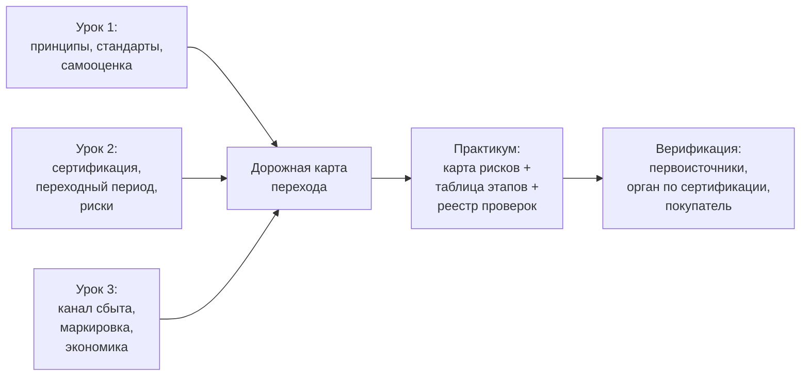

# Продаём органику: маркировка, каналы сбыта и сборка дорожной карты

> ⏱ **Трудозатраты:** ~14 мин чтения + ~20 мин практики
> Модуль **П10: «Зелёное» производство и органика**, урок 3 из 3.
> Профессиональный уровень (МСБ). Проект UNDP-KAZ FOLUR. Компоненты FOLUR: **2**, **4**.

## Цели урока и место в модуле

Сертификат сам по себе не приносит денег — приносит покупатель, который его признаёт и готов за него платить. Заключительный урок модуля отвечает на рыночную половину вопроса о переходе: где продаётся органика из Северного Казахстана, как устроены маркировка и трассируемость, из чего складывается экономика «зелёной» продукции и — итог всего модуля — как собрать принципы ([Урок 1](01-organika-bez-mifov.md)), процедуры ([Урок 2](02-put-sertifikacii.md)) и рынок в единую дорожную карту перехода. Саму карту вы построите в [практикуме](../practicum/01-dorozhnaya-karta-perekhoda.md).

После изучения урока слушатель сможет:

1. **[Bloom: знать]** перечислять основные каналы сбыта органической и «зелёной» продукции растениеводства и обязательные элементы органической маркировки.
2. **[Bloom: понимать]** объяснять, как трассируемость связывает поле с покупателем и почему экономика перехода считается по цепочке «затраты — риски — канал сбыта», а не по одной лишь ценовой надбавке.
3. **[Bloom: применять]** выбирать канал сбыта и целевой стандарт для конкретного хозяйства Костанайской, Северо-Казахстанской или Акмолинской области и собирать дорожную карту перехода по шаблону модуля.
4. **[Bloom: анализировать]** проверять маркетинговые и договорные «зелёные» обещания (надбавки, «гарантированный сбыт», признание сертификата) по документам и отбраковывать неподтверждённые.

> **Границы урока.** Внутри: каналы сбыта, маркировка и трассируемость, каркас экономики перехода, шаблон дорожной карты. За рамками: глубокая проработка экспортной логистики, стандартов устойчивости цепочек и маркетинговой стратегии — в [П15](../../p15/index.md); финансовые инструменты и заявки на поддержку — в [П14](../../p14/index.md); процедуры сертификации, на которые опирается маркировка, — в [Уроке 2](02-put-sertifikacii.md).

---

## 1. Куда продаётся органика Северного Казахстана: каналы сбыта

Для зернового и зернобобового хозяйства степной зоны реалистичны четыре канала — у каждого своя экономика и свои требования.

**Канал 1 — экспортный трейдер/переработчик органики.** Классический канал для органической пшеницы, льна, чечевицы и других культур: продажа партиями трейдеру, который консолидирует объёмы и вывозит на рынки с развитым органическим спросом. Требования: сертификат по стандарту, признаваемому целевым рынком (для ЕС — соответствие регламенту (ЕС) 2018/848 через признанный орган по сертификации), партионная трассируемость, стабильные объёмы и качество. Экономика: обычно наибольшая надбавка к цене, но и наибольшая зависимость от одного покупателя и от конъюнктуры; конкретные премии существуют только в вашем договоре — рыночные ориентиры смотрите в свежем ежегоднике FiBL/IFOAM и котировках, а не в лекциях и пересказах.

**Канал 2 — «зелёные» цепочки без органического сертификата.** Кооперационные программы с экспортёрами и ритейлом, где покупатель платит за документированные устойчивые практики: пример — платформа по «зелёной пшенице», поддерживаемая проектом FOLUR в Казахстане (кейсы — в каталоге FOLUR, см. [библиографию модуля](../index.md)). Требования мягче органических, вход быстрее; это рабочий канал и для хозяйств в переходном периоде, чья продукция ещё не может маркироваться как органическая.

**Канал 3 — внутренний рынок органики.** Продажа по национальной системе внутри страны: переработчикам, специализированной рознице, напрямую потребителю. Ёмкость и премии внутреннего рынка оценивайте по фактическим переговорам с покупателями — обобщённых надёжных цифр модуль не приводит.

**Канал 4 — переработка в хозяйстве.** Мука, крупа, масло из собственного органического сырья: выше маржа единицы продукции, но появляется сертификация переработки (отдельный объём требований) и собственно маркетинг продукта. Для первого этапа перехода это обычно не стартовый, а перспективный канал.

Для малых и средних хозяйств поверх любого из каналов работает **кооперация**: экспортёру нужны судовые и вагонные партии однородного качества, и одиночное хозяйство с небольшим объёмом органической чечевицы для него неудобный контрагент. Объединение нескольких сертифицированных хозяйств — общая партия, общий контроль качества, общие переговоры — превращает неудобные объёмы в товарные. Та же логика лежит в основе групповой сертификации из [Урока 2, §2.1](02-put-sertifikacii.md): группа, которая совместно проходит контроль, обычно готова и совместно продавать. Кооперационные механизмы «зелёных» цепочек — включая форвардные закупки и платформы взаимодействия с экспортёрами — на казахстанском материале документированы в каталоге кейсов FOLUR; это полезное чтение перед переговорами.

Правило выбора то же, что в [Уроке 1, §3](01-organika-bez-mifov.md): **канал определяет стандарт**. Дорожная карта начинается с ответа «кому продаём первый органический урожай», и лучший ответ — подтверждённый письменно: протокол о намерениях, форвардный контракт, договор с трейдером. Практика агроэкологических финансовых инструментов проекта FOLUR (например, форвардные закупки бобовых) показывает направление: чем раньше зафиксирован покупатель, тем ниже рыночный риск перехода.

## 2. Маркировка и трассируемость: продать доверие можно только с документами

Органическая маркировка — юридический акт, а не дизайн этикетки. Каркас общий для основных систем:

- маркировать продукцию как органическую можно только при действующем сертификате и только в отношении той продукции и тех партий, на которые он распространяется;
- на маркировке/в сопроводительных документах указывается орган по сертификации (в системах с логотипами — установленные коды и знаки; для ЕС — правила использования логотипа ЕС определены регламентом);
- продукция переходного периода органической не является, и её маркировка регулируется отдельно и строже;
- точные требования к надписям, знакам и документам берутся из действующей редакции стандарта целевого рынка и национального законодательства РК (adilet.zan.kz) — модуль намеренно не воспроизводит формулировки, которые обновляются.

За маркировкой стоит **трассируемость** — способность проследить каждую проданную партию назад до поля. Технически это цепочка записей, которую вы уже строите по [Уроку 2, §3](02-put-sertifikacii.md) и [П1](../../p1/index.md): поле → журнал операций → партия на току → складская ячейка → отгрузка → покупатель. Покупатель органики (особенно экспортный) проверяет эту цепочку так же, как инспектор: запросом документов по конкретной партии и балансом масс. Хозяйство, у которого трассируемость живёт в журналах, проходит такие запросы за час; хозяйство, у которого она «в голове у завтока», теряет контракт.

В торговле — особенно экспортной — трассируемость оформляется **сопроводительными сертификатами партий**: помимо сертификата хозяйства, конкретная отгружаемая партия сопровождается документом, подтверждающим её органический статус и путь, а импорт на регулируемые рынки проходит через официальные системы подтверждения (для ЕС — электронное подтверждение каждой ввозимой органической партии в установленном регламентом порядке). Практическое следствие для хозяйства: продажа органики — это документооборот на каждую партию, а не разовая демонстрация сертификата при знакомстве. Кто оформляет партионные документы (вы, трейдер, орган по сертификации), в какие сроки и за чей счёт — обязательный пункт договора с покупателем и строка реестра проверок вашей дорожной карты (§4).

Здесь же — про честность в маркетинге собственной продукции. Все «зелёные» заявления хозяйства о себе подчиняются правилу проверяемости из [Урока 1, §1.1](01-organika-bez-mifov.md): говорите то, что подтверждается документом (сертификат, отчёт инспекции, журналы), и не говорите остального. Это не только этика: необоснованные органические заявления в юрисдикциях с профильным законодательством влекут ответственность, а в отношениях с покупателем разрушают то единственное, за что он платит надбавку, — доверие.

> **Подробнее** — стандарты устойчивости цепочек поставок, экспортные процедуры и построение маркетинговой стратегии «зелёной» продукции разбирает модуль [П15](../../p15/index.md).

## 3. Экономика перехода: считаем цепочкой, а не одной надбавкой

Самая частая ошибка при решении о переходе — свести расчёт к одному числу («органика стоит на X% дороже»). Корректный расчёт — таблица из четырёх блоков, которую каждое хозяйство заполняет своими числами из своих документов:

**Блок 1 — изменение затрат.** Что дорожает: механический контроль сорняков (топливо, рабочее время), органический семенной материал, допущенные стандартом средства, сертификация и инспекции, документооборот. Что дешевеет: синтетические удобрения и пестициды уходят из сметы полностью. Что меняется структурно: севооборот с бобовыми и парами меняет соотношение культур и валовой сбор.

**Блок 2 — изменение выручки.** Урожайность в органике, как правило, ниже, чем в интенсивной технологии, — насколько именно, зависит от культуры, стартового плодородия и мастерства; честную вилку для своего хозяйства даёт только пробное поле и опыт соседей-органиков, а не среднемировые цифры. Цена — из договора с покупателем (канал, §1). Отдельно учтите переходный период: органические затраты при обычной цене.

О **пробном поле** стоит сказать отдельно — это самый дешёвый способ превратить блоки 1–2 из гаданий в измерения. Выберите одно типичное поле, ведите его сезон-два по органическим требованиям (без заявки на сертификацию — просто по правилам) и документируйте всё как для инспекции: операции, затраты машино-часов и топлива на механический контроль сорняков, урожайность против соседнего «обычного» поля-аналога. Получите три результата сразу: собственные числа для экономической таблицы, обкатку журналов ([Урок 2, §3](02-put-sertifikacii.md)) и трезвую оценку того, справляется ли ваша агротехника с сорняками без гербицидов. Если пробное поле проваливается — вы узнали это ценой одного поля и одного сезона, а не всего хозяйства и всего переходного периода.

**Блок 3 — риски и их цена.** Реестр рисков из [Урока 2, §5](02-put-sertifikacii.md) с ценой предупреждающих мер: буферные полосы (потеря площади), раздельное хранение (инвестиции в ток/склад), страховка от потери статуса партии.

**Блок 4 — источники финансирования.** Собственные средства, форвардные контракты покупателя, инструменты поддержки — их актуальный перечень и условия проверяются по официальным источникам в момент планирования; систематически это делает модуль [П14](../../p14/index.md).

Модуль сознательно не подставляет чисел ни в один блок: любая «средняя экономика органики» из лекции устареет и не совпадёт с вашей. Ценность таблицы — в дисциплине: решение о переходе принимается, когда все четыре блока заполнены документированными значениями, а не впечатлениями.

## 4. Сборка дорожной карты: шаблон модуля

Всё изученное складывается в один документ — **дорожную карту перехода**. Шаблон модуля состоит из трёх частей.

**Часть 1 — таблица этапов.** Каждая строка: этап → срок → действия → документы → контрольная точка → ответственный. Обязательные этапы:

1. Самооценка и решение (чек-лист [Урока 1, §4](01-organika-bez-mifov.md); траектория: органика / «зелёная» цепочка / подготовительный этап).
2. Выбор канала сбыта и целевого стандарта (§1; контрольная точка — письменное подтверждение интереса покупателя).
3. Выбор органа по сертификации ([Урок 2, §1](02-put-sertifikacii.md); контрольная точка — минимум два письменных предложения, проверка аккредитации по официальным реестрам).
4. Подготовка хозяйства: учёт ([П1](../../p1/index.md)), севооборот ([П9](../../p9/index.md)), буферные полосы и карта ([П5](../../p5/index.md)).
5. Заявка, договор, старт переходного периода (контрольная точка — зафиксированная органом дата).
6. Переходный период по полям: волны перехода, ежегодные инспекции, сбыт конверсионной продукции через канал 2.
7. Сертификат и первая органическая продажа (контрольная точка — сертификат + договор поставки).
8. Ежегодный цикл: инспекция → подтверждение → пересмотр карты.

**Часть 2 — карта-схема рисков.** Поля хозяйства поверх космоснимка с пометками: границы с интенсивной пашней (буферные полосы), дороги, общие объекты (ток, склад), маршруты техники. Строится в практикуме на открытых данных.

**Часть 3 — реестр проверок.** Список всех утверждений карты, требующих подтверждения первоисточником, с колонками «утверждение → где проверить → статус». Сюда попадает всё, что в модуле помечено «как правило»: длительность переходного периода, условия параллельного производства, требования маркировки, условия покупателя, меры поддержки. Дорожная карта считается готовой, когда в реестре не осталось строк со статусом «со слов».



*Рис. 1. Сборка прикладного продукта модуля: три урока сходятся в дорожную карту, практикум делает её документом, реестр проверок доводит до верифицированного состояния. Alt: блок-схема — результаты трёх уроков (принципы и самооценка; сертификация и риски; канал сбыта и экономика) сходятся в дорожную карту перехода, которая в практикуме превращается в карту рисков, таблицу этапов и реестр проверок и затем проходит верификацию по первоисточникам, органу по сертификации и покупателю.*

Дорожная карта — живой документ: её пересматривают после каждой инспекции, смены покупателя или редакции стандарта. Пометка в колонтитуле «проверено по первоисточникам [дата]» — такой же обязательный атрибут, как подпись руководителя.

И последнее — про адресатов. Дорожная карта пишется не «в стол» и не для проверяющих: это ваш рабочий документ минимум для трёх разговоров. С органом по сертификации — на предварительной консультации: карта с волнами перехода и реестром проверок показывает, что хозяйство понимает процесс, и позволяет сразу получить ответы на строки реестра. С покупателем — как доказательство серьёзности намерений при обсуждении форвардных условий: покупателю проще зафиксировать будущие объёмы за хозяйством, у которого путь расписан по контрольным точкам. С финансовым партнёром — как основа заявки на поддержку перехода (механика заявок — [П14](../../p14/index.md)). Один документ, три аудитории — ещё одна причина не держать в нём ни одной непроверенной цифры.

---

## Региональный кейс

**Ситуация.** Хозяйство в Северо-Казахстанской области: пшеница и чечевица, самооценка пройдена (траектория «а» — готовы к переходу), орган по сертификации предварительно выбран. Осталось рыночное решение. На столе три варианта: (1) устное обещание экспортного трейдера «возьмём органическую чечевицу с хорошей премией после сертификации»; (2) письменное предложение войти в программу «зелёной пшеницы» с документированными практиками уже в этом сезоне; (3) идея соседа «сертифицируемся, а покупатель найдётся».

**Данные.** Каталог кейсов FOLUR (кооперационная платформа «зелёной пшеницы» — см. [библиографию модуля](../index.md)); свежий ежегодник FiBL/IFOAM «The World of Organic Agriculture» — структура мирового органического рынка; письменное предложение программы «зелёной пшеницы»; журналы хозяйства для блока затрат (§3).

**Задача.**

1. Оцените три варианта по правилу «канал определяет стандарт» (§1) и правилу проверяемости ([Урок 1, §1.1](01-organika-bez-mifov.md)): что здесь документ, а что — слова?
2. Соберите для выбранной комбинации первые три строки таблицы этапов (§4, часть 1) с контрольными точками.
3. Какие строки обязаны попасть в реестр проверок до подписания чего-либо?

**Разбор.** Вариант 3 отбраковывается первым: сертификация без канала — это годы затрат ради продукта, покупатель которого неизвестен. Вариант 1 в текущем виде — не канал, а настроение: устное обещание не фиксирует ни объём, ни качество, ни цену, ни стандарт; его место — в реестре проверок со статусом «получить письменно». Рационная комбинация для этого хозяйства — параллельная: войти в программу «зелёной пшеницы» (вариант 2, письменное предложение — проверяемый документ) как канал на время переходного периода и одновременно довести вариант 1 до письменного протокола о намерениях по органической чечевице — тогда чечевица задаёт целевой стандарт сертификации. Первые строки таблицы этапов: «зафиксировать покупателя органической чечевицы письменно» (контрольная точка — подписанный протокол), «подтвердить признание выбранного органа по сертификации целевым рынком» (контрольная точка — запись в официальном реестре), «подписать участие в программе зелёной пшеницы» (контрольная точка — договор с перечнем требуемых практик и порядком подтверждения). В реестр проверок до подписания: условия премии и требования к качеству чечевицы (только из письменного договора), требования программы «зелёной пшеницы» к документированию практик, актуальные требования национального законодательства к статусу и маркировке продукции (adilet.zan.kz). Числа премий в разборе не названы сознательно: их источник — подписанные документы, и ровно это — главный навык урока.

---

## Закрепление и применение

!!! tip "Что это даёт вашему хозяйству"
    Дорожная карта с реестром проверок — это защита от двух самых дорогих сценариев: «сертифицировались, а продавать некому» и «пообещали премию, а в договоре её нет». Каждая строка реестра, закрытая до старта, — это риск, который вы сняли бесплатно; каждая строка «со слов» в подписанном плане — риск, за который вы заплатите.

!!! warning "Границы применимости"
    Урок даёт каркас каналов, маркировки и экономики, но не рыночные данные: премии, ёмкости рынков и условия программ меняются быстрее любого учебника. Актуальные цифры существуют только в свежем ежегоднике FiBL/IFOAM, котировках, официальных источниках и ваших подписанных договорах. Всё, что в вашей дорожной карте не подтверждено документом, обязано стоять в реестре проверок, а не в таблице этапов.

!!! example "Попробуйте прямо сейчас (10 минут)"
    Откройте OpenStreetMap и найдите свой район: где ближайшие элеваторы и станции погрузки? Прикиньте плечо доставки до каждого. Затем откройте письменное предложение любого покупателя, с которым вы работали (или типовой договор), и промаркируйте в нём три категории: подтверждённые обязательства, условия с оговорками, устные ожидания. Это упражнение — миниатюра реестра проверок.

!!! question "Кейс для размышления"
    Хозяйство прошло переходный период по чечевице, но в год получения сертификата экспортная премия на органическую чечевицу заметно снизилась, а программа «зелёной пшеницы» повысила требования. Дорожная карта устарела. Какие части карты (таблица этапов, карта рисков, реестр проверок) пересматриваются в первую очередь и почему «живой документ» из §4 — это управленческий механизм, а не метафора?

---

### Проверь себя

```quiz
[
  {
    "q": "Почему дорожная карта перехода начинается с выбора канала сбыта, а не с подачи заявки на сертификацию?",
    "options": ["Потому что заявку можно подать только после продажи первой партии", "Потому что каналы сбыта важны только для переработчиков", "Порядок не имеет значения", "Канал определяет целевой стандарт и признаваемый орган по сертификации; сертификация без покупателя — годы затрат ради продукта с неизвестным сбытом"],
    "answer": 3,
    "explain": "§1 и §4: правило «канал определяет стандарт»; контрольная точка этапа — письменное подтверждение интереса покупателя."
  },
  {
    "q": "Может ли продукция переходного периода маркироваться как органическая?",
    "options": ["Нет: она органической не является, её маркировка регулируется отдельно и строже; рабочий канал сбыта для неё — «зелёные» цепочки без органического сертификата", "Да, если хозяйство уверено в своих практиках", "Да, при устном согласии покупателя", "Да, начиная со второго года конверсии в любой системе"],
    "answer": 0,
    "explain": "§1 (канал 2) и §2: маркировка — юридический акт при действующем сертификате; конверсионная продукция продаётся по иным правилам."
  },
  {
    "q": "Что такое трассируемость партии в понимании покупателя органики?",
    "options": ["GPS-трекер на каждом комбайне", "Красивая история хозяйства на этикетке", "Документированная цепочка «поле → журнал операций → партия → склад → отгрузка → покупатель», проверяемая запросом документов и балансом масс", "Список сотрудников, участвовавших в уборке"],
    "answer": 2,
    "explain": "§2: покупатель проверяет цепочку записей так же, как инспектор; трассируемость «в голове у завтока» стоит контракта."
  },
  {
    "q": "Почему урок отказывается приводить «среднюю ценовую надбавку за органику»?",
    "options": ["Потому что надбавок не существует", "Премии зависят от культуры, рынка, года и договора: корректный источник — свежий ежегодник FiBL/IFOAM, котировки и подписанные документы, а не лекция", "Потому что надбавка везде одинакова и её незачем обсуждать", "Потому что эта информация секретна"],
    "answer": 1,
    "explain": "§3 и «Границы применимости»: любая «средняя экономика органики» из лекции устареет и не совпадёт с вашей; решение принимается по документированным значениям четырёх блоков."
  },
  {
    "q": "Когда дорожная карта перехода считается готовой по шаблону модуля?",
    "options": ["Когда заполнена таблица этапов, даже если часть данных — устные обещания", "Когда её одобрил ИИ-ассистент", "Когда она напечатана и подписана, независимо от содержания", "Когда в реестре проверок не осталось утверждений со статусом «со слов»: всё подтверждено первоисточниками, органом по сертификации или документами покупателя"],
    "answer": 3,
    "explain": "§4, часть 3: реестр проверок — механизм доведения карты до верифицированного состояния; «живой документ» пересматривается после инспекций и изменений рынка."
  }
]
```

---

## Что дальше?

Теория модуля собрана: принципы и самооценка ([Урок 1](01-organika-bez-mifov.md)), путь сертификации ([Урок 2](02-put-sertifikacii.md)), рынок и шаблон карты (этот урок). Теперь — руки: в [практикуме](../practicum/01-dorozhnaya-karta-perekhoda.md) вы построите дорожную карту перехода модельного хозяйства на открытых данных, а в [ИИ-задании](../ai-assistant.md) — проверите черновик карты, составленный ассистентом, по официальным стандартам. Завершает модуль [итоговая аттестация](../assessment/final.md) (порог 75%). Углубление рыночной темы — [П15](../../p15/index.md), финансирование перехода — [П14](../../p14/index.md).
