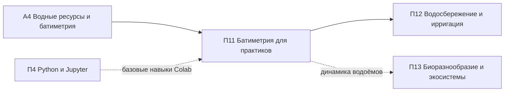

# П11. Батиметрия и мониторинг водных объектов

> **Тип:** Профессиональный, 24–40 ак. ч · **Связь:** [А4](../a4/index.md) · **Компоненты FOLUR:** 2, 3
> **Аудитория:** МСБ, специалисты водного хозяйства, инженеры хозяйств; уровень ИИ-слоя — **Low-code**.

Ключевой профессиональный модуль блока «Вода и экосистемы». Пруд, накопитель или малое водохранилище есть у многих хозяйств Северного Казахстана, но мало кто знает, сколько в нём на самом деле воды и как быстро он заиливается. Модуль даёт практику полный цикл: спланировать съёмку глубин бытовым эхолотом с GPS → обработать сырые промеры (фильтрация, выбросы) → построить карту глубин → посчитать объём и заиление → сопоставить с многолетними спутниковыми архивами → принять решения по водопользованию. Всё отрабатывается на **реальном датасете исполнителя** — сырых эхолотных промерах водохранилища степной зоны Казахстана, а не на синтетическом примере.

## Цели модуля

После прохождения модуля слушатель сможет:

1. **[Bloom: знать]** перечислять состав оборудования батиметрической съёмки малого водоёма (эхолот с записью лога, GNSS-приёмник, лот, рейка уровня), правила прокладки галсов и обязательные записи журнала съёмки.
2. **[Bloom: понимать]** объяснять происхождение дефектов сырых промеров (нули, выбросы, смещения) и смысл приведения глубин к единому уровню воды.
3. **[Bloom: применять]** обрабатывать сырые эхолотные промеры в готовом Colab-ноутбуке и QGIS: чистить данные с протоколом, строить карту глубин с изобатами и рассчитывать объём водоёма.
4. **[Bloom: применять]** строить кривую «уровень–площадь–объём» и использовать её для практических решений: планирования забора воды, полива, рыбоводства.
5. **[Bloom: анализировать]** оценивать заиление по разности повторных съёмок, сопоставлять состояние водоёма с открытыми спутниковыми архивами (Landsat, Sentinel-2, JRC GSW) и обосновывать решения по водопользованию.

## Уроки

| # | Урок | Трудозатраты ⏱ | Ключевой навык |
|---|---|---|---|
| 1 | [Планируем съёмку глубин своего водоёма: эхолот, GPS и галсы, которые не придётся переделывать](lectures/01-planiruem-semku-glubin.md) | ~16 мин чтения + ~25 мин практики | план съёмки + журнал, готовый к выходу на воду |
| 2 | [Превращаем лог эхолота в карту глубин: чистка и интерполяция без программиста](lectures/02-ot-promerov-k-karte-glubin.md) | ~17 мин чтения + ~35 мин практики | конвейер «сырой CSV → чистка → карта глубин» |
| 3 | [Считаем воду и принимаем решения: объём, заиление и спутниковые архивы](lectures/03-obyom-zailenie-resheniya.md) | ~16 мин чтения + ~30 мин практики | кривая объёма, оценка заиления, решения по водопользованию |
| П | [Практикум: карта глубин и объём водоёма своими руками](practicum/01-karta-glubin-svoimi-rukami.md) | ~75 мин | прикладной продукт модуля |
| ИИ | [ИИ-ассистент в работе: LLM пишет фильтрацию промеров — вы проверяете по опорным точкам](ai-assistant.md) | ~45 мин | постановка задачи ИИ → верификация результата |
| А | [Итоговая аттестация](assessment/final.md) | ~50 мин | банк MCQ + сценарный кейс, порог 75 % |

Нагрузка соответствует нормативу платформы (~2–2,5 ч контента в неделю); каждый микро-урок закрыт квизом сразу после материала.

## Прикладной продукт модуля

**Навык обработки собственных батиметрических съёмок**, подтверждённый артефактами практикума: очищенный датасет с протоколом фильтрации, карта глубин с изобатами, значение объёма и кривая «уровень–площадь–объём» — всё построено слушателем на реальном датасете исполнителя в Colab. Рамка «Проект на ВАШЕЙ земле»: тот же конвейер слушатель применяет к логу съёмки собственного пруда или водохранилища.

## Данные модуля

- **Уровень A** — учебный датасет `datasets/bathymetry-training-80k.csv`: 80 000 сырых эхолотных промеров водохранилища степной зоны Казахстана, колонки `point_id, x_m, y_m, depth_m`, глубины 0–16,1 м, координаты в локальной метрической системе (без геопривязки; название и расположение водоёма не раскрываются). Полный набор (539 955 точек): Zenodo, `<DOI будет присвоен при публикации на Zenodo>`.
- **Уровень B** — контрольная растровая сетка глубин 100 м: [`bathymetry-grid-100m.tif`](../a4/data/bathymetry-grid-100m.tif).
- Полный георектифицированный набор (уровень C) — дополнительный материал, доступный только после юридического подтверждения; возможно его полное исключение — все задания модуля работают на уровнях A/B.
- Спутниковые архивы: Sentinel-2, Landsat, JRC Global Surface Water (обзорно, лекция 3).

Политика доступа и правовое обоснование: [Датасеты платформы](../../datasets.md).

## ИИ-ассистент в работе · уровень Low-code

LLM-ассистент в Google Colab пишет код фильтрации промеров по вашей постановке задачи; вы проводите ревью и **контролируете результат по опорным точкам датасета** и контрольной сетке уровня B. Подробности — в [ИИ-задании](ai-assistant.md); рамка ИИ-слоя платформы — [здесь](../../ai-tools.md).

*Правило: ИИ ускоряет — человек верифицирует. Задание выполнимо и без ИИ.*

## Место в архитектуре платформы

*Рис. 1. Связи модуля П11. Alt: П11 опирается на академический модуль А4 и навыки Colab из П4, передаёт результаты в П12 (водосбережение) и связан с П13 (экосистемы).*

Пререквизиты: умение открыть ноутбук в Google Colab (даёт [П4](../p4/index.md), лекция 1; достаточно 20 минут знакомства). Академическая глубина темы — в [А4](../a4/index.md). Продолжение: [П12 «Водосбережение и ирригация»](../p12/index.md).

## Оценивание

Тренировочные квизы (3–5 MCQ) — после каждой лекции. Итог: индивидуальный вариант из [банка модуля](assessment/final.md) (порог **75 %**) + сценарный кейс с экспертной проверкой + обязательные артефакты практикума.

## Библиография и рамки

Проверенные международные рамки и первичные источники (DOI не указываются там, где не верифицированы):

1. **FAO.** The 10 Elements of Agroecology: Guiding the transition to sustainable food and agricultural systems. FAO, Rome — вода как элемент устойчивого агроландшафта.
2. **WOCAT** (World Overview of Conservation Approaches and Technologies) — глобальная база практик устойчивого землепользования, включая водосбережение и противоэрозионные меры на водосборе.
3. **ЦУР 15.3 / LDN** (Land Degradation Neutrality, UNCCD) и **индикатор ЦУР 6.6.1** (изменение площади связанных с водой экосистем) — целевые рамки, на которые работает мониторинг водоёмов.
4. **Каталог кейсов FOLUR Impact Program** (GEF) — контекст интегрированного управления ландшафтами и водными ресурсами.
5. McFeeters, S. K. (1996). The use of the Normalized Difference Water Index (NDWI) in the delineation of open water features. *International Journal of Remote Sensing*, 17(7) — водный индекс, используемый в обзоре спутниковых архивов.
6. Pekel, J.-F., Cottam, A., Gorelick, N., Belward, A. S. (2016). High-resolution mapping of global surface water and its long-term changes. *Nature*, 540 — основа продукта JRC Global Surface Water.
7. Документация Copernicus (Sentinel-1/2) и USGS Landsat — официальные описания используемых спутниковых данных.
8. Закон РК «О геодезии, картографии и пространственных данных» № 166-VII от 21.12.2022 — правовой режим пространственных данных, определяющий трёхуровневую политику батиметрического датасета платформы.

Правовой режим батиметрических данных: [политика датасетов платформы](../../datasets.md); канонический каркас модуля: [шаблон](../../about/module-template.md).
