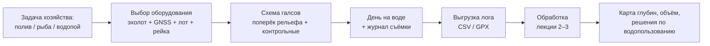

# Планируем съёмку глубин своего водоёма: эхолот, GPS и галсы, которые не придётся переделывать

> ⏱ **Трудозатраты:** ~16 мин чтения + ~25 мин практики
>
> Модуль **П11: Батиметрия и мониторинг водных объектов**, лекция 1 из 3.
> Профессиональный уровень. Проект UNDP-KAZ, FOLUR. Компоненты FOLUR: **2**, **3**.

## Цели лекции и место в модуле

Карта глубин начинается не с компьютера, а с лодки — и большинство неудачных карт испорчены ещё на воде: редкими галсами, забытым журналом уровня, неучтённой осадкой датчика. Эта лекция экономит вам самую дорогую ошибку практика: съёмку, которую приходится переделывать. Мы разберём, какое оборудование реально нужно малому хозяйству, как проложить галсы, чтобы промеры покрыли водоём без «слепых зон», и какие записи в журнале превращают набор точек в данные, которым можно доверять годы спустя.

После изучения лекции слушатель сможет:

1. **[Bloom: знать]** перечислять минимальный комплект оборудования съёмки малого водоёма и обязательные поля журнала съёмки.
2. **[Bloom: понимать]** объяснять, как эхолот измеряет глубину, откуда берутся его ошибки и почему уровень воды нужно фиксировать каждый день работ.
3. **[Bloom: применять]** составлять схему галсов под конкретный водоём: направление, межгалсовое расстояние, контрольные пересечения, обход мелководий.
4. **[Bloom: анализировать]** оценивать по чужому плану съёмки, какие продукты из неё получатся, а какие — нет, и где план надо усилить.

> **Границы лекции.** Внутри: оборудование, планирование галсов, журнал съёмки, выгрузка лога, правовой режим данных. Снаружи: чистка сырых промеров и построение карты — в [лекции 2](02-ot-promerov-k-karte-glubin.md); объём, заиление и решения — в [лекции 3](03-obyom-zailenie-resheniya.md). Физика эхолокации, многолучевые системы, ADCP и БПЛА-батиметрия системно разобраны в академическом модуле [А4](../../a4/index.md) (лекция 2) — здесь мы берём из этой теории только то, что нужно практику с бытовым прибором. Планирование полётов БПЛА для съёмки береговой зоны — в [П7](../../p7/index.md).

---

## 1. Зачем хозяйству собственная батиметрия

### 1.1 Три вопроса, на которые отвечает карта глубин

Владелец пруда или арендатор малого водохранилища рано или поздно сталкивается с тремя вопросами. **Сколько у меня воды?** Проектные данные, если они вообще сохранились, описывают чашу десятилетия назад; фактическая ёмкость меньше из-за заиления. **На сколько хватит воды?** Полив, водопой, рыбоводство — все расчёты упираются в объём при текущем уровне, а не в паспортную цифру. **Что происходит с водоёмом?** Мелеет ли он, зарастает ли, где накапливаются наносы — без измерений это разговоры, с измерениями — план действий.

Все три вопроса закрываются одной однодневной съёмкой бытовым эхолотом и обработкой, которую вы освоите в этом модуле. Батиметрия малого водоёма — редкий случай, когда профессиональный результат достижим силами самого хозяйства: не нужны ни лицензионное ПО, ни дорогая гидрографическая партия. Весь программный стек модуля бесплатен — Google Colab и QGIS, — а тренироваться вы будете на реальном полевом датасете исполнителя: 80 000 сырых эхолотных промеров водохранилища степной зоны Казахстана со всеми настоящими дефектами, которые встретятся и в вашем логе.

### 1.2 Что вы получите на выходе

Продукты съёмки выстраиваются цепочкой, и каждый следующий требует предыдущего. Сначала — **облако промеров**: тысячи записей «координата + глубина». Из него — **карта глубин** с изобатами: где мелко, где ямы, где затопленное русло. Из карты — **объём** водоёма и **кривая «уровень–площадь–объём»**: главный рабочий инструмент водопользователя. Повторная съёмка через несколько лет добавляет **оценку заиления**. Именно в таком порядке устроены лекции модуля.



*Рис. 1. Путь от задачи хозяйства до решений: качество конечной карты закладывается на этапах B–D, ещё до всякой обработки. Alt: блок-схема из семи шагов — задача хозяйства, выбор оборудования, схема галсов, день на воде с журналом, выгрузка лога, обработка, итоговые продукты.*

---

## 2. Оборудование: что нужно на самом деле

### 2.1 Эхолот с записью лога — сердце съёмки

Эхолот посылает звуковой импульс вниз и меряет время до прихода эха от дна; глубина равна половине пути звука. Скорость звука в пресной воде — порядка 1450–1500 м/с и зависит от температуры, поэтому серьёзные приборы вводят температурную поправку автоматически. Для съёмки годится **рыбопоисковый эхолот-картплоттер со встроенным GPS и функцией записи трека с глубинами** — класс приборов, массово доступный на рынке; многие хозяйства уже владеют таким для рыбалки, не подозревая, что владеют измерительным комплексом.

Ключевое требование одно: прибор должен **записывать лог** — файл, где каждой точке трека сопоставлена глубина и время. Перед покупкой или выездом проверьте в инструкции формат выгрузки: подойдёт любой, который конвертируется в таблицу (CSV, GPX с расширениями, собственные форматы с бесплатными конвертерами). Прибор без записи лога показывает глубину на экране, но для карты бесполезен: вручную тысячи точек не перепишешь.

Второй важный параметр — **осадка датчика** (transducer draft): излучатель закреплён ниже поверхности воды, и его заглубление прибавляется ко всем измеренным глубинам. Измерьте осадку рулеткой при загруженной лодке и запишите в журнал: поправку можно внести в настройках прибора или позже, при обработке, — но только если она записана.

### 2.2 GNSS: сколько точности достаточно

Встроенный GPS/GNSS-приёмник картплоттера даёт точность порядка нескольких метров. Для карты глубин малого водоёма этого достаточно: ошибка позиции в 3 м мала по сравнению с расстоянием между галсами в десятки метров. Дорогие режимы точной привязки (RTK/PPK, сантиметры) оправданы в одном случае — **повторные съёмки заиления**, где вы сравниваете две карты и хотите быть уверены, что разница глубин — это наносы, а не смещение позиций. Для первой съёмки хозяйства берите то, что есть: встроенного приёмника хватит.

### 2.3 Вспомогательный комплект

Три дешёвых предмета, которые спасают качество съёмки. **Лот** — размеченный трос с грузом: независимое измерение глубины в 5–10 точках для контроля эхолота (расхождение укажет на ошибку осадки или скорости звука). **Рейка или тросовый уровнемер** — фиксировать уровень воды утром и вечером каждого дня работ; без этих записей промеры разных дней несопоставимы. **Журнал** — бумажный или в смартфоне; его поля разберём в §4. Плюс обязательный минимум безопасности: спасательные жилеты, запасные батареи, прогноз ветра — волна портит и данные, и настроение.

### 2.4 Делать самим или заказывать

Честный критерий выбора — не деньги, а задача. Съёмка своими силами по этой методике закрывает нужды хозяйства: карта глубин, объём, контроль заиления, планирование водопользования. Заказывать специализированную организацию имеет смысл, когда результат пойдёт во внешний официальный оборот — проектирование гидротехнических сооружений, экспертизы, судебные споры о границах и объёмах: там требуются нормативная методика, поверенные приборы и подписанный отчёт. Хорошая новость: даже если съёмку выполнит подрядчик, этот модуль не пропадёт зря — вы сможете грамотно составить техническое задание, проверить схему галсов и прочитать сданный отчёт, а не принимать «красивую картинку» на веру. Умение быть квалифицированным заказчиком стоит не меньше умения быть исполнителем.

> **Подробнее** о классах приборов (многолучевые эхолоты, ADCP, БПЛА-батиметрия) и физике эхолокации — в [А4, лекция 2](../../a4/lectures/02-karta-glubin-iz-promerov.md). Практику малого водоёма они не нужны, но полезно знать, что заказывать, если задача перерастёт бытовой прибор.

---

## 3. Схема галсов: где пройдёт лодка

### 3.1 Главное правило: поперёк рельефа

Галс — прямолинейный проход лодки с работающим эхолотом. Вдоль галса промеры идут густо, через доли метра; между галсами — пусто, и там карта будет интерполяцией, то есть обоснованной догадкой. Отсюда главное правило гидрографической практики: **основные галсы прокладывают поперёк ожидаемых форм рельефа**. У вытянутого водохранилища с затопленным руслом — поперёк долины, чтобы каждый галс пересёк и русло, и оба борта. У копаного пруда правильной формы — поперёк длинной оси.

Почему это важно, легко понять от обратного. Пустите галсы вдоль затопленного русла — и узкая глубокая полоса может целиком «провалиться» между соседними галсами: на карте её не будет, а расчётный объём окажется занижен. Всё, что уже межгалсового расстояния, съёмка гарантированно не увидит.

### 3.2 Межгалсовое расстояние и контрольные галсы

Расстояние между галсами — компромисс между детальностью и временем на воде. Ориентир для малого водоёма: межгалсовое расстояние выбирают так, чтобы весь водоём покрывался за разумный день работы, а самые узкие важные формы рельефа (русло, ямы) были заведомо шире этого расстояния. Чем сложнее рельеф, тем гуще галсы; над ровным дном допустимо реже. Если после первой обработки окажется, что в какой-то зоне карта ненадёжна, — туда добавляют галсы повторным выездом: это нормальная практика, а не провал.

Обязательный элемент схемы — **контрольные галсы**: несколько проходов перпендикулярно основным. В каждой точке пересечения получаются два независимых промера одного места. Разброс этих пар — готовая оценка воспроизводимости вашей съёмки, полученная бесплатно: в [лекции 2](02-ot-promerov-k-karte-glubin.md) она станет численным критерием качества, а в [ИИ-задании](../ai-assistant.md) — опорными точками для проверки кода, написанного ассистентом.

Прикиньте бюджет времени до выезда — арифметика на салфетке. Длина всех галсов равна примерно площади водоёма, делённой на межгалсовое расстояние; добавьте контрольные галсы, развороты, обход уреза и контрольные промеры лотом. Разделите на скорость лодки — получите чистое время на воде. Если оно не помещается в световой день с запасом, у вас три честных выхода: разредить галсы (потеряв детальность), разбить съёмку на два дня (не забыв рейку уровня — §4.1) или сузить задачу до приоритетной части акватории. Четвёртый выход — «поедем, а там посмотрим» — заканчивается недоснятым водоёмом и повторным выездом.

### 3.3 Мелководья и урез: где эхолот бессилен

У самого берега эхолот теряет дно (отражение приходит быстрее, чем прибор готов его принять), а лодка — винт. Между тем прибрежная полоса критична для карты: там проходит нулевая изобата. Решения простые: промеры **лотом вброд** в характерных точках; обход **уреза воды** с GPS-треком — каждая точка береговой линии есть глубина 0; в зарослях — шест с разметкой. Эти точки уреза вы потом добавите к промерам при интерполяции — без них карта у берега «повиснет в воздухе» (лекция 2, §4).

Скорость лодки на галсе держите умеренной и ровной: на высокой скорости под датчиком растёт аэрация (пузыри воздуха глушат эхо), а плотность точек вдоль трека падает. Резкие развороты — источник брака: разворачивайтесь за пределами рабочей полосы.

---

## 4. Журнал съёмки: полчаса писанины против испорченных данных

### 4.1 Обязательные поля

Через пять лет, когда вы захотите оценить заиление повторной съёмкой, файл с точками без журнала будет почти бесполезен. Минимальный журнал — одна страница:

| Поле | Зачем |
|---|---|
| Дата, время начала/конца | привязка к уровню воды и погоде |
| Прибор, частота датчика | воспроизводимость повторной съёмки |
| Осадка датчика, м | поправка ко всем глубинам |
| Уровень воды по рейке (утро/вечер) | приведение промеров к единому уровню |
| Схема галсов (фото/скетч) | план покрытия, зоны без данных |
| Контрольные промеры лотом (точки, значения) | независимая проверка прибора |
| Погода, ветер, волна | объяснение шумных участков |
| Имя файла лога, формат | связь журнала с данными |

Особо о **уровне воды**. Глубина всегда измерена от текущей поверхности, а поверхность гуляет: сработка на полив за неделю съёмки может опустить уровень на десятки сантиметров. Все промеры приводят к единому уровню по записям рейки — иначе карта «сшита» из несовместимых кусков. В учебном датасете модуля это уже сделано; в вашей съёмке это ваша ответственность, и забывают о ней чаще всего.

### 4.2 Выгрузка и хранение лога

Сразу после съёмки выгрузите лог из прибора и сделайте две копии (принципы резервного копирования — в [П1](../../p1/index.md)). Сырой файл **неприкосновенен**: вся чистка в лекции 2 порождает новые версии, но исходник остаётся как есть — это ваш «негатив», к которому всегда можно вернуться. Конвертируйте лог в простой CSV вида `точка, x, y, глубина` — ровно такой формат имеет учебный датасет модуля, и ровно с ним работает весь дальнейший конвейер.

### 4.3 Правовой режим: что можно публиковать

Массивы точных промеров с реальной геопривязкой в РК могут подпадать под ограничения законодательства о пространственных данных (Закон РК № 166-VII). Для внутренних задач хозяйства это не препятствие: вы снимаете свой водоём для себя. Но публиковать сырые геопривязанные промеры в открытый доступ не следует без проверки правового режима. Платформа решает этот вопрос трёхуровневой политикой: учебный датасет (уровень A) распространяется в **локальной системе координат** без названия и расположения водоёма; обобщённая сетка 100 м (уровень B) — открытый производный продукт; полный георектифицированный набор (уровень C) — дополнительный материал, доступный только после юридического подтверждения, и возможно его полное исключение. Все задания модуля работают на уровнях A/B — реальное положение водоёма для обучения не нужно. Подробнее: [Датасеты платформы](../../../datasets.md).

---

## Региональный кейс

**Ситуация:** Крестьянское хозяйство в Есильском районе Северо-Казахстанской области использует пруд-накопитель для водопоя скота и планирует небольшое орошение кормового участка. Проектной документации на пруд не сохранилось; глава хозяйства решает провести съёмку самостоятельно: есть лодка и рыбопоисковый эхолот-картплоттер с записью трека. Перед выездом инженер хозяйства тренируется на учебном датасете платформы — обезличенных промерах водохранилища степной зоны Казахстана, — чтобы понять, как выглядит правильно снятое облако точек.

**Данные:** учебный датасет `datasets/bathymetry-training-80k.csv` (уровень A: 80 000 промеров, `point_id, x_m, y_m, depth_m`, глубины 0–16,1 м) — см. [Датасеты платформы](../../../datasets.md); контур собственного пруда — по спутниковой подложке в QGIS или OpenStreetMap.

**Задача:**

1. Откройте учебный датасет (или его карту точек из [практикума](../practicum/01-karta-glubin-svoimi-rukami.md)) и опишите схему галсов, которой снят водоём: направление, примерная густота, есть ли контрольные пересечения.
2. Составьте для своего (или условного) пруда план съёмки: направление галсов относительно формы чаши, где пройдут контрольные галсы, где нужны точки уреза и промеры лотом.
3. Составьте журнал съёмки: заполните все поля таблицы §4.1, которые известны до выезда.

**Разбор:** На карте точек учебного датасета читаются параллельные галсы с плотными цепочками промеров и пересечения — по ним видно, что съёмка велась по правилам §3. Для собственного пруда правильный план: галсы поперёк длинной оси чаши, контрольные — вдоль; урез обходится с GPS в тот же день; лотом проверяются 5–10 точек разных глубин. Конкретное межгалсовое расстояние кейс не диктует — оно выводится из размера пруда и дневного лимита времени; важно, чтобы ни одна значимая форма рельефа не была уже выбранного шага. Этот план станет входом для [практикума](../practicum/01-karta-glubin-svoimi-rukami.md): там вы обработаете учебные промеры так, как потом обработаете свои.

---

## Закрепление и применение

!!! example "Попробуйте в Colab"
    Ноутбук модуля (`<URL будет назначен при создании репозитория ноутбуков>`) в первых ячейках строит карту точек учебного датасета. Задание на 10 минут: запустите ячейки раздела «Знакомство с данными», найдите на карте точек галсы и их пересечения, оцените на глаз межгалсовое расстояние в единицах локальной системы координат.

!!! warning "Границы применимости"
    Всё сказанное — про малые пресные водоёмы и бытовой однолучевой эхолот. Судоходные водохранилища, реки с течением и задачи официальной гидрографии требуют других приборов и нормативной методики. Эхолот ненадёжен в плотных зарослях и на предельном мелководье — там работают лот и урезные точки. Публикация геопривязанных промеров — только после проверки правового режима данных (§4.3).

!!! tip "Что это даёт вашему хозяйству"
    День на воде с эхолотом, который у многих уже есть, плюс аккуратный журнал — и у хозяйства появляется актуальная карта глубин и честная цифра объёма вместо устаревшего паспорта. Это основа для планирования полива и водопоя (лекция 3), аргумент в разговоре с соседями-водопользователями и точка отсчёта для контроля заиления через несколько лет.

!!! question "Кейс для размышления"
    Сосед предлагает «сэкономить день»: не ходить галсами, а записать трек эхолота во время обычной рыбалки — лодка ведь всё равно ездит по всему пруду. Какие продукты §1.2 из такого трека получатся, а какие — нет? Подумайте о равномерности покрытия, контрольных пересечениях и журнале уровня (§3–§4).

### Проверь себя

```quiz
[
  {
    "q": "Какое требование к эхолоту является решающим для батиметрической съёмки?",
    "options": ["Функция записи лога трека с глубинами в выгружаемый файл", "Максимальная мощность излучателя", "Цветной экран с картой рыбных мест", "Поддержка двух частот датчика"],
    "answer": 0,
    "explain": "§2.1: без записи лога прибор показывает глубину только на экране — для карты нужны тысячи сохранённых точек «координата + глубина». Остальные опции полезны, но не критичны."
  },
  {
    "q": "Почему основные галсы прокладывают поперёк затопленного русла, а не вдоль него?",
    "options": ["Чтобы каждый галс пересекал русло и борта: форма уже межгалсового расстояния, идущая вдоль галсов, выпадет из карты", "Поперёк русла лодка идёт быстрее", "Вдоль русла эхолот не работает", "Так короче суммарный путь лодки"],
    "answer": 0,
    "explain": "§3.1: между галсами карта — интерполяция; узкая форма рельефа, параллельная галсам, может целиком «провалиться» между ними, и объём будет искажён."
  },
  {
    "q": "Зачем в схему съёмки включают контрольные галсы перпендикулярно основным?",
    "options": ["В точках пересечения получаются пары независимых промеров одного места — готовая оценка воспроизводимости съёмки", "Чтобы увеличить общее число точек", "Для проверки заряда батарей прибора", "Контрольные галсы нужны только на судоходных водохранилищах"],
    "answer": 0,
    "explain": "§3.2: разброс пар в пересечениях — бесплатная внутренняя оценка качества; в лекции 2 она станет численным критерием, а в ИИ-задании — опорными точками верификации."
  },
  {
    "q": "Уровень воды за неделю съёмки понизился из-за сработки на полив. Что обязан сделать съёмщик?",
    "options": ["Фиксировать уровень по рейке каждый день и привести все промеры к единому уровню при обработке", "Ничего: эхолот сам учитывает уровень воды", "Удалить промеры последних дней", "Увеличить скорость лодки, чтобы закончить раньше"],
    "answer": 0,
    "explain": "§4.1: глубина измеряется от текущей поверхности; без приведения к единому уровню промеры разных дней несопоставимы, а будущая оценка заиления теряет смысл."
  }
]
```

### Контрольные вопросы

1. Перечислите минимальный комплект оборудования съёмки и три дешёвых предмета вспомогательного комплекта с их назначением. *(Bloom: знать)*
2. Объясните, почему осадка датчика должна быть измерена и записана до начала съёмки и что произойдёт с картой, если о ней забыть. *(Bloom: понимать)*
3. Составьте план съёмки пруда вытянутой формы с предполагаемым затопленным руслом: направление галсов, контрольные галсы, работа на мелководье. *(Bloom: применять)*

## Что дальше?

План есть, лодка прошла галсы, лог выгружен — но сырые промеры полны нулей, выбросов и шума. В [лекции 2 «Превращаем лог эхолота в карту глубин»](02-ot-promerov-k-karte-glubin.md) мы почистим реальный датасет из 80 000 промеров и построим по нему карту с изобатами — без единой строки кода, написанной вручную. Тем, кто хочет глубже понять физику приборов и методы интерполяции, — [А4, лекция 2](../../a4/lectures/02-karta-glubin-iz-promerov.md).
