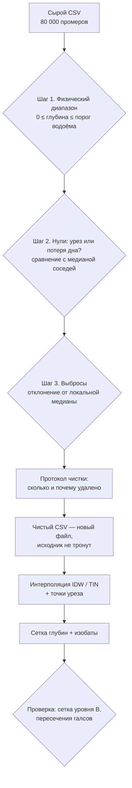

# Превращаем лог эхолота в карту глубин: чистка и интерполяция без программиста

!!! info "Доступность данных"
    Файлы уровней B и C сняты с публикации. Иллюстрации уроков сохранены. Контрольная сетка и полные промеры не выдаются сайтом; примеры с ними требуют собственного входного файла. Открытый набор уровня A доступен на [Zenodo](https://zenodo.org/records/23014446).


> ⏱ **Трудозатраты:** ~17 мин чтения + ~35 мин практики
>
> Модуль **П11: Батиметрия и мониторинг водных объектов**, лекция 2 из 3.
> Профессиональный уровень. Проект UNDP-KAZ, FOLUR. Компоненты FOLUR: **2**, **3**.

## Цели лекции и место в модуле

Лог эхолота — это ещё не карта: в нём ложные нули, всплески от рыбы и шум. Центральная лекция модуля проводит вас по конвейеру «сырой CSV → чистка → интерполяция → карта глубин» на реальном датасете исполнителя — 80 000 промеров водохранилища степной зоны Казахстана. Формат работы — low-code: весь код уже написан в готовом Colab-ноутбуке и в инструментах QGIS; ваша задача — понимать каждый шаг, осознанно выбирать пороги и проверять результат. Именно понимание, а не набор кода, отличает специалиста от оператора кнопки.

После изучения лекции слушатель сможет:

1. **[Bloom: знать]** перечислять типовые дефекты сырых эхолотных промеров и шаги конвейера их чистки.
2. **[Bloom: понимать]** объяснять, почему нули бывают «законными» и «ложными» и почему статистическая чистка должна опираться на соседние точки, а не на весь датасет сразу.
3. **[Bloom: применять]** выполнять чистку и интерполяцию в готовом Colab-ноутбуке и QGIS: настраивать пороги, строить сетку глубин и изобаты, вести протокол.
4. **[Bloom: анализировать]** проверять качество своей карты по контрольной сетке уровня B и пересечениям галсов и находить зоны, где карте доверять нельзя.

> **Границы лекции.** Внутри: дефекты данных, пошаговая чистка, интерполяция IDW/TIN на практике, изобаты, проверка карты. Снаружи: планирование съёмки и журнал — в [лекции 1](01-planiruem-semku-glubin.md); объём, кривые и заиление — в [лекции 3](03-obyom-zailenie-resheniya.md). Математика методов интерполяции, кригинг и кросс-валидация как метод — в [А4, лекция 2](../../a4/lectures/02-karta-glubin-iz-promerov.md); мы берём оттуда готовые рецепты. Пошаговое выполнение всего конвейера — в [практикуме](../practicum/01-karta-glubin-svoimi-rukami.md); делегирование чистки ИИ-ассистенту — в [ИИ-задании](../ai-assistant.md). Базовые приёмы работы в Colab — в [П4, лекция 1](../../p4/lectures/01-zapuskaem-python-v-colab.md).

---

## 1. Знакомимся с сырыми данными

### 1.1 Что внутри файла

Учебный датасет `datasets/bathymetry-training-80k.csv` — четыре колонки: `point_id` (номер записи), `x_m` и `y_m` (координаты в метрах, локальная система без геопривязки), `depth_m` (глубина в метрах). 80 000 строк — случайная выборка из полного набора полевых экспедиций исполнителя (539 955 промеров; полный набор — Zenodo, `<DOI будет присвоен при публикации на Zenodo>`). Глубины — реальные, от 0 до 16,1 м, со всеми полевыми дефектами. Ваш собственный лог после конвертации (лекция 1, §4.2) будет выглядеть так же — потому всё, что вы сделаете с учебным файлом, один в один переносится на свой.

Первые три действия с любым новым датасетом — до всякой чистки:

- **посмотреть таблицу глазами**: первые строки, число записей, нет ли пустых значений;
- **построить гистограмму глубин**: какова форма распределения, где максимум, есть ли подозрительные пики;
- **построить карту точек**: раскрасить промеры по глубине и посмотреть на галсы.

В учебном датасете гистограмма показывает среднюю глубину около 3,4 м при медиане около 3,0 м — мелководий больше, чем глубоких участков, что типично для равнинного водохранилища с пологими заливами. А ещё гистограмма покажет заметный столбик ровно на нуле — с него и начнётся разговор о дефектах.

Всё это доступно и без Colab. В QGIS файл добавляется через «Слой → Добавить слой → Текст с разделителями»: укажите `x_m` и `y_m` как координаты (проекция не важна — система локальная), затем в свойствах слоя включите градуированную раскраску по полю `depth_m`. Десять минут — и перед вами карта промеров, на которой галсы, пересечения и подозрительные точки видны невооружённым глазом. Для практика, привыкшего к картам, этот взгляд «сверху» часто информативнее любых статистик: телепортации GNSS торчат иглами, ложные нули светятся точками «берегового» цвета посреди акватории.

### 1.2 Каталог дефектов: что мы будем чистить

Четыре типовых дефекта эхолотного лога (их происхождение подробно разобрано в [А4, лекция 2](../../a4/lectures/02-karta-glubin-iz-promerov.md), §2.2 — здесь сводка практика):

**Нули.** Часть нулевых глубин — законные точки у самого берега (урез). Часть — потери дна: заросли, аэрация под винтом, предельное мелководье. В учебном датасете нулевых отсчётов — порядка 4–5 % записей, и удалить их все скопом — значит стереть береговую линию с карты.

**Выбросы-всплески.** Одиночная «глубина 12 м» среди соседних 4-метровых промеров: эхо от рыбы, двойное отражение. Дно не меняется на восемь метров за метр хода лодки — если это не затопленный обрыв, поэтому чистку всегда сверяют с картой точек.

**Систематические смещения.** Незаписанная осадка датчика или неверная скорость звука смещают все глубины сразу. Статистикой это не ловится — только контролем по независимым промерам лотом (лекция 1, §2.3).

**Скачки координат.** GNSS под помехами «телепортирует» точку на сотни метров: на карте точек такие дефекты видны как иглы, торчащие из ровных галсов.



*Рис. 1. Конвейер лекции: три шага чистки с протоколом, интерполяция и обязательная проверка результата. Alt: блок-схема — сырой CSV проходит фильтр физического диапазона, разбор нулей по соседям, чистку выбросов по локальной медиане; итоги пишутся в протокол, чистая версия сохраняется отдельным файлом, интерполируется и проверяется по контрольной сетке.*

---

## 2. Чистка по шагам: понимать, что делает каждый фильтр

### 2.1 Шаг 1 — физический диапазон

Первый фильтр отбрасывает невозможное: отрицательные глубины и значения больше физически возможного для вашего водоёма. Верхний порог берите из априорного знания (проектная глубина у плотины, максимум, известный старожилам) **с запасом**, а не из самих данных: наблюдённый максимум 16,1 м — это измерение, а не предел. Порог «обрежем всё больше 16 м» уничтожил бы законную самую глубокую точку. В ноутбуке практикума этот порог — параметр в отдельной ячейке: вы его видите, меняете и понимаете.

### 2.2 Шаг 2 — разбираемся с нулями

Правило различения простое и механическое: сравните нулевую точку с её соседями по координатам. Если медиана ближайших точек — метр и больше, ноль «висит» среди значимых глубин: это потеря дна, удаляем. Если соседи тоже мелкие и глубины плавно убывают — это урез, оставляем. В ноутбуке правило реализовано готовой функцией с двумя параметрами (число соседей и порог медианы); ваша работа — выбрать порог и проверить по карте, что удалённые нули не выстроились вдоль берега.

Обратите внимание на логику: мы не решаем судьбу нулей «на глаз» по одному, а формулируем правило и применяем его ко всем 80 000 точкам разом. Правило можно записать в протокол, обсудить с коллегой, поменять и прогнать заново за секунды. Это и есть главное преимущество обработки кодом перед ручной правкой в таблице — даже если код писали не вы.

### 2.3 Шаг 3 — выбросы по локальной медиане

Для каждой точки берём k ближайших соседей и сравниваем глубину с их медианой; отклонение больше допуска — выброс. Два принципиальных выбора внутри этого правила. **Почему соседи, а не весь датасет:** глубина 15 м нормальна у плотины и абсурдна в мелководном заливе — «нормальность» зависит от места, поэтому статистика обязана быть локальной. **Почему медиана, а не среднее:** среднее подтягивается самим выбросом (одна точка 12 м среди 4-метровых заметно сдвигает среднее, и выброс маскирует сам себя), медиана же устойчива.

Допуск — снова видимый параметр. Начните с консервативного (например, отклонение более 2–3 м) и смотрите на два индикатора. **Доля удалённого:** статистическая чистка обычно помечает порядка процента точек; если фильтр выбрасывает существенно больше — допуск слишком агрессивен либо со съёмкой что-то не так. **Карта удалённых точек:** рассеянные поодиночке — фильтр работает как задумано; выстроились цепочкой вдоль борта затопленного русла — фильтр стирает реальный рельеф, ослабляйте допуск.

### 2.4 Протокол и неприкосновенность исходника

Каждый шаг чистки пишет строку протокола: сколько точек удалено и по какому правилу. Итоговая арифметика обязана сходиться: удалено на трёх шагах + осталось = 80 000. Чистая версия сохраняется в **новый файл** — исходный CSV не перезаписывается никогда. Протокол — не бюрократия: это та часть работы, которая позволит вам самому через год понять, что вы сделали с данными, а заказчику или проверяющему — доверять карте. Отчёт без протокола чистки — как накладная без подписи.

Минимальный протокол помещается в пять строк и пишется ноутбуком автоматически: исходных точек столько-то; шаг 1 (диапазон 0…порог) удалил столько-то; шаг 2 (правило нулей, параметры такие-то) удалил столько-то; шаг 3 (локальная медиана, k соседей, допуск такой-то) удалил столько-то; осталось столько-то, сохранено в такой-то файл. Обратите внимание: протокол фиксирует не только числа, но и **параметры** — без них чистку невозможно повторить, а значит, и проверить. Это тот же принцип неприкосновенности и воспроизводимости данных, что и в журнале съёмки из [лекции 1](01-planiruem-semku-glubin.md): полевые записи и протокол обработки вместе составляют полную родословную вашей карты.

---

## 3. Интерполяция: из точек — в поверхность

### 3.1 Два рабочих метода практика

Чистые точки покрывают водоём неравномерно: густо вдоль галсов, пусто между ними. Карта требует непрерывной поверхности на регулярной сетке — её строит интерполяция. Практику малого водоёма достаточно двух методов, оба есть и в QGIS, и в ноутбуке практикума:

**IDW (обратно-взвешенные расстояния):** значение в узле сетки — среднее ближайших промеров с весами, убывающими с расстоянием. Прост и предсказуем, никогда не выйдет за диапазон данных. Слабость — полосчатость вдоль галсов при редком покрытии и «бычьи глаза» вокруг одиночных точек.

**TIN (триангуляция):** точки соединяются в треугольники, внутри каждого глубина меняется линейно. Поверхность проходит точно через промеры, но за пределами облака точек TIN не строит ничего — прибрежная полоса без промеров останется дырой.

Лекарство от прибрежной дыры — **точки уреза**: обход береговой линии с GPS (лекция 1, §3.3) даёт цепочку точек с глубиной 0, которые добавляются к промерам перед интерполяцией. Это стандартный приём батиметрии, а не трюк: у берега глубина действительно ноль, и мы сообщаем это интерполятору явно.

Кригинг — третий метод с картой неопределённости в придачу — оставим за рамками: он требует геостатистической квалификации, а для решений уровня хозяйства IDW/TIN достаточно. Кто хочет глубже — [А4, лекция 2](../../a4/lectures/02-karta-glubin-iz-promerov.md), §4.

### 3.2 Разрешение сетки: честность важнее красоты

Размер ячейки сетки выбирается по плотности данных, а не по желанию красивой картинки. Сетка мельче межгалсового расстояния создаёт иллюзию детальности: между галсами всё равно интерполяция, и мелкая ячейка лишь размножит догадку. Ориентир: ячейка порядка межгалсового расстояния или крупнее. Контрольная сетка уровня B учебного датасета имеет разрешение 100 м ([`bathymetry-grid-100m.tif`](../../a4/data/bathymetry-grid-100m.tif)) — оно согласовано и с плотностью галсов, и с правовым режимом обобщённых материалов ([Датасеты](../../../datasets.md)).

### 3.3 Изобаты и оформление

Из сетки строятся изобаты — линии равных глубин. Для водоёма с глубинами до 16 м естественен шаг 1–2 м. Сырые изобаты «дребезжат» — их сглаживают для читаемости, но помните: сглаживание — косметика; объём (лекция 3) считается по сетке, а не по красивым линиям. Оформление карты — по правилам, знакомым из [П2](../../p2/index.md): шкала глубин (светлое — мелко, тёмное — глубоко), легенда, дата съёмки и — обязательно — указание метода: «интерполяция IDW однолучевой съёмки». Читатель карты имеет право знать, что перед ним восстановленная поверхность, а не сплошной промер.

---

## 4. Проверяем карту, прежде чем ей верить

Карта построена — но хороша ли она? У практика есть три проверки, по нарастанию строгости.

**Взгляд и здравый смысл.** Изобаты плавные и повторяют форму чаши? Нет «бычьих глаз» и полос вдоль галсов? Максимальная глубина карты совпадает с максимумом чистых данных? Урез совпадает с береговой линией?

**Пересечения галсов.** В точках пересечения основных и контрольных галсов сравните пары независимых промеров (лекция 1, §3.2): их типичный разброс — нижняя граница погрешности всего, что вы построите. Если карта расходится с промерами сильнее этого разброса — проблема в интерполяции.

**Контрольная сетка уровня B.** Для учебного датасета есть эталон: сетка 100 м, построенная исполнителем по полному набору из 540 тысяч точек. Сравните свою сетку с контрольной: посчитайте разность, посмотрите, где расхождения велики. Ожидаемо они сосредоточатся там, где галсы редки, — и это правильный вывод практика: «в этой зоне моей карте доверять нельзя», а не «карта готова, потому что она нарисовалась». В [практикуме](../practicum/01-karta-glubin-svoimi-rukami.md) эта сверка — обязательный шаг самопроверки, а в [ИИ-задании](../ai-assistant.md) — эталон для верификации кода ассистента.

Для собственной съёмки эталонной сетки не будет — тем важнее пересечения галсов и контрольные промеры лотом: закладывайте их в план съёмки заранее, вычислить их задним числом невозможно.

Итоговое правило трёх проверок стоит запомнить как привычку, а не как список: сначала глаза (форма изобат и уреза), затем внутренние резервы данных (пересечения галсов), затем внешний эталон, если он есть (контрольная сетка, промеры лотом). Карта, прошедшая все доступные проверки, получает право называться результатом; карта, не прошедшая ни одной, — остаётся черновиком, какой бы аккуратной она ни выглядела.

---

## Региональный кейс

**Ситуация:** Зерновое хозяйство в Костанайской области арендует пруд-накопитель у балки для технических нужд и планирует зарыбление. Инженеру поручили карту глубин: прошлым летом снят лог эхолота, но обработка застряла — в файле обнаружились нулевые глубины посреди акватории и одиночные «ямы» по 10–12 м, которым никто не верит. Инженер отрабатывает методику чистки на учебном датасете платформы, где те же дефекты присутствуют в реальном полевом виде, а результат можно проверить по контрольной сетке.

**Данные:** `datasets/bathymetry-training-80k.csv` (уровень A) и контрольная сетка [`bathymetry-grid-100m.tif`](../../a4/data/bathymetry-grid-100m.tif) (уровень B) — см. [Датасеты платформы](../../../datasets.md).

**Задача:**

1. Проведите разведку данных: гистограмма глубин, карта точек, доля нулей. Какие из дефектов §1.2 вы видите своими глазами?
2. Прогоните три шага чистки §2 с настройками по умолчанию; затем ужесточьте допуск выбросов вдвое и сравните протоколы. Что изменилось и где удалённые точки легли на карте?
3. Постройте сетку IDW с ячейкой 100 м, сравните с контрольной сеткой уровня B: где расхождения наибольшие и чем они объяснимы?

**Разбор:** Ожидаемый ход: нули распадаются на прибрежные (остаются) и изолированные (удаляются правилом медианы соседей); агрессивный допуск начинает выедать точки вдоль перегибов рельефа — это видно именно на карте удалённого, а не в протоколе. Расхождения с контрольной сеткой концентрируются в зонах редких галсов и у берега — вывод для собственной съёмки: добавлять галсы и точки уреза там, где карта «плывёт». Точных чисел кейс не задаёт: все значения слушатель вычисляет сам в [практикуме](../practicum/01-karta-glubin-svoimi-rukami.md), критерий правильности — согласие с сеткой уровня B по форме и диапазону.

---

## Закрепление и применение

!!! example "Попробуйте в Colab"
    Ноутбук модуля (`<URL будет назначен при создании репозитория ноутбуков>`) содержит весь конвейер лекции с готовым кодом и параметрами в отдельных ячейках. Задание на 15 минут: запустите разделы «Чистка» и «Протокол», затем поменяйте порог физического диапазона с запаса на жёсткие 16,0 м и найдите в протоколе, что изменилось. Верните параметр обратно и объясните себе, почему запас обязателен.

!!! warning "Границы применимости"
    Конвейер чистит случайные дефекты, но бессилен против систематических: незаписанная осадка датчика смещает всю карту, и обнаружить это можно только контрольными промерами лотом. Карта — интерполяция: между галсами она предполагает плавное дно и не покажет узких объектов. Учебный датасет — в локальной системе координат: накладывать его на реальные карты и снимки нельзя, для учебных задач это и не требуется.

!!! tip "Что это даёт вашему хозяйству"
    Один раз пройдя конвейер на учебных данных, вы обрабатываете лог собственного эхолота за вечер: чистка с протоколом, карта с изобатами, готовность к расчёту объёма. Протокол чистки делает вашу карту документом, который примет и банк при залоге актива, и подрядчик при проектировании водозабора — в отличие от «картинки из эхолота».

!!! question "Кейс для размышления"
    Коллега прислал красивую карту глубин своего пруда: ячейка сетки 5 м при межгалсовом расстоянии около 80 м, изобаты идеально гладкие, протокола чистки нет. Какие три вопроса вы зададите, прежде чем использовать эту карту для расчёта объёма? Обоснуйте через §2.4, §3.2 и §4.

### Проверь себя

```quiz
[
  {
    "q": "В логе эхолота 4–5 % нулевых глубин. Какое действие правильно?",
    "options": ["Разделить нули правилом: сравнить каждый с медианой соседей — изолированные среди глубин удалить, прибрежные оставить", "Удалить все нули: это всегда дефект прибора", "Оставить все нули: это всегда берег", "Заменить нули средней глубиной датасета"],
    "answer": 0,
    "explain": "§2.2: нули бывают законными (урез) и ложными (потеря дна); механическое правило по медиане соседей разделяет их воспроизводимо. Удаление всех нулей стёрло бы береговую линию."
  },
  {
    "q": "Почему выбросы ищут отклонением от медианы ближайших соседей, а не от среднего по всему датасету?",
    "options": ["«Нормальная» глубина зависит от места, а медиана, в отличие от среднего, не подтягивается самим выбросом", "Локальная медиана вычисляется быстрее", "Среднее по датасету нельзя посчитать в Colab", "Так удаляется больше точек"],
    "answer": 0,
    "explain": "§2.3: глубина 15 м нормальна у плотины и аномальна в заливе — статистика должна быть локальной; среднее маскирует выброс, подтягиваясь к нему."
  },
  {
    "q": "Зачем перед интерполяцией к промерам добавляют точки уреза с глубиной 0?",
    "options": ["Без них у берега нет данных: TIN оставит дыру, а IDW «повесит» прибрежную полосу на далёкие промеры", "Чтобы увеличить среднюю глубину карты", "Точки уреза нужны только для оформления легенды", "Чтобы уменьшить размер файла"],
    "answer": 0,
    "explain": "§3.1: интерполяторы не знают, где берег; цепочка нулевых точек по береговой линии — явное и физически верное граничное условие."
  },
  {
    "q": "Каким выбрать размер ячейки сетки глубин?",
    "options": ["Порядка межгалсового расстояния или крупнее — мельче ячейка лишь размножает интерполяционную догадку", "Как можно мельче — карта будет детальнее", "Всегда ровно 10 м", "Равным осадке датчика"],
    "answer": 0,
    "explain": "§3.2: между галсами данных нет; ячейка мельче межгалсового расстояния создаёт иллюзию детальности, которой в данных не существует."
  },
  {
    "q": "Ваша сетка сильно расходится с контрольной сеткой уровня B в одной зоне водоёма. Наиболее вероятное объяснение?",
    "options": ["В этой зоне редкие галсы: интерполяция ненадёжна, и зону следует пометить как зону низкого доверия", "Контрольная сетка всегда ошибочна", "Расхождения нужно скрыть сглаживанием изобат", "Виноват формат GeoTIFF"],
    "answer": 0,
    "explain": "§4: расхождения закономерно концентрируются там, где мало данных; честный вывод практика — обозначить зону низкого доверия и при возможности доснять галсы."
  }
]
```

### Контрольные вопросы

1. Назовите три шага чистки конвейера и правило каждого шага. *(Bloom: знать)*
2. Объясните, почему исходный CSV никогда не перезаписывается и что должен содержать протокол чистки. *(Bloom: понимать)*
3. Для собственной съёмки без контрольной сетки уровня B предложите два способа проверить качество карты. *(Bloom: применять/анализировать)*

## Что дальше?

Карта глубин готова и проверена — теперь заставим её работать. В [лекции 3 «Считаем воду и принимаем решения»](03-obyom-zailenie-resheniya.md) мы посчитаем объём водоёма, построим кривую «уровень–площадь–объём», оценим заиление и сверим жизнь водоёма с многолетними спутниковыми архивами. Выполнить конвейер этой лекции своими руками — в [практикуме](../practicum/01-karta-glubin-svoimi-rukami.md); поручить чистку ИИ-ассистенту и проверить его — в [ИИ-задании](../ai-assistant.md).
