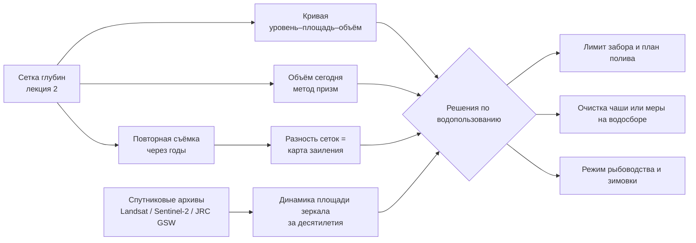

# Считаем воду и принимаем решения: объём, заиление и спутниковые архивы

> ⏱ **Трудозатраты:** ~16 мин чтения + ~30 мин практики
>
> Модуль **П11: Батиметрия и мониторинг водных объектов**, лекция 3 из 3.
> Профессиональный уровень. Проект UNDP-KAZ, FOLUR. Компоненты FOLUR: **2**, **3**.

## Цели лекции и место в модуле

Карта глубин красива, но хозяйству нужны не краски, а ответы: сколько воды есть, на сколько её хватит, мелеет ли водоём и что с этим делать. Завершающая лекция модуля переводит карту в язык решений: объём и кривая «уровень–площадь–объём», оценка заиления по повторным съёмкам, сверка поведения водоёма с бесплатными спутниковыми архивами за десятилетия — и, главное, конкретные решения по водопользованию, которые из этих чисел следуют.

После изучения лекции слушатель сможет:

1. **[Bloom: знать]** перечислять продукты батиметрии для водопользователя (объём, батиграфические кривые, карта заиления) и открытые спутниковые архивы наблюдения воды.
2. **[Bloom: понимать]** объяснять, как из сетки глубин получается объём и кривая «уровень–площадь–объём» и какие условия делают оценку заиления достоверной.
3. **[Bloom: применять]** рассчитывать по готовому ноутбуку объём водоёма и кривую объёма, читать по ней последствия изменения уровня.
4. **[Bloom: анализировать]** сопоставлять батиметрию с многолетней динамикой площади зеркала по спутниковым архивам и обосновывать решения: лимит забора, срок очистки чаши, меры на водосборе.

> **Границы лекции.** Внутри: расчёт объёма, батиграфические кривые, заиление, обзор спутниковых архивов, решения по водопользованию. Снаружи: получение самой сетки глубин — в [лекции 2](02-ot-promerov-k-karte-glubin.md); методика спутникового мониторинга воды (NDWI/MNDWI, радар Sentinel-1, «виртуальный гидропост») развёрнута в [А4, лекции 3–4](../../a4/lectures/03-sputnikovyj-monitoring-vody.md) — здесь только то, что практик применит без программирования; проектирование орошения и водосберегающих систем — в [П12](../../p12/index.md); гидрология водосбора — в [А4, лекция 1](../../a4/lectures/01-vodnyj-balans-stepnogo-vodosbora.md).

---

## 1. Объём: главная цифра водоёма

### 1.1 Метод призм — арифметика, а не магия

Сетка глубин из лекции 2 делает расчёт объёма тривиальным: объём равен сумме по всем ячейкам произведения глубины на площадь ячейки. Каждая ячейка — вертикальная призма: основание известно из размера сетки, высота — из интерполированной глубины; сложите призмы — получите объём водоёма. Для сетки 100 м площадь ячейки — 10 000 м², и весь расчёт — одна строка готового кода в ноутбуке практикума. Никакой высшей математики: точность метода призм определяется не формулой, а качеством сетки — потому лекция 2 и была длиннее этой.

У итоговой цифры две составляющие погрешности, и обе вы уже умеете оценивать. Первая — погрешность интерполяции: её масштаб показали пересечения галсов и сверка с контрольной сеткой (лекция 2, §4). Вторая — положение береговой линии: у равнинных степных водоёмов берега пологие, и ошибка уреза на десятки метров в плане заметно меняет площадь мелководий. Честный отчёт приводит объём с оговоркой о погрешности, а не одну гладкую цифру.

### 1.2 Кривая «уровень–площадь–объём»

Одна цифра объёма отвечает на вопрос «сколько воды сегодня». Кривая «уровень–площадь–объём» отвечает на все остальные. Строится она мысленным «сливом» водоёма по шагам: посчитайте площадь и объём той части сетки, где глубина больше 1 м, больше 2 м и так далее — получится зависимость площади зеркала и объёма от уровня воды. В ноутбуке практикума это готовый короткий цикл; ваша задача — прочитать и применить результат.

А читать есть что. **Сколько воды останется, если уровень упадёт на метр?** Смотрим объём на кривой уровнем ниже. **При каком уровне оголится водозабор или зимовальная яма?** Смотрим отметку на карте и находим её на кривой. **Как быстро мелеющий водоём теряет площадь?** У пологих чаш первые же десятки сантиметров сработки «съедают» непропорционально большую площадь мелководий — кривая показывает это сразу. Для рыбоводства кривая даёт и оценку зимнего запаса: подо льдом рыбе остаётся объём ниже толщины льда, и по кривой видно, не превращается ли пруд зимой в лужу.

Оформите кривую как рабочий документ, а не график «для галочки»: таблица «уровень → площадь → объём» с шагом, удобным вашей рейке (например, 10–20 см), дата и метод съёмки, оговорка о погрешности. Повесьте таблицу рядом с рейкой уровнемера — и любой работник хозяйства, взглянув на рейку, сразу знает текущий запас воды. Так одна съёмка превращается в постоянно действующий измерительный прибор: рейка меряет уровень, кривая переводит его в кубометры.



*Рис. 1. Как продукты батиметрии и спутниковые архивы сходятся в решения по водопользованию. Alt: блок-схема — из сетки глубин получаются объём, батиграфическая кривая и, при повторной съёмке, карта заиления; спутниковые архивы дают динамику площади зеркала; всё сходится в узел решений — лимиты забора, очистка чаши либо меры на водосборе, режим рыбоводства.*

---

## 2. Заиление: измеряем то, о чём все спорят

### 2.1 Разность двух съёмок

Каждый степной пруд «мелеет» — по словам старожилов. Батиметрия переводит спор в измерение: повторная съёмка через несколько лет и разность сеток «тогда минус сейчас» дают карту накопления наносов и суммарную потерю ёмкости. Это единственный честный способ узнать скорость заиления своего водоёма: универсальных норм нет, всё решают водосбор, распашка и характер весеннего стока. Для равнинных водоёмов зернового пояса Северного Казахстана вопрос особенно актуален: распаханные водосборы поставляют наносы с каждым весенним стоком, а мелкие чаши теряют от этого заметную долю и без того небольшой ёмкости.

Достоверность разности требует дисциплины, и все её элементы вы уже знаете. Обе съёмки должны быть приведены к **единому уровню** (журнал рейки — лекция 1, §4.1); плотность галсов и методика интерполяции — **сопоставимы** (протокол — лекция 2, §2.4); позиции — воспроизводимы, здесь и окупается точная привязка RTK/PPK (лекция 1, §2.2). Разность двух интерполяций содержит ошибки обеих, поэтому значимыми считаются только изменения, превышающие суммарную оценку погрешности. Изменения тоньше порога — «в пределах точности метода», и это тоже результат.

### 2.2 Что говорит карта заиления

Суммарная цифра потери объёма — аргумент для бюджета: сопоставьте её со стоимостью механической очистки чаши и с ценностью теряемой воды. Но карта информативнее суммы. Если наносы легли **у устьев логов и балок** — источник на водосборе: эрозия полей выше по склону, и деньги эффективнее вложить не в экскаватор, а в противоэрозионные меры — буферные полосы, изменение обработки склоновых полей (мост к [П8](../../p8/index.md) и [А5](../../a5/index.md); практики — в базе WOCAT). Если наносы распределены ровно — работает ветровой принос и отмирание растительности, и очистка чаши остаётся основным средством. Так карта заиления превращается из констатации в диагностику причин.

### 2.3 Логика решения об очистке

Решение «чистить или нет» — экономическое, и батиметрия поставляет в него обе главные переменные. Первая — **сколько ёмкости теряется**: суммарная цифра из разности съёмок и её скорость (потеря, делённая на годы между съёмками). Вторая — **где лежат наносы**: очистка подводящего клина у устья балки на порядок меньше по объёму работ, чем чистка всей чаши, а эффект для ёмкости может быть сопоставим. Конкретные расценки работ и ценность кубометра воды для хозяйства лекция не задаёт — они ваши и меняются год от года; методика лишь гарантирует, что в расчёт пойдут измеренные, а не мифические объёмы. И помните о третьем варианте: если карта показала эрозионный источник, «лечение водосбора» дешевле повторяющихся очисток — экскаватор убирает симптом, буферная полоса — причину.

---

## 3. Спутниковые архивы: десятилетия наблюдений бесплатно

### 3.1 Что лежит в архивах

Ваша съёмка — один момент времени. Спутниковые архивы добавляют к нему предысторию за десятилетия — бесплатно и без выезда. Программа **Landsat** (USGS/NASA) наблюдает Землю с 1980-х годов с разрешением 30 м — почти любой степной водоём крупнее нескольких гектаров в этом архиве виден. **Sentinel-2** (Copernicus, ЕС) с 2015 года даёт 10-метровое разрешение и повтор съёмки каждые несколько дней. Продукт **JRC Global Surface Water** уже перевёл весь архив Landsat в готовые карты воды: где и как часто наблюдалась вода, как менялась площадь, — смотреть их можно в браузере, без всякого кода.

Физика проста: вода почти не отражает в ближнем инфракрасном диапазоне, поэтому водные индексы (NDWI и родственные) уверенно отделяют зеркало от суши. Строить такие маски самостоятельно учит [А4, лекция 3](../../a4/lectures/03-sputnikovyj-monitoring-vody.md); практику П11 достаточно готовых продуктов и просмотровых сервисов.

Смотреть архивы можно целиком в браузере, бесплатно и без кода. Официальный браузер Copernicus Data Space показывает снимки Sentinel-2 по дате и месту с готовой визуализацией водного индекса; просмотрщик JRC Global Surface Water отображает готовые слои «частота воды» и «изменения» по всему архиву Landsat; в USGS EarthExplorer доступны исторические сцены Landsat. Регистрация в этих сервисах бесплатна. Навигация по спутниковым каталогам как отдельный навык разбирается в [П2](../../p2/index.md) и [П7](../../p7/index.md) — здесь достаточно уметь найти свой водоём и пролистать годы.

### 3.2 Как практик читает архив

Три вопроса к архиву, отвечаемые за вечер. **Стабильно ли зеркало?** Пролистайте годы: если летняя площадь пруда систематически сокращается — тревожный сигнал, требующий разбирательства (заиление? водосбор? забор воды выше по балке?). **Каков сезонный ход?** Максимум после снеготаяния и сработка к осени — норма степной зоны; аномально ранняя сработка укажет на возросший расход. **Что было в экстремальные годы?** Многоводные и засушливые годы в архиве показывают диапазон, в котором живёт ваш водоём, — и границы разумного планирования.

Здесь батиметрия и спутник усиливают друг друга: **спутник видит только площадь, но ваша кривая «уровень–площадь–объём» переводит площадь в объём.** Один день на лодке превращает весь сорокалетний архив площадей в архив объёмов вашего водоёма — самый дешёвый гидрологический пост из возможных. Именно так устроен «виртуальный гидропост» в [А4, лекция 4](../../a4/lectures/04-godovoj-cikl-vodoyoma.md).

### 3.3 Пределы метода

Спутник не заменит съёмку: он не видит глубин (оптическая батиметрия в мутной степной воде не работает), путает воду с тенью облаков на отдельных снимках и слепнет в облачность. Малые пруды меньше пары пикселей Landsat в старом архиве неразличимы — для них история начинается с Sentinel-2. Выводы делайте по устойчивым многолетним рядам, а не по паре снимков.

Отсюда правильное разделение труда между лодкой и орбитой. Съёмка эхолотом даёт то, чего спутник не даст никогда: глубины, объём, рельеф дна, заиление. Архив даёт то, чего не даст ни одна съёмка: предысторию за десятилетия и бесплатный регулярный контроль площади на будущее. Порознь каждый инструмент отвечает на половину вопросов; вместе — через кривую «уровень–площадь–объём» — они образуют полноценную систему мониторинга водоёма, посильную одному хозяйству.

---

## 4. Решения по водопользованию: сводим всё вместе

Итог модуля — не карта, а решения, которые она обосновывает. Сведём типовые решения малого водопользователя и данные, на которые каждое опирается:

| Решение | На чём основано |
|---|---|
| Лимит сезонного забора на полив | объём при текущем уровне (§1.1) + кривая: уровень в конце сезона (§1.2) |
| Планирование водопоя и рыбоводства | кривая: площадь и объём при летней сработке; зимний остаточный объём |
| Очистка чаши: делать и когда | суммарная потеря ёмкости и скорость заиления (§2.1) против стоимости работ |
| Меры на водосборе вместо/вместе с очисткой | карта заиления: очаги у устьев логов (§2.2) |
| Реакция на многолетнее усыхание | архив площадей (§3.2) + кривая для перевода в объёмы |
| Заявка на господдержку водохозяйственных мероприятий | весь пакет: карта, объём, заиление — как обоснование ([П14](../../p14/index.md)) |

Общий принцип: каждое решение опирается на измерение, которое вы в состоянии повторить и защитить. «Пруд обмелел, дайте денег на очистку» — мнение; «повторная съёмка показала потерю ёмкости сверх погрешности метода, очаги наносов у устья балки, предлагаем буферную полосу и очистку подводящего клина» — обоснование. Разница между ними — и есть содержание этого модуля.

Заведите и минимальный регламент мониторинга — он умещается в три строки годового плана. Ежегодно: записи рейки уровня в ключевые даты (пик после снеготаяния, конец поливного сезона, ледостав) и беглый просмотр свежих снимков зеркала. Раз в несколько лет: повторная съёмка по методике [лекции 1](01-planiruem-semku-glubin.md) — тем же прибором и по той же схеме галсов, чтобы разность была честной. После экстремальных лет (бурное половодье, переполнение): внеочередной осмотр и, при признаках заноса, внеплановая съёмка приплотинной части. Такой регламент стоит хозяйству несколько дней в год, а даёт то, чего нет почти ни у кого из соседей: измеренную историю собственного водоёма.

Числовых нормативов (сколько кубометров «положено» терять, какие субсидии доступны) лекция сознательно не приводит: они зависят от региона, года и программ поддержки — проверяйте действующие нормы по официальным источникам; работе с мерами господдержки посвящён [П14](../../p14/index.md).

---

## Региональный кейс

**Ситуация:** Хозяйство в Буландынском районе Акмолинской области держит пруд для орошения овощного участка и опасается, что воды на весь сезон не хватит: прошлым летом полив пришлось останавливать раньше плана. Правление обсуждает три варианта — углубить пруд, сократить поливные площади или искать дополнительный источник — но решает сначала измерить, а потом тратить. Инженер строит кривую «уровень–площадь–объём» по методике модуля (тренировка — на учебном датасете) и поднимает историю зеркала пруда по открытым спутниковым архивам.

**Данные:** сетка глубин, построенная слушателем в [практикуме](../practicum/01-karta-glubin-svoimi-rukami.md) по `datasets/bathymetry-training-80k.csv`, и контрольная сетка [`bathymetry-grid-100m.tif`](../../a4/data/bathymetry-grid-100m.tif); архивы Landsat/Sentinel-2 и продукт JRC Global Surface Water — в открытом доступе (обзор в браузере, без кода).

**Задача:**

1. По своей сетке из практикума рассчитайте объём и постройте кривую «уровень–площадь–объём»; определите, какая доля объёма теряется при сработке уровня на первый метр.
2. Сформулируйте, какие наблюдения из спутникового архива подтвердили бы (или опровергли бы) версию «пруд стал вмещать меньше воды»: что именно искать в рядах площади зеркала?
3. Обоснуйте выбор между углублением пруда и мерами на водосборе: каких данных не хватает и какой шаг методики модуля их даёт?

**Разбор:** Кривая учебного водоёма покажет характерную черту равнинных чаш: заметная доля объёма сидит в верхнем метре — сработка бьёт по запасам сильнее, чем кажется по «просевшему» урезу. Спутниковый архив различает две ситуации: если максимальная весенняя площадь год от года стабильна, а вода уходит быстрее — растёт расход или потери; если сокращается сам весенний максимум — меняется приток с водосбора. Для выбора «углублять или лечить водосбор» не хватает карты заиления — её даёт повторная съёмка (§2): единственная строка бюджета, которую нельзя заменить рассуждениями. Конкретные цифры слушатель вычисляет сам; кейс проверяется логикой обоснования, а не совпадением чисел.

---

## Закрепление и применение

!!! example "Попробуйте в Colab"
    В ноутбуке модуля (`<URL будет назначен при создании репозитория ноутбуков>`) раздел «Объём и кривая» считает всё по вашей сетке из практикума. Задание на 15 минут: выполните раздел, найдите на кривой объём при сработке 0,5 м и 1,0 м от текущего уровня и запишите выводы одним абзацем — как для правления хозяйства.

!!! warning "Границы применимости"
    Метод призм честен ровно настолько, насколько честна сетка: зоны низкого доверия из лекции 2 переносятся в погрешность объёма. Оценка заиления значима только при единой коррекции уровня и сопоставимой методике съёмок. Спутниковые архивы дают площадь, но не глубину; малые пруды в старом архиве Landsat неразличимы. Нормативы и суммы поддержки в лекции не приводятся — проверяйте по официальным источникам.

!!! tip "Что это даёт вашему хозяйству"
    Кривая «уровень–площадь–объём» — одноразовое вложение (день съёмки + вечер обработки), которое дальше работает годами: планирование каждого поливного сезона, зимовка рыбы, обоснование очистки чаши и заявок на поддержку. Плюс весь спутниковый архив вашего пруда бесплатно превращается в историю объёмов.

!!! question "Кейс для размышления"
    Старожилы утверждают, что пруд «обмелел вдвое за двадцать лет». Спутниковый архив показывает, что летняя площадь зеркала за эти годы почти не изменилась. Противоречат ли данные друг другу? Подумайте о форме чаши, заилении дна (глубина падает — площадь та же) и о том, какой шаг методики разрешит спор окончательно.

### Проверь себя

```quiz
[
  {
    "q": "Как из сетки глубин получается объём водоёма?",
    "options": ["Суммой по ячейкам произведений глубины на площадь ячейки (метод призм)", "Умножением максимальной глубины на площадь зеркала", "Интегрированием изобат после сглаживания", "Объём нельзя получить из сетки — нужен водомер"],
    "answer": 0,
    "explain": "§1.1: метод призм — сумма глубина×площадь по ячейкам; точность определяется качеством сетки, а не формулой."
  },
  {
    "q": "Почему одна батиметрическая съёмка «многократно окупается» при наличии спутниковых архивов?",
    "options": ["Кривая «уровень–площадь–объём» переводит архив спутниковых площадей за десятилетия в архив объёмов водоёма", "Спутники начинают снимать водоём чаще", "Съёмка повышает разрешение снимков", "Архивы платные, а съёмка делает их бесплатными"],
    "answer": 0,
    "explain": "§3.2: спутник видит только площадь зеркала; батиграфическая кривая — переводчик площади в уровень и объём для всего архива наблюдений."
  },
  {
    "q": "Разность двух съёмок показала изменения глубин меньше суммарной погрешности метода. Корректный вывод?",
    "options": ["Заиление за период не превышает точности метода — значимых изменений не зафиксировано", "Водоём очистился сам", "Нужно вычесть погрешность и объявить остаток заилением", "Первая съёмка была лишней"],
    "answer": 0,
    "explain": "§2.1: значимы только изменения сверх суммарной погрешности обеих интерполяций; результат «в пределах точности» — тоже честный результат."
  },
  {
    "q": "Карта заиления показывает очаги наносов у устьев логов, впадающих в пруд. Какое решение это поддерживает?",
    "options": ["Противоэрозионные меры на водосборе: источник наносов — эрозия выше по склону", "Немедленное углубление всей чаши", "Запрет рыбоводства", "Увеличение забора воды на полив"],
    "answer": 0,
    "explain": "§2.2: локализация наносов у устьев указывает на эрозионный источник на водосборе — деньги эффективнее вложить в буферные полосы и обработку склоновых полей, чем только в экскаватор."
  }
]
```

### Контрольные вопросы

1. Перечислите продукты батиметрии для водопользователя и по одному решению, которое каждый обосновывает. *(Bloom: знать)*
2. Объясните, какие три условия делают разность повторных съёмок достоверной оценкой заиления. *(Bloom: понимать)*
3. Для своего (или условного) водоёма составьте план мониторинга на пять лет: что измерять, что смотреть в архивах, когда повторять съёмку. *(Bloom: применять/анализировать)*

## Что дальше?

Теория пройдена — время собрать прикладной продукт. В [практикуме](../practicum/01-karta-glubin-svoimi-rukami.md) вы своими руками проведёте весь конвейер на реальном датасете: чистка → карта → объём → кривая, и получите артефакты для аттестации. Затем — [ИИ-задание](../ai-assistant.md): поручите фильтрацию промеров LLM-ассистенту и проверьте его работу по опорным точкам. Продолжение темы воды для хозяйства — [П12 «Водосбережение и ирригация»](../../p12/index.md); академическая глубина — [А4](../../a4/index.md). Итоговая аттестация модуля — [здесь](../assessment/final.md).
