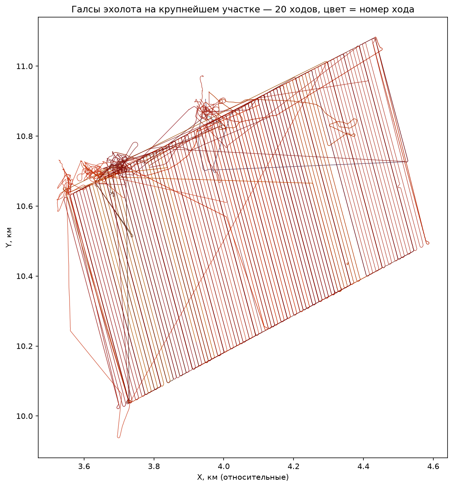
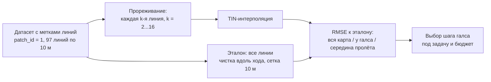
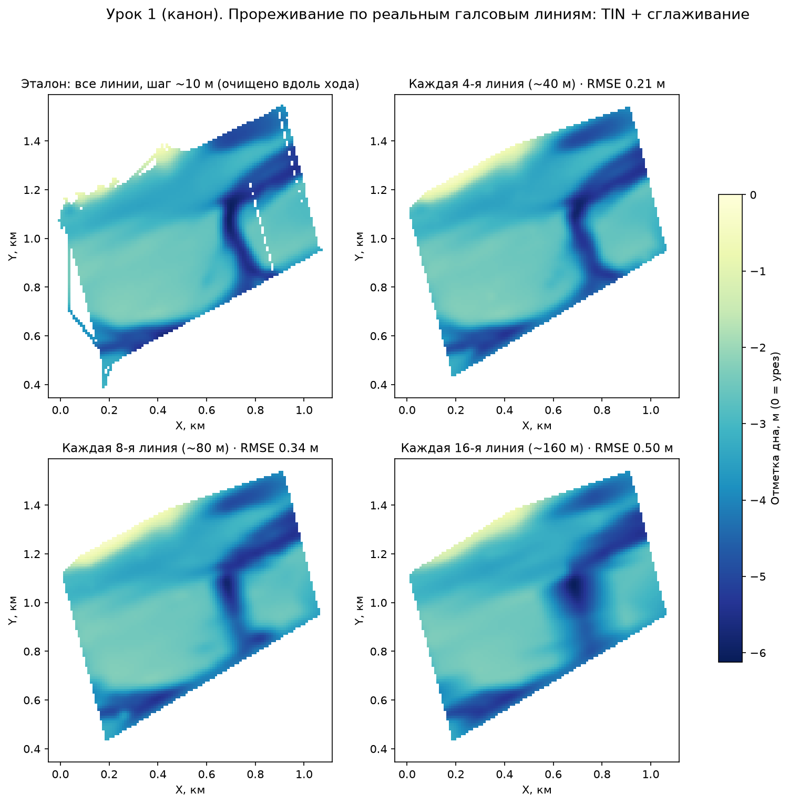
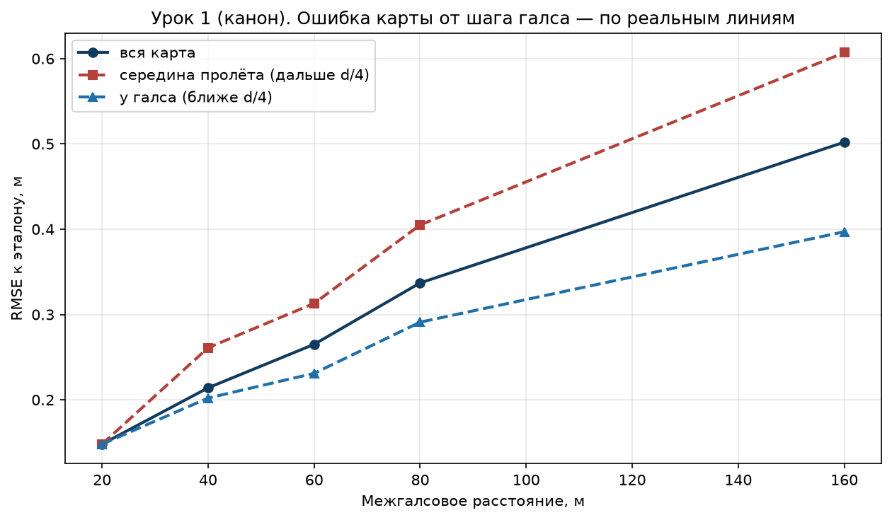
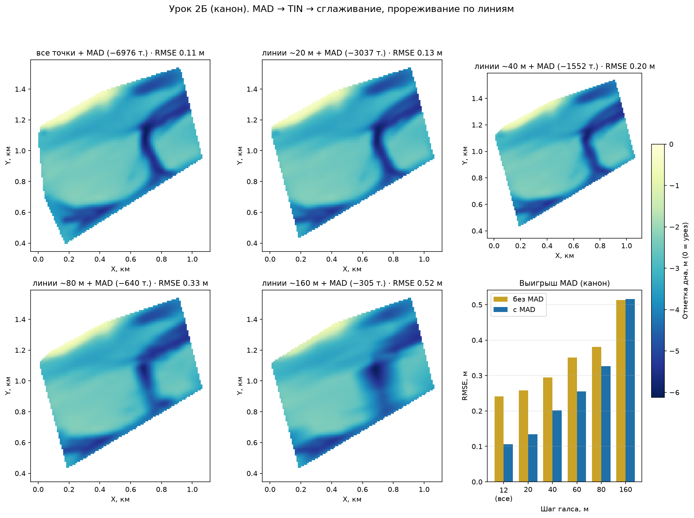
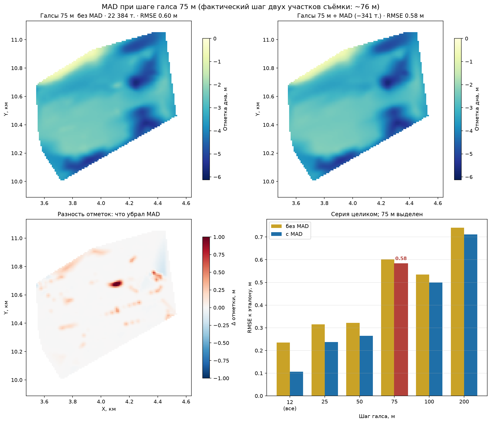

# Шаг галса и цена точности: эксперимент на 519 192 реальных промерах

> ⏱ **Трудозатраты:** ~15 мин чтения + ~30 мин практики
>
> Модуль **П11: Батиметрия и мониторинг водных объектов**, лекция 4 из 4.
> Профессиональный уровень. Проект UNDP-KAZ, FOLUR. Компоненты FOLUR: **2**, **3**.

## Цели лекции и место в модуле

В лекции 1 вы планировали съёмку, в лекции 2 — чистили промеры и строили карту. Остался главный инженерный вопрос, который решает и бюджет выезда, и качество итоговой карты: **какой шаг галса выбрать?** Эта лекция отвечает на него не общими словами, а экспериментом: мы берём реальный участок съёмки исполнителя, где галсы проложены через каждые 10 м, объявляем его эталоном — и смотрим, что произойдёт с картой, если бы судно прошло вдвое, вчетверо, в шестнадцать раз реже. Заодно выясняем, где фильтрация выбросов спасает карту, а где она уже бессильна — и даже вредна.

После изучения лекции слушатель сможет:

1. **[Bloom: знать]** различать термины *ход*, *галс* и *галсовая линия* и объяснять, почему разрешение эхолотной съёмки анизотропно.
2. **[Bloom: понимать]** объяснять, как межгалсовое расстояние и шум хода по-разному формируют ошибку карты и почему один рычаг не заменяет другой.
3. **[Bloom: применять]** воспроизводить канонический эксперимент прореживания на учебном датасете с метками галсовых линий и получать контрольные значения RMSE.
4. **[Bloom: анализировать]** выбирать шаг галса под задачу (морфометрия чаши / русловые формы / проект дноуглубления) и оценивать цену ошибки против цены полевого времени.
5. **[Bloom: оценивать]** распознавать методические ловушки численных экспериментов на примере реальной ошибки «полосной эмуляции», найденной при подготовке этой лекции.

> **Границы лекции.** Внутри: терминология съёмки, эксперимент прореживания, серия «MAD на каждом шаге», выбор шага галса, разбор методической ошибки. Снаружи: прокладка галсов и журнал — в [лекции 1](01-planiruem-semku-glubin.md); конвейер чистки и интерполяции — в [лекции 2](02-ot-promerov-k-karte-glubin.md); объём и заиление — в [лекции 3](03-obyom-zailenie-resheniya.md); математика интерполяции — в [А4](../../a4/index.md). Выполнение эксперимента своими руками — в [практикуме](../practicum/01-karta-glubin-svoimi-rukami.md) (дополнительное задание Д1).

---

## 1. Ход, галс, линия: как читать структуру съёмки

Три термина, которые в полевых разговорах часто смешивают, а в данных они различимы и по-разному важны:

- **Ход** (`track_id`) — непрерывный отрезок записи лога от включения до выключения. Один выезд может дать несколько ходов; качество разных ходов различается: в нашей съёмке RMS шума глубины по ходам — от 0,11 до 0,49 м, в четыре раза.
- **Галс** — один прямолинейный проход судна. Классическая схема — «газонокосилка» (lawnmower): параллельные галсы с разворотами на концах.
- **Галсовая линия** (`leg_id`) — положение галса на акватории. Несколько ходов могут проходить по одной линии (повторная съёмка), а точки разворотов не принадлежат ни одной линии (`leg_id = 0`).

Вдоль галса эхолот пишет точку каждые 0,3–1 м, а поперёк ближайшие данные — только на соседней линии, через десятки метров: **разрешение съёмки анизотропно**. Поэтому узкие формы рельефа (затопленное русло, промоина) съёмка видит хорошо только тогда, когда галсы идут поперёк них.

Учебный датасет лекции — [`lesson-bathymetry-tracks.csv`](../../../files/lesson-bathymetry-tracks.csv) (519 192 промера): та же съёмка, что в лекции 2, но с сохранённой структурой — колонками `patch_id` (участок), `track_id` (ход), `leg_id` (линия) и `seq_in_track` (порядок записи). Технический мусор (ход с нулевыми глубинами вне водоёма и GPS-скачки) уже исключён, а вот естественные дефекты — спайки и нули — оставлены namеренно: их чистит конвейер лекции 2.

Фактические шаги галсовых линий по участкам этой съёмки (измерено по данным):

| Участок (`patch_id`) | Точек | Медианная глубина | Шаг линий |
|---|---|---|---|
| 1 — главный | 469 110 | 2,9 м | **10 м** (97 линий) |
| 2 — южная ветвь | 21 414 | 6,4 м | 75 м |
| 3 | 10 127 | 8,2 м | 75 м |
| 4 | 9 664 | 5,3 м | 50 м |
| 5 — глубоководный | 8 770 | 12,9 м | 50 м |



*Рис. 1. Галсы главного участка (~1×1 км): классическая «газонокосилка» с шагом линий 10 м. Цвет линий — номер хода, а не качество: качество ходов оценивается отдельно, по шуму глубины. Alt: карта траекторий судна — плотные параллельные линии с разворотами на концах и служебными переходами.*



*Рис. 2. Схема эксперимента лекции. Alt: блок-схема — из датасета с метками линий строится эталон по всем линиям и прореженные варианты по каждой k-й линии; TIN-карты сравниваются с эталоном по RMSE, результат используется для выбора шага галса.*

---

## 2. Эксперимент: та же акватория, галсы в 2–16 раз реже

Берём главный участок (`patch_id == 1`, глубины > 0). Эталон — карта по **всем** 97 линиям: сетка 10 м, вдоль-трековая чистка (точка-выброс, если она отклонилась от скользящей медианы своего хода больше чем на 0,75 м). Затем оставляем каждую 2-ю, 4-ю, 6-ю, 8-ю, 16-ю линию — это честная эмуляция съёмки с шагом 20–160 м, потому что выбираются **реальные галсы целиком**, — и строим TIN-интерполяцию.



*Рис. 3. Одна акватория при разном межгалсовом расстоянии (отметка дна, 0 = урез; сглаживание — только для показа). На 40 м затопленное русло ещё читается целиком, на 80 м рвётся, на 160 м остаётся размытое пятно. Alt: четыре карты глубин одного участка с прогрессирующей потерей детальности рельефа.*

| Прореживание | Линий | Точек | RMSE карты | у галса | середина пролёта |
|---|---|---|---|---|---|
| каждая 2-я (~20 м) | 49 | 190 827 | 0,15 м | — | — |
| каждая 4-я (~40 м) | 25 | 91 652 | 0,21 м | 0,20 м | 0,26 м |
| каждая 6-я (~60 м) | 17 | 57 307 | 0,27 м | 0,23 м | 0,31 м |
| каждая 8-я (~80 м) | 13 | 46 522 | 0,34 м | 0,29 м | 0,41 м |
| каждая 16-я (~160 м) | 7 | 26 948 | 0,50 м | 0,40 м | 0,61 м |



*Рис. 4. Ошибка карты растёт с шагом галса, в середине межгалсового пролёта — быстрее, чем у самого галса. Alt: график трёх кривых RMSE — вся карта, у галса, середина пролёта; все растут с шагом, кривая середины пролёта выше остальных.*

Три вывода, которые стоит запомнить как таблицу умножения съёмщика:

1. **До ~40–60 м ошибка растёт медленно, дальше — быстро.** Пока межгалсовый пролёт меньше характерного размера форм рельефа, интерполяция достраивает дно почти без потерь; как только русло шириной ~50 м оказывается между галсами — оно исчезает с карты.
2. **Карта «знает» дно только там, где прошло судно.** Ошибка в середине пролёта в полтора раза выше, чем у галса, и растёт быстрее. Практическое следствие: контрольные промеры для проверки карты надо брать именно в серединах пролётов — там, где карте тяжелее всего.
3. **Шум задаёт нижний предел.** Даже при шаге 20 м RMSE не опускается ниже ~0,15 м: дальше мешает уже не редкость галсов, а шум эхолота. Это мост к следующему разделу.

```quiz
[
  {"q": "Почему разрешение эхолотной съёмки называют анизотропным?", "options": ["Потому что эхолот измеряет глубину с разной точностью на мелководье и на глубине", "Потому что вдоль галса точки записываются через доли метра, а поперёк — только на соседней линии через десятки метров", "Потому что GPS даёт разную точность по широте и долготе", "Потому что глубины округляются до 0,1 м"], "answer": 1, "explain": "Вдоль хода судна плотность точек в десятки–сотни раз выше, чем поперёк: между галсами данных нет вовсе. Поэтому узкие формы рельефа надо пересекать галсами, а не идти вдоль них (§1)."},
  {"q": "По результатам эксперимента: что происходит с картой при увеличении шага галса с 40 до 80 м?", "options": ["RMSE растёт с 0,21 до 0,34 м, узкое русло начинает рваться", "RMSE не меняется, но карта становится грубее визуально", "RMSE растёт вдвое, но все формы рельефа сохраняются", "Карта перестаёт строиться: TIN требует шаг не более 50 м"], "answer": 0, "explain": "Таблица §2: 0,21 м → 0,34 м. Русло шириной ~50 м при пролёте 80 м проваливается между галсами — деталь исчезает, хотя карта формально строится (рис. 3)."},
  {"q": "Где ошибка интерполированной карты наибольшая и почему?", "options": ["У берега — там меньше всего точек", "На самом галсе — эхолот шумит", "В середине межгалсового пролёта — туда не доходили измерения, интерполяция достраивает дно по догадке", "В самой глубокой точке — там хуже работает GPS"], "answer": 2, "explain": "Кривая рис. 4: RMSE в середине пролёта систематически выше и растёт быстрее. Контрольные промеры для проверки карты берут именно там (§2, вывод 2)."}
]
```

---

## 3. Фильтрация против плотности: MAD на каждом шаге галса

Лекция 2 научила чистить выбросы MAD-фильтром по соседям. Прогоним его через всю серию прореживания — и увидим, как меняется его польза:



*Рис. 5. Полный конвейер «MAD → TIN → сглаживание» на шагах от 10 до 160 м и диаграмма выигрыша. Alt: пять карт с прогрессирующей потерей деталей и столбчатая диаграмма RMSE с фильтром и без него.*

| Прореживание | Точек | Удалено MAD | RMSE без MAD | RMSE с MAD | Выигрыш |
|---|---|---|---|---|---|
| все линии (10 м) | 461 900 | 6 976 (1,5 %) | 0,24 м | **0,11 м** | −56 % |
| каждая 2-я (~20 м) | 192 749 | 3 037 | 0,26 м | 0,13 м | −48 % |
| каждая 4-я (~40 м) | 92 559 | 1 552 | 0,30 м | 0,20 м | −32 % |
| каждая 6-я (~60 м) | 57 895 | 752 | 0,35 м | 0,26 м | −27 % |
| каждая 8-я (~80 м) | 46 962 | 640 | 0,38 м | 0,33 м | −14 % |
| каждая 16-я (~160 м) | 27 166 | 305 | 0,51 м | 0,52 м | **≈0: уже вредит** |

Читается это так. При плотной съёмке ошибку карты делает **шум** — фильтр срезает её вдвое. С ростом шага главным источником ошибки становятся **пробелы покрытия**, и польза фильтра монотонно тает. А при ~160 м фильтр переходит грань: каждая удалённая точка теперь стоит дороже, чем шум, который она вносила, — RMSE с фильтром становится *хуже*, чем без него.

**Плотность съёмки и чистка данных — разные рычаги качества.** Первый выбирается на берегу, до выезда; второй — за столом, после. Заменить один другим нельзя: никакая фильтрация не нарисует русло, между галсами которого не прошло судно.

---

## 4. Разбор ошибки: ловушка «полосной эмуляции»

Этот раздел — про честность численных экспериментов, и он построен на реальной ошибке, допущенной при подготовке лекции. В первой версии эксперимента съёмка с шагом d эмулировалась не выбором реальных галсов, а «полосами»: оставлялись точки в коридорах шириной 4 м с периодом d. Метод выглядел разумно — пока серия не дала абсурд: карта «с шагом 75 м» вышла *хуже*, чем «с шагом 100 м».



*Рис. 6. Полосная эмуляция «75 м»: RMSE хуже, чем у «100 м», потому что полосы попали в биение с реальным шагом галсов и захватили меньше точек. Alt: две карты и диаграмма серии, в которой столбец 75 м выше соседнего столбца 100 м.*

Причина — **биение**: период полос 75 м не кратен реальному шагу галсов, и полосы то попадали на линии, то проваливались между ними. Полосы «100 м» случайно поймали 31,9 тыс. точек, полосы «75 м» — лишь 22,4 тыс. Ошибка карты следует за **фактическим покрытием**, а не за номинальным «шагом» в названии эксперимента.

Уроки для практика: во-первых, эмулировать разреженную съёмку нужно выбором реальных галсов (для этого в датасете и есть `leg_id`); во-вторых, любой численный результат, ломающий монотонность там, где её ждёшь, — повод искать ошибку метода, а не сенсацию; в-третьих, «система координат не важна» — неправда: даже безобидное округление координат до 0,1 м разрушило исходный полосный метод, потому что оценка направления галса по соседним точкам стала дрейфовать.

---

## Региональный кейс

Пруд-накопитель в хозяйстве Костанайской области: площадь около 0,5 км² (50 га), средняя глубина по прикидке — около 3 м, задача — карта глубин для планирования водопоя и осеннего забора воды, плюс базовая линия для будущей оценки заиления. Суммарная длина галсов ≈ площадь ÷ шаг: при шаге 40 м это 12,5 км (около двух часов на воде со скоростью 6–7 км/ч с манёврами), при шаге 80 м — 6,3 км (около часа). По таблице §2 цена этой экономии — рост RMSE с 0,21 до 0,34 м: на фоне средней глубины 3 м это уже более 10 % на каждую ячейку карты. Для задач «сколько воды и где мелеет» хозяйству достаточно шага 80 м; но если в пруду есть затопленное русло ручья, по которому планируется зимовальная яма для рыбы, — его придётся доснять поперечными галсами через 20–40 м, иначе на карте его просто не будет (вывод 1 §2). Именно так устроена и учебная съёмка: основная акватория — линии через 50–75 м, ключевой участок у слияния — через 10 м.

## Закрепление и применение

1. **Посчитайте свой выезд.** Для вашего (или условного) водоёма площадью S га выберите шаг галса под задачу из §2, оцените длину галсов (S ÷ шаг) и время на воде. Запишите, какой RMSE вы «покупаете» по таблице §2 и хватит ли его для вашего решения.
2. **Воспроизведите канон.** Скачайте [`lesson-bathymetry-tracks.csv`](../../../files/lesson-bathymetry-tracks.csv), постройте эталон и вариант «каждая 8-я линия» по рецепту из раздела «Данные и воспроизводимость» ниже. Сверьте свой RMSE с контрольным значением 0,34 ± 0,01 м.
3. **Объясните аномалию.** Сформулируйте двумя предложениями, почему при шаге ~160 м MAD-фильтр ухудшил карту, а при 10 м — улучшил вдвое. Проверьте себя по §3.

```quiz
[
  {"q": "Почему при шаге линий ~160 м MAD-фильтр перестал улучшать карту (RMSE 0,51 → 0,52 м)?", "options": ["MAD работает только на плотных данных из-за ошибки в формуле", "При дефиците покрытия каждая удалённая точка стоит дороже, чем шум, который она вносила", "При 160 м в данных уже нет выбросов", "Фильтр удалил точки берега"], "answer": 1, "explain": "Главный источник ошибки при редких галсах — пробелы покрытия, а не шум. Удаляя точки, фильтр расширяет пробелы: цена удаления превышает пользу (§3)."},
  {"q": "В чём была ошибка «полосной эмуляции» съёмки с шагом 75 м?", "options": ["Полосы шириной 4 м слишком узкие для эхолота", "Период полос попал в биение с реальным шагом галсов — полосы захватили меньше точек, чем полосы 100 м", "TIN не работает с полосами", "Округление глубин до 0,1 м исказило результат"], "answer": 1, "explain": "Полосы 75 м то попадали на линии галсов, то проваливались между ними: фактическое покрытие оказалось хуже, чем у полос 100 м. Честная эмуляция — выбор реальных галсов по leg_id (§4)."},
  {"q": "Что означает leg_id = 0 в учебном датасете?", "options": ["Точки эталонной линии", "Точки с нулевой глубиной", "Точки разворотов и переходов между галсовыми линиями", "Точки, удалённые MAD-фильтром"], "answer": 2, "explain": "Галсовая линия — это прямолинейный проход; развороты на концах и служебные переходы не принадлежат ни одной линии и помечены нулём (§1). В эксперименты прореживания их не включают."},
  {"q": "Хозяйству нужна карта пруда 50 га для оценки объёма воды, узких форм рельефа нет. Какой шаг галса разумен?", "options": ["10 м — точность лишней не бывает", "80 м: RMSE ~0,34 м приемлем для морфометрии, а время на воде — около часа", "160 м: фильтрация всё исправит", "Шаг не важен, важно число точек"], "answer": 1, "explain": "Для морфометрии чаши без узких форм достаточно ~80 м (§2, региональный кейс). Вариант 160 м опасен: RMSE 0,5 м и фильтрация уже не помогает (§3); вариант 10 м — четырёхкратная переплата полевым временем."}
]
```

---

## Данные и воспроизводимость

- **Датасет:** [`lesson-bathymetry-tracks.csv`](../../../files/lesson-bathymetry-tracks.csv) — 519 192 промера, колонки `point_id, patch_id, track_id, leg_id, seq_in_track, x_m, y_m, depth_m`. Координаты — та же локальная система уровня A, что и в датасете лекции 2 (без геопривязки; название и расположение водоёма не раскрываются). Глубина хранится положительной (`depth_m`); для ГИС-продуктов используйте отметку дна `bottom_elevation_m = −depth_m` — на всех картах лекции вертикальная шкала отрицательная (0 = урез).
- **Синтетический берег:** [`lesson-shore-synthetic.csv`](../../../files/lesson-shore-synthetic.csv) — условный контур для упражнений с граничным условием «глубина на урезе равна нулю»; это граница покрытия съёмки, а **не** реальная береговая линия.
- **Рецепт канона:** эталон — `patch_id == 1`, `depth_m > 0`, сетка 10 м, вдоль-трековая чистка (|глубина − скользящая медиана 11 точек по `seq_in_track`| ≤ 0,75 м); прореживание — каждая k-я галсовая линия по `leg_id` (k = 2/4/6/8/16), точки `leg_id = 0` не используются; интерполяция — TIN (`scipy.interpolate.griddata`, linear); MAD-фильтр — 30 соседей, порог 3·1,4826·MAD, но не менее 0,3 м; сглаживание (гаусс, σ = 1,5 ячейки) — только для визуализации, RMSE всегда считается по несглаженной поверхности.
- Контрольные значения RMSE — таблицы §2 и §3 (воспроизводятся с точностью ±0,01 м).

Политика доступа и правовой режим данных: [Датасеты платформы](../../../datasets.md).
