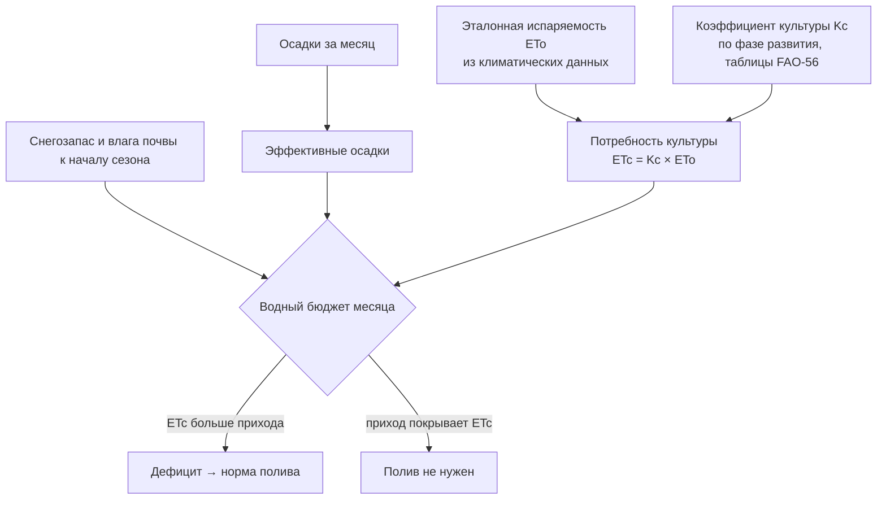

# Считаем водный бюджет участка: сколько воды нужно культуре и где её взять

> ⏱ **Трудозатраты:** ~16 мин чтения + ~25 мин практики
> Модуль **П12: Водосбережение и ирригация**, урок 1 из 3.
> Профессиональный уровень (МСБ). Проект UNDP-KAZ FOLUR. Компоненты FOLUR: **2**, **3**.

## Цели урока и место в модуле

Любой разговор об орошении начинается с двух вопросов: **сколько воды нужно культуре** и **сколько воды у вас реально есть**. Пока на оба вопроса нет ответа в цифрах, обсуждать капельные линии, насосы и субсидии бессмысленно: система, посчитанная «на глаз», либо не доносит воду до растений в июльскую жару, либо стоит вдвое дороже необходимого. В этом уроке мы соберём водный бюджет участка — простую таблицу «приход воды − расход воды = дефицит», научимся считать потребность культуры по международной методике FAO-56 на бесплатных открытых данных и разберём, какие источники воды доступны хозяйству степной зоны и как их оценивать. Результат урока — черновой водный бюджет модельного участка, который станет первой частью вашего проекта водосбережения.

После изучения урока слушатель сможет:

1. **[Bloom: знать]** перечислять статьи водного бюджета участка: осадки и их эффективную часть, снегозапас, испаряемость (ETo), потребность культуры (ETc), потери и дефицит.
2. **[Bloom: понимать]** объяснять, что такое эталонная испаряемость ETo и коэффициент культуры Kc, почему потребность в воде меняется по фазам развития растения и почему не каждый миллиметр осадков «работает» на урожай.
3. **[Bloom: применять]** составлять помесячный водный бюджет участка в СКО, Костанайской или Акмолинской области на открытых данных NASA POWER и климатических нормалях FAO CLIMWAT.
4. **[Bloom: анализировать]** сравнивать доступные хозяйству источники воды (пруд, скважина, река, снегозапас) по надёжности, ограничениям водопользования и достаточности объёма.

> **Границы урока.** Внутри: водный бюджет, методика расчёта потребности культуры в воде (рамка FAO-56), оценка источников воды и водосбережение до полива. За рамками: устройство капельных систем и датчики влажности — в [Уроке 2](02-kapelnoe-oroshenie-i-datchiki.md); экономика перехода и сборка проекта — в [Уроке 3](03-ekonomika-i-proekt-vodosberezheniya.md); физика водного баланса целого водосбора — в академической лекции [А4, Урок 1](../../a4/lectures/01-vodnyj-balans-stepnogo-vodosbora.md); обработка промеров глубин и объём водоёма — в модуле [П11](../../p11/index.md).

---

## 1. Почему водосбережение — тема номер один для степной зоны

Земледелие Северного Казахстана — преимущественно богарное: основная пшеничная пашня живёт на атмосферных осадках и запасе влаги от снеготаяния, без искусственного полива. Орошение в регионе — точечный, но быстрорастущий сегмент: овощи, картофель, кормовые культуры рядом с водоёмами, реками и скважинами. И именно здесь цена ошибки максимальна: вода в степи — лимитирующий ресурс, а её перерасход бьёт трижды — по деньгам (энергия на подачу), по почве (риск засоления и заболачивания) и по соседям по водосбору (меньше воды в общем источнике).

Отсюда два правила, на которых построен весь модуль. Первое: **водосбережение начинается до полива** — со снегозадержания, сохранения стерни и минимизации обработок; самый дешёвый кубометр воды тот, который вы не потеряли (агротехнике сохранения влаги посвящён модуль [П8](../../p8/index.md)). Второе: **поливать по расчёту, а не по привычке** — потребность культуры в воде меняется в разы в течение сезона, и одинаковая норма «раз в неделю всё лето» гарантированно означает перелив в июне и недолив в июле.

Международные рамки говорят о том же. FAO включает эффективность использования ресурсов — в первую очередь воды — в «10 элементов агроэкологии», а ориентир ЦУР 15.3 (нейтральный баланс деградации земель, LDN) прямо требует, чтобы орошение не превращало продуктивную землю в солончак. Программа FOLUR в Казахстане поддерживает устойчивые практики (компонент 2) и восстановление (компонент 3) — грамотный водный бюджет хозяйства работает на оба компонента.

> **Подробнее** — о водном балансе целого степного водосбора, снеговом стоке и подземных водах рассказывает академическая лекция [А4, Урок 1](../../a4/lectures/01-vodnyj-balans-stepnogo-vodosbora.md). Здесь мы уменьшаем ту же логику до масштаба одного участка.

---

## 2. Водный бюджет участка: приход, расход, дефицит

Водный бюджет — это баланс, как в бухгалтерии, только вместо тенге — миллиметры воды (1 мм осадков на 1 га = 10 м³ воды). Логика на одной строке:

**Дефицит = Потребность культуры (ETc) − Эффективные осадки − Доступный запас влаги в почве**

Если дефицит положительный, его нужно закрыть поливом (или согласиться на снижение урожая). Если отрицательный или нулевой — полив не нужен, и вложения в систему орошения экономически не обоснованы.



*Рис. 1. Водный бюджет участка: потребность культуры ETc сравнивается с эффективными осадками и запасом влаги; положительная разница — дефицит, который закрывается поливом. Alt: блок-схема — осадки и запас влаги складываются в приход; ETo умножается на Kc и даёт ETc; сравнение прихода и ETc ведёт либо к дефициту и норме полива, либо к выводу «полив не нужен».*

### 2.1 Потребность культуры: ETo, Kc и ETc

Расход воды полем складывается из испарения с поверхности почвы и транспирации — «дыхания» растений. Вместе это эвапотранспирация. Международный стандарт её расчёта — методика **FAO-56** (FAO Irrigation and Drainage Paper 56), и она устроена из двух множителей:

- **ETo — эталонная испаряемость**: сколько воды испарила бы за период идеальная травяная поверхность при данной погоде. ETo зависит только от климата — температуры, солнечной радиации, ветра, влажности воздуха — и берётся из климатических данных, а не измеряется на поле.
- **Kc — коэффициент культуры**: поправка на то, что ваша культура — не эталонный газон. Kc меняется по фазам: у только что взошедшего картофеля он низкий (поле почти голое, транспирировать нечему), в фазу максимального развития листвы — наибольший, к созреванию снова снижается. Значения Kc по культурам и фазам опубликованы в таблицах FAO-56 — **не придумывайте их и не берите «со слов»: всегда указывайте источник коэффициента**.

Итог перемножения — **ETc = Kc × ETo** — фактическая потребность культуры в воде за период. Считать её вручную по формуле Пенмана—Монтейта не нужно: бесплатная программа FAO **CROPWAT** делает это автоматически по климатическим нормалям из базы **CLIMWAT** (в базе есть метеостанции по всему миру — выберите ближайшую к вашему участку), а помесячные ряды осадков и температур для любой точки даёт открытый сервис **NASA POWER** (power.larc.nasa.gov) — без регистрации и оплаты.

### 2.2 Осадки: сколько из них «работает»

Не каждый миллиметр дождя доходит до корней. Часть ливня стекает по поверхности, часть испаряется с листвы и горячей почвы, не успев впитаться; слабая морось может вовсе не промочить корнеобитаемый слой. Поэтому в бюджете участвуют **эффективные осадки** — та доля измеренных осадков, что реально пополнила влагу почвы. CROPWAT предлагает несколько стандартных способов оценки эффективной части (в том числе метод USDA) — для чернового бюджета достаточно любого из них, важно лишь указать, какой использован.

Отдельная статья прихода степной зоны — **снегозапас**. Влага от снеготаяния — главный ресурс богарного земледелия региона: она формирует запас в метровом слое почвы, с которого культура стартует весной. На неё влияет агротехника — высота стерни, кулисы, снегозадержание, — и это самый дешёвый способ «полить» поле. Оценка стартового запаса влаги — полевое измерение (влагомер, бурение) или качественная оценка по осени и зиме; в черновом бюджете допустимо задать её сценарно: «низкий / средний / высокий запас».

> **Подробнее** — как формируется снеговой сток и почему степные водоёмы наполняются в короткое весеннее окно, объясняет [А4, Урок 1](../../a4/lectures/01-vodnyj-balans-stepnogo-vodosbora.md); агротехника влагонакопления — предмет модуля [П8](../../p8/index.md).

---

## 3. От дефицита к нормам: оросительная и поливная нормы

Дефицит из водного бюджета превращается в два практических числа.

**Оросительная норма** — сколько воды всего нужно подать за сезон (мм или м³/га). Это сумма месячных дефицитов за вегетацию. Она отвечает на вопрос «хватит ли моего источника»: сезонную потребность в кубометрах сравниваем с тем, что источник может отдать (раздел 4).

**Поливная норма** — сколько воды подать за один полив. Её задаёт не календарь, а почва: корнеобитаемый слой — это «бак» конечного размера. Классическая агрогидрологическая формула поливной нормы:

**m = 100 × h × (β_ППВ − β_факт)**,

где h — глубина корнеобитаемого слоя (м), β_ППВ — влажность почвы при предельной полевой влагоёмкости, β_факт — фактическая влажность перед поливом (обе — в объёмных процентах); результат — м³/га. Смысл прост: доливаем ровно столько, чтобы заполнить «бак» до полевой влагоёмкости, — всё, что сверх, уйдёт ниже корней и потеряно (а в плохом сценарии поднимет солёные грунтовые воды). Величины β для вашей почвы — из агрохимического обследования или полевого измерения; типовые значения по типам почв есть в справочниках почвоведения — как и с Kc, фиксируйте источник каждой цифры.

Разберём арифметику на **условном примере** (числа иллюстративные, не норматив): пусть корнеобитаемый слой h = 0,5 м, ППВ вашей почвы — 30% объёма, датчик перед поливом показывает 22%. Тогда m = 100 × 0,5 × (30 − 22) = 400 м³/га, или 40 мм осадочного эквивалента. Если сезонный дефицит из бюджета составил, скажем, 2000 м³/га, системе предстоит около пяти таких поливов за вегетацию — и эта оценка сразу превращается в требования к источнику (успевает ли он восполняться между поливами?) и к производительности системы (успеваем ли полить весь клин за допустимый интервал?).

Обратите внимание на дисциплину единиц — самый частый источник ошибок в расчётах, в том числе у ИИ-ассистентов: осадки и испаряемость считаются в миллиметрах, нормы — в м³/га, и связывает их множитель 10 (1 мм = 10 м³/га). Держите единицы в каждой колонке таблицы бюджета и проверяйте перевод хотя бы в одной строке вручную — это правило пригодится и в [ИИ-задании модуля](../ai-assistant.md).

Число поливов за сезон ≈ оросительная норма ÷ поливная норма. Когда именно поливать — подскажут датчики влажности, о них [Урок 2](02-kapelnoe-oroshenie-i-datchiki.md).

!!! warning "Черновой расчёт — не проект"
    Бюджет по климатическим нормалям — это средний год. Реальные годы отклоняются от нормы в обе стороны, поэтому проект системы (Урок 3) обязан включать сценарий засушливого года: потребность выше средней, приход ниже среднего. Считать по среднему и строить «впритык» — типичная ошибка, из-за которой системы орошения простаивают именно тогда, когда нужны больше всего.

---

## 4. Где взять воду: источники и их честная оценка

Сезонная потребность посчитана — теперь вопрос к источнику. У хозяйства степной зоны варианты обычно такие:

| Источник | Сильные стороны | Что проверять |
|---|---|---|
| Пруд / малое водохранилище | Вода рядом, наполняется весенним стоком | Фактический объём и заиление, испарение за лето, права на воду |
| Река / канал | Стабильнее пруда | Разрешение на забор, сезонные ограничения, удалённость |
| Скважина | Независимость от поверхностного стока | Дебит (сколько даёт в час), качество воды (минерализация!), разрешительные требования |
| Снегозапас + влага почвы | Бесплатно, работает на всей площади | Управляется агротехникой, а не краном; не заменяет полив овощей |

Три обязательные проверки для любого источника.

**Объём и надёжность.** У пруда объём меняется от года к году и от заиления. Оценить его помогает батиметрия: модуль [П11](../../p11/index.md) учит превращать промеры глубин в карту и кривую «уровень–объём» — на учебном датасете платформы (обезличенные промеры водохранилища степной зоны Казахстана, уровни A/B политики данных, без геопривязки). Помните и о конкуренте, который пьёт из вашего пруда без разрешения, — об испарении: за жаркое степное лето открытое зеркало теряет слой воды, сопоставимый с летними осадками и больше, поэтому весенний объём нельзя целиком записывать в приход — часть его «выпьет» атмосфера до пика потребности культуры. Простейшая проверка — сравнить площадь зеркала на весеннем и позднелетнем снимках Sentinel-2 (это вы сделаете в практикуме). Для скважины аналог объёма — **дебит**: сколько кубометров в час она отдаёт устойчиво, а не в первые минуты; честный ответ даёт только пробная откачка, а не паспорт двадцатилетней давности. Для чернового бюджета достаточно консервативной оценки: сколько воды источник гарантированно отдаёт в засушливый год.

**Качество воды.** Для капельного орошения критична взвесь (забивает капельницы — понадобится фильтрация, [Урок 2](02-kapelnoe-oroshenie-i-datchiki.md)), для почвы — минерализация: полив солоноватой водой из скважины годами — прямой путь к вторичному засолению. Анализ воды в аккредитованной лаборатории — обязательная строка проекта.

**Правовой режим.** Забор воды на орошение — регулируемое водопользование. Какие объёмы и типы забора требуют разрешения, каковы условия для вашего источника — проверяется **только по действующей редакции водного законодательства РК на официальном источнике (adilet.zan.kz)** и в уполномоченных органах. Урок намеренно не приводит числовых порогов и формулировок норм: они меняются, а проект, построенный на пересказе, — юридический риск. Записывайте в проект не «слышал, что можно», а «проверено: [реквизиты акта, дата проверки]».

И последняя привычка, которая объединяет все три проверки: **поставьте водомер**. Счётчик на подаче — самый дешёвый прибор проекта и единственный способ узнать, сколько воды вы действительно берёте и теряете; без него и водный бюджет, и будущая экономика перехода ([Урок 3](03-ekonomika-i-proekt-vodosberezheniya.md)) остаются теорией.

---

## 5. Водосбережение до полива: самый дешёвый кубометр

Прежде чем проектировать подачу воды, посчитайте, сколько её можно не терять. Три направления, ранжированные по стоимости от нуля и выше:

1. **Сохранить то, что выпало**: высокая стерня и кулисы задерживают снег; отказ от лишних обработок и покровные приёмы снижают испарение с поверхности; мульча на овощных грядах — то же самое в малом масштабе. Это агротехника модуля [П8](../../p8/index.md), и она работает на всей площади хозяйства, а не только на орошаемом клине.
2. **Не терять при доставке**: открытые земляные канавы и негерметичные магистрали теряют воду на фильтрацию и испарение по пути к полю. Закрытые трубопроводы и исправная арматура — скучная, но окупаемая часть проекта.
3. **Не терять при поливе**: способ полива определяет, какая доля поданной воды дойдёт до корней. Сравнение способов — полностью [Урок 2](02-kapelnoe-oroshenie-i-datchiki.md).

Смысл ранжирования: каждая ступень дешевле следующей. Хозяйство, которое строит капельную систему, но теряет снегозапас на выдутых полях с низкой стернёй, оплачивает насосом ту воду, которую могло получить бесплатно.

---

## Региональный кейс

**Ситуация:** Хозяйство в Акмолинской области выращивает картофель на участке рядом с прудом, наполняемым весенним стоком. До сих пор поливали дождевальной машиной «по ощущениям — когда ботва подвяла». Руководитель хочет понять: сколько воды на самом деле нужно картофельному клину за сезон и хватит ли пруда в засушливый год, прежде чем обсуждать с поставщиком переход на капельное орошение.

**Данные:** NASA POWER (power.larc.nasa.gov, Data Access Viewer) — помесячные осадки и температуры для точки участка за последние десятилетия; FAO CLIMWAT — климатические нормали ближайшей метеостанции для CROPWAT; Sentinel-2 в браузере Copernicus (dataspace.copernicus.eu) — снимки пруда в апреле–мае и в августе для сравнения площади зеркала; OpenStreetMap — контуры пруда и участка.

**Задача:**

1. Составить помесячный водный бюджет картофельного клина на средний год: ETc по CROPWAT (Kc — из таблиц FAO-56), эффективные осадки, дефицит по месяцам.
2. Сравнить площадь зеркала пруда на весеннем и позднелетнем снимках Sentinel-2: насколько источник «усыхает» к пику потребности культуры?
3. Сформулировать, каких данных не хватает для решения о капельной системе, и где их взять.

**Разбор:** Бюджет покажет типичную для региона картину: пик дефицита приходится на середину лета — на фазу максимального Kc картофеля, когда осадки минимальны, а испаряемость максимальна; конкретные значения слушатель вычисляет сам по выбранной станции — урок намеренно не приводит готовых цифр. Сравнение снимков почти всегда обнаруживает, что зеркало пруда к августу заметно сокращается, — то есть номинальный весенний объём нельзя целиком записывать в приход. Список недостающих данных должен включить: фактическую кривую «уровень–объём» пруда (мост к [П11](../../p11/index.md)), анализ качества воды, правовой статус водопользования (adilet.zan.kz) и запас влаги почвы весной. Этот же кейс продолжается в [практикуме](../practicum/01-proekt-vodosberezheniya.md) — там бюджет собирается пошагово.

---

## Закрепление и применение

!!! tip "Что это даёт вашему хозяйству"
    Водный бюджет за один вечер отвечает на вопрос, за который консультанты берут деньги: нужен ли вам полив вообще, и если да — сколько воды искать. Часто расчёт показывает обратное интуиции: либо дефицит закрывается агротехникой влагонакопления без капвложений, либо источник заведомо мал и сначала надо решать вопрос воды, а не покупать капельные линии.

!!! example "Попробуйте в Colab"
    Ноутбук урока строит помесячный водный бюджет по данным NASA POWER для любой точки Северного Казахстана: вы вводите координаты участка и культуру — получаете таблицу и график «осадки против ETc». Ссылка: `<URL будет назначен при создании репозитория ноутбуков>`. Задание полностью выполнимо и без ноутбука — в CROPWAT или обычной таблице.

!!! warning "Границы применимости"
    Рамка FAO-56 считает потребность культуры, а не даёт агрономический рецепт: она не учитывает засоление, уровень грунтовых вод, болезни и сортовые особенности. Климатические нормали описывают средний год — проект обязан проверяться на сценарии засухи. И главное: бюджет по открытым данным — черновой инструмент решения «стоит ли углубляться», а не замена проектной документации на систему орошения.

!!! question "Кейс для размышления"
    Сосед говорит: «Я поливаю каждые три дня по часу — и всё растёт, зачем твои расчёты?» В какие месяцы его схема почти наверняка переливает, а в какие недоливает — и какие двa скрытых убытка несёт каждый из режимов? (Подсказка: вспомните, как Kc меняется по фазам, и что происходит с водой, поданной сверх полевой влагоёмкости.)

### Проверь себя

```quiz
[
  {
    "q": "Что такое ETc в рамке FAO-56 и как оно получается?",
    "options": ["Потребность конкретной культуры в воде: эталонная испаряемость ETo, умноженная на коэффициент культуры Kc по фазе развития", "Количество осадков, реально дошедших до корней", "Максимальная влажность почвы, которую она способна удержать", "Объём воды, который источник отдаёт за сезон"],
    "answer": 0,
    "explain": "§2.1: ETc = Kc × ETo; ETo зависит только от климата, Kc — поправка на культуру и фазу её развития (таблицы FAO-56)."
  },
  {
    "q": "Почему в водном бюджете используются «эффективные осадки», а не просто сумма осадков?",
    "options": ["Часть осадков стекает по поверхности и испаряется, не пополнив влагу корнеобитаемого слоя, — работает на урожай только оставшаяся доля", "Метеостанции систематически завышают осадки", "Эффективные осадки — это осадки только за вегетационный период", "Так требует водное законодательство РК"],
    "answer": 0,
    "explain": "§2.2: до корней доходит не весь дождь — эффективная часть оценивается стандартными методами (например, USDA в CROPWAT), с указанием использованного метода."
  },
  {
    "q": "Чем поливная норма отличается от оросительной?",
    "options": ["Поливная — объём одного полива, ограниченный ёмкостью корнеобитаемого слоя; оросительная — суммарная подача за сезон", "Это синонимы, разница только в единицах измерения", "Поливная норма — для капельного орошения, оросительная — для дождевания", "Оросительная норма всегда меньше поливной"],
    "answer": 0,
    "explain": "§3: оросительная норма — сумма месячных дефицитов за вегетацию (хватит ли источника); поливная — m = 100·h·(β_ППВ − β_факт), сколько «бак» почвы вмещает за раз."
  },
  {
    "q": "Хозяйство планирует полив из скважины. Какая проверка защищает от долгосрочной порчи земли?",
    "options": ["Лабораторный анализ минерализации воды: полив солоноватой водой годами ведёт к вторичному засолению", "Проверка цвета воды на глаз", "Замер температуры воды в скважине", "Сравнение глубины скважины со скважиной соседа"],
    "answer": 0,
    "explain": "§4: качество воды — обязательная проверка источника; минерализация опасна не сразу, а накопительно, поэтому нужен лабораторный анализ, а не осмотр."
  },
  {
    "q": "Почему «самый дешёвый кубометр — тот, который не потеряли»?",
    "options": ["Снегозадержание и сохранение влаги агротехникой дают воду на всей площади без затрат на подачу — каждая следующая ступень (доставка, полив) дороже предыдущей", "Потому что вода из пруда бесплатна по закону", "Потому что потери воды невозможно измерить", "Это верно только для орошаемых участков"],
    "answer": 0,
    "explain": "§5: ступени водосбережения ранжированы по стоимости — сохранить выпавшее (агротехника, П8) дешевле, чем не терять при доставке, и тем более дешевле, чем подать насосом."
  }
]
```

## Что дальше?

Водный бюджет отвечает «сколько». Следующий вопрос — «как»: [Урок 2 «Выбираем технологию полива: капельное орошение, дождевание и датчики влажности»](02-kapelnoe-oroshenie-i-datchiki.md) сравнивает способы полива по потерям, разбирает устройство капельной системы и учит назначать полив по датчикам, а не по календарю. Если ваш источник — пруд или водохранилище, параллельно загляните в [П11](../../p11/index.md): оценка объёма водоёма по промерам глубин. Агротехника влагонакопления на богаре — в [П8](../../p8/index.md).
