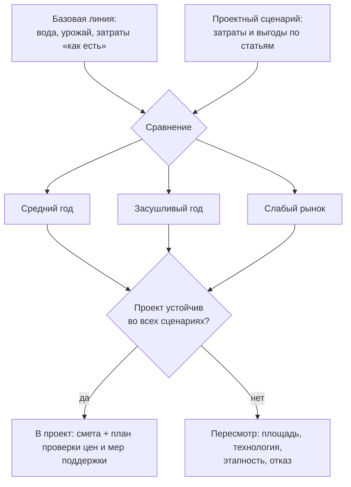

# Считаем экономику перехода и собираем проект водосбережения

> ⏱ **Трудозатраты:** ~15 мин чтения + ~25 мин практики
> Модуль **П12: Водосбережение и ирригация**, урок 3 из 3.
> Профессиональный уровень (МСБ). Проект UNDP-KAZ FOLUR. Компоненты FOLUR: **2**, **3**.

## Цели урока и место в модуле

Водный бюджет посчитан ([Урок 1](01-vodnyj-byudzhet-uchastka.md)), технология выбрана ([Урок 2](02-kapelnoe-oroshenie-i-datchiki.md)). Остался вопрос, который решает судьбу любого агротехнического новшества: **экономика**. В этом уроке мы разложим затраты на переход к водосберегающему орошению по статьям, научимся честно считать выгоду — без «продавцовских» обещаний и выдуманных процентов, — разберём, как проверять меры господдержки по официальным источникам, и соберём всё в прикладной продукт модуля: проект системы водосбережения для модельного участка. Результат урока — каркас проектного документа, который вы заполните в [практикуме](../practicum/01-proekt-vodosberezheniya.md).

После изучения урока слушатель сможет:

1. **[Bloom: знать]** перечислять статьи капитальных и эксплуатационных затрат системы орошения и обязательные разделы проекта водосбережения.
2. **[Bloom: понимать]** объяснять логику окупаемости (что с чем сравниваем, почему нужна базовая линия) и правило работы с господдержкой: «в проект попадают только проверенные условия, субсидия — бонус, а не основа экономики».
3. **[Bloom: применять]** собирать проект системы водосбережения: схема участка, водный бюджет, технологическое решение, структура затрат с планом её проверки, риски и сценарий засушливого года.
4. **[Bloom: анализировать]** критически проверять экономические расчёты — от поставщика, консультанта или ИИ-ассистента: находить неучтённые статьи затрат, необоснованные прибавки урожая и невериифицированные «субсидии».

> **Границы урока.** Внутри: структура затрат и выгод, базовая линия сравнения, работа с господдержкой без выдуманных сумм, сборка проектного документа и риски. За рамками: сами расчёты потребности в воде — [Урок 1](01-vodnyj-byudzhet-uchastka.md); выбор оборудования — [Урок 2](02-kapelnoe-oroshenie-i-datchiki.md); процедура подачи заявок на господдержку и типовые ошибки заявителя — целиком модуль [П14](../../p14/index.md); маркетинг «зелёной» продукции с орошаемого клина — [П15](../../p15/index.md).

---

## 1. Из чего складывается цена перехода

Первая ошибка в экономике орошения — посчитать только «железо». Полная структура затрат выглядит так.

**Капитальные затраты (один раз):**

- проектирование и изыскания (анализ воды и почвы, топография участка);
- водозаборный узел и насосная станция;
- фильтростанция (для капли — обязательная, см. [Урок 2, §2](02-kapelnoe-oroshenie-i-datchiki.md));
- магистральные и распределительные трубопроводы, арматура;
- капельные линии или дождевальное оборудование;
- узел фертигации, датчики влажности, автоматика (опционально);
- электроснабжение или иной источник энергии для насоса;
- монтаж и пусконаладка.

**Эксплуатационные затраты (каждый сезон):**

- энергия на подачу воды — статья, растущая с каждым лишним поданным кубометром (ещё один аргумент поливать по датчикам, а не по календарю);
- замена расходников: тонкостенные капельные ленты служат сезон-два, многолетние трубки дольше, но дороже на старте;
- обслуживание: промывка фильтров и линий, консервация на зиму, ремонт;
- труд оператора системы;
- плата за водопользование, если она предусмотрена условиями вашего разрешения (проверяется по официальным источникам, см. §3);
- лабораторный контроль воды и почвы (периодически).

Есть и третья группа — **скрытые затраты**, которые не пишут ни в одном коммерческом предложении: обучение того, кто будет вести систему (регламент из [Урока 2, §2.1](02-kapelnoe-oroshenie-i-datchiki.md) сам себя не выполнит); время руководителя на проект, разрешения и приёмку; неизбежно «учебный» первый сезон, когда система выходит на расчётный режим не сразу; демонтаж и утилизация однолетней ленты. Эти статьи не всегда переводятся в тенге заранее, но перечислить их в проекте обязательно — хотя бы для честного плана времени.

Урок сознательно **не приводит цен**: они различаются по поставщикам, годам и конфигурациям, и любое «типичное» число устареет раньше, чем вы дочитаете модуль. Вместо цен проект содержит **план получения цен**: перечень статей + запрос коммерческих предложений минимум у двух-трёх поставщиков + сметная строка «непредвиденные». Это и есть профессиональный стандарт: структура — из методики, числа — из актуальных документов.

---

## 2. Как честно считать выгоду

Выгода перехода — это разница между «стало» и «было бы без проекта». Отсюда три правила.

**Правило базовой линии.** Сначала зафиксируйте текущее состояние: фактический расход воды (по счётчику насоса — поставьте его до проекта, если нет), фактический урожай участка за несколько лет, фактические затраты на полив — энергия, труд, ремонты. Без базовой линии любой «эффект» после внедрения недоказуем — как для вас, так и для банка или программы поддержки: сравнивать «стало» будет просто не с чем, и место измеренной выгоды займут воспоминания и впечатления. Это тот же принцип независимой верификации, что и в ИИ-слое платформы: утверждение без проверяемой точки отсчёта — не результат.

**Правило источника прибавки.** Выгода складывается из проверяемых компонентов: меньше воды на единицу продукции (меньше энергии на подачу), равномернее полив (меньше выпадов и брака), фертигация (точнее питание), меньше ручного труда. Прибавка урожая возможна, но **в проект она попадает только с обоснованием**: данные опытов по вашей культуре и зоне, результаты соседних хозяйств с подтверждением, либо консервативный сценарный диапазон с пометкой «оценка». Обещание «урожай вырастет в разы» из рекламного буклета — не обоснование.

**Правило сценариев.** Экономика считается минимум в трёх сценариях: средний год, засушливый год (потребность в воде выше, источник скуднее — выдержит ли система и бюджет?), неудачный год по рынку (цена продукции ниже — не превращается ли проект в убыток?). Сценарии не выдумываются: засушливый год берётся из фактического климатического ряда (худший год вашей выгрузки NASA POWER — так вы уже делали в водном бюджете [Урока 1](01-vodnyj-byudzhet-uchastka.md)), слабый рынок — из фактических цен неудачного сезона в записях хозяйства. Система, окупаемая только в идеальный год, — не инвестиция, а лотерея.



*Рис. 1. Логика экономической оценки: базовая линия против проектного сценария, проверка в трёх сценариях, решение. Alt: блок-схема — базовая линия и проектный сценарий сходятся в сравнение, которое проверяется на среднем годе, засушливом годе и слабом рынке; если проект устойчив во всех трёх — переходим к смете, иначе пересматриваем масштаб или технологию.*

Полезный производный показатель — **продуктивность воды**: продукция (или выручка) на кубометр поданной воды. Он сравним между годами и участками и показывает суть водосбережения лучше валового урожая: цель не «лить меньше любой ценой», а получать больше с каждого кубометра. На **условном примере** (числа иллюстративные): если блок дал 30 тонн продукции при 6000 м³ поданной воды, продуктивность — 5 кг/м³; если после перехода тот же блок даёт 32 тонны при 4000 м³ — 8 кг/м³. Валовый урожай вырос «всего» на несколько процентов, и по нему проект выглядит скромно, — а продуктивность воды выросла в разы, и именно она показывает, что источника теперь хватит на больший клин. Считается показатель элементарно: урожай по блоку (весы) ÷ вода по блоку (водомер) — ещё один аргумент за счётчик и записи с первого дня.

---

## 3. Господдержка: проверять, а не верить

В Республике Казахстан действуют программы государственной поддержки агросектора, в том числе связанные с орошением и сельхозтехникой; их перечень, условия и ставки периодически меняются. Именно поэтому модуль устанавливает жёсткое правило: **ни одна сумма, процент возмещения или название программы не попадает в проект «по памяти», со слов поставщика или из выдачи ИИ-ассистента.** Каждая мера поддержки в проекте сопровождается тремя реквизитами: официальный источник (adilet.zan.kz — тексты НПА, gov.kz — акимат и профильное министерство, официальные операторы программ), дата проверки, конкретное условие, которому ваше хозяйство соответствует или нет.

Почему так строго? Три типовых провала: программа закрылась или изменила условия (устаревшие пересказы живут годами); хозяйство не проходит по формальному критерию, о котором продавец «забыл» упомянуть; экономика проекта построена на субсидии как на гарантии — а решение по заявке отрицательное. Отсюда второе правило: **субсидия — бонус к жизнеспособному проекту, а не его фундамент.** Считайте окупаемость сначала без поддержки; если проект живёт только на субсидии — возвращайтесь к блоку пересмотра на рис. 1.

Как выглядит проверка на практике: находите текст программы или НПА в действующей редакции (adilet.zan.kz), выписываете точное название, реквизиты и пункт с условием; сверяете формальные критерии с документами своего хозяйства; фиксируете в проекте строку «мера → реквизиты → пункт условия → соответствие: да/нет/требует уточнения → дата проверки». Устные консультации — в акимате, у официального оператора программы, в профильном управлении — полезны как навигатор, но в проект попадает документ, а не разговор: «нам сказали, что положено» не переживёт первой проверки заявки.

> **Подробнее** — как устроены программы господдержки и международные инструменты (ПРООН, GEF, FAO), как готовится заявка и какие типовые ошибки её топят — модуль [П14](../../p14/index.md). Продуктом П12 — проектом водосбережения — вы будете обосновывать заявку; готовит и подаёт её методика П14.

---

## 4. Собираем проект системы водосбережения

Прикладной продукт модуля — документ, который можно положить на стол консультанту, поставщику или в заявку. Обязательные разделы:

1. **Паспорт участка.** Расположение (область, район — без точных координат в публичной версии документа), площадь, культура и схема посадки, почва (что известно и из какого источника), источник воды и его правовой статус («проверено: [реквизиты], [дата]» или «требует проверки»). Если участок входит в ландшафтный план хозяйства по модулю [П5](../../p5/index.md) — сошлитесь на соответствующую зону плана.
2. **Схема.** Контур участка, источник, трасса подачи, деление на поливные блоки, точки датчиков — поверх открытой подложки (OpenStreetMap/Sentinel-2). Строится в [практикуме](../practicum/01-proekt-vodosberezheniya.md).
3. **Водный бюджет.** Помесячная таблица из [Урока 1](01-vodnyj-byudzhet-uchastka.md): осадки, ETc, дефицит; оросительная и поливная нормы; сверка с возможностями источника; сценарий засушливого года. У каждой цифры — источник (NASA POWER, CLIMWAT, таблицы FAO-56, полевые измерения).
4. **Технологическое решение.** Выбор по решающему дереву [Урока 2](02-kapelnoe-oroshenie-i-datchiki.md) с обоснованием; состав узлов; требования к фильтрации по анализу воды; схема датчиков и правило назначения полива.
5. **Экономическая часть.** Структура затрат (§1) с планом получения цен; базовая линия (§2); сценарная оценка; меры поддержки со статусом проверки (§3).
6. **Риски и план первого сезона.** Засуха, отказ узлов, засоление, организационные риски (§4 Урока 2); что измеряем в первый сезон (счётчик воды, датчики, урожай по блокам, NDVI-контроль через [П3](../../p3/index.md)) — чтобы через год у проекта появились собственные данные вместо допущений.

Практическое замечание о версиях документа. Проект живёт в двух вариантах: **внутренний** — со всеми деталями, контактами, черновиками КП — и **публичный**, который уходит консультанту, поставщику или в заявку. В публичной версии не место точным координатам участка и скважин, внутренним финансовым данным сверх необходимого и персональным данным работников; правило то же, что и во всей платформе: наружу — только то, что нужно задаче, и то, чем вы вправе делиться. Датируйте версии — через год вы будете благодарны себе за возможность показать, какие допущения были сделаны «на тот момент».

Хороший тест качества проекта: **любой скептик может проверить каждое число** — либо по указанному источнику, либо по описанной процедуре («запросить КП», «заказать анализ»). Число без источника — это не данные, это мнение.

Готовый проект — ещё и сценарий переговоров с поставщиком. Минимальный чек-лист вопросов, который из него следует:

1. Какая фильтрация заложена под **мой** анализ воды (приложите анализ — и требуйте обоснование схемы, а не «стандартный комплект»)?
2. Компенсированные ли эмиттеры и как учтён мой рельеф и длина линий?
3. Что из перечня статей §1 **не входит** в предложение: проект, монтаж, электрика, датчики, расходники следующих сезонов?
4. Каков регламент обслуживания и что происходит с гарантией при его нарушении?
5. Какие измеримые параметры системы фиксируются при приёмке (давление по блокам, равномерность смачивания) — и войдут в акт?

Поставщик, которого раздражают эти вопросы, сам сообщил вам важную информацию о будущем сервисе.

---

## 5. Этапность: пилотный блок вместо всего участка сразу

Самое недооценённое экономическое решение — **не масштаб системы, а порядок внедрения**. Переводить весь участок за один сезон — значит совершить все ошибки первого года сразу на всей площади и за полный бюджет. Альтернатива — пилотный блок: один поливной блок с полноценной (не урезанной!) обвязкой — фильтрация по анализу воды, датчики на двух глубинах, водомер, журнал.

Что даёт пилот за один сезон:

- **собственные данные вместо допущений**: фактический расход воды и энергии, реальная урожайность блока, отклик культуры на пороги влажности — все «оценки» проекта заменяются измерениями;
- **дешёвые ошибки**: неудачный шаг эмиттеров, недооценённая фильтрация или неудобная схема блоков обнаруживаются на малой площади;
- **аргументы для финансирования**: заявка на поддержку или кредит под расширение, подкреплённая измеренным результатом пилота, разговаривает с банком и программой на другом языке, чем «поставщик обещал»;
- **обученного человека**: оператор, который провёл пилотный сезон по регламенту, — актив дороже любого оборудования.

Риск этапности один — растянутые сроки и повторные монтажные мобилизации; он честно вписывается в сравнение «всё сразу против пилота» в экономической части. Но для хозяйства, впервые входящего в капельное орошение, пилотный блок почти всегда выигрывает: он превращает второй этап проекта из веры в расчёт. Заметьте: это тот же принцип независимой верификации, на котором стоит вся платформа, — только проверяете вы здесь не ИИ-ассистента, а собственный проект.

---

## Региональный кейс

**Ситуация:** Крестьянское хозяйство в Северо-Казахстанской области держит овощной участок у пруда и продаёт продукцию в райцентр. Поставщик оборудования предложил «комплект капельного полива под ключ» и устно обещал: «расход воды упадёт вдвое, урожай вырастет в полтора раза, к тому же государство вернёт вам значительную часть затрат». Руководитель просит вас — как прошедшего модуль — проверить это предложение до подписания договора.

**Данные:** Коммерческое предложение поставщика (перечень оборудования и цена); водный бюджет участка, посчитанный по методике [Урока 1](01-vodnyj-byudzhet-uchastka.md) на данных NASA POWER; OpenStreetMap и Sentinel-2 (браузер Copernicus) — схема участка и пруда; официальные источники по мерам господдержки (adilet.zan.kz, gov.kz) — для проверки обещания «вернут значительную часть».

**Задача:**

1. Составить список статей затрат из §1, отсутствующих в «комплекте под ключ», и вопросов к поставщику по каждой.
2. Определить по правилам §2, какие из трёх обещаний («вдвое меньше воды», «в полтора раза больше урожай», «государство вернёт») могут попасть в проект и в каком статусе.
3. Сформулировать план проверки обещания о господдержке по §3: где, что и как проверяем.

**Разбор:** В типовых «комплектах» чаще всего не хватает фильтростанции под фактический анализ воды, электроснабжения насосной, монтажа, датчиков и расходников на следующие сезоны — каждая пропущенная статья превращается в «неожиданные» затраты первого года. Из обещаний ни одно не попадает в проект как факт: «вдвое меньше воды» проверяется только против базовой линии (есть ли у хозяйства счётчик и записи?); «в полтора раза больше урожай» — маркетинговое утверждение, в проект может войти лишь консервативный диапазон с пометкой «оценка» и обоснованием; «государство вернёт» — проверяется по официальным источникам с реквизитами и датой, до тех пор в экономике проекта не участвует. Ключевой вывод кейса: проект, собранный по методике модуля, превращает разговор с поставщиком из «верю/не верю» в список проверяемых пунктов — и это само по себе экономит деньги.

---

## Закрепление и применение

!!! tip "Что это даёт вашему хозяйству"
    Каркас проекта из §4 — многоразовый: тот же документ обосновывает решение перед партнёром, служит основой заявки на поддержку (через [П14](../../p14/index.md)) и планом первого сезона. А правило базовой линии — поставить счётчик воды и начать записи до внедрения — стоит почти ничего, но через год превращает ваши слова «стало лучше» в доказательство.

!!! warning "Границы применимости"
    Урок даёт структуру экономической оценки, а не готовые числа: цены, ставки поддержки и прибавки урожая в вашем проекте появляются только из актуальных документов и ваших данных. Сценарная оценка по трём сценариям — минимальный, а не исчерпывающий анализ рисков; для крупных вложений привлекайте финансового консультанта. Правовые условия водопользования и поддержки проверяются на дату подачи, а не на дату прохождения модуля.

!!! question "Кейс для размышления"
    Два соседних хозяйства поставили одинаковые капельные системы. Через два года одно называет проект лучшей инвестицией, второе демонтирует линии. Составьте список из пяти вопросов к обоим руководителям, который выявит настоящую причину расхождения. Сколько из ваших вопросов касаются оборудования, а сколько — воды, данных и организации? (Подсказка: перечитайте §4 Урока 2 и правило базовой линии.)

### Проверь себя

```quiz
[
  {
    "q": "Почему проект по методике модуля НЕ содержит цен на оборудование, но содержит перечень статей затрат?",
    "options": ["Цены меняются по поставщикам и годам — вместо них проект фиксирует структуру затрат и план получения актуальных цен (КП от двух-трёх поставщиков)", "Цены — коммерческая тайна, их запрещено записывать", "Статьи затрат важны только для бухгалтерии", "Потому что все системы стоят одинаково"],
    "answer": 0,
    "explain": "§1: структура — из методики, числа — из актуальных документов; «типичные» цены устаревают и вводят в заблуждение."
  },
  {
    "q": "Что такое базовая линия и зачем она нужна до внедрения системы?",
    "options": ["Зафиксированные фактические показатели «как есть» (расход воды, урожай, затраты) — без них эффект проекта недоказуем ни для вас, ни для банка или программы поддержки", "Минимальная цена системы у поставщика", "Линия магистрального трубопровода на схеме", "Норматив урожайности из справочника"],
    "answer": 0,
    "explain": "§2, правило базовой линии: выгода — это разница «стало» против «было бы без проекта»; точка отсчёта фиксируется до внедрения (счётчик воды, записи по урожаю)."
  },
  {
    "q": "Поставщик обещает «урожай вырастет в полтора раза». Как это утверждение попадает в проект?",
    "options": ["Только с обоснованием: данные опытов по культуре и зоне либо консервативный диапазон с пометкой «оценка»; рекламное обещание фактом не является", "Записывается как есть — поставщик отвечает за свои слова", "Умножается на два для запаса", "Прибавку урожая учитывать запрещено в любом виде"],
    "answer": 0,
    "explain": "§2, правило источника прибавки: в проект входят проверяемые компоненты выгоды; необоснованные обещания отбраковываются или маркируются как оценка."
  },
  {
    "q": "Какое правило модуль устанавливает для мер господдержки в проекте?",
    "options": ["Каждая мера — с реквизитами официального источника (adilet.zan.kz, gov.kz), датой проверки и условием соответствия; окупаемость сначала считается без субсидии", "Достаточно слов поставщика — он работает с субсидиями каждый день", "Суммы поддержки берутся из ответа ИИ-ассистента", "Господдержку в проектах орошения учитывать нельзя"],
    "answer": 0,
    "explain": "§3: субсидия — бонус к жизнеспособному проекту, а не фундамент; условия проверяются только по официальным источникам с датой проверки. Процедура заявки — модуль П14."
  },
  {
    "q": "Зачем экономика проекта проверяется в сценарии засушливого года?",
    "options": ["В засуху потребность в воде выше, а источник скуднее — система и бюджет, посчитанные «впритык» по среднему году, отказывают именно тогда, когда нужны больше всего", "Засушливый год снижает цены на оборудование", "Это формальное требование банков", "В засушливый год полив не нужен"],
    "answer": 0,
    "explain": "§2, правило сценариев (и предупреждение Урока 1, §3): проект, устойчивый только в идеальный год, — лотерея, а не инвестиция."
  }
]
```

## Что дальше?

Все три урока пройдены — пора собрать продукт: [практикум «Проект системы водосбережения для модельного участка»](../practicum/01-proekt-vodosberezheniya.md) проведёт вас по шагам от схемы участка до готового документа. Затем [ИИ-задание модуля](../ai-assistant.md): чат-ассистент посчитает черновые нормы полива — а вы проверите его по методике [Урока 1](01-vodnyj-byudzhet-uchastka.md). Финал — [итоговая аттестация](../assessment/final.md) (порог 75%). Дальше по программе: [П14](../../p14/index.md) — превращение проекта в заявку на поддержку; [П11](../../p11/index.md) — если ваш источник — пруд и нужен его реальный объём.
