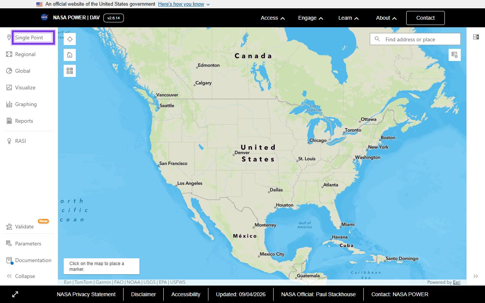
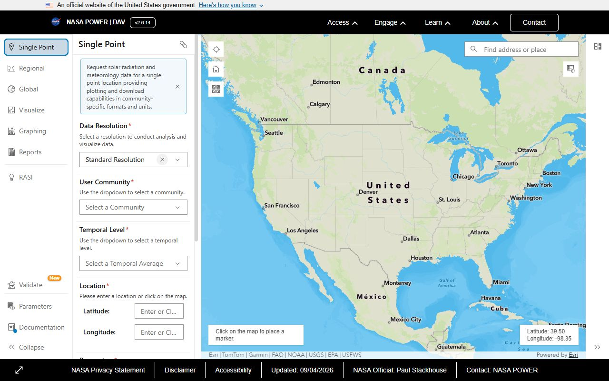

# Практикум: проект системы водосбережения для модельного участка

<!-- folur-software:start -->

!!! tip "Что понадобится в этом уроке и где это взять"
    Нажмите на название программы и увидите, **где её взять, что нажать и как она выглядит в работе** (нужная кнопка на снимке обведена фиолетовым). Встроенный редактор Python установки не требует. Полная справка — [«Программы и сервисы»](../../../software.md).

??? example "Встроенный редактор Python — как запустить и что получится"
    { .folur-shot loading=lazy }

    1. Скачивать и устанавливать ничего не нужно: редактор находится в этом уроке, на шаге **«Практика в Python»**.
    2. Нажмите **«▶ Запустить»** под кодом (на снимке обведена). В первый раз подождите до минуты, пока загрузится Python.
    3. Ниже, в блоке «Результат», появятся таблицы и графики. Измените число в коде и запустите ещё раз.
    4. Вкладка **«Мой участок»** над редактором считает то же по вашим координатам, контуру поля или снимку.

    **Как это выглядит в работе.** Пример результата: таблицы под кодом и кнопки скачивания файлов.

    { .folur-shot loading=lazy }

    **Как это выглядит в работе.** Вкладка «Мой участок»: координаты поля, контур и снимок подставляются здесь.

    { .folur-shot loading=lazy }

    [Подробно о редакторе, своих данных и запросе для нейросети →](../../../software.md#python)

??? example "QGIS — скачать и установить"
    { .folur-shot loading=lazy }

    1. Откройте <https://qgis.org/download/>. Сайт сначала предложит пожертвование — оно необязательно: нажмите **«Skip it and go to download»**.
    2. Нажмите зелёную кнопку **«Download LTR»** (на снимке обведена). LTR — версия долгосрочной поддержки, она стабильнее. Скачается установщик размером около 1 ГБ.
    3. Запустите скачанный файл и нажимайте «Next», ничего не меняя. После установки откройте в меню «Пуск» ярлык **QGIS Desktop**.

    **Как это выглядит в работе.** QGIS в работе (русский интерфейс): слева панели «Браузер» и «Слои», в центре — учебное поле на подложке OpenStreetMap с подписью площади, внизу справа — система координат проекта.

    { .folur-shot loading=lazy }

    [Первые шаги в QGIS и русский интерфейс →](../../../software.md#qgis)

??? example "Copernicus Browser — открыть в браузере"
    { .folur-shot loading=lazy }

    1. Скачивать ничего не нужно: откройте <https://browser.dataspace.copernicus.eu/>.
    2. В первом окне нажмите **«Use anonymously»** (на снимке обведена) — смотреть снимки можно без регистрации.
    3. Чтобы **скачивать** снимки, нужна бесплатная учётная запись: кнопка **«Log in»** → регистрация → подтверждение по письму.

    [Как найти своё поле и выбрать снимок →](../../../software.md#copernicus)

??? example "Google Colab — открыть в браузере"
    { .folur-shot loading=lazy }

    1. Скачивать ничего не нужно: откройте <https://colab.research.google.com/>.
    2. Нажмите **«Sign in»** справа вверху и войдите под аккаунтом Google.
    3. Нажмите **«New notebook»** — откроется пустой блокнот, в ячейку которого вставляется код из урока.

    **Как это выглядит в работе.** Учебный блокнот «Welcome to Colab» открывается и без входа: текст и ячейки с кодом идут сверху вниз.

    { .folur-shot loading=lazy }

    [Как запускать ячейки и загружать свои файлы →](../../../software.md#colab)

??? example "NASA POWER — открыть в браузере"
    { .folur-shot loading=lazy }

    1. Скачивать и регистрироваться не нужно: откройте <https://power.larc.nasa.gov/data-access-viewer/>.
    2. Слева выберите **«Single Point»** (на снимке обведена) — данные по одной точке.
    3. Укажите точку на карте, период и показатели, формат — CSV, и скачайте файл.

    **Как это выглядит в работе.** Панель «Single Point»: тип данных, период и поля Latitude / Longitude для координат точки.

    { .folur-shot loading=lazy }

    [Какие данные выбирать →](../../../software.md#nasa-power)

??? example "Таблицы: LibreOffice — скачать (или Google Таблицы без установки)"
    { .folur-shot loading=lazy }

    1. Если у вас есть Microsoft Excel или аккаунт Google (Google Таблицы работают в браузере) — ставить ничего не нужно.
    2. Иначе откройте <https://www.libreoffice.org/download/download-libreoffice/> и нажмите зелёную кнопку **«Windows (x86-64)»** (на снимке обведена).
    3. Запустите скачанный файл и нажимайте «Далее». Для таблиц открывайте программу **LibreOffice Calc**.

    [Как сохранять таблицу в CSV →](../../../software.md#office)

<!-- folur-software:end -->

!!! info "Вычисления в браузере"
    Для этого материала подготовлен [редактор Python](#python-practice). Он выполняет весь скрипт целиком; графики, изображения, таблицы и файлы появляются под кодом. Учебный пример запускается без аккаунта Google. Облачные API и полноценные настольные ГИС используются отдельно, когда этого требует исходное задание.

!!! info "Доступность данных"
    Файлы уровней B и C сняты с публикации. Карты и графики оставлены как учебные иллюстрации. Упоминания контрольной сетки в примерах относятся к локальному входному файлу, который не предоставляется сайтом; соответствующие шаги можно выполнять со своей сеткой. Для открытых упражнений доступен [набор уровня A на Zenodo](https://zenodo.org/records/23014446).

> Модуль **П12: Водосбережение и ирригация**. ⏱ **Трудозатраты:** 60–90 мин.

Порог сертификации — 75 %: квизы тем проверяли навыки по отдельности, ниже — связки, как в реальной работе. Сначала — практикум по шагам, затем ИИ-задание, банк и сценарный кейс. К аттестации предъявляются схема участка, таблица водного бюджета и проектный документ PDF из практикума и приложение «Верификация ИИ-черновика» из ИИ-задания.

## Практикум: проект системы водосбережения для модельного участка (по шагам)

Инструменты: браузер (NASA POWER, браузер Copernicus, OpenStreetMap), QGIS (бесплатно) — или любой редактор карт; табличный редактор (LibreOffice Calc / Google Sheets); опционально FAO CROPWAT + CLIMWAT (бесплатно).

Данные: только открытые — NASA POWER, Sentinel-2 (Copernicus Data Space Ecosystem), OpenStreetMap, data.egov.kz.

Цель практикума

<em>Собрать</em> проект системы водосбережения для модельного участка в Акмолинской области: схема участка и источника воды, помесячный водный бюджет на реальных климатических данных, технологическое решение со схемой датчиков и экономическая часть с планом проверки цен и мер поддержки.

Практикум собирает воедино все три урока модуля: водный бюджет, выбор технологии и экономику с каркасом проекта. Модельный сценарий продолжает региональный кейс Урока 1: картофельный клин у пруда в Акмолинской области.

Что нужно подготовить

QGIS (qgis.org, свободная лицензия) — установлен; либо используйте лёгкую альтернативу: инструмент рисования в браузере Copernicus. Базовые навыки QGIS — модуль П2.

Доступ к NASA POWER Data Access Viewer: &lt;<a href="https://power.larc.nasa.gov/data-access-viewer/&gt">https://power.larc.nasa.gov/data-access-viewer/&gt</a>; — без регистрации.

Доступ к браузеру Copernicus: &lt;<a href="https://dataspace.copernicus.eu/&gt">https://dataspace.copernicus.eu/&gt</a>; (бесплатная регистрация).

Табличный редактор (LibreOffice Calc, Google Sheets — любой).

Шаблон проектного документа: структура из Урока 3, §4 — шесть разделов.

Опционально: FAO CROPWAT 8.0 + CLIMWAT 2.0 (&lt;<a href="https://www.fao.org/land-water/resources/tools/software/cropwat/en&gt">https://www.fao.org/land-water/resources/tools/software/cropwat/en&gt</a>;, бесплатно, Windows; под Linux работает через Wine) — для расчёта ETc. Без CROPWAT задание выполняется в таблице по упрощённой схеме (шаг 3).

Задание

Шаг 1: выбираем модельный участок и рисуем схему (15 мин)

Откройте OpenStreetMap и найдите сельскую местность в Акмолинской области с прудом или малым водохранилищем рядом с полями (гидрография в OSM — синие полигоны). Подойдёт любой типичный участок — практикум учебный, привязка к конкретному хозяйству не требуется.

В QGIS: подключите подложку OSM (<code>Browser → XYZ Tiles → OpenStreetMap</code>), создайте GeoPackage-слой <code>uchastok</code> (полигоны) и нарисуйте: контур модельного участка (несколько десятков гектаров рядом с водоёмом) и контур источника воды. Добавьте линейный слой <code>podacha</code> — трассу подачи воды от источника к участку.

Разделите участок на 2–4 поливных блока (полигоны в том же слое, поле-атрибут <code>blok</code>), добавьте точечный слой <code>datchiki</code> — по 1–2 точки мониторинга влажности на блок (Урок 2, §3.3).

Экспортируйте схему: <code>Проект → Импорт/Экспорт → Сохранить карту как изображение</code> → <code>shema-uchastka.png</code>.

Ожидаемый результат: файл <code>proekt-p12.gpkg</code> со слоями <code>uchastok</code>, <code>podacha</code>, <code>datchiki</code> + картинка <code>shema-uchastka.png</code>, на которой видны участок, блоки, источник, трасса и точки датчиков.

Правовой режим данных.

В публичную версию схемы и документа не выносите точные координаты — области и района достаточно (Урок 3, §4). Если для оценки объёма источника используете учебную батиметрию платформы — только уровни A/B: обезличенный датасет <code>datasets/bathymetry-training-80k.csv</code> («водохранилище степной зоны Казахстана», локальная СК, без геопривязки) и сетка <code>modules/a4/data/bathymetry-grid-100m.tif</code>. Политика — Датасеты платформы.

Шаг 2: скачиваем климатические данные NASA POWER (10 мин)

Откройте Data Access Viewer: &lt;<a href="https://power.larc.nasa.gov/data-access-viewer/&gt">https://power.larc.nasa.gov/data-access-viewer/&gt</a>;.

Выберите сообщество Agroclimatology, временное разрешение Monthly &amp; Annual, кликните точку в центре вашего модельного участка.

Отметьте параметры: осадки (Precipitation), температура воздуха на 2 м (Temperature at 2 Meters). Задайте период не короче последних 20 полных лет. Скачайте CSV.

Откройте CSV в табличном редакторе и постройте климатическую норму: среднемноголетние осадки и температуру по каждому месяцу.

Ожидаемый результат: таблица <code>voda-byudzhet.ods/xlsx</code>, лист «Климат»: 12 строк-месяцев, колонки «осадки, мм (норма)» и «температура, °C (норма)», плюс строка-источник: «NASA POWER, точка [область/район], период [годы], дата выгрузки».

Шаг 3: считаем водный бюджет (20–25 мин)

Вариант А (рекомендуемый): CROPWAT. Загрузите климат ближайшей станции из CLIMWAT (или введите нормали из шага 2 вручную), выберите культуру «Potato» из стандартной базы (значения Kc по фазам — из таблиц FAO-56, встроены в программу), задайте даты посадки, типичные для региона. Программа вернёт помесячные ETo, ETc, эффективные осадки (укажите метод, например USDA S.C.) и потребность в орошении.

Вариант Б (таблица, без установки ПО). На листе «Бюджет»: для каждого месяца вегетации выпишите ETo по ближайшей станции из CLIMWAT (либо используйте связку «нормали шага 2 + встроенный редактор Python» — <a href="#python-practice">шаг «Практика в Python»</a>); Kc по фазам картофеля возьмите из таблиц FAO-56 (&lt;<a href="https://www.fao.org/4/x0490e/x0490e00.htm&gt">https://www.fao.org/4/x0490e/x0490e00.htm&gt</a>;) — с указанием таблицы-источника; посчитайте <code>ETc = Kc × ETo</code> и <code>дефицит = ETc − эффективные осадки</code> (для черновика допустимо консервативно принять эффективными не более ~70–80% осадков — зафиксируйте принятую долю как допущение в документе).

Итоги на листе «Бюджет»:

помесячный дефицит и оросительная норма (сумма за сезон, переведите мм → м³/га: 1 мм = 10 м³/га);

поливная норма по формуле Урока 1, §3 — значения ППВ и влажности перед поливом задайте сценарно, пометив «оценка, уточнить полевым измерением»;

сценарий засушливого года: пересчитайте дефицит по годам из ряда NASA POWER с минимальными летними осадками (возьмите фактический худший год из вашей выгрузки, а не выдуманный коэффициент).

Ожидаемый результат: заполненный лист «Бюджет»: у каждой цифры — источник (NASA POWER / CLIMWAT / FAO-56 / «оценка»); внизу — оросительная норма в м³/га для среднего и засушливого года.

Шаг 4: проверяем источник по снимкам Sentinel-2 (10 мин)

В браузере Copernicus найдите свой водоём. Откройте два безоблачных снимка Sentinel-2: конец апреля–май (после наполнения талыми водами) и август того же года.

Визуально сравните площадь зеркала (в браузере есть инструмент измерения площади — обведите зеркало на обоих снимках).

Запишите в документ: во сколько раз (примерно) сокращается зеркало к пику потребности культуры, и вывод — можно ли записывать весенний объём в приход целиком.

Ожидаемый результат: два скриншота (весна/август) с измеренной площадью зеркала + 2–3 предложения вывода в разделе «Паспорт участка».

Шаг 5: технологическое решение (10 мин)

По решающему дереву Урока 2, §1.1 обоснуйте выбор технологии для картофеля (2–3 предложения), перечислите узлы системы (Урок 2, §2) с пометкой, какие требования к каждому узлу диктует ваш источник (открытый водоём → двухступенчатая фильтрация), и опишите правило назначения полива по датчикам из вашей схемы шага 1 (пороги — «задать по справочным данным культуры, источник указать»).

Ожидаемый результат: раздел «Технологическое решение» проектного документа (0,5–1 страница).

Шаг 6: экономическая часть и сборка документа (15–20 мин)

Перенесите в документ структуру затрат из Урока 3, §1 — таблицей «статья → как получаем цену (КП №1, КП №2, смета) → статус». Цены не выдумывайте: у учебного проекта все статусы — «запросить КП».

Опишите базовую линию: что и чем измеряем до внедрения (счётчик воды, записи урожая по блокам).

Раздел «Господдержка»: таблица «мера → где проверяем (adilet.zan.kz / gov.kz) → статус: не проверено». Проверка реальных программ — за рамками практикума, в проект попадает только план проверки (Урок 3, §3).

Раздел «Риски и план первого сезона»: минимум четыре риска с мерами (Урок 3, §4, Урок 2, §4).

Соберите документ <code>proekt-vodosberezheniya.pdf</code>: шесть разделов по каркасу Урока 3, §4 + схема из шага 1 + таблицы шагов 2–3 + скриншоты шага 4.

Ожидаемый результат: готовый PDF-документ проекта (3–6 страниц) со всеми шестью разделами.

Продукт задания

По итогам практикума у вас должны быть:

<code>proekt-p12.gpkg</code> — слои участка, блоков, трассы и датчиков;

<code>shema-uchastka.png</code> — схема участка;

<code>voda-byudzhet.ods/xlsx</code> — листы «Климат» и «Бюджет» с источником каждой цифры;

<code>proekt-vodosberezheniya.pdf</code> — проектный документ из шести разделов.

Самопроверка: (1) в таблице бюджета нет ни одной цифры без источника или пометки «оценка»; (2) оросительная норма посчитана для среднего И засушливого года; (3) в экономической части нет ни одной цены и ни одной суммы субсидии — только статьи и план их проверки; (4) пик дефицита в вашем бюджете приходится на летние месяцы (если нет — проверьте Kc по фазам и единицы измерения).

Применить к своему хозяйству.

Проект на ВАШЕЙ земле. Повторите шаги 1–6 для реального участка вашего хозяйства: свой контур, свой источник, своя культура, фактическая точка NASA POWER. Добавьте то, чего нет в учебном сценарии: реальный правовой статус водопользования (проверка по adilet.zan.kz с датой), заказ анализа воды, запрос двух-трёх КП. Полученный документ — рабочая основа для разговора с поставщиком и для заявки на поддержку через модуль П14. Точные координаты и внутренние данные хозяйства в публичную версию не включайте.

Дополнительные задания (по желанию)

Постройте бюджет для второй культуры (морковь или капуста — база CROPWAT) и сравните оросительные нормы: как меняется нагрузка на источник при разной структуре посевов?

Повторите шаг 4 для трёх разных лет из архива Sentinel-2: устойчиво ли поведение водоёма или год на год не приходится?

Если ваш источник — пруд: пройдите модуль П11 и постройте кривую «уровень–объём» на учебном батиметрическом датасете платформы (уровень A) — она превратит «зеркало усохло вдвое» в кубометры.

Связи

Урок 1 — методика водного бюджета (шаги 2–3).

Урок 2 — технология и датчики (шаги 1, 5).

Урок 3 — экономика и каркас документа (шаг 6).

ИИ-задание модуля — следующий шаг: черновые нормы полива от чат-ассистента против вашего расчёта.

Датасеты платформы — правовой режим данных.

<section class="folur-python-practice" id="python-practice">
<h3>Практика в Python — прямо в уроке</h3>
<ol class="folur-lab-steps"><li>Нажмите <strong>▶ Запустить</strong> под кодом. При первом запуске загружается Python — это занимает до минуты.</li><li>Таблицы, графики и файлы появятся ниже, в блоке «Результат».</li><li>Измените параметры в коде и запустите ещё раз. Кнопка «Восстановить пример» возвращает исходный код.</li></ol>

Устанавливать ничего не нужно: редактор работает прямо в браузере, без аккаунта. <a href="/python-lab/editor.html?exercise=p12-practice" target="_blank" rel="noopener">Открыть редактор в отдельной вкладке</a>.

<iframe class="folur-python-editor" src="/python-lab/editor.html?exercise=p12-practice" title="Python: p12-practice" loading="lazy" style="width:100%;height:1250px;border:1px solid #d4dfd0;border-radius:8px"></iframe>

<strong>О данных.</strong> Пример работает на синтетических (учебных) данных — скачивать ничего не нужно. Свои CSV, изображения и растры можно подключить в редакторе: раскройте блок «Свои данные и возможности среды».

<strong>Свой участок.</strong> Во вкладке «Мой участок» над редактором можно вставить координаты своего поля или загрузить его контур (GeoJSON, KML, GeoPackage, Shapefile в архиве .zip) и снимок (GeoTIFF) — и получить паспорт данных, площадь, систему координат и оценку съёмки. Данные остаются в вашем браузере и сохраняются для следующих уроков.

</section>

---

[Программа модуля](../index.md) · [Данные и условия использования](../../../datasets.md)
