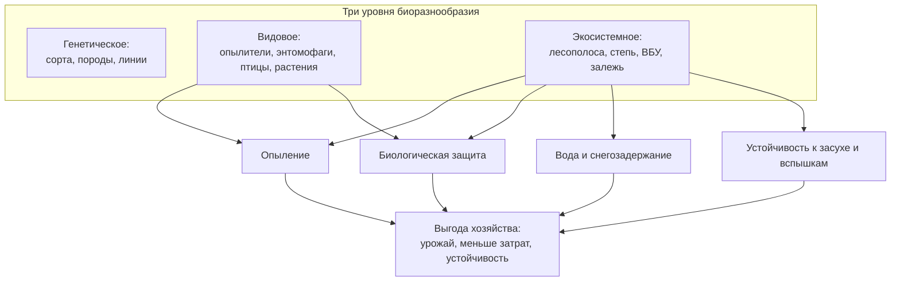
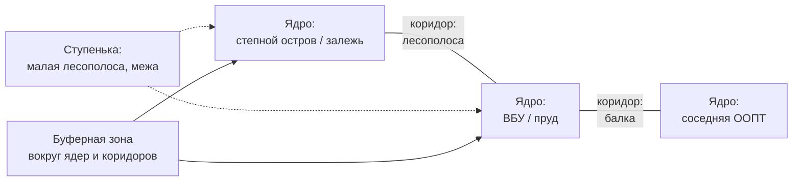

# Инвентаризируем биоразнообразие агроландшафта: местообитания, виды, экологический каркас

> ⏱ **Трудозатраты:** ~19 мин чтения + ~25 мин практики
>
> Модуль **[П13: Биоразнообразие и прилегающие экосистемы](../index.md)**, урок 1.
> Профессиональный уровень (МСБ). Проект UNDP-KAZ-00683, FOLUR. Компоненты FOLUR: **2, 3**.

## Цели урока и место в модуле

Биоразнообразие в хозяйстве часто воспринимают как «природу вокруг» — то, что либо мешает пахать, либо просто есть. Этот модуль разворачивает взгляд: биоразнообразие агроландшафта — это **инфраструктура**, которая бесплатно поставляет хозяйству опыление, биологическую защиту от вредителей, чистую воду, снегозадержание и устойчивость к засухе. Но чтобы этой инфраструктурой управлять, её сначала надо **увидеть и описать**. Этот урок учит инвентаризировать биоразнообразие территории на трёх уровнях — местообитания, виды, связи между ними — по открытым данным, и вводит ключевое понятие модуля: **экологический каркас**. Это фундамент плана, который вы соберёте к концу модуля.

После изучения урока вы сможете:

1. **[Bloom: знать]** называть три уровня биоразнообразия (генетическое, видовое, экосистемное) и основные типы местообитаний агроландшафта Северного Казахстана и открытые данные, по которым их можно описать.
2. **[Bloom: понимать]** объяснять, зачем биоразнообразие нужно самому хозяйству (опыление, биозащита, вода, устойчивость) и что такое виды-индикаторы и экологический каркас.
3. **[Bloom: применять]** составлять инвентаризацию местообитаний территории и слой видовых находок по OpenStreetMap, Sentinel-2 и GBIF для участка в СКО/Костанай/Акмола.
4. **[Bloom: анализировать]** оценивать полноту и связность инвентаризации: какие местообитания изолированы, где разрывы каркаса, какие виды-индикаторы говорят о состоянии территории.

> **Границы лекции.** Внутри: понятие и уровни биоразнообразия агроландшафта, типы местообитаний, виды-индикаторы, экологический каркас как рамка и его инвентаризация по открытым данным. Снаружи: проектирование буферов, коридоров и восстановления — [урок 2](02-ekologicheskij-karkas-bufery-lesopolosy.md); соседство с ООПТ/ВБУ и сборка плана — [урок 3](03-oopt-vbu-plan-sohraneniya.md); научные методы количественной оценки биоразнообразия и валидация — академический [А6](../../a6/index.md); экосистемные услуги и их картирование — [П6](../../p6/index.md); чтение состояния покрова по NDVI — [П3](../../p3/index.md)/[П7](../../p7/index.md). Численности «краснокнижных» видов, площади и нормы РК здесь не приводятся — работаем с открытыми находками и качественными оценками.

---

## 1. Что такое биоразнообразие агроландшафта и зачем оно хозяйству

Биоразнообразие — это разнообразие живого на трёх уровнях, и каждый важен для хозяйства по-своему:

- **генетическое** — разнообразие внутри вида (сорта культур, породы скота, местные линии диких растений и насекомых); страховка от болезней и капризов климата;
- **видовое** — разнообразие видов (опылители, хищные насекомые-энтомофаги, птицы, растения лесополос и степи); поставщик биологических услуг;
- **экосистемное** — разнообразие местообитаний и их сообществ (лесополоса, степной остров, водно-болотная полоса, залежь); каркас, в котором виды живут и перемещаются.

Ключевая мысль модуля: в агроландшафте биоразнообразие — не роскошь, а **производственный актив**. Дикие опылители повышают завязываемость семян рапса, подсолнечника, гречихи и бобовых. Хищные насекомые и птицы сдерживают вредителей, снижая нужду в инсектицидах. Разнотравье залежи и лесополос удерживает почву и снег, кормит опылителей и энтомофагов. Устойчивое, разнообразное сообщество легче переносит засуху и вспышки вредителей, чем монотонное поле. Эту логику подробно разбирает рамка **FAO 10 Elements of Agroecology** (элементы «Diversity» и «Synergies»): устойчивая агросистема живёт за счёт разнообразия и взаимоусиления функций, а не за счёт выжимания одной.



*Рис. 1. Как биоразнообразие трёх уровней превращается в выгоду хозяйства. Alt: схема. Блок «Три уровня биоразнообразия» содержит генетическое (сорта, породы, линии), видовое (опылители, энтомофаги, птицы, растения) и экосистемное (лесополоса, степь, водно-болотные угодья, залежь). Экосистемный уровень поставляет опыление, биологическую защиту, воду и снегозадержание, устойчивость к засухе и вспышкам; видовой уровень поддерживает опыление и биозащиту. Все услуги сходятся в выгоду хозяйства: урожай, меньше затрат, устойчивость.*

### 1.1 Виды-индикаторы: что они рассказывают о территории

Описывать каждый вид на территории невозможно и не нужно. Достаточно **видов-индикаторов** — тех, чьё присутствие или отсутствие говорит о состоянии среды. В агроландшафте Северного Казахстана полезные индикаторы:

- **опылители** (шмели, одиночные пчёлы, мухи-журчалки) — индикатор наличия непахотных местообитаний и щадящего режима обработок;
- **степные птицы** (жаворонки, коньки, хищники открытых пространств) — индикатор сохранности степных и залежных участков;
- **водоплавающие и околоводные птицы** — индикатор состояния водно-болотных угодий;
- **разнотравье** (полынно-ковыльные и луговые виды) вместо сплошного бурьяна — индикатор восстанавливающейся степи на залежи.

Важно: индикатор — качественный сигнал, а не приговор. Мы не измеряем численность и не выдумываем цифры; мы отмечаем, **что встречается** на территории и рядом (по открытым находкам), и делаем осторожный вывод о состоянии местообитаний.

> **Подробнее** — научные методы количественной оценки видового богатства и индексов разнообразия: [А6](../../a6/index.md).

## 2. Типы местообитаний агроландшафта Северного Казахстана

Экосистемный уровень для хозяйства самый управляемый: местообитания видны на снимке и карте, их можно сохранять, восстанавливать и соединять. Основные типы в степной зоне:

- **Лесополосы** (полезащитные лесные насаждения) — линейные местообитания и коридоры: убежище опылителей и энтомофагов, гнездовья птиц, снегозадержание, защита от ветра. Наследие масштабного степного лесоразведения XX века; многие сегодня разрежены и нуждаются в уходе.
- **Залежь и степные острова** — неиспользуемая пашня, восстанавливающаяся в разнотравную степь, и сохранившиеся нераспаханные участки. Резерв разнообразия, местообитание степных видов, источник расселения полезных насекомых.
- **Балки, овраги, лощины** — линейные природные элементы с разнотравьем и кустарником; коридоры перемещения, водоохранные и противоэрозионные полосы.
- **Водно-болотные полосы, пруды, озёра, старицы (ВБУ)** — местообитания водоплавающих и околоводных видов, амфибий, водопой, регуляторы воды. В степной зоне озёра и разливы — ключевые точки на путях миграции птиц.
- **Обочины, межи, полевые дороги** — «мелкая» зелёная инфраструктура: узкие полосы дикой растительности, соединяющие крупные местообитания.

Каждый тип видно на открытых данных: контуры и категории — в **OpenStreetMap** (`landuse`, `natural`, `water`, `waterway`, `barrier`), состояние покрова — по **Sentinel-2** (NDVI: густое разнотравье и здоровая лесополоса дают высокий отклик, разреженные — низкий), рельефные элементы (балки) — по открытой **ЦМР**. Так инвентаризация местообитаний строится без выезда в поле — а полевой обход потом уточняет.

### 2.1 Матрица и элементы: почему структура важнее площади

Агроландшафт — это **матрица** (пашня) с **вкраплениями** природных элементов. Для биоразнообразия важна не только суммарная площадь природных участков, но и их **структура**: как они расположены, соединены ли между собой, нет ли изолированных «островов». Маленькая лесополоса, соединяющая два крупных местообитания, ценнее большого, но изолированного участка — по ней виды перемещаются, обмениваются генами, заселяют новые места. Отсюда следующий шаг — от перечня элементов к их связям, то есть к экологическому каркасу.

Особенность Северного Казахстана усиливает эту логику. Пшеничная целинная зона — это огромные однородные массивы пашни, где природные местообитания сведены к узким лесополосам, кромкам балок и редким степным островам. В такой «обеднённой матрице» каждый сохранившийся элемент несёт непропорционально большую нагрузку: одна лесополоса может быть единственным убежищем опылителей и энтомофагов на километры вокруг. Поэтому в степном хозяйстве инвентаризация — это ещё и поиск того немногого, что осталось, и оценка, насколько это немногое связано в единую сеть. Утрата даже одного узла (снос лесополосы, распашка залежи) здесь бьёт по каркасу сильнее, чем в мозаичном ландшафте с обилием природных элементов.

### 2.2 Сезонное измерение: местообитание меняется в течение года

Одно и то же местообитание работает по-разному в разные сезоны, и инвентаризация это учитывает. Весенний разлив превращает понижение во временное водно-болотное угодье, критичное для пролётных птиц, а к июлю оно может пересохнуть. Лесополоса весной — место гнездования, летом — источник опылителей для рапса, зимой — снегозадержатель. Залежь цветёт и кормит насекомых в определённые недели. Практический вывод: состояние местообитаний по снимкам стоит смотреть в **нескольких сезонах** (весна, разгар лета), а не по одному кадру, — иначе легко недооценить временный, но ценный ресурс вроде весеннего разлива.

## 3. Экологический каркас: от перечня к системе

**Экологический каркас** (в международной практике — ecological network, зелёная инфраструктура) — это система природных территорий, связанных так, чтобы виды могли жить и перемещаться, а услуги — работать по всей территории. Классическая структура каркаса:

- **ядра** — крупные ценные местообитания (степной остров, большой участок залежи, ВБУ, старая полноценная лесополоса, а по соседству — ООПТ);
- **коридоры** — линейные элементы, соединяющие ядра (лесополосы, балки, водно-болотные полосы, цепочки межей);
- **буферные зоны** — полосы вокруг ядер и коридоров, смягчающие давление пашни (снос пестицидов, распашка вплотную, беспокойство);
- **точки-«ступеньки» (stepping stones)** — мелкие местообитания между ядрами, по которым виды «перепрыгивают» разрыв.



*Рис. 2. Элементы экологического каркаса территории. Alt: схема сети. Три ядра — степной остров или залежь, водно-болотное угодье или пруд, соседняя ООПТ — соединены коридорами: лесополосой между первым и вторым ядром и балкой между вторым и третьим. Малая лесополоса или межа выступает «ступенькой» между ядрами. Буферная зона окружает ядра и коридоры, смягчая давление пашни.*

Инвентаризация каркаса — это разметка территории по этим ролям: где ядра, где коридоры, где разрывы, которые нужно «сшить». Разрыв — это, например, распаханная зона между двумя лесополосами, где коридор прерван; или изолированный степной остров без связи с соседними местообитаниями. Именно разрывы станут адресами мероприятий в [уроке 2](02-ekologicheskij-karkas-bufery-lesopolosy.md). Каркас — рамка, в которую ложится и зонирование хозяйства из [П5](../../p5/index.md): производственные зоны — матрица, природоохранные и буферные — ядра и буферы каркаса.

## 4. Открытые данные для инвентаризации биоразнообразия

Чтобы инвентаризация была честной, а не «из головы», модуль опирается на открытые проверяемые источники:

- **OpenStreetMap** — контуры местообитаний, лесополосы, водные объекты, землепользование, границы ООПТ. Бесплатно, глобально.
- **Sentinel-2 L2A** через Copernicus Browser — состояние покрова и местообитаний по NDVI и композитам; здоровая или разреженная лесополоса, влажная или пересохшая водно-болотная полоса.
- **GBIF (Global Biodiversity Information Facility)** — открытая база **видовых находок**: миллионы записей о том, где и когда наблюдали конкретные виды (птицы, насекомые, растения). Позволяет узнать, какие виды документированы в вашем районе, не выдумывая их.
- **Protected Planet / WDPA** — открытая база ООПТ и Ramsar-угодий: где рядом заповедник, заказник, водно-болотное угодье международного значения (подробно — [урок 3](03-oopt-vbu-plan-sohraneniya.md)).
- **Copernicus Land Monitoring** — слои земного покрова; открытая **ЦМР** — балки и водотоки.

!!! warning "Как честно читать GBIF"
    GBIF показывает, что вид был **где-то зарегистрирован** в области или районе, но не гарантирует, что он есть именно на вашем поле, и не даёт его численность. Плотность точек зависит и от того, где ходили наблюдатели, а не только от того, где живут виды (наблюдательное смещение). Поэтому GBIF используем как перечень «кто в принципе здесь встречается» и сигнал о ценных видах поблизости — а не как перепись. Численности и статус охраны берём из официальных источников (Красная книга РК), а не выдумываем.

---

## Региональный кейс

**Ситуация.** Хозяйство в Костанайском районе Костанайской области ведёт зерновое производство с рапсом. По краям массива тянутся старые полезащитные лесополосы (часть разрежена), в понижении есть небольшое озерцо с тростниковой полосой, вдоль северной границы — участок многолетней залежи. Владелец слышал, что «где-то рядом заповедник», и хочет понять, что за биоразнообразие на его земле и стоит ли им заниматься всерьёз.

**Данные:** OpenStreetMap (лесополосы, водные объекты, землепользование, ООПТ); Sentinel-2 L2A через Copernicus Browser (<https://dataspace.copernicus.eu/>) — состояние лесополос и тростниковой полосы по NDVI; GBIF (<https://www.gbif.org/>) — видовые находки по Костанайскому району; Protected Planet (<https://www.protectedplanet.net/>) — ближайшие ООПТ. Всё обрабатывается в QGIS.

**Задача:**

1. Составить перечень типов местообитаний территории по OSM и снимку и оценить их состояние по NDVI.
2. По GBIF узнать, какие группы видов документированы в районе (опылители, степные и околоводные птицы) и что из этого может встречаться на территории.
3. Разметить черновой экологический каркас: где ядра, где коридоры, где разрывы.

**Разбор.** По OSM и снимку выделяются пять типов местообитаний: лесополосы (часть с низким NDVI — разрежены, нуждаются в уходе), озерцо с тростником (ВБУ — ценное околоводное местообитание), залежь (степной резерв разнообразия), балки и обочины (коридоры). GBIF по району показывает документированные находки степных и водоплавающих птиц и опылителей — сигнал, что территория и её окрестности небедны, а тростниковое озерцо особенно ценно для околоводных видов. Черновой каркас: ядра — залежь и озерцо с тростником; коридоры — лесополосы и балка; разрыв — распаханная зона между залежью и лесополосой, где связь прервана. Вывод владельцу: биоразнообразие территории реально и работает на хозяйство (опыление рапса, снегозадержание, чистая вода в озерце), а его слабое место — разорванный каркас и разреженные лесополосы, которыми стоит заняться. Численности видов и площади в кейсе не приводятся: GBIF даёт перечень, состояние — качественно по NDVI, точные значения — вне открытого скрининга.

---

## Закрепление и применение

!!! example "Попробуйте в QGIS"
    За 20–25 минут на своей территории: (1) загрузите OSM (QuickOSM) и Sentinel-2 (Copernicus Browser); (2) выделите слой местообитаний — лесополосы, залежь, водные объекты, балки; (3) по NDVI оцените состояние лесополос (густые/разреженные); (4) откройте GBIF, задайте свой район и посмотрите, какие группы видов документированы; (5) от руки разметьте ядра, коридоры и один разрыв каркаса. Даже без полевого обхода вы получите основу инвентаризации. Пошаговые инструкции — в [практикуме](../practicum/01-plan-sohraneniya-bioraznoobraziya.md).

!!! tip "Что это даёт вашему хозяйству"
    Инвентаризация превращает «природу вокруг» в понятный список активов: вы видите, какие местообитания у вас есть, в каком они состоянии и какие виды они поддерживают. Это первый шаг к тому, чтобы биоразнообразие работало на урожай (опыление, биозащита) и на устойчивость, а не оставалось абстракцией — и заготовка для заявки на поддержку восстановления.

!!! question "Кейс для размышления"
    На вашей территории два природных участка: (а) крупный изолированный степной остров без связи с соседними местообитаниями; (б) две небольшие лесополосы, между которыми распахан коридор шириной в одно поле. Ресурсов хватает на одно действие — сохранить остров как есть или восстановить коридор между лесополосами. Что важнее для биоразнообразия территории и почему? Подсказка: вспомните, почему структура каркаса важнее суммарной площади (§2.1, §3).

### Проверь себя

```quiz
[
  {
    "q": "Какие три уровня биоразнообразия описывает урок?",
    "options": [
      "Генетическое, видовое, экосистемное",
      "Растительное, животное, микробное",
      "Полевое, лесное, водное",
      "Местное, региональное, глобальное"
    ],
    "answer": 0,
    "explain": "§1: генетическое (внутри вида), видовое (разнообразие видов), экосистемное (местообитания и сообщества) — каждый уровень важен хозяйству по-своему."
  },
  {
    "q": "Почему в модуле биоразнообразие называют производственным активом хозяйства, а не роскошью?",
    "options": [
      "Оно поставляет опыление, биологическую защиту от вредителей, воду и устойчивость — реальную пользу урожаю и снижение затрат",
      "Потому что за него платят субсидии",
      "Потому что так требует закон",
      "Потому что редкие виды можно продать"
    ],
    "answer": 0,
    "explain": "§1: дикие опылители, энтомофаги, разнотравье лесополос и залежи дают хозяйству услуги; рамка FAO (Diversity, Synergies) описывает эту логику."
  },
  {
    "q": "Что корректно вынести из данных GBIF по вашему району?",
    "options": [
      "Перечень видов, которые в принципе документированы в районе, и сигнал о ценных видах поблизости — без гарантии их наличия именно на вашем поле и без численности",
      "Точную численность каждого вида на вашей территории",
      "Официальный охранный статус и площади местообитаний",
      "Готовый план мероприятий по каждому виду"
    ],
    "answer": 0,
    "explain": "§4, врезка: GBIF показывает, где вид регистрировали, но подвержен наблюдательному смещению и не даёт численность; это перечень «кто здесь встречается», а не перепись."
  },
  {
    "q": "Почему маленькая лесополоса, соединяющая два крупных местообитания, может быть ценнее большого, но изолированного участка?",
    "options": [
      "Для биоразнообразия важна структура каркаса: коридор позволяет видам перемещаться, обмениваться генами и заселять новые места",
      "Маленькие участки дешевле содержать",
      "Большие участки всегда деградируют быстрее",
      "Изолированные участки запрещено использовать"
    ],
    "answer": 0,
    "explain": "§2.1 и §3: связность важнее суммарной площади; коридор соединяет ядра, изолированный «остров» теряет виды со временем."
  },
  {
    "q": "Что из перечисленного — элемент экологического каркаса, а не роль в производственной матрице?",
    "options": [
      "Коридор — линейный элемент (лесополоса, балка), соединяющий ядра",
      "Товарное поле пшеницы",
      "Машинный двор хозяйства",
      "Склад ГСМ"
    ],
    "answer": 0,
    "explain": "§3: каркас состоит из ядер, коридоров, буферных зон и «ступенек»; пашня — матрица, в которую каркас вписан."
  }
]
```

## Что дальше?

Инвентаризация местообитаний, слой видовых находок и черновой экологический каркас готовы. В **[уроке 2 «Проектируем экологический каркас: буферные зоны, лесополосы, водно-болотные полосы»](02-ekologicheskij-karkas-bufery-lesopolosy.md)** мы превратим разметку в проект: спроектируем буферные зоны, соединим разрывы коридорами и распишем уход и восстановление лесополос и водно-болотных полос. Затем [урок 3](03-oopt-vbu-plan-sohraneniya.md) добавит соседство с ООПТ и ВБУ и сборку плана, а [практикум](../practicum/01-plan-sohraneniya-bioraznoobraziya.md) проведёт вас через всю работу на вашей земле. Экосистемные услуги, которые поддерживает это биоразнообразие, — в [П6](../../p6/index.md); научные методы оценки — в [А6](../../a6/index.md).
