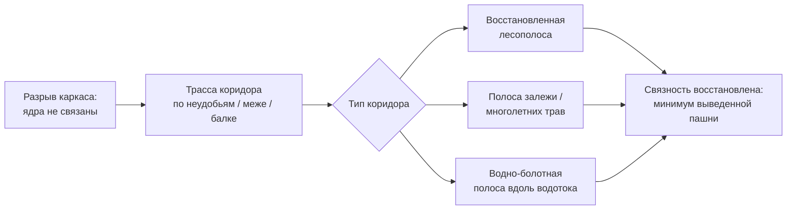

# Проектируем экологический каркас: буферные зоны, лесополосы, водно-болотные полосы

> ⏱ **Трудозатраты:** ~20 мин чтения + ~30 мин практики
>
> Модуль **[П13: Биоразнообразие и прилегающие экосистемы](../index.md)**, урок 2.
> Профессиональный уровень (МСБ). Проект UNDP-KAZ-00683, FOLUR. Компоненты FOLUR: **2, 3**.

## Цели урока и место в модуле

На [уроке 1](01-inventarizaciya-bioraznoobraziya.md) вы описали местообитания, виды и разметили черновой каркас — где ядра, где коридоры, где разрывы. Теперь пора превратить разметку в **проект**: спроектировать буферные зоны, соединить разрывы коридорами и расписать восстановление и уход за лесополосами и водно-болотными полосами. Это ядро прикладного продукта модуля — от «что у нас есть» к «что мы сделаем». Урок держит важный баланс: усилить биоразнообразие, **не выводя из оборота лишнюю пашню** и не выдумывая нормы отступов — все параметры остаются качественными учебными градациями.

После изучения урока вы сможете:

1. **[Bloom: знать]** называть функции буферных зон, лесополос и водно-болотных полос в агроландшафте и открытые данные, по которым их проектируют.
2. **[Bloom: понимать]** объяснять, как буфер смягчает давление пашни, как коридор восстанавливает связность каркаса и почему уход за лесополосой важнее новой посадки.
3. **[Bloom: применять]** проектировать в QGIS по открытым данным буферные зоны вокруг ценных местообитаний и водотоков, соединительные коридоры для разрывов каркаса и приоритеты ухода за лесополосами для территории СКО/Костанай/Акмола.
4. **[Bloom: анализировать]** сравнивать варианты мероприятий по критерию «максимум пользы биоразнообразию при минимуме выведенной из оборота пашни» и находить решения-синергии.

> **Границы лекции.** Внутри: проектирование буферных зон, коридоров и мер восстановления/ухода за лесополосами и ВБУ по открытым данным на качественном уровне. Снаружи: инвентаризация каркаса — [урок 1](01-inventarizaciya-bioraznoobraziya.md); соседство с ООПТ/ВБУ и режимы, сборка плана — [урок 3](03-oopt-vbu-plan-sohraneniya.md); агротехника посадки и породный состав лесополос, точные нормы отступов — вне модуля (агролесомелиорация, официальные регламенты); строгие модели связности и метрики ландшафта — [А6](../../a6/index.md); проектирование системы водосбережения участка — [П12](../../p12/index.md). Ширину буферов, породы, режимы и суммы затрат в точных цифрах здесь не приводим — модуль оперирует градациями и направлением эффекта.

---

## 1. Буферные зоны: смягчаем давление пашни на ценные местообитания

**Буферная зона** — полоса между интенсивной пашней и ценным местообитанием (ВБУ, степной остров, ООПТ, водоток), которая гасит негативное давление: снос пестицидов и удобрений ветром и стоком, распашку вплотную, беспокойство фауны, эрозионный вынос. Внутри буфера ведут щадящий режим: не пашут или пашут минимально, не применяют или ограниченно применяют агрохимию, оставляют дикую растительность, сенокос или умеренный выпас вместо распашки.

Где буферы особенно нужны в степном хозяйстве:

- **вдоль водотоков и вокруг водоёмов, ВБУ** — водоохранная полоса задерживает биогены и наносы, не давая им попасть в воду, и служит местообитанием околоводных видов;
- **вокруг степных островов и залежи** — смягчает краевой эффект (снос агрохимии, заезд техники);
- **вдоль границы с ООПТ** — снижает воздействие хозяйства на охраняемую территорию (подробно — [урок 3](03-oopt-vbu-plan-sohraneniya.md)).

Проектирование в QGIS простое: строится **буфер** (Вектор → Геообработка → Буфер) вокруг ценного объекта. Ширину задают как качественную градацию — узкий/средний/широкий, — а не как точную «норму»: реальные ширины водоохранных полос устанавливаются официальными регламентами и зависят от типа водного объекта, их берут из проверяемого источника, а не выдумывают.

!!! warning "Буфер — это градация, а не норма из головы"
    Конкретная ширина водоохранной зоны, прибрежной полосы и режим в них регулируются законодательством и зависят от объекта. В учебной карте буфер — качественная шкала («здесь нужна полоса, шире у крупной реки, уже у ручья»), которая показывает, **где** нужна защитная полоса и **какого порядка**. Точную ширину и режим для реального проекта берите из официальных источников (adilet.zan.kz), не подставляя выдуманные метры.

## 2. Коридоры: сшиваем разрывы каркаса

На уроке 1 вы нашли разрывы — места, где коридор прерван распашкой или где ядро изолировано. **Соединительный коридор** восстанавливает связность: по нему виды перемещаются между ядрами, обмениваются генами, заселяют новые местообитания. Коридором служит лесополоса, полоса залежи или разнотравья, водно-болотная полоса вдоль водотока, цепочка межей и «ступенек».

Логика проектирования коридора:

1. на схеме каркаса найдите пары ядер, между которыми связь слабая или отсутствует;
2. проведите линию будущего коридора по наименее ценной для пашни земле — вдоль существующих межей, балок, вдоль поля, по неудобьям, — чтобы **минимизировать выводимую из оборота пашню**;
3. решите, что это будет: восстановленная лесополоса, оставленная полоса залежи, засеянная многолетними травами полоса, — в зависимости от условий;
4. свяжите коридор с буферами и «ступеньками», чтобы он не обрывался.



*Рис. 1. Логика проектирования соединительного коридора. Alt: схема-поток. Разрыв каркаса, где ядра не связаны, ведёт к выбору трассы коридора по неудобьям, меже или балке; затем выбирается тип коридора — восстановленная лесополоса, полоса залежи или многолетних трав, либо водно-болотная полоса вдоль водотока; итог — восстановленная связность при минимуме выведенной из оборота пашни.*

Ключевой критерий выбора трассы — **польза для связности при минимальной потере пашни**. Хороший коридор часто идёт там, где пахать и так неудобно (балка, вдоль водотока, клин между полями), поэтому почти ничего не стоит хозяйству, но много даёт каркасу. Это типичная синергия, ради которой стоит искать такие трассы.

## 3. Лесополосы: уход важнее новой посадки

Полезащитные лесополосы — наследие степного лесоразведения XX века и до сих пор главная зелёная инфраструктура пашни: они задерживают снег и влагу, гасят ветер и дефляцию, служат местообитанием опылителей, энтомофагов и птиц, работают коридорами. Но многие сегодня разрежены, поломаны, зарастают сорным подростом или, наоборот, гибнут без ухода. Практический вывод модуля: **восстановить и поддержать существующую лесополосу почти всегда дешевле и быстрее, чем вырастить новую**, — взрослая полоса уже выполняет функции, которые новая посадка даст лишь через годы.

Как оценить лесополосы по открытым данным и расставить приоритеты ухода:

- по **NDVI Sentinel-2** отделите густые здоровые полосы (высокий отклик) от разреженных и усыхающих (низкий) — последние в приоритете внимания;
- по снимку и OSM найдите **разрывы** в полосах (прогалы, вырубленные участки) — их «латание» восстанавливает и защиту, и коридор;
- отметьте полосы на **ключевых направлениях** — поперёк господствующих ветров, вдоль коридоров каркаса, у ВБУ — их ценность максимальна.

Типы работ (качественно, без агротехнических нормативов): санитарный уход и удаление сухостоя, дополнение (подсадка в прогалы), восстановление разрушенных участков, защита от палов и потравы, при необходимости — новые полосы на приоритетных направлениях. Породный состав, схемы посадки и уходовые регламенты — предмет агролесомелиорации и официальных рекомендаций; модуль указывает **где и что** по функции, а не **как** технически.

Отдельно стоит **защита от палов**. Весенние и осенние палы стерни и травы — распространённая в степной зоне практика и одновременно частая причина гибели лесополос, гнездовий и степных местообитаний: огонь уходит с поля в полосу и уничтожает подрост, птиц, насекомых. Отказ от палов у ценных элементов каркаса и минеральные полосы-разрывы вдоль лесополос — дешёвая мера с большой отдачей: она сохраняет уже работающую инфраструктуру, восстановление которой стоило бы многократно дороже.

> **Подробнее** — защита от эрозии и снегозадержание как экосистемные услуги лесополос: [П6](../../p6/index.md); водоудерживающая функция и водосбережение: [П12](../../p12/index.md).

## 4. Водно-болотные полосы и водоёмы: местообитания у воды

Водно-болотные угодья (ВБУ) — озёра, разливы, старицы, тростниковые полосы, заболоченные понижения — в степной зоне особенно ценны: это местообитания водоплавающих и околоводных видов, водопой, естественные регуляторы воды, а степные озёра лежат на путях миграции птиц. Для хозяйства ВБУ — не «болото, которое надо осушить», а актив, который стоит сохранить и мягко обустроить.

Практические меры (качественно):

- **буфер вокруг водоёма и водотока** — водоохранная полоса из дикой растительности, задерживающая биогены и наносы, служащая местообитанием (§1);
- **сохранение тростниковых и прибрежных полос** — не выкашивать сплошь, оставлять участки как гнездовья и укрытия;
- **режим у водопоя** — упорядоченный доступ скота, чтобы не разрушать берега и не мутить воду;
- **восстановление заиленных прудов и стариц** как накопителей воды и местообитаний (в связке с водосбережением — [П12](../../p12/index.md)).

По открытым данным ВБУ хорошо видны: контуры — в OSM (`natural=wetland`, `water`), состояние тростника и уровень воды — по NDVI и композитам Sentinel-2 в разные сезоны (весенний разлив против летнего пересыхания). Международная рамка охраны ВБУ — **Рамсарская конвенция**; если рядом Ramsar-угодье, это прямо влияет на режим соседства (подробно — [урок 3](03-oopt-vbu-plan-sohraneniya.md)).

Типичная ошибка — воспринимать степное озерцо или заболоченное понижение как «бросовую» землю, которую надо осушить и распахать. В засушливой степи всё наоборот: такой водоём удерживает влагу в ландшафте, поит скот и диких животных, служит опорной точкой для пролётных птиц и поддерживает опылителей на прилегающих полях через влажные луговины. Осушение даёт краткосрочный прирост пашни ценой утраты сразу нескольких функций — и часто оборачивается солончаком или дефляционным очагом на месте бывшего дна. Поэтому в проекте каркаса ВБУ — актив, который сохраняют и мягко обустраивают, а не устраняют.

## 5. Собираем проект каркаса: приоритеты и синергии

Отдельные меры — буфер, коридор, уход за полосой — сильны вместе. Соберите их в **проект экологического каркаса**: на одной карте покажите ядра, спроектированные коридоры, буферные зоны и приоритеты ухода за лесополосами и ВБУ. Затем расставьте приоритеты по двум критериям:

- **сколько пользы каркасу** даёт мера (сшивает ключевой разрыв? защищает ценное ядро или ВБУ? восстанавливает коридор на важном направлении?);
- **сколько это стоит хозяйству** прежде всего в выведенной из оборота пашне и труде.

Лучшие мероприятия — в правом верхнем углу этой логики: много пользы, мало затрат. Как и в [П6](../../p6/index.md), их часто дают **синергии**: восстановленная лесополоса поперёк склона у ВБУ — это одновременно коридор каркаса, снегозадержание, защита от эрозии, буфер водоёма и местообитание опылителей. Одно действие закрывает пять функций — приоритет №1, и проект каркаса это показывает наглядно.

### 5.1 Баланс «биоразнообразие ↔ производство»

Важно не впасть в крайность «всё под охрану». Задача МСБ — не превратить хозяйство в заповедник, а **встроить каркас в работающее производство** так, чтобы пашня оставалась продуктивной, а биоразнообразие поддерживало её (опыление, биозащита, вода). Поэтому проект каркаса ведут по неудобьям, межам и уже существующим природным элементам, минимизируя изъятие продуктивной земли, и ищут меры-синергии, которые окупаются пользой самому хозяйству. Это язык агроэкологии FAO (элемент «Synergies») и логика природного капитала из [П6](../../p6/index.md): устойчивое хозяйство живёт за счёт баланса, а не за счёт выжимания одной функции.

---

## Региональный кейс

**Ситуация.** Хозяйство в Буландынском районе Акмолинской области сеет пшеницу и рапс. Территорию пересекают старые лесополосы (несколько разрежены, в двух есть прогалы), в понижении — озерцо с тростниковой полосой, вдоль южной границы — балка с разнотравьем. Владелец хочет усилить биоразнообразие, но боится «потерять пашню» и не знает, за что взяться в первую очередь.

**Данные:** OpenStreetMap (лесополосы, водные объекты, землепользование); Sentinel-2 L2A через Copernicus Browser (<https://dataspace.copernicus.eu/>) — состояние лесополос и тростника по NDVI в разные сезоны; открытая ЦМР Copernicus — балка и водотоки. Обработка в QGIS.

**Задача:**

1. Спроектировать буферные зоны вокруг озерца и вдоль водотока (качественная градация ширины).
2. Найти разрыв каркаса и провести коридор по неудобьям с минимумом выведенной пашни.
3. Оценить лесополосы по NDVI и выбрать 2–3 приоритетных для ухода/дополнения.
4. Выделить одну меру-синергию и обосновать приоритет №1.

**Разбор.** Буфер вокруг озерца и вдоль водотока проходит по прибрежной полосе, которую и так неудобно пахать, — защита воды и местообитание почти без потери пашни. Разрыв каркаса — распаханная зона между балкой и озерцом; коридор логично провести по краю поля вдоль балки (неудобье), соединив два ядра полосой залежи/трав. NDVI показывает две разреженные лесополосы с прогалами поперёк господствующих ветров — они в приоритете ухода: латание прогалов восстановит и защиту от ветра, и коридор. Мера-синергия и приоритет №1: восстановление лесополосы, идущей от балки к озерцу поперёк ветра, — она одновременно коридор, снегозадержание, буфер водоёма и местообитание опылителей рапса, а стоит хозяйству мало (полоса уже есть, нужен уход). Итог — проект каркаса с буферами, коридором и приоритетами ухода, где почти ничего не выведено из оборота. Точные ширины буферов, породы и суммы затрат в кейсе не приводятся: карта указывает адрес и порядок, параметры — из официальных источников.

---

## Закрепление и применение

!!! example "Попробуйте в QGIS"
    За 25–30 минут на своей территории: (1) постройте буфер вокруг водоёма/водотока (Вектор → Буфер) как качественную полосу; (2) найдите на схеме каркаса разрыв и проведите линию коридора по меже/балке/неудобью; (3) по NDVI Sentinel-2 отделите разреженные лесополосы от густых и отметьте 2–3 приоритетных для ухода; (4) выделите одну меру-синергию. Вы получите черновой проект каркаса. Пошаговые инструкции — в [практикуме](../practicum/01-plan-sohraneniya-bioraznoobraziya.md).

!!! warning "Границы применимости"
    Проект каркаса из открытых данных — это **планировочный эскиз**, а не рабочий проект лесомелиорации или водоохраны. Ширина буфера здесь — градация, а не установленная норма (её берут из официальных регламентов); породный состав, схемы посадки и уходовые нормативы — предмет агролесомелиорации; связность оценивается качественно, без метрик ландшафтной экологии ([А6](../../a6/index.md)). Эскиз называет **где и что по функции**, детальные параметры считают отдельно и не выдумывают.

!!! tip "Что это даёт вашему хозяйству"
    Проект каркаса показывает, где несколькими дешёвыми действиями — буфер по неудобью, латание прогала в лесополосе, коридор по меже — усилить биоразнообразие, почти не теряя пашни, и получить взамен опыление, снегозадержание, чистую воду и устойчивость. Это и рабочий план, и аргумент для заявки на поддержку восстановления ([П14](../../p14/index.md)).

!!! question "Кейс для размышления"
    У вас две возможные меры: (а) заложить новую лесополосу на открытом месте вдали от существующего каркаса; (б) залатать прогалы в старой разреженной лесополосе, которая идёт поперёк ветра от балки к озерцу. Ресурсов хватает на одно. Что выберете и почему? Подсказка: сравните, через сколько лет каждая мера начнёт работать и сколько функций каркаса она закрывает сразу (§3, §5).

### Проверь себя

```quiz
[
  {
    "q": "Какова главная функция буферной зоны вдоль водотока в агроландшафте?",
    "options": [
      "Гасить давление пашни: задерживать снос агрохимии и наносов в воду и служить местообитанием околоводных видов",
      "Увеличивать площадь пашни у воды",
      "Обозначать границу собственности",
      "Заменять водоохранное законодательство"
    ],
    "answer": 0,
    "explain": "§1: буфер — полоса щадящего режима между пашней и ценным объектом; вдоль водотока задерживает биогены и наносы и служит местообитанием."
  },
  {
    "q": "По какому критерию выбирают трассу соединительного коридора?",
    "options": [
      "Максимум пользы для связности каркаса при минимуме выведенной из оборота пашни — по неудобьям, межам, балкам",
      "По кратчайшей прямой через центр лучшего поля",
      "По границе с соседом, чтобы не спорить",
      "По самой дорогой земле, чтобы получить больше субсидий"
    ],
    "answer": 0,
    "explain": "§2: коридор ведут по наименее ценной для пашни земле, чтобы сшить разрыв каркаса почти без потерь для хозяйства."
  },
  {
    "q": "Почему уход за существующей лесополосой в модуле приоритетнее новой посадки?",
    "options": [
      "Взрослая полоса уже выполняет функции (защита, коридор, местообитание), а новая даст их лишь через годы; восстановить обычно дешевле и быстрее",
      "Новые посадки запрещены",
      "Старые лесополосы всегда ценнее любых новых по закону",
      "Новую полосу нельзя показать на снимке"
    ],
    "answer": 0,
    "explain": "§3: латание прогалов и уход возвращают функции быстрее и дешевле, чем выращивание новой полосы с нуля."
  },
  {
    "q": "Как в учебной карте корректно трактовать ширину буферной зоны?",
    "options": [
      "Как качественную градацию (узкий/средний/широкий), показывающую, где и какого порядка нужна полоса; точную ширину берут из официальных регламентов",
      "Как точную норму в метрах, которую можно назначить самому",
      "Как значение, не имеющее отношения к типу водного объекта",
      "Как коммерческую тайну хозяйства"
    ],
    "answer": 0,
    "explain": "§1, врезка: реальные ширины и режимы устанавливаются законодательством и зависят от объекта; в эскизе буфер — градация, а не выдуманная норма."
  },
  {
    "q": "Почему восстановление лесополосы от балки к водоёму поперёк ветра часто становится приоритетом №1?",
    "options": [
      "Это мера-синергия: одновременно коридор каркаса, снегозадержание, защита от эрозии, буфер водоёма и местообитание опылителей — много пользы при малых затратах",
      "Потому что балку нельзя пахать по закону",
      "Потому что это самая длинная возможная полоса",
      "Потому что так требует Рамсарская конвенция"
    ],
    "answer": 0,
    "explain": "§5: приоритет отдают мерам с максимумом пользы каркасу при минимуме затрат; синергия закрывает сразу несколько функций одним действием."
  }
]
```

## Что дальше?

Проект каркаса — буферы, коридоры, приоритеты ухода за лесополосами и ВБУ — готов. В **[уроке 3 «Соседство с ООПТ и ВБУ: собираем план сохранения биоразнообразия»](03-oopt-vbu-plan-sohraneniya.md)** мы добавим внешний контекст: как жить в добром соседстве с особо охраняемыми природными территориями и водно-болотными угодьями международного значения, где зоны конфликта и синергии, — и соберём всё в готовый план. Затем [практикум](../practicum/01-plan-sohraneniya-bioraznoobraziya.md) проведёт вас через всю работу на вашей земле. Экосистемные услуги лесополос и ВБУ — в [П6](../../p6/index.md); водосбережение и водоёмы — в [П12](../../p12/index.md).
