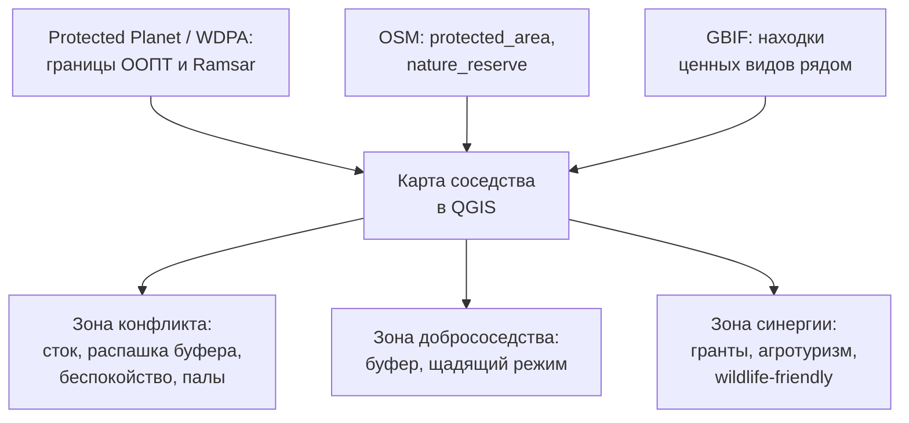
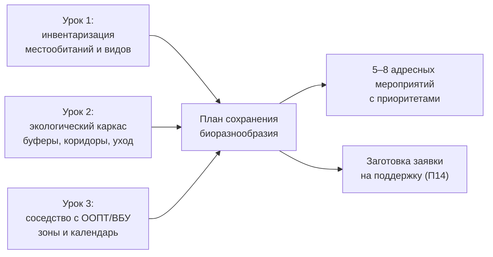

# Соседство с ООПТ и ВБУ: собираем план сохранения биоразнообразия

> ⏱ **Трудозатраты:** ~19 мин чтения + ~25 мин практики
>
> Модуль **[П13: Биоразнообразие и прилегающие экосистемы](../index.md)**, урок 3.
> Профессиональный уровень (МСБ). Проект UNDP-KAZ-00683, FOLUR. Компоненты FOLUR: **2, 3**.

## Цели урока и место в модуле

Хозяйство не существует в вакууме: рядом могут быть особо охраняемые природные территории (ООПТ) — заповедники, заказники, национальные парки — и водно-болотные угодья (ВБУ) международного значения. Северный Казахстан здесь особенный: его степные озёра лежат на путях миграции птиц, а часть охраняемых территорий имеет мировой статус. Для МСБ это и ограничения, и возможности. Этот урок учит грамотному **добрососедству** — определять режимы сосуществования, видеть зоны конфликта и синергии — и собирает все части модуля в готовый **план сохранения биоразнообразия хозяйства**, прикладной продукт П13.

После изучения урока вы сможете:

1. **[Bloom: знать]** называть основные категории ООПТ и статус ВБУ (Рамсарская конвенция), открытые источники о них (Protected Planet/WDPA) и структуру плана сохранения биоразнообразия.
2. **[Bloom: понимать]** объяснять логику режимов сосуществования: почему у границы ООПТ и ВБУ действуют ограничения и зачем они хозяйству.
3. **[Bloom: применять]** определять по открытым данным соседство территории с ООПТ/ВБУ, размечать зоны добрососедства и собирать план сохранения биоразнообразия из инвентаризации, каркаса и мер.
4. **[Bloom: анализировать]** оценивать зоны конфликта (стоки, распашка буферов, беспокойство, палы) и синергии (гранты, агротуризм, «дружественное к дикой природе» земледелие) в соседстве с охраняемыми территориями.

> **Границы лекции.** Внутри: категории ООПТ и ВБУ, режимы добрососедства, зоны конфликта и синергии, сборка плана сохранения биоразнообразия. Снаружи: инвентаризация — [урок 1](01-inventarizaciya-bioraznoobraziya.md); проектирование каркаса, буферов и восстановления — [урок 2](02-ekologicheskij-karkas-bufery-lesopolosy.md); точные режимы, площади и правовые нормы конкретных ООПТ РК — официальные реестры и законодательство (adilet.zan.kz); научные основы природоохранного планирования — [А6](../../a6/index.md); заявка на грант — [П14](../../p14/index.md). Точные режимы, штрафы, площади и охранные статусы здесь не приводятся — берите их из официальных источников.

---

## 1. ООПТ и ВБУ: что рядом с хозяйством и почему это важно

**Особо охраняемые природные территории (ООПТ)** — участки с установленным режимом охраны: заповедники (строгий режим), национальные и природные парки, заказники, памятники природы, охранные зоны вокруг них. Каждая категория имеет свой режим — от полного запрета хозяйственной деятельности до регулируемого природопользования. **Водно-болотные угодья (ВБУ)** международного значения охраняются **Рамсарской конвенцией**; Казахстан — её сторона, и часть степных озёр имеет этот статус.

Северный Казахстан — регион с ООПТ мирового уровня. Объект Всемирного наследия ЮНЕСКО **«Сарыарка — Степи и озёра Северного Казахстана»** включает **Коргалжынский** (Акмолинская область) и **Наурзумский** (Костанайская область) государственные природные заповедники — ключевые точки на Центральноазиатском пролётном пути мигрирующих птиц и одни из самых северных мест обитания фламинго. Это не абстракция: хозяйство в этих областях вполне может оказаться по соседству с ООПТ или Ramsar-угодьем, и тогда добрососедство — не добрая воля, а часть правового и репутационного контекста работы.

!!! warning "Режимы, площади и статусы — из официальных источников"
    Конкретные границы, категории, режимы и охранные статусы ООПТ и ВБУ, а также ответственность за их нарушение устанавливаются законодательством и официальными реестрами. Модуль объясняет **логику** добрососедства и учит **находить** соседство по открытым данным, но точные режимы, площади, охранные статусы видов и суммы штрафов берите из официальных источников (adilet.zan.kz, реестр ООПТ, Красная книга РК, Рамсарский информационный лист) — не выдумывайте их.

## 2. Находим соседство по открытым данным

Прежде чем говорить о режимах, нужно узнать, **что вообще рядом**. Открытые источники:

- **Protected Planet / WDPA** (<https://www.protectedplanet.net/>) — глобальная база ООПТ и Ramsar-угодий: категории, границы, статусы. Можно найти ближайшие охраняемые территории к вашему участку.
- **OpenStreetMap** — теги `boundary=protected_area`, `leisure=nature_reserve`, `boundary=national_park`: границы ООПТ на карте.
- **GBIF** ([урок 1](01-inventarizaciya-bioraznoobraziya.md)) — находки ценных и охраняемых видов поблизости: сигнал, что территория важна для биоразнообразия и требует осторожности.

Загрузив границы ООПТ/ВБУ в QGIS рядом со своей территорией, вы сразу видите картину: примыкает ли хозяйство к охраняемой территории, попадает ли в её охранную зону, лежит ли между вашими полями и ООПТ водоток, по которому идёт сток. Это карта-основа для разметки зон добрососедства.



*Рис. 1. От открытых данных о соседстве — к зонам добрососедства. Alt: схема-поток. Три источника — Protected Planet/WDPA (границы ООПТ и Ramsar), OpenStreetMap (protected_area, nature_reserve) и GBIF (находки ценных видов рядом) — сходятся в карту соседства в QGIS. Карта выделяет три зоны: конфликта (сток, распашка буфера, беспокойство, палы), добрососедства (буфер, щадящий режим) и синергии (гранты, агротуризм, дружественное к дикой природе земледелие).*

## 3. Зоны конфликта и добрососедства

Соседство с ООПТ/ВБУ создаёт **зоны потенциального конфликта** — там, где деятельность хозяйства вредит охраняемой территории (а нередко и самому хозяйству):

- **сток агрохимии и наносов** в водоём ООПТ или Ramsar-угодье — эвтрофикация, загрязнение;
- **распашка вплотную** к границе, уничтожение буфера и краевых местообитаний;
- **беспокойство фауны** — шум, техника, выпас в чувствительные сезоны (гнездование, миграция);
- **палы** (выжигание стерни и травы) — прямая угроза соседним степным и водно-болотным местообитаниям.

Ответ на конфликт — **зона добрососедства**: буферная полоса вдоль границы ООПТ/ВБУ (см. [урок 2, §1](02-ekologicheskij-karkas-bufery-lesopolosy.md)) с щадящим режимом — без распашки вплотную, с ограничением агрохимии у воды, с учётом сезонов покоя фауны, без палов. Такая зона одновременно защищает охраняемую территорию и снижает риски для хозяйства (претензии, штрафы, репутация), а часто и приносит пользу — буфер работает и на биоразнообразие самого хозяйства.

### 3.1 Сезонность: календарь щадящего режима

Многое в добрососедстве решает **время**. Гнездование птиц, миграция, цветение медоносов — периоды, когда беспокойство особенно вредно. Практический инструмент — простой **календарь**: в какие сезоны у границы ООПТ/ВБУ и в буферах ограничивают шумные работы, выпас, покос, обработки. Например, покос водно-болотной полосы лучше сдвинуть за пределы сезона гнездования, а обработки у ВБУ согласовать с периодом лёта опылителей и активности фауны. Конкретные даты зависят от видов и региона — их уточняют по местным данным, а не назначают произвольно; но сам принцип «у охраняемой территории есть чувствительные сезоны» — рабочая часть плана.

Степные озёра Северного Казахстана лежат на Центральноазиатском пролётном пути, и весной-осенью на них останавливаются массы мигрирующих птиц. Для соседнего хозяйства это значит, что именно в пролётные и гнездовые недели у границы ВБУ особенно важны тишина, отказ от палов и щадящий режим у воды. Календарь превращает это знание в конкретные строки: «в такой-то период — не косить прибрежную полосу, не жечь стерню у границы, планировать шумные работы вдали от водоёма». Такой календарь — не бюрократия, а способ не разрушить бесплатный ресурс, который делает территорию ценной, и не нажить конфликта с администрацией ООПТ.

## 4. Синергия: соседство как возможность

Добрососедство — не только ограничения. Соседство с ООПТ и ВБУ открывает возможности:

- **гранты и поддержка** — проекты, подобные FOLUR, и природоохранные доноры поддерживают хозяйства в буферных зонах ООПТ, восстановление местообитаний, «дружественные к дикой природе» практики (заявка — [П14](../../p14/index.md));
- **«дружественное к дикой природе» земледелие (wildlife-friendly farming)** — практики, совместимые с сохранением видов (полосы медоносов, поздний покос, сохранение гнездовий, экологизация обработок), часто дают и агрономическую выгоду (опыление, биозащита);
- **агротуризм и репутация** — соседство с известной ООПТ и статус «хозяйства, дружественного природе» — маркетинговый актив для «зелёной» продукции ([П15](../../p15/index.md));
- **обмен знаниями** — сотрудничество с администрацией ООПТ, доступ к данным мониторинга, участие в наблюдениях.

Логика та же, что и внутри хозяйства: искать меры, где польза биоразнообразию совпадает с пользой хозяйству. Соседство с ООПТ превращает часть «ограничений» в конкурентное преимущество и источник поддержки.

Стоит и правильно выстроить отношения с администрацией ООПТ. Заповедник или заказник — не «соседский конкурент за землю», а сторона, заинтересованная в том, чтобы буферная зона вокруг неё была здоровой: от этого зависит и состояние самой охраняемой территории. Хозяйство, которое само предлагает буфер, отказ от палов у границы и согласование сезонных работ, получает предсказуемого партнёра вместо источника проверок и предписаний. Такое сотрудничество нередко открывает доступ к данным мониторинга, экспертной помощи в определении видов и местообитаний и к участию в совместных проектах — то есть к ресурсам, которых у отдельного хозяйства нет. Добрососедство здесь — это управление рисками и репутацией, а не уступка.

## 5. Собираем план сохранения биоразнообразия

Теперь все части складываются в прикладной продукт модуля — **план сохранения биоразнообразия в границах и окрестностях хозяйства**. Рекомендуемая структура (её вы заполните в [практикуме](../practicum/01-plan-sohraneniya-bioraznoobraziya.md)):

1. **Резюме** — что за территория, чем ценна, главные приоритеты (3–5 предложений).
2. **Инвентаризация** — карта и таблица местообитаний, слой видовых находок GBIF ([урок 1](01-inventarizaciya-bioraznoobraziya.md)).
3. **Экологический каркас** — схема ядер, коридоров, буферов, разрывов ([урок 2](02-ekologicheskij-karkas-bufery-lesopolosy.md)).
4. **Соседство с ООПТ/ВБУ** — карта соседства, зоны конфликта, добрососедства и синергии (этот урок).
5. **Мероприятия** — 5–8 адресных мер (буферы, коридоры, уход за лесополосами и ВБУ, календарь щадящего режима) с приоритетами по критерию «польза каркасу ↔ затраты хозяйства».
6. **Источники и оговорки** — открытые данные, качественный характер оценок, пометка непроверенных величин; режимы и статусы — со ссылкой на официальные источники.



*Рис. 2. Как три урока собираются в план сохранения биоразнообразия. Alt: схема-поток. Урок 1 (инвентаризация местообитаний и видов), урок 2 (экологический каркас: буферы, коридоры, уход) и урок 3 (соседство с ООПТ/ВБУ: зоны и календарь) сходятся в план сохранения биоразнообразия, который порождает 5–8 адресных мероприятий с приоритетами и заготовку заявки на поддержку для модуля П14.*

Финальный критерий качества плана — тот же, что у отчёта в [П6](../../p6/index.md): можно ли на его основе **принять и обосновать конкретное решение** — что, где и когда делать — перед собой, партнёром, администрацией ООПТ или фондом. Если мероприятие звучит как «беречь природу» без адреса, срока и получателя пользы — оно недоработано.

---

## Региональный кейс

**Ситуация.** Хозяйство в Коргалжынском районе Акмолинской области примыкает своими полями к охранной зоне крупной степной ООПТ с водно-болотными угодьями международного значения. Часть полей выходит к водотоку, впадающему в озёрную систему ООПТ; вдоль границы пашня подходит вплотную к охраняемой территории; весной по стерне иногда пускают палы. Владелец хочет и не нарушать режим, и получить пользу от соседства.

**Данные:** Protected Planet/WDPA (<https://www.protectedplanet.net/>) — границы и статус ООПТ и Ramsar-угодья; OpenStreetMap (`boundary=protected_area`, водотоки, землепользование); GBIF (<https://www.gbif.org/>) — находки водоплавающих и степных видов рядом; открытая ЦМР — направление стока к озёрной системе. Обработка в QGIS.

**Задача:**

1. Загрузить границы ООПТ/ВБУ и определить, где хозяйство соседствует с охраняемой территорией.
2. Выявить зоны конфликта: сток к озёрной системе, распашка вплотную, палы.
3. Разметить зону добрососедства (буфер вдоль границы и водотока) и составить простой сезонный календарь.
4. Назвать одну меру-синергию, превращающую соседство в возможность.

**Разбор.** Границы из WDPA показывают, что южные поля примыкают к охранной зоне ООПТ, а водоток несёт сток прямо в озёрную систему — главная зона конфликта. Буфер вдоль границы и водотока (зона добрососедства) задержит агрохимию и наносы и уберёт распашку вплотную; отказ от палов у границы снимает угрозу степным и водно-болотным местообитаниям. Календарь: сдвинуть покос прибрежной полосы за сезон гнездования, согласовать обработки с активностью фауны. Мера-синергия: буферная водно-болотная полоса вдоль водотока — одновременно защита ООПТ, местообитание, снегозадержание и основание для заявки на поддержку в буферной зоне ООПТ (FOLUR/доноры — [П14](../../p14/index.md)) и для «зелёного» позиционирования продукции ([П15](../../p15/index.md)). Итог — карта соседства с зонами и 2–3 приоритетных меры, где добрососедство и выгода совпадают. Точные режимы охранной зоны, площади и штрафы в кейсе не приводятся: их берут из официальных источников, карта указывает адрес и логику.

---

## Закрепление и применение

!!! example "Попробуйте в QGIS"
    За 20–25 минут: (1) найдите на Protected Planet ближайшие к вашей территории ООПТ и Ramsar-угодья и загрузите их границы (или из OSM `boundary=protected_area`) в QGIS; (2) наложите свою территорию и водотоки, определите места соседства и направление стока; (3) отметьте зоны конфликта (сток, распашка вплотную, палы) и разметьте буфер добрососедства; (4) набросайте сезонный календарь щадящего режима. Пошаговые инструкции — в [практикуме](../practicum/01-plan-sohraneniya-bioraznoobraziya.md).

!!! warning "Границы применимости"
    Карта соседства из открытых данных показывает, **что рядом** и **где логично** быть буферу и осторожности, но не заменяет официальные режимы. Точные границы охранных зон, категории, разрешённые виды деятельности, охранные статусы видов и ответственность — только из законодательства и реестров (adilet.zan.kz, реестр ООПТ, Красная книга РК, Рамсарский лист). Открытые слои бывают неточны в деталях границ — для реальных решений сверяйтесь с официальными данными.

!!! tip "Что это даёт вашему хозяйству"
    Понимание соседства снимает риски (претензии, штрафы, репутационный ущерб) и открывает возможности: буфер у ООПТ защищает и охраняемую территорию, и ваши поля, а статус «дружественного природе» хозяйства в буферной зоне известной ООПТ — основание для грантов ([П14](../../p14/index.md)) и «зелёного» маркетинга ([П15](../../p15/index.md)).

!!! question "Кейс для размышления"
    Ваши поля примыкают к охранной зоне ООПТ с водно-болотным угодьем. Сосед предлагает распахать прибрежную полосу «под пшеницу — земля пропадает». Вы видите, что по этой полосе идёт сток в озеро ООПТ. Какие аргументы — экологические, правовые и хозяйственные — вы приведёте против распашки и что предложите взамен? Подсказка: соедините зону конфликта (§3), буфер добрососедства и синергию/грант (§4).

### Проверь себя

```quiz
[
  {
    "q": "Что охраняет Рамсарская конвенция, о которой идёт речь в уроке?",
    "options": [
      "Водно-болотные угодья (ВБУ) международного значения",
      "Лесополосы",
      "Пахотные земли",
      "Сорта культурных растений"
    ],
    "answer": 0,
    "explain": "§1: Рамсарская конвенция — международная рамка охраны ВБУ; часть степных озёр Северного Казахстана имеет этот статус."
  },
  {
    "q": "По каким открытым данным удобно определить соседство хозяйства с ООПТ и Ramsar-угодьями?",
    "options": [
      "Protected Planet/WDPA и теги OpenStreetMap (protected_area, nature_reserve)",
      "Только по бумажной карте района",
      "По коммерческим спутниковым сервисам с платной подпиской",
      "По прогнозу погоды"
    ],
    "answer": 0,
    "explain": "§2: Protected Planet/WDPA даёт границы и статусы ООПТ и Ramsar, OSM — их границы на карте; GBIF дополняет находками ценных видов рядом."
  },
  {
    "q": "Что относится к зоне конфликта хозяйства с соседней ООПТ/ВБУ?",
    "options": [
      "Сток агрохимии и наносов в водоём, распашка вплотную к границе, беспокойство фауны, палы",
      "Установка буферной полосы вдоль границы",
      "Согласование сроков покоса с сезоном гнездования",
      "Подача заявки на грант для буферной зоны"
    ],
    "answer": 0,
    "explain": "§3: конфликт — там, где деятельность вредит охраняемой территории; буфер, календарь и грант — это уже ответы на конфликт и синергия."
  },
  {
    "q": "Как соседство с ООПТ может стать возможностью, а не только ограничением?",
    "options": [
      "Через гранты для буферных зон, «дружественное к дикой природе» земледелие с агровыгодой, агротуризм и «зелёный» маркетинг",
      "Через распашку охранной зоны под пашню",
      "Через отказ от любых природоохранных мер",
      "Через засекречивание данных о соседстве"
    ],
    "answer": 0,
    "explain": "§4: соседство открывает поддержку доноров (FOLUR), wildlife-friendly практики с пользой урожаю, агротуризм и репутацию — польза природе совпадает с пользой хозяйству."
  },
  {
    "q": "Откуда брать точные режимы, площади и охранные статусы ООПТ и видов для реального плана?",
    "options": [
      "Из официальных источников: законодательство (adilet.zan.kz), реестр ООПТ, Красная книга РК, Рамсарский лист — не выдумывать и не брать из головы",
      "Из ответа чат-ассистента без проверки",
      "Оценить на глаз по снимку",
      "Скопировать у соседнего хозяйства"
    ],
    "answer": 0,
    "explain": "§1, §3 врезки: модуль объясняет логику и учит находить соседство, но точные режимы, статусы и штрафы — только из проверяемых официальных источников."
  },
  {
    "q": "Каков финальный критерий качества плана сохранения биоразнообразия?",
    "options": [
      "Можно ли на его основе принять и обосновать конкретное решение — что, где и когда делать — перед партнёром, администрацией ООПТ или фондом",
      "Достаточно ли в нём красивых фотографий природы",
      "Превышает ли он 50 страниц",
      "Есть ли в нём точные суммы штрафов"
    ],
    "answer": 0,
    "explain": "§5: план — инструмент решений через адресные мероприятия с местом, сроком и получателем пользы, а не декларация «беречь природу»."
  }
]
```

## Что дальше?

Три урока сложились в план сохранения биоразнообразия: инвентаризация, экологический каркас, соседство с ООПТ/ВБУ и адресные мероприятия. Теперь — **[практикум «Собираем план сохранения биоразнообразия хозяйства»](../practicum/01-plan-sohraneniya-bioraznoobraziya.md)**, где вы пройдёте весь путь на реальных открытых данных своей территории и получите готовый продукт модуля. Затем [ИИ-задание](../ai-assistant.md) научит ускорять подготовку перечня мер с чат-ассистентом и **верифицировать** его результат, а [аттестация](../assessment/final.md) проверит освоение. Заявку на поддержку по плану готовит [П14](../../p14/index.md); «зелёное» позиционирование продукции — [П15](../../p15/index.md); научные основы — [А6](../../a6/index.md).
