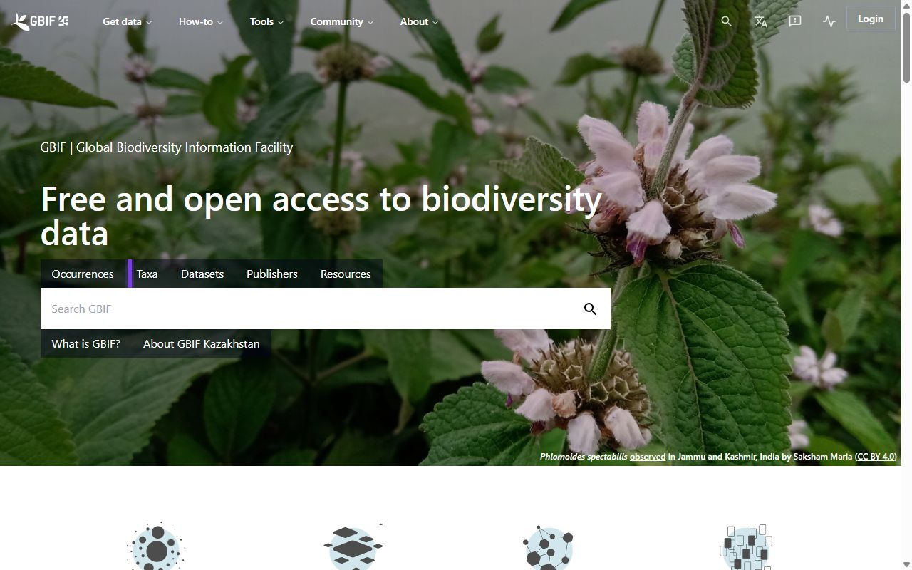
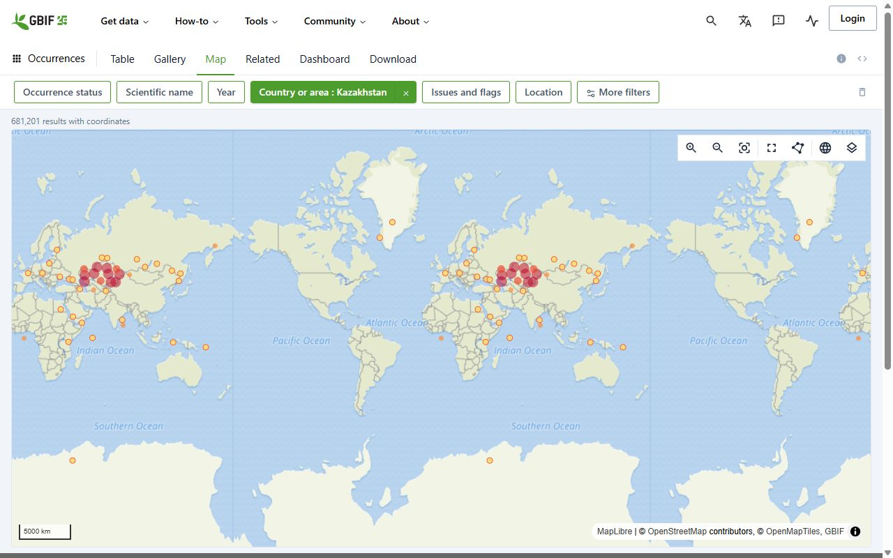

# Практикум: собираем план сохранения биоразнообразия хозяйства

<!-- folur-software:start -->

!!! tip "Что понадобится в этом уроке и где это взять"
    Нажмите на название программы и увидите, **где её взять, что нажать и как она выглядит в работе** (нужная кнопка на снимке обведена фиолетовым). Встроенный редактор Python установки не требует. Полная справка — [«Программы и сервисы»](../../../software.md).

??? example "Встроенный редактор Python — как запустить и что получится"
    { .folur-shot loading=lazy }

    1. Скачивать и устанавливать ничего не нужно: редактор находится в этом уроке, на шаге **«Практика в Python»**.
    2. Нажмите **«▶ Запустить»** под кодом (на снимке обведена). В первый раз подождите до минуты, пока загрузится Python.
    3. Ниже, в блоке «Результат», появятся таблицы и графики. Измените число в коде и запустите ещё раз.
    4. Вкладка **«Мой участок»** над редактором считает то же по вашим координатам, контуру поля или снимку.

    **Как это выглядит в работе.** Пример результата: таблицы под кодом и кнопки скачивания файлов.

    { .folur-shot loading=lazy }

    **Как это выглядит в работе.** Вкладка «Мой участок»: координаты поля, контур и снимок подставляются здесь.

    { .folur-shot loading=lazy }

    [Подробно о редакторе, своих данных и запросе для нейросети →](../../../software.md#python)

??? example "QGIS — скачать и установить"
    { .folur-shot loading=lazy }

    1. Откройте <https://qgis.org/download/>. Сайт сначала предложит пожертвование — оно необязательно: нажмите **«Skip it and go to download»**.
    2. Нажмите зелёную кнопку **«Download LTR»** (на снимке обведена). LTR — версия долгосрочной поддержки, она стабильнее. Скачается установщик размером около 1 ГБ.
    3. Запустите скачанный файл и нажимайте «Next», ничего не меняя. После установки откройте в меню «Пуск» ярлык **QGIS Desktop**.

    **Как это выглядит в работе.** QGIS в работе (русский интерфейс): слева панели «Браузер» и «Слои», в центре — учебное поле на подложке OpenStreetMap с подписью площади, внизу справа — система координат проекта.

    { .folur-shot loading=lazy }

    [Первые шаги в QGIS и русский интерфейс →](../../../software.md#qgis)

??? example "Copernicus Browser — открыть в браузере"
    { .folur-shot loading=lazy }

    1. Скачивать ничего не нужно: откройте <https://browser.dataspace.copernicus.eu/>.
    2. В первом окне нажмите **«Use anonymously»** (на снимке обведена) — смотреть снимки можно без регистрации.
    3. Чтобы **скачивать** снимки, нужна бесплатная учётная запись: кнопка **«Log in»** → регистрация → подтверждение по письму.

    [Как найти своё поле и выбрать снимок →](../../../software.md#copernicus)

??? example "GBIF и Protected Planet — открыть в браузере"
    { .folur-shot loading=lazy }

    1. Скачивать ничего не нужно. GBIF: откройте <https://www.gbif.org/> и выберите **«Occurrences»** (на снимке обведена) — поиск находок видов. Смотреть можно без регистрации, для скачивания нужна бесплатная учётная запись.
    2. Protected Planet: откройте <https://www.protectedplanet.net/> и нажмите **«Explore protected areas and OECMs»** — откроется карта охраняемых территорий.

    **Как это выглядит в работе.** GBIF в работе: находки видов с фильтром «Country or area: Kazakhstan» на карте.

    { .folur-shot loading=lazy }

    [Что помнить об этих данных →](../../../software.md#bio)

??? example "Таблицы: LibreOffice — скачать (или Google Таблицы без установки)"
    { .folur-shot loading=lazy }

    1. Если у вас есть Microsoft Excel или аккаунт Google (Google Таблицы работают в браузере) — ставить ничего не нужно.
    2. Иначе откройте <https://www.libreoffice.org/download/download-libreoffice/> и нажмите зелёную кнопку **«Windows (x86-64)»** (на снимке обведена).
    3. Запустите скачанный файл и нажимайте «Далее». Для таблиц открывайте программу **LibreOffice Calc**.

    [Как сохранять таблицу в CSV →](../../../software.md#office)

<!-- folur-software:end -->

!!! info "Вычисления в браузере"
    Для этого материала подготовлен [редактор Python](#python-practice). Он выполняет весь скрипт целиком; графики, изображения, таблицы и файлы появляются под кодом. Учебный пример запускается без аккаунта Google. Облачные API и полноценные настольные ГИС используются отдельно, когда этого требует исходное задание.

Порог сертификации — 75 %: квизы тем проверяли навыки по отдельности, ниже — связки, как в реальной работе. Сначала — практикум по шагам, затем ИИ-задание, банк и сценарный кейс. К аттестации предъявляются план сохранения биоразнообразия хозяйства из практикума («Проект на ВАШЕЙ земле») и таблица верификации перечня мер из ИИ-задания.

## Практикум: план сохранения биоразнообразия хозяйства (по шагам)

Модуль П13: Биоразнообразие и прилегающие экосистемы. Время выполнения: 60–90 мин.

Инструменты: QGIS (свободная ГИС) + браузер (Copernicus Browser, OpenStreetMap, GBIF, Protected Planet). Только открытый бесплатный стек.

Данные: OpenStreetMap, Sentinel-2 L2A (Copernicus), GBIF, WDPA/Protected Planet, открытая ЦМР Copernicus — всё бесплатно и открыто.

Цель практикума

<em>самостоятельно</em> собрать **план сохранения биоразнообразия в границах и окрестностях хозяйства** — инвентаризацию местообитаний и видов, схему экологического каркаса (ядра, коридоры, буферы), карту соседства с ООПТ/ВБУ и 5–8 адресных мероприятий с приоритетами — на реальных открытых данных выбранной территории.

Практикум объединяет уроки 1–3 (инвентаризация, каркас, соседство с ООПТ/ВБУ) и применяет их на территории СКО / Костанайской / Акмолинской области (или на вашей — см. рамку в конце).

Что нужно подготовить

QGIS (версия LTR) — установите бесплатно с &lt;<a href="https://qgis.org/&gt">https://qgis.org/&gt</a>; (Windows/macOS/Linux). Плагины: QuickMapServices (подложки) и QuickOSM (выборки OSM).

Учётная запись Copernicus (бесплатная) — &lt;<a href="https://dataspace.copernicus.eu/&gt">https://dataspace.copernicus.eu/&gt</a>; для Sentinel-2 и Copernicus Browser.

Открытая ЦМР (рельеф) — Copernicus DEM GLO-30 через &lt;<a href="https://dataspace.copernicus.eu/&gt">https://dataspace.copernicus.eu/&gt</a>; или OpenTopography; нужна для оценки направления стока к охраняемым водоёмам в Шаге 5 (загрузите как растровый слой).

Территория — выберите модельный участок в СКО/Костанай/Акмола (напр., Костанайский, Буландынский или Коргалжынский район) ИЛИ территорию своего хозяйства.

Доступ к GBIF — &lt;<a href="https://www.gbif.org/&gt">https://www.gbif.org/&gt</a>; (регистрация не обязательна для поиска и просмотра).

Доступ к Protected Planet — &lt;<a href="https://www.protectedplanet.net/&gt">https://www.protectedplanet.net/&gt</a>; (просмотр и скачивание слоёв ООПТ/Ramsar бесплатны).

Шаблон плана — создайте документ (LibreOffice Writer/Google Docs) с шестью разделами из урока 3, §5.

Задание

Шаг 1: подложка и территория (8 мин)

Откройте QGIS → установите QuickMapServices → добавьте базовую карту OSM (Web → QuickMapServices → OSM Standard).

Приблизьте карту к выбранной территории. Загрузите векторные данные OSM: Векторный слой → QuickOSM, ключи: <code>landuse</code>, <code>natural</code>, <code>water</code>, <code>waterway</code>, <code>barrier</code>, <code>boundary</code> (для ООПТ). Либо скачайте выборку с &lt;<a href="https://download.geofabrik.de/&gt">https://download.geofabrik.de/&gt</a>; (Kazakhstan).

Ожидаемый результат: проект QGIS с подложкой OSM и векторными слоями природных объектов и границ территории.

Шаг 2: инвентаризация местообитаний (12 мин)

Создайте слой-полигон (GeoPackage) <code>mestoobitaniya</code> с полями: <code>id</code> (целое), <code>tip</code> (текст: лесополоса/залежь/степной остров/балка/ВБУ/водоём), <code>sostoyanie</code> (текст: хорошее/среднее/деградировано), <code>funkciya</code> (текст: коридор/ядро/буфер/ступенька), <code>primechanie</code> (текст).

Оцифруйте или выделите из OSM не менее пяти типов местообитаний (урок 1, §2).

Загрузите композит Sentinel-2 (Copernicus Browser) или рассчитайте NDVI и оцените состояние лесополос и ВБУ (густые/разреженные, влажные/пересохшие) — впишите в <code>sostoyanie</code>.

Ожидаемый результат: слой <code>mestoobitaniya</code> с ≥5 типами местообитаний и оценкой состояния по NDVI.

Шаг 3: слой видовых находок из GBIF (8 мин)

Откройте &lt;<a href="https://www.gbif.org/&gt">https://www.gbif.org/&gt</a>;, вкладка Occurrences, задайте фильтр по своему району/области (полигон или административная единица).

Посмотрите, какие группы документированы: опылители, степные птицы, водоплавающие. Отметьте ценные/охраняемые виды поблизости (сверяйте статус по официальным источникам, не выдумывайте).

При желании скачайте выборку (CSV/GeoJSON) и загрузите точки в QGIS как слой <code>nahodki_gbif</code>. Либо зафиксируйте перечень групп видов в таблице плана.

Ожидаемый результат: перечень или слой документированных видов района с пометкой ценных находок поблизости.

Честное чтение GBIF.

GBIF показывает, где вид регистрировали, с наблюдательным смещением, без гарантии наличия на вашем поле и без численности (урок 1, §4). Используйте как перечень «кто здесь встречается», а не как перепись. Численности и охранный статус — из Красной книги РК, а не из головы.

Шаг 4: схема экологического каркаса (12 мин)

По полю <code>funkciya</code> разметьте местообитания: ядра (крупные ценные — залежь, ВБУ, степной остров), коридоры (лесополосы, балки), ступеньки (мелкие полосы).

Создайте слой-линию <code>koridory</code> и проведите соединительные коридоры для разрывов каркаса — по неудобьям, межам, балкам, минимизируя выведенную пашню (урок 2, §2).

Создайте слой-полигон <code>bufery</code>: постройте буферы (Вектор → Геообработка → Буфер) вокруг ВБУ, водотоков и ценных ядер как качественную градацию ширины (урок 2, §1).

Ожидаемый результат: схема каркаса — ядра, коридоры, буферы, отмеченные разрывы.

Шаг 5: карта соседства с ООПТ/ВБУ (10 мин)

На &lt;<a href="https://www.protectedplanet.net/&gt">https://www.protectedplanet.net/&gt</a>; найдите ближайшие к территории ООПТ и Ramsar-угодья; скачайте границы (или возьмите из OSM <code>boundary=protected_area</code>, <code>leisure=nature_reserve</code>) и загрузите в QGIS.

Наложите свою территорию и водотоки. Определите места соседства и по ЦМР — направление стока к охраняемым водоёмам.

Отметьте зоны конфликта (сток, распашка вплотную, палы, беспокойство) и разметьте зону добрососедства (буфер вдоль границы ООПТ/ВБУ) (урок 3, §3).

Набросайте простой сезонный календарь щадящего режима (покос, обработки, выпас у границы).

Ожидаемый результат: карта соседства с зонами конфликта/добрососедства и сезонный календарь.

Шаг 6: мероприятия и приоритеты (10 мин)

Соберите 5–8 адресных мероприятий: буферы у ВБУ/водотоков, коридоры для разрывов, уход/дополнение приоритетных лесополос (по NDVI), режим у ООПТ, календарь.

Для каждого оцените качественно пользу каркасу и затраты хозяйства (прежде всего — выведенная пашня). Отметьте меры-синергии (урок 2, §5).

Расставьте приоритеты: сверху — максимум пользы при минимуме затрат.

Ожидаемый результат: таблица из 5–8 мероприятий с приоритетами и отметкой синергий.

Шаг 7: соберите план (10 мин)

Заполните шесть разделов шаблона (урок 3, §5):

Резюме (3–5 предложений).

Инвентаризация (таблица + карта местообитаний из шага 2, виды из шага 3).

Экологический каркас (схема из шага 4).

Соседство с ООПТ/ВБУ (карта и зоны из шага 5).

Мероприятия с приоритетами (шаг 6).

Источники и оговорки (открытые данные, качественный характер оценок, режимы/статусы — со ссылкой на официальные источники, непроверенные величины помечены).

Ожидаемый результат: готовый план сохранения биоразнообразия хозяйства.

Продукт задания

По итогам практикума у вас должен быть:

Проект QGIS со слоями <code>mestoobitaniya</code>, <code>koridory</code>, <code>bufery</code>, границами ООПТ/ВБУ и (опц.) <code>nahodki_gbif</code>.

Таблица инвентаризации и таблица 5–8 мероприятий с приоритетами.

Готовый план сохранения биоразнообразия хозяйства (6 разделов) с картами.

Самопроверка: пройдитесь по плану с финальным критерием урока 3, §5: можно ли на его основе принять и обосновать конкретное решение — что, где и когда делать — перед партнёром, администрацией ООПТ или фондом? Каждое мероприятие должно быть привязано к месту, элементу каркаса и (где нужно) сезону; ни одной численности вида, ширины буфера в «метрах-нормах» или суммы штрафа без официального источника; каждая карта — с легендой. Если мероприятие звучит как «беречь природу» — вернитесь к шагу 6 и сделайте его адресным.

Дополнительные задания (по желанию)

Динамика местообитания: сравните состояние лесополос/тростника по NDVI Sentinel-2 за два разных года — усиливается или деградирует местообитание (П3).

Другой район: повторите для соседнего района с иным соседством (ближе/дальше от ООПТ) и сравните структуру каркаса.

Заявка: на основе мероприятий набросайте раздел заявки на поддержку восстановления/буферной зоны (П14).

Применить к своему хозяйству — «Проект на ВАШЕЙ земле».

Повторите все семь шагов на территории вашего хозяйства. Загрузите границы своих полей (из П1/П2 или оцифруйте по снимку), внесите реальные местообитания (свои лесополосы, пруд, балку, залежь) в слой <code>mestoobitaniya</code>, проверьте по GBIF, что документировано в районе, найдите на Protected Planet ближайшие ООПТ/ВБУ и соберите план под свою землю. Результат — не учебное упражнение, а рабочий документ: план сохранения биоразнообразия и заготовка заявки на поддержку. Если у хозяйства есть водоём и вы захотите показать пример работы с промерами глубин, используйте только обезличенный учебный набор уровня A (Датасеты платформы) — без реальных координат вашего водоёма.

Связи

Лекция 1 (<code>lectures/01-inventarizaciya-bioraznoobraziya.md</code>) — инвентаризация местообитаний и видов (шаги 2–3).

Лекция 2 (<code>lectures/02-ekologicheskij-karkas-bufery-lesopolosy.md</code>) — каркас, буферы, коридоры (шаг 4).

Лекция 3 (<code>lectures/03-oopt-vbu-plan-sohraneniya.md</code>) — соседство с ООПТ/ВБУ и сборка плана (шаги 5–7).

ИИ-задание — ускорение перечня мер с чат-ассистентом и его верификация.

Датасеты и правовой режим: Датасеты платформы.

Заметки для автора практикума

Все данные реально бесплатны и открыты: OSM, Sentinel-2/Copernicus, GBIF, WDPA/Protected Planet, открытые ЦМР.

Каждый шаг имеет проверяемый ожидаемый результат — слушатель контролирует себя без инструктора.

Оценки — качественный скрининг: не требовать точных численностей видов, ширин буферов в «нормах-метрах», площадей и режимов ООПТ; величины остаются учебными градациями, официальные параметры — со ссылкой на источник.

Практикум выполним и без QGIS (частично — в браузерах Copernicus, GBIF, Protected Planet и вручную), но QGIS даёт полноценный продукт; платные API и сервисы не используются.

<section class="folur-python-practice" id="python-practice">
<h3>Практика в Python — прямо в уроке</h3>
<ol class="folur-lab-steps"><li>Нажмите <strong>▶ Запустить</strong> под кодом. При первом запуске загружается Python — это занимает до минуты.</li><li>Таблицы, графики и файлы появятся ниже, в блоке «Результат».</li><li>Измените параметры в коде и запустите ещё раз. Кнопка «Восстановить пример» возвращает исходный код.</li></ol>

Устанавливать ничего не нужно: редактор работает прямо в браузере, без аккаунта. <a href="/python-lab/editor.html?exercise=p13-practice" target="_blank" rel="noopener">Открыть редактор в отдельной вкладке</a>.

<iframe class="folur-python-editor" src="/python-lab/editor.html?exercise=p13-practice" title="Python: p13-practice" loading="lazy" style="width:100%;height:1250px;border:1px solid #d4dfd0;border-radius:8px"></iframe>

<strong>О данных.</strong> Пример работает на синтетических (учебных) данных — скачивать ничего не нужно. Свои CSV, изображения и растры можно подключить в редакторе: раскройте блок «Свои данные и возможности среды».

<strong>Свой участок.</strong> Во вкладке «Мой участок» над редактором можно вставить координаты своего поля или загрузить его контур (GeoJSON, KML, GeoPackage, Shapefile в архиве .zip) и снимок (GeoTIFF) — и получить паспорт данных, площадь, систему координат и оценку съёмки. Данные остаются в вашем браузере и сохраняются для следующих уроков.

</section>

---

[Программа модуля](../index.md) · [Данные и условия использования](../../../datasets.md)
