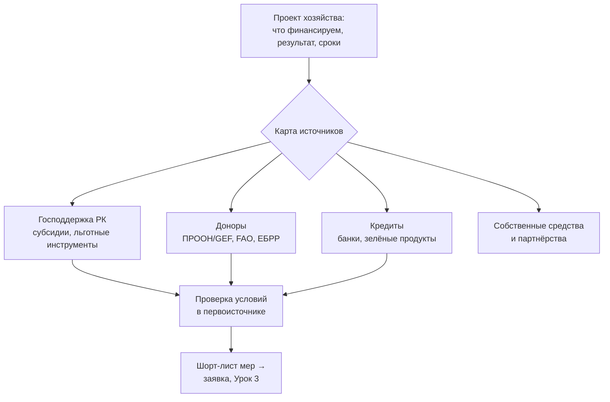

# Строим карту источников финансирования: господдержка, доноры, кредиты

> ⏱ **Трудозатраты:** ~15 мин чтения + ~25 мин практики
> Модуль **П14: Субсидии, гранты, финансовые инструменты**, урок 1 из 3.
> Профессиональный уровень (МСБ). Проект UNDP-KAZ FOLUR. Компоненты FOLUR: **1**, **2**, **4**.

## Цели урока и место в модуле

У большинства хозяйств разговор о финансировании начинается с конца: «слышал, дают субсидию на технику — как получить?». Такой подход почти гарантирует потерю времени: мера может не подходить проекту, условия могли измениться, а рядом существовала программа, о которой хозяйство просто не знало. В этом уроке мы идём в обратном порядке — **от проекта к деньгам**. Сначала формулируем, что именно финансируем и какой результат хотим получить. Затем строим полную карту источников: меры господдержки РК, программы международных доноров (ПРООН, GEF, FAO, ЕБРР), банковские кредиты и собственные средства. И для каждого кандидата учимся отвечать на главный вопрос модуля: **где первоисточник, подтверждающий условия?**

После изучения урока слушатель сможет:

1. **[Bloom: знать]** перечислять основные группы источников финансирования агропроекта — господдержка, доноры, кредитные инструменты, собственные средства — и официальные источники проверки их условий.
2. **[Bloom: понимать]** объяснять принципиальные различия инструментов: субсидия компенсирует часть затрат, грант финансирует проект под цели программы, кредит возвращается с вознаграждением, а донорские программы почти всегда требуют вклада самого хозяйства.
3. **[Bloom: применять]** строить карту источников финансирования для конкретного проекта хозяйства СКО, Костанайской или Акмолинской области и находить действующие условия в первоисточниках (adilet.zan.kz, gov.kz, сайты доноров).
4. **[Bloom: анализировать]** отличать проверенное условие меры поддержки от пересказа: определять, где искать действующую редакцию, и выявлять устаревшие или выдуманные «нормы».

> **Границы урока.** Внутри: типология источников финансирования, ландшафт господдержки РК и международных доноров, дисциплина работы с первоисточниками. За рамками: «зелёные» кредиты, углеродные платежи и агроэкологические инструменты FOLUR — в [Уроке 2](02-zelenye-finansy-i-uglerodnye-platezhi.md); процедура подачи, пакет документов и типовые ошибки — в [Уроке 3](03-sobiraem-zayavku.md); экономика конкретных практик (окупаемость no-till, стоимость капельной системы) — в профильных модулях [П8](../../p8/index.md) и [П12](../../p12/index.md).

---

## 1. От проекта к деньгам: зачем нужна карта источников

Финансирование — не самостоятельная цель, а способ реализовать проект. Поэтому карта источников всегда начинается с трёх вопросов к самому проекту. **Что финансируем**: покупку техники, строительство, оборотные средства, сертификацию, обучение? Разные меры поддержки закрывают разные типы затрат, и заявка «на всё сразу» обычно проигрывает заявке под конкретную статью. **Какой результат**: измеримый эффект — площадь под новой технологией, сэкономленная вода, статус сертификата — язык, на котором говорят и государственные программы, и доноры. **Какие сроки и какая готовность**: одни инструменты работают быстро, другие требуют месяцев подготовки и конкурсного отбора.

Только после этого имеет смысл смотреть на источники. Их удобно разложить на четыре группы, различающиеся по одному главному признаку — **что взамен**:

- **Господдержка** (субсидии, инвестиционные механизмы, льготные инструменты): безвозвратная компенсация части затрат или удешевление заимствования — взамен государство требует соответствия условиям меры и целевого использования.
- **Донорские программы** (ПРООН/GEF, FAO, ЕБРР и другие): грантовая или техническая поддержка под цели программы — взамен проект хозяйства должен работать на эти цели (устойчивое землепользование, восстановление земель, «зелёные» цепочки) и, как правило, включать собственный вклад.
- **Кредитные инструменты**: возвратные деньги с вознаграждением — взамен банк требует залог, платёжеспособность и историю; отдельный класс — «зелёные» кредитные продукты ([Урок 2](02-zelenye-finansy-i-uglerodnye-platezhi.md)).
- **Собственные средства и партнёрства**: самый быстрый источник, но лимитированный; в донорских проектах собственный вклад — не альтернатива, а обязательное дополнение.



*Рис. 1. Карта источников финансирования: от постановки проекта — к четырём группам источников и обязательной проверке условий каждого кандидата в первоисточнике. Alt: блок-схема — блок «проект хозяйства» ведёт к развилке «карта источников» с четырьмя ветвями (господдержка, доноры, кредиты, собственные средства); ветви господдержки, доноров и кредитов сходятся в узел «проверка условий в первоисточнике», из которого выходит «шорт-лист мер → заявка».*

Смысл карты — не в полноте энциклопедии, а в дисциплине выбора: для каждого проекта обычно остаются два-три реалистичных кандидата, и дальше время тратится только на них.

### 1.1 Субсидия, грант, кредит: три слова, которые нельзя путать

В бытовой речи «субсидию» и «грант» часто используют как синонимы — в заявке такая небрежность стоит дорого. **Субсидия** — безвозвратная компенсация части понесённых или планируемых затрат по установленным государством правилам: вы делаете то, что и так планировали (покупаете технику, ведёте производство), а мера удешевляет это на определённую долю. **Грант** — целевое финансирование проекта, отобранного по конкурсу: деньги даются не «на хозяйство вообще», а на достижение заявленных результатов, с отчётностью по ним. **Кредит** — возвратный инструмент; государство или донор могут удешевлять его (субсидирование ставки, гарантии), но тело долга остаётся обязательством хозяйства.

Отсюда практическое правило: под каждую статью проекта подбирается свой инструмент. Компенсируемые затраты — к субсидиям; измеримый устойчивый результат, интересный программе, — к грантам; кассовый разрыв и крупные инвестиции — к кредитным инструментам, желательно удешевлённым.

---

## 2. Господдержка РК: как устроен ландшафт и где первоисточник

Государственная поддержка агросектора РК — это набор мер, каждая из которых определяется нормативными правовыми актами: правилами субсидирования, условиями программ, перечнями приоритетных направлений. Ключевая особенность этого ландшафта, определяющая всю работу с ним: **меры и их условия периодически меняются** — корректируются направления, ставки, требования к получателям, операторы. Поэтому модуль принципиально не приводит ни списка действующих мер, ни размеров ставок: любой такой список устареет и превратится в источник ошибок в заявках.

Вместо списка — метод. Действующие условия любой меры проверяются по цепочке из трёх звеньев:

1. **Нормативный акт** — правила меры в действующей редакции на официальном источнике правовой информации **adilet.zan.kz**. Именно редакция «на сегодня»: у актов бывают многочисленные изменения, и условие из прошлогодней статьи в СМИ может уже не действовать.
2. **Уполномоченный орган и оператор** — страница Министерства сельского хозяйства РК и профильных операторов на **gov.kz**: объявления о приёме заявок, разъяснения, контакты. Оператор — организация, которая фактически принимает и рассматривает заявки; у разных мер операторы разные.
3. **Местный уровень** — управления сельского хозяйства акиматов областей (для наших регионов — Северо-Казахстанской, Костанайской, Акмолинской): региональные квоты, сроки приёма, консультации.

Запись в вашей карте источников считается проверенной, только когда заполнены все три поля: реквизиты акта с датой проверки редакции, оператор, региональный контакт. Всё остальное — от «сосед сказал» до поста в мессенджере — это лишь повод начать проверку, но не её результат.

!!! warning "Пересказ — не источник"
    Статьи в СМИ, телеграм-каналы, рассказы консультантов и даже ответы ИИ-ассистентов регулярно содержат устаревшие ставки, отменённые меры и несуществующие «программы». Правило модуля: в карту источников и в заявку попадает только условие, которое вы сами видели в действующей редакции акта или в официальном объявлении оператора, — с записью «проверено: [источник, дата]». Это же правило — ядро [ИИ-задания модуля](../ai-assistant.md).

### 2.1 Типы инструментов господдержки

Не зная сегодняшнего перечня наизусть, полезно понимать **типологию** инструментов — она устойчивее конкретных мер и встречается в аграрной политике большинства стран:

| Тип инструмента | Логика | Что проверять в первоисточнике |
|---|---|---|
| Прямые субсидии (на гектар, на голову, на объём) | Поддержка текущего производства | Перечень направлений, требования к получателю, порядок подачи |
| Инвестиционные субсидии | Компенсация доли капитальных затрат (техника, оборудование, инфраструктура) | Перечень приоритетных направлений, доля возмещения, сроки |
| Удешевление заимствования | Субсидирование ставки вознаграждения, гарантии по кредитам | Условия для заёмщика, перечень банков-участников |
| Льготный лизинг | Техника в рассрочку на смягчённых условиях | Оператор, предмет лизинга, требования |
| Нефинансовые меры | Консультации, обучение, информационная поддержка | Оператор и формат услуг |

Таблица — навигационная рамка, а не справочник: наличие, названия и параметры конкретных мер каждого типа проверяются по цепочке из раздела 2. Заметьте, что для одного проекта типы комбинируются: например, инвестиционная субсидия на оборудование плюс удешевлённый кредит на остальную часть затрат.

> **Подробнее** — как экономически обосновать сам проект, под который ищется поддержка (окупаемость перехода на no-till, структура затрат орошения), рассказывают модули [П8](../../p8/index.md) и [П12](../../p12/index.md). П14 отвечает за финансирование готового обоснования.

---

## 3. Международные доноры: ПРООН/GEF, FAO, ЕБРР

Донорские программы — второй столб карты. Их логика отличается от господдержки: донор финансирует не производство как таковое, а **изменения**, работающие на цели программы — устойчивое землепользование, восстановление деградированных земель, «зелёные» цепочки создания стоимости, развитие потенциала. Хозяйство получает поддержку в той мере, в какой его проект производит эти изменения.

**ПРООН и GEF.** Глобальный экологический фонд (GEF) финансирует программы через агентства-исполнители; в Казахстане страновой проект программы FOLUR (*Food Systems, Land Use and Restoration*) реализует ПРООН в партнёрстве с Министерством сельского хозяйства РК. Сама программа FOLUR — глобальная инициатива GEF объёмом $345 млн под руководством Всемирного банка; её казахстанский фокус — широкомасштабное внедрение технологий эффективного землепользования и «зелёные» цепочки стоимости в ландшафте Северного Казахстана, где ключевая товарная культура — пшеница (около половины сельхозпроизводства страны). Для хозяйства это означает: проекты по устойчивым практикам на пшеничном клине и вокруг него — прямо в фокусе донора. Формы участия — от демонстрационных площадок и обучения до агроэкологических финансовых инструментов, разобранных в [Уроке 2](02-zelenye-finansy-i-uglerodnye-platezhi.md).

**FAO.** Продовольственная и сельскохозяйственная организация ООН работает в первую очередь как источник технической поддержки, методик и стандартов: рамка «10 элементов агроэкологии», методические руководства, программы технического сотрудничества. Для заявителя FAO — это ещё и язык обоснования: аргументация проекта через признанные рамки (агроэкология, LDN/ЦУР 15.3) усиливает заявку в любую программу.

**ЕБРР.** Европейский банк реконструкции и развития — банк развития, кредитующий частный сектор, в том числе агробизнес, напрямую и через местные банки-партнёры; в его инструментарии есть и «зелёные» кредитные линии, и консультационная поддержка малого бизнеса. Важно понимать отличие: ЕБРР — это преимущественно **возвратные** инструменты и услуги, а не гранты. Действующие в Казахстане программы и условия участия проверяются на официальном сайте ebrd.com — как и с господдержкой, пересказы не считаются.

Общие черты донорских инструментов, которые надо учитывать при планировании: конкурсный отбор и ограниченные окна подачи; требование софинансирования или собственного вклада; отчётность по результатам, а не только по расходам; и приоритет измеримых экологических эффектов. Последнее — хорошая новость для слушателей платформы: навыки мониторинга из модулей [П3](../../p3/index.md) и [П7](../../p7/index.md) (NDVI-динамика, снимки «до/после») дают заявке именно ту доказательную базу, которую доноры ценят.

### 3.1 Как читать донорскую программу

Страница любой донорской программы читается по одному и тому же скелету, и полезно приучить себя находить в ней пять элементов. **Цели и приоритеты** — за какие изменения программа платит; ваш проект должен ложиться в них без натяжки, иначе время потрачено зря. **География и целевая группа** — работает ли программа в вашем ландшафте (для FOLUR — Северный Казахстан) и с вашим типом хозяйств. **Формы поддержки** — гранты, техническая помощь, оборудование, обучение, финансовые инструменты: «поддержка» у доноров редко означает «перечисление денег на счёт». **Процедура и окна** — как и когда подаются заявки или выражается интерес; у страновых проектов часто работают не открытые конкурсы, а отбор демонстрационных площадок и партнёров — тогда правильный первый шаг не заявка, а контакт с офисом проекта. **Отчётность и обязательства** — что от участника потребуется после: данные, доступ на площадку, публичность результатов.

Полезная привычка — вести в карте источников отдельные строки для донорских программ с теми же полями, что и для господдержки: первоисточник (официальная страница программы), контакт, дата проверки. Каталоги кейсов программ — как каталог FOLUR — стоит просматривать не ради «где деньги», а ради образцов: из них видно, какие проекты донор считает успешными, и на что похожа сильная заявка.

!!! tip "Что это даёт вашему хозяйству"
    Карта источников превращает поиск денег из лотереи в процедуру. Вместо реакции на слухи («в этом году дают на...») хозяйство ведёт короткий живой документ: 2–3 реалистичные меры под каждый запланированный проект, по каждой — первоисточник, оператор, окно подачи и дата последней проверки. Когда открывается приём заявок, вы готовы за дни, а не за месяцы — и не тратите время на меры, которые вам не подходят.

---

## 4. Собираем карту: рабочий формат

Итог урока — рабочий документ «карта источников финансирования». Формат намеренно простой — таблица (бумага, Google Sheets, что угодно), по строке на каждую меру-кандидата:

- **Проект**: что финансируем (из постановки раздела 1);
- **Мера/программа**: название и тип инструмента (по типологии §2.1);
- **Первоисточник**: реквизиты акта или страница программы, дата проверки редакции;
- **Оператор/контакт**: кто принимает заявки, региональный контакт;
- **Ключевые условия**: кому доступна мера, что компенсирует/финансирует, окно подачи;
- **Статус**: «проверено / требует проверки / не подходит, причина».

Карта — живой документ: условия меняются, поэтому у каждой строки есть срок годности — дата проверки. Строка без даты проверки считается непроверенной по определению. В [практикуме модуля](../practicum/01-zayavka-na-meru-podderzhki.md) эта карта станет первым шагом сборки заявки, а её колонка «первоисточник» — основой лога верификации.

Второй продукт урока — привычка задавать один и тот же вопрос любому утверждению о деньгах: **«где это написано?»**. Она дешевле любой субсидии: типовые причины отказов — несоответствие условиям и неправильно понятые требования — устраняются именно на этапе карты, до того как потрачены недели на пакет документов ([Урок 3](03-sobiraem-zayavku.md)).

---

## Региональный кейс

**Ситуация:** Хозяйство в Северо-Казахстанской области подготовило по материалам модуля [П8](../../p8/index.md) план перехода части пшеничного клина на no-till: нужна сеялка прямого посева и опрыскиватель, переходный период рассчитан на три сезона. Собственных средств хватает примерно на половину затрат. Руководитель просит: «найдите мне субсидию на сеялку». Задача консультанта (ваша) — вместо поиска одной «волшебной» меры построить карту источников для всего проекта.

**Данные:** adilet.zan.kz — действующие редакции правил мер господдержки АПК; gov.kz — страницы МСХ РК и управления сельского хозяйства акимата СКО (объявления, операторы, контакты); undp.org/kazakhstan — страница странового проекта FOLUR (фокус — устойчивое землепользование в Северном Казахстане) и каталог кейсов FOLUR (Case Studies Catalogue, Vol. I); сайт ebrd.com — программы для агробизнеса в Казахстане.

**Задача:**

1. Разложить проект на статьи финансирования: капитальные затраты (техника), оборотные (переходный период), нефинансовые потребности (обучение механизаторов). Для каждой статьи определить подходящий тип инструмента по типологии §2.1.
2. Для двух наиболее перспективных типов найти на официальных источниках действующие меры-кандидаты и заполнить строки карты: первоисточник с датой проверки, оператор, ключевые условия.
3. Оценить, чем проект интересен донорской линии (ПРООН/GEF FOLUR): какие измеримые эффекты устойчивого землепользования он производит и какими данными их можно подтвердить.

**Разбор:** Ключевой сдвиг кейса — от вопроса «где субсидия на сеялку» к постановке «проект из трёх статей, под каждую — свой инструмент». Капитальные затраты естественно ведут к инвестиционным инструментам и льготному лизингу, оборотные — к удешевлённому кредитованию, обучение — к нефинансовым мерам и донорским программам. Конкретные действующие меры слушатель находит сам на официальных источниках — урок намеренно не приводит их списка, потому что он устаревает. Донорская привлекательность проекта — в измеримости: снижение обработки почвы и сохранение стерни дают проверяемый эффект (влагонакопление, защита от эрозии), который можно показать данными мониторинга ([П7](../../p7/index.md)). Типичная находка при выполнении: часть «известных всем» условий из пересказов не подтверждается действующей редакцией акта — это и есть главный урок кейса.

---

## Закрепление и применение

!!! tip "Что это даёт вашему хозяйству"
    Один вечер на карту источников экономит недели на неподходящих заявках. Побочный продукт не менее ценен: заполняя колонку «первоисточник», вы впервые читаете правила меры целиком — и узнаёте требования, о которых пересказы молчат (сроки, ограничения, обязательства после получения).

!!! warning "Границы применимости"
    Карта источников — навигационный инструмент, а не юридическая консультация. Урок даёт типологию и метод проверки, но не заменяет чтения действующей редакции акта и общения с оператором меры. Условия господдержки и донорских программ меняются; любая строка карты без свежей даты проверки — гипотеза, а не факт. При крупных проектах решение принимается с профессиональным консультантом — карта делает этот разговор предметным.

!!! question "Кейс для размышления"
    Знакомый фермер говорит: «Я в эти субсидии не верю — один раз подал, отказали, больше не сую́сь». Разложите его опыт по материалу урока: какие из типовых причин отказа (несоответствие условиям меры, неверно понятые требования, неполный пакет) можно было снять на этапе карты источников — ещё до подготовки заявки? Что в его подходе стоило изменить, кроме «верю/не верю»?

### Проверь себя

```quiz
[
  {
    "q": "Чем грант принципиально отличается от субсидии?",
    "options": [
      "Грант всегда больше субсидии по сумме",
      "Грант — целевое финансирование проекта под заявленные результаты с конкурсным отбором и отчётностью по ним; субсидия — компенсация части затрат по установленным правилам",
      "Субсидия возвращается государству, а грант — нет",
      "Различий нет, это синонимы"
    ],
    "answer": 1,
    "explain": "§1.1: субсидия удешевляет то, что хозяйство и так делает; грант финансирует проект, отобранный под цели программы, с отчётностью по результатам."
  },
  {
    "q": "Какая цепочка проверки условий меры господдержки принята в модуле?",
    "options": [
      "Статья в отраслевом СМИ → телеграм-канал → совет консультанта",
      "Ответ ИИ-ассистента → перепроверка вторым ИИ-ассистентом",
      "Достаточно позвонить в акимат",
      "Действующая редакция нормативного акта на adilet.zan.kz → страница уполномоченного органа/оператора на gov.kz → региональный уровень (управление сельского хозяйства акимата)"
    ],
    "answer": 3,
    "explain": "§2: запись в карте считается проверенной только с реквизитами акта в действующей редакции, оператором и региональным контактом — с датой проверки."
  },
  {
    "q": "Почему урок не приводит списка действующих мер господдержки и их ставок?",
    "options": [
      "Меры и условия периодически меняются — любой напечатанный список устаревает и становится источником ошибок в заявках; вместо списка даётся метод проверки",
      "Эти сведения секретны",
      "Список слишком длинный для учебного курса",
      "Ставки одинаковы для всех мер, поэтому список не нужен"
    ],
    "answer": 0,
    "explain": "§2: принцип модуля — не пересказывать условия, а научить находить их действующую редакцию в первоисточнике и фиксировать дату проверки."
  },
  {
    "q": "Что из перечисленного характерно для донорских программ (ПРООН/GEF, FAO) в отличие от прямых субсидий?",
    "options": [
      "Деньги выдаются любому хозяйству без условий",
      "Поддерживается только текущее производство без экологических требований",
      "Финансируются изменения, работающие на цели программы (устойчивые практики, восстановление земель), обычно с конкурсным отбором, собственным вкладом и отчётностью по результатам",
      "Отчётность не требуется"
    ],
    "answer": 2,
    "explain": "§3: донор платит за измеримые изменения в логике своей программы; софинансирование и отчётность по результатам — типовые условия."
  },
  {
    "q": "Хозяйство планирует купить сеялку прямого посева, закрыть кассовый разрыв переходного периода и обучить механизаторов. Как правильно подбирать инструменты?",
    "options": [
      "Искать одну меру, которая покроет всё сразу",
      "Под каждую статью — свой тип инструмента: капитальные затраты — инвестиционные субсидии/лизинг, оборотные — удешевлённое кредитование, обучение — нефинансовые меры и донорские программы",
      "Финансировать всё только кредитом — это быстрее",
      "Сначала подать заявки во все программы, потом разбираться с условиями"
    ],
    "answer": 1,
    "explain": "§1 и §2.1: заявка «на всё сразу» проигрывает; проект раскладывается на статьи, и под каждую подбирается инструмент своего типа — как в региональном кейсе."
  }
]
```

## Что дальше?

Карта источников из этого урока охватила классические инструменты. Следующий пласт — самый быстрорастущий: [Урок 2 «Разбираемся в зелёных финансах: зелёные кредиты, углеродные платежи и агроэкологические инструменты»](02-zelenye-finansy-i-uglerodnye-platezhi.md) показывает, как устойчивые практики хозяйства сами становятся источником финансирования — от «зелёных» кредитных продуктов до углеродных платежей и агроэкологических инструментов проекта FOLUR. Затем [Урок 3](03-sobiraem-zayavku.md) превратит выбранную меру в собранную заявку. Экономическое обоснование самих проектов — в [П8](../../p8/index.md) (no-till) и [П12](../../p12/index.md) (водосбережение).
