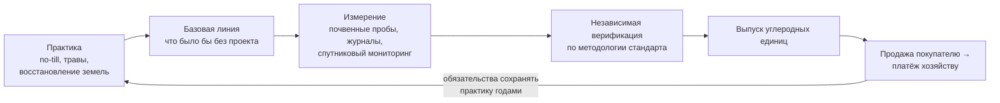

# Разбираемся в зелёных финансах: зелёные кредиты, углеродные платежи и агроэкологические инструменты

> ⏱ **Трудозатраты:** ~15 мин чтения + ~20 мин практики
> Модуль **П14: Субсидии, гранты, финансовые инструменты**, урок 2 из 3.
> Профессиональный уровень (МСБ). Проект UNDP-KAZ FOLUR. Компоненты FOLUR: **1**, **2**, **4**.

## Цели урока и место в модуле

Классические инструменты из [Урока 1](01-karta-istochnikov-finansirovaniya.md) финансируют хозяйство за то, что оно **делает**: производит, покупает, строит. Зелёные финансы добавляют принципиально новый источник — платёж за то, что хозяйство **меняет в экосистеме**: сохраняет влагу и почвенный углерод, снижает деградацию, восстанавливает земли. Для степного земледелия Северного Казахстана это не абстракция: устойчивые практики, которым посвящены модули [П8](../../p8/index.md)–[П13](../../p13/index.md), производят именно те измеримые экологические эффекты, за которые готовы платить «зелёные» кредиторы, углеродные рынки и донорские программы. В этом уроке мы разберём три семейства инструментов — зелёные кредитные продукты, углеродные платежи и агроэкологические инструменты проекта FOLUR — и главный навык работы с ними: понимать, **кто, за что и на основании каких измерений платит**, чтобы отличать реальное предложение от маркетинга.

После изучения урока слушатель сможет:

1. **[Bloom: знать]** перечислять семейства зелёных финансовых инструментов — зелёные кредитные продукты, углеродные платежи добровольных рынков, агроэкологические инструменты донорских проектов — и их обязательный общий элемент: измерение и верификацию эффекта.
2. **[Bloom: понимать]** объяснять цикл углеродного платежа «практика → измерение → независимая верификация → платёж» и то, почему без мониторинга (MRV) углеродный проект невозможен.
3. **[Bloom: применять]** определять для конкретного хозяйства СКО, Костанайской или Акмолинской области, какие его практики производят измеримый экологический эффект и какими открытыми данными этот эффект можно подтвердить.
4. **[Bloom: анализировать]** критически оценивать «зелёные» предложения: проверять, кто платит, за какой верифицируемый результат, на каких условиях, и отбраковывать предложения без внятного механизма измерения.

> **Границы урока.** Внутри: логика зелёных кредитов, устройство углеродных платежей и MRV, агроэкологические инструменты FOLUR в Казахстане, проверка «зелёных» предложений. За рамками: классические субсидии и доноры — в [Уроке 1](01-karta-istochnikov-finansirovaniya.md); сборка заявки — в [Уроке 3](03-sobiraem-zayavku.md); сами агротехнологии, создающие эффекты (no-till, севообороты с бобовыми, водосбережение), — в [П8](../../p8/index.md), [П9](../../p9/index.md), [П12](../../p12/index.md); маркетинг «зелёной» продукции и стандарты цепочек — в [П15](../../p15/index.md); измерение экосистемных услуг — в [П6](../../p6/index.md).

---

## 1. Что делает финансы «зелёными»: платёж за верифицируемый эффект

У всех зелёных инструментов, при внешнем разнообразии, одна конструкция. Есть **практика** — то, что хозяйство делает иначе (минимальная обработка, бобовые в севообороте, восстановление кормовых угодий, водосбережение). Есть **эффект** — измеримое изменение в экосистеме: больше органического вещества и углерода в почве, меньше эрозии, меньше расход воды. И есть **плательщик**, которому этот эффект ценен: банк, снижающий риски портфеля; покупатель углеродных единиц; донор, отчитывающийся о восстановленных гектарах; переработчик, которому нужно «зелёное» сырьё.

Связывает эти три элемента четвёртый, самый недооценённый: **измерение и верификация**. Никто не платит за слова «мы бережём почву» — платят за подтверждённое изменение. Поэтому зелёные финансы неотделимы от мониторинга: журналы операций ([П1](../../p1/index.md)), спутниковые данные ([П3](../../p3/index.md), [П7](../../p7/index.md)), почвенные анализы. Хозяйство, которое умеет документировать свои практики и их эффекты, уже прошло половину пути к зелёному финансированию — независимо от того, какой именно инструмент оно выберет.

Отсюда первый фильтр для любого «зелёного» предложения: если в нём не описано, **что измеряется, кем верифицируется и как связано с платежом**, — перед вами маркетинговая упаковка, а не финансовый инструмент.

---

## 2. Зелёные кредиты: удешевление денег под устойчивость

Зелёный кредит — это обычный возвратный кредит, у которого целевое назначение или условия привязаны к экологическим критериям. Логика кредитора проста: практики устойчивого землепользования снижают долгосрочные риски заёмщика (деградация земли — это ведь и деградация залога, и падение будущей выручки), а банки развития и международные линии дают локальным банкам ресурс именно под «зелёные» портфели. Для заёмщика это может означать доступ к финансированию, которое иначе было бы недоступно или дороже.

Что важно проверять в зелёном кредитном предложении — три вопроса:

1. **Критерии соответствия.** Какие затраты считаются «зелёными» в этом продукте: энергоэффективная техника, водосбережение, органика? Перечни критериев задаются документами кредитора или национальной классификацией «зелёных» проектов; статус и содержание таких классификаций в РК проверяйте в действующих редакциях на официальных источниках (adilet.zan.kz) — урок намеренно не пересказывает их, чтобы не зафиксировать устаревшую версию.
2. **Подтверждение использования.** Как заёмщик доказывает, что деньги пошли на заявленную цель: документы о покупке, акты, иногда — мониторинг результата.
3. **Реальная стоимость денег.** «Зелёный» ярлык не отменяет арифметику кредита: полная стоимость, залоги, график платежей сравниваются с обычными альтернативами, включая удешевлённые государством инструменты из [Урока 1](01-karta-istochnikov-finansirovaniya.md). Иногда «обычный» субсидированный кредит выгоднее «зелёного» — считать надо оба.

Международный источник таких линий в Казахстане — банки развития (ЕБРР и другие), работающие через местные банки-партнёры; действующие программы и участвующие банки проверяются на их официальных сайтах. Правило первоисточника из Урока 1 действует и здесь без исключений.

Практический порядок работы с зелёным кредитом повторяет обычный кредитный, с одним добавленным слоем. Сначала — экономика самого вложения без всякой «зелёности»: окупается ли капельная система или сеялка прямого посева по расчётам профильных модулей. Затем — обычная кредитная арифметика: полная стоимость, залог, график. И только затем — зелёный слой: попадает ли затратная часть в критерии продукта, какие документы подтверждают целевое использование и даёт ли «зелёный» статус реальное преимущество (доступ, условия) по сравнению с альтернативами. Если преимущество не формулируется в одном предложении — его, скорее всего, нет, и выбирать надо просто лучший из доступных кредитов.

> **Подробнее** — экономика конкретных «зелёных» вложений (окупаемость капельного орошения, затраты переходного периода no-till) — в [П12](../../p12/index.md) и [П8](../../p8/index.md). Зелёный кредит финансирует ту экономику, которую вы уже посчитали, — он её не заменяет.

---

## 3. Углеродные платежи: как почва становится активом

Сельское хозяйство — один из немногих секторов, способных не только сокращать выбросы парниковых газов, но и **связывать углерод**: практики вроде минимальной обработки, сохранения растительных остатков, многолетних трав и восстановления деградированных земель увеличивают запас органического углерода в почве. Углеродные рынки превращают это в финансовый поток: связанный (или несокращённый) углерод оформляется в **углеродные единицы**, которые покупают компании, желающие компенсировать свои выбросы.

### 3.1 Цикл углеродного проекта: практика → измерение → верификация → платёж



*Рис. 2. Цикл углеродного платежа: от практики через базовую линию, измерение и независимую верификацию — к выпуску единиц и платежу; обратная стрелка показывает многолетние обязательства участника. Alt: блок-схема из шести узлов по кругу — практика, базовая линия, измерение, верификация, выпуск единиц, платёж; стрелка от платежа назад к практике подписана «обязательства сохранять практику годами».*

Разберём звенья, в которых чаще всего прячутся сюрпризы для хозяйства.

**Базовая линия и дополнительность.** Платят не за углерод вообще, а за **дополнительный** эффект по сравнению со сценарием «без проекта». Если хозяйство уже десять лет работает по no-till, доказать дополнительность нового платежа сложнее — правила зависят от методологии конкретного стандарта.

**MRV — измерение, отчётность, верификация** (measurement, reporting, verification). Это сердце любого углеродного проекта: почвенные пробы по установленной схеме, журналы полевых операций, часто — спутниковый мониторинг практик (например, проверка сохранения растительных остатков по снимкам). Затраты на MRV существенны и ложатся в экономику проекта; именно поэтому углеродные программы обычно агрегируют много хозяйств — поодиночке мелкому участнику MRV не окупить.

**Стандарты и верификаторы.** Добровольные углеродные рынки работают по частным стандартам, каждый — со своими методологиями для агропроектов и реестрами единиц. Верификацию проводит независимая от продавца и покупателя сторона. Предложение «мы посчитаем ваш углерод сами и сами же заплатим» — красный флаг.

**Обязательства и постоянство.** Углерод, связанный почвой, должен в ней остаться: распашка поля через два года после получения платежа обнуляет эффект, поэтому договоры включают многолетние обязательства сохранять практику и механизмы ответственности за «разворот». Подписывая углеродный контракт, хозяйство ограничивает свою свободу агротехнических решений на годы — это цена, которую надо осознанно сравнить с выгодой.

### 3.2 Сколько это стоит — и почему урок не называет цену

Цены углеродных единиц на добровольных рынках сильно различаются — по типу проекта, стандарту, году, качеству верификации — и быстро меняются. Любая цифра, напечатанная в учебном материале, устареет и создаст ложные ожидания, поэтому урок принципиально её не называет. Метод вместо цифры: актуальные ориентиры берутся только из первоисточников — реестров и отчётов самих стандартов, публичных обзоров углеродных рынков, конкретных оферт агрегаторов — и фиксируются в вашей карте источников с датой. Экономику углеродного участия считают на диапазоне цен, а не на одной «обещанной» цифре, и с учётом затрат на MRV и стоимости многолетних обязательств.

!!! warning "Границы применимости"
    Углеродные платежи — дополнение к экономике хозяйства, а не её основа. Проект, который окупается только при высокой цене углерода, — спекуляция; устойчивые практики должны иметь собственный агрономический и экономический смысл (влага, эрозия, урожайность — см. [П8](../../p8/index.md)), а углеродный платёж — усиливать его. Регуляторная среда углеродных рынков продолжает формироваться, в том числе в РК: статус национальных механизмов проверяйте в действующих редакциях НПА на adilet.zan.kz, а условия добровольных программ — в их официальных документах.

---

## 4. Агроэкологические инструменты FOLUR: финансы, встроенные в практику

Третье семейство — инструменты, которые донорские проекты конструируют под конкретную региональную задачу. Казахстанский проект FOLUR (ПРООН/GEF в партнёрстве с МСХ РК) поддерживает переход хозяйств Северного Казахстана к устойчивому землепользованию в том числе через **агроэкологические финансовые инструменты** — по опубликованным материалам ПРООН, среди них форвардные закупки бобовых культур и товарный кредит на семена многолетних трав.

Логика таких инструментов изящна тем, что финансовый механизм совпадает с агрономическим. **Форвардная закупка бобовых**: хозяйству гарантируют закупку урожая бобовых по заранее согласованным условиям — снимается рыночный риск, который удерживает фермера от диверсификации пшеничного севооборота; при этом бобовые в ротации — сами по себе агроэкологическая практика (азотфиксация, оздоровление севооборота — подробно в [П9](../../p9/index.md)). **Товарный кредит на многолетние травы**: хозяйство получает семена сейчас и рассчитывается после; травы восстанавливают деградированные угодья и кормовую базу. В обоих случаях платёж не «за экологию» отдельной строкой — сам инструмент устроен так, что участие в нём и есть внедрение практики.

Для слушателя здесь два вывода. Практический: если ваше хозяйство в ландшафте проекта (СКО, Костанайская, Акмолинская области) и ваши планы включают диверсификацию или восстановление угодий — актуальные возможности участия проверяются напрямую у странового проекта ПРООН (undp.org/kazakhstan) и в каталоге кейсов FOLUR. Методический: донорские инструменты приходят и уходят вместе с проектами, но их конструкция повторяется — гарантия сбыта, товарный кредит, платёж за результат. Умение узнавать конструкцию позволит быстро оценивать и следующие программы, которые придут после FOLUR.

К тому же семейству по духу относятся **платежи за экосистемные услуги** (PES, payments for ecosystem services) — общая рамка, в которой землепользователю платят за поддержание услуг экосистемы: удержание воды, защиту от эрозии, среду для опылителей. Углеродные платежи — частный и самый развитый случай PES; остальные услуги пока чаще монетизируются косвенно — через донорские программы и через аргументацию заявок. Инвентаризацию экосистемных услуг своего хозяйства и их экономическое выражение разбирает модуль [П6](../../p6/index.md): его отчёт — готовая доказательная база для любого инструмента этого урока.

## 5. Сводим семейства: как выбрать своё

Соберём урок в одну навигационную таблицу — по тому же принципу «что взамен», что и карта Урока 1:

| Семейство | Кто платит | За что | Цена участия |
|---|---|---|---|
| Зелёный кредит | Банк (часто с ресурсом банка развития) | Целевое «зелёное» вложение; деньги возвратны | Обычные кредитные требования + подтверждение целевого использования |
| Углеродный платёж | Покупатель углеродных единиц через стандарт и агрегатора | Верифицированный дополнительный эффект (связанный углерод) | Затраты на MRV, многолетние обязательства сохранять практику |
| Агроэкологические инструменты доноров | Донорский проект (ПРООН/GEF и др.) | Внедрение практики, встроенное в сам инструмент (сбыт, товарный кредит) | Участие в целях программы, отчётность; ограниченный срок жизни инструмента |

Порядок примерки к хозяйству прагматичен. Начните с инвентаризации: какие устойчивые практики уже внедрены или запланированы и какими данными они документированы. Затем примерьте самое простое: донорские инструменты, если вы в ландшафте проекта, — у них минимальный порог входа. Кредитную линию рассматривайте под конкретное вложение с уже посчитанной экономикой. Углеродную программу — в последнюю очередь и без спешки: это самые длинные обязательства с самой дорогой верификацией, и они должны усиливать работающую экономику, а не заменять её.

!!! tip "Что это даёт вашему хозяйству"
    Зелёные инструменты меняют статус ваших устойчивых практик: то, что вы делали «для земли» (стерня, травы, бобовые), становится финансовым аргументом — в заявке на грант, в переговорах с банком, в углеродной программе. Инвентаризация уже внедрённых практик и данных, которыми они подтверждены (журналы, снимки, анализы), — первый шаг, он бесплатен и делается за вечер по материалам [П1](../../p1/index.md) и [П3](../../p3/index.md).

---

## Региональный кейс

**Ситуация:** Хозяйство в Костанайской области, пшеничный севооборот, часть полей давно на минимальной обработке. Руководитель прочитал о «деньгах за углерод» и получил от агрегатора углеродной программы предложение: подписать многолетний договор, платёж — «после верификации». Одновременно агроном предлагает включить в ротацию чечевицу, и хозяйство слышало об инструментах проекта FOLUR для бобовых. Нужно трезво оценить оба «зелёных» направления.

**Данные:** страница странового проекта FOLUR на undp.org/kazakhstan и публикация ПРООН об агроэкологических финансовых инструментах (форвардные закупки бобовых, товарный кредит на многолетние травы); каталог кейсов FOLUR (Case Studies Catalogue, Vol. I); Sentinel-2 в браузере Copernicus (dataspace.copernicus.eu) — снимки полей хозяйства после уборки для проверки сохранения растительных остатков; собственные журналы полевых операций хозяйства ([П1](../../p1/index.md)).

**Задача:**

1. По циклу §3.1 составить список вопросов к углеродному предложению: базовая линия и дополнительность (поля уже на минимальной обработке!), схема MRV и кто её оплачивает, стандарт и независимый верификатор, длительность обязательств и ответственность за «разворот» практики.
2. Определить, какими данными хозяйство уже сейчас может документировать свои практики: что дают журналы операций и осенние снимки Sentinel-2 (стерня на поле видна), чего не хватает (почвенные пробы по схеме).
3. Сравнить два направления по конструкции инструмента (§4): что именно гарантирует форвардная закупка бобовых, какой риск она снимает и почему это финансовый инструмент, хотя «денег сверху» не платит.

**Разбор:** Главная развилка кейса — дополнительность: за практику, внедрённую задолго до проекта, углеродный платёж может не полагаться, и честный агрегатор скажет об этом прямо; уклончивый ответ на этот вопрос — повод остановиться. Список вопросов из цикла §3.1 — сам по себе продукт: предложение, у которого нет внятных ответов про стандарт, верификатора и MRV, отбраковывается независимо от обещанных сумм. По данным: журналы + спутниковые снимки закрывают документирование практик, но запас почвенного углерода без полевых проб не подтверждается — это ожидаемая статья затрат. Сравнение конструкций показывает разницу семейств: углеродная программа платит за верифицированный эффект и связывает хозяйство обязательствами, форвардная закупка — снимает рыночный риск диверсификации немедленно и без MRV; для хозяйства, планирующего чечевицу, второй инструмент проще и ближе к агрономии. Точные условия обоих — только из первоисточников: оферта агрегатора и актуальная информация странового проекта ПРООН.

---

## Закрепление и применение

!!! example "Попробуйте в Colab"
    Ноутбук урока — учебная модель чувствительности углеродного проекта: вы вводите собственные допущения (площадь, диапазон цен единицы из первоисточников, затраты на MRV, срок обязательств) — получаете диапазон исходов «от пессимистичного до оптимистичного» и точку безубыточности. Все входные цифры вводит пользователь из проверенных им источников — ноутбук намеренно не содержит «зашитых» цен. Ссылка: `<URL будет назначен при создании репозитория ноутбуков>`. Задание полностью выполнимо и без ноутбука — в обычной таблице.

!!! warning "Границы применимости"
    Урок описывает конструкции инструментов, а не действующие предложения. Наличие, условия и сама доступность зелёных кредитов, углеродных программ и донорских инструментов для конкретного хозяйства проверяются только в первоисточниках на момент решения. Углеродные договоры — многолетние юридические обязательства: перед подписанием — профессиональная юридическая проверка, а не только финансовая прикидка.

!!! question "Кейс для размышления"
    Посредник предлагает хозяйству «зелёный сертификат устойчивого земледелия» за плату, обещая, что с ним «банки дают кредиты дешевле и покупатели платят больше». Примените фильтр §1: кто в этой схеме плательщик за эффект, что измеряется и кем верифицируется? Какие два вопроса посреднику разоблачат схему, если она пустая, — и как выглядел бы честный вариант той же услуги?

### Проверь себя

```quiz
[
  {
    "q": "Какой элемент обязателен для любого настоящего зелёного финансового инструмента?",
    "options": [
      "Слово «зелёный» в названии продукта",
      "Измерение и верификация экологического эффекта, связанные с платежом",
      "Отсутствие обязательств у получателя",
      "Финансирование только органических хозяйств"
    ],
    "answer": 1,
    "explain": "§1: конструкция всех зелёных инструментов — практика → измеримый эффект → плательщик; связывает их измерение и верификация. Предложение без механизма измерения — маркетинг."
  },
  {
    "q": "Что такое «дополнительность» в углеродном проекте?",
    "options": [
      "Дополнительные субсидии от государства к углеродному платежу",
      "Право хозяйства продать единицы дополнительно к урожаю",
      "Надбавка к цене единицы за большой размер хозяйства",
      "Платёж полагается только за эффект сверх сценария «без проекта» — за дополнительное изменение по сравнению с базовой линией"
    ],
    "answer": 3,
    "explain": "§3.1: базовая линия описывает, что было бы без проекта; платят за дополнительный эффект. Поэтому давно внедрённую практику оплатить сложнее — как в региональном кейсе."
  },
  {
    "q": "Почему углеродные договоры включают многолетние обязательства сохранять практику?",
    "options": [
      "Связанный почвой углерод должен в ней остаться: распашка после получения платежа обнуляет эффект, за «разворот» практики предусмотрена ответственность",
      "Чтобы хозяйство не участвовало в других программах",
      "Это требование налогового законодательства",
      "Обязательства нужны только для крупных хозяйств"
    ],
    "answer": 0,
    "explain": "§3.1, звено «постоянство»: платёж делается за долговременное связывание углерода, поэтому контракт ограничивает агротехнические решения на годы — это осознаваемая цена участия."
  },
  {
    "q": "Почему урок не называет цену углеродной единицы?",
    "options": [
      "Цена одинакова во всех программах, называть её излишне",
      "Цена — коммерческая тайна стандартов",
      "Цены добровольных рынков сильно различаются и быстро меняются — напечатанная цифра устареет; актуальные ориентиры берутся из первоисточников, а экономика считается на диапазоне",
      "Углеродные единицы не продаются за деньги"
    ],
    "answer": 2,
    "explain": "§3.2: метод вместо цифры — реестры и отчёты стандартов, оферты агрегаторов, фиксация в карте источников с датой; расчёт на диапазоне цен с учётом затрат на MRV."
  },
  {
    "q": "В чём финансовая суть форвардной закупки бобовых как агроэкологического инструмента FOLUR?",
    "options": [
      "Хозяйству платят премию за каждый гектар бобовых сверх рыночной цены навсегда",
      "Гарантия закупки урожая по заранее согласованным условиям снимает рыночный риск диверсификации — фермеру становится безопасно ввести бобовые в севооборот",
      "Это кредит под залог будущего урожая пшеницы",
      "Инструмент компенсирует затраты на удобрения"
    ],
    "answer": 1,
    "explain": "§4: конструкция инструмента совпадает с агрономической задачей — гарантированный сбыт убирает барьер диверсификации, а сами бобовые в ротации являются устойчивой практикой (П9)."
  }
]
```

## Что дальше?

Теперь у вас полная карта: классические инструменты (Урок 1) и зелёные (этот урок). Осталось превратить выбранную меру в результат: [Урок 3 «Собираем заявку: пакет документов, процедура подачи и типовые ошибки»](03-sobiraem-zayavku.md) проведёт по всей процедуре — от чтения правил меры до лога верификации и самопроверки перед подачей. Агрономическая основа зелёных аргументов — в [П8](../../p8/index.md) (no-till и влага), [П9](../../p9/index.md) (бобовые и севообороты) и [П13](../../p13/index.md) (восстановление и биоразнообразие); продажа «зелёной» продукции — в [П15](../../p15/index.md).
