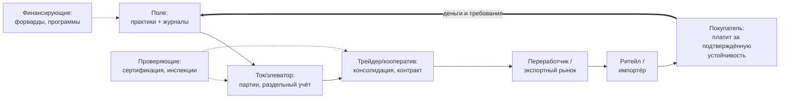

# Строим карту цепочки стоимости: от поля до покупателя «зелёной» продукции

> ⏱ **Трудозатраты:** ~14 мин чтения + ~25 мин практики
> Модуль **П15: Устойчивые цепочки и маркетинг**, урок 1 из 3.
> Профессиональный уровень (МСБ). Проект UNDP-KAZ FOLUR. Компоненты FOLUR: **2**, **4**.

## Цели урока и место в модуле

Хозяйство, внедрившее no-till, севооборот с бобовыми или органическую технологию, произвело две вещи сразу: продукцию и подтверждаемую устойчивость её производства. Первую оно продавать умеет, вторую — как правило, нет: устойчивость остаётся затратами, а не ценой. Первый урок модуля даёт инструмент, с которого начинается любой разговор о «зелёном» маркетинге, — **карту цепочки создания стоимости**: кто и что делает с вашей продукцией от поля до конечного покупателя, где на этом пути «зелёная» ценность создаётся, где подтверждается, а где теряется. На эту карту лягут документы трассируемости ([Урок 2](02-trassiruemost-i-markirovka.md)) и маркетинговый план ([Урок 3](03-marketingovyj-plan.md)).

После изучения урока слушатель сможет:

1. **[Bloom: знать]** перечислять звенья типовой цепочки стоимости зерновой продукции Северного Казахстана и основные семейства стандартов устойчивости, действующих в таких цепочках.
2. **[Bloom: понимать]** объяснять, чем цепочка стоимости отличается от цепочки поставок, почему «зелёная» ценность существует только тогда, когда она передаётся по цепочке без разрывов, и что покупатель на самом деле покупает вместе с «зелёной» продукцией.
3. **[Bloom: применять]** строить карту цепочки стоимости конкретного хозяйства СКО, Костанайской или Акмолинской области на открытых данных (Sentinel-2, OpenStreetMap), помечая звенья создания и потери «зелёной» ценности.
4. **[Bloom: анализировать]** находить в собственной цепочке разрывы, из-за которых устойчивость не доходит до цены, и ранжировать их по стоимости устранения.

> **Границы урока.** Внутри: понятие цепочки стоимости, звенья и участники, ландшафт стандартов устойчивости, методика построения карты цепочки. За рамками: документы, которыми «зелёный» статус передаётся по цепочке, — [Урок 2](02-trassiruemost-i-markirovka.md); сборка маркетингового плана — [Урок 3](03-marketingovyj-plan.md); сама сертификация органики и переходный период — модуль [П10](../../p10/index.md); агротехническое содержание устойчивых практик — [П8](../../p8/index.md), [П9](../../p9/index.md) и академическая основа [А5](../../a5/index.md).

---

## 1. Цепочка стоимости: что это и чем она отличается от «сдал зерно на элеватор»

**Цепочка поставок** отвечает на вопрос «как продукция физически движется»: поле → ток → элеватор → вагон → порт → покупатель. **Цепочка создания стоимости** отвечает на вопрос «где и за счёт чего продукция дорожает»: на каждом звене к ней добавляются свойства, за которые следующий участник готов платить, — очистка и сушка, партия однородного качества, документы происхождения, сертификат, удобная логистика, бренд. Для обычной пшеницы обе цепочки почти совпадают. Для «зелёной» продукции — нет, и в этом весь предмет модуля.

«Зелёная» ценность — устойчивость производства, подтверждённая документами, — создаётся в самом первом звене, на поле. Но платит за неё участник в конце цепочки: переработчик с «зелёной» линейкой, экспортёр с обязательствами перед своим рынком, ритейл с полкой ответственных товаров, конечный потребитель. Между полем и этим покупателем — три-пять звеньев, и на каждом «зелёное» свойство либо передаётся дальше (документом, статусом партии), либо теряется. Смешали партии на общем току — потеряли. Элеватор не ведёт раздельный учёт — потеряли. Трейдер не запросил документы практик — потеряли, причём вместе с надбавкой.

Отсюда первый принцип модуля: **устойчивость становится ценой только в цепочке, которая умеет её передавать**. Хозяйство может быть безупречно устойчивым, но если между ним и платящим покупателем есть хотя бы одно звено-«разрыв», рынок этой устойчивости не увидит. Поэтому маркетинг «зелёной» продукции начинается не с рекламы, а с инженерии цепочки: найти покупателя, который платит за подтверждённую устойчивость, и выстроить до него путь без разрывов.

### 1.1 Типовая цепочка зернового хозяйства Северного Казахстана

Разложим цепочку на звенья — это каркас карты, которую вы построите в практикуме:

1. **Производство** (поле, хозяйство): агротехника, применённые практики, урожай. Здесь создаётся «зелёная» ценность и здесь же рождаются её первичные доказательства — журналы операций ([П1](../../p1/index.md)).
2. **Послеуборочная доработка и хранение** (ток, склад, элеватор): очистка, сушка, формирование партий. Критическое звено для «зелёного» статуса: раздельное хранение и партионный учёт либо есть, либо статус потерян.
3. **Консолидация и торговля** (кооператив, трейдер, экспортёр): сборка товарных партий, контракты, документы происхождения. Звено, где малые объёмы становятся товарными.
4. **Переработка** (мельница, маслозавод, комбикормовый завод): превращение сырья в продукт с маркой; для маркированной «зелёной» продукции — отдельные требования к переработчику.
5. **Дистрибуция и розница / импортёр**: доставка до полки или до границы целевого рынка.
6. **Конечный покупатель**: тот, чья готовность платить за устойчивость финансирует всю цепочку.

Плюс два сквозных участника, которые не владеют продукцией, но определяют правила: **проверяющие** (органы по сертификации, инспекции, лаборатории) и **финансирующие** (банки, программы поддержки, покупатели с форвардными инструментами — о них [П14](../../p14/index.md)).



*Рис. 1. Цепочка создания стоимости «зелёной» продукции: продукция и её «зелёный» статус движутся слева направо, деньги и требования — справа налево; сквозные участники (проверяющие и финансирующие) подключаются к отдельным звеньям. Alt: блок-схема из шести звеньев от поля до покупателя со стрелкой обратной связи «деньги и требования» от покупателя к полю и пунктирными связями проверяющих и финансирующих участников со звеньями хранения, торговли и производства.*

Обратная стрелка на схеме — главное, что отличает взгляд этого модуля от привычного «вырастил — сдал». Требования (стандарт, документы, качество партий) приходят в хозяйство **от покупателя, через все звенья**, и деньги идут тем же маршрутом. Проектировать цепочку нужно от её правого края.

## 2. Ландшафт стандартов устойчивости: за что именно платят

«Зелёная» продукция — бытовое собирательное название, за которым стоят очень разные по строгости и цене входа системы подтверждения. Для планирования удобно различать четыре семейства.

**Семейство 1 — органические стандарты.** Самый строгий и самый юридически защищённый статус: сертификация аккредитованным органом, переходный период, ежегодные инспекции, регулируемая маркировка. Международная базовая рамка — руководства Codex Alimentarius; для экспорта в ЕС действует регламент (ЕС) 2018/848; национальную рамку РК слушатель проверяет в действующей редакции на adilet.zan.kz. Как устроен путь к этому статусу — целиком модуль [П10](../../p10/index.md); в П15 органика участвует как один из вариантов «зелёного» предложения.

**Семейство 2 — добровольные стандарты устойчивости (VSS).** Схемы, подтверждающие устойчивость практик без полного органического запрета синтетических средств: стандарты устойчивого выращивания отдельных культур, схемы ответственных цепочек поставок, отраслевые кодексы. Их сотни, и их требования различаются кардинально — поэтому единственный корректный способ работы с ними: проверить конкретную схему в открытой базе **ITC Standards Map** (standardsmap.org), а не полагаться на слухи о «выгодном стандарте». Общие принципы добросовестной работы самих схем задаёт ISEAL (кодексы надёжной практики стандартизации).

**Семейство 3 — программные и корпоративные «зелёные» цепочки.** Требования формулирует не международный стандарт, а конкретный покупатель или программа: документированные практики, журналы, право проверки. Рабочий пример для нашего региона — **кооперационная платформа по «зелёной пшенице»**, поддерживаемая страновым проектом FOLUR в Казахстане: взаимодействие хозяйств с экспортёрами и ритейлом вокруг документированных устойчивых практик, плюс агроэкологические финансовые инструменты (форвардные закупки бобовых, товарный кредит на многолетние травы — кейсы документированы в каталоге FOLUR, см. [библиографию модуля](../index.md)). Вход в такие цепочки быстрее и дешевле сертификации — это реалистичная первая ступень для большинства хозяйств региона и рабочий канал на время органического переходного периода.

**Семейство 4 — заявления без внешней проверки.** «Эко», «натуральный», «фермерский» без стандарта и проверяющего. С точки зрения этого модуля такие заявления — не актив, а риск: они не дают ценовой защиты, а при недобросовестном употреблении превращаются в гринвошинг с правовыми последствиями ([Урок 2, §3](02-trassiruemost-i-markirovka.md)). Модуль учит переводить заявления из четвёртого семейства в первые три — или честно не делать их вовсе.

Правило выбора между семействами то же, что в [П10, Урок 3](../../p10/lectures/03-rynok-i-dorozhnaya-karta.md), только теперь оно звучит в масштабе всей цепочки: **покупатель определяет стандарт, стандарт определяет цепочку**. Сначала «кому продаём», затем «что для этого подтверждаем», и только затем — «как об этом рассказываем».

> **Подробнее** — как «зелёный» статус документально передаётся по звеньям и как устроена маркировка каждого семейства, разбирает [Урок 2](02-trassiruemost-i-markirovka.md).

## 3. Где «зелёная» ценность теряется: типовые разрывы цепочки

Карта цепочки нужна прежде всего для того, чтобы увидеть разрывы — места, где подтверждённая устойчивость перестаёт следовать за продукцией. В цепочках зернового пояса Северного Казахстана типовых разрывов пять.

**Разрыв 1 — обезличивание на хранении.** Партия с документированной историей ссыпается в общий силос элеватора. Физически зерно то же; юридически и коммерчески «зелёное» свойство исчезло, потому что его больше нельзя привязать к партии. Лечится раздельным хранением, партионным учётом или договором с элеватором о выделенных ёмкостях — всё это стоит денег, и эти деньги должны быть в маркетинговом плане.

**Разрыв 2 — объём меньше товарной партии.** Экспортёру нужны вагонные и судовые партии однородного качества; одиночное хозяйство с небольшим объёмом «зелёной» чечевицы — неудобный контрагент. Лечится кооперацией: общая партия, общий контроль качества, общие переговоры. Кооперационные механизмы на казахстанском материале — включая платформу «зелёной пшеницы» — документированы в каталоге кейсов FOLUR.

**Разрыв 3 — покупатель не запрашивает подтверждение.** Если трейдер покупает «просто пшеницу 3 класса», ваша устойчивость для него не существует: в его контракте нет строки, куда её вписать. Это не повод отказываться от канала — это сигнал, что «зелёная» часть урожая должна идти другим маршрутом, а смешивать маршруты в одной партии нельзя.

**Разрыв 4 — документы не выдерживают проверки.** Покупатель «зелёной» цепочки рано или поздно запросит журналы, историю поля, баланс масс. Если учёт хозяйства живёт «в голове у агронома», разрыв случится в худший момент — при первой серьёзной сделке. Фундамент здесь закладывает [П1](../../p1/index.md); проверочную механику разбирает [Урок 2, §2](02-trassiruemost-i-markirovka.md).

**Разрыв 5 — логистическое плечо съедает надбавку.** Дальний элеватор, грунтовая дорога, отсутствие железнодорожной станции в разумном плече — и надбавка за устойчивость уходит в транспорт. Этот разрыв виден только на карте, и именно поэтому карта цепочки в модуле строится на геоданных, а не в абстрактной таблице.

Работа с разрывами — это и есть «инженерия цепочки» из §1: каждый найденный разрыв получает либо меру устранения с ценой (раздельное хранение, кооператив, договор), либо честное решение «этот маршрут — не для зелёной продукции». Оба решения лучше, чем разрыв, обнаруженный покупателем.

Разрывы, как правило, находятся все сразу, а чиниться могут только по очереди — поэтому их нужно ранжировать. Практичное правило приоритизации: сначала разрывы, которые обнуляют ценность полностью (обезличивание, отсутствие платящего покупателя), затем те, что ограничивают её (объём, логистика), и в последнюю очередь те, что создают риск в будущем (слабые места учёта). Второй критерий — цена устранения относительно эффекта: договор с элеватором о выделенной ёмкости на сезон часто дешевле собственного склада, а вступление в действующий кооператив — дешевле создания нового. Точные цены мер не выдумываются: каждая мера получает в карте пометку «стоимость — уточнить у [источник]» и позже переходит в реестр проверок маркетингового плана ([Урок 3, §4](03-marketingovyj-plan.md)). Ранжированный список разрывов с мерами — это, по сути, инвестиционная программа хозяйства в собственную «зелёную» цепочку, и она куда полезнее любого рекламного бюджета.

## 4. Методика: строим карту цепочки на открытых данных

Карта цепочки в этом модуле — не схема на салфетке, а документ на реальной географии, собираемый за 30–40 минут из трёх открытых источников. Полный проход — в [практикуме](../practicum/01-marketingovyj-plan.md); здесь — логика метода.

**Слой 1 — производство (Sentinel-2 / Copernicus Browser).** Летний снимок хозяйства: поля, их состояние, соседство. Для «истории продукта» ([Урок 3](03-marketingovyj-plan.md)) отсюда же берётся визуальное подтверждение практик: стерня и пожнивные остатки при no-till, полосность севооборота, лесополосы. Точные координаты в публичные материалы не выносятся — работаем с обликом территории.

**Слой 2 — логистика и консолидация (OpenStreetMap).** Элеваторы и зернохранилища, железнодорожные станции, дороги с твёрдым покрытием, райцентры. По ним оцениваются плечи доставки и точки, где физически возможно раздельное хранение партии.

**Слой 3 — участники и требования (открытые источники и переговоры).** Кто покупает «зелёную» продукцию в вашем сегменте: программы «зелёных» цепочек (каталог FOLUR), переработчики с устойчивыми линейками, экспортёры органики. Требования каждого кандидата — только из его документов или базы ITC Standards Map; ёмкости и премии — только из переговоров и свежего ежегодника FiBL/IFOAM, а не из пересказов.

На собранную географию наносятся звенья из §1.1, и каждое звено получает одну из трёх пометок: **«создаёт ценность»** (поле с документированными практиками), **«передаёт ценность»** (звено с раздельным учётом и документами) или **«разрыв»** (звено, где статус теряется). Карта с тремя цветами пометок — это диагноз цепочки и техническое задание на маркетинговый план: план в [Уроке 3](03-marketingovyj-plan.md) будет строиться ровно вокруг того, как монетизировать зелёные звенья и что делать с красными.

Важная оговорка про честность метода: карта фиксирует **то, что есть**, а не то, что хочется показать покупателю. Если раздельного хранения нет — на карте разрыв, а не «планируется». Маркетинговый план, построенный на приукрашенной карте, развалится при первом запросе документов — дороже и позорнее, чем честный план с колонкой «что предстоит построить».

---

## Региональный кейс

**Ситуация.** Хозяйство в Костанайской области: пшеница и чечевица, три года документированного no-till ([П8](../../p8/index.md)), журналы операций ведутся по системе [П1](../../p1/index.md). Урожай традиционно сдаётся на ближайший элеватор «как есть» — без разделения партий и без разговора о практиках. Руководитель прочитал о платформе «зелёной пшеницы» проекта FOLUR и хочет понять: есть ли у хозяйства цепочка, способная донести его устойчивость до платящего покупателя, и где она порвётся.

**Данные.** Летний снимок Sentinel-2 зернового пояса Костанайской области (Copernicus Browser, бесплатно); OpenStreetMap — элеваторы, железнодорожные станции и дороги района; каталог кейсов FOLUR — описание кооперационной платформы «зелёной пшеницы» (см. [библиографию модуля](../index.md)); журналы хозяйства.

**Задача.**

1. Постройте цепочку хозяйства по шести звеньям §1.1 и пометьте каждое звено: «создаёт», «передаёт» или «разрыв».
2. Найдите все пять типовых разрывов §3 в этой цепочке: какие присутствуют, какие нет и почему.
3. Определите по правилу «покупатель определяет стандарт» (§2): к какому семейству стандартов устойчивости хозяйству разумно идти первым шагом?

**Разбор.** Звено 1 у хозяйства зелёное: практики документированы, журналы есть — «зелёная» ценность создаётся и уже имеет первичные доказательства. Дальше цепочка красная: сдача на элеватор «как есть» — это разрыв 1 (обезличивание) в чистом виде, и он обнуляет всё, что создано на поле. Разрыв 3 тоже присутствует: текущий покупатель не запрашивает подтверждений — значит, платящего за устойчивость покупателя в цепочке пока нет вовсе. Разрыв 4, скорее всего, отсутствует (учёт по П1), разрыв 2 нужно проверять объёмами, разрыв 5 — по карте OSM: плечо до элеватора и станции у хозяйства зернового пояса обычно рабочее, но проверяется измерением, а не предположением. Первый шаг по §2 — семейство 3, программная «зелёная» цепочка: у хозяйства уже есть её главное входное условие (документированные практики), вход не требует переходного периода, а платформа «зелёной пшеницы» — документированный в каталоге FOLUR пример такого канала в регионе. Сертификация органики (семейство 1) — возможный второй горизонт, и решение о ней принимается по методике [П10](../../p10/index.md), а не в этом кейсе. Заметьте, чего в разборе нет: ни одной цифры премии или ёмкости рынка — их источник для реального решения только переговоры и подписанные документы.

---

## Закрепление и применение

!!! tip "Что это даёт вашему хозяйству"
    Карта цепочки — самый дешёвый аудит вашего «зелёного» потенциала: полчаса с открытыми данными показывают, дойдёт ли ваша устойчивость до цены и во что обойдётся устранение разрывов. Это разговорный документ сразу для трёх переговоров: с элеватором (раздельное хранение), с соседями (кооперация до товарной партии) и с покупателем «зелёной» цепочки (что вы уже умеете подтвердить).

!!! warning "Границы применимости"
    Карта цепочки — диагностический, а не гарантийный инструмент: зелёная пометка звена означает «статус может передаваться», а не «покупатель обязан заплатить». Ценовые решения существуют только в подписанных договорах. Метод откалиброван под зерновые и зернобобовые цепочки степной зоны; для животноводства, овощеводства закрытого грунта и переработки набор звеньев и разрывов другой, хотя логика та же. Требования конкретных схем устойчивости меняются — перед решением проверяйте их в первоисточнике (ITC Standards Map, документы схемы), а не по этому уроку.

!!! question "Кейс для размышления"
    Два соседних хозяйства внедрили одинаковый no-till. Первое потратило сезон на раздельное хранение и вступило в кооператив, второе — на «эко»-этикетку и страницу в соцсетях. У кого из них «зелёная» продукция в терминах этого урока — и что именно купит у второго хозяйства экспортёр «зелёной» цепочки, когда запросит документы партии?

### Проверь себя

```quiz
[
  {
    "q": "Хозяйство с документированным no-till сдаёт весь урожай на элеватор в общий силос без разделения партий. Что происходит с «зелёной» ценностью продукции в терминах урока?",
    "options": ["Она теряется в звене хранения: без партионного разделения устойчивость больше нельзя привязать к продукции (разрыв 1)", "Она сохраняется: практики ведь реально применялись", "Она переходит к элеватору и учитывается в его цене", "Она восстанавливается автоматически при продаже трейдеру"],
    "answer": 0,
    "explain": "§1 и §3: «зелёное» свойство передаётся по цепочке только документом и статусом партии; обезличивание на хранении — типовой разрыв 1."
  },
  {
    "q": "Чем цепочка создания стоимости отличается от цепочки поставок?",
    "options": ["Цепочка поставок описывает физическое движение продукции, цепочка стоимости — где и за счёт чего продукция приобретает свойства, за которые платит следующий участник", "Ничем, это синонимы", "Цепочка стоимости — только про экспорт, цепочка поставок — про внутренний рынок", "Цепочка стоимости описывает только финансовые потоки банков"],
    "answer": 0,
    "explain": "§1: для обычной продукции обе цепочки почти совпадают, для «зелёной» — нет, потому что ценность-устойчивость требует специальной передачи по звеньям."
  },
  {
    "q": "К какому семейству стандартов устойчивости относится кооперационная платформа «зелёной пшеницы», поддерживаемая проектом FOLUR в Казахстане?",
    "options": ["Программные и корпоративные «зелёные» цепочки: требования формулирует программа/покупатель, вход — документированные практики без полной сертификации", "Органические стандарты с переходным периодом", "Заявления без внешней проверки («эко» на этикетке)", "Государственная обязательная сертификация"],
    "answer": 0,
    "explain": "§2, семейство 3: документированные устойчивые практики и право проверки покупателем — быстрее и дешевле органической сертификации; кейс задокументирован в каталоге FOLUR."
  },
  {
    "q": "Почему проектировать «зелёную» цепочку урок рекомендует «от правого края» — от покупателя?",
    "options": ["Требования (стандарт, документы, качество партий) и деньги приходят в хозяйство от покупателя через все звенья — без платящего покупателя подтверждение устойчивости не окупается", "Потому что покупатель ближе всех к полю", "Потому что так требует законодательство РК", "Потому что левые звенья цепочки не влияют на ценность"],
    "answer": 0,
    "explain": "§1.1, обратная стрелка на рис. 1: покупатель определяет стандарт, стандарт определяет цепочку; сначала «кому продаём», потом «что подтверждаем»."
  },
  {
    "q": "Где по методике урока берутся требования конкретной схемы устойчивости и рыночные ориентиры цен?",
    "options": ["Требования — из документов схемы и базы ITC Standards Map; ценовые ориентиры — из переговоров, договоров и свежего ежегодника FiBL/IFOAM", "Из этой лекции: в ней приведены актуальные премии по каждому стандарту", "Из рекламных материалов консультантов", "Из усреднённых значений по мировому рынку за прошлое десятилетие"],
    "answer": 0,
    "explain": "§4, слой 3: модуль сознательно не приводит цифр премий и ёмкостей — они существуют только в первоисточниках и подписанных документах."
  }
]
```

## Что дальше?

Карта цепочки показала, **где** «зелёная» ценность должна передаваться от звена к звену. [Урок 2 «Подтверждаем устойчивость документами»](02-trassiruemost-i-markirovka.md) разбирает, **чем** она передаётся: трассируемость, партионные документы, маркировка и правила честных «зелёных» заявлений. Если ваш интерес — сертифицированная органика как таковая, параллельно смотрите модуль [П10](../../p10/index.md); если вопрос «чем оплатить устранение разрывов» — модуль [П14](../../p14/index.md).
