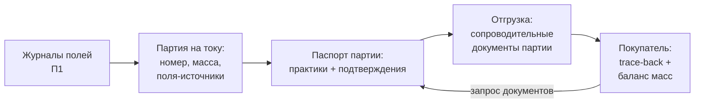

# Подтверждаем устойчивость документами: трассируемость, маркировка, честные «зелёные» заявления

> ⏱ **Трудозатраты:** ~14 мин чтения + ~25 мин практики
> Модуль **П15: Устойчивые цепочки и маркетинг**, урок 2 из 3.
> Профессиональный уровень (МСБ). Проект UNDP-KAZ FOLUR. Компоненты FOLUR: **2**, **4**.

## Цели урока и место в модуле

[Урок 1](01-karta-cepochki-stoimosti.md) показал: «зелёная» ценность передаётся по цепочке не сама собой, а документами. Этот урок разбирает сами документы — три механизма, которыми устойчивость превращается из внутреннего убеждения хозяйства в проверяемое товарное свойство: **трассируемость** (способность проследить партию до поля), **маркировка** (регулируемый язык, которым статус сообщается рынку) и **честные «зелёные» заявления** (что можно и чего нельзя говорить о своей продукции). Без этого урока маркетинговый план [Урока 3](03-marketingovyj-plan.md) был бы набором обещаний; с ним — набором подтверждений.

После изучения урока слушатель сможет:

1. **[Bloom: знать]** перечислять элементы партионной трассируемости «поле → покупатель», уровни маркировки по семействам стандартов и признаки гринвошинга.
2. **[Bloom: понимать]** объяснять, как баланс масс вскрывает подмену продукции, почему экспортная сделка — это документооборот на каждую партию и чем честное «зелёное» заявление отличается от рекламного эпитета.
3. **[Bloom: применять]** собирать паспорт партии для конкретного хозяйства СКО, Костанайской или Акмолинской области и формулировать для его продукции заявления, привязанные к документам.
4. **[Bloom: анализировать]** проверять «зелёные» заявления — свои, поставщика или конкурента — тестом на проверяемость и отбраковывать неподтверждаемые.

> **Границы урока.** Внутри: механика трассируемости и партионного учёта, требования маркировки по семействам стандартов, правила честных заявлений и антигринвошинг, экспортный документооборот в объёме, нужном МСБ. За рамками: организация самих журналов и учёта хозяйства — [П1](../../p1/index.md); процедуры органической сертификации и инспекций — [П10, Урок 2](../../p10/lectures/02-put-sertifikacii.md); упаковка всего этого в маркетинговый план — [Урок 3](03-marketingovyj-plan.md).

---

## 1. Трассируемость: партия, которую можно проследить до поля

**Трассируемость** — способность по любой проданной единице продукции восстановить её путь назад: с какой партии отгружено, из какой ячейки склада, с какого тока, с каких полей, что на этих полях делали и чем это подтверждено. Для покупателя «зелёной» цепочки трассируемость — не бюрократия, а единственный способ убедиться, что он платит за реальную устойчивость, а не за слова. Поэтому запрос «покажите путь этой партии» — стандартная процедура приёмки в любом из трёх серьёзных семейств стандартов [Урока 1, §2](01-karta-cepochki-stoimosti.md).

Технически трассируемость — цепочка записей, каждая из которых связывает продукцию с предыдущим звеном:

1. **Поле**: журнал операций (обработки, внесения, сроки) — ведётся по системе [П1](../../p1/index.md); это первичное доказательство практик.
2. **Уборка**: какая продукция с какого поля, в какие ёмкости.
3. **Ток/склад**: формирование партии — номер, масса, поля-источники, ячейка хранения; раздельно от продукции без статуса.
4. **Отгрузка**: партия → транспорт → покупатель, с сопроводительными документами партии.
5. **Покупатель**: принятая партия сверяется с заявленными документами.

Связующее звено всей конструкции — **партия**: минимальная единица, на уровне которой статус существует. Смешали две партии — получили одну новую, статус которой равен худшему из исходных. Отсюда правило, знакомое по [Уроку 1, §3](01-karta-cepochki-stoimosti.md): раздельное хранение — это не опция, а физический носитель «зелёной» ценности.

Проверяется трассируемость двумя приёмами, и оба стоит освоить до того, как их применит покупатель. **Прослеживание** (trace-back): взять случайную отгрузку и за разумное время собрать по документам её путь до полей — хозяйство с живой трассируемостью делает это за час. **Баланс масс** (mass balance): сопоставить, сколько «зелёной» продукции хозяйство могло произвести (площади × документированная урожайность), сколько хранило и сколько продало. Продано больше, чем могло вырасти, — арифметическое доказательство подмешивания обычной продукции, никакой лаборатории не нужно. Именно балансом масс инспекторы и аудиторы покупателей вскрывают большинство злоупотреблений — и именно поэтому честному хозяйству баланс масс выгоден: он дёшево доказывает добросовестность.

Полезно оценивать собственную систему по трём уровням зрелости. **Уровень 0 — «в голове»**: путь партии знают люди, но документов нет; для «зелёной» цепочки это отсутствие трассируемости, сколь бы честным ни было хозяйство. **Уровень 1 — «бумага и таблицы»**: журналы полей, тетрадь тока, таблица отгрузок; связи между ними восстанавливаются вручную. Этого уровня достаточно для входа в программные цепочки и для прохождения большинства проверок — при условии, что записи ведутся в момент события, а не «восстанавливаются» перед проверкой. **Уровень 2 — «единая система»**: партии, поля и отгрузки связаны идентификаторами в одной таблице или простой базе (инструменты — [П1](../../p1/index.md)); trace-back занимает минуты, баланс масс считается формулой. Подниматься по уровням стоит по мере роста требований покупателя: уровень 2 не обязателен для первой сделки, но обязателен для экспортного контура §2. Важно и обратное: никакая программа или система «уровня 2» не спасёт, если первичные записи не делаются вовремя — цифровизация фиксирует дисциплину, а не заменяет её.

### 1.1 Паспорт партии — рабочий минимум МСБ

Для хозяйства, входящего в «зелёную» цепочку, весь урок сворачивается в один документ — **паспорт партии**: номер и масса партии; поля-источники со ссылками на журналы; применённые практики и чем подтверждены (записи, сертификат, отчёт инспекции); ячейка и режим хранения; кто и когда проверял; отгрузки из партии. Один лист на партию — и запрос любого покупателя перестаёт быть стрессом. Шаблон паспорта вы заполните в [практикуме](../practicum/01-marketingovyj-plan.md), а его место в маркетинговом плане определит [Урок 3, §2](03-marketingovyj-plan.md).



*Рис. 1. Партионная трассируемость: журналы полей собираются в партию, партия получает паспорт, отгрузка сопровождается документами, покупатель проверяет цепочку прослеживанием и балансом масс. Alt: блок-схема из пяти звеньев от журналов полей до покупателя; стрелка обратного запроса документов ведёт от покупателя к паспорту партии.*

## 2. Маркировка: регулируемый язык статуса

Маркировка — то, чем статус партии сообщается следующему звену и конечному покупателю. Ключевой факт, который экономит хозяйствам дорогие ошибки: **строгость правил маркировки зависит от семейства стандарта, и правила всегда живут в первоисточнике, а не в пересказе**.

**Органика (семейство 1)** — самый регулируемый случай: маркировать продукцию как органическую можно только при действующем сертификате и только в отношении партий, на которые он распространяется; на маркировке указывается орган по сертификации, в системах с логотипами — установленные знаки и коды; продукция переходного периода органической не является и маркируется отдельно и строже. Точные требования — из действующей редакции целевого стандарта (для ЕС — регламент (ЕС) 2018/848) и законодательства РК на adilet.zan.kz; механика подробно разобрана в [П10, Урок 3](../../p10/lectures/03-rynok-i-dorozhnaya-karta.md).

**Добровольные схемы устойчивости (семейство 2)** — правила использования знака определяет владелец схемы: какие формулировки разрешены, на каком проценте соответствия, с какой ссылкой на сертификат. Проверяется в документах схемы и в базе ITC Standards Map.

**Программные цепочки (семейство 3)** — публичной маркировки часто нет вовсе: статус живёт в договоре и партионных документах, а «маркетинговое» использование участия в программе регулируется соглашением с ней. Прежде чем писать «участник программы X» на сайте — проверьте, что соглашение это разрешает.

**Экспортный контур.** В международной торговле маркировка опирается на партионный документооборот: помимо сертификата хозяйства, отгружаемая партия сопровождается документами, подтверждающими её статус, а импорт на регулируемые рынки проходит официальные процедуры подтверждения партий (для органики в ЕС — электронное подтверждение каждой ввозимой партии в установленном регламентом порядке). Практическое следствие: экспорт «зелёной» продукции — это документы на **каждую** партию, и кто их оформляет, в какие сроки и за чей счёт — обязательный пункт договора и строка реестра проверок вашего плана. Требования целевого рынка к немаркетинговой части (качество, фитосанитария, контракты) в этом модуле не разбираются — они предмет обычной экспортной практики; «зелёная» часть добавляется поверх, а не вместо неё.

Практичный приём работы с маркировкой — **инвентаризация упаковки и документов**: выпишите каждый элемент вашей этикетки, сайта и коммерческого предложения (слово, знак, логотип, ссылку на программу) и напротив каждого — документ, дающий на него право, с датой действия. Элемент без документа удаляется или переписывается; документ с истекающим сроком получает напоминание. Та же таблица, повторённая для упаковки конкурента или образца «как у всех», быстро показывает, сколько на региональном рынке надписей, не выдерживающих первого же запроса, — и почему хозяйству с полной таблицей выгодно, чтобы покупатели начали спрашивать.

И универсальное правило всех четырёх случаев: если вы не можете назвать документ, который даёт право на конкретную надпись, — надписи быть не должно. Это мост к §3.

## 3. Честные «зелёные» заявления: тест на проверяемость и антигринвошинг

**«Зелёное» заявление** — любое публичное утверждение о экологических свойствах продукции или её производства: на этикетке, сайте, в коммерческом предложении, в переговорах. Урок предлагает один-единственный фильтр, через который обязано пройти каждое заявление хозяйства, — **тест на проверяемость**:

1. **Конкретность**: заявление говорит о проверяемом факте («выращено по no-till, журналы с 2023 года», «сертифицировано по [стандарт], сертификат №, орган»), а не оценочный эпитет («экологично», «чистый продукт»).
2. **Документ**: у заявления есть предъявляемый носитель — журнал, паспорт партии, сертификат, отчёт инспекции.
3. **Границы**: заявление не шире документа. Сертифицирована чечевица — заявление не распространяется на пшеницу; практики применяются с прошлого сезона — не пишем «традиционно».
4. **Актуальность**: документ действует сейчас, а заявление переживёт проверку и через год.

Заявление, не прошедшее любой из четырёх пунктов, — **гринвошинг**: создание «зелёного» впечатления без подтверждения. Для МСБ это не абстрактная этика, а три конкретных риска. Правовой: законодательство о защите прав потребителей и рекламе наказывает вводящие в заблуждение утверждения (действующие нормы РК слушатель проверяет на adilet.zan.kz; на экспортных рынках действуют свои, зачастую более жёсткие правила экологических заявлений). Коммерческий: покупатель «зелёной» цепочки, поймавший поставщика на одном непроверяемом заявлении, перестаёт верить всем остальным — а доверие и есть товар. Репутационный: в тесном региональном рынке история «у них "эко" оказалось словами» живёт годами.

Симметричное следствие теста — **недосказанность тоже ошибка**. Хозяйство, которое три года ведёт документированный no-till и молчит об этом, дарит рынку свою устойчивость бесплатно. Правильный режим — говорить ровно то, что подтверждается, и подтверждать всё, что говорится: «зелёный» маркетинг в этом модуле — дисциплина точности, а не громкости.

Тот же тест работает в обратную сторону — как инструмент анализа чужих материалов. Заявления конкурентов, обещания консультантов («оформим эко-сертификат за неделю»), тексты ИИ-ассистента ([ИИ-задание модуля](../ai-assistant.md)) прогоняются через те же четыре пункта. Что не прошло — не аргумент ни в вашу пользу, ни против вас.

> **Подробнее** — как отобранные заявления складываются в позиционирование и план коммуникаций, разбирает [Урок 3, §2–3](03-marketingovyj-plan.md); как устроены сами сертификаты и инспекции — [П10, Урок 2](../../p10/lectures/02-put-sertifikacii.md).

## 4. Сколько это стоит и где проверять: документная экономика «зелёного» статуса

Трассируемость и маркировка — не бесплатные украшения, и маркетинговый план обязан видеть их цену. Статей затрат четыре, и все они качественные — конкретные числа существуют только в ваших договорах и сметах: **инфраструктура** (раздельные ёмкости, весовое хозяйство, порядок на току); **время** (ведение журналов и паспортов партий — часы, которые надо честно заложить в план); **проверки** (сертификация и инспекции — по договору с органом; для программных цепочек — обычно дешевле или за счёт программы); **документооборот сделок** (партионные и экспортные документы — по договорённости с покупателем, см. §2).

Против этих затрат стоит доход — надбавка канала, доступ к покупателям, которых иначе нет, и финансовые инструменты «зелёных» цепочек ([П14](../../p14/index.md)). Сводить баланс — задача маркетингового плана [Урока 3, §4](03-marketingovyj-plan.md); задача этого параграфа — чтобы в план не попала ни одна выдуманная цифра. Для каждой статьи в реестр проверок плана заносится строка «утверждение → где проверить»: условия элеватора — из его коммерческого предложения; требования схемы — из ITC Standards Map и документов схемы; правила маркировки — из действующей редакции стандарта и adilet.zan.kz; рыночные ориентиры — из свежего ежегодника FiBL/IFOAM и переговоров.

Завершим урок практическим упражнением, которое стоит провести до первой серьёзной сделки, — **репетицией аудита покупателя**. Назначьте «аудитором» человека, не ведущего учёт (партнёра, бухгалтера, коллегу-фермера), и дайте ему три стандартных запроса. Первый: «вот отгрузка за [дата] — покажите её путь до полей» (trace-back по §1; засеките время — час считается хорошим результатом для уровня 1). Второй: «покажите баланс масс по [культура] за сезон» — три числа с документальными источниками. Третий: «обоснуйте каждое "зелёное" утверждение с вашего сайта и из коммерческого предложения» — тест §3 в действии. Результат репетиции оформите так же, как оформит его настоящий аудитор: список замечаний с колонками «замечание → причина → срок устранения». Найденные дыры — подарок: каждая из них, обнаруженная сейчас, стоила часы работы, а обнаруженная покупателем при приёмке первой «зелёной» партии — стоила бы контракта и репутации. Репетицию имеет смысл повторять раз в сезон и после любых изменений в учёте: трассируемость — не документ, который «сделали и положили», а привычка хозяйства, которую проверка лишь фотографирует.

---

## Региональный кейс

**Ситуация.** Хозяйство в Северо-Казахстанской области выращивает чечевицу и ведёт переговоры с экспортным трейдером органики. Сертификат на чечевицу получен в этом сезоне (путь — по [П10](../../p10/index.md)); пшеница хозяйства выращивается по документированному no-till, но не сертифицирована. Трейдер прислал стандартный запрос перед контрактом: описание системы трассируемости, паспорт последней сформированной партии чечевицы, расчёт баланса масс за сезон. Параллельно маркетолог хозяйства подготовил текст для сайта: «Вся продукция хозяйства — сертифицированная органика, выращенная по традиционным чистым технологиям».

**Данные.** Журналы полей и тока хозяйства ([П1](../../p1/index.md)); сертификат на чечевицу (перечень полей и культур в приложении); документы площадей посева; текст маркетолога; для справочной проверки требований — действующая редакция целевого стандарта и adilet.zan.kz.

**Задача.**

1. Соберите паспорт партии чечевицы по минимуму §1.1: какие записи в него входят и из каких журналов берутся?
2. Постройте логику баланса масс по чечевице: какие три величины сопоставит трейдер и что вскроет расхождение?
3. Прогоните текст маркетолога через тест на проверяемость §3 по всем четырём пунктам и перепишите его честно.

**Разбор.** Паспорт партии собирается из уже существующих записей: номер и масса партии с тока, поля-источники из журнала уборки, обработки и внесения из журналов полей, ссылка на сертификат с приложением, ячейка раздельного хранения, отгрузки. Если какой-то записи нет — это найденный до сделки разрыв 4 из [Урока 1, §3](01-karta-cepochki-stoimosti.md), и чинить его дешевле сейчас. Баланс масс: документированная площадь чечевицы × урожайность по журналам уборки против остатков на складе и суммы отгрузок; превышение продаж над возможным производством — признак подмешивания, и трейдер вправе прекратить переговоры. Текст маркетолога проваливает все четыре пункта: «вся продукция» — ложь по границам (сертифицирована только чечевица; пшеница — no-till без сертификата, это другое заявление); «традиционным» — ложь по актуальности и конкретности (no-till внедрён недавно, «традиционность» ничем не подтверждается); «чистым» — эпитет без документа. Честная версия: «Чечевица — сертифицированная органическая продукция ([стандарт], сертификат №, орган по сертификации). Пшеница выращивается по технологии no-till, практики документированы журналами хозяйства с [год]». Такой текст скучнее — и это единственный вид текста, который переживает запрос документов; заодно он корректно продаёт и несертифицированную пшеницу — как кандидата в программную «зелёную» цепочку (семейство 3), а не как фальшивую органику.

---

## Закрепление и применение

!!! tip "Что это даёт вашему хозяйству"
    Паспорт партии и прогон собственного баланса масс — два часа работы, после которых любой запрос покупателя «покажите документы» превращается из угрозы в конкурентное преимущество: большинство соседей по рынку такой готовности не имеют. А тест на проверяемость бесплатно страхует от заявлений, которые могут стоить контракта или штрафа.

!!! warning "Границы применимости"
    Урок даёт каркас, общий для основных систем, но **не заменяет первоисточники**: точные требования маркировки, формулировки и процедуры берутся только из действующей редакции целевого стандарта, документов схемы и законодательства РК (adilet.zan.kz) на момент решения. Правила экологических заявлений на экспортных рынках различаются и обновляются — перед выходом на конкретный рынок проверяйте его актуальные требования. Баланс масс — индикатор, а не приговор: расхождение сначала проверяется на ошибки учёта.

!!! question "Кейс для размышления"
    Покупатель предлагает хозяйству надбавку за «углеродно-нейтральную пшеницу» — при условии, что хозяйство само напишет это на этикетке. Сертификата и методики расчёта у покупателя нет: «все так пишут». Прогоните предложение через тест §3: кто несёт риск этого заявления, какой документ мог бы его подтвердить и есть ли у хозяйства сейчас способ такой документ получить?

### Проверь себя

```quiz
[
  {
    "q": "Трейдер сопоставил документированную площадь и урожайность органической чечевицы хозяйства с объёмом её продаж за сезон. Продажи оказались больше возможного производства. Что это за проверка и что она вскрыла?",
    "options": ["Баланс масс: арифметический признак подмешивания продукции без статуса в «зелёные» партии", "Trace-back: проверка пути одной партии", "Фитосанитарный контроль партии", "Проверка правильности севооборота"],
    "answer": 0,
    "explain": "§1: баланс масс сопоставляет «могло вырасти — хранилось — продано»; превышение продаж — доказательство подмены без всякой лаборатории."
  },
  {
    "q": "Что является минимальной единицей, на уровне которой существует «зелёный» статус продукции в цепочке?",
    "options": ["Партия: смешение двух партий даёт новую партию со статусом худшей из исходных", "Хозяйство в целом", "Культура за все годы выращивания", "Отдельный мешок или биг-бэг"],
    "answer": 0,
    "explain": "§1: статус привязан к партии и её документам; поэтому раздельное хранение — физический носитель «зелёной» ценности (мост к разрыву 1 Урока 1)."
  },
  {
    "q": "Хозяйство сертифицировало чечевицу, а на сайте написало «вся наша продукция — сертифицированная органика». Какой пункт теста на проверяемость нарушен в первую очередь?",
    "options": ["Границы: заявление шире документа — сертификат распространяется только на чечевицу, а не на всю продукцию", "Конкретность: слово «органика» запрещено использовать всегда", "Актуальность: сертификаты не действуют на сайтах", "Никакой: раз есть хоть один сертификат, заявление корректно"],
    "answer": 0,
    "explain": "§3, пункт 3: заявление не может быть шире подтверждающего документа; для пшеницы no-till честное заявление — другое, со ссылкой на журналы."
  },
  {
    "q": "Чем регулируется публичное использование статуса участника программной «зелёной» цепочки (семейство 3) в маркетинге хозяйства?",
    "options": ["Соглашением с программой/покупателем: публичного знака часто нет, статус живёт в договоре и партионных документах", "Единым международным логотипом для всех программ", "Ничем: программные цепочки не накладывают ограничений", "Только законодательством о рекламе, которое разрешает любые упоминания"],
    "answer": 0,
    "explain": "§2: у программных цепочек маркетинговое использование участия определяет соглашение — проверяйте его до публикации «участник программы X»."
  },
  {
    "q": "Какой режим публичных коммуникаций урок называет правильным для «зелёного» хозяйства?",
    "options": ["Говорить ровно то, что подтверждается документами, и подтверждать всё, что говорится, — включая обязанность не молчать о реально документированных практиках", "Не заявлять ничего, чтобы исключить риски", "Заявлять максимум: покупатели редко проверяют", "Использовать только эмоциональные эпитеты без конкретики — к ним нельзя придраться"],
    "answer": 0,
    "explain": "§3: гринвошинг — риск, но и недосказанность — ошибка: недокументированное молчание дарит рынку вашу устойчивость бесплатно; дисциплина точности, а не громкости."
  }
]
```

## Что дальше?

У вас есть карта цепочки ([Урок 1](01-karta-cepochki-stoimosti.md)) и документы, которыми ценность по ней передаётся (этот урок). [Урок 3 «Собираем маркетинговый план»](03-marketingovyj-plan.md) складывает их в прикладной продукт модуля: сегмент, позиционирование, каналы, ценовая логика и план коммуникаций «зелёной» продукции. Организацию самих журналов, если она хромает, подтяните по [П1](../../p1/index.md); процедуры сертификации — по [П10](../../p10/index.md).
